# 10장 실행계획
- 옵티마이저가 항상 좋은 실행계획을 만들지는 못한다
- MySQL 서버 데이터 처리 로직을 잘 이해해서 실행계획을 최적화할 줄 알아야 한다

## 10.1 통계 정보

- 5.7버전까지는 `테이블` 과 `인덱스` 에 대한 개괄적인 정보를 바탕으로 실행계획을 수립했다
    - 테이블 칼럼의 값들의 분포에 대한 정보가 없기 때문에 정확도가 떨어진다
- 8.0버전부터는 데이터 분포도를 수집해서 저장하는 `히스토그램(Histogram)` 이 도입되었다
    - 인덱스되지 않은 칼럼에 대해서도 컬럼의 값의 분포도를 파악하여 통계 정보를 얻을 수 있다
    - 암호화된 테이블의 경우 수집이 불가하다

### 10.1.1 테이블 및 인덱스 통계 정보

- 비용 기반 최적화에서 가장 중요한 정보는 `통계 정보` 이다
- MySQL 서버는 통계 정보의 휘발성이 강했다 ⇒ 메모리 레벨에서 관리되었다
- MySQL 서버에서는 쿼리 실행 계획을 수립할 때 테이블의 데이터를 일부 분석해서 통계 정보로 사용한다

### 10.1.1.1 MySQL 서버의 통계 정보

- 5.6 버전부터는 테이블에 통계 정보를 영구적으로 저장할 수 있게 개선되었다
    - `innodb_index_stats`, `innodb_table_stats`
    
    ```sql
    use mysql;
    
    SHOW TABLES LIKE '%_stats' ;
    ```
    
    
    
- 테이블 생성 시 `STATS_PERSISTENT` 옵션으로 통계 정보를 영구 저장할지 설정한다
    
    ```sql
    //CREATE TABLE
    CREATE TABLE tab_test(fd1 INT, fd2 VARCHAR(20), PRIMARY KEY (fd1))
    ENGINE=InnoDB STATS_PERSISTENT = 0; //{0: 테이블 저장 X, 1: 테이블 저장(default), DEFAULT: innodb_stats_persistence }
    
    //ALTER TABLE
    ALTER TABLE tab_test STATS_PERSISTENT = 1;
    ```
    
- **innodb_index_stats** : 테이블의 인덱스 통계 정보
    
    ```sql
    USE mysql;
    SELECT *
      FROM innodb_index_stats
     WHERE database_name='employees'
       AND table_name='employees';
    
    SELECT COUNT(*) 
      FROM employees; //300,024
    ```
    
    
    
    - stat_name 컬럼 옵션
        - `n_diff_pfx%` : 인덱스가 가진 유니크한 값의 개수
        - `n_leaf_pages` : 인덱스 리프 노드 페이지 수
        - `size` : 인덱스 트리의 전체 페이지 수
        - `n_rows` : 테이블 전체 레코드 수
        - `clustered_index_size` : 프라이머리 키의 크기(InnoDB 페이지 개수)
- **innodb_table_stats** : 테이블의 통계 정보
    
    ```sql
    use mysql;
    SELECT *
      FROM innodb_table_stats
     WHERE database_name='employees'
       AND table_name='employees';
    ```
    
    
    
    - `clustered_index_size` : 프라이머리 키의 크기(InnoDB 페이지 개수)
    - `sum_of_other_index_sizes` : PK를 제외한 인덱스 키의 크기(InnoDB 페이지 개수)
        - 값이 0으로 보이는 경우 STATS_AUTO_RECALC 옵션이 0 인지 확인
- 5.5 버전 이전까지
    - 5.5 버전까지에서 자동으로 통계 정보가 갱신되는 시기
        - 테이블이 새로 오픈되는 경우
        - 테이블의 레코드가 대량 변경되는 경우(1/16)
        - `ANALIZE TABLE` 명령이 실행되는 경우
        - `SHOW TABLE STATUS` 명령이나 `SHOW INDEX FROM` 명령이 실행되는 경우
        - `INNODB` 모니터가 활성화 되는 경우
            - [https://dev.mysql.com/doc/refman/5.6/en/innodb-enabling-monitors.html](https://dev.mysql.com/doc/refman/5.6/en/innodb-enabling-monitors.html)
            - [https://myinfrabox.tistory.com/70](https://myinfrabox.tistory.com/70)
        - `innodb_stats_on_metadata=ON`인 상태에서 `SHOW TABLE STATUS` 명령이 수행된 경우
            - 비영구 통계 갱신 옵션
            - [https://dev.mysql.com/doc/refman/5.7/en/innodb-parameters.html#sysvar_innodb_stats_on_metadata](https://dev.mysql.com/doc/refman/5.7/en/innodb-parameters.html#sysvar_innodb_stats_on_metadata)
    - 통계 정보가 자주 갱신되는 경우 실행계획이 변경될 수 있으므로 성능 이슈가 발생될 수 있다
    - `innodb_stats_sample_pages` 테이블 블록 샘플링 옵션 ⇒ 8.0 버전에서 deprecated
- 5.6 버전에서부터 영구적인 통계 정보를 도입하여 의도하지 않은 통계 정보 변경 이슈를 개선하였다
    - `innodb_stats_auto_recalc` ⇒ 영구 통계 정보 자동 갱신 여부
        - 1 : 테이블 통계 정보 5.5 이전의 방식으로 자동 수집
        - 0 : `ANALYZE TABLE` 명령 실행 시 수집
        - DEFAULT : `innodb_stats_auto_reclac`
    - 통계 정보 수집 시스템 변수
        - `innodb_stats_transient_sample_pages` : 기본값 8. 자동 통계 정보 수집 시 임의로 8개 페이지를 임의로 샘플링하여 통계 정보로 활용한다
        - `innodb_stats_persistent_sample_pages` : 기본값 20. `ANALYZE TABLE` 수행 시 임의로 20개 페이지만 샘플링하여 영구적인 통계 테이블에 저장하고 활용한다

### 10.1.2 히스토그램

- 5.7 버전까지는 단순 인덱스된 칼럼의 유니크한 개수로 통계 정보를 분석했기 때문에 정확도가 많이 떨어졌다
- 8.0 버전부터 칼럼의 데이터 분포도를 참조할 수 있는 `히스토그램(Histogram)`을 활용할 수 있게 되었다

### 10.1.2.1 히스토그램 정보 수집 및 삭제

- 칼럼 단위로 관리되며, `ANALYZE TABLE ... UPDATE HISTOGRAM` 옵션으로 수집, 관리된다
- 수집된 히스토그램은 시스템 딕셔너리에 함께 저장되고, 서버가 시작할 때 `information_schema.column_statistics` 테이블로 로드된다

```sql
ANALYZE TABLE employees UPDATE HISTOGRAM ON gender, hire_date;

SELECT *
  FROM information_schema.COLUMN_STATISTICS
 WHERE SCHEMA_NAME='employees'
   AND TABLE_NAME='employees';

// RESULT
{
  "buckets": [
    [
      1,
      0.5988869164707575
    ],
    [
      2,
      1
    ]
  ],
  "data-type": "enum",
  "null-values": 0,
  "collation-id": 45,
  "last-updated": "2022-10-12 13:14:18.694862",
  "sampling-rate": 0.34843360973874726,
  "histogram-type": "singleton",
  "number-of-buckets-specified": 100
}

{
  "buckets": [
    [
      "1985-02-01 00:00:00.000000",
      "1985-02-28 00:00:00.000000",
      0.009912200738857171,
      28
    ],
    [
      "1985-03-01 00:00:00.000000",
      "1985-03-27 00:00:00.000000",
      0.019833997025380225,
      27
    ]
		//... 
  ],
  "data-type": "datetime",
  "null-values": 0,
  "collation-id": 8,
  "last-updated": "2022-10-12 13:14:18.697411",
  "sampling-rate": 0.34843360973874726,
  "histogram-type": "equi-height",
  "number-of-buckets-specified": 100
}
```

- 히스토그램 타입
    - `singleton` : 칼럼값 개별로 레코드 건수를 관리. `Value-Based 히스토그램` 또는 `도수 분포`
        - 버킷의 칼럼 값, 발생 빈도 비율
    - `equi-height` : 칼럼값의 범위를 균등한 개수로 구분해서 관리. `Height-Balanced 히스토그램`
        - 범위 시작 값, 범위 마지막 값, 발생 빈도, 버킷 포함된 유니크한 값 개수
- 싱글톤 히스토그램 & 높이 균형 히스토그램


- 히스토그램의 비율은 `누적값`으로 표시된다
- `information_schema.column_statistics` 테이블의 `HISTOGRAM` 컬럼 필드
    - `sampling-rate` : 히스토그램 정보 수집을 위해 스캔한 페이지 비율 저장.
    - `historam_type` : 히스토그램 종류 저장
    - `number-of-buckets-specified` : 히스토그램 생성 시 버킷 개수를 저장. 기본값 100
- 8.0.19 이전까지 히스토그램 생성 시 풀 스캔을 통해 샘플링 데이터를 수집하였으나 이후에 개선되었다
    - `샘플링 알고리즘` 지원
- 히스토그램 삭제

```sql
ANALYZE TABLE employees DROP HISTOGRAM ON gender, hire_date;
```

- 삭제 시 딕셔너리 내용만 삭제하기 때문에 성능에 영향을 미치지 않는다
- 히스토그램을 삭제하지 않고 비활성화하는 방법:  `condition_fanout_filter=off`  p.348

### 10.1.2.2 히스토그램의 용도

- 인덱스 정보만으로는 정확한 통계 정보를 파악하기 어렵다 ⇒ 데이터가 균등적으로 분포하지 않기 때문
- 히스토그램은 특정 칼럼이 가지는 각 범위(버킷)별 레코드의 건수와 유니크한 값의 개수 정보를 활용하여 훨씬 더 정확한 예측을 할 수 있다
    
    ```sql
    EXPLAIN
    SELECT *
      FROM employees
     WHERE first_name='Zita'
       AND birth_date BETWEEN '1950-01-01' AND '1960-01-01';
    ```
    
    
    
    ```sql
    ANALYZE TABLE employees UPDATE HISTOGRAM ON first_name, birth_date;
    
    EXPLAIN
    SELECT *
      FROM employees
     WHERE first_name='Zita'
       AND birth_date BETWEEN '1950-01-01' AND '1960-01-01';
    ```
    
    
    
    - ex) 143 / 224 * 100 ⇒ 63.8%
- 히스토그램 성능 이슈 테스트
    
    ```sql
    EXPLAIN
    SELECT /*+ JOIN_ORDER(e, s) */ *
      FROM salaries s
        INNER JOIN employees e ON s.emp_no = e.emp_no
                    AND e.birth_date BETWEEN  '1950-01-01' AND '1950-02-01'
    WHERE s.salary BETWEEN 40000 AND 70000;
    // 300ms
    
    EXPLAIN
    SELECT /*+ JOIN_ORDER(s, e) */ *
      FROM salaries s
        INNER JOIN employees e ON s.emp_no = e.emp_no
                    AND e.birth_date BETWEEN  '1950-01-01' AND '1950-02-01'
    WHERE s.salary BETWEEN 40000 AND 70000;
    // 1s 600ms
    ```
    
    
    
    
    

### 10.1.2.3 히스토그램과 인덱스

- MySQL 서버는 사용 가능한 인덱스로부터 조건절에 일치하는 레코드 건수를 파악한 뒤 실행 계획을 수립한다
    - 레코드 건수를 예측하기 위해 실제 인덱스의 B-Tree를 샘플링하여 살펴본다 ⇒ `인덱스 다이브`
- 히스토그램 vs 인덱스 ??
    - 인덱스된 칼럼을 검색 조건으로 사용하는 경우 MySQL은 `인덱스 다이브`를 사용한다
    - 실제 검색 조건의 대상 값에 대한 샘플링을 실행하기 때문에 훨씬 정확도가 높다
    - MySQL 8.0버전에서는 히스토그램은 주로 인덱스되지 않은 칼럼에 대한 참조용으로 사용된다

### 10.1.3 코스트 모델(Cost Model)

- 서버가 쿼리를 처리하려면 다음과 같은 작업이 필요하다
    - 디스크로부터 데이터 페이지 읽기
    - 메모리(InnoDB 버퍼 풀)로부터 데이터 페이지 읽기
    - 인덱스 키 비교
    - 레코드 평가(?)
    - 메모리 임시 테이블 작업
    - 디스크 임시 테이블 작업
- 쿼리 비용을 계산하는 데 필요한 단위 작들의 비용을 `코스트 모델(Cost Model)` 이라 한다
- 5.7버전부터 DBMS 관리자가 작업 비용을 조절할 수 있게 개선되었으나 권장하지는 않는다
- 코스트 모델 관련 테이블
    - `server_cost` : 인덱스가 찾고 레코드를 비교하고 임시 테이블 처리에 대한 비용 관리
    - `engine_cost` : 레코드가 가진 데이터 페이지를 가져오는 데 필요한 비용 관리
- 8.0 버전에서 지원하는 단위 작업
    - [https://dev.mysql.com/doc/refman/5.7/en/cost-model.html](https://dev.mysql.com/doc/refman/5.7/en/cost-model.html)
- Cost 비용 확인 방법
    
    ```sql
    //JSON 방식
    EXPLAIN FORMAT=JSON
    SELECT *
      FROM employees
     WHERE first_name='Matt';
    
    //RESULT
    {
      "query_block": {
        "select_id": 1,
        "cost_info": {
          "query_cost": "81.55"
        },
        "table": {
          "table_name": "employees",
          "access_type": "ref",
          "possible_keys": [
            "ix_firstname"
          ],
          "key": "ix_firstname",
          "used_key_parts": [
            "first_name"
          ],
          "key_length": "58",
          "ref": [
            "const"
          ],
          "rows_examined_per_scan": 233,
          "rows_produced_per_join": 233,
          "filtered": "100.00",
          "cost_info": {
            "read_cost": "58.25",
            "eval_cost": "23.30",
            "prefix_cost": "81.55",
            "data_read_per_join": "78K"
          },
          "used_columns": [
            "emp_no",
            "birth_date",
            "first_name",
            "last_name",
            "gender",
            "hire_date",
            "full_name"
          ]
        }
      }
    }
    
    //단순 테이블
    EXPLAIN FORMAT=TRADITIONAL 
    SELECT *
      FROM employees
     WHERE first_name='Matt';
    
    //트리 방식  
    EXPLAIN FORMAT=TREE 
    SELECT *
      FROM employees
     WHERE first_name='Matt';
    ```
    
    - 8.0.19 버전부터는 `FORMAT=TREE` ⇒ `EXPLAIN ANALYZE` 로 대체되었다
        - [https://dev.mysql.com/doc/refman/8.0/en/explain.html](https://dev.mysql.com/doc/refman/8.0/en/explain.html)

## 10.2 실행 계획 확인

### 10.2.1 실행 계획  출력 포맷

- `테이블 포맷` ⇒ DEFAULT, FORMAT=TRADITIONAL
- `트리 포맷` ⇒ EXPLAIN ANALYZE(8.0.19 이후), FORMAT=TREE(이전 버전)
- `JSON 포맷` ⇒ FORMAT=JSON

### 10.2.2 쿼리 실행 시간 확인

- `EXPLAIN ANALYZE`
- `SHOW PROFILE` 명령도 가능하나 단계별 소요 정보를 보여주지 않는다

```sql
EXPLAIN ANALYZE
SELECT e.emp_no, avg(s.salary)
FROM employees e
         INNER JOIN salaries s ON e.emp_no = s.emp_no
    AND s.salary > 50000
    AND s.from_date <= '1990-01-01'
    AND s.to_date > '1990-01-01'
WHERE e.first_name = 'Matt'
GROUP BY e.emp_no;
```

```sql
-> Group aggregate: avg(s.salary)  (cost=332.23 rows=122) (actual time=0.074..1.707 rows=48 loops=1)
    -> Nested loop inner join  (cost=320.00 rows=122) (actual time=0.039..1.688 rows=48 loops=1)
        -> Covering index lookup on e using ix_firstname (first_name='Matt')  (cost=25.80 rows=233) (actual time=0.028..0.090 rows=233 loops=1)
        -> Filter: ((s.salary > 50000) and (s.from_date <= DATE'1990-01-01') and (s.to_date > DATE'1990-01-01'))  (cost=0.32 rows=1) (actual time=0.006..0.007 rows=0 loops=233)
            -> Index lookup on s using PRIMARY (emp_no=e.emp_no)  (cost=0.32 rows=9) (actual time=0.004..0.006 rows=10 loops=233)
```

- Tree 구조 실행 순서 규칙
    - 들여쓰기가 같은 레벨에서는 상단에 위치한 라인이 먼저 실행
    - 들여쓰기가 다른 레벨에서는 가장 안쪽에 위치한 라인이 먼저 실행
    
    
### 10.2.2.1 DB 툴을 활용한 쿼리 실행 시간 확인

- DataGrip
    
    
    
- WorkBench(Visual Explain)
    
    
    
    
## 10.3 실행 계획 분석

- 표의 각 라인(레코드)은 쿼리 문장에서 사용된 테이블(임시 테이블 포함)의 개수만큼 출력된다
- 실행 순서는 위에서 아래로 표시(uion이나 상관 쿼리는 예외)된다
- 실행 계획에서 위쪽에 출력된 결과일수록 쿼리의 바깥 부분이거나 먼저 접근한 테이블이다

### 10.3.1 id 칼럼

- `SELECT` 키워드를 단위로 구분한 것을  `단위 쿼리` 라 하며, `id` 칼럼은 단위 쿼리 개수만큼 출력된다
- 테이블 조인의 경우 테이블 개수만큼 레코드가 출력되지만 `id` 값은 동일하다
- 조인 쿼리 예시
    
    ```sql
    EXPLAIN
    SELECT e.emp_no, e.first_name, s.from_date, s.salary
      FROM employees e, salaries s
     WHERE e.emp_no = s.emp_no
     LIMIT 10;
    ```
    
    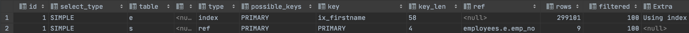
    
    - 조인 쿼리라 같은 `id` 값을 가진다
- 3개의 단위 SELECT 쿼리로 구성된 쿼리 예제
    
    ```sql
    EXPLAIN
    SELECT
    ( (SELECT COUNT(*) FROM employees) + (SELECT COUNT(*) FROM departments) ) AS total_count;
    ```
    
    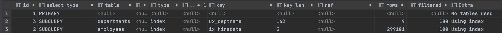
    
    - 단위 쿼리의 개수만큼 `id` 값을 가진다
    - 실행 계획이  `id` 칼럼이 테이블 접근 순서를 의미하지 않는다

### 10.3.2 select_type 컬럼

### 10.3.2.1. SIMPLE

- `UNION` 이나 `서브쿼리` 를 사용하지 않는 단순 SELECT 쿼리를 표현한다
- 일반적으로 제일 바깥 `SELECT` 쿼리의 `select_type` 이 `SIMPLE` 로 표시된다

### 10.3.2.2 PRIMARY

- `UNION` 이나 `서브쿼리` 를 사용하는 실행 계획에서 가장 바깥쪽에 있는 단위 쿼리를 표현한다

### 10.3.2.3 UNION

- `UNION` 으로 결합하는 단위 쿼리 가운데 첫 번쨰를 제외한 두 번째 이후의 단위 쿼리를 표시한다
- 첫 번째 단위 쿼리는 `UNION` 결과를 모아서 저장하는 `임시 테이블(DERIVED)` 이다

```sql
EXPLAIN
SELECT *
FROM (
             (SELECT emp_no FROM employees e1 LIMIT 10)
             UNION ALL
             (SELECT emp_no FROM employees e2 LIMIT 10)
             UNION ALL
             (SELECT emp_no FROM employees e3 LIMIT 10)
     ) tb;
```

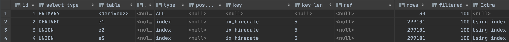

### 10.3.2.4 DEPENDENT UNION

- `UNION` 이나 `UNION ALL` 로 결합된 단위 쿼리가 외부 쿼리에 의해 영향을 받는 쿼리를 표현한다

```sql
EXPLAIN
SELECT *
  FROM employees e1 WHERE e1.emp_no IN (
      SELECT e2.emp_no FROM employees e2 WHERE e2.first_name = 'Matt'
      UNION
      SELECT e3.emp_no FROM employees e3 WHERE e3.last_name = 'Matt'
    );
```

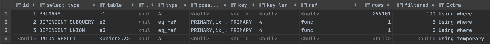

### 10.3.2.5 UNION RESULT

- `UNION` 의 결과를 담아두는 테이블을 말한다
- `UNION` 의 결과는 임시 테이블로 생성되지만 8.0 버전부터 `UNION ALL` 은 임시 테이블을 사용하지 않는다
- UNION 사용 예시 ⇒ 임시 테이블 사용

```sql
EXPLAIN
SELECT emp_no
  FROM salaries WHERE salary > 100000
UNION DISTINCT
SELECT emp_no
  FROM dept_emp
 WHERE from_date > '2001-01-01';
```

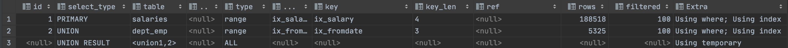

- UNION ALL 사용 예시 ⇒ 임시 테이블을 사용하지 않는다

```sql
EXPLAIN
SELECT emp_no
  FROM salaries WHERE salary > 100000
UNION ALL
SELECT emp_no
  FROM dept_emp
 WHERE from_date > '2001-01-01';
```

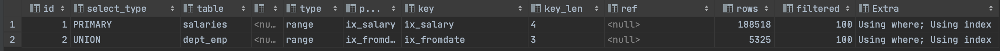

### 10.3.2.6 SUBQUERY

- `FROM` 절 이외에서 사용되는 서브쿼리 ↔ `파생 테이블(DERIVED)`

```sql
EXPLAIN
SELECT e.first_name,
      (SELECT COUNT(*)
         FROM dept_emp de, dept_manager dm
        WHERE dm.dept_no = de.dept_no) AS cnt
  FROM employees e
 WHERE e.emp_no = 10001;
```

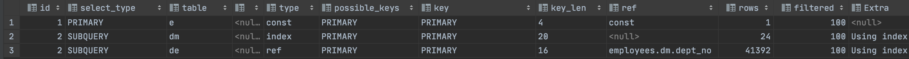

- 서브쿼리의 위치별 명칭
    - `중첩된 쿼리(Nested Query)` : SELECT 절에서 사용된 서브쿼리
    - `서브쿼리(Subquery)` : WHERE 절에서 사용된 서브쿼리
    - `파생 테이블(Derived Table)` : FROM 절에서 사용된 서브쿼리
- 서브쿼리가 반환하는 값의 특성에 따른 구분
    - `스칼라 서브쿼리(Scalar Subquery)` : 하나의 값(컬럼이 단 하나인 레코드 1건)만 반환되는 쿼리
    - `로우 서브쿼리(Row Subquery)` : 컬럼의 개수와 관계없이 하나의 레코드만 반환

### 10.3.2.7 DEPENDENT SUBQUERY

- 서브쿼리가 바깥쪽 `SELECT` 쿼리에서 정의된 칼럼을 사용하는 경우 표시한다

```sql
EXPLAIN
SELECT e.first_name,
       (SELECT COUNT(*)
        FROM dept_emp de,
             dept_manager dm
        WHERE dm.dept_no = de.dept_no
          AND de.emp_no = e.emp_no
       ) AS cnt
FROM employees e
WHERE e.emp_no = 10001;
```

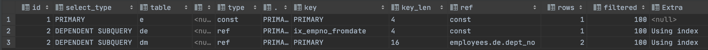

- 외부 쿼리가 먼저 수행 된 후 내부 쿼리가 수행되야 하기 때문에 일반 서브 쿼리보다 처리 속도가 느리다

### 10.3.2.8 DERIVED

- `FROM` 절의 서브쿼리. `파생 테이블`
- `DERIVED` 는 메모리나 디스크에 임시 테이블의 생성을 의미하며, 5.6 버전부터는 임시 테이블에 인덱스를 추가할 수 있게 최적화되었다

```sql
EXPLAIN
SELECT *
  FROM (SELECT de.emp_no FROM dept_emp de GROUP BY de.emp_no) tb,
       employees e
 WHERE e.emp_no = tb.emp_no;
```

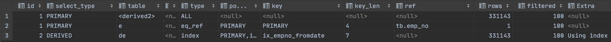

- 8.0 버전부터는 `FROM` 절의 서브쿼리에 대해 최적화가 되었지만 불필요한 서브쿼리는 조인으로 재작성하라

### 10.3.2.9  DEPENDENT DRIVED

- `래터럴 조인(LATERAL JOIN)` 기능이 추가되어 `FROM` 절의 서브쿼리에서도 외부 칼럼을 참조할 수 있다

```sql
EXPLAIN
SELECT *
  FROM employees e
 LEFT JOIN LATERAL (
     SELECT *
       FROM salaries s
      WHERE s.emp_no = e.emp_no
      ORDER BY s.from_date DESC LIMIT 2
      ) AS s2
 ON s2.emp_no = e.emp_no;
```

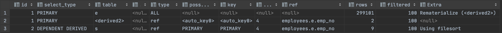

### 10.3.2.10 UNCACHEABLE SUBQUERY

- 서브 쿼리의 결과를 내부적인 캐시 공간에 담아둘 수 있는데 이러한 기능을 사용할 수 없을 때 표현된다
- 서브 쿼리 결과를 캐시할 수 없는 경우
    - 사용자 변수가 서브쿼리에 사용된 경우
    - `NOT_DETERMINISTIC` 속성의 스토어드 루틴이 서브쿼리 내에 있는 경우
        - [NOT-DETERMINISTIC](http://intomysql.blogspot.com/2010/12/stored-function-not-deterministic.html)
    - `UUID()` 나 `RAND()` 와 같이 결괏값이 호출항 떄마다 달라지는 함수가 서브쿼리에 사용된 경우

```sql
EXPLAIN
SELECT *
FROM employees e
WHERE e.emp_no = (
    SELECT @status
    FROM dept_emp de
    WHERE de.dept_no = 'd005'
);
```

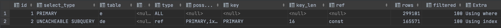

### 10.3.2.11 UNCACHEABLE UNION

- `UNION` + `UNCACHEABLE`

### 10.3.2.12 MATERIALIZED

- `FROM` 절이나 `IN(subquery)` 형태의 쿼리에서 사용된 서브쿼리의 최적화를 위해 사용된다

```sql
EXPLAIN
SELECT *
  FROM employees e
 WHERE e.emp_no IN (SELECT emp_no FROM salaries WHERE salary BETWEEN 100 AND 1000)
```

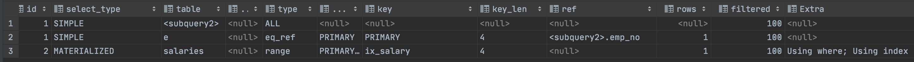

- 5.7버전부터 서브쿼리의 내용을 임시 테이블로 `구체화(Materilzation)`한 뒤 다른 테이블과 조인한다
- `MATERIALIZED` 키워드는 쿼리 내용이 임시 테이블로 생성한다는 의미를 가진다

### 10.3.3 table 컬럼

- 테이블 이름의 별칭
- `<>` 표시는 임시 테이블을 의미한다
- `<>` 안의 숫자는 `id` 컬럼을 의미한다

### 10.3.4 partitions 컬럼
- [파티션이란?](https://hoing.io/archives/7909)
- `파티션` 정보를 나타낸다. 
- 파티션이 여러 개인 테이블에서 불필요한 파티션을 빼고 쿼리를 수행하기 위해 테이블을 골라내는 과정을 `파티션 프루닝(Partition pruning)` 이라고 한다
    - 타입 컬럼의 `ALL` 로 표시되는 것은 `partitions` 칼럼의 파티션들만 접근했다는 것을 의미한다
    - 파티션은 물리적으로 별도의 저장 공간을 가지므로 해당 파티션들만 풀 스캔한다


### 1.0.3.5 type 컬럼

- `type` 이후의 칼럼은 각 테이블의 레코드를 어떤 방식으로 읽었는 지를 나타낸다
- type 컬럼 성능 순 정렬(아래로 내려갈수록 성능이 떨어진다)
    - system
    - const
    - eq_ref
    - ref
    - fulltext
    - ref_or_null
    - unique_subquery
    - index_subquery
    - range
    - index_merge
    - index
    - ALL

### 10.3.5.1 system

- `MyISAM` 이나 `MEMORY` 테이블에서 사용
- 레코드가 한 건만 존재하는 테이블 또는 한 건도 존재하지 않는 테이블
- 실용성이 없다

### 10.3.5.2 const

- 테이블 레코드 건수와 관계없이 프라이머리 키나 유니크 키 칼럼을 이용해서 반드시 1건을 반환하는 쿼리
- `UNIQUE INDEX SCAN`

### 10.3.5.3 eq_ref

- 결과가 1건이어야 한다
- 여러 테이블이 조인되는 쿼리 실행 계획에서 표시된다
- 조인 시 두번째 이후의 테이블의 칼럼에 표시된다
- `NOT NULL` 이어야 하며, 다중 칼럼일 경우 모든 칼럼을 비교 조건에 넣어야 한다

### 10.3.5.4 ref

- 조인 순서와 관계없이 사용되며, 프라이머리 키, 유니크 키 등의 제약조건이 없다
- 1건 이상의 결과가 나올 수 있으며, 동등 조건 비교 시 매우 빠른 레코드 조회 방법이다

### 10.3.5.5 fulltext

- 전문 검색 조건 시 사용된다
- `MATCH AGAINST` 구문 시 사용되며, `PRIMARY KEY` 보다 낮은 우선순위를 가진다
    - `const`, `eq_ref`, `ref` 가 아닌 경우 사용

### 10.3.5.6 ref_or_null

- `ref` + `NULL 비교` 형태이다

### 10.3.5.7 unique_subquery

- 서브쿼리에서 중복되지 않는 유니크한 값만 반환하는 경우 표시된다

### 10.3.5.8 index_subquery

- `IN(subquery)` 에서 subquery 가 중복된 값을 반환할 수 있는데 중복된 값을 인덱스를 통해 제거할 수 있을 때 표시된다
- unique_subquery 와 index_subquery 비교
    - `unique_subquery` : 중복이 없으므로 별도 중복 제거 작업이 필요하지 않음
    - `index_subquery` : 인덱스를 이용해 중복된 값을 제거하는 작업이 필요하다

### 10.3.5.9 range

- 인덱스 래인지 스캔 형태
- `<` , `>` , `IS NULL` , `BETWEEN` , `IN` , `LIKE` 등의 연산자를 이용해 인덱스 검색 시 사용된다

### 10.3.5.10 index_merge

- 2개 이상의 인덱스를 이용해 그 결과를 병합하는 방식이다
    - 여러 인덱스를 읽어야 하기 때문에 `range` 접근 방식보다 효율성이 떨어진다
    - 전문 검색 인덱스 쿼리에서 사용 불가하다
    - 결과가 항상 2개 이상의 집합이므로 부가적인 작업이 필요하다

### 10.3.5.11 index

- `인덱스 풀 스캔`을 의미한다
- 사용 조건
    - `range` 나 `const`, `ref` 같은 접근 방법으로 인덱스를 사용하지 못하는 경우
    - 인덱스에 포함된 컬럼으로만 처리할 수 있는 경우
    - 인덱스를 이용해 정렬이나 그루핑 작업이 가능한 경우

### 10.3.5.12 ALL

- `풀 테이블 스캔`을 의미한다
- 가장 비효율적인 방법으로 `리드 어헤드(Read Ahead)` 방법을 사용하여 여러 페이지를 한 번에 처리한다


### 10.3.6 possible_keys 칼럼

- 옵티마이저 최적 실행 계획 후보 인덱스
- 쿼리 튜닝하는데 중요하지 않다
- 개인적으로는 어떤 인덱스를 사용 가능할 지 알려주기 때문에 인덱스 사용 확인 시 좋은 것 같다

### 10.3.7 key 칼럼

- 최종 선택된 실행계획에서 사용하는 인덱스
- `index_merge` 의 경우 `,` 구분자를 사용한다

### 10.3.8 key_len 칼럼

- 사용된 key의 길이를 의미한다
- 다중 칼럼으로 구성된 경우 인덱스에서 몇 개의 칼럼까지 사용하는지 알 수 있다

```sql
EXPLAIN
SELECT *
  FROM dept_emp
 WHERE dept_no='d005' // utf8mb4(1~4바이트) => 메모리 공간에 할당할 때는 4바이트로 계산한다
// dept_no CHAR(4) => 4 * 4 = 16
```

- `NULLABLE` 칼럼의 경우 Null 값 표기를 위해 1 바이트를 더 사용한다

### 10.3.9 ref 칼럼

- 참조 조건(Equal 비교 조건) 값을 표시한다
- 상수값은 `const` , 다른 테이블 컬럼 값이면 테이블명과 칼럼명이 표시된다
- `Function` 은 연산 참조 시 표시된다
    - ex) e.emp_no=(de.emp_no-1)

### 10.3.10 rows 칼럼

- 실행 계획의 효율성 판단을 위해 예측했던 레코드 건수를 나타낸다 ⇒ 예측값

### 10.3.11 filtered 칼럼

- 필터링되고 남은 레코드의 비율
- MySQL8.0 버전부터 filtered 값을 더 정확하게 예측하기 위해 히스토그램 기능이 도입되었다

### 10.3.12 Extra 칼럼

- 성능에 관련된 중요한 내용이 자주 담겨 있기 때문에 잘 살펴볼 것을 권장한다

### 10.3.12.1  const row not found

- `const` 접근 방법으로 테이블을 읽었지만 해당 테이블에 레코드가 1건도 존재하지 않는 경우

### 10.3.12.2 Deleting all rows

- 스토리지 엔진의 핸들러 차원에서 테이블의 모든 레코드를 삭제하는 경우 표시

### 10.3.12.2 Distinct

- `Distinct` 명령을 사용하여 중복 없이 유니크하게 가져오는 경우 표시

### 10.3.12.4 FirstMatch

- 세미 조인 최적화 중 `FirstMatch` 전략을 사용하는 경우 표시
- `FirstMatch(table_name)` 형식으로 표기

### 10.3.12.5 Full scan on Null key

- `col1 IN (SELECT col2 FROM ...)` 조건에서 자주 발생한다 ⇒ 성능 상 좋지 못하다
    - `col1` 칼럼이 `Null` 값을 가지는 경우
- Null 연산 규칙
    - 서브쿼리가 1건이라도 결과 레코드를 가진다면 최종 비교 결과는 NULL
    - 서브쿼리가 1건도 결과 레코드를 가지지 않는다면 최종 비교 결과는 FALSE
- col1이 NULL인 경우 서브쿼리 테이블에 대해 풀 테이블 스캔을 사용할 것을 알려주는 키워드
    - 성능 개선을 위해 선행 조건에 `col1 IS NOT NULL` 을 명시해서 회피할 수 있다

### 10.3.12.6 Impossible HAVING

- `HAVING` 절 조건을 만족하는 레코드가 없는 경우

### 10.3.12.7 Impossible WHERE

- `WHERE` 조건이 항상 FALSE가 되는 경우

### 10.3.12.8 LooseScan

- 세미 조인 최적화 중 `LooseScan` 전략을 사용하는 경우 표시

### 10.3.12.9 No maching min/max row

- `MIN()`, `MAX()` 와 같은 집합 함수가 있는 쿼리의 조건절에 일치하는 레코드가 없는 경우

### 10.3.12.10 no matching row in const table

- 조인 사용 테이블에서  `const` 방법으로 접근할 때 일치하는 레코드가 없는 경우

### 10.3.12.11 No matching rows after partition pruning

- 파티션 된 테이블에 대해 `UPDATE` 또는 `DELETE` 할 레코드 대상이 없는 경우 표시

### 10.3.12.12 No tables used

- `FROM` 절에 상수 테이블이 사용되는 경우

### 10.3.12.13 Not exists

- `안티-조인(Anti-JOIN)` 형태를 사용할 때 표시
- 레코드의 건수가 많은 경우 `NOT IN` , `NOT EXISTS` 보다 `아우터 조인(Outer Join)`이 성능이 좋다

```sql
//department 테이블에 조인 조건이 만족하는 레코드가 여러 개 있더라도 1건만 조회하고 처리
EXPLAIN
SELECT *
  FROM dept_emp de
  LEFT JOIN departments d ON de.dept_no = d.dept_no
 WHERE d.dept_no IS NULL;
```

### 10.3.12.14 Plan isn’t ready yet

- 다른 커넥션에서 실행 중인 쿼리의 실행 계획을 확인할 수 있다

```sql
//SESSION 1 
SELECT *
  FROM employees
 WHERE SLEEP(1)

//SESSION 2
SHOW PROCESSLIST;

EXPLAIN FOR CONNECTION {Id};
```

### 10.3.12.15 Range checked for each record(index map:N)

- 조인 조건에 상수가 아니고 둘 다 변수인 경우 ⇒ 실무에서 거의 사용될 일이 없다
- 레코드마다 인덱스 레인지 스캔을 체크한다
    - 풀 테이블 스캔을 할지, 인덱스 레인지 스캔을 할 지 레코드 마다 옵티마이저가 판단해야 함을 의미한다

```sql
EXPLAIN
SELECT *
  FROM employees e1, employees e2
 WHERE e2.emp_no >= e1.emp_no;
```

- index map 의 관리
    - 16진수 표현식을 사용하며, 인덱스 순서(`SHOW CREATE TABLE 명령에서 출력되는 순서)`) 를 따른다
    - ex) index map: 0x19 ⇒ 11001 ⇒ 1,4,5 번째 인덱스를 후보로 사용한다

### 10.3.12.16 Recursive

- 8.0버전부터 `CTE(Common Table Expression)` 을 이용해 재귀 쿼리를 작성할 수 있다

```sql
WITH RECURSIVE cte (n) AS
(
    SELECT 1
    UNION ALL
    SELECT n + 1 FROM cte WHERE n < 5
)

SELECT *
  FROM cte;

// actual
1
2
3
4
5
```

- `n` 이라는 칼럼 하나를 가진 `cte` 이름의 `내부 임시 테이블`을 생성한다
- `n` 칼럼의 값이 1부터 5까지 1씩 증가해서 레코드 5건을 만들어 `cte` 테이블에 저장한다

### 10.3.12.17 Rematerialize

- 8.0버전부터 지원하는 `래터럴 조인(LATERAL JOIN)`  사용 시 표시
- 래터럴 조인 테이블은 선행 테이블의 레코드별로 서브쿼리를 실행하여 임시 테이블에 저장된다

```sql
EXPLAIN
SELECT *
  FROM employees e
 LEFT JOIN LATERAL (
     SELECT *
       FROM salaries s
      WHERE s.emp_no = e.emp_no
     ORDER BY s.from_date DESC LIMIT 2
      ) s2 ON s2.emp_no = e.emp_no
 WHERE e.first_name='Matt';
```

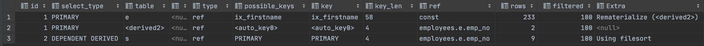

### 10.3.12.18 Select tables optimized away

- `MIN()`, `MAX()` 만 SELECT 절로 사용되는 경우
- `GROUP BY` 로 `MIN()`, `MAX()` 를 조회하는 쿼리가 인덱스 오름 차순 또는 내림차순으로 1건만 읽는 경우

### 10.3.12.19 Start temporary, End temporary

- 세미 조인 최적화 중 `Duplicate Weed-out` 전략을 사용하는 경우 표시
- `Start Temporary` 부터 `End templorary` 내용을 임시 테이블에 저장한다

### 10.3.12.20 unique row not found

- 두 테이블이 각각 유니크(프라이머리 키 포함) 칼럼으로 아우터 조인을 수행하는 쿼리에서 아우터 테이블에 이리하는 레코드가 존재하지 않는 경우
- 조인 테이블 데이터 결함 있음을 의미함

### 10.3.12.21 Using filesort

- `ORDER BY` 가 사용되는 쿼리에서만 나타난다
- 레코드 정렬용 메모리 버퍼(소트 버퍼)를 사용한다
- `Using filesort` 는 부하를 많이 일으키므로 쿼리 튜닝의 대상이 된다

### 10.3.12.22 Using index(커버링 인덱스) ⭐️⭐️⭐️⭐️⭐️

- 데이터 파일을 전혀 읽지 않고 인덱스만 읽어서 쿼리를 처리할 수 있는 경우 표시
- 커버링 인덱스 사용하지 않는 경우 ⇒ birth_date 값을 읽어야 한다
    
    ```sql
    EXPLAIN
    SELECT first_name, birth_date
      FROM employees_comp4k
     WHERE first_name BETWEEN 'Babette' AND 'Gad';
    ```
    
    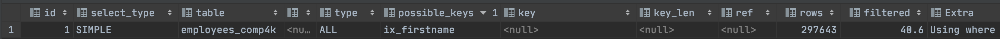
    
- 커버링 인덱스 사용하는 경우
    
    ```sql
    EXPLAIN
    SELECT first_name
      FROM employees_comp4k
     WHERE first_name BETWEEN 'Babette' AND 'Gad';
    ```
    
    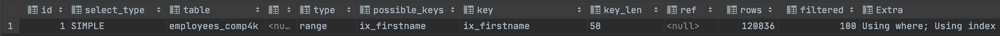
    
    - 인덱스 레인지 스캔으로 훨씬 빠른 속도로 처리된다
    - 커버링 인덱스는 PK로 데이터 파일을 접근하기 때문에 PK를 이용한 조회도 가능하다

### 10.3.12.23 Using index condition

- 인덱스 컨디션 푸시 다운 최적화 사용하는 경우 표시

### 10.3.12.24 Using index for group-by

- `GROUP BY` 처리가 인덱스를 이용할 경우 표시

### 10.3.12.24.1 타이트 인덱스 스캔(인덱스 스캔)을 통한 GROUP BY 처리

- `GROUP BY`  처리를 인덱스를 이용했지만 집계 함수를 사용할 경우 표시

### 10.3.12.24.2 루스 인덱스 스캔을 통한 GROUP BY 처리

- `GROUP BY`  처리를 인덱스를 이용했지만 집계 함수를 사용하여 인덱스의 첫번째 혹은 마지막 레코드를 읽는 경우 표시

### 10.3.12.25 Using index for skip scan

- 인덱스 스킵 스캔 최적화를 사용하는 경우 표시

### 10.3.12.26 Using join buffer(Block Nested Loop, Batched Key Access, Hash Join)

- 드리븐 테이블 검색을 위한 적절한 인덱스가 없는 경우 `블록 네스티드 루프 조인` 또는 `해시 조인`을 사용

### 10.3.12.27 Using MRR

- Multi Range Read 기능을 사용하는 경우 표시

### 10.3.12.28 Using sort_union, Using union, Using intersect

- `index_merge` 접근 방식을 사용하는 경우 조건에 따라 표시

### 10.3.12.29 Using temporary

- 쿼리의 중간 처리 결과를 담아 두기 위해 임시 테이블을 사용한다
- 메모리 또는 디스크 상으로 저장된다

### 10.3.12.30 Using where

- MySQL 엔진 레이어에서 별도의 가공을 해서 필터링 처리하는 경우 표시
    
    ```sql
    EXPLAIN
    SELECT *
      FROM employees
     WHERE emp_no BETWEEN 10001 AND 10100
     AND GENDER='F'
    ```
    
    
    
    - `emp_no` 조건은 InnoDB 스토리지 엔진에서 처리된 결과이다
    - `GENDOR` 조건은 MYSQL 엔진에서 처리한다

### 10.3.12.31 Zero limit

- 쿼리 결과값의 메타데이터만 필요한 경우 사용
    
    ```sql
    EXPLAIN
    SELECT *
      FROM employees 
     LIMIT 0;
    ```