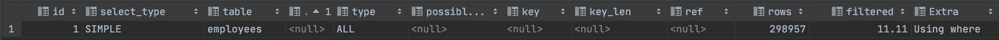

# 10장 실행계획
- 옵티마이저가 항상 좋은 실행계획을 만들지는 못한다
- MySQL 서버 데이터 처리 로직을 잘 이해해서 실행계획을 최적화할 줄 알아야 한다

## 10.1 통계 정보

- 5.7버전까지는 `테이블` 과 `인덱스` 에 대한 개괄적인 정보를 바탕으로 실행계획을 수립했다
    - 테이블 칼럼의 값들의 분포에 대한 정보가 없기 때문에 정확도가 떨어진다
- 8.0버전부터는 데이터 분포도를 수집해서 저장하는 `히스토그램(Histogram)` 이 도입되었다
    - 인덱스되지 않은 칼럼에 대해서도 컬럼의 값의 분포도를 파악하여 통계 정보를 얻을 수 있다

### 10.1.1 테이블 및 인덱스 통계 정보

- 비용 기반 최적화에서 가장 중요한 정보는 `통계 정보` 이다
- MySQL 서버는 통계 정보의 휘발성이 강했다 ⇒ 메모리 레벨에서 관리되었다
- MySQL 서버에서는 쿼리 실행 계획을 수립할 때 테이블의 데이터를 일부 분석해서 통계 정보로 사용한다

### 10.1.1.1 MySQL 서버의 통계 정보

- 5.6 버전부터는 테이블에 통계 정보를 영구적으로 저장할 수 있게 개선되었다
    - `innodb_index_stats`, `innodb_table_stats`
    
    ```sql
    use mysql;
    
    SHOW TABLES LIKE '%_stats' ;
    ```
    
    
    
- 테이블 생성 시 `STATS_PERSISTENT` 옵션으로 통계 정보를 영구 저장할지 설정한다
    
    ```sql
    //CREATE TABLE
    CREATE TABLE tab_test(fd1 INT, fd2 VARCHAR(20), PRIMARY KEY (fd1))
    ENGINE=InnoDB STATS_PERSISTENT = 0; //{0: 테이블 저장 X, 1: 테이블 저장(default), DEFAULT: innodb_stats_persistence }
    
    //ALTER TABLE
    ALTER TABLE tab_test STATS_PERSISTENT = 1;
    ```
    
- **innodb_index_stats** : 테이블의 인덱스 통계 정보
    
    ```sql
    USE mysql;
    SELECT *
      FROM innodb_index_stats
     WHERE database_name='employees'
       AND table_name='employees';
    
    SELECT COUNT(*) 
      FROM employees; //300,024
    ```
    
    
    
    - stat_name 컬럼 옵션
        - `n_diff_pfx%` : 인덱스가 가진 유니크한 값의 개수
        - `n_leaf_pages` : 인덱스 리프 노드 페이지 수
        - `size` : 인덱스 트리의 전체 페이지 수
        - `n_rows` : 테이블 전체 레코드 수
        - `clustered_index_size` : 프라이머리 키의 크기(InnoDB 페이지 개수)
- **innodb_table_stats** : 테이블의 통계 정보
    
    ```sql
    use mysql;
    SELECT *
      FROM innodb_table_stats
     WHERE database_name='employees'
       AND table_name='employees';
    ```
    
    
    
    - `clustered_index_size` : 프라이머리 키의 크기(InnoDB 페이지 개수)
    - `sum_of_other_index_sizes` : PK를 제외한 인덱스 키의 크기(InnoDB 페이지 개수)
        - 값이 0으로 보이는 경우 STATS_AUTO_RECALC 옵션이 0 인지 확인
- 5.5 버전 이전까지
    - 5.5 버전까지에서 자동으로 통계 정보가 갱신되는 시기
        - 테이블이 새로 오픈되는 경우
        - 테이블의 레코드가 대량 변경되는 경우(1/16)
        - `ANALIZE TABLE` 명령이 실행되는 경우
        - `SHOW TABLE STATUS` 명령이나 `SHOW INDEX FROM` 명령이 실행되는 경우
        - `INNODB` 모니터가 활성화 되는 경우
            - [https://dev.mysql.com/doc/refman/5.6/en/innodb-enabling-monitors.html](https://dev.mysql.com/doc/refman/5.6/en/innodb-enabling-monitors.html)
            - [https://myinfrabox.tistory.com/70](https://myinfrabox.tistory.com/70)
        - `innodb_stats_on_metadata=ON`인 상태에서 `SHOW TABLE STATUS` 명령이 수행된 경우
            - 비영구 통계 갱신 옵션
            - [https://dev.mysql.com/doc/refman/5.7/en/innodb-parameters.html#sysvar_innodb_stats_on_metadata](https://dev.mysql.com/doc/refman/5.7/en/innodb-parameters.html#sysvar_innodb_stats_on_metadata)
    - 통계 정보가 자주 갱신되는 경우 실행계획이 변경될 수 있으므로 성능 이슈가 발생될 수 있다
    - `innodb_stats_sample_pages` 테이블 블록 샘플링 옵션 ⇒ 8.0 버전에서 deprecated
- 5.6 버전에서부터 영구적인 통계 정보를 도입하여 의도하지 않은 통계 정보 변경 이슈를 개선하였다
    - `innodb_stats_auto_recalc` ⇒ 영구 통계 정보 자동 갱신 여부
        - 1 : 테이블 통계 정보 5.5 이전의 방식으로 자동 수집
        - 0 : `ANALYZE TABLE` 명령 실행 시 수집
        - DEFAULT : `innodb_stats_auto_reclac`
    - 통계 정보 수집 시스템 변수
        - `innodb_stats_transient_sample_pages` : 기본값 8. 자동 통계 정보 수집 시 임의로 8개 페이지를 임의로 샘플링하여 통계 정보로 활용한다
        - `innodb_stats_persistent_sample_pages` : 기본값 20. `ANALYZE TABLE` 수행 시 임의로 20개 페이지만 샘플링하여 영구적인 통계 테이블에 저장하고 활용한다

### 10.1.2 히스토그램

- 5.7 버전까지는 단순 인덱스된 칼럼의 유니크한 개수로 통계 정보를 분석했기 때문에 정확도가 많이 떨어졌다
- 8.0 버전부터 칼럼의 데이터 분포도를 참조할 수 있는 `히스토그램(Histogram)`을 활용할 수 있게 되었다

### 10.1.2.1 히스토그램 정보 수집 및 삭제

- 칼럼 단위로 관리되며, `ANALYZE TABLE ... UPDATE HISTOGRAM` 옵션으로 수집, 관리된다
- 수집된 히스토그램은 시스템 딕셔너리에 함께 저장되고, 서버가 시작할 때 `information_schema.column_statistics` 테이블로 로드된다

```sql
ANALYZE TABLE employees UPDATE HISTOGRAM ON gender, hire_date;

SELECT *
  FROM information_schema.COLUMN_STATISTICS
 WHERE SCHEMA_NAME='employees'
   AND TABLE_NAME='employees';

// RESULT
{
  "buckets": [
    [
      1,
      0.5988869164707575
    ],
    [
      2,
      1
    ]
  ],
  "data-type": "enum",
  "null-values": 0,
  "collation-id": 45,
  "last-updated": "2022-10-12 13:14:18.694862",
  "sampling-rate": 0.34843360973874726,
  "histogram-type": "singleton",
  "number-of-buckets-specified": 100
}

{
  "buckets": [
    [
      "1985-02-01 00:00:00.000000",
      "1985-02-28 00:00:00.000000",
      0.009912200738857171,
      28
    ],
    [
      "1985-03-01 00:00:00.000000",
      "1985-03-27 00:00:00.000000",
      0.019833997025380225,
      27
    ]
		//... 
  ],
  "data-type": "datetime",
  "null-values": 0,
  "collation-id": 8,
  "last-updated": "2022-10-12 13:14:18.697411",
  "sampling-rate": 0.34843360973874726,
  "histogram-type": "equi-height",
  "number-of-buckets-specified": 100
}
```

- 히스토그램 타입
    - `singleton` : 칼럼값 개별로 레코드 건수를 관리. `Value-Based 히스토그램` 또는 `도수 분포`
        - 버킷의 칼럼 값, 발생 빈도 비율
    - `equi-height` : 칼럼값의 범위를 균등한 개수로 구분해서 관리. `Height-Balanced 히스토그램`
        - 범위 시작 값, 범위 마지막 값, 발생 빈도, 버킷 포함된 유니크한 값 개수
- 싱글톤 히스토그램 & 높이 균형 히스토그램


- 히스토그램의 비율은 `누적값`으로 표시된다
- `information_schema.column_statistics` 테이블의 `HISTOGRAM` 컬럼 필드
    - `sampling-rate` : 히스토그램 정보 수집을 위해 스캔한 페이지 비율 저장.
    - `historam_type` : 히스토그램 종류 저장
    - `number-of-buckets-specified` : 히스토그램 생성 시 버킷 개수를 저장. 기본값 100
- 8.0.19 이전까지 히스토그램 생성 시 풀 스캔을 통해 샘플링 데이터를 수집하였으나 이후에 개선되었다
    - `샘플링 알고리즘` 지원
- 히스토그램 삭제

```sql
ANALYZE TABLE employees DROP HISTOGRAM ON gender, hire_date;
```

- 삭제 시 딕셔너리 내용만 삭제하기 때문에 성능에 영향을 미치지 않는다
- 히스토그램을 삭제하지 않고 비활성화하는 방법:  `condition_fanout_filter=off`  p.348

### 10.1.2.2 히스토그램의 용도

- 인덱스 정보만으로는 정확한 통계 정보를 파악하기 어렵다 ⇒ 데이터가 균등적으로 분포하지 않기 때문
- 히스토그램은 특정 칼럼이 가지는 각 범위(버킷)별 레코드의 건수와 유니크한 값의 개수 정보를 활용하여 훨씬 더 정확한 예측을 할 수 있다
    
    ```sql
    EXPLAIN
    SELECT *
      FROM employees
     WHERE first_name='Zita'
       AND birth_date BETWEEN '1950-01-01' AND '1960-01-01';
    ```
    
    
    
    ```sql
    ANALYZE TABLE employees UPDATE HISTOGRAM ON first_name, birth_date;
    
    EXPLAIN
    SELECT *
      FROM employees
     WHERE first_name='Zita'
       AND birth_date BETWEEN '1950-01-01' AND '1960-01-01';
    ```
    
    
    
    - ex) 143 / 224 * 100 ⇒ 63.8%
- 히스토그램 성능 이슈 테스트
    
    ```sql
    EXPLAIN
    SELECT /*+ JOIN_ORDER(e, s) */ *
      FROM salaries s
        INNER JOIN employees e ON s.emp_no = e.emp_no
                    AND e.birth_date BETWEEN  '1950-01-01' AND '1950-02-01'
    WHERE s.salary BETWEEN 40000 AND 70000;
    // 300ms
    
    EXPLAIN
    SELECT /*+ JOIN_ORDER(s, e) */ *
      FROM salaries s
        INNER JOIN employees e ON s.emp_no = e.emp_no
                    AND e.birth_date BETWEEN  '1950-01-01' AND '1950-02-01'
    WHERE s.salary BETWEEN 40000 AND 70000;
    // 1s 600ms
    ```
    
    
    
    
    

### 10.1.2.3 히스토그램과 인덱스

- MySQL 서버는 사용 가능한 인덱스로부터 조건절에 일치하는 레코드 건수를 파악한 뒤 실행 계획을 수립한다
    - 레코드 건수를 예측하기 위해 실제 인덱스의 B-Tree를 샘플링하여 살펴본다 ⇒ `인덱스 다이브`
- 히스토그램 vs 인덱스 ??
    - 인덱스된 칼럼을 검색 조건으로 사용하는 경우 MySQL은 `인덱스 다이브`를 사용한다
    - 실제 검색 조건의 대상 값에 대한 샘플링을 실행하기 때문에 훨씬 정확도가 높다
    - MySQL 8.0버전에서는 히스토그램은 주로 인덱스되지 않은 칼럼에 대한 참조용으로 사용된다

### 10.1.3 코스트 모델(Cost Model)

- 서버가 쿼리를 처리하려면 다음과 같은 작업이 필요하다
    - 디스크로부터 데이터 페이지 읽기
    - 메모리(InnoDB 버퍼 풀)로부터 데이터 페이지 읽기
    - 인덱스 키 비교
    - 레코드 평가(?)
    - 메모리 임시 테이블 작업
    - 디스크 임시 테이블 작업
- 쿼리 비용을 계산하는 데 필요한 단위 작들의 비용을 `코스트 모델(Cost Model)` 이라 한다
- 5.7버전부터 DBMS 관리자가 작업 비용을 조절할 수 있게 개선되었으나 권장하지는 않는다
- 코스트 모델 관련 테이블
    - `server_cost` : 인덱스가 찾고 레코드를 비교하고 임시 테이블 처리에 대한 비용 관리
    - `engine_cost` : 레코드가 가진 데이터 페이지를 가져오는 데 필요한 비용 관리
- 8.0 버전에서 지원하는 단위 작업
    - [https://dev.mysql.com/doc/refman/5.7/en/cost-model.html](https://dev.mysql.com/doc/refman/5.7/en/cost-model.html)
- Cost 비용 확인 방법
    
    ```sql
    //JSON 방식
    EXPLAIN FORMAT=JSON
    SELECT *
      FROM employees
     WHERE first_name='Matt';
    
    //RESULT
    {
      "query_block": {
        "select_id": 1,
        "cost_info": {
          "query_cost": "81.55"
        },
        "table": {
          "table_name": "employees",
          "access_type": "ref",
          "possible_keys": [
            "ix_firstname"
          ],
          "key": "ix_firstname",
          "used_key_parts": [
            "first_name"
          ],
          "key_length": "58",
          "ref": [
            "const"
          ],
          "rows_examined_per_scan": 233,
          "rows_produced_per_join": 233,
          "filtered": "100.00",
          "cost_info": {
            "read_cost": "58.25",
            "eval_cost": "23.30",
            "prefix_cost": "81.55",
            "data_read_per_join": "78K"
          },
          "used_columns": [
            "emp_no",
            "birth_date",
            "first_name",
            "last_name",
            "gender",
            "hire_date",
            "full_name"
          ]
        }
      }
    }
    
    //단순 테이블
    EXPLAIN FORMAT=TRADITIONAL 
    SELECT *
      FROM employees
     WHERE first_name='Matt';
    
    //트리 방식  
    EXPLAIN FORMAT=TREE 
    SELECT *
      FROM employees
     WHERE first_name='Matt';
    ```
    
    - 8.0.19 버전부터는 `FORMAT=TREE` ⇒ `EXPLAIN ANALYZE` 로 대체되었다
        - [https://dev.mysql.com/doc/refman/8.0/en/explain.html](https://dev.mysql.com/doc/refman/8.0/en/explain.html)

## 10.2 실행 계획 확인

### 10.2.1 실행 계획  출력 포맷

- `테이블 포맷` ⇒ DEFAULT, FORMAT=TRADITIONAL
- `트리 포맷` ⇒ EXPLAIN ANALYZE(8.0.19 이후), FORMAT=TREE(이전 버전)
- `JSON 포맷` ⇒ FORMAT=JSON

### 10.2.2 쿼리 실행 시간 확인

- `EXPLAIN ANALYZE`
- `SHOW PROFILE` 명령도 가능하나 단계별 소요 정보를 보여주지 않는다

```sql
EXPLAIN ANALYZE
SELECT e.emp_no, avg(s.salary)
FROM employees e
         INNER JOIN salaries s ON e.emp_no = s.emp_no
    AND s.salary > 50000
    AND s.from_date <= '1990-01-01'
    AND s.to_date > '1990-01-01'
WHERE e.first_name = 'Matt'
GROUP BY e.emp_no;
```

```sql
-> Group aggregate: avg(s.salary)  (cost=332.23 rows=122) (actual time=0.074..1.707 rows=48 loops=1)
    -> Nested loop inner join  (cost=320.00 rows=122) (actual time=0.039..1.688 rows=48 loops=1)
        -> Covering index lookup on e using ix_firstname (first_name='Matt')  (cost=25.80 rows=233) (actual time=0.028..0.090 rows=233 loops=1)
        -> Filter: ((s.salary > 50000) and (s.from_date <= DATE'1990-01-01') and (s.to_date > DATE'1990-01-01'))  (cost=0.32 rows=1) (actual time=0.006..0.007 rows=0 loops=233)
            -> Index lookup on s using PRIMARY (emp_no=e.emp_no)  (cost=0.32 rows=9) (actual time=0.004..0.006 rows=10 loops=233)
```

- Tree 구조 실행 순서 규칙
    - 들여쓰기가 같은 레벨에서는 상단에 위치한 라인이 먼저 실행
    - 들여쓰기가 다른 레벨에서는 가장 안쪽에 위치한 라인이 먼저 실행
    
    
### 10.2.2.1 DB 툴을 활용한 쿼리 실행 시간 확인

- DataGrip
    
    
    
- WorkBench(Visual Explain)
    
    