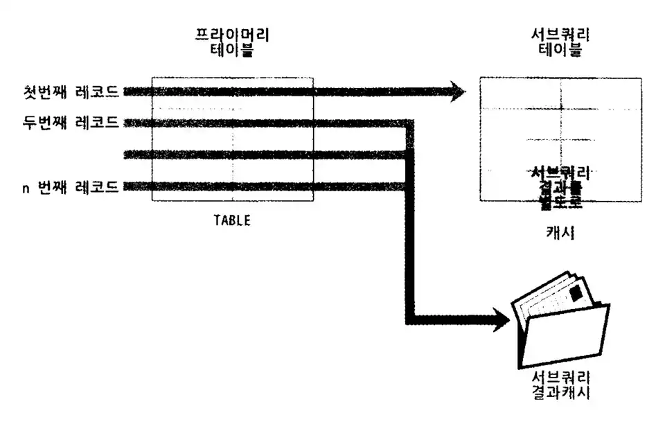

# 10. 실행계획

## 10.3 실행 계획 분석

- 실행 계획이 어떤 접근 방법을 사용해서 어떤 최적화를 수행하는지, 어떤 인덱스를 사용하는지 파악하는 것이 중요
- 쿼리 실행 시 `EXPLAIN` 명령을 실행하면 표 형태로 된 1줄 이상의 결과가 표시 됨. 표의 각 라인(레코드)은 쿼리 문장에서 사용된 테이블의 개수만큼 출력.
- 실행 순서는 위→ 아래 순서대로 표시
- 위쪽에 출력된 결과일수록(id 칼럼의 값이 작을수록) 쿼리의 바깥(Outer) 부분이거나 먼저 접근한 테이블
아래쪽에 출력된 결과일수록(id 칼럼의 값이 클수록) 쿼리의 안쪽(Inner) 부분 또는 나중에 접근한 테이블

### 10.3.1 id 칼럼

- select 키워드 단위로 구분한 것을 `단위(select) 쿼리` 라고 표현
- 하나의 select 문장 안에서 여러개의 테이블을 조인하면 조인되는 테이블의 개수만큼 실행 계획 레코드가 출력. 같은 id 값이 부여 됨
- 실행 계획의 id 칼럼이 테이블의 접근 순서를 의미하지는 않음
`EXPLAIN FORMAT=TREE` 포맷으로 확인 시 순서를 더 정확히 확인 가능

### 10.3.2 select_type 칼럼

각 단위 select 쿼리가 어떤 타입의 쿼리인지 표시되는 칼럼

**SIMPLE**

- 단순한 select 쿼리인 경우 해당 쿼리 문장의 select_type 은 SIMPLE 로 표시
- 일반적으로 제일 바깥 SELECT 쿼리의 select_type이 SIMPLE 로 표시

**PRIMARY**

UNION 이나 서브쿼리를 가진 SELECT 쿼리의 실행 계획에서 가장 바깥쪽(Outer)에 있는 단위 쿼리는 select_type이 PRIMARY로 표시

**UNION**

- UNION 으로 결합하는 단위 SELECT 쿼리 가운데 첫 번째를 제외한 두 번째 이후 단위 SELECT 쿼리의 select_type은 UNION 으로 표시
- UNION의 첫 번째 단위 SELECT는 select_type 이 UNION 되는 쿼리 결과들을 모아서 저장하는 임시 테이블(DERIVED)이 select_type으로 표시

**DEPENDENT UNION**

- UNION, UNION ALL 로 집합을 결합하는 쿼리에서 표시.
- DEPENDENT는 UNION이나 UNION ALL 로 결합된 단위 쿼리가 외부 쿼리에 의해 영향을 받는 것을 의미.
- 내부 쿼리가 외부의 값을 참조해서 처리될 때 select_type 에 DEPENDENT 키워드가 표시

```sql
-- 외부에 정의된 employees 테이블의 emp_no 칼럼이 
-- 서브쿼리에 사용되기 때문에 DEPENDENT UNION
mysql> EXPLAIN
       select * from employees e1
			  where e1.emp_no in (
						 select e2.emp_no from employees e2 where e2.first_name = 'Matt'
							union
						 select e3.emp_no from employees e3 where e3.last_name = 'Matt'
				);
```

**UNION RESULT**

- UNION 결과를 담아두는 테이블을 의미. 실행 계획상에서 임시 테이블을 가리키는 라인의 select_type이 UNION RESULT 이며 실제 쿼리에서 단일 쿼리가 아니기 때문에 별도의 id 값이 부과되지 않음.
- MySQL 8.0 ~ UNION ALL 은 임시 테이블 사용x, UNION DISTINCT 는 임시 테이블에 결과 버퍼링

**SUBQUERY**

- from 절 이외에서 사용되는 서브쿼리만을 의미.
- MySQL 서버 실행 계획에서 from 절에 사용된 서브쿼리는 select_type 이 DERIVED 표시되고 
그 밖의 위치에서 사용된 서브쿼리는 전부 SUBQUERY 표시

**DEPENDENT SUBQUERY**

- 서브쿼리가 바깥쪽(Outer) SELECT 쿼리에서 정의된 employees 테이블의 칼럼을 사용하는 경우, select_type에 DEPENDENT SUBQUERY 라고 표시.
- 외부 쿼리(from employees) 먼저 실행 후 내부 쿼리(subquery, from dept_emp, dept_manager) 실행해야 하므로 일반 서브쿼리보다 처리 속도가 느릴수 있음

```sql
-- 볼드 설정된 쿼리 = 서브쿼리 = 해당 테이블이 DEPENDENT SUBQEURY
-- dept_emp, dept_manager == DEPENDENT SUBQUERY
mysql> EXPLAIN
		   SELECT e.first_name,
							(**SELECT COUNT(*)
 						     FROM dept_emp de, dept_manager dm
							  WHERE dm.dept_no = de.dept_no
  							  AND de.emp_no = e.emp_no**) AS cnt
				 FROM employees e
				WHERE e.first_name = 'Matt';
```

**DERIVED**

- ~ MySQL 5.5 
서브 쿼리가 FROM 절에 사용된 경우 항상 select_type = DERIVED 인 실행 계획을 생성했음
파생 테이블에는 인덱스가 전혀 없음. 따라서, 다른 테이블과 조인 시 성능 불리
- MySQL 5.6 ~
옵티마이저 옵션(optimizer_switch 시스템 변수)에 따라 FROM 절의 서브쿼리를 외부 쿼리와 통합하는 형태의 최적화가 수행. 임시 테이블에도 인덱스가 추가 됨
- DERIVED 는 단위 `SELECT 쿼리의 실행 결과로 메모리나 디스크에 임시 테이블 생성을 의미`
select_type = DERIVED 인 경우, `생성되는 임시 테이블을 파생 테이블`이라고 함
- MySQL 서버는 FROM 절의 서브쿼리를 임시 테이블로 만들어서 처리
MySQL 8.0 ~ FROM 절의 서브쿼리에 대한 최적화 개선. 불필요한 서브쿼리를 조인으로 재작성해서 처리 함.
`서브쿼리 <<< **조인** 을 사용하는 것이 좋음`
    
    ```sql
    -- 타 DBMS 에서는 FROM 절의 서브쿼리를 제거하고 조인으로 처리하는 최적화 기능을 제공
    -- 
    mysql> EXPLAIN
    			 SELECT *
    				 FROM (SELECT de.emp_no FROM dept_emp de GROUP BY de.emp_no) tb,
    							employees e
     				WHERE e.emp_no = tb.emp_no;
    
    +----+-------------+------------+--------+
    | id | select_type | table      | type   |
    +----+-------------+------------+--------+
    |  1 | PRIMARY     | <derived2> | ALL    |
    |  1 | PRIMARY     | e          | eq_ref |
    |  2 | DERIVED     | de         | index  |
    +----+-------------+------------+--------+
    ```
    

**DEPENDENT DERIVED**

- ~ MySQL 8.0
FROM 절의 서브쿼리는 외부 칼럼 사용 불가
- MySQL 8.0 ~ 
`래터럴 조인(LAYERAL JOIN) 기능 추가` → FROM 절의 서브쿼리에 외부 칼럼 참조 가능

```sql
-- employees 테이블의 레코드 1건당 salaries 테이블 레코드 최근 순 2건만 가져와서 조인 실행
-- select_type = DEPENDENT DERIVED 는 래터럴 조인으로 사용된 것을 의미
mysql> SELECT *
				 FROM employees e
				LEFT JOIN LATERAL
					(SELECT * 
						 FROM salaries s
						WHERE s.emp_no = e.emp_no
						ORDER BY s.from_date DESC LIMIT 2) AS s2 ON s2.emp_no = e.emp_no;

+----+-------------------+------------+--------+
| id | select_type       | table      | type   |
+----+-------------------+------------+--------+
|  1 | PRIMARY           | e          | ALL    |
|  1 | PRIMARY           | <derived2> | ref    |
|  2 | DEPENDENT DERIVED | s          | ref    |
+----+-------------------+------------+--------+
```

**UNCACHEABLE SUBQUERY**

- 1개의 쿼리 문장에 서브쿼리가 1개라도 실제로 그 서브쿼리가 한 번만 실행되는 것 X
- `조건이 똑같은 서브쿼리가 실행될 때는 이전의 실행 결과를 그대로 사용할 수 있게 **서브쿼리의 결과를 내부적인 캐시 공간에 담아 둠**`
- SUBQUERY vs DEPENDENT SUBQUERY
    - SUBQUERY : 바깥쪽(Outer) 영향을 받지 않음. 처음 한 번만 실행 후 그 결과를 캐시하고 필요할 때 캐시 결과 이용 가능
        
        
        
    - DEPENDENT SUBQEURY : 의존하는 바깥쪽 쿼리 칼럼의 값 단위로 캐시해두고 사용
- `select_type = SUBQUERY` or `select_type = UNCACHEABLE SUBQUERY`
결과 캐시를 사용할수 있느냐 없느냐의 차이에 따라 select_type이 구분 됨
- `서브쿼리에 포함된 요소에 의해 캐시 자체가 불가능` 할 수 있는데 이럴 경우 `select_type = UNCACHEABLE SUBQUERY` 표시
    - 사용자 변수가 서브쿼리에 사용된 경우
    - NOT-DETERMINISTIC 속성의 스토어드 루틴이 서브쿼리 내에 사용된 경우
    - UUID(), RAND() 같이 결괏값이 호출할 때마다 달라지는 함수가 서브쿼리에 사용된 경우

```sql
mysql> EXPLAIN
				SELECT * 
          FROM employees e WHERE e.emp_no = (
						SELECT @status FROM dept_emp de WHERE de.dept_no = 'd005');

+----+----------------------+------------+--------+
| id | select_type          | table      | type   |
+----+----------------------+------------+--------+
|  1 | PRIMARY              | e          | ALL    |
|  2 | UNCACHEABLE SUBQUERY | de         | ref    |
+----+----------------------+------------+--------+
```

**UNCACHEABLE UNION**

UNION + UNCACHEABLE 두 키워드의 속성이 혼합된 select_type

**MATERIALIZED(구체화)**

- MySQL 5.6 ~ 도입된 select_type
- `FROM 절, IN(subquery) 형태의 쿼리에 사용된 서브쿼리의 최적화`를 위해 사용
- `서브 쿼리 내용을 임시 테이블로 구체화(Materialization)` 한 후, 임시 테이블과 employees 테이블을 조인하는 형태로 최적화되어 처리
    
    ```sql
    -- 100 < 급여 < 1000 인 직원 정보 조회 쿼리
    mysql> EXPLAIN
            SELECT *
     				  FROM employees e
     				 WHERE e.emp_no IN (SELECT emp_no 
    														  FROM salaries WHERE salary BETWEEN 100 AND 1000);
    
    +----+--------------+-------------+--------+
    | id | select_type  | table       | type   |
    +----+--------------+-------------+--------+
    |  1 | SIMPLE       | <subquery2> | ALL    |
    |  1 | SIMPLE       | e           | eq_ref |
    |  2 | MAYERIALIZED | salaries    | range  |
    +----+--------------+-------------+--------+
    ```
    

### 10.3.3 table 칼럼

- `MySQL 서버 실행 계획`은 단위 SELECT 쿼리 기준이 아니라 `테이블 기준으로 표시` 됨
    
    ```sql
    -- mysql 에서는 dual 시스템 테이블 x
    -- 1번, 2번 쿼리 모두 동일한 실행 계획을 가지며
    -- 별도의 테이블 사용하지 않는 형태로 표시 됨
    mysql> EXPLAIN SELECT NOW();
    mysql> EXPLAIN SELECT NOW() FROM DUAL;
    +----+--------------+-------+------+---------+---------------+
    | id | select_type  | table | key  | key_len | Extra         |
    +----+--------------+-------+------+---------+---------------+
    |  1 | SIMPLE       | NULL  | NULL | NULL    | No tables used|
    +----+--------------+-------+------+---------+---------------+
    ```
    
- 실행 계획 결과에서 table 칼럼에 `<derived N> 또는 <union M, N> 과 같이 <> 는 임시테이블을 의미`. <> 안에 표시되는 숫자는 단위 SELECT 쿼리의 id 값을 지칭

### 10.3.4 partitions 칼럼

- ~ MySQL 5.7 : 옵티마이저가 사용하는 파티션 목록은 `EXPLAIN PARTITION` 명령으로 화인
MySQL 8.0 ~ : `EXPLAIN` 명령으로 파티션 관련 실행 계획 모두 확인 가능

```sql
mysql> CREATE TABLE employees_2 (
					emp_no int NOT NULL,
					birth_date DATE NOT NULL,
					first_name VARCHAR(14) NOT NULL,
					last_name VARCHAR(16) NOT NULL,
					gender ENUM('M', 'F') NOT NULL,
					hire_date DATE NOT NULL,
					PRIMARY KEY (emp_no, hire_date)
			) PARTITION BY RANGE COLUMNS(hire_date)
			(PARTITION p1986_1990 VALUES LESS THAN ('1990-01-01'),
  		 PARTITION p1991_1995 VALUES LESS THAN ('1996-01-01'),
  		 PARTITION p1996_2000 VALUES LESS THAN ('2000-01-01'),
  		 PARTITION p2001_2005 VALUES LESS THAN ('2006-01-01'));

mysql> INSERT INTO employees_2 SELECT * FROM employees;

-- 파티션이 여러 개인 테이블, 불필요한 파티션 제외 후 쿼리 수행을 위해
-- 접근해야 할 것 으로 판단되는 테이블만 골라내는 과정 = 파티션 프루닝(Partition pruning)
mysql> EXPLAIN
				SELECT * FROM employees_2
 				 WHERE hire_date BETWEEN '1999-11-15' AND '2000-01-15';
```

### 10.3.5 type 칼럼

- 쿼리 실행 계획에서 type 이후의 칼럼은 MySQL 서버가 각 테이블의 레코드를 어떤 방식으로 읽었는지 나타냄
ex) 인덱스를 사용해 레코드 읽었는지, 테이블을 풀 테이블 스캔으로 레코드를 읽었는지  등
- 쿼리 튜닝 시 인덱스를 효율적으로 사용하는지 확인하는 것이 중요하므로 type 칼럼 반드시 체크
- type 칼럼은 `각 테이블의 접근 방법(Access type)` 으로 해석 하쟈
ALL 방법 제외하고 모두 index 를 사용하는 접근 방법 임
    - system
        - 레코드가 1건만 존재하는 테이블 or 한 건도 존재하지 않는 테이블 참조하는 접근 방법
        - MyISAM, MEMORY 테이블에서만 사용 됨. InnoDB 스토리지 엔진 사용 테이블에서는 X
        - 실제 애플리케이션에서 사용되는 쿼리에서 거의 보이지 않는 실행 계획
    - const
        - 테이블의 레코드 건수와 관계없이 `쿼리가 프라이머리 키나 유니크 키 칼럼을 이용하는 WHERE 조건절을 가지고 있으며, 반드시 1건을 반환하는 쿼리의 처리 방식`
        - 다른 DBMS 에서는 UNIQUE INDEX SCAN 이라고 표현
        - 조인의 순서와 관계없이 프라이머리 키나 유니크 키의 모든 칼럼에 대해 동등(Equal) 조건으로 검색(반드시 1건의 레코드만 반환)
    - eq_ref
        - 여러 테이블이 조인되는 쿼리의 실행 계획에서만 표시
        - `조인에서 첫 번째 읽은 테이블의 칼럼값을 이용해 두 번째 테이블을 프라이머리 키나 유니크 키로 동동등(Equal) 조건 검색(두 번째 테이블은 반드시 1건의 레코드만 반환)`
        
        ```sql
        -- 첫 번째 읽은 테이블 = dept_emp
        -- 두 번째 읽은 테이블 = employees
        mysql> EXPLAIN
        			  SELECT * FROM dept_emp de, employees e
        				 WHERE e.emp_no = de.emp_no AND de.dept_no = 'd005';
        +----+--------------+-------+--------+---------+
        | id | select_type  | table | type   | key     | 
        +----+--------------+-------+--------+---------+
        |  1 | SIMPLE       | de    | ref    | PRIMARY |
        |  1 | SIMPLE       | e     | eq_ref | PRIMARY |
        +----+--------------+-------+--------+---------+
        ```
        
    - ref
        - eq_ref 와 달리 조인의 순서와 관계 없음
        - `인덱스의 종류와 관계없이 동등(Equal) 조건으로 검색할 때는 ref 접근 방법이 사용`
        
        ```sql
        -- [type=ref] pk 구성하는 dept_no, emp_no 중 일부만 동등 조건으로 사용
        --            따라서 ref 접근 방법으로 실행 계획 구성
        -- [ref=const] dept_no = 'd005' 비교 조건 실행 시 입력값이 상수임을 의미
        mysql> EXPLAIN
        			  SELECT * FROM dept_emp WHERE dept_no = 'd005';
        +----+--------------+----------+------+---------+---------+-------+
        | id | select_type  | table    | type | key     | key_len | ref   |  
        +----+--------------+----------+------+---------+---------+-------+
        |  1 | SIMPLE       | dept_emp | ref  | PRIMARY | 16      | const |
        +----+--------------+----------+------+---------+---------+-------+
        ```
        
    - fulltext
        - MySQL 서버의 전문 검색(Full-text Search) 인덱스를 사용해 레코드를 읽는 접근 방법
        - 전문 검색을 위해서는 테이블에 전문 인덱스가 설정되어야 하고, `WATCH (...) AGAINST (...)` 구문으로 쿼리 실행
        
        ```sql
        mysql> CREATE TABLE employee_name (
        					emp_no int NOT NULL.
        					first_name varchar(14) NOT NULL,
        					last_name varchar(16) NOT NULL,
        					PRIMARY KEY (emp_no),
        					FULLTEXT KEY fx_name (first_name, last_name) WITH PARSER ngram
        			) ENGINE=InnoDB;
        
        -- [type] const
        mysql> EXPLAIN
        				SELECT *
         				  FROM employee_name
        				 WHERE emp_no = 10001
         			     AND emp_no BETWEEN 10001 AND 10005
        					 AND WATCH(first_name, last_name) AGAINST('Facello' IN BOOLEAN MODE);
        
        -- [type] fulltext
        mysql> EXPLAIN
        				SELECT *
         				  FROM employee_name
        				 WHERE emp_no BETWEEN 10001 AND 10005
        					 AND WATCH(first_name, last_name) AGAINST('Facello' IN BOOLEAN MODE);
        ```
        
    - ref_or_null
        - ref 접근 방법과 같고 NULL 비교가 추가된 형태로 `ref 방식 또는 NULL 비교(IS NULL) 접근 방법을 의미
        
        ```sql
        	mysql> EXPLAIN
        					SELECT * FROM titles
        					 WHERE to_date = '198-03-01' OR to_date IS NULL;
        ```
        
    - unique_subquery
        - WHERE 조건절에서 사용될 수 있는 IN(subquery) 형태의 쿼리를 위한 접근 방법
        - 서브쿼리에서 중복되지 않는 유니크한 값만 반환할 때 이 접근 방법 사용
        - IN (subquery) 형태의 조건에서 subquery 반환 값 중 중복이 없으므로 별도의 중복 제거 작업 필요 X
        
        ```sql
        mysql> EXPLAIN
        				SELECT * FROM departments
        				 WHERE dept_no IN (SELECT dept_no FROM dept_emp WHERE emp_no=10001);
        +----+--------------------+-------------+-----------------+-------------+---------+
        | id | select_type        | table       | type            | key         | key_len |
        +----+--------------------+-------------+-----------------+-------------+---------+
        | 1  | PRIMARY            | departments | index           | ux_deptname | 162     |
        | 2  | DEPENDENT SUBQUERY | dept_emp    | unique_subquery | PRIMARY     | 20      |
        +----+--------------------+-------------+-----------------+-------------+---------+
        ```
        
    - index_subquery
        - unique_subquery 와 달리 중복된 값이 포함될 수 있기 때문에 중복 값 제거 필요
        - IN(subquery)에서 서브쿼리 결과의 중복된 값을 인덱스를 이용해 제거 가능할 때 index_subquery 접근 방법 사용
    - range
        - 인덱스 레인지 스캔(=레인지 스캔) 형태의 접근 방법
        - range 는 인덱스를 범위로 검색. 주로 `<`, `>`, `IS NULL`, `BETWEEN`, `IN`, `LIKE` 등의 연산자를 이용해 인덱스 검색할 때 사용
        - 애플리케이션 쿼리가 가장 많이 사용하는 접근법
        - range 접근 방법(= const + ref + range)도 속도가 빠르며 모든 쿼리가 이 접근 방법만 사용해도 최적의 성능 보장 가능
    - index_merge
        - 2개 이상의 인덱스를 이용해 각 검색 결과 출력 후에 그 결과를 병합해서 처리하는 방식
        - 여러 인덱스를 읽어야 하므로 range 접근 방법보다 효율성 떨어짐
        - 전문 검색 인덱스 사용 쿼리에서는 적용 불가
        
        ```sql
        mysql> EXPLAIN
        			  SELECT * FROM employees
        				 WHERE emp_mo BETWEEM 10001 AND 11000
        							OR first_name = 'Smith';
        +----+--------------+-----------------------+------------------------------------+
        | id | type         | key                   | Extra                              |
        +----+--------------+-----------------------+------------------------------------+
        | 1  | index_merge  | PRIMARY, ix_firstname | Using union(PRIMARY, ix_firstname);|
        +----+--------------+-----------------------+------------------------------------+
        ```
        
    - index
        - 인덱스를 처음-끝까지 읽는 `인덱스 풀 스캔`
        - 테이블 풀 스캔 방식과 비교했을 때 비교하는 레코드 건수는 동일. 
        인덱스 크기가 데이터 파일 전체 크기보다 작으므로 테이블 풀 스캔보다 빠르게 처리
        - index 접근 방법은 1+2조건, 1+3조건 충족하는 쿼리에서 사용되는 읽기 방식
            1. range 나 const, ref 같은 접근 방법으로 인덱스 사용 못하는 경우
            2. 인덱스에 포함된 칼럼만으로 처리할 수 있는 쿼리인 경우(데이터 파일 읽을 필요x)
            3. 인덱스를 이용해 정렬이나 그루핑 작업이 가능한 경우(별고의 정렬 작업 피할수O)
    - ALL : 테이블을 처음-끝까지 읽어서 레코드를 가져오는 풀 테이블 스캔 방식을 의미