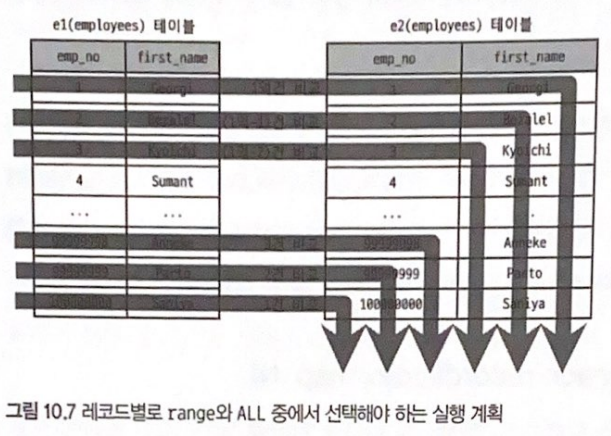

# 10. 실행계획

## 10.3 실행 계획 분석

- 실행 계획이 어떤 접근 방법을 사용해서 어떤 최적화를 수행하는지, 어떤 인덱스를 사용하는지 파악하는 것이 중요
- 쿼리 실행 시 `EXPLAIN` 명령을 실행하면 표 형태로 된 1줄 이상의 결과가 표시 됨. 표의 각 라인(레코드)은 쿼리 문장에서 사용된 테이블의 개수만큼 출력.
- 실행 순서는 위→ 아래 순서대로 표시
- 위쪽에 출력된 결과일수록(id 칼럼의 값이 작을수록) 쿼리의 바깥(Outer) 부분이거나 먼저 접근한 테이블
아래쪽에 출력된 결과일수록(id 칼럼의 값이 클수록) 쿼리의 안쪽(Inner) 부분 또는 나중에 접근한 테이블

### 10.3.1 id 칼럼

- select 키워드 단위로 구분한 것을 `단위(select) 쿼리` 라고 표현
- 하나의 select 문장 안에서 여러개의 테이블을 조인하면 조인되는 테이블의 개수만큼 실행 계획 레코드가 출력. 같은 id 값이 부여 됨
- 실행 계획의 id 칼럼이 테이블의 접근 순서를 의미하지는 않음
`EXPLAIN FORMAT=TREE` 포맷으로 확인 시 순서를 더 정확히 확인 가능

### 10.3.2 select_type 칼럼

각 단위 select 쿼리가 어떤 타입의 쿼리인지 표시되는 칼럼

**SIMPLE**

- 단순한 select 쿼리인 경우 해당 쿼리 문장의 select_type 은 SIMPLE 로 표시
- 일반적으로 제일 바깥 SELECT 쿼리의 select_type이 SIMPLE 로 표시

**PRIMARY**

UNION 이나 서브쿼리를 가진 SELECT 쿼리의 실행 계획에서 가장 바깥쪽(Outer)에 있는 단위 쿼리는 select_type이 PRIMARY로 표시

**UNION**

- UNION 으로 결합하는 단위 SELECT 쿼리 가운데 첫 번째를 제외한 두 번째 이후 단위 SELECT 쿼리의 select_type은 UNION 으로 표시
- UNION의 첫 번째 단위 SELECT는 select_type 이 UNION 되는 쿼리 결과들을 모아서 저장하는 임시 테이블(DERIVED)이 select_type으로 표시

**DEPENDENT UNION**

- UNION, UNION ALL 로 집합을 결합하는 쿼리에서 표시.
- DEPENDENT는 UNION이나 UNION ALL 로 결합된 단위 쿼리가 외부 쿼리에 의해 영향을 받는 것을 의미.
- 내부 쿼리가 외부의 값을 참조해서 처리될 때 select_type 에 DEPENDENT 키워드가 표시

```sql
-- 외부에 정의된 employees 테이블의 emp_no 칼럼이 
-- 서브쿼리에 사용되기 때문에 DEPENDENT UNION
mysql> EXPLAIN
       select * from employees e1
		where e1.emp_no in (
		     select e2.emp_no from employees e2 where e2.first_name = 'Matt'
				union
			 select e3.emp_no from employees e3 where e3.last_name = 'Matt');
```

**UNION RESULT**

- UNION 결과를 담아두는 테이블을 의미. 실행 계획상에서 임시 테이블을 가리키는 라인의 select_type이 UNION RESULT 이며 실제 쿼리에서 단일 쿼리가 아니기 때문에 별도의 id 값이 부과되지 않음.
- MySQL 8.0 ~ UNION ALL 은 임시 테이블 사용x, UNION DISTINCT 는 임시 테이블에 결과 버퍼링

**SUBQUERY**

- from 절 이외에서 사용되는 서브쿼리만을 의미.
- MySQL 서버 실행 계획에서 from 절에 사용된 서브쿼리는 select_type 이 DERIVED 표시되고 
그 밖의 위치에서 사용된 서브쿼리는 전부 SUBQUERY 표시

**DEPENDENT SUBQUERY**

- 서브쿼리가 바깥쪽(Outer) SELECT 쿼리에서 정의된 employees 테이블의 칼럼을 사용하는 경우, select_type에 DEPENDENT SUBQUERY 라고 표시.
- 외부 쿼리(from employees) 먼저 실행 후 내부 쿼리(subquery, from dept_emp, dept_manager) 실행해야 하므로 일반 서브쿼리보다 처리 속도가 느릴수 있음

```sql
-- 볼드 설정된 쿼리 = 서브쿼리 = 해당 테이블이 DEPENDENT SUBQEURY
-- dept_emp, dept_manager == DEPENDENT SUBQUERY
mysql> EXPLAIN
        SELECT e.first_name,
                (SELECT COUNT(*)
                    FROM dept_emp de, dept_manager dm
                    WHERE dm.dept_no = de.dept_no
                    AND de.emp_no = e.emp_no) AS cnt
            FROM employees e
        WHERE e.first_name = 'Matt';
```

**DERIVED**

- ~ MySQL 5.5 
서브 쿼리가 FROM 절에 사용된 경우 항상 select_type = DERIVED 인 실행 계획을 생성했음
파생 테이블에는 인덱스가 전혀 없음. 따라서, 다른 테이블과 조인 시 성능 불리
- MySQL 5.6 ~
옵티마이저 옵션(optimizer_switch 시스템 변수)에 따라 FROM 절의 서브쿼리를 외부 쿼리와 통합하는 형태의 최적화가 수행. 임시 테이블에도 인덱스가 추가 됨
- DERIVED 는 단위 `SELECT 쿼리의 실행 결과로 메모리나 디스크에 임시 테이블 생성을 의미`
select_type = DERIVED 인 경우, `생성되는 임시 테이블을 파생 테이블`이라고 함
- MySQL 서버는 FROM 절의 서브쿼리를 임시 테이블로 만들어서 처리
MySQL 8.0 ~ FROM 절의 서브쿼리에 대한 최적화 개선. 불필요한 서브쿼리를 조인으로 재작성해서 처리 함.
`서브쿼리 <<< **조인** 을 사용하는 것이 좋음`
    
    ```sql
    -- 타 DBMS 에서는 FROM 절의 서브쿼리를 제거하고 조인으로 처리하는 최적화 기능을 제공
    -- 
    mysql> EXPLAIN
    		SELECT *
    		  FROM (SELECT de.emp_no FROM dept_emp de GROUP BY de.emp_no) tb,
    				employees e
             WHERE e.emp_no = tb.emp_no;
    
    +----+-------------+------------+--------+
    | id | select_type | table      | type   |
    +----+-------------+------------+--------+
    |  1 | PRIMARY     | <derived2> | ALL    |
    |  1 | PRIMARY     | e          | eq_ref |
    |  2 | DERIVED     | de         | index  |
    +----+-------------+------------+--------+
    ```
    

**DEPENDENT DERIVED**

- ~ MySQL 8.0
FROM 절의 서브쿼리는 외부 칼럼 사용 불가
- MySQL 8.0 ~ 
`래터럴 조인(LAYERAL JOIN) 기능 추가` → FROM 절의 서브쿼리에 외부 칼럼 참조 가능

```sql
-- employees 테이블의 레코드 1건당 salaries 테이블 레코드 최근 순 2건만 가져와서 조인 실행
-- select_type = DEPENDENT DERIVED 는 래터럴 조인으로 사용된 것을 의미
mysql> SELECT *
		 FROM employees e
		 LEFT JOIN LATERAL
		   (SELECT * FROM salaries s
             WHERE s.emp_no = e.emp_no
             ORDER BY s.from_date DESC LIMIT 2) AS s2 ON s2.emp_no = e.emp_no;

+----+-------------------+------------+--------+
| id | select_type       | table      | type   |
+----+-------------------+------------+--------+
|  1 | PRIMARY           | e          | ALL    |
|  1 | PRIMARY           | <derived2> | ref    |
|  2 | DEPENDENT DERIVED | s          | ref    |
+----+-------------------+------------+--------+
```

**UNCACHEABLE SUBQUERY**

- 1개의 쿼리 문장에 서브쿼리가 1개라도 실제로 그 서브쿼리가 한 번만 실행되는 것 X
- `조건이 똑같은 서브쿼리가 실행될 때는 이전의 실행 결과를 그대로 사용할 수 있게 **서브쿼리의 결과를 내부적인 캐시 공간에 담아 둠**`
- SUBQUERY vs DEPENDENT SUBQUERY
    - SUBQUERY : 바깥쪽(Outer) 영향을 받지 않음. 처음 한 번만 실행 후 그 결과를 캐시하고 필요할 때 캐시 결과 이용 가능
        
        
        
    - DEPENDENT SUBQEURY : 의존하는 바깥쪽 쿼리 칼럼의 값 단위로 캐시해두고 사용
- `select_type = SUBQUERY` or `select_type = UNCACHEABLE SUBQUERY`
결과 캐시를 사용할수 있느냐 없느냐의 차이에 따라 select_type이 구분 됨
- `서브쿼리에 포함된 요소에 의해 캐시 자체가 불가능` 할 수 있는데 이럴 경우 `select_type = UNCACHEABLE SUBQUERY` 표시
    - 사용자 변수가 서브쿼리에 사용된 경우
    - NOT-DETERMINISTIC 속성의 스토어드 루틴이 서브쿼리 내에 사용된 경우
    - UUID(), RAND() 같이 결괏값이 호출할 때마다 달라지는 함수가 서브쿼리에 사용된 경우

```sql
mysql> EXPLAIN
        SELECT * 
          FROM employees e 
         WHERE e.emp_no = (SELECT @status FROM dept_emp de WHERE de.dept_no = 'd005');

+----+----------------------+------------+--------+
| id | select_type          | table      | type   |
+----+----------------------+------------+--------+
|  1 | PRIMARY              | e          | ALL    |
|  2 | UNCACHEABLE SUBQUERY | de         | ref    |
+----+----------------------+------------+--------+
```

**UNCACHEABLE UNION**

UNION + UNCACHEABLE 두 키워드의 속성이 혼합된 select_type

**MATERIALIZED(구체화)**

- MySQL 5.6 ~ 도입된 select_type
- `FROM 절, IN(subquery) 형태의 쿼리에 사용된 서브쿼리의 최적화`를 위해 사용
- `서브 쿼리 내용을 임시 테이블로 구체화(Materialization)` 한 후, 임시 테이블과 employees 테이블을 조인하는 형태로 최적화되어 처리
    
    ```sql
    -- 100 < 급여 < 1000 인 직원 정보 조회 쿼리
    mysql> EXPLAIN
            SELECT *
     		  FROM employees e
     		 WHERE e.emp_no IN (SELECT emp_no
                                  FROM salaries 
                                 WHERE salary BETWEEN 100 AND 1000);
    
    +----+--------------+-------------+--------+
    | id | select_type  | table       | type   |
    +----+--------------+-------------+--------+
    |  1 | SIMPLE       | <subquery2> | ALL    |
    |  1 | SIMPLE       | e           | eq_ref |
    |  2 | MAYERIALIZED | salaries    | range  |
    +----+--------------+-------------+--------+
    ```
    

### 10.3.3 table 칼럼

- `MySQL 서버 실행 계획`은 단위 SELECT 쿼리 기준이 아니라 `테이블 기준으로 표시` 됨
    
    ```sql
    -- mysql 에서는 dual 시스템 테이블 x
    -- 1번, 2번 쿼리 모두 동일한 실행 계획을 가지며
    -- 별도의 테이블 사용하지 않는 형태로 표시 됨
    mysql> EXPLAIN SELECT NOW();
    mysql> EXPLAIN SELECT NOW() FROM DUAL;
    +----+--------------+-------+------+---------+---------------+
    | id | select_type  | table | key  | key_len | Extra         |
    +----+--------------+-------+------+---------+---------------+
    |  1 | SIMPLE       | NULL  | NULL | NULL    | No tables used|
    +----+--------------+-------+------+---------+---------------+
    ```
    
- 실행 계획 결과에서 table 칼럼에 `<derived N> 또는 <union M, N> 과 같이 <> 는 임시테이블을 의미`. <> 안에 표시되는 숫자는 단위 SELECT 쿼리의 id 값을 지칭

### 10.3.4 partitions 칼럼

- ~ MySQL 5.7 : 옵티마이저가 사용하는 파티션 목록은 `EXPLAIN PARTITION` 명령으로 화인
MySQL 8.0 ~ : `EXPLAIN` 명령으로 파티션 관련 실행 계획 모두 확인 가능

```sql
mysql> CREATE TABLE employees_2 (
            emp_no int NOT NULL,
            birth_date DATE NOT NULL,
            first_name VARCHAR(14) NOT NULL,
            last_name VARCHAR(16) NOT NULL,
            gender ENUM('M', 'F') NOT NULL,
            hire_date DATE NOT NULL,
            PRIMARY KEY (emp_no, hire_date)
        ) PARTITION BY RANGE COLUMNS(hire_date)
        (PARTITION p1986_1990 VALUES LESS THAN ('1990-01-01'),
  		 PARTITION p1991_1995 VALUES LESS THAN ('1996-01-01'),
  		 PARTITION p1996_2000 VALUES LESS THAN ('2000-01-01'),
  		 PARTITION p2001_2005 VALUES LESS THAN ('2006-01-01'));

mysql> INSERT INTO employees_2 SELECT * FROM employees;

-- 파티션이 여러 개인 테이블, 불필요한 파티션 제외 후 쿼리 수행을 위해
-- 접근해야 할 것 으로 판단되는 테이블만 골라내는 과정 = 파티션 프루닝(Partition pruning)
mysql> EXPLAIN
        SELECT * FROM employees_2
         WHERE hire_date BETWEEN '1999-11-15' AND '2000-01-15';
```

### 10.3.5 type 칼럼

- 쿼리 실행 계획에서 type 이후의 칼럼은 MySQL 서버가 각 테이블의 레코드를 어떤 방식으로 읽었는지 나타냄
ex) 인덱스를 사용해 레코드 읽었는지, 테이블을 풀 테이블 스캔으로 레코드를 읽었는지  등
- 쿼리 튜닝 시 인덱스를 효율적으로 사용하는지 확인하는 것이 중요하므로 type 칼럼 반드시 체크
- type 칼럼은 `각 테이블의 접근 방법(Access type)` 으로 해석 하쟈
ALL 방법 제외하고 모두 index 를 사용하는 접근 방법 임
    - system
        - 레코드가 1건만 존재하는 테이블 or 한 건도 존재하지 않는 테이블 참조하는 접근 방법
        - MyISAM, MEMORY 테이블에서만 사용 됨. InnoDB 스토리지 엔진 사용 테이블에서는 X
        - 실제 애플리케이션에서 사용되는 쿼리에서 거의 보이지 않는 실행 계획
    - const
        - 테이블의 레코드 건수와 관계없이 `쿼리가 프라이머리 키나 유니크 키 칼럼을 이용하는 WHERE 조건절을 가지고 있으며, 반드시 1건을 반환하는 쿼리의 처리 방식`
        - 다른 DBMS 에서는 UNIQUE INDEX SCAN 이라고 표현
        - 조인의 순서와 관계없이 프라이머리 키나 유니크 키의 모든 칼럼에 대해 동등(Equal) 조건으로 검색(반드시 1건의 레코드만 반환)
    - eq_ref
        - 여러 테이블이 조인되는 쿼리의 실행 계획에서만 표시
        - `조인에서 첫 번째 읽은 테이블의 칼럼값을 이용해 두 번째 테이블을 프라이머리 키나 유니크 키로 동동등(Equal) 조건 검색(두 번째 테이블은 반드시 1건의 레코드만 반환)`
        
        ```sql
        -- 첫 번째 읽은 테이블 = dept_emp
        -- 두 번째 읽은 테이블 = employees
        mysql> EXPLAIN
                SELECT * FROM dept_emp de, employees e
                 WHERE e.emp_no = de.emp_no AND de.dept_no = 'd005';
        +----+--------------+-------+--------+---------+
        | id | select_type  | table | type   | key     | 
        +----+--------------+-------+--------+---------+
        |  1 | SIMPLE       | de    | ref    | PRIMARY |
        |  1 | SIMPLE       | e     | eq_ref | PRIMARY |
        +----+--------------+-------+--------+---------+
        ```
        
    - ref
        - eq_ref 와 달리 조인의 순서와 관계 없음
        - `인덱스의 종류와 관계없이 동등(Equal) 조건으로 검색할 때는 ref 접근 방법이 사용`
        
        ```sql
        -- [type=ref] pk 구성하는 dept_no, emp_no 중 일부만 동등 조건으로 사용
        --            따라서 ref 접근 방법으로 실행 계획 구성
        -- [ref=const] dept_no = 'd005' 비교 조건 실행 시 입력값이 상수임을 의미
        mysql> EXPLAIN
                SELECT * FROM dept_emp WHERE dept_no = 'd005';
        +----+--------------+----------+------+---------+---------+-------+
        | id | select_type  | table    | type | key     | key_len | ref   |  
        +----+--------------+----------+------+---------+---------+-------+
        |  1 | SIMPLE       | dept_emp | ref  | PRIMARY | 16      | const |
        +----+--------------+----------+------+---------+---------+-------+
        ```
        
    - fulltext
        - MySQL 서버의 전문 검색(Full-text Search) 인덱스를 사용해 레코드를 읽는 접근 방법
        - 전문 검색을 위해서는 테이블에 전문 인덱스가 설정되어야 하고, `WATCH (...) AGAINST (...)` 구문으로 쿼리 실행
        
        ```sql
        mysql> CREATE TABLE employee_name (
                    emp_no int NOT NULL.
                    first_name varchar(14) NOT NULL,
                    last_name varchar(16) NOT NULL,
                    PRIMARY KEY (emp_no),
                    FULLTEXT KEY fx_name (first_name, last_name) WITH PARSER ngram
                ) ENGINE=InnoDB;
        
        -- [type] const
        mysql> EXPLAIN
                SELECT *
                  FROM employee_name
                 WHERE emp_no = 10001
                   AND emp_no BETWEEN 10001 AND 10005
                   AND WATCH(first_name, last_name) AGAINST('Facello' IN BOOLEAN MODE);
        
        -- [type] fulltext
        mysql> EXPLAIN
                SELECT *
                  FROM employee_name
                 WHERE emp_no BETWEEN 10001 AND 10005
                   AND WATCH(first_name, last_name) AGAINST('Facello' IN BOOLEAN MODE);
        ```
        
    - ref_or_null
        - ref 접근 방법과 같고 NULL 비교가 추가된 형태로 `ref 방식 또는 NULL 비교(IS NULL) 접근 방법을 의미
        
        ```sql
        	mysql> EXPLAIN
                    SELECT * FROM titles
                     WHERE to_date = '198-03-01' OR to_date IS NULL;
        ```
        
    - unique_subquery
        - WHERE 조건절에서 사용될 수 있는 IN(subquery) 형태의 쿼리를 위한 접근 방법
        - 서브쿼리에서 중복되지 않는 유니크한 값만 반환할 때 이 접근 방법 사용
        - IN (subquery) 형태의 조건에서 subquery 반환 값 중 중복이 없으므로 별도의 중복 제거 작업 필요 X
        
        ```sql
        mysql> EXPLAIN
                SELECT * FROM departments
                 WHERE dept_no IN (SELECT dept_no FROM dept_emp WHERE emp_no=10001);
        +----+--------------------+-------------+-----------------+-------------+---------+
        | id | select_type        | table       | type            | key         | key_len |
        +----+--------------------+-------------+-----------------+-------------+---------+
        | 1  | PRIMARY            | departments | index           | ux_deptname | 162     |
        | 2  | DEPENDENT SUBQUERY | dept_emp    | unique_subquery | PRIMARY     | 20      |
        +----+--------------------+-------------+-----------------+-------------+---------+
        ```
        
    - index_subquery
        - unique_subquery 와 달리 중복된 값이 포함될 수 있기 때문에 중복 값 제거 필요
        - IN(subquery)에서 서브쿼리 결과의 중복된 값을 인덱스를 이용해 제거 가능할 때 index_subquery 접근 방법 사용
    - range
        - 인덱스 레인지 스캔(=레인지 스캔) 형태의 접근 방법
        - range 는 인덱스를 범위로 검색. 주로 `<`, `>`, `IS NULL`, `BETWEEN`, `IN`, `LIKE` 등의 연산자를 이용해 인덱스 검색할 때 사용
        - 애플리케이션 쿼리가 가장 많이 사용하는 접근법
        - range 접근 방법(= const + ref + range)도 속도가 빠르며 모든 쿼리가 이 접근 방법만 사용해도 최적의 성능 보장 가능
    - index_merge
        - 2개 이상의 인덱스를 이용해 각 검색 결과 출력 후에 그 결과를 병합해서 처리하는 방식
        - 여러 인덱스를 읽어야 하므로 range 접근 방법보다 효율성 떨어짐
        - 전문 검색 인덱스 사용 쿼리에서는 적용 불가
        
        ```sql
        mysql> EXPLAIN
        	    SELECT * FROM employees
        		 WHERE emp_mo BETWEEM 10001 AND 11000
        			 OR first_name = 'Smith';
        +----+--------------+-----------------------+------------------------------------+
        | id | type         | key                   | Extra                              |
        +----+--------------+-----------------------+------------------------------------+
        | 1  | index_merge  | PRIMARY, ix_firstname | Using union(PRIMARY, ix_firstname);|
        +----+--------------+-----------------------+------------------------------------+
        ```
        
    - index
        - 인덱스를 처음-끝까지 읽는 `인덱스 풀 스캔`
        - 테이블 풀 스캔 방식과 비교했을 때 비교하는 레코드 건수는 동일. 
        인덱스 크기가 데이터 파일 전체 크기보다 작으므로 테이블 풀 스캔보다 빠르게 처리
        - index 접근 방법은 1+2조건, 1+3조건 충족하는 쿼리에서 사용되는 읽기 방식
            1. range 나 const, ref 같은 접근 방법으로 인덱스 사용 못하는 경우
            2. 인덱스에 포함된 칼럼만으로 처리할 수 있는 쿼리인 경우(데이터 파일 읽을 필요x)
            3. 인덱스를 이용해 정렬이나 그루핑 작업이 가능한 경우(별고의 정렬 작업 피할수O)
    - ALL : 테이블을 처음-끝까지 읽어서 레코드를 가져오는 풀 테이블 스캔 방식을 의미


### 10.3.6 possible_keys 칼럼

- 옵티마이저가 최적의 실행 계획을 만들기 위해 `사용될 법했던 인덱스의 목록`
→ 인덱스 사용 후보 목록
- possible_keys 칼럼의 인덱스를 사용했다고 판단X

### 10.3.7 key 칼럼

- `최종 선택된 실행 계획에서 사용하는 인덱스` 의미
- PRIMARY = 프라이머리 키 사용
이외의 값 = 테이블, 인덱스 생성 시 부여했던 고유 이름
- type = index_merge : 반드시 테이블 1개당 1개의 인덱스만 이용 가능
type ≠ index_merge : 2개 이상의 인덱스 사용. 여러 개의 인덱스가 [.] 구분되어 표시
- type = ALL : 인덱스 사용 x, NULL로 표시

### 10.3.8 key_len 칼럼

- 다중 칼럼으로 구성된 인덱스에서 몇 개의 칼럼까지 사용했는지 정보 제공

```sql
-- key_len = 16
-- primary(dept_no, emp_no)
-- dept_no : char(4) -> char(1) 4byte * 4 = 16
mysql> EXPLAIN
	    SELECT * FROM dept_emp WHERE dept_no = 'd005';
+----+-------------+----------+------+---------+---------+
| id | select_type | table    | type | key     | key_len |
+----+-------------+----------+------+---------+---------+
| 1  | SIMPLE      | dept_emp | ref  | PRIMARY | 16      |
+----+-------------+----------+------+---------+---------+

-- emp_no : INTEGER(=4byte)
mysql> EXPLAIN
		SELECT * FROM dept_emp WHERE dept_no = 'd005' AND emp_no=10001;
+----+-------------+----------+-------+---------+---------+
| id | select_type | table    | type  | key     | key_len |
+----+-------------+----------+-------+---------+---------+
|  1 | SIMPLE      | dept_emp | const | PRIMARY | 20      | 
+----+-------------+----------+-------+---------+---------+
```

- key_len 필드 값이 데이터 타이브이 길이보다 조금 길게 표시되는 경우

```sql
mysql> CREATE TABLE titles(
		emp_no int NOT NULL,
		title varchar(50) NOT NULL,
		from_date date NOT NULL,
		to_date date DEFAULT NULL,
		PRIMARY KEY (emp_no, from_date, title),
		KEY ix_todate(to_date)
);

-- ix_todate : date(3byte), NULLABLE date(4byte)
mysql> EXPLAIN
		SELECT * FROM titles WHERE to_date <= '1985-10-10';
+----+-------------+----------+-------+----------+---------+
| id | select_type | table    | type  | key      | key_len |
+----+-------------+----------+-------+----------+---------+
| 1  | SIMPLE      | titles   | range | ix_todate| 4       |
+----+-------------+----------+-------+----------+---------+
```

### 10.3.9 ref 칼럼

- 검색 조건이 상숫값을 지정했다면 `const`, 테이블의 칼럽값이면 `테이블명.칼럼명` 표시.
- 사용자가 명시적으로 값 변환, MySQL 서버가 내부적으로 값 변환 시 [ref=func] 표시
→ 가능하다면 조인 칼럼의 타입은 일치시키는 것이 좋음

```sql
--[ref=employees.de.emp_no]
mysql> EXPLAIN
		SELECT * FROM employees e, dept_emp de
		 WHERE e.emp_no = de.emp_no;
+----+-------------+-------+--------+---------+---------------------+
| id | select_type | table | type   | key     | ref                 |
+----+-------------+-------+--------+---------+---------------------+
| 1  | SIMPLE      | de    | ALL    | NULL    | NULL                |
| 1  | SIMPLE      | e     | eq_ref | PRIMARY | employees.de.emp_no |
+----+-------------+-------+--------+---------+---------------------+

-- dept_emp 테이블 조회 - emp_no값에서 1 빼기 - employees 테이블과 조인
-- 사용자가 명시적으로 값 변환, MySQL 서버가 내부적으로 값 변환 시 [ref=func] 표시
mysql> EXPLAIN
		SELECT * FROM employees e, dept_emp de
		WHERE e.emp_no = (de.emp_no -1);
+----+-------------+-------+--------+---------+------+
| id | select_type | table | type   | key     | ref  |
+----+-------------+-------+--------+---------+------+
| 1  | SIMPLE      | de    | ALL    | NULL    | NULL |
| 1  | SIMPLE      | e     | eq_ref | PRIMARY | func |
+----+-------------+-------+--------+---------+------+
```

### 10.3.10 rows 칼럼

- MySQL 옵티마이저가 조건에 대한 각 처리 방식의 비용을 비교해 실행 계획 수립
→ 각 처리 방식이 `얼마나 많은 레코드를 읽고 비교`해야 하는지 예측해서 비용 산정
- rows 칼럼은 `실행 계획의 효율성 판달을 위해 예측했던 레코드 건수` 표시
→ 예측값이라 실제 rows 와 다를수 있음

```sql
-- type=all
mysql> EXPLAIN
		SELECT * FROM dept_emp WHERE from_date >= '1985-01-01';
+----+-------------+----------+------------+------+--------+
| id | select_type | table    | partitions | type | rows   |
+----+-------------+----------+------------+------+--------+
|  1 | SIMPLE      | dept_emp | NULL       | ALL  | 331143 |
+----+-------------+----------+------------+------+--------+

-- type=range, rows=292
mysql> EXPLAIN
		SELECT * FROM dept_emp WHERE from_date >= '2002-07-01';
+----+-------------+----------+------------+-------+------+
| id | select_type | table    | partitions | type  | rows |
+----+-------------+----------+------------+-------+------+
|  1 | SIMPLE      | dept_emp | NULL       | range | 292  |
+----+-------------+----------+------------+-------+------+
```

### 10.3.11 filtered 칼럼

- 실행계획의 rows 칼럼 값은 `인덱스를 사용하는 조건에만 일치하는 레코드 건수`를 예측한 것
→ 대부분의 쿼리에서 WHERE 절 사용 조건이 모두 인덱스 사용X
- filtered 칼럼은 `필터링되고 남은 레코드의 비율을 의미`
해당 칼럼에 표시되는 값이 얼마나 정확히 예측될 수 있느냐에 따라 조인의 성능이 달라짐

```sql
-- employees > first_name 조건 인덱스 사용
--  : employees 테이블 인덱스 조건 일치하는 레코드 약 233건
--  : 233건의 16.03% 정도인 37건 정도만 salaries 과 조인
mysql> EXPLAIN
        SELECT * FROM employees e, salaries s
         WHERE e.first_name = 'Matt'
           AND e.hire_date BETWEEN '1990-01-01' AND '1991-01-01'
           AND e.emp_no = s.emp_no
           AND s.from_date BETWEEN '1990-01-01' AND '1991-01-01'
           AND s.salary BETWEEN 50000 AND 60000;
+----+-------------+-------+------+--------------+------+----------+
| id | select_type | table | type | key          | rows | filtered |
+----+-------------+-------+------+--------------+------+----------+
|  1 | SIMPLE      | e     | ref  | ix_firstname | 233  |    16.68 |
|  1 | SIMPLE      | s     | ref  | PRIMARY      | 9    |     4.77 |
+----+-------------+-------+------+--------------+------+----------+
```

### 10.3.12 Extra 칼럼

쿼리의 실행 계획에서 성능에 관련된 중요 내용이 표시 되며, 내부적인 처리 알고리즘에 대한 내용 포함

**1) const row not found**

- const 접근 방법으로 테이블을 읽었지만 실제로 테이블에 레코드가 존재하지 않는 경우 표시

**2) Deleting all rows**

- 스토리지 엔진의 핸들러 차원에서 테이블의 모든 레코드 삭제 기능을 제공하는 엔진 테이블의 경우 표시 됨
- WHERE 조건절이 없는 DELETE 문장의 실행 계획에서 표시
→ 테이블의 모든 레코드 삭제 핸들러 기능(API)을 한번 호출함으로써 처리
- MySQL 8.0 에서 해당 최적화는 표시하지 않음
→ TRUNCATE TABLE 명령 사용 권장

**3) Distinct**

```sql
-- [Extra=Distinct] 로 표시된 dept_emp 테이블은 필요한 레코드만 읽어서 조인 처리
mysql> EXPLAIN
		SELECT DISTINCT d.dept_no
		  FROM departments d, dept_emp de
		 WHERE de.dept_no = d.dept_no;
+----+-------------+-------+------+--------------+-----------------------------+
| id | select_type | table | type | key          | Extra                       |
+----+-------------+-------+------+--------------+-----------------------------+
|  1 | SIMPLE      | d     | index| ux_deptname  | Using index; Using temporary|
|  1 | SIMPLE      | de    | ref  | PRIMARY      | Using index; Distinct       |
+----+-------------+-------+------+--------------+-----------------------------+
```


**4) FirstMatch**

- 세미 조인의 최적화 중 FirstMatch 전략 사용 시 Extra 칼럼에 `FirstMatch(table_name)` 표시

```sql
-- FirstMatch(e) 표시되는 테이블 = 기준 테이블
-- employees 기준으로 titles 에서 첫 번째로 일치하는 한 건만 검색
mysql> EXPLAIN 
        SELECT *
		  FROM employees e
		 WHERE e.first_name = 'Matt'
		   AND e.emp_no IN (
                    SELECT t.emp_no FROM titles t
                     WHERE t.from_date BETWEEN '1995-01-01' AND '1995-01-30'
                );
+----+-------+------+--------------+------+-----------------------------------------+
| id | table | type | key          | rows | Extra                                   | 
+----+-------+------+--------------+------+-----------------------------------------+
|  1 | e     | ref  | ix_firstname | 233  | NULL                                    |
|  1 | t     | ref  | PRIMARY      | 1    | Using where; Using index; FirstMatch(e) |
+----+-------+------+--------------+------+-----------------------------------------+
```

**5) Full scan on NULL key**

- `col1 IN (SELECT col2 FROM ...)`  같은 조건을 가진 쿼리에서 자주 발생하며 col1 == null 인 경우 아래 규칙을 가짐
    - 서브쿼리 1건, 결과 레코드 O ⇒ 비교 결과 NULL
    - 서브쿼리 1건, 결과 레코드 X ⇒ 비교 결과 false
- col1이 NULL을 만나면 차선책으로 서브쿼리 테이블을 풀 테이블 스캔으로 사용한다는 것을 의미
단, col1 값에 null 이 없다면 풀 테이블 스캔 X

```sql
TODO id.dept_name ?? => d2.dept_name ??
-- d1 이 NULL을 만나면 차선책으로 서브쿼리 테이블을 풀 테이블 스캔으로 사용
mysql> EXPLAIN
        SELECT d.dept_no,
                NULL IN (SELECT id.dept_name FROM departments d2)
          FROM departments d1;

-- col1 NOT NULL 칼럼인 경우
mysql> SELECT * FROM tb_test1 
        WHERE col1 IS NOT NULL -- false 이므로 후속 조건 실행x
          AND col1 IN (SELECT col2 FROM tb_test2);
```

**6) Impossible HAVING**

- 쿼리에 사용된 HAVING 절의 조건을 만족하는 레코드 없는 경우 `Impossible HAVING` 키워드 표시

```sql
mysql> EXPLAIN
        SELECT e.emp_no, COUNT(*) AS cnt
            FROM employees e
        WHERE e.emp_no = 10001
            GROUP BY e.emp_no
        HAVING e.emp_no IS NULL;
+----+-------------+-------+------+-------+-------------------+
| id | select_type | table | type | key   | Extra             | 
+----+-------------+-------+------+-------+-------------------+
|  1 | SIMPLE      | NULL  | NULL | NULL  | Impossible HAVING |
+----+-------------+-------+------+-------+-------------------+      
```

**7) Impossible WHERE** 

- Impossible HAVING 과 비슷하며 WHERE 조건이 항상 FALSE 될 수밖에 없는 경우 `Impossible WHERE` 표시

```sql
-- emp_no 은 pk 칼럼. 항상 NOT NULL
mysql> EXPLAIN 
        SELECT * FROM employees 
         WHERE emp_no IS NULL; -- 해당 조건은 항상 FALSE
+----+-------------+-------+------+-------+-------------------+
| id | select_type | table | type | key   | Extra             | 
+----+-------------+-------+------+-------+-------------------+
|  1 | SIMPLE      | NULL  | NULL | NULL  | Impossible WHERE  |
+----+-------------+-------+------+-------+-------------------+  
```

**8) LooseScan**

- 세미 조인 최적화 중 `LooseScan` 최적화 전략 사용 시 표시

```sql
mysql> EXPLAIN
        SELECT * FROM departments d 
            WHERE d.dept_no IN (
                SELECT de.dept_no FROM dept_emp de
            );
+----+-------+--------+---------+--------+------------------------+
| id | table | type   | key     | rows   | Extra                  | 
+----+-------+--------+---------+--------+------------------------+
|  1 | de    | index  | PRIMARY | 331143 | Using index; LooseScan |
|  1 | d     | eq_ref | PRIMARY |      1 | NULL                   |
+----+-------+--------+---------+--------+------------------------+
```

**9) No matching min/max row**

- 쿼리의 WHRE 조건절을 만족하는 레코드 없는 경우 = `Impossible WHERE ...` 표시
MIN(), MAX() 같은 집합 함수가 있는 쿼리의 조건절을 만족하는 레코드 없는 경우 
   = `No matching min/max row` 표시

```sql
mysql> EXPLAIN 
        SELECT MIN(dept_no), MAX(dept_no)
          FROM dept_emp WHERE dept_no = ''; -- 결과 없음
+----+-------------+-------+------+-------+-------------------------+
| id | select_type | table | type | key   | Extra                   | 
+----+-------------+-------+------+-------+-------------------------+
|  1 | SIMPLE      | NULL  | NULL | NULL  | No matching min/max row |
+----+-------------+-------+------+-------+-------------------------+
```

**10) no matching row in const table**

- 조인에 사용된 테이블에서 const 방법으로 접근 시 일치하는 레코드가 없드면 `no matcing row in const table` 표시

```sql
mysql> EXPLAIN
        SELECT *
          FROM dept_emp de,
                (SELECT emp_no FROM employees WHERE emp_no = 0) tb1
         WHERE tb1.emp_no = de.emp_no AND de.dept_no = 'd005';
+----+-------------+-------+------+-------+--------------------------------+
| id | select_type | table | type | key   | Extra                          | 
+----+-------------+-------+------+-------+--------------------------------+
|  1 | SIMPLE      | NULL  | NULL | NULL  | no matching row in const table |
+----+-------------+-------+------+-------+--------------------------------+
```

**11) No matching rows after partition pruning**

- 파티션된 테이블에 대한 UPDATE, DELETE 명령 실행 계획에서 표시
→ 해당 파티션에서 UPDATE, DELETE 할 대상 레코드가 없을 때 표시

```sql
mysql> CREATE TABLE employees_parted (
                emp_no int NOT NULL,
                birth_date DATE NOT NULL,
                first_name VARCHAR(14) NOT NULL,
                last_name VARCHAR(16) NOT NULL,
                gender ENUM('M','F') NOT NULL,
                hire_date DATE NOT NULL,
                PRIMARY KEY (emp_no, hire_date)
        ) PARTITION BY RANGE COLUMNS(hire_date)
        (PARTITION p1986_1990 VALUES LESS THAN ('1991-01-01'),
         PARTITION p1991_1995 VALUES LESS THAN ('1996-01-01'),
         PARTITION p1996_2000 VALUES LESS THAN ('2001-01-01'),
         PARTITION p2001_2005 VALUES LESS THAN ('2006-01-01'));

mysql> INSERT INTO employees_parted SELECT * FROM employees;
mysql> SELECT MAX(hire_date) FROM employees_parted;
+----------------+
| MAX(hire_date) |
+----------------+
| 2000-01-28     | 
+----------------+

-- employees_parted MAX(hire_date) = 2000-01-28
-- 조건에 맞는 대상 파티션이 없음
mysql> EXPLAIN DELETE FROM employees_parted WHERE hire_date >= '2020-01-01';
+----+-------------+-------+------------+------------------------------------------------+
| id | select_type | table | partitions | type | Extra                                   | 
+----+-------------+-------+------------+------------------------------------------------+
|  1 | DELETE      | NULL  | NULL       | NULL | No matching rows after partition pruning|
+----+-------------+-------+------------+------------------------------------------------+

-- 조건에 맞는 대상 파티션 있음. 삭제할 레코드가 없음
mysql> EXPLAIN DELETE FROM employees_parted WHERE hire_date < '1990-01-01';
+----+-------------+------------------+------------+------+-------------+
| id | select_type | table            | partitions | type | Extra       |                           | 
+----+-------------+------------------+------------+------+-------------+
|  1 | DELETE      | employees_parted | p1986_1990 | ALL  | Using where |
+----+-------------+------------------+------------+------+-------------+
```

**12) No tables used**

`FROM 절이 없는 쿼리`, `FROM DUAL 형태의 쿼리` 실행 계획에서는 `No tables used` 표시

**13) Not exists**

- `NOT IN (subquery)` , `NOT EXIST` 연산자를 사용하는 안티-조인 형태 중 레코드 건수가 많은 경우 `아우터 조인을 이용하면 빠른 성능 가능`
- dept_emp 테이블의 레코드를 이용해 departments 테이블 조인 시, `departments 테이블의 레코드가 존재하는지 아닌지만 판단 함`
→ departments 조인 조건 일치하는 레코드가 여러 건 있어도 딱 1건만 조회 후 처리를 완료하는 최적화

```sql
-- dept_emp 데이터 O, departments 데이터x
mysql> EXPLAIN
        SELECT *
		  FROM dept_emp de
		    LEFT JOIN departments d ON de.dept_no = d.dept_no
		 WHERE d.dept_no IS NULL; -- 데이터 없음
+----+-------------+-------+--------+---------+--------------------------------+
| id | select_type | table | type   | key     | Extra                          | 
+----+-------------+-------+--------+---------+--------------------------------+
|  1 | SIMPLE      | de    | ALL    | NULL    | NULL                           |
|  1 | SIMPLE      | d     | eq_ref | PRIMARY | Using where; Not exists        |
+----+-------------+-------+--------+---------+--------------------------------+
```

**14) Plan isn’t ready yet**

- 다른 커넥션에서 실행 중인 쿼리의 실행 계획을 `SHOW PROCESSLIST` 를 통해 확인 가능
- `EXPLAIN FOR CONNECTION processid` 를 통해 해당 커넥션에서 실행 중이 쿼리 실행계획 조회 가능
→ 명령 실행 시 `Extra 칼럼에 Plan is not ready yet` 메시지가 표시 될 때는 쿼리의 실행 계획을 수립하지 못한 상태

**15) Range checked for each record(index map:N)**

- 아래와 같은 예제에서 e1.emp_no, e2.emp_no 에 따라 풀 테이블, 레인지 스캔 방식으로 접근하는 방식을 `레코드마다 인덱스 레인지 스캔을 체크한다(=Range checked for each record)` 로 표현



```sql
-- e1.emp_no < e2.emp_no: e2 풀 테이블 스캔
-- e1.emp_no > e2.emp_no: e2 레인지 스캔
mysql> EXPLAIN
		SELECT * FROM employees e1, employees e2
		 WHERE e2.emp_no >= e1.emp_no;
+----+-------------+-------+-------+----------------------------------------------+
| id | select_type | table | type  | Extra                                        | 
+----+-------------+-------+-------+----------------------------------------------+
|  1 | SIMPLE      | e1    | ALL   | NULL                                         |
|  1 | SIMPLE      | e2    | ALL   | Range checked for each record (index map:0x1)|
+----+-------------+-------+-------+----------------------------------------------+

-- index map:0x1 => 후보 인덱스 순서를 16진수로 표시
-- 0x1 = 2진수 변경 시 1
-- e2 테이블의 첫 번째 인덱스르 사용할지 or 테이블 풀 스캔할지를 
--     매 레코드 단위로 결정하면서 처리
mysql> SHOW CREATE TABLE employees
```

- index map 관련 예제
    - index map:0x19 표시 된다고 가정할 때, 16진수 0x19 = 2진수 11001 로 정리 됨
    - 각 자릿수 값이 1인 PRIMARY KEY, ix_nick_gender, ix_nick_phone 이 후보로 선정됨을 의미
    - 각 레코드 단위 후보 인덱스 가운데 어떤 인덱스가 사용됐는지 알 수 없음

```sql
mysql> CREATE TABLE tb_member(
				mem_id INTEGER NOT NULL,
				mem_name VARCHAR(100) NOT NULL,
				mem_nickname VARCHAR(100) NOT NULL,
				mem_region TINYINT,
				mem_phone TINYINT,
				PRIMARY KEY (mem_id),
				INDEX ix_nick_name (mem_nickname, mem_name),
				INDEX ix_nick_region (mem_nickname, mem_region),
				INDEX ix_nick_gender (mem_nickname, mem_gender),
				INDEX ix_nick_phone (mem_nickname, mem_phone)
		);
```


**16) Recursive**

- MySQL 8.0 ~ CTE(Common Table Expression) 이용해 재귀 쿼리 작성 가능

```sql
-- with 절의 'n' 칼럼 하나를 가진 cte 라는 이름의 내부 임시 테이블 생성
-- n 칼럼의 값이 1~5 증가시켜 레코드 5건을 만든 후 cte 내부 임시 테이블 저장
-- with 절 다음의 SELECT 쿼리에서는 with 절 내부 임시 테이블을 풀 스캔해서 결과 반환
mysql> WITH RECURSIVE cte(n) AS (
            SELECT 1
                UNION ALL
            SELECT n + 1 FROM cte WHERE n < 5
        ) SELECT * FROM cte;
+----+-------------+------------+----------------------------------------------+
| id | select_type | table      | type  | Extra                                | 
+----+-------------+------------+----------------------------------------------+
|  1 | PRIMARY     | <derived2> | ALL   | NULL                                 |
|  2 | DERIVED     | NULL       | NULL  | No tables used                       |
|  3 | UNION       | cte        | ALL   | Recursive; Using where               |
+----+-------------+------------+-------+--------------------------------------+
```

**17) Rematerialize**

- MySQL 8.0 ~ 레터럴 조인(LATERAL JOIN) 기능 추가 됨. 래터럴로 조인되는 테이블은 선행 테이블의 레코드 별로 서브쿼리를 실행해서 그 결과를 임시 테이에 저장 → `Rematerializing`

```sql
-- employees 레코드 마다 서브쿼리 조건에 만족하는 salaries 테이블 레코드 가져와 derived2 저장
-- employees, derived2 테이블 조인
-- derived2 임시 테이블은 employees 테이블의 레코드마다 새로 내부 임시 테이블 생성
--       => Rematerialize 문구 표시
myslq> EXPLAIN
        SELECT * FROM employees e
          LEFT JOIN LATERAL (SELECT *
                            FROM salaries s
                            WHERE s.emp_no = e.emp_no
                            ORDER BY s.from_date DESC LIMIT 2) s2 ON s2.emp_no = e.emp_no
        WHERE e.first_name = 'Matt';
+----+-------------------+------------+-------+----------------+------------------------+
| id | select_type       | table      | type  | key            | Extra                  |  
+----+-------------------+------------+-------+----------------+------------------------+
|  1 | PRIMARY           | e          | ref   | ix_firstname   | Rematerialize(<derived2>)|
|  1 | PRIMARY           | <derived2> | ref   | <auto_key0>    | NULL                   | 
|  3 | DEPENDENT DERIVED | s          | ref   | PRIMARY        | Using filesort         |
+----+-------------------+------------+-------+----------------+------------------------+
```

**18) Select tables optimized away**

- MIN(), MAX() 만 SELECT 절에 사용되거나 
GROUP BY 로 MIN(), MAX() 조회하는 쿼리 > 인덱스 DESC, ASC 순으로 1건만 읽음
→ 해당 형태의 최적화 적용 시 `Select tables optimized away` 표시
- MyISAM 테이블에서 GROUP BY 없이 SELECT COUNT(*) 시에도 동일 최적화 적용

```sql
-- employees (emp_no)
mysql> EXPLAIN
        SELECT MAX(emp_no), MIN(emp_no) FROM employees;

-- salaries(emp_no, from_date)
mysql> EXPLAIN
        SELECT MAX(from_date), MIN(from_date) FROM salaries WHERE emp_no = 10002;
+----+-------------+-------+------+------+------------------------------+
| id | select_type | table | type | key  | Extra                        |
+----+-------------+-------+------+------+------------------------------+
| 1  | SIMPLE      | NULL  | NULL | NULL | Select tables optimized away |
+----+-------------+-------+------+------+------------------------------+ 
```


**19) Start temporary, End temporary**

- 세미 조인 최적화 중 Duplicate Weed-out 최적화 전략 사용시 `Start temporary`, `End Temporary` 문구 표시
- Duplicate Weed-out 최적화 전략은 불필요한 중복 건 제거를 위해 내부 임시 테이블 사용
→ 저장되는 테이블 식별을 위해 1번째 테이블 = Start Temporary, 2번째 = End Temporary

```sql
-- salaries ~ employees 테이블까지 내용을 임시 테이블에 저장함을 의미
mysql> EXPLAIN
        SELECT * FROM employees e
         WHERE e.emp_no IN (SELECT s.emp_no FROM salaries s WHERE s.salary > 150000);
+----+-------------+-------+--------+-----------+-------------------------------------------+
| id | select_type | table | type   | key       | Extra                                     |
+----+-------------+-------+--------+-----------+-------------------------------------------+
| 1  | SIMPLE      | s     | range  | ix_salary | Using where, Using index; Start Temporary |
| 1  | SIMPLE      | e     | eq_ref | PRIMARY   | End temporary                             |
+----+-------------+-------+--------+-----------+-------------------------------------------+
```

**20) unique row not found**

- 두 개의 테이블이 각 유니크 칼럼으로 아우터 조인을 수행하는 쿼리에서 
아우터 테이블에 일치하는 레코드가 존재하지 않는 경우 `unique row not found` 표시

```sql
mysql> CREATE TABLE tb_test1(fdpk INT, PRIMARY KEY(fdpk));
mysql> CREATE TABLE tb_test2(fdpk INT, PRIMARY KEY(fdpk));

mysql> INSERT INTO tb_test1 VALUES (1), (2);
mysql> INSERT INTO tb_test2 VALUES (1);

-- t2 테이블엔 fdpk=2 레코드가 없음
mysql> EXPLAIN
        SELECT t1.fdpk
          FROM tb_test1 t1
            LEFT JOIN tb_test2 t2 ON t2.fdpk = t1.fdpk WHERE t1.fdpk = 2; 
+----+-------------+-------+-------+---------+------+----------------------+
| id | select_type | table | type  | key     | rows | Extra                |
+----+-------------+-------+-------+---------+------+----------------------+
| 1  | SIMPLE      | t1    | const | PRIMARY | 1    | Using index          |
| 1  | SIMPLE      | t2    | const | PRIMARY | 0    | unique row not found |
+----+-------------+-------+-------+---------+------+----------------------+
```

**21) Using filesort**

- ORDER BY 처리가 인덱스 사용하지 못할 때 `Using filesort` 코멘트 표시
→ 조회된 레코드를 정렬용 메모리 버퍼에 복사해 퀵 소트 또는 힙 소트 알고리즘을 이용해 정렬
- Using filesort 가 출력되는 쿼리는 많은 부하를 일으키므로 튜닝 or 인덱스 생성하는 것이 좋음

```sql
-- last_name 인덱스 없음
mysql> EXPLAIN
        SELECT * FROM employees
         ORDER BY last_name DESC'
+----+-------------+-----------+------+------+--------+----------+-----------------+
| id | select_type | table     | type | key  | rows   | filtered | Extra           |
+----+-------------+-----------+------+------+--------+----------+-----------------+
| 1  | SIMPLE      | employees | ALL  | NULL | 300363 |   100.00 | Using filesort  |
+----+-------------+-----------+------+------+--------+----------+-----------------+
```

**22) Using index (커버링 인덱스)**

- 인덱스만 읽어서 쿼리를 모두 처리(데이터 파일 전혀 읽지X) 할 때 `Using index` 표시

```sql
-- birth_date 칼럼 값을 읽기 위해 각 레코드가 테이블을 읽어야 함
-- ix_firstname 인덱스 사용 시 비효율적 -> full table scan
mysql> EXPLAIN
        SELECT first_name, birth_date
          FROM employees
         WHERE first_name BETWEEN 'Babette' AND 'Gad';

-- ix_firstname 인덱스 이용해서 처리 가능 -> 인덱스만으로 처리되는 것을 커버링 인덱스
mysql> EXPLAIN
        SELECT first_name
          FROM employees
         WHERE first_name BETWEEN 'Babette' AND 'Gad';
+----+-------------+-----------+-------+--------------+---------+-------------------------+
| id | select_type | table     | type  | key          | key_len | Extra                   |
+----+-------------+-----------+-------+--------------+---------+-------------------------+
| 1  | SIMPLE      | employees | range | ix_firstname | 58      | Using where; Using inex |
+----+-------------+-----------+-------+--------------+---------+-------------------------+
```

- InnoDB 모든 테이블은 `클러스터링 인덱스`로 구성. InnoDB 테이블의 모든 세컨더리 인덱스는 데이터 레코드의 주솟값으로 PRIMARY KEY 값을 가짐.
→ first_name 칼럼만 인덱스를 만들어도 PK 인 emp_no 칼럼이 같이 저장되는 효과를 가짐

```sql
mysql> SELECT emp_no, first_name FROM employees
        WHERE first_name BETWEEN 'Babette' AND 'Gad';
+----+-------------+-----------+-------+--------------+-------------------------+
| id | select_type | table     | type  | key          | Extra                   |
+----+-------------+-----------+-------+--------------+-------------------------+
| 1  | SIMPLE      | employees | range | ix_firstname | Using where; Using inex |
+----+-------------+-----------+-------+--------------+-------------------------+
```

- 접근 방법(실행계획-type 칼럼) 이 `eq_ref`, `ref`, `range`, `index_merge`, `index` 등과 같은 인덱스 사용 실행 계획에서는 모두 `Using index` 표시 가능

**23) Using index condition**

- MySQL 옵티마이저가 인덱스 컨디션 푸시 다운(Index condition pushdown) 최적화 사용 시 `Using index condition` 표시

```sql
mysql> SELECT * FROM employees WHERE last_name = 'Action' AND first_name LIKE '%sal';
```

**24) Using index for group by**

GROUP BY 처리에 인덱스를 이용하면 레코드의 정렬이 필요없고 인덱스의 필요 부분만 읽으면 되기 때문에 효율적이고 빠른 처리 가능 → GROUP BY 처리가 인덱스 이용 시 `Using index for group by` 표시

**24-1. 타이트 인덱스 스캔(인덱스 스캔)을 통한 GROUP BY 처리**

AVG(), SUM(), COUNT() 처럼 조회하려는 값이 모든 인덱스를 다 읽어야 할 경우, 필요한 레코드만 듬성듬성 읽는 루스 인덱스 스캔 불가
→ 이런 경우 단순히 GROUP BY를 위해 인덱스 사용만 함. Using index for group by 표시X

```sql
mysql> EXPLAIN
        SELECT first_name, COUNT(*) AS counter
          FROM employees GROUP BY first_name;
+----+-------------+-----------+-------+--------------+---------+-------------+
| id | select_type | table     | type  | key          | key_len | Extra       |
+----+-------------+-----------+-------+--------------+---------+-------------+
| 1  | SIMPLE      | employees | index | ix_firstname | 58      | Using index | 
+----+-------------+-----------+-------+--------------+---------+-------------+
```

**24-2. 루스 인덱스 스캔을 통한 GROUP BY 처리**

- 단일 칼럼으로 구성된 인덱스에서 그루핑 칼럼만 조회 하는 쿼리 → 루스 인덱스 스캔 사용 가능
- 다중 칼럼으로 만들어진 인덱스는 다음 규칙 모두를 만족하면 `루스 인덱스 스캔` 사용 가능
    - GROUP BY 절이 인덱스 사용
    - MIN(), MAX() 처럼 조회하는 값이 인덱스의 첫번째 or 마지막 레코드만 읽어도 되는 쿼리
    
    ```sql
    -- salaries(emp_no, from_date)
    mysql> EXPLAIN
            SELECT emp_no, 
                    MIN(from_date) AS first_changed_date, 
                    MAX(from_date) AS last_changed_date
             FROM salaries
            GROUP BY emp_no;
    +----+-------------+-----------+-------+---------+---------+--------------------------+
    | id | select_type | table     | type  | key     | key_len | Extra                    |
    +----+-------------+-----------+-------+---------+---------+--------------------------+
    | 1  | SIMPLE      | salaries  | range | PRIMARY | 4       | Using index for group-by | 
    +----+-------------+-----------+-------+---------+---------+--------------------------+
    ```
    
- WHERE 절에서 사용하는 인덱스에 의해서도 GROUP BY 절의 인덱스 사용 여부에 영향을 끼침
    - WHERE 조건절 X
    GROUP BY 절의 칼럼과 SELECT 조회 칼럼이 루스 인덱스 스캔 사용 조건만 갖추면 됨. 그렇지 않은 경우 타이트 인덱스 스캔이나 별도의 과정으로 처리
    - WHERE 조건절 O, 검색을 위해 인덱스 사용 X
    WHERE 조건 비교를 위해 데이터 레코드 조회 필요 → 루스 인덱스 스캔 사용 불가
    - WHERE 조건절 O, 검색을 위해 인덱스 사용 O
    WHERE 절의 조건과 GROUP BY 처리가 똑같은 인덱스를 공통으로 사용하는 경우만 루스 인덱스 스캔 사용 가능 → 주로 대량의 레코드를 GROUP BY 하는 경우 성능 향상 효과가 있음

**25) Using index for skip scan**

- MySQL 옵티마이저가 인덱스 스킵 스캔 최적화 사용 시 `Using index for skip scan` 메시지 표시

```sql
mysql> ALTER TABLE employees
            ADD INDEX ix_gender_birthdate (gender, birth_date);

mysql> EXPLAIN
        SELECT gender, birth_date
         FROM employees
        WHERE birth_date >= '1965-02-01';
```

**26) Using join buffer(Block Nested Loop), Using join buffer(Batched Key Access), 
      Using join buffer(hash join)**

- 조인에 필요한 인덱스는 `뒤에 읽는 테이블의 칼럼에만 필요`
→ MySQL 옵티마이저도 조인되는 두 테이블 중 인덱스가 없는 테이블을 먼저 읽음
→ `뒤에 읽는 테이블(=드리븐 테이블) 은 검색 위주로 사용되기 때문에` 성능에 영향을 미침
- 드리븐 테이블에 검색을 위한 인덱스가 없다면 MySQL 서버는 `블록 네스티드 루프 조인`, `해시 조인` 사용 
→ 조인 버퍼를 사용하므로 `Using join buffer`  표시
→ 일반 웹 서비스용 MySQL의 조인 버퍼 크기는 1MB. 대용량인 경우 적절히 크게 설정

```sql
-- 카테시안 조인(= 조인 조건 없이 2개 테이블의 모든 레코드 조합을 결과로 가져오는 조인)
mysql> EXPLAIN
        SELECT * FROM dept_emp de, employees e
         WHERE de.from_date > '2005-01-01' AND e.emp_no < 10904;
+----+-------------+-------+-------+-------------+-------------------------------------------+
| id | select_type | table | type  | key         | Extra                                     |
+----+-------------+-------+-------+-------------+-------------------------------------------+
| 1  | SIMPLE      | de    | range | ix_fromdate | Using index condition                     |
| 1  | SIMPLE      | e     | range | PRIMARY     | Using where; Using join buffer(hash join) |
+----+-------------+-------+-------+-------------+-------------------------------------------+
```

**27) Using MRR**

- MySQL 엔진 레벨에서의 한계점 보완을 위해 `MRR(Multi Range Read) 최적화 방식 도입`
→ MRR ? MySQL 엔진은 여러 개의 키 값을 한번에 스토리지 엔진으로 전달, 스토리지 엔진은 넘겨받은 키 값들을 정렬해 최소한의 페이지 접근만으로 필요한 레코드 읽는 최적화

```sql
-- salaries 테이블에서 읽은 레코드를 이용해
-- employees 테이블 검색을 위한 조인 키 값을 모아서
-- MRR 엔진으로 전달. MRR 엔진은 키 값을 정렬해 employees 테이블 최적화 접근
mysql> EXPLAIN 
        SELECT /*+ JOIN ORDER(s, e) */ *
         FROM employees e, salaries s
         WHERE e.first_name = 'Matt'
           AND e.hire_date BETWEEN '1990-01-01' AND '1991-01-01'
           AND s.emp_no = e.emp_no
           AND s.from_date BETWEEN '1990-01-01' AND '1991-01-01'
           AND s.salary BETWEEN 50000 AND 60000;
+----+-------+--------+-----------+------+----------------------------------+
| id | table | type   | key       | rows | Extra                            |
+----+-------+--------+-----------+------+----------------------------------+
| 1  | s     | range  | ix_salary | 3314 | Using index condition; Using MRR |
| 1  | e     | eq_ref | PRIMARY   |    1 | Using where                      |
+----+-------+--------+-----------+------+----------------------------------+
```

**28) using sort_union(…), Using union(…), Using intersect(…)**

- 실행 계획의 `type=index_merge` 로 실행되는 경우 2개 이상의 인덱스 동시 사용 가능
    - Extra = Using intersect(…)
        - 각 인덱스 사용 조건이 AND 로 연결된 경우, 각 처리 결과에서 교집합 추출 작업 수행
    - Extra = Using union(…)
        - 각 인덱스 사용 조건이 OR 로 연결된 경우, 각 처리 결과에서 합집합 추출 작업 수행
        - 동등 비교(Equal) 처럼 일치 레코드 건수가 많지 않은 경우 사용
    - Extra = Using sort union (…)
        - Using union 작업 수행하지만 처리될 수 없는 경우 사용.
        - `Using sort_union` 은 프라이머리 키만 먼저 읽어서 정렬하고 병합한 이후 레코드 읽어서 반환하는 방식
        - 각 조건이 크다, 작다와 같이 상대적으로 많은 레코드가 일치하는 조건인 경우 사용
    

**29) Using temporary**

- 임시 테이블을 사용한 경우 `Using temporary` 표시. 임시 테이블이 메모리 or 디스크에 생성됐는지 판단 불가

```sql
-- GROUP BY, ORDER BY 칼럼이 다르기 때문에 임시 테이블 사용
mysql> EXPLAIN
        SELECT * FROM employees 
         GROUP BY gender
         ORDER BY MIN(emp_no);
+----+-------------+-----------+-------+---------------------------------+
| id | select_type | table     | type  | Extra                           |
+----+-------------+-----------+-------+---------------------------------+
| 1  | SIMPLE      | employees | index | Using temporary; Using filesort |
+----+-------------+-----------+-------+---------------------------------+ 
```

**30) Using where**

- MySQL 서버 = MySQL 엔진 + 스토리지 엔진
- MySQL 엔진 레이어에서 별도의 가공으로 필터링 작업을 처리한 경우만 `Using where` 표시


```sql
-- 스토리지 엔진은 100개 조회 -> Mysql 엔진에 넘김 
--   -> MySQL 엔진은 63건 레코드 필터링(=Using where) 후 37건만 결과 처리
mysql> EXPLAIN
        SELECT * FROM employees
         WHERE emp_no BETWEEN 10001 AND 10100 -- 조건 만족하는 레코드 100건
           AND gender = 'F'; -- 조건 만족하는 레코드 37건
+----+-------------+-----------+-------+---------+------+----------+------------+
| id | select_type | table     | type  | key     | rows | filtered | Extra      |
+----+-------------+-----------+-------+---------+------+----------+------------+
| 1  | SIMPLE      | employees | range | PRIMARY | 100  | 50.00    | Using wher |
+----+-------------+-----------+-------+---------+------+----------+------------+
```

**31) Zero limit**

쿼리 결괏값의 메타데이터만 필요한 경우 `LIMIT 0` 사용. MySQL 옵티마이저는 메타데이터 정보만 반환하며 `Zero limit` 메시지 출력 됨

```sql
mysql> EXPLAIN SELECT * FROM employees LIMIT 0;
+----+-------------+-------+------+------+------------+
| id | select_type | table | type | key  | Extra      |
+----+-------------+-------+------+------+------------+
| 1  | SIMPLE      | NULL  | NULL | NULL | Zero Limit |
+----+-------------+-------+------+------+------------+
```