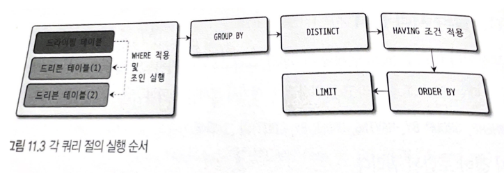
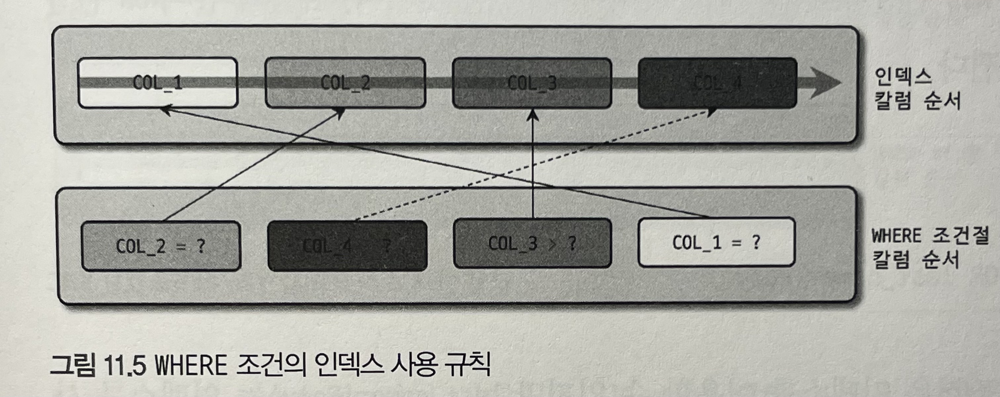

# 11장 쿼리 작성 및 최적화

## 11.4 SELECT

### 11.4.1 SELECT 절의 처리 순서

```sql
SELECT s.emp_no, COUNT(DISTINCT e.first_name) AS cnt
FROM salaries s
         INNER JOIN employees e on s.emp_no = e.emp_no
WHERE s.emp_no IN (100001, 100002)
GROUP BY s.emp_no
HAVING AVG(s.salary) > 1000
ORDER BY AVG(s.salary)
LIMIT 10;
```



- 각 요소가 없는 경우는 가능하겠지만, 대부분 위 순서를 따르며 뒤바뀌는 경우는 거의 없다. (CTE, 윈도우함수 제외)
- SQL에는 ORDER BY 나 GROUP BY 절이 있더라도 인덱스를 이용해 처리할 때는 그 단계 자체가 불필요 하므로 생략된다.


- 11.4는 ORDER BY가 사용된 쿼리에서 예외적인 순서로 실행되는 경우
- 첫번째 테이블만 읽어서 정렬을 수행한 뒤에 나머지 테이블을 읽는데, 주로 GROUP BY 절이 없이 ORDER BY만 사용된 쿼리에서 사용될 수 있는 순서다.
    
    ```sql
    explain analyze
    select *
    from salaries s
    join employees e on s.emp_no = e.emp_no
    where e.emp_no IN (100001, 100002)
    order by e.first_name;
    
    -- 정렬 먼저 수행 후 조인
    -> Nested loop inner join  (cost=3.36 rows=19) (actual time=0.068..0.081 rows=19 loops=1)
        -> Sort: e.first_name  (cost=0.91 rows=2) (actual time=0.055..0.055 rows=2 loops=1)
            -> Filter: (e.emp_no in (100001,100002))  (cost=0.91 rows=2) (actual time=0.035..0.039 rows=2 loops=1)
                -> Index range scan on e using PRIMARY over (emp_no = 100001) OR (emp_no = 100002)  (cost=0.91 rows=2) (actual time=0.033..0.037 rows=2 loops=1)
        -> Index lookup on s using PRIMARY (emp_no=e.emp_no)  (cost=0.74 rows=10) (actual time=0.008..0.011 rows=10 loops=2)
    ```
    

- 11.3, 11.4 에서 소개한 실행 순서를 벗어나는 쿼리가 필요하다면 다음과같이 서브쿼리로 작성된 인라인 뷰를  사용해야 한다.
    
    ```sql
    SELECT emp_no, cnt
    FROM (
        SELECT s.emp_no, COUNT(DISTINCT e.first_name) AS cnt, MAX(s.salary) AS max_salary
            FROM salaries s
            INNER JOIN employees e ON s.emp_no = e.emp_no
            WHERE s.emp_no in (100001, 100002)
            GROUP BY s.emp_no
            HAVING max(s.salary) > 1000
            LIMIT 10
         ) temp_view
    ORDER BY max_salary;
    
    -- limit 과 order by 의 순서가 바뀌어 동일한 결과를 반환하지 않을 수도 있음.
    -- LIMIT 실행 후 SORT
    -> **Sort**: temp_view.max_salary  (cost=13.86..13.86 rows=10) (actual time=0.110..0.110 rows=2 loops=1)
        -> Table scan on temp_view  (cost=3.62 rows=10) (actual time=0.100..0.100 rows=2 loops=1)
            -> Materialize  (cost=13.86..13.86 rows=10) (actual time=0.099..0.099 rows=2 loops=1)
                -> **Limit**: 10 row(s)  (cost=12.86 rows=10) (actual time=0.062..0.092 rows=2 loops=1)
                    -> Filter: (max(s.salary) > 1000)  (cost=12.86 rows=19) (actual time=0.061..0.091 rows=2 loops=1)
                        -> Group aggregate: max(s.salary), count(distinct e.first_name), max(s.salary)  (cost=12.86 rows=19) (actual time=0.060..0.090 rows=2 loops=1)
                            -> Nested loop inner join  (cost=10.96 rows=19) (actual time=0.034..0.071 rows=19 loops=1)
                                -> Filter: (s.emp_no in (100001,100002))  (cost=4.31 rows=19) (actual time=0.024..0.041 rows=19 loops=1)
                                    -> Index range scan on s using PRIMARY over (emp_no = 100001) OR (emp_no = 100002)  (cost=4.31 rows=19) (actual time=0.022..0.037 rows=19 loops=1)
                                -> Single-row index lookup on e using PRIMARY (emp_no=s.emp_no)  (cost=0.26 rows=1) (actual time=0.001..0.001 rows=1 loops=19)
    ```
    
- 인라인 뷰를 사용할 경우 DERIVED 와 같이 임시 테이블이 사용되기 때문에 주의해야 한다.
    
    
    
    > DERIVED 는 단위 SELECT 쿼리의 실행결과로 메모리나 디스크에 임시 테이블을 생성하는 것을 의미한다.
    > 
- 8.0에 새로 도입된 WITH 절은 항상 제일 먼저 실행되어 임시 테이블로 저장된다.
    
    ```sql
    EXPLAIN ANALYZE
    WITH temp_view AS (
        SELECT s.emp_no, COUNT(DISTINCT e.first_name) AS cnt, MAX(s.salary) AS max_salary
            FROM salaries s
            INNER JOIN employees e ON s.emp_no = e.emp_no
            WHERE s.emp_no in (100001, 100002)
            GROUP BY s.emp_no
            HAVING max(s.salary) > 1000
            LIMIT 10
    )
    SELECT emp_no, cnt
    FROM temp_view
    ORDER BY max_salary;
    
    -- WITH 절을 쓰면 실행계획 분석에서 CTE로 표시된다.
    -> Sort: temp_view.max_salary  (cost=13.86..13.86 rows=10) (actual time=0.116..0.116 rows=2 loops=1)
        -> Table scan on temp_view  (cost=3.62 rows=10) (actual time=0.100..0.100 rows=2 loops=1)
            -> Materialize **CTE** temp_view  (cost=13.86..13.86 rows=10) (actual time=0.099..0.099 rows=2 loops=1)
                -> Limit: 10 row(s)  (cost=12.86 rows=10) (actual time=0.062..0.092 rows=2 loops=1)
                    -> Filter: (max(s.salary) > 1000)  (cost=12.86 rows=19) (actual time=0.061..0.091 rows=2 loops=1)
                        -> Group aggregate: max(s.salary), count(distinct e.first_name), max(s.salary)  (cost=12.86 rows=19) (actual time=0.060..0.090 rows=2 loops=1)
                            -> Nested loop inner join  (cost=10.96 rows=19) (actual time=0.033..0.071 rows=19 loops=1)
                                -> Filter: (s.emp_no in (100001,100002))  (cost=4.31 rows=19) (actual time=0.024..0.040 rows=19 loops=1)
                                    -> Index range scan on s using PRIMARY over (emp_no = 100001) OR (emp_no = 100002)  (cost=4.31 rows=19) (actual time=0.022..0.037 rows=19 loops=1)
                                -> Single-row index lookup on e using PRIMARY (emp_no=s.emp_no)  (cost=0.26 rows=1) (actual time=0.001..0.001 rows=1 loops=19)
    ```
    

### 11.4.2 WHERE 절과 GROUP BY 절, ORDER BY 절의 인덱스 사용

**11.4.2.1 인덱스를 사용하기 위한 기본 규칙**

- WHERE, ORDER BY, GROUP BY 가 인덱스를 사용하려면 기본적으로 인덱스된 칼럼의 값 자체를 변환하지 않고 그대로 사용한다는 조건을 만족해야 한다.
- 인덱스는 칼럼의 값을 아무런 변환 없이 B-Tree에 정렬해서 저장한다.
    
    ```sql
    -- 인덱스 칼럼의 값을 가공하면 인덱스를 적절하게 활용할 수 없다.
    SELECT * FROM salaries WHERE salary*10 > 150000;
    
    -- 위 쿼리는 다음과 같이 튜닝 할 수 있지만 
    -- 옵티마이저는 인덱스를 최적으로 이용할 수 있게 표현식을 변환하지는 못한다.
    SELECT * FROM salaries WHERE salary > 150000/10;
    ```
    
- WHERE 절에 사용되는 비교 조건에서 연산자 양쪽의 데이터 타입이 일치해야 한다.
    
    ```sql
    CREATE TABLE tb_test (age VARCHAR(10), INDEX ix_age (age));
    INSERT INTO tb_test VALUES ('1'),('2'),('3'),('4'),('5'),('6'),('7');
    
    SELECT * FROM tb_test WHERE age=2; -- 인덱스 풀스캔
    
    -- 참고로 아래와 같이 반대의 경우에는 인덱스가 제대로 활용된다.
    -- p9 11.3.1.2 참고
    CREATE TABLE tb_test2 (age int, INDEX ix_age (age));
    INSERT INTO tb_test2 VALUES (1),(2),(3),(4),(5),(6),(7);
    
    SELECT * FROM tb_test WHERE age='2';
    ```
    
    
    
    타입 불일치
    
    
    
    타입 일치
    

**11.4.2.2 WHERE 절의 인덱스 사용**

- WHERE 조건이 인덱스를 사용하는 방법은 크게 작업 범위 결정 조건과 체크 조건의 두 가지 방식으로 구분할 수 있다.
    
    
    
    11.5 WHERE 조건의 인덱스 사용 규칙 ( COL2 = ? , COL4 = ? , COL_3  > ? , COL_1 = ? )
    
    - 위쪽은 4개의 칼럼이 순서대로 결합 인덱스로 생성
    - SQL의 WHERE 절에 존재하는 조건
    - WHERE 조건절의 순서에 나열된 조건들의 순서는 실제 인덱스의 사용 여부와 무관하다.
    - WHERE 절의 순서가 인덱스와 다르더라도 옵티마이저가 최적화 할 수 있다.
    - COL 4는 작업 범위 결정 조건으로 사용되지 못하고 체크 조건으로 사용되는데, 이는 WHERE 절에 명시한 순서 때문이 아니라 인덱스 순서상 COL_4 앞의 COL_3이 동등 비교 조건이아니라 범위 조건으로 사용됐기 때문이다.

- 8.0 이전 버전까지는 하나의 인덱스를 구성하는 각 칼럼의 정렬 순서가 혼합되어 사용될 수 없었다. 하지만 8.0 버전 부터는 다음과 같이 인덱스를 구성하는 칼럼 별로 정순과 역순 정렬을 혼합해서 생성할 수 있게 개선 됐다.
    
    ```sql
    	ALTER TABLE ... ADD INDEX ix_col1234 (col_1 ASC, col_2 DESC, col_3 ASC, col_4 ASC);
    ```
    

- 앞선 예제는 AND 조건일 경우이며 OR 조건일 경우 처리 방식이 바뀐다.
    
    ```sql
    SELECT *
    FROM employees
    WHERE first_name='Kebin' OR last_name='Poly'; -- last_name은 인덱스를 사용할 수 없다.
    ```
    
    - 풀테이블 + 인덱스 레인지 스캔 보다는 풀테이블 스캔 한 번이 더 빠르기 때문
    - first_name 과 last_name 에 각각 인덱스가 있다면 index_merge 스캔을 사용할 수 있다. 풀테이블 스캔보다는 빠르지만 여전히 제대로된 인덱스 하나를 레인지 스캔하는 것보다는 느리다.
    - WHERE 절에서 각 조건이 AND로 연결되면 읽어와야 할 레코드의 건수를 줄이는 역할을 하지만 각 조건이 OR로 연결되면 읽어서 비교해야 할 레코드가 더 늘어나기 때문에 WHERE 절에서 OR 사용은 주의해야 한다.

**11.4.2.3 GROUP BY 절의 인덱스 사용**

- GROUP BY 절의 각 칼럼은 비교 연산자를 가지지 않으므로 작업 범위 결정 조건이나 체크 조건과 같이 구분해서 생각할 필요는 없다.
- GROUP BY 절에 명시된 칼럼의 순서가 인덱스를 구성하는 칼럼의 순서와 같으면 GROUP BY 절은 일단 인덱스를 이용할 수 있다.
- 조건
    - GROUP BY 절에 명시된 칼럼이 인덱스 칼럼의 순서와 위치가 같아야 한다.
    - 인덱스를 구성하는 칼럼 중에서 뒤쪽에 있는 칼럼은 GROUP BY 절에 명시되지 않아도 인덱스를 사용할 수 있지만 인덱스의 앞쪽에 있는 칼럼이 GROUP BY 절에 명시되지 않으면 인덱스를 사용할 수 없다.
    - WHERE 조건절과 달리 GROUP BY 절에 명시된 칼럼이 하나라도 인덱스에 없으면 GROUP BY 절은 전혀 인덱스를 이용하지 못한다.
    
    
    
- 다음의 GROUP BY 절은 그림 11.6 의 인덱스를 이용하지 못한다.
    
    ```sql
    ... GROUP BY COL_2, COL_1 -- 순서일치하지 않음
    ... GROUP BY COL_1, COL_3, COL_2 -- 순서일치하지 않음
    ... GROUP BY COL_1, COL_3 -- 인덱스의 앞쪽에 있는 컬럼이 명시되지 않음
    ... GROUP BY COL_1, COL_2, COL_3, COL_4, COL_5 -- 인덱스에 없는 컬럼이 명시
    ```
    
- 다음의 GROUP BY 절은 인덱스를 사용할 수 있는 패턴이다.
    
    ```sql
    ... GROUP BY COL_1
    ... GROUP BY COL_1, COL_2
    ... GROUP BY COL_1, COL_2, COL_3
    ... GROUP BY COL_1, COL_2, COL_3, COL_4
    ```
    
- WHERE 조건절에서 COL_1이나 COL_2가 동등 비교 조건으로 사용된다면 GROUP BY 절에 COL_1이나 COL_2가 빠져도 인덱스를 이용한 GROUP BY 가 가능할 때도 있다.
    
    ```sql
    ... WHERE COL_1='상수' ... GROUP BY COL_2, COL_3
    ... WHERE COL_1='상수' AND COL_2='상수' ... GROUP BY COL_3, COL_4
    ... WHERE COL_1='상수' AND COL_2='상수' AND COL_3='상수' ... GROUP BY COL_4
    
    -- 위 쿼리에서 WHERE 조건의 컬럼을 GROUP BY 에 포함시켜도 결과는 같다.
    ```
    

**11.4.2.4 ORDER BY 절의 인덱스 사용**

- ORDER BY 절의 인덱스 사용 여부는 GROUP BY 요건과 거의 흡사하다
- ORDER BY 는 조건이 하나 더 있는데, 정렬되는 각 칼럼의 오름차순 및 내림차순 옵션이 인덱스와 같거나 정 반대인 경우에만 사용할 수 있다는 것이다.
    
    
    
- 다음의 ORDER BY 절은 인덱스를 이용할 수 없다. 참고로 ORDER BY 절에서 ASC나 DESC가 생략되면 오름차순 (ASC)로 해석한다.
    
    ```sql
    ... ORDER BY COL_2, COL_3 -- 앞선인덱스 생략
    ... ORDER BY COL_1, COL_3, COL_2 -- 인덱스 순서 불일치
    ... ORDER BY COL_1, COL_2 DESC, COL_3 -- 인덱스와의 정렬 불일치
    ... ORDER BY COL_1, COL_3 -- 앞선 인덱스 생략
    ... ORDER BY COL_1, COL_2, COL_3, COL_4, COL_5 -- 인덱스에 없는 컬럼
    ```
    

**11.4.2.5 WHERE 조건과 ORDER BY(또는 GROUP BY) 절의 인덱스 사용**

- WHERE 절과 ORDER BY 절이 같이 사용된 하나의 쿼리 문장은 다음 3가지 중 한 가지 방법으로만 인덱스를 이용한다.
    - WHERE 절과 OPOER BY 절이 동시에 같은 인덱스를 이용: 
    WHERE 절의 비교 조건에서 사용하는 칼럼과 ORDER BY 절 의 정렬 대상 칼럼이 모두 하나의 인덱스에 연속해서 포함돼 있을 때 이 방식으로 인덱스를 사용할 수 있다. 이 방법 은 나머지 2가지 방식보다 훨씬 빠른 성능을 보이기 때문에 가능하다면 이 방식으로 처리할 수 있게 쿼리를 튜닝하 거나 인덱스를 생성하는 것이 좋다.
    - WHERE 절만 인덱스를 이용: 
    ORDER BY 절은 인덱스를 이용한 정렬이 불가능하며, 인덱스를 통해 검색된 결과 레코드 를 별도의 정렬 처리 과정(Using Filesort)을 거쳐 정렬을 수행한다. 주로 이 방법은 WHERE 절의 조건에 일치하는 레 코드의 건수가 많지 않을 때 효율적인 방식이다.
    - ORDER BY 절만 인덱스를 이용: 
    OROER BY 절은 인덱스를 이용해 처리하지만 WHERE 절은 인덱스를 이용하지 못한다.
    이 방식은 ORDER BY 절의 순서대로 인덱스를 읽으면서 레코드 한 건씩 WHERE 절의 조건에 일치하는지 비교하고 일 치하지 않을 때는 버리는 형태로 처리한다. 주로 아주 많은 레코드를 조회해서 정렬해야 할 때는 이런 형태로 튜닝 하기도 한다.
- 또한 WHERE 절에서 동등 비교 조건으로 비교된 칼럼과 ORDER BY 절에 명시된 칼럼이 순서대로 빠짐 없이 인덱스 칼럼의 왼쪽부터 일치해야 한다. 중간에 빠지는 칼럼이 있으면 WHERE 절이나 ORDER BY 절 모두 인덱스를 사용할 수 없다.


```sql
-- 인덱스 사용 가능
SELECT *
FROM tb_test
WHERE COL_1=10
ORDER BY COL_2, COL_3;

-- 위와 같지만 인덱스를 사용하는지 확인하기 좋다.
SELECT *
FROM tb_test
WHERE COL_1=10
ORDER BY COL_1, COL_2, COL_3;
```

- 범위 조건일 경우
    
    ```sql
    SELECT * FROM tb_test WHERE COL_1 > 10 ORDER BY COL_1, COL_2, COL_3; -- 인덱스 사용가능
    SELECT * FROM tb_test WHERE COL_1 > 10 ORDER BY COL_2, COL_3; -- 인덱스 사용 불가
    ```
    
    다음과 같이 WHERE 절과 ORDER BY 절에 명시된 칼럼의 순서가 일치하지 않거나 중간에 빠지는 칼럼이 있으면 인덱스를 이용해 WHERE 절과 ORDER BY 절을 모두 처리하기란 불가능하다.
    
    ```sql
    ... WHERE COL_1=10 ORDER BY COL_3, COL_4 -- COL2 가 중간에 빠져있음
    ... WHERE COL_1>10 ORDER BY COL_2, COL_3 -- WHERE의 COL_1이 범위조건이므로 ORDER BY 에 COL_1을 명시해야함
    ... WHERE COL_1 IN (1,2,3,4) ORDER BY COL_2 -- 위와 같은 경우 (COL_1의 결과가 여러개)
    ```
    

**11.4.2.6 GROUP BY 절과 ORDER BY 절의 인덱스 사용**

- GROUP BY와 ORDER BY 절이 동시에 사용된 쿼리에서 두 절이 모두 하나의 인덱스를 사용해서 처리되려면 GROUP BY 절에 명시된 칼럼과 ORDER BY에 명시된 칼럼의 순서와 내용이 모두 같아야 한다. 둘 중 하나라도 인덱스를 이용할 수 없을 때에는 둘 다 인덱스를 사용할 수 없다.
    
    ```sql
    ... GROUP BY col_1, col_2 ORDER BY col_2 -- ORDER BY col_1 빠짐
    ... GROUP BY col1, col_2 ORDER BY col1, col3 -- 동일하지 않음
    ```
    
- 5.7 까지는 GROUP BY 칼럼에 대한 정렬까지 함께 수행하는 것이 기본 동작 방식이었지만
- 8.0 부터는 GROUP BY 절이 칼럼의 정렬까지는 보장하지 않는 형태로 바뀌었다. 따라서 GROUP BY 칼럼으로 그루핑과 정렬을 모두 수행하기 위해서는 GROUP BY 절과 ORDER BY 절을 모두 명시해야 한다.

**11.4.2.7 WHERE 조건과 ORDER BY 절, GROUP BY 절의 인덱스 사용**

1. WHERE 절이 인덱스를 사용할 수 있는가?
2. GROUP BY 절이 인덱스를 사용할 수 있는가?
3. GROUP BY 절과 ORDER BY 절이 동시에 인덱스를 사용할 수 있는가?


### 11.4.3 WHERE 절의 비교 조건 사용 시 주의사항

**11.4.3.1 NULL 비교**

- 다른 DBMS와 달리 MySQL 에서는 NULL값이 포함된 레코드도 인덱스로 관리됨.
- NULL 과 비교하려면 `IS NULL` 또는 `<=>` 연산자를 사용해야 한다.
- NULL 값 확인을 위해 `ISNULL()` 함수를 이용해 수도 있으나 WHERE 절에서 사용시 주의해야한다.
    
    ```sql
    SELECT * FROM titles WHERE to_date IS NULL; -- 인덱스 레인지스캔
    SELECT * FROM titles WHERE ISNULL(to_date); -- 인덱스 레인지스캔
    SELECT * FROM titles WHERE ISNULL(to_date)=1; -- 인덱스or테이블 풀스캔
    SELECT * FROM titles WHERE ISNULL(to_date)=true; -- 인덱스or테이블 풀스캔
    ```
    

**11.4.3.2 문자열이나 숫자 비교**

- 문자열 칼럼이나 숫자 칼럼을 비교할 때는 반드시 그 타입에 맞는 상숫값을 사용할 것을 권장.
    
    ```sql
    SELECT * FROM employees WHERE emp_no=100001; -- 인덱스 이용 O
    SELECT * FROM employees WHERE first_name='Smith'; -- 인덱스 이용 O
    SELECT * FROM employees WHERE emp_no='100001'; -- 조건이 숫자타입으로 변환되어 실행됨 (성능저하X)
    SELECT * FROM employees WHERE first_name=100001; -- first_name 컬럼을 숫자로 변환해서 실행됨. 컬럼 타입이 변하기 때문에 인덱스 사용 X
    ```
    

**11.4.3.3 날짜 비교**

- 날짜관련 타입들 → DATE, DATETIME, TIMESTAMP, TIME

**11.4.3.3.1 DATE 또는 DATETIME과 문자열 비교**

```sql
-- 1)
SELECT COUNT(*)
FROM employees
WHERE hire_date>STR_TO_DATE('2011-07-23', '%Y-%m-%d'); 
-- MySQL 에서는 컬럼 타입이 DATE, DATETIME일 경우
-- 문자열을 내부적으로 타입변환해서 비교하기 때문에 명시적으로 변환해줄필요 없다. 

-- 2)
SELECT COUNT(*)
FROM employees
WHERE hire_date>'2011-07-23' -- 위쿼리와 동일한 결과 (위 쿼리와 동일하게 인덱스도 효율적으로 사용)

-- 3)
SELECT COUNT(*)
FROM employees
WHERE DATE_FORMAT(hire_date, '%Y-%m-%d') > '2011-07-23';

-- 위 예제와 같이 컬럼 자체의 타입을 문자열로 바꾸기 때문에 인덱스를 활용하지 못한다.
-- 변경이 필요한경우 가능하다면 가급적 상수부분을 변경하는 형태로 사용하는것이 좋음 아래도 마찬가지

-- 4), 5)
SELECT COUNT(*)
FROM employees
WHERE DATE_ADD(hire_date, INTERVAL 1 YEAR) > '2011-07-23'; (X)
WHERE hire_date > DATE_SUB('2011-07-23', INTERVAL 1 YEAR); (O)
```

**11.4.3.3.2 DATE와 DATETIME의 비교**

```sql
-- DATETIME 에서 시간부분만 빼고 비교하고 싶은 경우
SELECT COUNT(*)
FROM employees
WHERE hire_date>DATE(NOW());

-- DATETIME 값을 DATE 타입으로 만들지 않고 그냥 비교하면 
-- DATE 타입 값을 DATETIME으로 변환해서 같은 타입을 만든 다음 비교를 수행한다.
-- STR_TO_DATE('2011-06-30', '%Y-%m-%d') 이 '2011-06-30 00:00:00' 으로 변환됨
SELECT 
STR_TO_DATE('2011-06-30', '%Y-%m-%d') < STR_TO_DATE('2011-06-30 00:00:01', '%Y-%m-%d %H:%i%s');

SELECT
STR_TO_DATE('2011-06-30', '%Y-%m-%d') >= STR_TO_DATE('2011-06-30 00:00:01', '%Y-%m-%d %H:%i%s');
```

- DATETIME과 DATE 타입의 비교에서 타입 변환은 인덱스의 사용 여부에 영향을 미치치 않기 때문에 성능 보다는 쿼리의 결과에 주의해서 사용하면 된다.

**11.4.3.3.3 DATETIME과 TIMESTAMP의 비교**

- DATE나 DATETIME과 TIMESTAMP의 값을 타입 변환 없이 비교하면 문제 없고 인덱스 레인지 스캔을 사용하는 것처럼 보이지만 사실은 그렇지 않다.
    
    ```sql
    SELECT COUNT(*) FROM employees WHERE hire_date < '2011-07-23 11:10:12';
    
    SELECT COUNT(*) FROM employees WHERE hire_date > UNIX_TIMESTAMP('1986-01-01 00:00:00');
    -- UNIX_TIMESTAMP 의 결괏값은 MySQL 내부적으로는 단순 숫자 값에 불과할 뿐이므로
    -- 원하는 결과를 얻을 수 없다.
    
    SHOW WARNINGS;
    ```
    
    
    
    ```sql
    -- 다음과 같이 상수 리터럴을 비교 컬럼타입에 맞게 변환해서 사용하는 것이 좋다.
    
    SELECT COUNT(*) FROM employees WHERE hire_date < FROM_UNIXTIME(UNIX_TIMESTAMP());
    SELECT COUNT(*) FROM employees WHERE hire_date < NOW();
    ```
    

**11.4.3.4 Short-Circuit Evaluation**

```sql
boolean in_transaction;

if( in_transaction && has_modified() ) { -- 이런 형태를 말함
	commit();
}
```

```sql
-- 전체
SELECT COUNT(*) FROM salaries; -- 2844047건

-- 1번 조건
SELECT COUNT(*) FROM salaries
WHERE CONVERT_TZ(from_date, '+00:00', '+09:00')>'1991-01-01'; -- 2442943건

-- 2번 조건
SELECT COUNT(*) FROM salaries
WHERE to_date < '1985-01-01'; -- 0건

-- 1+2 결합 (1)
-- 전체 ROW(2844047)에 대해 CONVER_TZ 변환 후 2442943의 비교작업을 한다.
SELECT COUNT(*) FROM salaries
WHERE CONVERT_TZ(from_date, '+00:00', '+09:00')>'1991-01-01'
AND to_date < '1985-01-01'; -- 44ms

-- 1+2 결합 (2)
-- 2844047건 비교 작업만 수행
SELECT COUNT(*) FROM salaries
WHERE to_date < '1985-01-01'
AND CONVERT_TZ(from_date, '+00:00', '+09:00')>'1991-01-01'; -- 33ms. 2번째조건 호출되지않음
```

- MySQL 서버는 Short-Circuit Evaluation 방식을 사용해 순서대로 WHERE절 조건을 비교한다.
- 하지만 WHERE 절 조건 중 인덱스를 사용할 수 있는 조건이 있다면 그 조건을 최우선으로 사용한다.
    
    ```sql
    -- first_name에 인덱스 
    SELECT * FROM employees;
    WHERE last_name='Aamodt' (2)
    AND first_name='Matt' (1)
    AND MONTH(birth_date_=1 (3) 
    ```
    
- 좀 더 복잡한 예제
    
    ```sql
    -- GROUP BY HAVING 절이 있기 때문에 세미조인 최적화 불가
    -- first_name에 인덱스가 있기 때문에 1번으로 읽는다.
    -- 나머지는 순서대로 수행된다. 서브쿼리 -> last_name
    SELECT *
    FROM employees e
    WHERE e.first_name = 'Matt'
      AND EXISTS(SELECT 1
                 FROM salaries s
                 WHERE s.emp_no = e.emp_no
                   AND s.to_date > '1995-01-01'
                 GROUP BY s.salary
                 HAVING COUNT(*) > 1)
      AND e.last_name = 'Aamodt';
    ```
    
    - 위 쿼리의 WHERE 조건 순서를 변경하며 비교
    
    - last_name을 먼저 명시할경우
    
    
    
    - 서브쿼리를 먼저 명시할 경우
    
    
    
- 결론: 쿼리를 작성할때  가능하면 복잡한 연산 또는 다른 테이블의 레코드를 읽어야 하는 서브쿼리 조건 등은 WHERE 절의 뒤쪽에 배치하는 것이 좋다.

### 11.4.4 DISTINCT

- DISTINCT를 남용하는 것은 성능적인 문제도 있지만 쿼리의 결과도 의도한 바와 달라질 수 있다.
- 조인하는 쿼리에서 레코드가 몇 배씩 불어나기도 하는데 이 경우 DISTINCT를 남용하는 경우가 발생한다.
테이블간 조인 쿼리를 작성하는 경우 테이블간의 관계를 업무적 특성에 따라 잘 이해하는 것이 중요하다.

### 11.4.5 LIMIT n

- LIMIT은 쿼리 결과에서 지정된 순서에 위치한 레코드만 가져오고자 할 때 사용한다.
    
    ```sql
    SELECT * FROM employees
    WHERE emp_no BETWEEN 10001 AND 10010 -- 1) 조건에 맞는 레코드를 전부 읽는다.
    ORDER BY first_name -- 2) 그 결과를 정렬한다.
    LIMIT 0, 5; -- 3) 정렬된 결과에서 상위 5개를 가져온다.
    ```
    
    - 정렬이 완료되지 않았더라도 `LIMIT에서 필요한 레코드만 준비되면 그 즉시 쿼리를 종료`한다.
    - 위 쿼리에서는 상위 5개가 정렬되는 순간 작업을 멈춘다.
    - 하지만 정렬의 특성상 상당히 많은 작업이 완료되어야 상위 5건을 가려낼 수 있기 때문에 LIMIT으로 성능 향상을 크게 기대하긴 힘들다.
- GROUP BY 절이나 DISTINCT 등과 같이 LIMIT이 사용됐을 때 어떻게 작동하는지
    
    ```sql
    SELECT * FROM employees LIMIT 0,10;
    SELECT * FROM employees GROUP BY first_name LIMIT 0,10;
    SELECT DISTINCT first_name FROM employees LIMIT 0,10;
    
    SELECT * FROM employees
    WHERE emp_no BETWEEN 10001 AND 11000
    ORDER BY first_name
    LIMIT 0, 10;
    ```
    
- (중요❗️❗️❗️) 보통 페이지 쿼리를 쓸때 LIMIT m, n 쿼리를 사용하는데 수치가 커질경우 성능에 좋지않은 영향을 미친다.
    
    ```sql
    SELECT * FROM salaries ORDER BY salary LIMIT 2000000, 10;
    -- 2000010 건의 쿼리를 읽고 나머지 2000000만개를 버리는 형태로 처리된다.
    -- 이 경우 다음과 같이 튜닝하는 것이 좋다.
    
    -- 첫번째 페이지 조회 쿼리
    SELECT * FROM salaries ORDER BY salary LIMIT 0, 10
    
    -- 두번째 페이지
    SELECT * FROM salaries 
    WHERE salary >=38864 AND NOT (salary=38864 AND emp_no<=274049) -- 이전페이지 조회 제외를 위한 조건
    ORDER BY salary 
    LIMIT 0, 10
    
    -- 마지막 페이지
    SELECT * FROM salaries 
    WHERE salary >=154888 AND NOT (salary=154888 AND emp_no<=109334)
    ORDER BY salary 
    LIMIT 0, 10
    ```
    

### 11.4.6 COUNT()

- * 가 모든 칼럼을 가져오라는 의미가 아니라 레코드 자체를 의미하기 때문에 COUNT(*) COUNT(1) COUNT(PK) 등은 모두 동일한 처리 성능을 보인다.
- MyISAM 스토리지 엔진은 메타정보에서 전체 레코드 건수를 관리하기 때문에 
`SELECT COUNT(*) FROM TABLE` 과 같이 조건없이 조회해도 빠르게 처리된다.
- 하지만 InnoDB 스토리지 엔진은 직접 데이터나 인덱스를 읽어야만 레코드 건수를 가져올 수 있기 때문에 큰 테이블에서 COUNT() 함수 사용에 주의해야 한다.
- ORDER BY 나 LEFT JOIN 과 같이 COUNT(*) 결과에 상관없는 문장은 제거하는 것이 좋다.
- 옵티마이저가 ORDER BY 절을 제거해 주긴 하지만 복잡도 저하 가독성 향상을 위해 제거하도록 하자.
- COUNT(*) 쿼리가 값을 SELECT 하는 쿼리보다 항상 빠른 것은 아니다. 튜닝이 올바르지 않으면 매우 느리고 부하가 많은 쿼리가 실행된다.
- COUNT(칼럼명 또는 표현식) 과 같은 경우 NULL이 아닌 레코드 건수만 반환한다.

### 11.4.7 JOIN

11.4.7.1 JOIN의 순서와 인덱스

- 조인 작업에서 드라이빙 테이블을 읽을 때는 인덱스 탐색 작업을 단 한 번만 수행하고, 그 이후부터는 스캔만 실행하면 된다.
- 드리븐 테이블에서는 인덱스 탐색 작업과 스캔 작업을 드라이빙 테이블에서 읽은 레코드 건수만큼 반복한다. 드라이빙 테이블과 드리븐 테이블이 1:1로 조인되더라도 드리븐 테이블을 읽는 것이 훨씬 더 큰 부하를 차지한다. 그래서 옵티마이저는 항상 드라이빙 테이블이 아니라 드리븐 테이블을 최적으로 읽을 수 있게 실행 계획을 수립한다.
    
    ```sql
    SELECT *
    FROM employees e, dept_emp de
    WHERE e.emp_no=de.emp_no;
    ```
    
    - 두칼럼 모두 인덱스가 있는 경우
    - employee.emp_no 에만 인덱스가 있는 경우
    - dept_emp.emp_no 에만 인덱스가 있는 경우
    - 두 칼럼 모두 인덱스가 없는 경우

11.4.7.2 JOIN 칼럼의 데이터 타입

- WHERE 조건 때와 마찬가지로 조인 조건도 데이터 타입을 맞춰줘야 한다.
- 조인 칼럼 간의 비교에서 각 칼럼의 데이터 타입이 일치하지 않으면 인덱스를 효율적으로 이용할 수 없다.
    
    ```sql
    CREATE TABLE tb_test1 (user_id INT, user_type INT, PRIMARY KEY(user_id));
    CREATE TABLE tb_test2 (user_type CHAR(1), type_desc VARCHAR(10), PRIMARY KEY(user_type));
    
    SELECT *
    FROM tb_test1 tb1, tb_test2 tb2
    WHERE tb1.user_type=tb2.user_type;
    
    -- 각 테이블의 user_type 의 데이터 타입이 다르다.
    -- 따라서 tb_test2 테이블의 CHAR(1) 에서 INT로 변환해서 비교를 수행한다.
    -- 그로 인해 tb_test2 테이블의 인덱스를 제대로 사용할 수 없다.
    ```
    
- CHAR ↔  VARCHAR , INT ↔  BIGINT , DATE ↔  DATETIME 사이에서 불일치 문제는 발생 X
- 다음과 같은 상황에서는 문제가 된다.
    - CHAR ↔  INT 와 같이 데이터 타입종류가 완전히 다른경우
    - 같은 CHAR 타입이더라도 문자 집합이나 콜레이션이 다른 경우 (`p87` 예제)
    - 같은 INT 타입이더라도 부호(Sign)의 존재여부가 다른경우

11.4.7.3 OUTER JOIN의 성능과 주의사항

```sql
SELECT *
FROM employees e
LEFT JOIN dept_emp de ON de.emp_no=e.emp_no
LEFT JOIN departments d ON d.dept_no=de.dept_no AND d.dept_name='Development';
```


아우터 조인의 실행계획

- 주 테이블의 데이터가 일관되지 않은 경우에만 아우터 조인이 필요한 경우인 것이다.
- MyQSL 옵티마이지 는 절대 아우터로 조인되는 테이블을 드라이빙 테이블로 선택하지 못하기 때문에 풀 스캔이 필요한 employees 테이블을 드라이빙 테이블로 선택한다. 그 전과 쿼리의 성능이 떨어지는 실행 계획을 수립한 것이다.

```sql
SELECT *
FROM employees e
JOIN dept_emp de ON de.emp_no=e.emp_no
JOIN departments d ON d.dept_no=de.dept_no AND d.dept_name='Development';
-- 이너 조인으로 변경하면 부서명이 'Development' 인 레코드 1건만 찾아서 조인을 실행하는 실행계획을 선택한다.
```


- 아우터 조인시 자주하는 실수중 하나는 WHERE 절에 아우터로 조인되는 테이블의 조건을 함꼐 명시하는 것이다.
    
    ```sql
    SELECT *
    FROM employees e
    LEFT JOIN dept_manager mgr ON mgr.emp_no=e.emp_no
    WHERE mgr.dept_no='d001'; -- X. 이같은경우 옵티마이저가 쿼리를 이너조인으로 변경한다.
    ```
    

**11.4.7.4 JOIN과 외래키(FOREIGN KEY)**

- 테이블 조인과 외래키는 아무런 연관이 없다.
- 주목적은 데이터의 무결성을 보장하기 위함.

**11.4.7.5 지연된 조인**

- 조인이 되면 대부분 레코드가 늘어나기 때문에 조인 이후 GROUP BY 나 ORDER BY를 할 경우 조인 전에 수행(지연된 조인)하는 것 보다 더 많은 레코드를 처리해야 한다.
- 지연된 조인은 LIMIT이 함께 사용된 쿼리에서 더 큰 효과를 얻을 수 있다.
    
    ```sql
    -- 지연된 조인 X
    SELECT e.*
    FROM salaries s, employees e
    WHERE e.emp_no=s.emp_no
    AND s.emp_no BETWEEN 10001 AND 13000
    GROUP BY s.emp_no
    ORDER BY SUM(s.salary) DESC
    LIMIT 10
    
    -- 지연된 조인 O
    SELECT e.*
    FROM
    (SELECT s.emp_no
    FROM salaries s
    WHERE s.emp_no BETWEEN 10001 AND 13000
    GROUP BY s.emp_no
    ORDER BY SUM(s.salary) DESC
    LIMIT 10) x,
    employees e
    WHERE e.emp_no=x.emp_no;
    ```
    
    
    
    지연된 조인을 하지 않은 실행계획
    
    
    
    지연된 조인을 한 실행계획
    

- 잘 튜닝된 지연된 쿼리는 원래 쿼리의 몇 십배, 몇 백배 더 나은 성능을 보일 수도 있다.
- 모든 쿼리를 지연된 조인 형태로 개선할 수 있는 것은 아니다.
- 지연된쿼리의 조건
    - LEFT (OUTER) JOIN인 경우 드라이빙 테이블과 드리븐 테이블은 1:1 또는 M:1 관계여야 한다.
    - INNER JOIN인 경우 드라이빙 테이블과 드리븐 테이블은 1:1 또는 M:1의 관계임과 동시에 당연한 조건이겠지만) 드 라이빙 테이블에 있는 레코드는 드리븐 테이블에 모두 존재해야 한다. 두 번째와 세 번째 조건은 드라이빙 테이블을 서브쿼리로 만들고 이 서브쿼리에 LIMIT을 추가해도 최종 결과의 건수가 변하지 않는다는 보증을 해주는 조건이기 때문에 반드시 정확히 확인한 후 적용해야 한다.

**11.4.7.6 래터럴 조인**

- 8.0 이전까지는 그룹 별로 몇 건씩만 가져오는 쿼리를 작성할 수 없었다.
- 하지만 8.0 버전 부터는 래터럴 조인이라는 기능을 이용해 특정 그룹별로 서브쿼리를 실행해서 그 결과를 조인하는 것이 가능해졌다.
    
    ```sql
    SELECT *
    FROM employees e
             LEFT JOIN LATERAL (SELECT *
                                FROM salaries s
                                WHERE s.emp_no = e.emp_no -- 참조 가능
                                ORDER BY s.from_date DESC
                                LIMIT 2) s2 ON s2.emp_no = e.emp_no
    WHERE e.first_name = 'Matt';
    ```
    

**11.4.7.7 실행 계획으로 인한 정렬 흐트러짐**

-