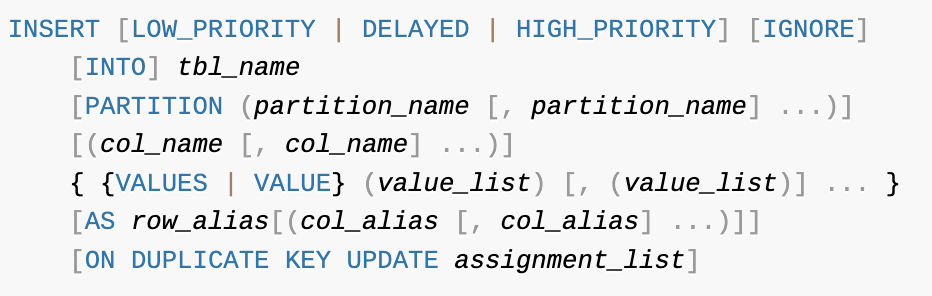

# 11. 쿼리 작성 및 문서화

## 1. 쿼리 작성과 연관된 시스템 변수

### 1.1) SQL 모드

`sql_mode` 시스템 변수에 설정된 값을 통해 SQL 문장 작성 규칙과 데이터 타입 변환, 기본값 등을 설정할 수 있다. ➔ [[doc] Server SQL Modes](https://dev.mysql.com/doc/refman/8.0/en/sql-mode.html)

1. `STRICT_ALL_TABLES`, `STRICT_TRANS_TABLES`
2. `ANSI_QUOTES`
3. `ONLY_FULL_GROUP_BY`
4. `PIPE_AS_CONCAT`
5. `PAD_CHAR_TO_FULL_LENGTH`
6. `NO_BACKSLASH_ESCAPES`
7. `IGNORE_SPACE`
8. `REAL_AS_FLOAT`
9. `NO_ZERO_IN_DATE`, `NO_ZERO_DATE`
10. `ANSI`
11. `TRADITIONAL`

### 1.2) 영문 대소문자 구분

- MySQL 서버는 설치된 운영체제에 따라 테이블명의 대소문자를 구분한다.
  (DB 테이블이 디렉터리나 파일로 매핑되기 때문에 윈도우에 설치된 MySQL에서는 대소문자를 구분하지 않지만, 유닉스 계열의 운영체제에서는 대소문자를 구분한다.)
- `lower_case_table_names` 시스템 변수로 대소문자 구분의 영향을 받지 않게 설정할 수 있다.
- 가능하면 초기 DB나 테이블을 생성할 때 통일해서 사용하는 편이 좋다.

### 1.3) MySQL 예약어

- 데이터베이스, 테이블, 칼럼의 이름을 예약어와 같은 키워드로 생성하면 해당 칼럼이나 테이블을 SQL에서 사용하기 위해 역따옴표(\`)나 쌍따옴표(")로 감싸야 한다.
  ➔ 예약어를 사용하는 것은 찾아내기 어려운 버그를 만들 수도 있으므로, 테이블을 생성할 때는 **테이블명이나 칼럼명에 역따옴표를 사용하지 않은 상태로 생성하길 권장한다.**

## 2. SQL 문법 표기를 읽는 방법

- [[doc] INSERT Statement](https://dev.mysql.com/doc/refman/8.0/en/insert.html)

  
    - 대괄호(`[]`): 해당 키워드나 표현식 자체가 선택 사항임
    - 중괄호(`{}`): 괄호 내의 아이템 중에서 반드시 하나를 사용해야 함
    - 이텔릭체: 사용자가 선택해서 작성하는 토큰
    - 파이프(`|`): 키워드나 표현식 중에서 하나만 선택해서 사용해야 함
    - 줄임표(`...`): 표현식의 조합이 반복될 수 있음

## 3. MySQL 연산자와 내장 함수

일반적으로 각 DBMS의 내장 함수는 거의 같은 기능을 제공하지만, 이름이 호환되는 것은 거의 없다.

### 3.1) 리터럴 표기법

#### (1) 문자열

- SQL 표준에서 문자열은 홀따옴표(`'`)를 사용한다.
- MySQL에서 문자열은 쌍따옴표를 사용할 수도 있다.

```sql
-- ANSI 표준
SELECT * FROM departments WHERE dept_no = 'd001';
SELECT * FROM departments WHERE dept_no = 'd''001';
SELECT * FROM departments WHERE dept_no = 'd""001';

-- MySQL에서만 사용 가능
SELECT * FROM departments WHERE dept_no = "d''001";
SELECT * FROM departments WHERE dept_no = "d""001";
```

#### (2) 숫자

- 숫자는 따옴표 없이 그냥 입력하면 된다.
- 숫자를 문자열 형태로 따옴표를 사용하더라도 비교 대상이 숫자 값이거나 숫자 타입의 칼럼이면 MySQL 서버에서 자동 변환된다.
- 하지만 숫자가 저장된 문자열 칼럼에서 숫자 값을 상수로 비교하면 칼럼의 모든 문자열 값을 숫자로 변환해서 비교를 수행해야 하므로 주의해야 한다.

```sql
-- rows 칼럼: 1 건
EXPLAIN SELECT * FROM employees WHERE emp_no = '10001';
+----+-------------+-----------+------------+-------+---------------+---------+---------+-------+------+----------+-------+
| id | select_type | table     | partitions | type  | possible_keys | key     | key_len | ref   | rows | filtered | Extra |
+----+-------------+-----------+------------+-------+---------------+---------+---------+-------+------+----------+-------+
|  1 | SIMPLE      | employees | NULL       | const | PRIMARY       | PRIMARY | 4       | const |    1 |   100.00 | NULL  |
+----+-------------+-----------+------------+-------+---------------+---------+---------+-------+------+----------+-------+

CREATE TABLE IF NOT EXISTS str_employees SELECT * FROM employees;
ALTER TABLE str_employees MODIFY emp_no varchar(10);

-- rows 칼럼: 299198 건
EXPLAIN SELECT * FROM str_employees WHERE emp_no = '10001';
+----+-------------+---------------+------------+------+---------------+------+---------+------+--------+----------+-------------+
| id | select_type | table         | partitions | type | possible_keys | key  | key_len | ref  | rows   | filtered | Extra       |
+----+-------------+---------------+------------+------+---------------+------+---------+------+--------+----------+-------------+
|  1 | SIMPLE      | str_employees | NULL       | ALL  | NULL          | NULL | NULL    | NULL | 299198 |    10.00 | Using where |
+----+-------------+---------------+------------+------+---------------+------+---------+------+--------+----------+-------------+
```

#### (3) 날짜

- MySQL에서는 정해진 형태의 날짜 포맷으로 표기하면 MySQL 서버가 자동으로 `DATE`나 `DATETIME` 값으로 변환하기 때문에 `STR_TO_DATE()` 같은 함수를 사용하지 않아도 된다.

#### (4) 불리언

- MySQL에서 `BOOL`이나 `BOOLEAN` 타입은 사실 `TINYINT` 타입이다.
- 꼭 불리언 타입으로 사용해야 한다면 `ENUM` 타입으로 관리하는 것이 실수를 줄이고 명확하게 사용하는 방법이다.

```sql
-- 테스트용 테이블 생성
CREATE TABLE tb_boolean (bool_value BOOLEAN);
INSERT INTO tb_boolean VALUES (FALSE);

-- 데이터 추가
INSERT INTO tb_boolean VALUES (FALSE), (TRUE), (2), (3), (4), (5);

-- BOOLEAN 타입이 TINYINT로 저장됨
SELECT * FROM tb_boolean WHERE bool_value IN (FALSE, TRUE);
+------------+
| bool_value |
+------------+
|          0 |
|          1 |
+------------+
```

### 3.2) MySQL 연산자

#### (1) 동등 비교

- 동등 비교 연산자는 `=`와 `<=>`(NULL-Safe)가 있다.

```sql
SELECT 1 = 1, NULL = NULL, 1 = NULL;
+-------+-------------+----------+
| 1 = 1 | NULL = NULL | 1 = NULL |
+-------+-------------+----------+
|     1 |        NULL |     NULL |
+-------+-------------+----------+

SELECT 1 <=> 1, NULL <=> NULL, 1 <=> NULL;
+---------+---------------+------------+
| 1 <=> 1 | NULL <=> NULL | 1 <=> NULL |
+---------+---------------+------------+
|       1 |             1 |          0 |
+---------+---------------+------------+
```

#### (2) 부정 비교

- 부정 비교 연산자는 `<>`와 `!=`가 있다.

#### (3) NOT 연산자

- 연산의 결과를 반대로(부정) 만드는 연산자로 `NOT` 또는 `!`를 사용한다.

```sql
SELECT !1, !FALSE, NOT 1, NOT 0, NOT (1=1);
+----+--------+-------+-------+-----------+
| !1 | !FALSE | NOT 1 | NOT 0 | NOT (1=1) |
+----+--------+-------+-------+-----------+
|  0 |      1 |     0 |     1 |         0 |
+----+--------+-------+-------+-----------+
```

#### (4) AND와 OR 연산자

- `AND` 연산은`&&` `OR` 연산은 `||`를 사용한다.
- 오라클에서는 OR 연산자산(`||`)는 문자열을 결합하는 연산자로 사용된다.
    - 오라클에서 쓰는 방식으로 변경하려면 `sql_mode`에서 `PIPE_AS_CONCAT`을 설정하면 된다.
- `AND`, `OR` 연산자 우선순위
    - 순서와 관계없이 `AND` 연산이 `OR` 연산보다 우선 처리된다.
      괄호로 묶은 경우에는 괄호가 우선 처리된다.

```sql
SELECT TRUE OR FALSE AND FALSE, 
        TRUE OR (FALSE AND FALSE),
        (TRUE OR FALSE) AND FALSE;
+-------------------------+---------------------------+---------------------------+
| TRUE OR FALSE AND FALSE | TRUE OR (FALSE AND FALSE) | (TRUE OR FALSE) AND FALSE |
+-------------------------+---------------------------+---------------------------+
|                       1 |                         1 |                         0 |
+-------------------------+---------------------------+---------------------------+
```

#### (5) 나누기와 나머지 연산자

- 나누기 연산은 `/` 또는 `DIV` 연산자를 사용한다.
- 나머지를 가져오는 연산자로는 `%` 또는 `MOD`를 사용한다.

```sql
SELECT 29 / 9,
        29 DIV 9,
        29 % 9,
        MOD(29, 9),
        29 MOD 9;
+--------+----------+--------+------------+----------+
| 29 / 9 | 29 DIV 9 | 29 % 9 | MOD(29, 9) | 29 MOD 9 |
+--------+----------+--------+------------+----------+
| 3.2222 |        3 |      2 |          2 |        2 |
+--------+----------+--------+------------+----------+
```

#### (6) REGEXP 연산자

- 문자열 값이 어떤 패턴을 만족하는지 확인하는 연산자로, `REGEXP`와 `RLIKE`가 있다.
    - `RLIKE`는 오른쪽 일치 연산자가 아닌 정규 표현식 연산자이다.
    - `REGEXP` 조건의 비교는 인덱스 레인지 스캔을 사용할 수 없다.
      ➔ 가능하면 데이터 조회 범위를 줄일 수 있는 조건과 함께 `REGEXP` 연산자를 사용하길 권장한다.

```sql
SELECT 'abc' REGEXP '^[x-z]',
       'abc' RLIKE '^[x-z]';
+-----------------------+----------------------+
| 'abc' REGEXP '^[x-z]' | 'abc' RLIKE '^[x-z]' |
+-----------------------+----------------------+
|                     0 |                    0 |
+-----------------------+----------------------+
```

#### (7) LIKE 연산자

- 와일드카드 문자( `%`, `_`)를 사용하여 단순한 문자열 패턴을 비교하는 연산자이다.
    - `%` : 0개 또는 1개 이상의 문자에 일치
    - `_` : 1개의 문자에 일치
- `LIKE` 연산자를 사용할 때 와일드카드가 검색어의 뒤쪽에 있다면 인덱스를 이용해 처리할 수 있지만, 와일드카드가 앞쪽에 있다면 인덱스를 사용할 수 없다.

```sql
-- '%' 연산자를 사용한 LIKE
EXPLAIN 
SELECT COUNT(*) 
FROM employees 
WHERE first_name LIKE 'Christ%';
+----+-------------+-----------+------------+-------+---------------+--------------+---------+------+------+----------+--------------------------+
| id | select_type | table     | partitions | type  | possible_keys | key          | key_len | ref  | rows | filtered | Extra                    |
+----+-------------+-----------+------------+-------+---------------+--------------+---------+------+------+----------+--------------------------+
|  1 | SIMPLE      | employees | NULL       | range | ix_firstname  | ix_firstname | 58      | NULL | 1157 |   100.00 | Using where; Using index |
+----+-------------+-----------+------------+-------+---------------+--------------+---------+------+------+----------+--------------------------+

-- '%' 연산자가 선행일치로 되어 있으면 인덱스를 사용하지 못함
EXPLAIN 
SELECT COUNT(*) 
FROM employees 
WHERE first_name LIKE '%rist';
+----+-------------+-----------+------------+-------+---------------+--------------+---------+------+--------+----------+--------------------------+
| id | select_type | table     | partitions | type  | possible_keys | key          | key_len | ref  | rows   | filtered | Extra                    |
+----+-------------+-----------+------------+-------+---------------+--------------+---------+------+--------+----------+--------------------------+
|  1 | SIMPLE      | employees | NULL       | index | NULL          | ix_firstname | 58      | NULL | 265664 |    11.11 | Using where; Using index |
+----+-------------+-----------+------------+-------+---------------+--------------+---------+------+--------+----------+--------------------------+
```

#### (8) BETWEEN 연산자

- `BETWEEN` 연산자는 "크거나 같다"와 "작거나 같다"라는 두 개의 연산자를 하나로 합친 연산자이다.
- `BETWEEN`은 조건에 해당하는 인덱스의 모든 범위를 검색하기 때문에 범위를 줄이는 것이 중요하다.
  ➔ `IN` 연산자를 사용해 `BETWEEN`의 범위를 줄일 수 있다.
  ➔ `IN (subquery)` 또는 단순히 조인으로 쿼리를 작성할 수도 있다. (MySQL 8.0 버전부터 세미조인을 지원한다.)

```sql
-- BETWEEN 연산자의 범위를 줄이지 않은 경우 (rows = 149739)
EXPLAIN
SELECT * FROM dept_emp USE INDEX(PRIMARY)
WHERE dept_no BETWEEN 'd003' AND 'd005' AND emp_no = '10001';
+----+-------------+----------+------------+-------+---------------+---------+---------+------+--------+----------+-------------+
| id | select_type | table    | partitions | type  | possible_keys | key     | key_len | ref  | rows   | filtered | Extra       |
+----+-------------+----------+------------+-------+---------------+---------+---------+------+--------+----------+-------------+
|  1 | SIMPLE      | dept_emp | NULL       | range | PRIMARY       | PRIMARY | 20      | NULL | 149739 |    10.00 | Using where |
+----+-------------+----------+------------+-------+---------------+---------+---------+------+--------+----------+-------------+

-- BETWEEN 연산자의 범위를 IN (subquery)로 줄인 경우 (rows = 3)
EXPLAIN
SELECT * FROM dept_emp USE INDEX(PRIMARY)
WHERE dept_no IN ('d003', 'd004', 'd005') AND emp_no = '10001';
+----+-------------+----------+------------+-------+---------------+---------+---------+------+------+----------+-------------+
| id | select_type | table    | partitions | type  | possible_keys | key     | key_len | ref  | rows | filtered | Extra       |
+----+-------------+----------+------------+-------+---------------+---------+---------+------+------+----------+-------------+
|  1 | SIMPLE      | dept_emp | NULL       | range | PRIMARY       | PRIMARY | 20      | NULL |    3 |   100.00 | Using where |
+----+-------------+----------+------------+-------+---------------+---------+---------+------+------+----------+-------------+
```

#### (9) IN 연산자

- 여러개의 값에 대해 **동등 비교** 연산을 수행하는 연산자이다.
    - 상수가 사용된 경우 : `IN (?, ?, ?)`
    - 서브쿼리가 사용된 경우 : `IN (SELECT .. FROM ..)`
- 여러 개의 값이 비교되지만, 범위로 검색하는 것이 아닌 여러 번의 동등 비교로 실행하기 때문에 일반적으로 빠르게 처리된다.
- 하지만, `NOT IN`의 경우에는 부정형 비교이기 때문에 인덱스로 처리 범위를 줄일 수 없게 되어 인덱스 풀스캔이된다.
- MySQL 8.0 버전 ~
    - `IN (subquery)`의 세미 조인 최적화가 많이 안정되었다.
    - `IN` 절에 튜플을 나열해도 인덱스를 최적으로 사용할 수 있게 개선되었다.


### 3.3) MySQL 내장 함수

기본적인 기능의 SQL 함수는 대부분 제공되지만, DBMS 별로 호환되지는 않는다.

#### (1) NULL 값 비교 대체

- `IFNULL()`: `NULL`일 경우 대체할 값이나 칼럼을 설정
- `ISNULL()`: `NULL`인지 아닌지 비교

#### (2) 현재 시각 조회

- `NOW()`: 하나의 SQL에서 같은 값을 가짐
- `SYSDATE()`: 호출되는 시점에 따라 결과값이 달라짐
    - `SYSDATE()`의 잠재적인 문제
        - `SYSDATE()` 함수가 사용된 SQL은 레플리카 서버에서 안정적으로 복제되지 못한다.
        - `SYSDATE()` 함수와 비교되는 칼럼은 인덱스를 효율적으로 사용하지 못한다.

#### (3) 날짜와 시간 포맷

- 시간은 `%Y-%m-%d %H:%i:%s` 와 같은 지정자를 사용하여 적절하게 변환한다.
    - `DATE_FORMAT()`
    - `STR_TO_DATE()`

```sql
SELECT DATE_FORMAT(NOW(), '%Y/%m/%d');
```

#### (4) 날짜와 시간 연산

- `DATE_ADD()`: 날짜 더하기
- `DATE_SUB()`: 날짜 빼기

```sql
-- 날짜 더하기
SELECT DATE_ADD(NOW(), INTERVAL 1 DAY) AS tomarrow;
SELECT DATE_ADD(NOW(), INTERVAL -1 DAY) AS yesterday;

-- 날짜 빼기
SELECT DATE_SUB(NOW(), INTERVAL 1 DAY) AS yesterday;
```

➔ 사실`DATE_ADD()`로 더하거나 빼는 처리를 모두 할 수 있기 때문에 `DATE_SUB()`는 크게 필요하지 않다.

#### (5) 타임스탬프 연산

- `1970-01-01 00:00:00`으로부터 경과된 초의 수를 반환한다. ➔ [[참고] 유닉스 시간](https://ko.wikipedia.org/wiki/%EC%9C%A0%EB%8B%89%EC%8A%A4_%EC%8B%9C%EA%B0%84)
    - `UNIX_TIMESTAMP()`
    - `FROM_UNIXTIME()`

#### (6) 문자열 처리

- 문자를 덧붙여서 지정된 길이의 문자열로 만든다.
    - `RPAD()`
    - `LPAD()`

```sql
-- 문자 길이보다 짧은 경우 짤림
SELECT RPAD('RPAD', 3, '-');
+----------------------+
| RPAD('RPAD', 3, '-') |
+----------------------+
| RPA                  |
+----------------------+
SELECT LPAD('LPAD', 3, '-');
+----------------------+
| LPAD('LPAD', 3, '-') |
+----------------------+
| LPA                  |
+----------------------+

-- 문자 길이보다 긴 경우 지정된 문자를 덧붙임
SELECT RPAD('RPAD', 7, '-');
+----------------------+
| RPAD('RPAD', 7, '-') |
+----------------------+
| RPAD---              |
+----------------------+
SELECT LPAD('LPAD', 7, '-');
+----------------------+
| LPAD('LPAD', 7, '-') |
+----------------------+
| ---LPAD              |
+----------------------+
```

- 연속된 공백 문자를 제거한다.
    - `RTRIM()`
    - `LTRIM()`
    - `TRIM()`

#### (7) 문자열 결합

- 여러 개의 문자열을 연결해서 하나의 문자열로 반환한다.
    - `CONCAT()`
    - `CONCAT_WS()`

#### (8) GROUP BY 문자열 결합

- `GROUP_CONCAT()`
    - 주로 `GROUP BY`와 함께 사용하며, 여러 레코드의 값을 병합해서 하나의 값을 만들어내는 그룹 함수이다.

```sql
-- 먼저 값을 정렬한 뒤 연결함
SELECT GROUP_CONCAT(DISTINCT dept_no ORDER BY emp_no DESC)
FROM dept_emp
WHERE emp_no BETWEEN 100001 AND 100003;
+-----------------------------------------------------+
| GROUP_CONCAT(DISTINCT dept_no ORDER BY emp_no DESC) |
+-----------------------------------------------------+
| d008,d005                                           |
+-----------------------------------------------------+
```

- `GROUP_CONCAT()`을 쓸 때 주의할 점
    - 지정한 칼럼의 값들을 연결하기 위해 메모리 버퍼를 사용하는데, 지정된 버퍼의 크기를 초과하지 않게 주의해야 한다.
      (JDBC로 실행될 때 이 메모리 값을 초과하면 에러가 발생한다.)
    - 메모리 버퍼의 크기는 `group_concat_max_len` 시스템 변수로 조정할 수 있다. (기본값 1KB)

#### (9) 값의 비교와 대체

- `CASE` 문은 함수는 아니지만 유용하게 사용된다.
- `CASE WHEN ... THEN ... END` 형식으로 쿼리를 작성한다.

```sql
--// 서브쿼리 방식
EXPLAIN
SELECT de.dept_no, e.first_name, e.gender,
    (SELECT s.salary FROM salaries s
     WHERE s.emp_no = e.emp_no
     ORDER BY from_date DESC LIMIT 1
    ) AS last_salary
FROM dept_emp de, employees e
WHERE e.emp_no = de.emp_no
    AND de.dept_no = 'd001';

--// CASE 방식
EXPLAIN
SELECT de.dept_no, e.first_name, e.gender,
    CASE WHEN e.gender = 'F' 
        THEN (SELECT s.salary FROM salaries s
              WHERE s.emp_no = e.emp_no
              ORDER BY from_date DESC LIMIT 1
             )
        ELSE 0 
        END AS last_salary
FROM dept_emp de, employees e
WHERE e.emp_no = de.emp_no
    AND de.dept_no = 'd001';
```

➔ 위 쿼리는 서브쿼리로 작성하면 남자('M')인 경우에도 서브쿼리를 실행하여 불필요한 조회가 발생하는데, `CASE` 문을 사용하면 서브쿼리의 실행 횟수를 줄일 수 있다.

#### (10) 타입의 변환

- `CAST()`
    - 변환할 수 있는 데이터 타입은 `DATE`, `TIME`, `DATETIME`, `BINARY`, `CHAR`, `DECIMAL`, `SIGNED INTEGER`, `UNSIGNED INTEGER` 이다.

```sql
SELECT CAST('2000-01-01' AS DATE);
```

- `CONVERT()`
    - 타입을 변환하는 용도와 문자열의 문자 집합을 변환하는 용도로 사용할 수 있다.

```sql
SELECT CONVERT('ABC' USING 'utf8mb4');
```

#### (11) 이진값과 16진수 문자열 변환

- `HEX()`: 이진값을 사람이 읽을 수 있는 형태의 16진수 문자열로 변환
- `UNHEX()`: 16진수 문자열을 읽어서 이진값으로 변환

#### (12) 암호화 및 해시 함수

- MD5와 SHA 모두 비대칭형 암호화 알고리즘인데, 인자로 전달한 문자열을 각각 지정된 비트 수의 해시 값을 만들어 낸다.
    - `MD5()`
    - `SHA()`
    - `SHA2()`

- 이 함수들의 결과값은 중복 가능성이 매우 낮기 때문에 길이가 긴 데이터의 크기를 줄여서 인덱싱(해시)하는 용도로도 사용된다.
- 또한, MySQL 8.0 버전부터는 함수 기반의 인덱스를 생성하면 별도 칼럼을 추가하지 않아도 된다.

```sql
-- 함수 기반의 인덱스 테이블 생성
CREATE TABLE tb_accesslog(
    access_id    BIGINT         NOT NULL AUTO_INCREMENT,
    access_url   VARCHAR(1000)  NOT NULL,
    access_dttm  DATETIME       NOT NULL,
    PRIMARY KEY(access_id),
    INDEX ix_accessurl( (MD5(access_url)) )
);
```

➔ 이 저장공간을 더 줄이려면 MD5() 함수의 결과를 UNHEX() 함수를 사용해 이진값으로 만들면 된다.

```sql 
{생략} INDEX ix_accessurl( ( (UNHEX(MD5(access_url))) )
```

#### (13) 처리 대기

- SQL 개발이나 디버깅 용도로 잠깐 대기하거나 일부러 쿼리의 실행 시간을 오랜 시간 유지하고자 할 때 상당히 유용한 함수이다.

```sql
SELECT SLEEP(2) FROM employees WHERE emp_no = 10001;
```

#### (14) 벤치마크

- `SLEEP()` 함수와 같이 디버깅이나 간단한 함수의 성능 테스트용으로 아주 유용한 함수이다.

  ➔ 하지만, `BENCHMARK()` 함수를 사용하는 것과 실제 클라이언트 도구를 사용해서 지정된 횟수만큼 쿼리를 실행하는 것의 성능은 같지 않다. 클라이언트 도구로 쿼리를 실행할 때는 매번 쿼리의 파싱이나 최적화, 테이블 잠금이나 네트워크 비용이 소요되기 때문이다.
  즉, `BENCHMARK()` 함수로 얻은 쿼리나 함수의 성능은 그 자체로는 큰 의미가 없으며, **두 개의 동일 기능을 상대적으로 비교 분석하는 용도로 사용할 것을 권장한다.**

#### (15) IP 주소 변환

- IPv4 주소를 문자열이 아닌 부호 없는 정수 타입에 저장한다.
    - `INET_ATON()`
    - `INET_NTOA()`

- IPv6 주소를 문자열이 아닌 부호 없는 정수 타입에 저장한다.
    - `INET6_ATON()`
    - `INET6_NTOA()`

```sql
-- IPv6 주소를 16진수 문자 값으로 변환
SELECT HEX(INET6_ATON('fdfe::5a55:caff:fefa:9089'));
+----------------------------------------------+
| HEX(INET6_ATON('fdfe::5a55:caff:fefa:9089')) |
+----------------------------------------------+
| FDFE0000000000005A55CAFFFEFA9089             |
+----------------------------------------------+

-- 6진수 문자 값을 IPv6 주소로 변환
SELECT INET6_NTOA(UNHEX('FDFE0000000000005A55CAFFFEFA9089'));
+-------------------------------------------------------+
| INET6_NTOA(UNHEX('FDFE0000000000005A55CAFFFEFA9089')) |
+-------------------------------------------------------+
| fdfe::5a55:caff:fefa:9089                             |
+-------------------------------------------------------+
```

#### (16) JSON 포맷

- `JSON_PRETTY()`: JSON 칼럼의 값을 읽기 쉬운 포맷으로 변환

#### (17) JSON 필드 크기

- `JSON_STORAGE_SIZE()`
    - JSON 데이터는 텍스트 기반이지만 MySQL 서버는 디스크의 저장 공간을 절약하기 위해 **실제 디스크에 저장할 때 BSON(Binary JSON) 포맷을 사용한다.**

#### (18) JSON 추출

- `JSON_EXTRACT()`
- `JSON_UNQUOTE()`

```sql
-- JSON 칼럼의 값을 추출
SELECT emp_no, JSON_EXTRACT(doc, "$.first_name")
FROM employee_docs;
+--------+-----------------------------------+
| emp_no | JSON_EXTRACT(doc, "$.first_name") |
+--------+-----------------------------------+
|  10001 | "Georgi"                          |
|  10002 | "Bezalel"                         |
|  10003 | "Parto"                           |
|  10004 | "Chirstian"                       |
|  10005 | "Kyoichi"                         |
+--------+-----------------------------------+

-- JSON 칼럼의 값을 추출한 결과 값에서 " 제외
SELECT emp_no, JSON_UNQUOTE(JSON_EXTRACT(doc, "$.first_name"))
FROM employee_docs;
+--------+-------------------------------------------------+
| emp_no | JSON_UNQUOTE(JSON_EXTRACT(doc, "$.first_name")) |
+--------+-------------------------------------------------+
|  10001 | Georgi                                          |
|  10002 | Bezalel                                         |
|  10003 | Parto                                           |
|  10004 | Chirstian                                       |
|  10005 | Kyoichi                                         |
+--------+-------------------------------------------------+
```

- 편의성을 위해 JSON 연산자를 제공한다.
    - `-> ` : `JSON_EXTRACT()`
    - `->>` : `JSON_UNQUOTE(JSON_EXTRACT())`

```sql
-- JSON 칼럼의 값을 추출하기 위한 연산자 사용
SELECT emp_no, doc -> "$.first_name"
FROM employee_docs LIMIT 2;
```

#### (19) JSON 오브젝트 포함 여부 확인

- `JSON_CONTAINS()`: 지정된 JSON 경로에 JSON 필드를 가지고 있는지 확인

#### (20) JSON 오브젝트 생성

- `JSON_OBJECT()`: RDBMS 칼럼의 값을 이용해 JSON 오브젝트를 생성

```sql
--// JSON 오브젝트 생성
SELECT JSON_OBJECT(
    "empNo", emp_no,
    "salary", salary,
    "fromDate", from_date,
    "toDate", to_date
) AS as_json
FROM salaries LIMIT 1;
+-------------------------------------------------------------------------------------+
| as_json                                                                             |
+-------------------------------------------------------------------------------------+
| {"empNo": 10001, "salary": 60117, "toDate": "1987-06-26", "fromDate": "1986-06-26"} |
+-------------------------------------------------------------------------------------+
```

#### (21) JSON 칼럼으로 집계

- `GROUP BY` 절과 함께 사용되는 집계 함수로서, RDBMS 칼럼의 값들을 모아 JSON 배열 또는 도큐먼트를 생성한다.
    - `JSON_OBJECTAGG()`
    - `JSON_ARRAYAGG()`

```sql
-- JSON 오브젝트 형식으로 집계
SELECT dept_no, JSON_OBJECTAGG(emp_no, from_date) AS agg_manager
FROM dept_manager
WHERE dept_no = 'd001'
GROUP BY dept_no;
+---------+--------------------------------------------------+
| dept_no | agg_manager                                      |
+---------+--------------------------------------------------+
| d001    | {"110022": "1985-01-01", "110039": "1991-10-01"} |
+---------+--------------------------------------------------+

-- 배열 형식으로 집계
SELECT dept_no, JSON_ARRAYAGG(emp_no) AS agg_manager
FROM dept_manager
WHERE dept_no = 'd001'
GROUP BY dept_no;
+---------+------------------+
| dept_no | agg_manager      |
+---------+------------------+
| d001    | [110022, 110039] |
+---------+------------------+
```

#### (22) JSON 데이터를 테이블로 변환

- `JSON_TABLE()`: JSON 데이터의 값들을 모아서 RDBMS 테이블을 만들어 반환

```sql
-- JSON 오브젝트를 테이블로 반환
SELECT e2.emp_no, e2.first_name, e2.gender
FROM employee_docs e1,
    JSON_TABLE(doc, "$" COLUMNS (emp_no INT PATH "$.emp_no",
                                  gender CHAR(1) PATH "$.gender",
                                  first_name VARCHAR(20) PATH "$.first_name")
               ) AS e2
WHERE e1.emp_no IN (10001, 10002);
+--------+------------+--------+
| emp_no | first_name | gender |
+--------+------------+--------+
|  10001 | Georgi     | M      |
|  10002 | Bezalel    | F      |
+--------+------------+--------+
```

## 4. SELECT

### 4.1) SELECT 절의 처리 순서

`SELECT` 문장에는 `SELECT` 절을 포함한 여러 절이 포함되어 있다.
이때, 어느 절이 먼저 실행되는지를 모르면 처리 내용이나 처리 결과를 예측할 수 없다.

- 실행 순서를 벗어난 쿼리가 필요하다면 **서브쿼리로 작성된 인라인 뷰**를 사용해야 한다.
  ➔ 하지만, 인라인 뷰가 사용되면 임시 테이블이 사용되기 때문에 주의해야 한다.
- MySQL 8.0에 새로 도입된 `WITH`절(CTE)은 항상 제일 먼저 실행되어 임시 테이블로 저장된다.

  > **CTE란?**
  > CTE(공통 테이블 식)는 SELECT, INSERT, UPDATE, DELETE 또는 CREATE VIEW 문 하나의 실행 범위 내에서 정의되는 임시 결과 집합이라고 볼 수 있습니다. CTE는 개체로 저장되지 않고 쿼리 지속 시간 동안만 존재한다는 점에서 파생 테이블과 비슷합니다. 그러나 CTE는 파생 테이블과 달리 자체 참조가 가능하며 동일 쿼리에서 여러 번 참조될 수 있습니다.

- MySQL 8.0에 새로 추가된 윈도우 함수에서도 쿼리의 각 절이 실행되는 순서가 중요하다.
    - 윈도우 함수를 사용하는 쿼리의 결과에 보여지는 레코드는 `FROM`, `WHERE`, `GROUP BY`, `HAVING` 절에 의해 결정되고, 그 이후 윈도우 함수가 실행된다.
    - 윈도우 함수가 실행되고 나서 마지막으로 `SELECT`, `ORDER BY`, `LIMIT` 절이 실행되어 최종 결과가 반환된다.

### 4.2) WHERE 절과 GROUP BY 절, ORDER BY 절의 인덱스 사용

`WHERE` 절의 조건뿐만 아니라 `GROUP BY`나 `ORDER BY` 절도 인덱스를 이용해 빠르게 처리할 수 있다.

#### (1) 인덱스를 사용하기 위한 기본 규칙

- 기본적으로 인덱스된 칼럼의 값 자체를 변환하지 않고 그대로 사용해야 한다.

```sql
-- 인덱스를 변환해서 사용하면 안됨
SELECT * FROM salaries WHERE salary * 10 > 150000;

-- 인덱스를 변환하지 않는 방식으로 수정
SELECT * FROM salaries WHERE salary > 150000 / 10;
```

- `WHERE` 절에 사용되는 비교 조건에서 연산자 양쪽의 두 비교 대상 값은 데이터 타입이 일치해야 한다.

```sql
-- 테스트용 테이블 생성
CREATE TABLE tb_test (age VARCHAR(10), INDEX ix_age(age));
INSERT INTO tb_test VALUES ('1'), ('2'), ('3'), ('4'), ('5'), ('6'), ('7');

-- 타입이 일치하지 않게 사용하면 타입 변환이 발생하여 성능 저하
SELECT * FROM tb_test WHERE age = 2;

-- 타입이 일치하게 사용해야 함 
SELECT * FROM tb_test WHERE age = '2';
```

#### (2) WHERE 절의 인덱스 사용

- `WHERE` 조건이 인덱스를 사용하는 방법은 크게 두 가지가 있다.
  ① 작업 범위 결정 조건
  ② 체크 조건
  ➔ 작업 범위 결정 조건으로 사용된 다음 칼럼부터는 인덱스를 사용하지 못한다.
- `WHERE` 조건절에 나열된 순서가 인덱스와 다르더라도 옵티마이저는 인덱스를 사용할 수 있는 조건을 뽑아서 최적화를 수행한다.
- `OR` 연산자를 사용하면 읽어야할 레코드가 늘어나게 되어 풀 테이블 스캔을 하게 될 수 있으므로 주의해야 한다.

#### (3) GROUP BY 절의 인덱스 사용

- `GROUP BY` 절이 인덱스를 사용할 수 있는 경우
    - `GROUP BY` 절에 명시된 인덱스 칼럼의 순서와 위치가 같아야 한다.
    - 인덱스를 구성하는 칼럼 중에서 뒤쪽에 있는 칼럼은 ```GROUP BY``` 절에 명시되지 않아도 인덱스를 사용할 수 있지만, 인덱스의 앞쪽에 있는 칼럼이 `GROUP BY` 절에 명시되지 않으면 인덱스를 사용할 수 없다.
    - `GROUP BY` 절에 명시된 칼럼이 하나라도 인덱스에 없으면 인덱스를 사용할 수 없다.
- `GROUP BY`에서 인덱스를 사용할 수 **없는** 경우

```sql
-- 인덱스 칼럼의 순서
(COL_1, COL_2, COL_3, COL_4)

... GROUP BY COL_2, COL_1
... GROUP BY COL_1, COL_3, COL_2
... GROUP BY COL_1, COL_3
... GROUP BY COL_1, COL_2, COL_3, COL_4, COL_5
```
- `GROUP BY`에서 인덱스를 사용할 수 **있는** 경우

```sql
-- 인덱스 칼럼의 순서
(COL_1, COL_2, COL_3, COL_4)

... GROUP BY COL_1
... GROUP BY COL_1, COL_2
... GROUP BY COL_1, COL_2, COL_3
... GROUP BY COL_1, COL_2, COL_3, COL_4
```

#### (4) ORDER BY 절의 인덱스 사용

- `ORDER BY` 절의 인덱스 사용은 `GROUP BY` 절과 거의 흡사하다.
- 단, 정렬되는 각 칼럼의 오름차순 및 내림차순 옵션이 인덱스와 같거나 정반대인 경우에만 사용할 수 있다.

#### (5) WHERE 조건 + (ORDER BY or GROUP BY) 절의 인덱스 사용

- `WHERE` 절과 `ORDER BY` 절이 같이 사용된 하나의 쿼리 문장은 다음 3가지 중 한 가지 방법으로만 인덱스를 이용한다. (`GROUP BY`도 마찬가지이다.)
    - `WHERE` 절과 `ORDER BY` 절이 동시에 같은 인덱스를 사용
        - `WHERE` 절과 `ORDER BY` 절의 대상 칼럼이 모두 하나의 인덱스에 연속해서 포함되어 있는 경우에 사용 가능
          ➔ 가장 성능이 좋으므로, 가능하다면 이 방식으로 처리할 수 있게 쿼리를 튜닝하거나 인덱스를 생성하는 것이 좋음
    - `WHERE` 절만 인덱스를 이용
        - 인덱스를 통해 검색된 레코드를 별도의 정렬 처리 과정(Using Filesort)을 거쳐 정렬을 수행
          ➔ `WHERE` 절에 일치하는 레코드의 건수가 많지 않을 때 효율적인 방식
    - `ORDER BY` 절만 인덱스를 이용
        - `ORDER BY` 절의 순서대로 인덱스를 읽으면서 `WHERE` 절의 조건에 일치하는지 비교하고, 일치하지 않을 때는 버리는 형태로 처리한다.
          ➔ 아주 많은 레코드를 조회해서 정렬해야 할 때는 이런 형태로 튜닝하기도 함

#### (6) GROUP BY + ORDER BY 절의 인덱스 사용

- `GROUP BY`와 `ORDER BY` 절이 동시에 사용된 쿼리에서 하나의 인덱스를 사용하려면 칼럼의 순서와 내용이 모두 같아야 한다.
- `GROUP BY`는 인덱스를 이용할 수 있지만 `ORDER BY`가 인덱스를 이용할 수 없을 때는 모두 인덱스를 이용하지 못한다.
    - 인덱스를 사용하지 못하는 예

```sql
-- 인덱스 칼럼의 순서
(COL_1, COL_2, COL_3, COL_4)

...GROUP BY COL_1, COL_2 ORDER BY COL_2
...GROUP BY COL_1, COL_2 ORDER BY COL_1, COL_3
```

#### (7) WHERE 조건 + (ORDER BY + GROUP BY) 절의 인덱스 사용

- `WHERE`, `GROUP BY`, `ORDER BY` 절에서 인덱스를 사용하는지 판단하는 방법
  ① `WHERE` 절이 인덱스를 사용할 수 있는가?
  ② `GROUP BY` 절이 인덱스를 사용할 수 있는가?
  ③ `GROUP BY` 절과 `ORDER BY` 절이 동시에 인덱스를 사용할 수 있는가?

### 4.3) WHERE 절의 비교 조건 사용 시 주의사항

#### (1) NULL 비교

- 다른 DBMS와는 다르게 MySQL에서는 `NULL` 값이 포함된 레코드도 인덱스로 관리된다.
- SQL 표준에서는 `NULL` 값을 동등 비교하는 것이 불가능하다. 한쪽이라도 `NULL` 이면 그 결과도 `NULL` 이다.
- `NULL`인지 비교하려면 `IS NULL` 또는 `<=>` 연산자를 사용해야 한다.

```sql
-- 결과: NULL
SELECT NULL = NULL;
-- 결과: 1
SELECT NULL <=> NULL;
```

- `ISNULL()`이라는 함수를 사용할 수도 있지만, 이 함수를 사용할 때는 인덱스를 사용하지 못할 수도 있다.

```sql
-- 인덱스 레인지 스캔
SELECT * FROM titles WHERE to_date IS NULL;
SELECT * FROM titles WHERE ISNULL(to_date);

-- 인덱스 풀스캔 또는 테이블 풀스캔
SELECT * FROM titles WHERE ISNULL(to_date) = 1;
SELECT * FROM titles WHERE ISNULL(to_date) = true;
```

#### (2) 문자열, 숫자 비교

- 문자열 칼럼이나 숫자 칼럼을 비교할 때는 반드시 그 타입에 맞는 값을 사용하는 것을 권장한다.
- 문자열 칼럼을 숫자 타입의 상수로 비교하면, 모든 문자열 칼럼을 숫자로 변환해서 비교를 수행하기 때문에 인덱스를 사용하지 못한다.

#### (3) 날짜 비교

- `DATE`
    - `STR_TO_DATE()` 함수를 사용하지 않아도 문자열을 `DATE` 타입으로 내부적으로 변환해준다.
    - `DATE()` 함수는 `DATETIME` 값에서 시간 부분은 버리고 날짜 부분만 반환한다.
- `DATETIME`
    - `DATE`와 마찬가지로 문자열을 내부적으로 `DATETIME`으로 변환해준다.
    - `DATETIME`과 `DATE` 간의 타입 변환은 인덱스의 사용 여부에 영향을 미치지 않는다.
      ➔ 두 쿼리 모두 인덱스 사용 가능(`DATETIME`도 마찬가지)

```sql
-- STR_TO_DATE() 함수를 통해 명시적으로 변환
SELECT COUNT(*) FROM employees
WHERE hire_date > STR_TO_DATE('2011-07-23', '%Y-%m-%d');

-- 기본 날짜 형식으로 입력하면 자동 변환하여 비교
SELECT COUNT(*) FROM employees
WHERE hire_date > '2011-07-23';
```

- `TIMESTAMP`
    - `DATE`나 `DATETIME` 타입을 `TIMESTAMP` 타입과 비교할 때는 별도의 변환 작업이 없으면 인덱스를 제대로 사용하지 못한다.
    - 칼럼이 `DATETIME`인 경우
        - `FROM_UNIXTIME()` 함수를 이용해 `TIMESTAMP` → `DATETIME` 로 변환해서 비교해야 한다.
    - 칼럼이 `TIMESTAMP`인 경우
        - `UNIX_TIMESTAMP()` 함수를 이용해 `DATETIME` → `TIMESTAMP`로 변환해서 비교해야 한다.

#### (4) Short-Circuit Evaluation

- 여러 개의 표현식이 `AND` 또는 `OR` 연산자로 연결된 경우 선행 표현식의 결과에 따라 후행 표현식을 평가할지 말지 결정하는 최적화를 "Short-Circuit Evaluation"라고 한다.

```sql
-- 1번 조건(2,442,943 건)
SELECT COUNT(*) FROM salaries
WHERE CONVERT_TZ(from_date, '+00:00', '+09:00') > '1991-01-01';

-- 2번 조건(0 건)
SELECT COUNT(*) FROM salaries
WHERE to_date < '1985-01-01';

-- 1번 조건 체크 후 2번 조건 확인 (5.89 sec 소요)
SELECT * FROM salaries
WHERE CONVERT_TZ(from_date, '+00:00', '+09:00') > '1991-01-01' /* 1번 조건 */
AND to_date < '1985-01-01'; /* 2번 조건 */

-- 2번 조건 체크 후 1번 조건 확이 (4.50 sec 소요)
SELECT * FROM salaries
WHERE to_date < '1985-01-01' /* 2번 조건 */
AND CONVERT_TZ(from_date, '+00:00', '+09:00') > '1991-01-01'; /* 1번 조건 */
```

➔ 복잡한 연산 또는 다른 테이블의 레코드를 읽어야 하는 서브쿼리 조건 등은 `WHERE` 절의 뒤쪽으로 배치하는 것이 성능상 좋다.
단, `WHERE` 절의 조건 중에서 인덱스를 사용할 수 있는 조건은 나열 순서와 관계없이 가장 먼저 평가되기 때문에 고려하지 않아도 된다.


### 4.4) DISTINCT

- `DISTINCT`를 남용하는 것은 성능적인 문제도 있지만, 쿼리의 결과도 의도한 바와 달라질 수 있다.
    - 특히, 조인 쿼리에서 레코드의 중복을 막기 위해 `DISTINCT`를 남용하는 경향이 있다.
    - 테이블 간의 조인이 `1:1` 조인인지, `1:M` 인인지 업무적인 특성을 잘 이해하는 것이 중요하다.

### 4.5) LIMIT n

- `LIMIT`의 중요한 특성은 필요한 레코드 건수만 준비되면 즉시 쿼리를 종료한다는 것이다.
- `ORDER BY`, `GROUP BY`, `DISTINCT`가 인덱스를 이용해 처리될 수 있다면 LIMIT 절은 꼭 필요한 만큼의 레코드만 읽도록 하여 작업량을 상당히 줄여준다.
- 하지만 **`LIMIT`에 `n`과 `m`이 주어질 때, n의 수치가 커지는 경우 주의해야 한다. (주로 페이징 처리)**
    - `LIMIT 2000000, 10`은 `2000010`건을 읽은 후 `2000000`건은 버리고 마지막 `10`건만 반환한다.
    - `LIMIT` 조건의 페이징이 늘어날 경우, `WHERE` 조건절로 읽어야 할 위치를 찾고, 그 위치에서 10개만 읽는 형태의 쿼리를 사용하는 것이 좋다.

```sql
-- 이런 형태는 성능 저하
SELECT * FROM salaries ORDER BY salary LIMIT 2000000, 10;
-- 10 rows in set (9.05 sec)

-- WHERE 조건절로 처음 위치를 찾음
SELECT * FROM salaries 
WHERE salary >= 154888 AND NOT (salary = 154888 AND emp_no <= 109334)
ORDER BY salary LIMIT 0, 10;
-- 7 rows in set (0.04 sec)
```

### 4.6) COUNT()

- `COUNT()` 함수는 칼럼이나 표현식을 인자로 받으며, `"*"`를 사용할 수도 있다.
    - `"*"`는 `SELECT` 절에 사용될 때처럼 모든 칼럼을 가져오라는 의미가 아니라 그냥 레코드 자체를 의미한다.
    - `COUNT(프라이머리 키 칼럼)`와 `COUNT(*)`은 동일한 처리 성능을 보인다.
- `WHERE` 조건이 없는 `COUNT(*)` 쿼리는 실제 레코드 건수를 세어 보지 않아도 바로 결과를 반환할 수 있기 때문에 빠르게 처리된다.
- `WHERE` 조건이 있는 `COUNT(*)` 쿼리는 일반적인 방식으로 처리되며, 인덱스를 제대로 사용하지 못하면 `COUNT(*)`쿼리도 많은 부하를 일으키기 때문에 주의해야 한다.
- 또한, `COUNT()` 함수에 칼럼명이나 표현식이 인자로 사용되면 그 칼럼이나 표현식의 결과가 `NULL`이 아닌 레코드 건수만 반환한다.

### 4.7) JOIN

#### (1) JOIN의 순서와 인덱스

- 옵티마이저는 항상 드라이빙 테이블이 아니라 **드리븐 테이블을 최적으로 읽을 수 있게 실행 계획을 수립한다.**

#### (2) JOIN 칼럼의 데이터 타입

- 조인 칼럼 간의 비교에서 각 칼럼의 데이터 타입이 일치하지 않으면 인덱스를 효율적으로 이용할 수 없다.
    - 인덱스 사용에 영향을 미치지 않는 경우
        - `CHAR` 타입과 `VARCHAR` 타입
        - `INT` 타입과 `BIGINT` 타입
        - `DATE` 타입과 `DATETIME` 타입
    - 인덱스 사용에 영향을 미치는 경우
        - `CHAR` 타입과 `INT` 타입의 비교와 같이 데이터 타입의 종류가 완전히 다른 경우
        - 같은 `CHAR` 타입이더라도 문자 집합이나 콜레이션이 다른 경우 (`COLLATE utf8mb4_general_ci` ≠ `COLLATE latin1_general_ci`)
        - 같은 `INT` 타입이더라도 부호(Sign)의 존재 여부가 다른 경우

#### (3) OUTER JOIN의 성능과 주의사항

- **이너 조인**은 조인 대상 테이블에 모두 존재하는 레코드만 결과 집합으로 반환다. 테이블의 데이터가 일관되지 않은 경우에는 **아우터 조인**이 필요하다.
- MySQL 옵티마이저는 절대 아우터로 조인되는 테이블을 드라이빙 테이블로 선택하지 못한다.
  ➔ 이너 조인으로 사용해도 되는 쿼리를 아우터 조인으로 작성하지 않도록 주의하자.
- 아우터로 조인되는 테이블에 대한 조건을 WHERE 절에 명시하면 옵티마이저가 `INNER JOIN`으로 변환해서 실행한다.
    - 예외적으로, 안티 조인 효과를 기대하는 경우에는 아우터 조인으로 연결되는 테이블의 칼럼에 대한 조건을 `WHERE` 절에 사용한다.
    - 그 외의 경우 **MySQL 서버는 LEFT JOIN을 INNER JOIN으로 자동 변환한다.**

```sql
  -- 잘못된 아우터 조인 방법
  SELECT * FROM employees e
    LEFT JOIN dept_manager mgr ON mgr.emp_no = e.emp_no
  WHERE mgr.dept_no = 'd001';
  
  -- 옵티마이저가 이너 조인으로 변환
  SELECT * FROM employees e
    INNER JOIN dept_manager mgr ON mgr.emp_no = e.emp_no
  WHERE mgr.dept_no = 'd001';
  
  -- 정상적인 아우터 조인이 되는 경우
  SELECT * FROM employees e
    LEFT JOIN dept_manager mgr ON mgr.emp_no = e.emp_no AND mgr.dept_no = 'd001';
    
  -- 안티 조인의 경우 아우터 조인에 WHERE 절 사용 가능
  SELECT * FROM employees e
    LEFT JOIN dept_manager mgr ON mgr.emp_no = e.emp_no
  WHERE mgr.emp_no IS NULL
  LIMIT 10;
  ```

#### (4) JOIN과 외래키

- 외래키를 생성하는 주목적은 데이터의 무결성을 보장하기 위함이며, 조인과 아무런 연관이 없다.
- 테이블 간의 조인을 수행하는 것은 전혀 무관한 칼럼을 조인 조건으로 사용해도 문법적으로는 문제가 되지 않는다.

#### (5) 지연된 조인

- 지연된 조인이란 조인이 실행되기 이전에 `GROUP BY`나 `ORDER BY`를 처리하는 방식을 의미한다.
- `GROUP BY`나 `ORDER BY`를 사용하는 쿼리에서 지연된 조인을 사용하면 조인 횟수가 줄어들어 성능이 향샹된다.
- 잘 튜닝된 지연된 쿼리는 원래 쿼리보다 몇십 배, 몇백 배 더 나은 성능을 보일 수도 있다.
- 하지만, 지연된 쿼리의 원리를 정확히 이해하지 못한 상태로 지연된 쿼리를 작성하면 오히려 역효과가 날 수도 있다.

#### (6) 래터럴 조인

- `FROM` 절에 사용된 서브쿼리가 외부 쿼리의 칼럼을 참조하기 위해서는 `LETERAL` 키워드가 명시되어야 한다.

#### (7) 실행 계획으로 인한 흐트러짐

- 네스티드-루프 조인은 알고리즘 특성상 드라이빙 테이블에서 읽은 레코드의 순서가 그대로 유지된다.
- 해시 조인은 레코드 정렬 순서가 달라진다.
- 실행 계획은 MySQL 옵티마이저에 의해 그때그때 상황에 따라 달라질 수 있다.
  ➔ 정렬된 결과가 필요한 경우라면 드라이빙 테이블의 순서에 의존하지 말고, `ORDER BY` 절을 명시적으로 사용하는 것이 좋다.

### 4.8) GROUP BY

#### (1) WITH ROLLUP

- `GROUP BY` 와 함께 `WITH ROLLUP` 을 사용할 수 있다.

```sql
-- GROUP BY의 전체 합계 조회
SELECT dept_no, COUNT(*)
FROM dept_emp
GROUP BY dept_no WITH ROLLUP;
+---------+----------+
| dept_no | COUNT(*) |
+---------+----------+
| d001    |    20211 |
| d002    |    17346 |
| d003    |    17786 |
| d004    |    73485 |
| d005    |    85707 |
| d006    |    20117 |
| d007    |    52245 |
| d008    |    21126 |
| d009    |    23580 |
| NULL    |   331603 |
+---------+----------+

-- GROUP BY의 전체 합계에 NULL이 아닌 명시적인 값 부여
SELECT IF(GROUPING(dept_no), 'Total', dept_no) AS dept_no,
       COUNT(*)
FROM dept_emp
GROUP BY dept_no WITH ROLLUP;
+---------+----------+
| dept_no | COUNT(*) |
+---------+----------+
| d001    |    20211 |
| d002    |    17346 |
| d003    |    17786 |
| d004    |    73485 |
| d005    |    85707 |
| d006    |    20117 |
| d007    |    52245 |
| d008    |    21126 |
| d009    |    23580 |
| Total   |   331603 |
+---------+----------+
```

#### (2) 레코드를 칼럼으로 변환해서 조회

- (레코드 → 칼럼 변환) 또는 (하나의 칼럼 → 여러 칼럼) 분리하는 등의 작업이 필요한 경우에는 `집합 함수` 또는 `CASE...WHEN` 구문을 통해 SQL을 작성하면 된다.

```sql
-- 레코드를 칼럼으로 변환
SELECT
    SUM(CASE WHEN dept_no='d001' THEN emp_count ELSE 0 END) AS count_d001,
    SUM(CASE WHEN dept_no='d002' THEN emp_count ELSE 0 END) AS count_d002,
    SUM(CASE WHEN dept_no='d003' THEN emp_count ELSE 0 END) AS count_d003,
    SUM(CASE WHEN dept_no='d004' THEN emp_count ELSE 0 END) AS count_d004,
    SUM(CASE WHEN dept_no='d005' THEN emp_count ELSE 0 END) AS count_d005,
    SUM(CASE WHEN dept_no='d006' THEN emp_count ELSE 0 END) AS count_d006,
    SUM(CASE WHEN dept_no='d007' THEN emp_count ELSE 0 END) AS count_d007,
    SUM(CASE WHEN dept_no='d008' THEN emp_count ELSE 0 END) AS count_d008,
    SUM(CASE WHEN dept_no='d009' THEN emp_count ELSE 0 END) AS count_d009,
    SUM(emp_count) as count_total
FROM (
    SELECT dept_no, COUNT(*) as emp_count from dept_emp group by dept_no
) tb_derived;
+------------+------------+------------+------------+------------+------------+------------+------------+------------+-------------+
| count_d001 | count_d002 | count_d003 | count_d004 | count_d005 | count_d006 | count_d007 | count_d008 | count_d009 | count_total |
+------------+------------+------------+------------+------------+------------+------------+------------+------------+-------------+
|      20211 |      17346 |      17786 |      73485 |      85707 |      20117 |      52245 |      21126 |      23580 |      331603 |
+------------+------------+------------+------------+------------+------------+------------+------------+------------+-------------+
```

```sql
-- 하나의 칼럼을 여러 칼럼으로 분리
SELECT de.dept_no,
    SUM(CASE WHEN e.hire_date BETWEEN '1980-01-01' AND '1989-12-31' THEN 1 ELSE 0 END) AS cnt_1980,
    SUM(CASE WHEN e.hire_date BETWEEN '1990-01-01' AND '1999-12-31' THEN 1 ELSE 0 END) AS cnt_1990,
    SUM(CASE WHEN e.hire_date BETWEEN '2000-01-01' AND '2009-12-31' THEN 1 ELSE 0 END) AS cnt_2000,
    COUNT(*) AS cnt_total
FROM dept_emp de, employees e
WHERE e.emp_no = de.emp_no
GROUP BY de.dept_no;
+---------+----------+----------+----------+-----------+
| dept_no | cnt_1980 | cnt_1990 | cnt_2000 | cnt_total |
+---------+----------+----------+----------+-----------+
| d001    |    11038 |     9171 |        2 |     20211 |
| d002    |     9580 |     7765 |        1 |     17346 |
| d003    |     9714 |     8068 |        4 |     17786 |
| d004    |    40418 |    33065 |        2 |     73485 |
| d005    |    47007 |    38697 |        3 |     85707 |
| d006    |    11057 |     9059 |        1 |     20117 |
| d007    |    28673 |    23571 |        1 |     52245 |
| d008    |    11602 |     9524 |        0 |     21126 |
| d009    |    12979 |    10600 |        1 |     23580 |
+---------+----------+----------+----------+-----------+
 ```

### 4.9) ORDER BY

- 기본적으로 `SELECT` 쿼리는 순서를 보장하지 않는다.
  ➔ 정렬이 필요하다면 `ORDER BY`를 사용해야 한다.
- 정렬이 이루어진 쿼리는 Extra 칼럼에 `"Using Filesort"`가 표시된다.
- `ORDER BY` 절에 문자 리터럴은 무시된다.
- MySQL 8.0 부터 정렬 순서를 혼용해서 인덱스를 생성할 수 있다.
    - 인덱스를 `ASC` 방향으로 생성하면 ASC(정순 스캔)든 DESC(역순 스캔)든 비용 차이가 거의 없다.
    - 인덱스를 `DESC` 방향으로 생성하면 DESC(정순 스캔)가 ASC(역순 스캔)보다 더 빠르다.
- MySQL 8.0 버전부터는 함수 기반의 인덱스를 지원하기 때문에, 연산의 결과값을 기준으로 정렬하는 작업에도 인덱스를 사용하도록 할 수 있다.

```sql
SELECT * FROM salaries ORDER BY COS(salary);
```

### 4.10) 서브쿼리

- `MySQL 5.6` 버전까지는 서브쿼리를 최적으로 실행하지 못한다.
- `MySQL 8.0` 버전부터는 서브쿼리가 많이 최적화 되었다.
- 서브쿼리가 사용되는 위치(`SELECT`, `FROM`, `WHERE`)에 따라 최적화 방법이 달라진다.

#### (1) SELECT 절에 사용된 서브쿼리

- `SELECT` 절에 서브쿼리를 사용하면 그 서브쿼리는 항상 칼럼과 레코드가 하나인 결과를 반환해야 한다.

```sql
-- 10건이 조회되는 서브쿼리 (로우 서브쿼리)
SELECT emp_no, (SELECT dept_name FROM departments)
FROM dept_emp LIMIT 10;
-- ERROR 1242 (21000): Subquery returns more than 1 row
```

- 하지만 서브쿼리로 실행될 때보다 조인으로 처리할 때가 더 빠르므로 가능하면 조인을 사용하는 것이 좋다.
- 동일한 서브쿼리가 여러번 사용되는 경우에는 래터럴 조인을 사용하는 것이 좋다. (MySQL 8.0 부터 가능)

#### (2) FROM 절에 사용된 서브쿼리

- `MySQL 5.7` 버전부터 `FROM` 절의 서브쿼리를 외부 쿼리로 병합하는 최적화를 수행한다.
- 하지만 `FROM` 절의 모든 서브쿼리를 외부 쿼리로 병합할 수 있는 것은 아니다.
    - `FROM` 절의 서브쿼리를 최적화 할 수 없는 경우
        - 집합 함수 사용 (`SUM()`, `MIM()`, `MAX()`, `COUNT()`)
        - `DISTINCT`
        - `GROUP BY` 또는 `HAVING`
        - `LIMIT`
        - `UNION(UNION DISTINCT)` 또는 `UNION ALL`
        - `SELECT` 절에 서브쿼리가 사용된 경우
        - 사용자 변수 사용(사용자 변수에 값이 할당되는 경우)

#### (3) WHERE 절에 사용된 서브쿼리

- `WHERE` 절의 서브쿼리는 연산자 형태로 사용될 수 있다.
    - 동등 비교 or 범위 비교 `= (subquery)`
    - IN 비교 `IN (subquery)`
    - NOT IN 비교 `NOT IN (subquery)`
- `WHERE` 절에 사용된 `IN (subquery)` 형태의 조건을 세미 조인이라고 한다.

### 4.11) CTE (Common Table Expression)

- CTE는 임시테이블로서, SQL 문장 내에서 한 번 이상 사용될 수 있으며, SQL 문장이 종료되면 자동으로 CTE 테이블은 삭제된다.
- 재귀적 반복 실행 여부를 기준으로 `비 재귀적 CTE`와 `재귀적 CTE`로 나눌 수 있다.
- CTE의 장점
  ① CTE는 재사용이 가능하기 때문에 `FROM` 절의 서브쿼리보다 효율적이다.
  ② CTE로 선언된 임시 테이블을 다른 CTE 쿼리에서 참조할 수 있다.
  ③ CTE는 임시 테이블의 생성 부분과 사용 부분의 코드를 분리할 수 있으므로 가독성이 높다.

#### (1) 비 재귀적 CTE

- `WITH` 절을 이용해 CTE를 정의한다.

```sql
-- CTE를 사용한 쿼리
WITH cte_d AS (SELECT * FROM departments)
SELECT * FROM cte_d;

-- 위의 쿼리와 같은 서브 쿼리
SELECT *
FROM (SELECT * FROM departments) cte_de;
```

- CTE로 생성된 임시 테이블은 다른 CTE 쿼리에서 참조할 수 있다.

```sql
-- cte1 임시 테이블을 cte2에서 사용 가능
WITH 
    cte1 AS (SELECT emp_no, MIN(from_date) AS salary_from_date
             FROM salaries
             WHERE salary BETWEEN 50000 AND 51000 
             GROUP BY emp_no
            ),
    cte2 AS (SELECT de.emp_no, min(from_date) as dept_from_date
             FROM cte1
               INNER JOIN dept_emp de on de.emp_no = cte1.emp_no
             GROUP BY emp_no
          )
SELECT * FROM employees e
    INNER JOIN cte1 t1 ON t1.emp_no = e.emp_no
    INNER JOIN cte2 t2 ON t2.emp_no = e.emp_no;
```

#### (2) 재귀적 CTE

- `비 재귀적 쿼리` + `(UNION | UNION DISTINCT | UNION ALL)` + `재귀적 쿼리` 로 구성된다.
- 재귀적 CTE가 종료 조건을 만족하지 못해서 무한 반복하지 않기 위해 `cte_max_recursion_depth` 변수를 낮추는 것을 권장한다.

```sql
-- cte_max_recursion_depth 값을 제한
SET cte_max_recursion_depth = 10;

-- SET_VAR 힌트를 사용하여 cte_max_recursion_depth 값을 크게 설정
WITH RECURSIVE cte (no) AS (
    SELECT 1 AS no
    UNION ALL
    SELECT (no + 1) FROM cte WHERE no < 1000)
SELECT /*+ SET_VAR(cte_max_recursion_depth=10000) */ * FROM cte;
```

#### (3) 재귀적 CTE 활용

- 실제 응용 프로그램에서 사용되는 쿼리 예제


```sql
-- 재귀적 CTE 테스트용 데이터베이스 생성
CREATE DATABASE tb_cte;
USE tb_cte

-- 테스트용 테이블 생성
CREATE TABLE employees (
    id INT PRIMARY KEY NOT NULL,
    name  VARCHAR(100) NOT NULL,
    manager_id INT NULL,
    INDEX(manager_id),
    FOREIGN KEY (manager_id) REFERENCES employees (id) 
);

-- 데이터 추가
INSERT INTO employees 
VALUES (333,  "Yasmina", null),
       (198,  "John",    333),
       (692,  "Tarek",   333),
       (29,   "Pedro",   198),
       (4610, "Sarah",   29),
       (72,   "Pierre",  29),
       (123,  "Adil",    692);
       
-- Adil(id=123)의 상위 조직장을 찾는 CTE 쿼리
WITH RECURSIVE managers AS (
      SELECT *, 1 AS lv 
      FROM employees 
      WHERE id = 123
  UNION ALL
      SELECT e.*, (lv + 1)
      FROM managers m
        INNER JOIN employees e 
        ON e.id = m.manager_id 
          AND m.manager_id IS NOT NULL
)
SELECT * FROM managers ORDER BY lv DESC;
+------+---------+------------+------+
| id   | name    | manager_id | lv   |
+------+---------+------------+------+
|  333 | Yasmina |       NULL |    3 |
|  692 | Tarek   |        333 |    2 |
|  123 | Adil    |        692 |    1 |
+------+---------+------------+------+
```

```sql
-- 재귀적으로 상위 조직장의 순서를 나열
WITH RECURSIVE managers AS (
    SELECT *,
           CAST(id AS CHAR(100)) AS manager_path,
           1 AS lv
    FROM employees WHERE manager_id IS NULL
UNION ALL
    SELECT e.*, 
           CONCAT(e.id, ' -> ', m.manager_path) AS manager_path,
           lv + 1
    FROM managers m
      INNER JOIN employees e ON e.manager_id = m.id
)
SELECT * FROM managers ORDER BY lv ASC;
+------+---------+------------+--------------------------+------+
| id   | name    | manager_id | manager_path             | lv   |
+------+---------+------------+--------------------------+------+
|  333 | Yasmina |       NULL | 333                      |    1 |
|  198 | John    |        333 | 198 -> 333               |    2 |
|  692 | Tarek   |        333 | 692 -> 333               |    2 |
|   29 | Pedro   |        198 | 29 -> 198 -> 333         |    3 |
|  123 | Adil    |        692 | 123 -> 692 -> 333        |    3 |
|   72 | Pierre  |         29 | 72 -> 29 -> 198 -> 333   |    4 |
| 4610 | Sarah   |         29 | 4610 -> 29 -> 198 -> 333 |    4 |
+------+---------+------------+--------------------------+------+
```

### 4.12) 윈도우 함수

- 집계함수는 그룹별로 하나의 레코드를 묶어서 출력하기 때문에 결과 집합의 모양이 변하지만, 윈도우 함수는 그대로 유지한다.
- 윈도우 함수의 실행 순서
    - `WHERE` → `FROM` → `GROUP BY` → `ORDER BY` → **`윈도우 함수`** → `SELECT` → `ORDER BY` → `LIMIT`
- 윈도우 함수 기본 사용법
    - `AGGREGATE_FUNC() OVER(<partition> <order>) AS window_func_column`
- 윈도우 함수의 각 파티션 안에서 프레임이라고 하는 연산을 수행하는 소그룹이 사용된다. (프레임을 지정하지 않아도 MySQL에서 상황에 맞게 프레임을 선택한다.)
- 윈도우 함수에는 집계 함수와 비 집계 함수를 모두 사용할 수 있다.
    - 비 집계 함수는 반드시 `OVER()` 절을 가지고 있어야 하며, 윈도우 함수로만 사용될 수 있다.

### 4.13) 잠금을 사용하는 SELECT

- 기본적으로 InnoDB는 `SELECT`할 때 아무런 잠금도 걸지 않는다.
- `SELECT` 절에서 `FOR SHARE`, `FOR UPDATE`를 사용하면 잠금을 걸 수 있다.
    - `FOR SHARE`: 읽기 잠금
    - `FOR UPDATE`: 쓰기 잠금
- `OF 테이블` 옵션을 주면 명시적으로 테이블을 지정해서 잠금을 걸 수 있다.
- `NO WAIT`는 레코드가 잠긴 상태라도 무시하고 즉시 에러를 반환한다.
- `SKIP LOCKED`는 잠금이 걸리지 않은 레코드만 가져온다.

## 5. INSERT

- `INSERT` 문장이 동시에 실행되는 경우, `INSERT` 문장 자체보다는 테이블의 구조가 성능에 더 큰 영향을 미친다.
- 하지만 `INSERT`의 성능과 `SELECT`의 성능을 동시에 빠르게 만들 수 있는 테이블 구조는 없다.

### 5.1) 고급옵션

#### (1) INSERT IGNORE

- `INSERT IGNORE` 옵션은 `INSERT` 도중 에러가 발생하면, 처리하던 내용을 포기하고 트랜잭션을 롤백하여 에러 대신 경고 메시지로 에러 수준을 낮춘다.
- `INSERT IGNORE` 옵션은 프라이머리 키나 유니크 인덱스와 중복되는 경우, 해당 레코드를 무시하고 다음 레코드를 처리할 수 있게 해준다.
- 데이터 타입이 일치하지 않아서 `INSERT`를 할 수 없는 경우, 기본값으로 `INSERT` 한다.
- 하지만, 제대로 검증되지 않은 `INSERT IGNORE` 문장은 의도하지 않은 에러까지 모두 무시할 수 있으므로 주의하자.

```sql
-- // 프라이머리 키 (emp_no, from_date)
INSERT IGNORE INTO salaries (emp_no, salary, from_date, to_date) VAlUES
(10001, 60117, '1986-06-26', '1987-06-26'),
(10001, 62102, '1987-06-26', '1988-06-25'),
(10001, 66074, '1988-06-25', '1989-06-25'),
(10001, 66596, '1989-06-25', '1990-06-25'),
(10001, 66961, '1990-06-25', '1991-06-25');
-- Query OK, 0 rows affected, 5 warnings (0.02 sec)
-- Records: 5  Duplicates: 5  Warnings: 5

-- // IGNORE 키워드가 없으면 INSERT 실패
INSERT INTO salaries VALUES(NULL, NULL, NULL, NULL);
-- ERROR 1048 (23000): Column 'emp_no' cannot be null

-- // INGORE 키워드가 있으면, NOT NULL 칼럼인 emp_no, from_date에 기본 값을 저장
INSERT IGNORE INTO salaries VALUES(NULL, NULL, NULL, NULL);
-- Query OK, 1 row affected, 4 warnings (0.02 sec)

SHOW WARNINGS\G
/*
*************************** 1. row ***************************
  Level: Warning
   Code: 1048
Message: Column 'emp_no' cannot be null
*************************** 2. row ***************************
  Level: Warning
   Code: 1048
Message: Column 'salary' cannot be null
*************************** 3. row ***************************
  Level: Warning
   Code: 1048
Message: Column 'from_date' cannot be null
*************************** 4. row ***************************
  Level: Warning
   Code: 1048
Message: Column 'to_date' cannot be null
*************************** 5. row ***************************
  Level: Warning
   Code: 1062
*/
```

#### (2) INSERT ... ON DUPLICATE KEY UPDATE

- `INSERT ... ON DUPLICATE KEY UPDATE` 옵션은 프라이머리 키나 유니크 인덱스와 중복되는 경우, 기존 레코드를 `UPDATE` 하는 방식으로 작동한다.
- `REPLACE` 문장도 비슷한 역할을 하지만 `REPLACE`는 내부적으로 `DELETE` 와 `INSERT`의 조합으로 작동한다. ➔ `DELETE`와`INSERT` 조합은 성능상 이점이 없기 때문에 권장하지 않는다.

```sql
CREATE TABLE daily_statistic(
    target_date DATE NOT NULL,
    stat_name VARCHAR(10) NOT NULL,
    stat_value BIGINT NOT NULL DEFAULT 0,
    PRIMARY KEY(target_date, stat_name)
);

-- 해당 날짜의 레코드가 존재하면 stat_value를 1씩 증가
INSERT INTO daily_statistic (target_date, stat_name, stat_value)
VALUES (DATE(NOW()), 'VISIT', 1) ON DUPLICATE KEY UPDATE stat_value = (stat_value + 1);
```

- `INSERT ... ON DUPLICATE KEY UPDATE` 절에서는 `GROUP BY` 결과인 `COUNT(*)`를 참조할 수 없다.
    - `COUNT()` 함수 대신 `VALUES()` 함수를 사용할 수 있다.
    - 하지만, `VALUES()` 함수는 MySQL 8.0.20 이후 버전에서는 지원되지 않을(Deprecated) 예정이다.
    - MySQL 8.0.20 이후 버전에서는 `INSERT ... SELECT ... ` 에 별칭을 주거나 `INSERT` 되는 레코드에 별칭을 부여해서 사용할 수 있다.

```sql
--// ON DUPLICATE KEY UPDATE 절에서 COUNT(*)을 참조할 수 없음
INSERT INTO daily_statistic
  SELECT DATE('2023-01-27'), 'VISIT', COUNT(*)
  GROUP BY DATE('2023-01-27')
  ON DUPLICATE KEY UPDATE stat_value = stat_value + COUNT(*);
-- ERROR 1111 (HY000): Invalid use of group function

--// COUNT() 함수 대신 VALUES() 함수를 사용할 수 있음
INSERT INTO daily_statistic
  SELECT DATE('2023-01-27'), 'VISIT', COUNT(*)
  GROUP BY DATE('2023-01-27')
  ON DUPLICATE KEY UPDATE stat_value = stat_value + VALUES(stat_value);
  
SHOW WARNINGS\G
/*
*************************** 1. row ***************************
  Level: Warning
   Code: 1287
Message: 'VALUES function' is deprecated and will be removed in a future release. 
Please use an alias (INSERT INTO ... VALUES (...) AS alias) and replace VALUES(col) in the ON DUPLICATE KEY UPDATE clause with alias.col instead
*/


--// MySQL 8.0.20 이후 버전
-- (1) SELECT 절에 별칭을 부여하는 방식
INSERT INTO daily_statistic
  SELECT target_date, stat_name, stat_value
  FROM (
      SELECT DATE('2023-01-27') target_date, 'VISIT' stat_name, COUNT(*) stat_value
      GROUP BY (target_date)
  ) new
ON DUPLICATE KEY UPDATE 
  daily_statistic.stat_value = daily_statistic.stat_value + new.stat_value;
  
-- (2) INSERT 되는 레코드에 별칭을 부여하는 방식
INSERT INTO daily_statistic
VALUES ('2023-01-27', 'VISIT', 1),
       ('2023-01-28', 'VISIT', 1) AS new
ON DUPLICATE KEY UPDATE 
  daily_statistic.stat_value = daily_statistic.stat_value + new.stat_value;
  
-- (3) INSERT 되는 레코드와 칼럼에 별칭을 부여하는 방식
INSERT INTO daily_statistic 
  SET target_date = '2023-01-28', 
      stat_name = 'VISIT', 
      stat_value = 1 
  AS new(f1, f2, f3)
ON DUPLICATE KEY UPDATE
  daily_statistic.stat_value = daily_statistic.stat_value + new.f3;
```

### 5.2) LOAD DATA 명령 주의 사항

- `LOAD DATA` 명령은 일반적인 `INSERT` 명령과 비교했을 때 매우 빠르다.
- 하지만 단점도 있다.
    - **단일 스레드로 실행**되므로 시간이 지날수록 `INSERT` 속도가 저하된다.
    - **단일 트랜잭션으로 실행**되므로 언두 로그가 많이 쌓여 오버헤드를 만든다.
      ➔ 데이터가 매우 커서 실행 시간이 길어진다면 다른 온라인 트랜잭션 쿼리들의 성능이 영향을 받을 수 있다.

- `LOAD DATA` 문장으로 적재할 데이터 파일을 하나보다는 여러 개의 파일로 준비해서 여러 트랜잭션으로 나누어 실행하는 것이 좋다.
- 테이블 간 데이터 복사에는 `LOAD DATA` 보다는 `INSERT ... SELECT ...` 문장에서 `WHERE` 조건으로 잘라서 처리하는 것이 좋다.

### 5.3) 성능을 위한 테이블 구조

- `INSERT` 문장의 성능은 쿼리 문장 자체보다는 테이블의 구조에 의해 많이 결정된다.

#### (1) 대량 INSERT 성능

- 수백 건, 수천 건의 레코드를 `INSERT` 한다면 프라이머리 키 값을 기준으로 미리 정렬해서 `INSERT` 문장을 구성하는 것이 성능에 도움이 될 수 있다.

```sql
--// secure_file_priv 값이 "" 이어야 함
SELECT @@GLOBAL.secure_file_priv;
+---------------------------+
| @@GLOBAL.secure_file_priv |
+---------------------------+
|                           |
+---------------------------+

--// PK 값인 (emp_no, from_date) 정렬
SELECT * 
FROM salaries
ORDER BY emp_no, from_date
INTO OUTFILE '/tmp/sorted_by_primary.csv'
CHARACTER SET euckr
FIELDS TERMINATED BY ',' OPTIONALLY ENCLOSED BY '"'
LINES TERMINATED BY '\n';

--// (salary, to_date) 칼럼으로 정렬
SELECT * 
FROM salaries
ORDER BY salary, to_date
INTO OUTFILE '/tmp/sorted_by_random.csv'
CHARACTER SET euckr
FIELDS TERMINATED BY ',' OPTIONALLY ENCLOSED BY '"'
LINES TERMINATED BY '\n';

--// PK로 정렬된 csv 파일 LOAD
LOAD DATA INFILE '/tmp/sorted_by_primary.csv'
    INTO TABLE salaries_temp_primary
    FIELDS TERMINATED BY ',' OPTIONALLY ENCLOSED BY '"'
    LINES TERMINATED BY '\n';
-- Query OK, 2844047 rows affected (2 min 8.09 sec)
-- Records: 2844047  Deleted: 0  Skipped: 0  Warnings: 0 
    
--// PK로 정렬되지 않은 csv 파일 LOAD
LOAD DATA INFILE '/tmp/sorted_by_random.csv'
    INTO TABLE salaries_temp_random
    FIELDS TERMINATED BY ',' OPTIONALLY ENCLOSED BY '"'
    LINES TERMINATED BY '\n';
-- Query OK, 2844047 rows affected (3 min 16.37 sec)
-- Records: 2844047  Deleted: 0  Skipped: 0  Warnings: 0
```

#### (2) 프라이머리 키 선정

- 테이블의 프라이머리 키는 `INSERT` 성능을 결정하는 가장 중요한 부분이다.
- 프라이머리 키의 선정은 `INSERT`와 `SELECT` 성능의 대립되는 두 가지 요소 중에서 하나를 선택해야 함을 의미한다.
- 프라이머리 키 선정 방식
    - `INSERT`가 빈번한 테이블
        - 단조 증가 또는 단조 감소하는 패턴의 값을 프라이머리 키로 선택
        - 인덱스의 개수를 최소화
    - `SELECT`가 빈번한 테이블
        - `SELECT` 쿼리의 조건을 기준으로 프라이머리 키로 선택
        - 쿼리에 맞게 필요한 인덱스들을 추가

#### (3) Auto-Increment 칼럼

- 자동 증가(Auto Increment) 칼럼을 이용하면 클러스터링되지 않는 테이블의 효과를 얻을 수 있다.
- 자동 증가 값의 채번을 위해서는 잠금이 필요하다.
    - `innodb_autoinc_lock_mode`
        - `0`: 항상 AUTO_INC 잠금을 사용 ➔ 서비스용에서는 이 방식을 사용할 필요 없음
        - `1`: 한 건씩 처리할 때는 AUTO_INC 잠금을 사용하지 않고, 여러 레코드를 처리할 때는 AUTO_INC 잠금을 사용 ➔ INSERT 순서대로 채번된 자동 증가 값은 일관되고, 연속된 번호를 갖게 됨
        - `2`: AUTO_INC 잠금을 사용하지 않음 ➔ INSERT 순서와 채번된 번호의 연속성을 보장하지 않음

    - 쿼리 기반의 복제를 사용하는 경우, 소스 서버와 레플리카 서버의 자동 증가 값이 동기화되지 못할 수도 있으므로 주의해야 한다.
    - MySQL 5.7 버전의 기본 값은 `1`, MySQL 8.0 버전의 기본 값은 `2`이다.
      ➔ 복제의 바이너리 로그 포맷이 MySQL 5.7 버전에서는 `STATEMENT`였지만, MySQL 8.0 버전에서 `ROW`로 변경되었기 때문에, 복제를 `STATEMENT` 바이너리 로그 포맷으로 사용 중이라면 `innodb_autoinc_lock_mode` 또한 `1`로 사용해야 한다.

- `LAST_INSERT_ID()` 함수를 통해 가장 마지막에 증가된 `AUTO_INCREMENT` 값을 조회할 수 있다.
    - `SELECT MAX() ...`를 사용하는 방법은 잘못된 결과를 반환할 수 있으므로 사용하지 않는 것이 좋다.
```sql
CREATE TABLE tb_autoincrement (
    id BIGINT NOT NULL AUTO_INCREMENT,
    name VARCHAR(200),
    PRIMARY KEY(id)
);

INSERT INTO tb_autoincrement VALUES (NULL, 'Georgi Fellona');

SELECT LAST_INSERT_ID();
+------------------+
| LAST_INSERT_ID() |
+------------------+
|                1 |
+------------------+
```

## 6. UPDATE와 DELETE

### 6.1) UPDATE ... ORDER BY ... LIMIT n

- `UPDATE`나 `DELETE` 문장에 `ORDER BY` 절과 `LIMIT` 절을 사용하면 정렬된 칼럼을 차례대로 잘라서 처리할 수 있다.
- 하지만 이 방식을 사용할 경우, 복제 소스 서버에서 경고 메시지가 출력될 수 있다.
    - 바이너리 로그 포맷이 `ROW`일 때는 문제가 되지 않지만, `STATEMENT`일 때는 `ORDER BY`에 의해 정렬되더라도 중복된 값의 순서가 복제 소스 서버와 레플리카 서버에서 달라질 수도 있기 때문이다.

```sql
SET binlog_format=STATEMENT;

DELETE FROM employees ORDER BY last_name LIMIT 10;

SHOW WARNINGS \G
/*
*************************** 1. row ***************************
Level: Note
 Code: 1592
Message: Unsafe statement written to the binary log using statement format since BINLOG_FORMAT = STATEMENT. 
The statement is unsafe because it uses a LIMIT clause.
This is unsafe because the set of rows included cannot be predicted.
*/

SET binlog_format=ROW;
```

### 6.2) JOIN UPDATE

- 조인된 결과 레코드를 변경 및 삭제하는 쿼리를 `JOIN UPDATE`라고 한다.
- `JOIN UPDATE`는 조인되는 모든 테이블에 대해 읽기 참조만 되는 테이블은 읽기 잠금이 걸리고, 칼럼이 변경되는 테이블은 쓰기 잠금이 걸린다.
  ➔ 배치 프로그램이나 통계용 UPDATE 문장에서는 유용하게 사용할 수 있지만, 웹 서비스 같은 OLTP 환경에서는 데드락을 유발할 가능성이 높으므로 빈번하게 사용하는 것은 피하는 것이 좋다.

```sql
CREATE TABLE tb_join_update (
    emp_no INT,
    first_name VARCHAR(14),
    PRIMARY KEY(emp_no)
);

INSERT INTO tb_join_update 
VALUES (10001, NULL), (10002, NULL), (10003, NULL), (10004, NULL);
+--------+------------+
| emp_no | first_name |
+--------+------------+
|  10001 | NULL       |
|  10002 | NULL       |
|  10003 | NULL       |
|  10004 | NULL       |
+--------+------------+

UPDATE tb_join_update t1, employees e
SET t1.first_name = e.first_name
WHERE e.emp_no = t1.emp_no;
+--------+------------+
| emp_no | first_name |
+--------+------------+
|  10001 | Georgi     |
|  10002 | Bezalel    |
|  10003 | Parto      |
|  10004 | Chirstian  |
+--------+------------+
```

- `JOIN UPDATE` 문장에서는 `GROUP BY`나 `ORDER BY` 절을 사용할 수 없다.
  ➔ 문법적으로 지원하지 않는 SQL에 대해 서브쿼리를 이용하여 작성할 수 있다.

```sql
ALTER TABLE departments ADD emp_count INT;

--// 부서별로 사원의 수를 emp_count 칼럼에 업데이트
-- JOIN UPDATE 문장에서는 GROUP BY나 ORDER BY 절을 사용할 수 없음
UPDATE departments d, dept_emp de
  SET d.emp_count = COUNT(*)
WHERE de.dept_no = d.dept_no
GROUP BY de.dept_no;
-- check the manual that corresponds to your MySQL server version for the right syntax to use near 'GROUP BY de.dept_no' at line 4

-- JOIN UPDATE 문장에서 GROUP BY 절을 처리하기 위해 서브쿼리로 변경
UPDATE departments d, 
    (SELECT de.dept_no, COUNT(*) AS emp_count
     FROM dept_emp de
     GROUP BY de.dept_no
    ) dc
  SET d.emp_count = dc.emp_count
WHERE dc.dept_no = d.dept_no;
```

- 옵티마이저가 적절한 조인 순서를 결정하지 못한다면, `STRAIGHT_JOIN`을 사용하거나 `JOIN_ORDER` 힌트를 사용할 수 있다.
    - `STRAIGHT_JOIN` 키워드 왼쪽에 명시된 테이블이 드라이빙 테이블이 되고, 오른쪽 테이블이 드리븐 테이블이 된다.

### 6.3) 여러 레코드 UPDATE

- 하나의 `UPDATE` 문장으로 여러 개의 레코드를 업데이트하는 경우, 모든 레코드를 동일한 값으로만 업데이트할 수 있었다.
- MySQL 8.0 버전부터는 레코드 생성 문법을 이용해 레코드별로 서로 다른 값을 업데이트 할 수 있게 되었다.
    - `VALUES ROW(...), ...` 문법을 사용하면 SQL 내에서 임시 테이블을 생성하는 효과를 낼 수 있다.

```sql
CREATE TABLE user_level (
    user_id BIGINT NOT NULL,
    user_lv INT NOT NULL,
    created_at DATETIME NOT NULL,
    PRIMARY KEY(user_id)
);

INSERT INTO user_level 
VALUES (1, 2, NOW()), (2, 4, NOW()), (3, 6, NOW()), (4, 8, NOW());
+---------+---------+---------------------+
| user_id | user_lv | created_at          |
+---------+---------+---------------------+
|       1 |       2 | 2023-01-28 23:05:17 |
|       2 |       4 | 2023-01-28 23:05:17 |
|       3 |       6 | 2023-01-28 23:05:17 |
|       4 |       8 | 2023-01-28 23:05:17 |
+---------+---------+---------------------+

UPDATE user_level ul
INNER JOIN (VALUES ROW(1, 1),
                   ROW(2, 4)
           ) new_user_level (user_id, user_lv)
ON new_user_level.user_id = ul.user_id
SET ul.user_lv = ul.user_lv + new_user_level.user_lv;
+---------+---------+---------------------+
| user_id | user_lv | created_at          |
+---------+---------+---------------------+
|       1 |       3 | 2023-01-28 23:05:17 |
|       2 |       8 | 2023-01-28 23:05:17 |
|       3 |       6 | 2023-01-28 23:05:17 |
|       4 |       8 | 2023-01-28 23:05:17 |
+---------+---------+---------------------+
```

### 6.4) JOIN DELETE

- `JOIN DELETE` 문장은 단일 테이블의 `DELETE` 문장과는 조금 다른 문법으로 쿼리를 작성해야 한다.
    - 하나의 테이블에서 삭제 : `DELETE FROM table ...`
    - 여러 테이블에서 삭제 : `DELETE`와  `FROM`절 사이에 삭제할 테이블명 명시

```sql
-- 조인한 결과를 통해 employees 테이블의 레코드만 삭제
DELETE e
FROM employees e, dept_emp de, departments d
WHERE e.emp_no = de.emp_no 
  AND de.dept_no = d.dept_no 
  AND d.dept_no = 'd001';
  
-- 조인한 결과를 통해 여러 테이블의 레코드를 삭제
DELETE e, de
FROM employees e, dept_emp de, departments d
WHERE e.emp_no = de.emp_no 
  AND de.dept_no = d.dept_no 
  AND d.dept_no = 'd001';
```

- 옵티마이저가 적절한 조인 순서를 결정하지 못한다면, `STRAIGHT_JOIN`을 사용하거나 `JOIN_ORDER` 힌트를 사용할 수 있다.