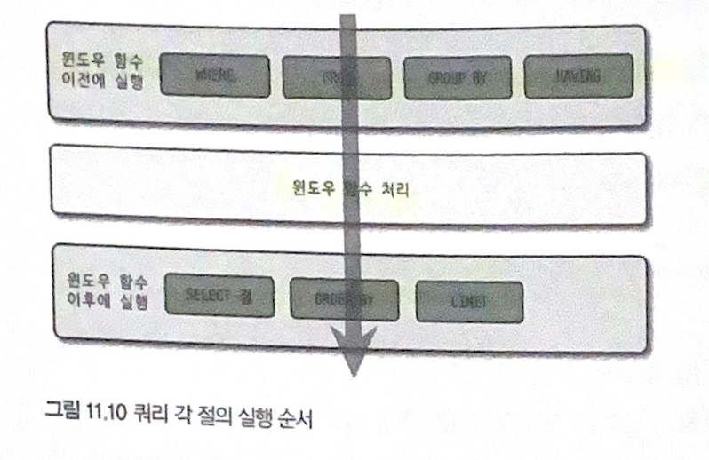

# 11. 쿼리 작성 및 최적화

## 11.4.8 GROUP BY

### 11.4.8.1 WITH ROULLUP

- `ROLLUP` 기능을 사용해 GROUP BY 가 사용된 쿼리에서 그루핑된 그룹별로 소계 가져오기 가능
- `WITH ROLLUP` 이 선언된 `GROUP BY 쿼리 결과는 그룹별 소계 출력 레코드가 추가`되어 표시

```sql
-- GROUP BY 칼럼 1개
mysql> select dept_no, count(*) 
         from dept_emp 
        group by dept_no with rollup;
+---------+----------+
| dept_no | count(*) |
+---------+----------+
| d001    |    20211 |
| d002    |    17346 |
| d003    |    17786 |
| d004    |    73485 |
| d005    |    85707 |
| d006    |    20117 |
| d007    |    52245 |
| d008    |    21126 |
| d009    |    23580 |
**| NULL    |   331603 |**
+---------+----------+

-- GROUP BY 칼럼 2개
-- first_name 그룹별로 소계 레코드 출력
-- 마지막 라인에 전체 총계 레코드 출력
mysql> select first_name, last_name, count(*) 
         from employees 
        group by first_name, last_name with rollup;
+----------------+------------------+----------+
|   first_name   |    last_name     | count(*) |
+----------------+------------------+----------+
...
| Zhonghua       | Zwicker          |        1 |
**| Zhonghua       | NULL             |      203 |**
...
| Zissis         | Zeleznik         |        1 |
**| Zissis         | NULL             |      241 |**
...
| Zvonko         | Zuberek          |        1 |
| Zvonko         | NULL             |      258 |
**| NULL           | NULL             |   300024 |**
+----------------+------------------+----------+

-- MySQL 8.0 ~ 그룹 레코드 지정 가능
mysql> select 
           if(grouping(first_name), 'All First Name',  first_name) as first_name, 
           if(grouping(last_name), 'All Last Name', last_name) as last_name,
           count(*) 
         from employees 
        group by first_name, last_name with rollup;
+----------------+------------------+----------+
|   first_name   |    last_name     | count(*) |
+----------------+------------------+----------+
...
| Zongyan        | Zweizig          |        1 |
| Zongyan        | All Last Name    |      254 |
...
| Zsolt          | Zumaque          |        1 |
| Zsolt          | All Last Name    |      236 |
...
| Zvonko         | All Last Name    |      258 |
| All First Name | All Last Name    |   300024 |
+----------------+------------------+----------+

```

### 11.4.8.2 레코드를 칼럼으로 변환해서 조회

하나의 레코드를 여러 개의 칼럼으로 나누거나 변환하는 SQL 문법은 없음. `집합 함수`와 `CASE WHEN 구문` 이용해 변환 가능.

**11.4.8.2.1 레코드를 칼럼으로 변환**

- `레코드 -> 칼럼` 변환 작업은 목적과 용도에 맞게 `COUNT`, `MIN`, `MAX`, `AVG`, `SUM` 등의 집합 함수 사용
- 아래와 같이 레코드 → 칼럼 변환 작업의 단점은 부서 번호가 변경/추가 될 때 쿼리도 변경되어야 함
→ 동적 쿼리 생성 방식으로 보완 가능

```sql
-- 부서번호, 부서별 사원 수
mysql> select dept_no, count(*) as emp_count 
         from dept_emp 
        group by dept_no;
+---------+-----------+
| dept_no | emp_count |
+---------+-----------+
| d001    |     20211 |
| d002    |     17346 |
| d003    |     17786 |
| d004    |     73485 |
| d005    |     85707 |
| d006    |     20117 |
| d007    |     52245 |
| d008    |     21126 |
| d009    |     23580 |
+---------+-----------+

-- 위 결과 레코드를 칼럼으로 변환
mysql> select
         sum(case when dept_no='d001' then emp_count else 0 end) as count_d001,
         sum(case when dept_no='d002' then emp_count else 0 end) as count_d002,
         sum(case when dept_no='d003' then emp_count else 0 end) as count_d003,
         sum(case when dept_no='d004' then emp_count else 0 end) as count_d004,
         sum(case when dept_no='d005' then emp_count else 0 end) as count_d005,
         sum(case when dept_no='d006' then emp_count else 0 end) as count_d006,
         sum(case when dept_no='d007' then emp_count else 0 end) as count_d007,
         sum(case when dept_no='d008' then emp_count else 0 end) as count_d008,
         sum(case when dept_no='d009' then emp_count else 0 end) as count_d009,
         sum(emp_count) as count_total
      from (
         select dept_no, count(*) as emp_count from dept_emp group by dept_no
      ) tb_derived;
+------------+------------+------------+------------+------------+------------+------------+------------+------------+-------------+
| count_d001 | count_d002 | count_d003 | count_d004 | count_d005 | count_d006 | count_d007 | count_d008 | count_d009 | count_total |
+------------+------------+------------+------------+------------+------------+------------+------------+------------+-------------+
|      20211 |      17346 |      17786 |      73485 |      85707 |      20117 |      52245 |      21126 |      23580 |      331603 |
+------------+------------+------------+------------+------------+------------+------------+------------+------------+-------------+
```

**14.4.8.2.2 하나의 칼럼을 여러 칼럼으로 분리**

```sql
-- employees > hire_date 이용하여 입사 연도별 사원 수 조회 가능
mysql> select de.dept_no,
         sum(case when e.hire_date between '1980-01-01' and '1989-12-31' then 1 else 0 end) as cnt_1980,
         sum(case when e.hire_date between '1990-01-01' and '1999-12-31' then 1 else 0 end) as cnt_1990,
         sum(case when e.hire_date between '2000-01-01' and '2009-12-31' then 1 else 0 end) as cnt_2000,
         count(*) as cnt_total
       from dept_emp de, employees e
      where e.emp_no = de.emp_no
      group by de.dept_no;
+---------+----------+----------+----------+-----------+
| dept_no | cnt_1980 | cnt_1990 | cnt_2000 | cnt_total |
+---------+----------+----------+----------+-----------+
| d001    |    11038 |     9171 |        2 |     20211 |
| d002    |     9580 |     7765 |        1 |     17346 |
| d003    |     9714 |     8068 |        4 |     17786 |
| d004    |    40418 |    33065 |        2 |     73485 |
| d005    |    47007 |    38696 |        3 |     85707 |
| d006    |    11057 |     9059 |        1 |     20117 |
| d007    |    28673 |    23570 |        1 |     52245 |
| d008    |    11601 |     9523 |        0 |     21126 |
| d009    |    12979 |    10600 |        1 |     23580 |
+---------+----------+----------+----------+-----------+
```

## 11.4.9 ORDER BY

- `order by` 는 검색된 레코드를 어떤 순서로 정렬할지 결정하며 order by 절이 사용되지 않는 경우 다음 순서로 정렬 됨
    - 인덱스를 사용한 SELECT 쿼리: 인덱스에 정렬된 순서대로 레코드 조회
    - 인덱스 사용 x, 풀 테이블 스캔 실행하는 SELECT 쿼리: MyISAM 테이블은 테이블에 저장된 순서. InnoDB는 항상 프라이머리 키로 클러스터링 되어 있기 때문에 프라이머리 키 순서대로 조회
    - SELECT 쿼리가 임시 테이블을 거쳐 처리되면 레코드 순서 예측 어려움
- `어떤 DBMS도 ORDER BY 절이 명시되지 않은 쿼리에 대해서는 어떠한 정렬도 보장하지 않는다`. 따라서 정렬이 필요한 쿼리에는 꼭 `ORDER BY` 절을 명시하는 것이 좋음.
- ORDER BY 에서 인덱스 사용 못한 경우에는 추가 정렬 작업이 수행
→ 쿼리 실행 계획 Extra 칼럼에 `Using Filesort` 코멘트 표시
→ `SHOW STATUS LIKE 'Sort_%` 로 디스크 파일 이용 여부 확인 가능

### 11.4.9.1 ORDER BY 사용법 및 주의사항

- ORDER BY 절은 1개 or 여러개의 칼럼으로 정렬 수행 가능. 정렬 순서는 칼럼별로 명시 가능
- 정렬  대상은 칼럼명, 표현식으로 명시
→ SELECT 되는 칼럼의 순번으로 명시 가능. ex) ORDER BY 2
→ 문자 리터럴이 ORDER BY 절에 명시되면 무시 ex) ORDER BY “last_name”
    
    ```sql
    mysql> select first_name, last_name from employees
            order by last_name;
    
    mysql> select first_name, last_name from employees
            order by 2;
    
    -- 옵티마이저사 문자 리터럴은 무시. 
    mysql> select first_name, last_name from employees
            order by "last_name";
    ```
    

### 11.4.9.2 여러 방향으로 동시 정렬

- ~ MySQL 8.0 여러 개의 칼럼을 조합해서 정렬 시, 각 칼럼의 정렬 순서가 혼용되면 인덱스 사용 불가
- `MySQL 8.0 ~ 정렬 순서 혼합 사용 가능`
→ alter table salaries add index ix_salary_fromdate(salary desc, from_date asc)

### 11.4.9.3 함수나 표현식을 이용한 정렬

- ~ MySQL 8.0 연산 결과를 기준으로 정렬하기 위해서 `가상 칼럼(Virtual Column)` 추가 후 인덱스 생성 방법을 사용
- `MySQL 8.0 ~ 함수 기반의 인덱스 지원`. 연산 결곽값을 기준으로 정렬하는 작업이 인덱스를 사용하도록 튜닝 가능
→ select * from salaries order by cos(salary);

## 11.4.10 서브쿼리

- 쿼리 작성 시 서브쿼리를 사용하면 단위 처리별로 쿼리를 독립적으로 작성 가능. 
→ ~ MySQL 5.6 서브쿼리를 최적으로 실행하지 못하는 경우가 많았음
→ MySQL 8.0 ~ 서브쿼리 처리 개선.
- 서브쿼리는 `SELECT`, `FROM`, `WHERE` 절에서 사용 가능
→ 사용되는 위치에 따라 쿼리의 성능 영향도, MySQL 서버 최적화 방법이 달라짐

### 11.4.10.1 SELECT 절에 사용된 서브쿼리

- `SELECT 절에 사용된 서브쿼리`는 서브쿼리가 적절히 인덱스 사용할 수 있다면 주의사항 없음
- SELECT 절에 서브쿼리 사용 시에 그 서브쿼리는 항상 칼럼과 레코드가 하나인 결과를 반환하는 `스칼라(Scalar) 서브쿼리`
    - NULL 이든 아니든 관계없이 레코드 1건이 존재해야 함
    - 서브쿼리가 2건 이상의 레코드 반환하는 경우 오류 발생
    - 서브쿼리가 2개 이상의 칼럼을 가져오려고 하는 경우 오류 발생
- JOIN 으로 처리 가능한 쿼리는 JOIN 을 이용하여 쿼리를 실행하는 것이 좋음
- MySQL 8.0 ~ 도입된 `래터럴 조인` 을 이용해 `limit 1` 조건이더라도 서브쿼리로 조인 실행 가능.
→ 래터럴 조인을 이용해 동일한 서브쿼리를 1번만 읽어서 처리 가능

```sql
-- ~ MySQL 8.0 limit 1 조건으로 salary 테이블 조인 불가
mysql> select e.emp_no, e.first_name,
              (select s.salary from salaries s where s.emp_no = e.emp_no 
                order by s.from_date desc limit 1) as salary,
              (select s.from_date from salaries s where s.emp_no = e.emp_no 
                order by s.from_date desc limit 1) as salary_from_date,
              (select s.to_date from salaries s where s.emp_no = e.emp_no 
                order by s.from_date desc limit 1) as salary_to_date
         from employees e
        where e.emp_no = 499999;

-- MySQL 8.0 ~ 래터럴 조인 
mysql> select e.emp_no, e.first_name,
              s.salary, s2.from_date, s2.to_date
         from employees e 
           inner join lateral (
              select * from salaries s
               where s.emp_no = e.emp_no
               order by s.from_date desc 
               limit 1
           ) s2 on s2.emp_no = e.emp_no
        where e.emp_no = 499999;
```

### 11.4.10.2 FROM 절에 사용된 서브쿼리

- ~ MySQL 5.7 FROM 절에 서브쿼리 사용 시 항상 서브쿼리의 결과를 임시 테이블로 저장 후 필요할 때 다시 임시테이블을 읽는 방식으로 처리
- MySQL 5.7~ 옵티마이저가 `FROM 절의 서브쿼리를 외부쿼리로 병합하는 최적화 수행`하도록 개선
→ `optimizer_switch` 시스템 변수로 제어 가능
- FROM 절의 서브쿼리를 외부쿼리로 병합하지 못하는 조건
    - 집합 함수 `SUM()`, `MIM()`, `MAX()`, `COUNT()` 등을 사용한 경우
    - DISTINCT
    - GROUP BY, HAVING
    - LIMIT
    - UNION(UNION DISTINCT) 또는 UNION ALL
    - SELECT 절에 서브쿼리가 사용된 경우
    - 사용자 변수 사용(사용자 변수에 값이 할당되는 경우)

### 11.4.10.3 WHERE 절에 사용된 서브쿼리

WHERE 절의 서브쿼리는 `동등 또는 크다 작다 비교`, `IN 비교`, `NOT IN 비교` 3가지로 구분

**11.4.10.3.1 동등 또는 크다 작다 비교**

- ~ MySQL 5.5 dept_emp 테이블 풀 스캔 → 서브쿼리 조건에 일치하는지 체크
- MySQL 5.5 ~ 서브쿼리 실행 → 상수 변환 → 상숫값으로 대체 후 나머지 쿼리 처리

```sql
-- employees > ix_lastname_firstname 실행
-- dept_emp > ix_empno_fromdate 실행
mysql> explain format=tree
        select * from dept_emp de
         where de.emp_no = (select e.emp_no from employees e 
                             where e.first_name = 'Georgi' 
                               and e.last_name = 'Facello' limit 1);
+----------------------------------------------------------------------------------------------------------------------------------------+
| EXPLAIN                                                                                                                                |
+----------------------------------------------------------------------------------------------------------------------------------------+
| -> Filter: (de.emp_no = (select #2))  (cost=0.35 rows=1)
    -> Index lookup on **de using ix_empno_fromdate** (emp_no=(select #2))  (cost=0.35 rows=1)
    -> Select #2 (subquery in condition; run only once)
        -> Limit: 1 row(s)  (cost=0.45 rows=1)
            -> Covering index lookup on **e using ix_lastname_firstname** (last_name='Facello', first_name='Georgi')  (cost=0.45 rows=2)
+-----------------------------------------------------------------------------------------------------------------------------------------+
```

**11.4.10.3.2 IN 비교 ( IN (subquery) )**

- `WHERE 절에 사용된 IN (subquery) 형태`의 조건을 세미 조인이라고 함.
→ 테이블의 레코드가 다른 테이블의 레코드 이용한 표현식과 일치하는지 체크하는 형태 = 세미(Semi)조인
- ~ MySQL 5.5 버전까지 세미 조인의 최적화가 매우 부족해서 대부분 풀테이블 스캔 사용. MySQL 5.6 ~ 8.0 버전까지 세미 조인 최적화 개선
→ 세미 조인 최적화는 `테이블 풀-아웃`, `퍼스트 매치`, `루스 스캔`, `구체화`, `중복 제거` 최적화 전략을 사용 함

**11.4.10.3.3 NOT IN 비교 ( NOT IN (subquery) )**

안티 세미 조인 조건 사용 시 `NOT EXIST`, `구체화` 최적화 전략을 사용하나, 성능 향상에 크게 효과는 없음. 최대한 검색 범위를 좁히는 방법을 택해야 함

<br/>

## 11.4.11 CTE(Common Table Expression)

`CTE(Common Table Expression)` 이름을 가지는 임시 테이블. 

SQL 문장 내에 한 번 이상 사용 가능하며, SQL 문장 종료 시 자동으로 CTE 임시 테이블 삭제 됨.

재귀적 반복 실행 여부를 기준으로 `Non-recursive`, `Recursive` CTE 로 구분

```sql
-- select, update, delete 문장 제일 앞쪽
mysql> with cte1 as (select ...) select ...;
mysql> with cte1 as (select ...) update ...;
mysql> with cte1 as (select ...) delete ...;

-- 서브쿼리의 제일 앞쪽
mysql> select ... from ... 
        where id in (with cte1 as (select ...) 서브쿼리 )

-- select 절의 바로 앞쪽
mysql> insert ... with cte1 as (select ...) select ...
mysql> replace ... with cte1 as (select ...) select ...
mysql> create table ... with cte1 as (select ...) select ...
```

### 11.4.11.1 비 재귀적 CTE (Non-Recursive CTE)

```sql
-- cte 정의 예시
mysql> with cte1 as (select * from departments)
       select * from cte1;

-- cte 임시 테이블을 서브쿼리로 구성
mysql> select *
         from (select * from departments) cte1;

-- 여러개의 임시테이블 사용 가능
-- 임시 테이블이 여러번 사용되는 경우, 
--  CTE를 이용한 경우와 FROM 절의 서브쿼리로 이용한 경우 실행계획인 달라짐. 
mysql> with cte1 as (select * from departments),
            cte2 as (select * from dept_emp)
        select * from temp1
           inner join cte2 on cte2.dept_no = cte1.dept_no; 

-- cte로 생성된 임시 테이블은 다른 cte 쿼리로 참조 가능
mysql> with **cte1** (select emp_no, min(from_date) as salary_from_date
                    from salaries 
                   where salary between 50000 and 51000 
                   group by emp_no),
       with cte2 (select de.emp_no, min(from_date) as dept_from_date
                    **from cte1**
                      inner join dept_emp de on de.emp_no = temp1.emp_no
                    group by emp_no)
       select * from employees e
         inner join cte1 t1 on t1.emp_no = e.emp_no
         inner join cte2 t2 on t2.emp_no = e.emp_no;
```

- `CTE 임시 테이블은 재사용 가능`하므로 `FROM 절의 서브쿼리보다 효율적`
- CTE 로 선언된 임시 테이블을 다른 CTE 쿼리에서 참조 가능
- CTE 임시 테이블의 생성 부분과 사용 부분의 코드를 분리 가능하여 가독성이 높다

14.4.12.1 쿼리 각 절 의 실행 순서

```sql
-- limit 5건의 평균이 아니라 emp_no = 10001 조건에 만족하는 데이터의 평균 중 5건만 조회
mysql> select emp_no, from_date, salary, avg(salary) over () as avg_salary 
				 from salaries 
				where emp_no = 10001 limit 5;
+--------+------------+--------+------------+
| emp_no | from_date  | salary | avg_salary |
+--------+------------+--------+------------+
|  10001 | 1986-06-26 |  60117 | 75388.9412 |
|  10001 | 1987-06-26 |  62102 | 75388.9412 |
|  10001 | 1988-06-25 |  66074 | 75388.9412 |
|  10001 | 1989-06-25 |  66596 | 75388.9412 |
|  10001 | 1990-06-25 |  66961 | 75388.9412 |
+--------+------------+--------+------------+

-- 정상
mysql> select emp_no, from_date, salary, avg(salary) over () as avg_salary 
				 from ( select * from salaries where emp_no = 10001 limit 5) as foo;
+--------+------------+--------+------------+
| emp_no | from_date  | salary | avg_salary |
+--------+------------+--------+------------+
|  10001 | 1986-06-26 |  60117 | 64370.0000 |
|  10001 | 1987-06-26 |  62102 | 64370.0000 |
|  10001 | 1988-06-25 |  66074 | 64370.0000 |
|  10001 | 1989-06-25 |  66596 | 64370.0000 |
|  10001 | 1990-06-25 |  66961 | 64370.0000 |
+--------+------------+--------+------------+
```


**11.4.11.2 재귀적 CTE(Recursive CTE)**

MySQL 8.0 ~ CTE 를 이용한 재귀 쿼리 가능. 

재귀적 `CTE 쿼리는 비재귀적 쿼리 + 재귀적 쿼리 파트로 구분`되며, 이 둘을 `UNION(UNION DISTINCT) 또는 UNION ALL 로 연결`하는 형태로 반드시 쿼리 작성

```sql
-- 1. 비 재귀적 파트 쿼리 실행 
--    -> cte 임시테이블의 구조(칼럼명, 타입)는 비재귀적 쿼리 파타의 결과로 결정
--    -> cte 비재귀적 쿼리 파트는 초기 데이터와 임시 테이블의 구조 준비
-- 2. 1번 결과로 cte 라는 임시 테이블 생성
-- 3. 1번의 결과를 cte 임시 테이블에 저장
-- 4. 1번 결과를 입력으로 사용해 cte 쿼리의 재귀적 파트 쿼리 실행
--    -> 재귀적 쿼리 파트는 이후 데이터 생성해내는 역할 수행
-- 5. 4번 결과를 cte 임시 테이블에 저장
-- 6. 전 단계의 결과를 입력으로 사용해 cte 쿼리 재귀적 파트 쿼리 실행
-- 7. 6번 쿼리 결과 없으면 cte 쿼리 종료
--    -> 재귀 파트 쿼리의 결과가 0건일 때 종료
-- 8. 6번 결과를 cte 임시 테이블에 저장
mysql> with recursive cte (no) as (
            select 1  -- 비재귀적 쿼리
            union all 
            select (no+1) from cte where no < 5 -- 재귀적 쿼리
        ) select * from cte;
+------+
| no   |
+------+
|    1 |
|    2 |
|    3 |
|    4 |
|    5 |
+------+

-- 무한 반복 방지를 위해 cte_max_recursion_dept 시스템 변수로 최대 반복 실행 횟수 제한 가능
mysql> set cte_max_recursion_depth=10;

-- 최대 반복 실행 횟수 초과로 오류 발생
--   set_var 이용하여 이용하여 일시적 제한 완화 가능
--   ex. select /*+ set_var(cte_max_recursion_depth=10000) */ * from cte
mysql> with recursive cte (no) as (
            select 1
            union all 
            select (no+1) from cte where no < 10000
        ) select * from cte;
ERROR 3636 (HY000): Recursive query aborted after 11 iterations. 
Try increasing @@cte_max_recursion_depth to a larger value.
```

**11.4.11.3 재귀적 CTE(Recursive CTE) 활용**

재귀적 쿼리는 1부터 단조 증가하는 값을 가지는 임시 테이블, 일 단위로 증가하는 날짜를 가진 임시 테이블 생성, 조직도 조회, BOM(Bill Of Material, 최종 제품을 만들기 위해 필요한 재료, 부품, 중간 조림품, 수량을 나열한 목록) 쿼리 등에 활용 가능

```sql
mysql> create database test;
Query OK, 1 row affected (0.02 sec)

mysql> use test;
Database changed

mysql> create table test.employees (
          id          int         primary key  not null,
          name        varchar(100)             not null,
          manager_id  int                      null,
          index(manager_id),
          foreign key (manager_id) references employees (id) 
       );
Query OK, 0 rows affected (0.04 sec)

mysql> insert into test.employees values 
           (333,  "Yasmina", null),
           (198,  "John",    333),
           (692,  "Tarek",   333),
           (29,   "Pedro",   198),
           (4610, "Sarah",   29),
           (72,   "Pierre",  29),
           (123,  "Adil",    692);
Query OK, 7 rows affected (0.01 sec)
Records: 7  Duplicates: 0  Warnings: 0

-- 재귀적 쿼리를 이용해 Adil(id=123) 직원의 상위 조직장 조회 쿼리
mysql> with **recursive** managers as (
         select *, 1 as lv 
           from employees where id = 123
        union all
         select e.*, lv+1 
           from managers m
             inner join employees e on e.id = m.manager_id 
                         and m.manager_id is not null
       )
       select * from managers order by lv desc;
+------+---------+------------+------+
| id   | name    | manager_id | lv   |
+------+---------+------------+------+
|  333 | Yasmina |       NULL |    3 |
|  692 | Tarek   |        333 |    2 |
|  123 | Adil    |        692 |    1 |
+------+---------+------------+------+
```

## 11.4.12 윈도우 함수(Window Function)

윈도우 함수는 조회하는 현재 레코드 기준으로 연관된 레코드 집합의 연산을 수행. 결과 집합을 그대로 유지하면서 하나의 레코드 연산에 다른 레코드의 칼럼값을 참조 가능
→ 집계함수는 주어진 그룹별로 하나의 레코드를 묶어서 출력. 결과 집합의 모양이 변함

### **11.4.12.1 쿼리 각 절의 실행 순서**



- 윈도우 함수 사용 쿼리 결과에 보여지는 레코드는  
  FROM, WHERE, GROUP BY, HAVING절에 의해 결정 
          → 윈도우 함수 실행 
          → SELECT 절, ORDER BY 절, LIMIT 절 실행 후에 최종 결과 반환
- 윈도우 함수를 GROUP BY 칼럼이나 WHERE 절에 사용 불가
- limit 을 먼저 실행한 다음 윈도우 함수 적용 불가
    
    ```sql
    -- from 절의 서브쿼리 없이 limit
    -- 잘못된 평균. emp_no = 10001 데이터 전체에 대한 평균 값에 limit 5건만 출력
    mysql> select emp_no, from_date, salary, 
                  avg(salary) over() as avg_salary 
            from salaries 
           where emp_no=10001
           limit 5;
    +--------+------------+--------+------------+
    | emp_no | from_date  | salary | avg_salary |
    +--------+------------+--------+------------+
    |  10001 | 1986-06-26 |  60117 | 75388.9412 |
    |  10001 | 1987-06-26 |  62102 | 75388.9412 |
    |  10001 | 1988-06-25 |  66074 | 75388.9412 |
    |  10001 | 1989-06-25 |  66596 | 75388.9412 |
    |  10001 | 1990-06-25 |  66961 | 75388.9412 |
    +--------+------------+--------+------------+
    
    -- from 절의 서브쿼리로 limit
    mysql> select emp_no, from_date, salary, 
                  avg(salary) over() as avg_salary 
            from (select * from salaries where emp_no=10001 limit 5) s2;
    +--------+------------+--------+------------+
    | emp_no | from_date  | salary | avg_salary |
    +--------+------------+--------+------------+
    |  10001 | 1986-06-26 |  60117 | 64370.0000 |
    |  10001 | 1987-06-26 |  62102 | 64370.0000 |
    |  10001 | 1988-06-25 |  66074 | 64370.0000 |
    |  10001 | 1989-06-25 |  66596 | 64370.0000 |
    |  10001 | 1990-06-25 |  66961 | 64370.0000 |
    +--------+------------+--------+------------+
    ```
    

### **11.4.12.2 윈도우 함수 기본 사용법**

- 윈도우 함수 기본 사용법 
 `AGGREGATE_FUNC() OVER(<partition> <order>) AS window_func_column` 
OVER 절에 만들어진 그룹 = 파티션(Partition) = 윈도우(Window)
    
    ```sql
    -- 직원들의 입사 순서 조회
    -- rank() over() 이용하여 전체 결과 집합에서 hire_date 칼럼으로 정렬 후 순위를 매김
    mysql> select e.*, 
    						  rank() over(order by e.hire_date) as hire_date_rank 
    			   from employees e;
    +--------+-------------+--------------+------------+----------------+
    | emp_no | first_name  | last_name    | hire_date  | hire_date_rank |
    +--------+-------------+--------------+------------+----------------+
    | 110022 | Margareta   | Markovitch   | 1985-01-01 |              1 |
    | 110085 | Ebru        | Alpin        | 1985-01-01 |              1 |
    | 110183 | Shirish     | Ossenbruggen | 1985-01-01 |              1 |
    | 110303 | Krassimir   | Wegerle      | 1985-01-01 |              1 |
    | 110511 | DeForest    | Hagimont     | 1985-01-01 |              1 |
    | 110725 | Peternela   | Onuegbe      | 1985-01-01 |              1 |
    | 111035 | Przemyslawa | Kaelbling    | 1985-01-01 |              1 |
    | 111400 | Arie        | Staelin      | 1985-01-01 |              1 |
    | 111692 | Tonny       | Butterworth  | 1985-01-01 |              1 |
    | 110114 | Isamu       | Legleitner   | 1985-01-14 |             10 |
    +--------+-------------+--------------+------------+----------------+
    
    -- 부서별 입사 순위, 소그룹 파티션과 정렬 사용
    mysql> 
        select de.dept_no, e.emp_no, e.first_name, e.hire_date,
         rank() over(partition by de.dept_no order by e.hire_date) as hire_date_rank
        from employees e
           inner join dept_emp de on de.emp_no = e.emp_no
        order by de.dept_no, e.hire_date;
    +---------+--------+------------+------------+----------------+
    | dept_no | emp_no | first_name | hire_date  | hire_date_rank |
    +---------+--------+------------+------------+----------------+
    | d001    | 110022 | Margareta  | 1985-01-01 |              1 |
    | d001    |  51773 | Eric       | 1985-02-02 |              2 |
    | d001    |  95867 | Shakhar    | 1985-02-02 |              2 |
    | d001    |  98351 | Florina    | 1985-02-02 |              2 |
    | d001    | 288310 | Mohammed   | 1985-02-02 |              2 |
    +---------+--------+------------+------------+----------------+
    
    -- 10001 사원의 급여 이력과 평균 급여 조회
    mysql> select emp_no, from_date, salary, avg(salary) over() as avg_salary 
             from salaries where emp_no = 10001;
    +--------+------------+--------+------------+
    | emp_no | from_date  | salary | avg_salary |
    +--------+------------+--------+------------+
    |  10001 | 1986-06-26 |  60117 | 75388.9412 |
    |  10001 | 1987-06-26 |  62102 | 75388.9412 |
    |  10001 | 1988-06-25 |  66074 | 75388.9412 |
    |  10001 | 1989-06-25 |  66596 | 75388.9412 |
    ```
    
- 윈도우 함수의 각 파티션 안에서도 연산 대상 레코드별로 연산을 수행할 소그룹이 사용 = 프레임
윈도우 함수에서 프레임을 명시적으로 지정하지 않아도 MySQL 서버는 상황에 맞게 묵시적으로 선택
    
    ```sql
    AGGREGATE_FUNC() OVER(<partition> <order> <frame>) AS window_func_column
    
    /**
       frame 을 만드는 기준으로 ROWS, RANGE 중 하나 선택 가능
           ROWS: 레코드의 위치를 기준으로 프레임 생성
           RANGE: ORDER BY 절에 명시된 칼럼을 기준으로 값의 범위로 프레임 생성
    **/
    frame:
       {ROWS | RANGE} {frame_start | frame_between}
    
    frame_between:
       BETWEEN frame_start AND frame_end
    
    /*
      frame = ROWS, expr 에는 레코드 위치 명시
        ex1) 파티션의 첫 번째 레코드 ~ 현재 레코드까지
           ROWS UNBOUNDED PRECIDING
           ROWS BETWEEN UNBOUND PRECEDING AND CURRENT NOW
        ex2) 파티션에서 현재 레코드 기준, 1번 앞 레코드 ~ 1번 뒤 레코드 까지
           ROWS BETWEEN 1 PRECEDING AND 1 FOLLOWING
        ex3) 명시된 칼럼의 값이 5일 전인 레코드 ~ 현재
           RANGE INTERVAL 5 DAY PRECEDING
        ex4) 명시된 칼럼의 값이 1일 전 ~ 1일 후까지 레코드
           RANGE BETWEEN 1 DAY PRECEDING AND 1 DAY FOLLWING
    **/
    frame_start, frame_end: {
       CURRENT ROW -- 현재 레코드
      | UNBOUNDED PRECEDING  -- 파티션의 첫 번째 레코드
      | UNBOUNDED FOLLOWING  -- 파티션의 마지막 레코드
      | expr PRECEDING  -- 현재 레코드로부터 n번째 이전 레코드
      | expr FOLLOWING  -- 현재 레코드로부터 n번째 이후 레코드
    }
    
    mysql> select emp_no, from_date, salary,
                  -- 현재 레코드의 from_date 를 기준으로 1년 전 ~ 지금까지 급여 중 최소 급여
                  min(salary) over(order by from_date 
                                   range interval 1 year preceding) as min_1,
                  -- 현재 레코드의 from_date 를 기준으로 1년 전 ~ 2년 후 까지 급여 중 최대 급여
                  max(salary) over(order by from_date 
                                   range between interval 1 year preceding 
                                             and interval 2 year following) as max_1,
                  -- from_date 기준으로 정렬 후, 1번 째 레코드 ~ 현재 레코드 까지 평균
                  avg(salary) over(order by from_date  
                                   rows unbounded preceding) as avg_1,
                  -- from_date 기준으로 정렬 후, 현재 레코드 기준 1번 전 ~ 1번 후 레코드 까지의 급여 평균
                  avg(salary) over(order by from_date 
                                   rows between 1 preceding and 1 following) as avg_2
            from salaries 
           where emp_no = 10001;
    +--------+------------+--------+-------+-------+------------+------------+
    | emp_no | from_date  | salary | min_1 | max_1 | avg_1      | avg_2      |
    +--------+------------+--------+-------+-------+------------+------------+
    |  10001 | 1986-06-26 |  60117 | 60117 | 66074 | 60117.0000 | 61109.5000 |
    |  10001 | 1987-06-26 |  62102 | 60117 | 66596 | 61109.5000 | 62764.3333 |
    |  10001 | 1988-06-25 |  66074 | 62102 | 66961 | 62764.3333 | 64924.0000 |
    |  10001 | 1989-06-25 |  66596 | 66074 | 71046 | 63722.2500 | 66543.6667 |
    |  10001 | 1990-06-25 |  66961 | 66596 | 74333 | 64370.0000 | 68201.0000 |
    |  10001 | 1991-06-25 |  71046 | 66961 | 75286 | 65482.6667 | 70780.0000 |
    |  10001 | 1992-06-24 |  74333 | 71046 | 75994 | 66747.0000 | 73555.0000 |
    |  10001 | 1993-06-24 |  75286 | 74333 | 76884 | 67814.3750 | 75204.3333 |
    |  10001 | 1994-06-24 |  75994 | 75286 | 80013 | 68723.2222 | 76054.6667 |
    ```
    
- 다음의 윈도우 함수들의 프레임은 고정 되어 있음. 
→ SQL 문장에서 프레임을 변도로 명시하더라도 모두 무시 됨. 에러는 발생하지 않음.
    - CUDE_DIST()
    - DENSE_RANK()
    - LAG()
    - LEAD()
    - NTILE()
    - PERCENT_RANK()
    - RANK()
    - ROW_NUMBER()
    
<br />

### 11.4.12.3 윈도우 함수

MySQL 서버의 윈도우 함수에는 집계함수와 비 집계 함수 모두 사용 가능.

- 집계 함수
    - GROUP BY 절과 함께 사용 가능한 함수
    - OVER() 절 없이 단독 으로 사용 가능
    - OVER() 절 가진 윈도우 함수로도 사용 가능
    - `AVG()`, `BIT_AND()`, `BIT_OR()`, `COUNT()`, `MAX()`, `MIN()`, `SUM()` 등등..
- 비 집계 함수
    - OVER() 절을 가지고 있어야 함
    - 윈도우 함수로만 사용 가능
    - `RANK()`, `ROW_NUMBER()`, `PERCENT_RANK()`, `CUME_DIST()`, `LAG()` 등등..

**11.4.12.3.1 DENSE_RANK()와 RANK(), ROW_NUMBER()**

- DENSE_RANK()
    - ORDER BY 기준으로 매겨진 순위 반환
    - 동점 레코드가 두 건 이상인 경우, 동점 레코드를 1건으로 가정하고 증가시킨 순위를 반환
    
    ```sql
    mysql> 
        select de.dept_no, e.emp_no, e.first_name, e.hire_date, 
               **dense_rank**() over(partition by de.dept_no order by e.hire_date) as hire_date_rank 
          from employees e 
                 inner join dept_emp de on de.emp_no = e.emp_no 
         where de.dept_no = 'd001' 
         order by de.dept_no, e.hire_date 
         limit 20;
    +---------+--------+------------+------------+----------------+
    | dept_no | emp_no | first_name | hire_date  | hire_date_rank |
    +---------+--------+------------+------------+----------------+
    | d001    | 110022 | Margareta  | 1985-01-01 |              1 |
    | d001    |  98351 | Florina    | 1985-02-02 |              2 |
    | d001    | 456487 | Jouko      | 1985-02-02 |              2 |
    | d001    | 481016 | Toney      | 1985-02-02 |              2 |
    | d001    | 491200 | Ortrun     | 1985-02-02 |              2 |
    | d001    |  51773 | Eric       | 1985-02-02 |              2 |
    | d001    |  65515 | Phillip    | 1985-02-02 |              2 |
    | d001    |  95867 | Shakhar    | 1985-02-02 |              2 |
    | d001    | 288310 | Mohammed   | 1985-02-02 |              2 |
    | d001    | 288790 | Cristinel  | 1985-02-02 |              2 |
    | d001    | 430759 | Fumiko     | 1985-02-02 |              2 |
    | d001    | 447306 | Pranav     | 1985-02-03 |              **3** |
    ```
    
- RANK()
    - ORDER BY 기준으로 매겨진 순위 반환
    - 동점 레코드가 두 건 이상인 경우, 동점 레코드 만큼 증가시킨 순위를 반환
    
    ```sql
    mysql> 
        select de.dept_no, e.emp_no, e.first_name, e.hire_date, 
               **rank**() over(partition by de.dept_no order by e.hire_date) as hire_date_rank 
          from employees e 
                 inner join dept_emp de on de.emp_no = e.emp_no 
         where de.dept_no = 'd001' 
         order by de.dept_no, e.hire_date 
         limit 20;
    +---------+--------+------------+------------+----------------+
    | dept_no | emp_no | first_name | hire_date  | hire_date_rank |
    +---------+--------+------------+------------+----------------+
    | d001    | 110022 | Margareta  | 1985-01-01 |              1 |
    | d001    |  98351 | Florina    | 1985-02-02 |              2 |
    | d001    | 456487 | Jouko      | 1985-02-02 |              2 |
    | d001    | 481016 | Toney      | 1985-02-02 |              2 |
    | d001    | 491200 | Ortrun     | 1985-02-02 |              2 |
    | d001    |  51773 | Eric       | 1985-02-02 |              2 |
    | d001    |  65515 | Phillip    | 1985-02-02 |              2 |
    | d001    |  95867 | Shakhar    | 1985-02-02 |              2 |
    | d001    | 288310 | Mohammed   | 1985-02-02 |              2 |
    | d001    | 288790 | Cristinel  | 1985-02-02 |              2 |
    | d001    | 430759 | Fumiko     | 1985-02-02 |              2 |
    | d001    | 447306 | Pranav     | 1985-02-03 |             **12** |
    ```
    
- ROW_NUMBER()
    - 각 레코드의 고유한 순번을 반환
    
    ```sql
    mysql> 
        select de.dept_no, e.emp_no, e.first_name, e.hire_date, 
               **row_number**() over(partition by de.dept_no order by e.hire_date) as hire_date_rank 
          from employees e 
                 inner join dept_emp de on de.emp_no = e.emp_no 
         where de.dept_no = 'd001' 
         order by de.dept_no, e.hire_date 
         limit 20;
    +---------+--------+------------+------------+----------------+
    | dept_no | emp_no | first_name | hire_date  | hire_date_rank |
    +---------+--------+------------+------------+----------------+
    | d001    | 110022 | Margareta  | 1985-01-01 |              **1** |
    | d001    |  98351 | Florina    | 1985-02-02 |              **2** |
    | d001    | 456487 | Jouko      | 1985-02-02 |              **3** |
    | d001    | 481016 | Toney      | 1985-02-02 |              **4** |
    | d001    | 491200 | Ortrun     | 1985-02-02 |              **5** |
    ```
    

**11.4.12.3.2 LAG()와 LEAD()**

LAG(), LEAD() 함수는 3개의 파라미터 필요. 1, 2번째 파라미터 필수. 3번째 파라미터 옵션

- LAG(): 파티션 내에서 현재 레코드 기준으로 `n 번째 이전 레코드 반환`
- LEAD(): 파티션 내에서 현재 레코드 기준으로 `n 번째 이후 레코드 반환`

```sql
mysql> select from_date, salary, 
            lag(salary, 5) over(order by from_date) as prior_5th_value, 
            lead(salary, 5) over(order by from_date) as next_5th_value, 
            lag(salary, 5, -1) over(order by from_date) as prior_5th_with_default,
            lead(salary, 5, -1) over(order by from_date) as next_5th_with_default 
        from salaries 
       where emp_no = 10001;
+------------+--------+-----------------+----------------+------------------------+-----------------------+
| from_date  | salary | prior_5th_value | next_5th_value | prior_5th_with_default | next_5th_with_default |
+------------+--------+-----------------+----------------+------------------------+-----------------------+
| 1986-06-26 |  60117 |            NULL |          71046 |                     -1 |                 71046 |
| 1987-06-26 |  62102 |            NULL |          74333 |                     -1 |                 74333 |
| 1988-06-25 |  66074 |            NULL |          75286 |                     -1 |                 75286 |
| 1989-06-25 |  66596 |            NULL |          75994 |                     -1 |                 75994 |
| 1990-06-25 |  66961 |            NULL |          76884 |                     -1 |                 76884 |
| 1991-06-25 |  71046 |           60117 |          80013 |                  60117 |                 80013 |
| 1992-06-24 |  74333 |           62102 |          81025 |                  62102 |                 81025 |
| 1993-06-24 |  75286 |           66074 |          81097 |                  66074 |                 81097 |
| 1994-06-24 |  75994 |           66596 |          84917 |                  66596 |                 84917 |
| 1995-06-24 |  76884 |           66961 |          85112 |                  66961 |                 85112 |
| 1996-06-23 |  80013 |           71046 |          85097 |                  71046 |                 85097 |
| 1997-06-23 |  81025 |           74333 |          88958 |                  74333 |                 88958 |
| 1998-06-23 |  81097 |           75286 |           NULL |                  75286 |                    -1 |
| 1999-06-23 |  84917 |           75994 |           NULL |                  75994 |                    -1 |
| 2000-06-22 |  85112 |           76884 |           NULL |                  76884 |                    -1 |
| 2001-06-22 |  85097 |           80013 |           NULL |                  80013 |                    -1 |
| 2002-06-22 |  88958 |           81025 |           NULL |                  81025 |                    -1 |
+------------+--------+-----------------+----------------+------------------------+-----------------------+
```

### 11.4.12.4 윈도우 함수와 성능

MySQL 서버 8.0 버전에 윈도우 함수 처음 도입. 아직 인덱스를 이용한 최적화가 부족한 부분이 있기 때문에 윈도우 함수에 너무 의존하지 않는 것이 좋음

```sql
-- 윈도우 함수 사용 시
-- index 풀 스캔. [EXTRA] using filesort 로 레코드 정렬 작업 실행
-- salaries 테이블의 모든 레코드 건수만큼 결과 생성
mysql> explain 
        select **max(from_date) over(partition by emp_no)** as max_from_date 
          from salaries;
+----+-------------+----------+------------+-------+---------------+-----------+---------+------+---------+----------+-----------------------------+
| id | select_type | table    | partitions | type  | possible_keys | key       | key_len | ref  | rows    | filtered | Extra                       |
+----+-------------+----------+------------+-------+---------------+-----------+---------+------+---------+----------+-----------------------------+
|  1 | SIMPLE      | salaries | NULL       | **index** | NULL          | ix_salary | 4       | NULL | 2838426 |   100.00 | Using index; **Using filesort** |
+----+-------------+----------+------------+-------+---------------+-----------+---------+------+---------+----------+-----------------------------+

-- group by 사용 시
-- 루스 인덱스 스캔. 별도의 정렬 작업 x
-- 유니크한 emp_no 별로 레코드 1건씩만 출력하면 됨
mysql> explain 
        select **max(from_date)** 
          from salaries 
         **group by emp_no**;
+----+-------------+----------+------------+-------+-------------------+---------+---------+------+--------+----------+--------------------------+
| id | select_type | table    | partitions | type  | possible_keys     | key     | key_len | ref  | rows   | filtered | Extra                    |
+----+-------------+----------+------------+-------+-------------------+---------+---------+------+--------+----------+--------------------------+
|  1 | SIMPLE      | salaries | NULL       | **range** | PRIMARY,ix_salary | PRIMARY | 4       | NULL | 298734 |   100.00 | **Using index for group-by** |
+----+-------------+----------+------------+-------+-------------------+---------+---------+------+--------+----------+--------------------------+

```

### 11.4.13 잠금을 사용하는 SELECT

- InnoDB 테이블의 레코드 SELECT 시 레코드 잠금이 걸려있지 않은데, 이를 `잠금 없는 읽기(Non Locking Consistent Read)` 라고 함.
- `FOR SHARE`, `FOR UPDATE` 옵션 절을 이용해 레코드에 대한 잠금을 걸수 있음.
두 잠금 옵션 모두 `자동 커밋(AUTO-COMMIT) 비활성화 상태` 또는 `BEGIN`, `START TRANSACTION` 명령으로 트랙잭션이 시작된 상태에서만 잠금 유지.

```sql
-- SELECT 쿼리로 읽은 레코드에 대해 읽기 잠금
-- 다른 세션에서 해당 레코드 변경 불가 상태로 만듦. 다른 세션에서 잠금이 걸린 레코드는 읽기 가능
mysql> select * from employees where emp_no = 10001 **for share**;

-- SELECT 쿼리가 읽은 레코드에 대해 쓰기 잠금
-- 다른 트랜잭션에서 레코드 변경 및 읽기 수행 불가
mysql> select * from employees where emp_no = 10001 **for update**;
```

### 11.4.13.1 잠금 테이블 선택

- InnoDB 스토리지 엔진은 `FOR UPDATE` 구문 사용 시 조인되는 테이블에서 읽은 레코드에 대해 모두 쓰기 잠금(Exclusive Lock)을 걸게 됨
- MySQL 8.0 ~ `FOR UPDATE of 테이블(별칭 사용한 경우 별칭 정의)` 을 이용해 선택적 잠금이 가능하게 됨

### 11.4.13.2 NOWAIT & SKIP LOCKED

- MySQL 8.0 ~ `NOWAIT`, `SKIP LOCKED` 옵션 기능이 추가 됨
    - `SELECT … FOR UPDATE` 절에서만 사용 가능
    - NOWAIT, SKIP LOCKED 구문은 쿼리 자체를 비확정적으로 만들기 때문에 DELETE, UPDATE 절에서 사용 불가
    - Queue 같은 기능을 MySQL 서버에서 구현하고자 할 때 매우 유용
    - `SKIP LOCKED` 기능을 사용해 트랜잭션이 수행되는 데 걸리는 시간과 관계없이 다른 트랜잭션에 의해서 이미 잠겨진 레코드를 스킵하는 시간만 지나면 각자의 트랜잭션 실행 가능
- SELECT 쿼리의 마지막에 `FOR UPDATE NOWAIT` 형식으로 사용하며 레코드가 잠긴 상태라도 무시하고 즉시 에러를 반환하여 잠금 대기 상태가 없어짐
→ FOR UPDATE, FOR SHARE 절이 없는 SELECT 쿼리는 잠금 대기 자체가 없기 때문에 옵션 사용 시 무의미
    
    ```sql
    mysql> SELECT * FROM employees
           WHERE emp_no = 10001
           FOR UPDATE NOWAIT; 
    ```
    
- SELECT 쿼리의 마지막에 `FOR UPDATE SKIP LOCKED` 형태로 사용하며 SELECT 하려는 레코드가 다른 트랜잭션에 의해 잠겨진 상태인 경우 잠긴 레코드는 무시하고 잠금이 걸리지 않은 레코드만 가져옴
→ 잠겨진 상태라도 에러를 반환하지 않음
    
    ```sql
    mysql> SELECT * FROM salaries
           WHERE emp_no = 10001
           FOR UPDATE SKIP LOCKED; 
    ```