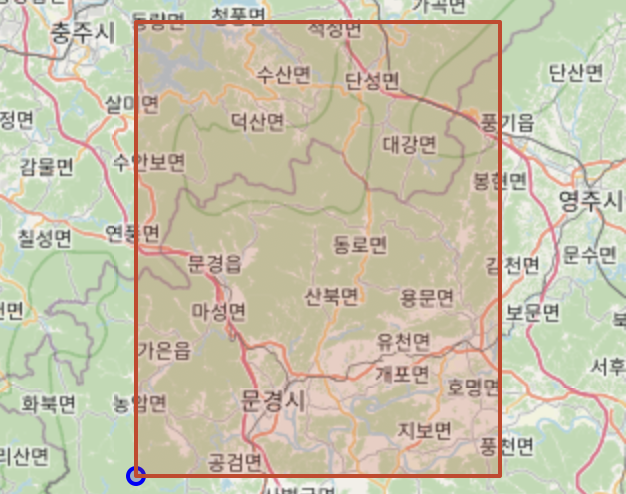
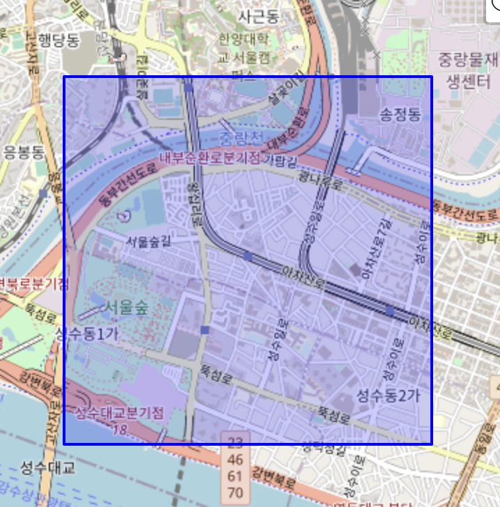
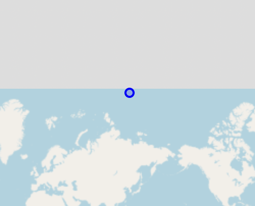
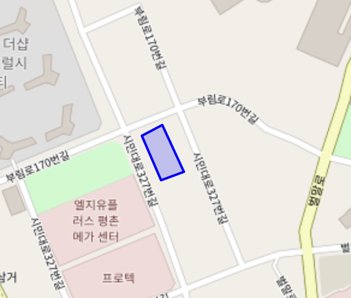
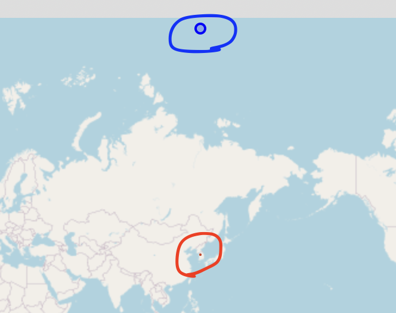
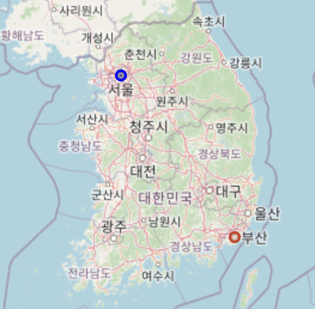
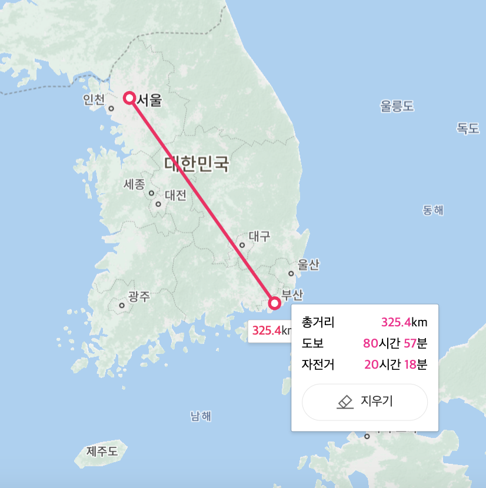

# 12. 확장검색

## 12.1 전문 검색

- 용량이 큰 문서를 단어 수준으로 길게 쪼개어 검색해주는 기능 = 전문 검색(Full-text-Search)
- MySQL8.0 에서는 InnoDB 스토리지 엔진에서 전문 검색 기능 사용 가능
- MySQL 8.0 에서는 특정 길이의 `조각(Token)으로 인덱성하는 n-gram 파서 도입`

### 12.1.1 전문 검색 인덱스의 생성과 검색

- MySQL 서버에서 `형태소 분석(서구권 언어의 경우 어근 분석)`, `n-gram 파서` 알고리즘 이용해 인덱싱할 토큰을 분리
→ 형태소 분석이나 어근 분석 기능 구현 X
- n-gram 파서란?
    - n-gram 은 공백과 띄어쓰기 단위로 단어를 분리. 단순하게 단어에 주어진 길이(n-gram 의 n: 1~10) 로 쪼개서 인덱싱하는 알고리즘
    - n-gram 의 n 숫자 값은 `ngram_token_size` 시스템 변수로 변경 가능. 
    → n = 1 ~ 10 사이의 숫자 값. default 2.
    - `bi-gram`, `tri-gram` 가장 많이 사용 됨
    - 전문 검색 인덱스 생성 시, `WITH PARSER ngram` 옵션을 추가해야 n-gram 파서로 토근 생성 가능
    - 2-Gram 예제
        
        ```sql
        mysql>  SHOW GLOBAL VARIABLES LIKE "ngram_token_size";
        +------------------+-------+
        | Variable_name    | Value |
        +------------------+-------+
        | ngram_token_size | 2     |
        +------------------+-------+
        
        create table tb_tri_gram(
        	id bigint auto_increment,
        	title varchar(100),
        	body text,
        	primary key(id),
        	fulltext index fx_msg(title, body) with parser ngram
        );
        
        insert into tb_bi_gram 
        values (null, 'Real MySQL', '이 책은 지금까지의 매뉴얼 번역이나 단편적인 지식 수준을 벗어나 저자와 다른 많은 MySQL 전문가의...');
        
        -- 단어의 선행 2글자 검색(ngram_token_size 와 같은 길이)
        -- result 1
        select count(*) from tb_bi_gram 
        where match(title, body) against('단편' in boolean mode);
        
        -- 단어의 후행 2글자 검색
        -- result 1
        select count(*) from tb_bi_gram 
        where match(title, body) against('수준' in boolean mode);
        
        -- 단어 전체 검색(ngram_token_size 보다 큰 길이)
        -- result 1
        select count(*) from tb_bi_gram 
        where match(title, body) against('단편적인' in boolean mode);
        
        -- 단어의 전체 검색(ngram_token_size 보다 작은 길이)
        -- result 0
        select count(*) from tb_bi_gram 
        where match(title, body) against('' in boolean mode);
        ```
        
    - 3-Gram 예제
        
        ```sql
        -- my.cnf 파일의 [mysqld] 하단에 ngram_token_size=3 셋팅
        mysql>  SHOW GLOBAL VARIABLES LIKE "ngram_token_size";
        +------------------+-------+
        | Variable_name    | Value |
        +------------------+-------+
        | ngram_token_size | 3     |
        +------------------+-------+
        
        -- ngram_token_size = 3 으로 변경 후 tb_tri_gram 테이블 생성
        create table tb_tri_gram(
        	id bigint auto_increment,
        	title varchar(100),
        	body text,
        	primary key(id),
        	fulltext index fx_msg(title, body) with parser ngram
        );
        
        insert into tb_tri_gram values (
        	null,
        	'Real MySQL',
        	'이 책은 지금까지의 매뉴얼 번역이나 단편적인 지식 수준을 벗어나 저자와 다른 많은 MySQL 전문가의...'
        );
        
        -- 단어의 선행 3글자 검색
        select count(*) from tb_tri_gram
        where match(title, body) against ('단편적' in boolean mode);
        
        -- 단어의 후 3글자 검색
        -- result 1
        select count(*) from tb_tri_gram
        where match(title, body) against ('편적인' in boolean mode);
        
        -- result 1
        select count(*) from tb_tri_gram
        where match(title, body) against ('단편적인' in boolean mode);
        
        -- 단어의 선행 2글자 검색 (ngram_token_size 보다 작음)
        -- reusult 0
        select count(*) from tb_tri_gram
        where match(title, body) against ('단편' in boolean mode);
        
        -- 단어의 후행 2글자 검색
        -- result 0
        select count(*) from tb_tri_gram
        where match(title, body) against ('적인' in boolean mode);
        
        ```
        
    - 검색어의 길이 < ngram_token_size : 검색 불가
    검색어의 길이 > ngram_token_size : 검색 가능
    - `ngram_token_size 길이 만큼 글자를 잘라서 토큰을 생성`하기 때문에 시작, 중간, 마지막 부분의 전문 검색이 가능 함. 단, ngram_token_size 길이가 작은 단어는 모두 버리기 때문에 검색 불가
        
        
        | 문장의 단어 | 토근 1 | 토근 2 | 토근 3 | 토큰 4 |
        | --- | --- | --- | --- | --- |
        | 이 | - |  |  |  |
        | 책은 | 책은 |  |  |  |
        | 지금까지의 | 지금 | 금까 | 까지 | 지의 |
        | 매뉴얼 | 매뉴 | 뉴얼 |  |  |
        | .. |  |  |  |  |
        | 단편적인 | 단편 | 편적 | 적인 |  |
        | … |  |  |  |  |
        | MySQL | My | yS | SQ | QL |
        | 전문가의 | 전문 | 문가 | 가의 |  |

### 12.1.2 전문 검색 쿼리 모드

MySQL 서버의 전문 검색 쿼리는 `자연어(NATURAL LANGUAGE MODE)`, `불리언(BOOLEAN)` 검색 모드 지원
 → default 자연어 검색 모드

**12.1.2.1 자연어 검색(NATURAL LANGUAGE MODE)**

- 자연어 검색은 검색어에 제시된 단어들을 많이 가지고 있는 순서대로 정렬해서 결과를 반환
→ 단순히 검색어에 포함된 단어들이 존재하는 결과만 가져옴
- 문장을 그대로 검색어로 활용 가능. 이러한 형태를 `Phrase Search` 라고 함
    - 문장이 검색어로 사용된 경우는 모든 단어가 포함되거나 일부만 포함한 결과가 출력 됨
        1. MySQL 서버는 검색어를 구분자로 단어를 분리
        2. 다시 n-gram 파서로 토큰 생성
        3. 각 토큰에 일치하는 단어으이 개수 확인
        4. 일치율 계산
    - 검색어가 단일 단어인 경우 무시 됨
    - 검색어가 문장인 경우 [,], [.] 같은 문장 기호 모두 무시 됨
        
        ```sql
        -- 샘플 데이터 재 셋팅
        TRUNCATE table tb_bi_gram;
        insert into tb_bi_gram values 
        	(null, 'Oracle', 'Oracle is database'),
        	(null, 'MySQL', 'MySQL is database'),
        	(null, 'MySQL article', 'MySQL is best open source dbms'),
        	(null, 'Oracle article', 'Oracle is best commercial dbms'),
        	(null, 'MySQL Manual', 'MySQL manual is true guide for MySQL');
        
        -- 자연어 단어 검색 
        SELECT 
        	id, body,
        	MATCH(title, body) AGAINST ('MySQL' IN NATURAL LANGUAGE MODE) AS score
        FROM
        	tb_bi_gram
        WHERE 
        	MATCH (title, body) AGAINST ('MySQL' IN NATURAL LANGUAGE MODE);
        --+------------------------------------+------------------+
        id|body                                |score             |
        --+------------------------------------+------------------+
         5|MySQL manual is true guide for MySQL|0.4429517984390259|
         2|MySQL is database                   |0.2953011989593506|
         3|MySQL is best open source dbms      |0.2953011989593506|
        
        -- 문장을 그대로 검색 
        SELECT 
        	id, body,
        	MATCH(title, body) AGAINST ('MySQL manual is true guide' IN NATURAL LANGUAGE MODE) AS score
        FROM
        	tb_bi_gram
        WHERE 
        	MATCH (title, body) AGAINST ('MySQL manual is true guide' IN NATURAL LANGUAGE MODE);
        --+------------------------------------+------------------+
        id|body                                |score             |
        --+------------------------------------+------------------+
         5|MySQL manual is true guide for MySQL| 1.420069932937622|
         2|MySQL is database                   |0.2953011989593506|
         3|MySQL is best open source dbms      |0.2953011989593506|
        ```
        

**12.1.2.2 불리언 검색(BOOLEAN MODE)**

- 불리언 검색은 쿼리에 사용되는 검색어의 존재 여부에 대해 논리적 연산이 가능
- 사용법에 따른 의미
    - `+` 연산자 : 해당 레코드를 포함
    - `-` 연산자 : 해당 레코드 불포함
    - `""` 묶인 구: 하나의 단어로 취급. ex) ”MySQL man”
    - `*` 연산자: 해당 레코드를 포함한다는 의미이나 n-gram 알고리즘이 일부 단어 검색 기능을 지원하므로 사용할 필요 x
    - 어떤 연산자도 사용하지 않은 경우는 검색어에 포함된 단어 중 하나라도 일치하는 결과를 반환
    
    ```sql
    -- 연산자 +, - 사용
    SELECT 
    	id, body,
    	MATCH(title, body) AGAINST ('+MySQL -manual' IN BOOLEAN MODE) AS score
    FROM
    	tb_bi_gram
    WHERE 
    	MATCH (title, body) AGAINST ('+MySQL -manual' IN BOOLEAN MODE);
    --+------------------------------------+------------------+
    id|body                                |score             |
    --+------------------------------------+------------------+
     5|MySQL manual is true guide for MySQL|0.4429517984390259|
     2|MySQL is database                   |0.2953011989593506|
     3|MySQL is best open source dbms      |0.2953011989593506|
    
    -- "검색어" 로 묶인 구 
    SELECT 
    	id, body,
    	MATCH(title, body) AGAINST ('+"MySQL man"' IN BOOLEAN MODE) AS score
    FROM
    	tb_bi_gram
    WHERE 
    	MATCH (title, body) AGAINST ('+"MySQL man"' IN BOOLEAN MODE);
    --+------------------------------------+------------------+
    id|body                                |score             |
    --+------------------------------------+------------------+
     5|MySQL manual is true guide for MySQL|0.4429517984390259|
    
    -- 불리언 연산자 사용 x
    SELECT 
    	id, body,
    	MATCH(title, body) AGAINST ('MySQL doc' IN BOOLEAN MODE) AS score
    FROM
    	tb_bi_gram
    WHERE 
    	MATCH (title, body) AGAINST ('MySQL doc' IN BOOLEAN MODE);
    --+------------------------------------+------------------+
    id|body                                |score             |
    --+------------------------------------+------------------+
     5|MySQL manual is true guide for MySQL|0.4429517984390259|
     2|MySQL is database                   |0.2953011989593506|
     3|MySQL is best open source dbms      |0.2953011989593506|
    ```
    

**12.1.2.3 검색어 확장(QUERY EXPANSION)**

- 사용자가 쿼리에 사용한 검색어로 검색된 결과에서 
공통으로 발견되는 단어들을 모아서 다시 한번 검색하는 방식
- ‘database’ 검색 시 MySQL 이나 Oracle 과 같은 DBMS 검색이 가능
- but, 원하지 않는 결과가 많고, 전문 검색 쿼리를 불필요하게 많이 실행할 수도 있음

```sql
SELECT * FROM tb_bi_gram
WHERE MATCH(title, body) AGAINST ('database' WITH QUERY EXPANSION);
```

### 12.1.3 전문 검색 인덱스 디버깅

- MySQL 예전 버전에는 MyISAM 스토리지 엔진에서만 전문 검색 인덱스 가능
최근 버전 ~ InnoDB 스토리지 엔진에서 사용하도록 개선
→ 불용어, 토큰 파서 등의 기능 제어 시스템 변수가 더 다양해짐
- 인덱스 디버깅 기능 제공하여 전문 검색 쿼리 오류 원인을 쉽게 파악 가능
    - SET GLOBAL `innodb_ft_aux_table` = 'DATA_BASE_NAME/tb_bi_gram';
    - information_schema.innodb_ft_config
        - 전문 검색 인덱스의 설정 내용 확인
    - information_schema.innodb_ft_index_table
        - 전문 검색 인덱스가 가지고 있는 인덱스 엔트리 목록 조회
    - information_schema.innodb_ft_index_cache
        - 테이블에 레코드가 insert 되면 MySQL 서버는 토큰을 분리해 메모리에 임시 저장
        - 임시 저장되는 공간이 innodb_ft_index_cache 테이블
    - information_schema.innodb_ft_deleted, innodb_ft_being_deleted
        - 테이블의 레코드가 삭제되면 어떤 레코드가 삭제 되었는지
        - 어떤 레코드가 현재 전문 검색 인덱스에서 삭제되고 있는지를 보여 줌

```sql
SELECT * FROM information_schema.innodb_ft_config;
-------------------------+-----+
KEY                      |VALUE|
-------------------------+-----+
optimize_checkpoint_limit|180  |
synced_doc_id            |0    |
stopword_table_name      |     |
use_stopword             |1    |

-- 결과 없음..?
SELECT * FROM information_schema.innodb_ft_index_table;
----+------------+-----------+---------+------+--------+
WORD|FIRST_DOC_ID|LAST_DOC_ID|DOC_COUNT|DOC_ID|POSITION|
----+------------+-----------+---------+------+--------+

-- ngram_token_size 2변경 후 결과 없음..?
insert into tb_bi_gram values(null, 'Oracle', 'Oracle is database');
SELECT * FROM information_schema.innodb_ft_index_cache;
----+------------+-----------+---------+------+--------+
WORD|FIRST_DOC_ID|LAST_DOC_ID|DOC_COUNT|DOC_ID|POSITION|
----+------------+-----------+---------+------+--------+
bms |           4|          5|        2|     4|      41|
bms |           4|          5|        2|     5|      42|
cle |           2|          7|        4|     2|       3|
cle |           2|          7|        4|     2|       7|
cle |           2|          7|        4|     4|      10|
cle |           2|          7|        4|     5|       3|
cle |           2|          7|        4|     5|       8|
cle |           2|          7|        4|     5|       7|
cle |           2|          7|        4|     7|       3|
cle |           2|          7|        4|     7|       7|

-- 결과 없음..?
DELETE  FROM  tb_bi_gram WHERE id = 1;
SELECT * FROM information_schema.innodb_ft_deleted;
SELECT * FROM information_schema.innodb_ft_being_deleted;
```

## 12.2 공간 검색

### 12.2.1 용어 설명

- OGC: Open Geospatial Consortium
- OpenGIS: OGC에서 제정한 지리 정보 시스템(GIS, Geographic Information System) 표준
- SRS, GCS, PCS
    - `SRS`
        - Spatial Reference System, `좌표계`
    - `GCS`
        - Geographic Coordinate System, `지리 좌표계`
        - 지구 구체상의 특정 위치나 공간을 표현하는 좌표계
        - 지구와 같은 구체 표면에서 특정 `위치(WHERE)`를 정의
        - 위도(Latitude), 경도(Longitude), 각도(Angular unit)
    - `PCS`
        - Projected Coordinate System, `투영 좌표계`
        - 구체 형태의 지구를 종이 지도와 같은 평면으로 투영 시킨 좌표계
        - GCS 위치 데이터를 2차운 평면인 종이에 `어떻게(HOW)` 표현할지를 정의
- SRID: Spatial Reference ID, SRS 를 지칭하는 고유 번호
- WKT, WKB
    - WKT
        - Well-Known Text format
        - 사람이 눈으로 쉽게 확인할 수 있는 텍스트 포맷
        - ex) POINT(128 36.5), POLYGON((128 36.5, 128.5 36.5, 128.5 37, 128  37, 128 36.5));
            
            
            
    - WKB
        - Well-Konwn Binary format
        - 컴퓨터에서 저장할 수 있는 형태의 이진 포맷의 저장 표준
- MRB, R-Tree
    - MRB
        - Minimun Bounding Box, 도형을 감싸는 최소의 사각 상자
        - MySQL 서버의 공간 인덱스가 도형의 포함 관계를 이용
    - R-Tree: 도형들의 포함 관계를 이용해서 만들어진 인덱스

### 12.2.2 SRS(Spatial Reference System)

- MySQL 서버에서 지원하는 SRS 정보는 `information_schema.ST_SPATIAL_REFERERNCE_SYSTEMS` 테이블에서 확인
    
    ```sql
    -- 좌표계 관련 스키마
    DESC information_schema.ST_SPATIAL_REFERENCE_SYSTEMS ;
    ------------------------+-------------+----+---+-------+-----+
    Field                   |Type         |Null|Key|Default|Extra|
    ------------------------+-------------+----+---+-------+-----+
    SRS_NAME                |varchar(80)  |NO  |   |       |     |
    **SRS_ID**                  |int unsigned |NO  |   |       |     |
    ORGANIZATION            |varchar(256) |YES |   |       |     |
    ORGANIZATION_COORDSYS_ID|int unsigned |YES |   |       |     |
    **DEFINITION**              |varchar(4096)|NO  |   |       |     |
    DESCRIPTION             |varchar(2048)|YES |   |       |     |                                                     |
    ```
    
- EPSG 4326
    - 좌표계 이름 - WGS 84
    - 좌표계 번호 -  4326
    - GEOCS - 지리 좌표계
    - 좌표 단위 - Degree
    - AXIS 순서에 따라 좌표 순서 - x(lat, 위도), y(long, 경도)
    
    ```sql
    SELECT * FROM information_schema.ST_SPATIAL_REFERENCE_SYSTEMS
    WHERE SRS_ID = 4326;
    ------------------------+-------------------------------------------------------+
    Name                    |Value                                                  |
    ------------------------+-------------------------------------------------------+
    SRS_NAME                |WGS 84                                                 |
    **SRS_ID**                  |**4326**                                                   |
    ORGANIZATION            |EPSG                                                   |
    ORGANIZATION_COORDSYS_ID|4326                                                   |
    **DEFINITION**              |**GEOGCS**["WGS 84",DATUM["World Geodetic System 1984",
                             SPHEROID["WGS 84",6378137,298.257223563,
                             AUTHORITY["EPSG","7030"]],AUTHORITY["EPSG","6326"]],
                             PRIMEM["Greenwich",0,AUTHORITY["EPSG","8901"]],
                             **UNIT**["degree",0.017453292519943278, AUTHORITY["EPSG","9122"]],
                             **AXIS["Lat",NORTH]**, **AXIS["Lon",EAST],**
                             AUTHORITY["EPSG","4326"]]|
    ****DESCRIPTION             |                                                       |
    ```
    
- EPSG 3857: 웹 기반 프로젝트에서 사용되는 좌표걔
    - 좌표계 이름 - WGS 84
    - 좌표계 번호 -  3857
    - PROJS - 평면 좌표계
    - 좌표 단위 - meter
    - AXIS 순서에 따라 좌표 순서 - x(long, 경도), y(lat, 위도)
    
    ```sql
    SELECT * FROM information_schema.ST_SPATIAL_REFERENCE_SYSTEMS
    WHERE SRS_ID = 3857;
    ------------------------+----------------------------------------------------------------------------------------------------------------------------------------------------------------------------------------------------------------------------------------------------------------------------------------------------------------------------------+
    Name                    |Value                                                                                                                                                                                                                                                                                                                             |
    ------------------------+----------------------------------------------------------------------------------------------------------------------------------------------------------------------------------------------------------------------------------------------------------------------------------------------------------------------------------+
    SRS_NAME                |WGS 84 / Pseudo-Mercator                                                                                                                                                                                                                                                                                                          |
    SRS_ID                  |3857                                                                                                                                                                                                                                                                                                                              |
    ORGANIZATION            |EPSG                                                                                                                                                                                                                                                                                                                              |
    ORGANIZATION_COORDSYS_ID|3857                                                                                                                                                                                                                                                                                                                              |
    DEFINITION              |**PROJCS**["WGS 84 / Pseudo-Mercator", GEOGCS["WGS 84",DATUM["World Geodetic System 1984",               
                             SPHEROID["WGS 84",6378137,298.257223563, AUTHORITY["EPSG","7030"]],AUTHORITY["EPSG","6326"]], PRIMEM["Greenwich",0,AUTHORITY["EPSG","8901"]], UNIT["degree",0.017453292519943278,
                             AUTHORITY["EPSG","9122"]], AXIS["Lat",NORTH],AXIS["Lon",EAST], AUTHORITY["EPSG","4326"]],
                             PROJECTION["Popular Visualisation Pseudo Mercator",AUTHORITY["EPSG","1024"]],PARAMETER["Latitude of natural origin",0,AUTHORITY["EPSG","8801"]],PARAMETER["Longitude of natural origin",0,AUTHORITY["EPSG","8802"]],PARAMETER["False easting",0,AUTHORITY["EPSG","8806"]],PARAMETER["False northing",0,AUTHORITY["EPSG","8807"]],  
                             **UNIT**["metre",1,AUTHORITY["EPSG","9001"]],
                             **AXIS["X",EAST],AXIS["Y",NORTH]**,AUTHORITY["EPSG","3857"]]|
    DESCRIPTION             |                                                                                                                                                                                                                                                                                                                                  |
    ```
    
- MySQL 8.0 ~ SRID 지원 추가 됨
    - 공간 데이터 정의 시 별도 SRID 지정하지 않으면 기본 0 으로 지정됨
    - SRID 에 따른 거리 계산
    [https://dev.mysql.com/doc/refman/8.0/en/spatial-relation-functions-object-shapes.html#function_st-distance](https://dev.mysql.com/doc/refman/8.0/en/spatial-relation-functions-object-shapes.html#function_st-distance)
        
        ```sql
        -- SRID == 0, 1.4142 만큼의 직선거리
        SELECT 
        	ST_Distance(
        		ST_PointFromText('POINT(0 0)', 0),
        		ST_PointFromText('POINT(1 1)', 0)
        	) AS distance;
        
        --------+------------------+
        Name    |Value             |
        --------+------------------+
        distance|1.4142135623730951|
        
        -- 단위 값이 없기 때문에 단위환산 불가
        SELECT 
        	ST_Distance(
        		ST_PointFromText('POINT(0 0)', 0),
        		ST_PointFromText('POINT(1 1)', 0),
        		'metre'
        	) AS distance;
        
        SQL Error [3882] [SU001]: 
        The geometry passed to function st_distance is in SRID 0, 
        which doesn't specify a length unit. Can't convert to 'metre'.
        
        -- SRID === 3857, 1.14142m 만큼의 직선 거리
        SELECT 
        	ST_Distance(
        		ST_PointFromText('POINT(0 0)', 3857),
        		ST_PointFromText('POINT(1 1)', 3857)
        	) AS distance;
        
        --------+------------------+
        Name    |Value             |
        --------+------------------+
        distance|1.4142135623730951|
        
        -- SRID === 4326, 156897.798m 만큼의 구체 거리
        SELECT 
        	ST_Distance(
        		ST_PointFromText('POINT(0 0)', 4326),
        		ST_PointFromText('POINT(1 1)', 4326),
            'Kilometre'
        	) AS distance;
        
        --------+------------------+
        Name    |Value             |
        --------+------------------+
        distance|156.89779947260794|
        ```
        

### 12.2.3 투영 좌표계와  평면 좌표계

- MySQL 에서는 `평면 좌표계(SRID 0)`가 존재
    - 투영 좌표계나 지리 좌표계에 속하지 않음
    - 투영 좌표계 SRID 3857 값의 단위, 최대 최솟값을 제외하면 거의 차이가 없음
    → 평면 좌표계 SRID 0을 X축과 Y축의 단위를 meter 로 표현하면 SRID 3867 투영 좌표계가 됨
    
    ```sql
    -- 평면 좌표
    create table plain_coord(
        id int not null auto_increment,
        location point srid 0,
        primary key(id)
    );
    
    insert into plain_coord values (1, st_pointfromtext('POINT(0 0)'));
    insert into plain_coord values (2, st_pointfromtext('POINT(1 1)'));
    
    insert into plain_coord values (3, st_pointfromtext('POINT(1 1)', 4326));
    SQL Error [3643] [HY000]: 
    The SRID of the geometry does not match the SRID of the column 'location'. 
    The SRID of the geometry is 4326, but the SRID of the column is 0. 
    Consider changing the SRID of the geometry or the SRID property of the column.
    
    -- 투영 좌표
    create table projection_coord(
        id int not null auto_increment,
        location point srid 3857,
        primary key(id)
    );
    
    insert into projection_coord values (1, st_pointfromtext('POINT(14133791.066622 4509381.876958)', 3857));
    insert into projection_coord values (2, st_pointfromtext('POINT(14133793.435554 4494917.464846)', 3857));
    ```
    
- 공간 데이터 조회
    - location 칼럼의 이진 데이터는 MySQL 서버가 내부적으로 사용하는 이진 포맷 데이터
    ST_asWKB(location) 함수의 결괏값이 WKB 포맷의 공간 데이터
    → `location 칼럼의 이진데이터 ≠ ST_asWKB(location)`
    - ST_asText(location) 함수 호출하여 WKT 포맷의 공간데이터 조회 가능
    - ST_X(location) 함수 호출하여  X축,
    ST_Y(location) 함수 호출하여  Y축 좌표 데이터 조회 가능
    - ST_SRID(공간데이터) 함수 호출하여 사용 중인 SRID 조회 가능
    
    ```sql
    -- wkb
    mysql> select id, location, ST_asWKB(location) 
             from plain_coord;
    +----+------------------------------------------------------+----------------------------------------------+
    | id | location                                             | ST_asWKB(location)                           |
    +----+------------------------------------------------------+----------------------------------------------+
    |  1 | 0x00000000010100000000000000000000000000000000000000 | 0x010100000000000000000000000000000000000000 |
    |  2 | 0x000000000101000000000000000000F03F000000000000F03F | 0x0101000000000000000000F03F000000000000F03F |
    +----+------------------------------------------------------+----------------------------------------------+
    
    -- wkt, x, y
    mysql> select id, 
                  st_astext(location) as wkt, 
                  st_x(location) as x, 
                  st_y(location) as y 
            from projection_coord;
    +----+---------------------------------------+-----------------+----------------+
    | id | wkt                                   | x               | y              |
    +----+---------------------------------------+-----------------+----------------+
    |  1 | POINT(14133791.066622 4509381.876958) | 14133791.066622 | 4509381.876958 |
    |  2 | POINT(14133793.435554 4494917.464846) | 14133793.435554 | 4494917.464846 |
    +----+---------------------------------------+-----------------+----------------+
    
    -- srid
    mysql> select st_srid(st_pointfromtext('point (5 5)', 4326)) as srid;
    +------+
    | srid |
    +------+
    | 4326 |
    +------+
    ```
    
- 구면체상의 두 점 거리 계산을 위해 ST_Distance_Sphere() 사용 가능
    - 단, 구면좌표계인 지리좌표를 사용하는 좌표계만 사용 가능
    
    ```sql
    mysql> SET @g1 = ST_GeomFromText('POINT(1 1)', 4326);
    mysql> SET @g2 = ST_GeomFromText('POINT(2 2)', 4326);
    
    mysql> SELECT ST_Distance(@g1, @g2);
    +-----------------------+
    | ST_Distance(@g1, @g2) |
    +-----------------------+
    |     156874.3859490455 |
    +-----------------------+
    
    mysql> SELECT ST_Distance_Sphere(@g1, @g2);
    +------------------------------+
    | ST_Distance_Sphere(@g1, @g2) |
    +------------------------------+
    |           157225.64850166126 |
    +------------------------------+
    ```
    

### 12.2.4 지리 좌표계

**12.2.4.1 지리 좌표계 데이터 관리**

- 주요 지역 위치 정보 저장하기 위한 공간 테이블 생성 및 `공간 인덱스` 생성
    - spatial index INDEX_NAME(COLUMN)
    
    ```sql
    -- 공간 테이블 생성 및 샘플 데이터 추가
    CREATE table sphere_coord (
    	id int not null auto_increment,
    	name varchar(20),
    	location point not null srid 4326,
    	primary key(id),
    	spatial index sx_location(location)
    );
    
    insert into sphere_coord values 
    (null, '서울숲', st_pointfromtext('point(37.544738 127.039074)', 4326)),
    (null, '한양대학교', st_pointfromtext('point(37.555363 127.044521)', 4326)),
    (null, '덕수궁', st_pointfromtext('point(37.565922 127.975164)', 4326)),
    (null, '남산', st_pointfromtext('point(37.548930 126.993945)', 4326));
    ```
    
- 특정 위치에서 반경 1km 이내의 레코드 검색
    - MySQL 서버는 full table scan 을 이용해 공간데이터를 조회 함.
    - 인덱스를 이용한 반경 검색 기능이 없기 때문에 MBR 을 이용한 ST_Within() 함수를 이용해야 함
    
    ```sql
    	-- 반경 1km 이내 공간데이터 조회
    set @target_point = st_geomfromtext('point (37.547027 127.047337)', 4326);
    
    SELECT id, name,
    	st_astext(location) as location,
    	round(st_distance_sphere(location, @target_point)) as distance_meters
    FROM
    	sphere_coord
    WHERE 
    	st_distance_sphere(location, @target_point) < 1000;
    
    --+-------+---------------------------+---------------+
    id|name   |location                   |distance_meters|
    --+-------+---------------------------+---------------+
     1|서울숲   |POINT(37.544738 127.039074)|          772.0|
     2|한양대학교|POINT(37.555363 127.044521)|          960.0|
    
    -- 실행계획 확인 시 풀 테이블 스캔을 이용함
    -+-----------+------------+----------+----+-------------+---+-------+---+----+--------+-----------+
    d|select_type|table       |partitions|type|possible_keys|key|key_len|ref|rows|filtered|Extra      |
    -+-----------+------------+----------+----+-------------+---+-------+---+----+--------+-----------+
    1|SIMPLE     |sphere_coord|          |ALL |             |   |       |   |   4|   100.0|Using where|
    ```
    
    - 검색 기준 위치(@target_point)의 원형 데이터를 감싸는 MBR 생성해야 함
        - SRID 4326 좌표의 단위는 Degree(°)
        - @target_point 로부터 상하좌우 1Km 떨어진 위치 계산을 위해서 1Km 가 Degree 얼마인지 계산 필요
        - 위도에 따라 경도 1° 에 해당하는 거리가 달라지기 때문에 계산을 위한 getDistanceMBR 함수 생성
        
        ```sql
        mysql> DELIMITER ;;
        mysql> create definer='root'@'localhost'
        		function getDistanceMBR(p_origin point, p_distanceKm double) 
        			returns polygon 
        		deterministic
        				sql security invoker
        			begin
        				declare v_originLat double default 0.0;
        				declare v_originLon double default 0.0;
        			
        				declare v_deltaLon double default 0.0;
        				declare v_Lat1 double default 0.0;
        				declare v_Lon1 double default 0.0;
        				declare v_Lat2 double default 0.0;
        				declare v_Lon2 double default 0.0;
        			
        				set v_originLat = ST_X(p_origin);
        				set v_originLon = ST_Y(p_origin);
        				
        			    set v_deltaLon = p_distanceKm / ABS(COS(RADIANS(v_originLat))*111.32);
        			    set v_Lon1 = v_originLon - v_deltaLon;
        			    set v_Lon2 = v_originLon + v_deltaLon;
        			    set v_Lat1 = v_originLat - (p_distanceKm / 111.32);
        			    set v_Lat2 = v_originLat + (p_distanceKm / 111.32);
        			    
        			   set @mbr = st_astext(st_envelope(ST_GEOMFROMTEXT(CONCAT("LINESTRING(", v_Lat1, " ", v_Lon1, ", ", v_Lat2, " ", v_Lon2, ")"))));
        			   return st_polygonfromtext(@mbr, st_srid(p_origin));
        		   end;;
        ```
        
    - getDistanceMBR() 함수를 이용해 공간 분석
        
        
        
        ```sql
        -- getDistanceMBR() 함수 이용하여 MBR 생
        set @target_point = st_geomfromtext('point (37.547027 127.047337)', 4326);
        set @distanceMBR = getDistanceMBR(@target_point, 1);
          
        select st_srid(@distanceMBR), st_astext(@distanceMBR);
        ---------------------+---------------------------------------------------------------------------------------------------------------------------------------------------------------------------------------------------+
        st_srid(@distanceMBR)|st_astext(@distanceMBR)                                                                                                                                                                            |
        ---------------------+---------------------------------------------------------------------------------------------------------------------------------------------------------------------------------------------------+
                         4326|POLYGON((37.53804388825009 127.03600689589169,37.55601011174991 127.03600689589169,37.55601011174991 127.05866710410828,37.53804388825009 127.05866710410828,37.53804388825009 127.03600689589169))|
        ```
        
    - 공간 인덱스 사용이 가능한 ST_Contains(), ST_Within() 함수 사용하여 반경 1km 이내의 데이터 조회
        - ST_Contains(@target_point, location)
        - ST_Within(location, @target_point)
        
        ```sql
        -- 결과 조회
        select id, name
        from sphere_coord
        where st_contains(@distanceMBR, location);
        --+-------+
        id|name   |
        --+-------+
         2|한양대학교|
         1|서울숲   |
        
        -- 실행계획: 공간인덱스 range 스캔 방식으로 접근
        --+-----------+------------+-----+-------------+-----------+-------+
        id|select_type|table       |type |possible_keys|key        |key_len|
        --+-----------+------------+-----+-------------+-----------+-------+
         1|SIMPLE     |sphere_coord|range|sx_location  |sx_location|34     |
        ```
        

**12.2.4.2 지리 좌표계 주의 사항**

MySQL 8.0 ~ 지리 좌표계나 SRS 관리 기능이 처음 도입 됨. 지리 좌표계의 데이터 검색 및 변환 기능, 성능은 미숙한 부분이 있음

12.2.4.2.1 정확성 주의 사항

경도 좌표가 비슷하지만, 위도 좌표가 북극에 가까운 위치와 경기도 안양시 부근의 위치가 겹치는 지점으로 나오는 버그 발생
→ `ST_Distance_Sphere()` 거리 비교 조건을 추가하여 버그 회피 가능

```sql
-- 지리 좌표계인 SRID=4326으로 ST_Contains() 함수 기능 테스트
mysql> SET @SRID := 4326 /* WGS84 */;

-- 경도는 비슷한 지점
-- 위도는 북극에 가까운 지점의 POINT 객체, 경기도 안양 부근의 POLYGON 객체를 생성
mysql> SET @point := ST_GeomfromText('POINT (84.50249779176816 126.96600537699246)', @SRID);-- 경기도 부근의 작은 영역으로 POLYGON 객체를 생성
mysql> SET @polygon := ST_GeomFromText('POLYGON((
													37.399190586836184 126.965669993654370,
													37.398563808320795 126.966005172597650,
													37.398563484045880 126.966005467513980,
													37.398563277873926 126.966005991634870,
													37.398563316804754 126.966006603730260,
													37.398687101343120 126.966426067601090,
													37.398687548434204 126.966426689671760,
													37.398687946717580 126.966426805810510,
													37.398688339525570 126.966426692691090,
													37.399344708725290 126.966027255005050,
													37.399344924786035 126.966026657464910,
													37.399344862437594 126.966026073608450,
													37.399285401380960 126.965848242476900,
													37.399284911074280 126.965847737879930,
													37.399284239833094 126.965847784502270,
													37.399260339325880 126.965861778579070,
													37.399191408765940 126.965670657332960,
													37.399191087858530 126.965670183150050,
													37.399190586836184 126.965669993654370))', @SRID);

-- 잘못된 결과
mysql> select st_contains(@polygon, @point) as within_polygon;
--------------+
within_polygon|
--------------+
             1|

-- 거리 조건을 추가하여 버그 회피
mysql> set @center := ST_GeomFromText('POINT (37.398899 126.966064)', @SRID);
mysql> select (st_contains(@polygon, @point)
          and st_distance_sphere(@point, @center) <= 100) as within_polygon;
--------------+
within_polygon|
--------------+
             0|

-- PostgreSQL 검색 결과
postgresql > with contain_test as (
                 select ST_GeomfromText('point (126.96600537699246 84.50249779176816 )', 4326) as point, 
	                      ST_GeomfromText('polygon(( 126.965669993654370 37.399190586836184 , 126.966005172597650 37.398563808320795 , 126.966005467513980 37.398563484045880 , 126.966005991634870 37.398563277873926,  126.966006603730260 37.398563316804754,  126.966426067601090 37.398687101343120,  126.966426689671760 37.398687548434204,  126.966426805810510 37.398687946717580, 126.966426692691090 37.398688339525570, 126.966027255005050 37.399344708725290, 126.966026657464910 37.399344924786035, 126.966026073608450 37.399344862437594, 126.965848242476900 37.399285401380960, 126.965847737879930 37.399284911074280, 126.965847784502270 37.399284239833094, 126.965861778579070 37.399260339325880, 126.965670657332960 37.399191408765940, 126.965670183150050 37.399191087858530, 126.965669993654370 37.399190586836184))', 4326) as polygon
             )
             select st_intersects(point, polygon) 
               from contain_test;
-------------+
st_intersects|
-------------+
false        |
```

)





12.2.4.2.2 성능 주의 사항

지리 좌표계(SRID 4326)로 ST_Contains()  함수 등으로 포함관계를 비교하는 경우 투영 좌표계(SRID 3857) 보다 속도가 느림

→ 지리 좌표계 사용 시 41ms, 투영 좌표계 사용시 13ms 로 지리 좌표계가 3배 정도 느림
→ 데이터 건수가 많아질 수록 성능에 영향을 미칠 수 있음 

12.2.4.2.3 좌표계 변환

- 일반적으로 모바일 장치로부터 수신받는 GPS 좌표는 WGS 84, SRID 4326 지리 좌표계로 표현 됨.
- MySQL 서버에서 ST_Transform() 함수를 이용해 좌표 변환 가능. 
→ MySQL 8.0.25 버전까지 SRID 3857 좌표 변환은 지원하지 않음
- SRID 3857 로 좌표 변환 후 거리 계산 시 오차 발생





```sql
-- SRID 4326
with sample_location as (
   select st_geomfromtext('point(37.566253 126.977999)', 4326) as seoul,
          st_geomfromtext('point(35.179766 129.075139)', 4326) as busan
)
select st_distance(seoul, busan), 
       st_distance_sphere(seoul, busan) 
from sample_location;
-------------------------+--------------------------------+
st_distance(seoul, busan)|st_distance_sphere(seoul, busan)|
-------------------------+--------------------------------+
        324855.1269217957|              325050.50026583584|

-- SRID 3857
with sample_location as (
	select 
      st_transform(
         st_geomfromtext('point(37.566253 126.977999)', 4326), 3857) as seoul,
			st_transform(
         st_geomfromtext('point(35.179766 129.075139)', 4326), 3857) as busan
)
select st_distance(seoul, busan) from sample_location;
-------------------------+
st_distance(seoul, busan)|
-------------------------+
        404223.1095145755|

-- SRID 3857 로 st_distance_sphere() 함수 실행 시 오류 발생
select st_distance_sphere(
           'POINT (14135126.190628786 4518331.821280926)', 
           'POINT (14368578.747550992 4188337.539615142)');
SQL Error [3548]
[SR001]: There's no spatial reference system with SRID 1313427280.'

select st_distance_sphere(
   st_transform(st_geomfromtext('point(37.566253 126.977999)', 4326), 3857),
   st_transform(st_geomfromtext('point(35.179766 129.075139)', 4326), 3857)
);
SQL Error [3705] [22001]: Data truncation: 
st_distance_sphere(POINT, POINT) has not been implemented 
for projected spatial reference systems.
```