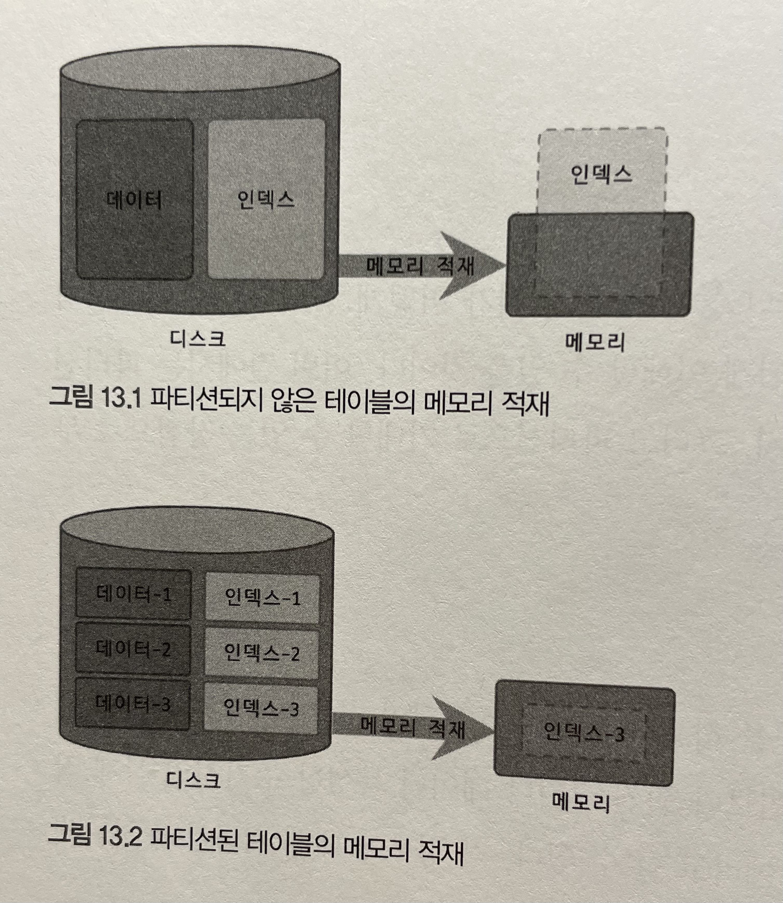
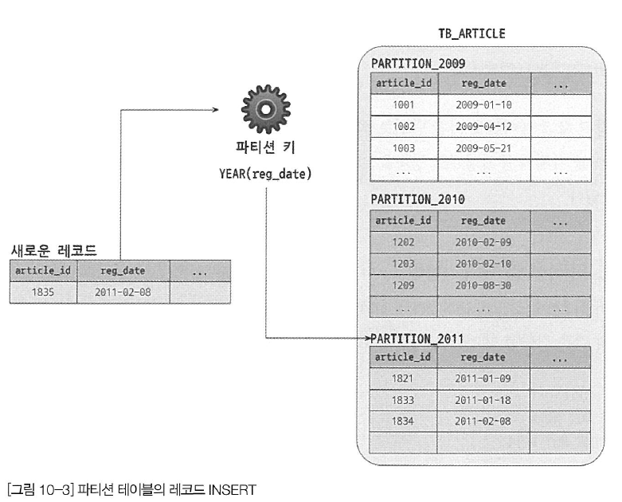

# 13장 파티션

테이블을 논리적으로는 하나의 테이블이지만 물리적으로는 여러 개의 테이블로 분리해서 관리할 수 있게 해줌

### 13.1.1 파티션을 사용하는 이유

- 하나의 테이블이 너무 커서 인덱스의 크기가 물리적인 메모리보다 훨씬 크거나 데이터 특성상 주기적인 삭제 작업이 필요한 경우

**13.1.1.1 단일 INSERT와 단일 또는 범위 SELECT의 빠른 처리**

- 인덱스가 커지면 커질수록 SELECT 뿐만 아니라 INSERT, UPDATE, DELETE 작업도 느려진다.
- 파티션은 데이터와 인덱스를 조각화해서 물리적 메모리를 효율적으로 사용할 수 있게 만들어준다.
- 자주사용되는 데이터 (워킹셋, Working Set) 을 파티션으로 나누어 관리하면 상당히 효과적으로 성능을 개선할 수 있다.
    
    
    

**13.1.1.3 이력 데이터의 효율적인 관리**

- 로그 테이블은 대량의 데이터를 가지고 있는데 이를 관리하는 것은 고부하의 작업에 속한다.
- 이러한 테이블에 대한 추가 및 삭제 작업을 파티션을  통해 간단하고 빠르게 해결할 수 있다.
    
    
    

### 13.1.2 MySQL 파티션의 내부 처리

```sql
CREATE TABLE tb_article (
    article_id INT NOT NULL,
    reg_date DATETIME NOT NULL,
    PRIMARY KEY(article_id, reg_date)
) PARTITION BY RANGE ( YEAR(reg_Date) ) (
    PARTITION p2009 VALUES LESS THAN (2010),
    PARTITION p2010 VALUES LESS THAN (2011),
    PARTITION p2011 VALUES LESS THAN (2012),
    PARTITION p9999 VALUES LESS THAN MAXVALUE
);
```

- reg_date 에서 연도부분은 파티션의 키로서 해동 레코드가 어느 파티션에 저장될지를 결정하는 중요한 역할을 담당한다.

**13.1.2.1 파티션 테이블의 레코드 INSERT**



**13.1.2.2 파티션 테이블의 레코드 UPDATE**

- 파티션 키 컬럼을 변경 / 그 외 컬럼 변경 으로 동작방식이 나뉜다.


**13.1.2.3 파티션 테이블의 검색**

- 파티션 테이블 검색할때 성능에 크게 영향을 미치는 조건
    - WHERE 절의 조건으로 검색해야할 파티션을 선택할 수 있는가?
    - WHERE 절의 조건이 인덱스를 효율적으로 사용(인덱스 레인지 스캔)할 수 있는가?
- 4가지 경우
    - 🙆‍♂️  파티션 선택 가능 + 인덱스 효율적 사용 : 꼭 필요한 파티션의 인덱스만 레인지 스캔
    - 🤔 파티션 선택 불가 + 인덱스 효율적 사용 : 모든 파티션 대상으로 인덱스 레인지 스캔 검색 후 결과 병합
    - ❌ 파티션 선택 가능 + 인덱스 효율적 사용 불가 : 파티션 선택 후 풀테이블 스캔
    - ❌ 파티션 선택 불가 + 인덱스 효율적 사용 불가 : 모든 파티션에 대해 풀테이블 스캔

**13.1.2.4 파티션 테이블의 인덱스 스캔과 정렬**

- 파티션 테이블에 인덱스는 파티션 단위로 생성된다.


```sql
SELECT *
FROM tb_article
WHERE reg_userid BETWEEN 'brew' AND 'toto'
AND reg_date BETWEEN '2009-01-01' AND '2010-12-31'
ORDER BY reg_userid;

+----+-------------+-------------+-------------+-------+---------------+---------+---------+------+------+----------+-----------------------------+
| id | select_type | table       | partitions  | type  | possible_keys | key     | key_len | ref  | rows | filtered | Extra                       |
+----+-------------+-------------+-------------+-------+---------------+---------+---------+------+------+----------+-----------------------------+
|  1 | SIMPLE      | tb_article2 | p2009,p2010 | range | PRIMARY       | PRIMARY | 5       | NULL |    1 |   100.00 | Using where; Using filesort |
+----+-------------+-------------+-------------+-------+---------------+---------+---------+------+------+----------+-----------------------------+
```

- 파티션에서 조건에 맞는 레코드를 찾은 후 reg_userid로 재정렬해야할 것 같지만 실행계획에 별도의 정렬 메시지는 표시되지 않음
- 이는 파티션에서 레코드를 정렬된 순서대로 읽으면서 우선순위 큐에 임시로 저장 후 필요한 순서(인덱스의 정렬 순서)대로 데이터를 가져가기 때문

**13.1.2.5 파티션 프루닝**

- 필요한 파티션만 골라내고 불필요한 것들은 실행계획에서 배제하는 것을 파티션 프루닝이라고 한다.
    
    ```sql
    -- 2010 파티션을 제외한 나머지 파티션은 프루닝됨
    mysql> EXPLAIN SELECT * FROM tb_article WHERE reg_date>'2010-01-01' and reg_date <'2010-02-01';
    +----+-------------+------------+------------+-------+---------------+---------+---------+------+------+----------+--------------------------+
    | id | select_type | table      | partitions | type  | possible_keys | key     | key_len | ref  | rows | filtered | Extra                    |
    +----+-------------+------------+------------+-------+---------------+---------+---------+------+------+----------+--------------------------+
    |  1 | SIMPLE      | tb_article | p2010      | index | PRIMARY       | PRIMARY | 9       | NULL |    1 |   100.00 | Using where; Using index |
    +----+-------------+------------+------------+-------+---------------+---------+---------+------+------+----------+--------------------------+
    ```
    

### 13.2.1 파티션의 제약사항

- 제약사항
    - 스토어드 루틴이나 UDF. 사용자 변수 등을 파티션 표현식에 사용할 수 없다.
    - 파티션 표현식은 일반적으로 칼럼 그 자체 또는 MySQL 내장 함수를 사용할 수 있는데, 여기서 일부 함수들은 파티 션 생성은 가능하지만 파티션 프루닝을 지원하지 않을 수도 있다.
    - **프라이머리 키를 포함해서 테이블의 모든 유니크 인덱스는 파티션 키 칼럼을 포함해야 한다.**
    - 파티션된 테이블의 인덱스는 모두 로컬 인덱스이며, 동일 테이블에 소속된 모든 파티션은 같은 구조의 인덱스만 가 질 수 있다. 또한 파티션 개별로 인덱스를 변경하거나 추가할 수 없다.
    - 동일 테이블에 속한 모든 파티션은 동일 스토리지 엔진만 가질 수 있다.
    - 최대(서브 파티션까지 포함해서) 8192개의 파티션을 가질 수 있다.
    - 파티션 생성 이후 MySQL 서버의 sql_mode 시스템 변수 변경은 데이터 파티션의 일관성을 깨뜨릴 수 있다.
    - 파티션 테이블에서는 외래키를 사용할 수 없다.
    - 파티션 테이블은 전문 검색 인덱스 생성이나 전문 검색 쿼리를 사용할 수 없다.
    - 공간 데이터를 저장하는 칼럼 타입(POINT, GEONETRY, )은 파티션 테이블에서 사용할 수 없다.
    - 임시 테이블(Temporary table)은 파티션 기능 사용할 수 없다.
- 기본적인 산술 연산자 “+”, “-”, “*” 연산자 사용이 가능하며, 추가로 다음과 같은 MySQL 내장 함수를 사용할 수 있다.
    
    ```sql
    CEILING(), EXTRACT), FLOOR(), MOD(),
    DATEDIF(), DAYS(), DAYOFMONTH), DAYOFWEEK(), DAYOFYEAR(), HOUR(), 
    MICROSECOND() , MINUTE(), INTHO), QUARTER(), SECOND(), 
    TIME_TO_SEC(), TO_DAYS(), TO_SECONDS(), UNIX_TIMESTAMP(), WEEKDAY(), YEAR() , 
    YEARWEEK()
    ```
    

### 13.2.2 파티션 사용 시 주의사항

- 파티션의 목적이 작업의 범위를 좁히는 것인데, 유니크 인덱스는 중복 레코드에 대한 체크 작업 때문에 범위가 좁혀지지 않는다.

**13.2.2.1 파티션과 유니크 키(프라이머리 키 포함)**

- 잘못된 예
    
    ```sql
    CREATE TABLE tb_partition (
      fd1 INT NOT NULL, fd2 INT NOT NULL, fd3 INT NOT NULL,
      UNIQUE KEY (fd1, fd2)
    ) PARTITION BY HASH (fd3)
    PARTITIONS 4; -- 유니크키와 파티션 키가 전혀 연관이 없음
    
    CREATE TABLE tb_partition (
      fd1 INT NOT NULL, fd2 INT NOT NULL, fd3 INT NOT NULL,
      UNIQUE KEY (fd1),
      UNIQUE KEY (fd2)
    ) PARTITION BY HASH (fd1 + fd2)
    PARTITIONS 4; -- 첫번째 fd1 만으로 파티션이 결정되지 않음. fd2도 마찬가지
    
    CREATE TABLE tb_partition (
      fd1 INT NOT NULL, fd2 INT NOT NULL, fd3 INT NOT NULL,
      PRIMARY KEY (fd1)
      UNIQUE KEY (fd2, fd3)
    ) PARTITION BY HASH (fd1 + fd2)
    PARTITIONS 4; -- 위와 마찬가지로 fd1 PK 값만으로 판단이 불가. fd2, fd3도 마찬가지
    ```
    
- 옳은 예
    
    ```sql
    CREATE TABLE tb_partition (
      fd1 INT NOT NULL, fd2 INT NOT NULL, fd3 INT NOT NULL,
      UNIQUE KEY (fd1, fd2, fd3)
    ) PARTITION BY HASH (fd1)
    PARTITIONS 4;
    
    CREATE TABLE tb_partition (
      fd1 INT NOT NULL, fd2 INT NOT NULL, fd3 INT NOT NULL,
      UNIQUE KEY (fd1, fd2)
    ) PARTITION BY HASH (fd1 + fd2)
    PARTITIONS 4;
    
    CREATE TABLE tb_partiton (
      fd1 INT NOT NULL, fd2 INT NOT NULL, fd3 INT NOT NULL,
      UNIQUE KEY (fd1, fd2, fd3),
      UNIQUE KEY (fd3)
    ) PARTITION BY HASH (fd3)
    PARTITIONS 4;
    ```
    

**13.2.2.2 파티션과 open_files_limit 시스템 변수 설정**

- 테이블을 파일 단위로 관리하기 때문에 MySQL 서버에서 동시에 오픈된 파일의 개수가 많아질 수 있다.
- 이를 `open_files_limit` 로 제한할 수 있다.
- 파티션 테이블은 파일의 개수가 **파티션의 개수 * 2~3** 정도이다.
- 따라서 파티션을 많이 사용하는 경우에는 `open_files_limit`을 적절히 높은 갚으로 설정해줘야한다

## 13.3 MySQL 파티션의 종류

1. **레인지 파티션** 
    - 정의 및 특징
        - 연속된 범위로 파티션을 정의하는 방법으로, 가장 일반적. `MAXVALUE` 키워드를 이용해 명시되지 않은 범위의 키 값이 담긴 레코드를 저장하는 파티션을 정의할 수 있음.
    - 레인지 파티션의 용도
        - 날짜를 기반으로 데이터가 누적되고 연도나 월, 또는 일 단위로 분석하고 삭제해야 할 때
        - 범위 기반으로 데이터를 여러 파티션에 균등하게 나눌 수 있을 때
        - 파티션 키 위주로 검색이 자주 실행될 때
    - 파티션의 장점
        - 큰 테이블을 작은 크기의 파티션으로 분리
        - **필요한 파티션만 접근(쓰기와 읽기 모두)**
    
    ```sql
    CREATE TABLE employees ( 
    	id INT NOT NULL,
    	first_name VARCHAR(30), 
    	last_name VARCHAR(30),
    	hired DATE NOT NULL DEFAULT '1970-01-01'
    ) PARTITION BY RANGE( YEAR(hired) ) ( -- 키워드로 레인지 파티션을 정의, 괄호에 키 명시
    	PARTITION pO VALUES LESS THAN (1991), -- 아규먼트값보다 작은 값만 해당 파티션에 저장, 아규먼트는 미포함
    	PARTITION P1 VALUES LESS THAN (1996), 
    	PARTITION P2 VALUES LESS THAN (2001), 
    	PARTITION p3 VALUES LESS THAN MAXVALUE -- 명시되지 않은 레코드를 저장할 파티션 2001~9999
    );
    
    -- 파티션 추가. but 오류발생 이미 2001~2011 레코드가 MAXVALUE 에 존재
    ALTER TABLE employees
        ADD PARTITION (PARTITION p4  VALUES LESS THAN (2011)); -- 
    
    -- REORGANIZE로 파티션을 분리 및 병합 할 수 있다.
    -- p3 에 있던 2001~MAXVALUE 중 2001~2011 레코드를 p3으로 옮긴다.
    ALTER TABLE employees2 ALGORITHM=INPLACE, LOCK=SHARED,
    REORGANIZE PARTITION p3 INTO (
    PARTITION p3 VALUES LESS THAN (2011),
    PARTITION p4 VALUES LESS THAN MAXVALUE);
    
    -- p2, p3 파티션을 병합한다.
    ALTER TABLE employees ALGORITHM=INPLACE, LOCK=SHARED,
    REORGANIZE PARTITION p2, P3 INTO (
    PARTITION P23 VALUES LESS THAN (2011)
    
    mysql> SELECT PARTITION_NAME FROM information_schema.partitions WHERE TABLE_NAME = 'employees2';
    +----------------+
    | PARTITION_NAME |
    +----------------+
    | p4             |
    | p23            |
    | P1             |
    | pO             |
    +----------------+
    4 rows in set (0.00 sec)
    ```
    
2. **리스트 파티션**
    - 정의 및 특징
        - 레인지 파티션과 흡사하다.
        - 차이점은 레인지 파티션은 파티션키 값의 범위로 파티션을 구성할 수 있지만
        리스트 파티션은 파티션 키 값 하나하나를 리스트로 나열해야 한다.
    - 리스트 파티션의 용도
        - 파티션 키 값이 코드 값이나 카테고리와 같이 고정적일 때
        - 키 값이 연속되지 않고 정렬 순서와 관계없이 파티션을 해야 할 때
        - 파티션 키 값을 기준으로 레코드의 건수가 균일하고 검색 조건에 파티션 키가 자주 사용될 때
    
    ```sql
    CREATE TABLE product (
        id INT NOT NULL,
    	name VARCHAR(30),
    	category_id INT NOT NULL
    ) PARTITION BY LIST( category_id ) ( -- 리스트 파티션임을 명시
    	PARTITION p_appliance VALUES IN (3),
    	PARTITION p_computer VALUES IN (1,9),
    	PARTITION P_sports VALUES IN (2,6,7),
    	PARTITION p_etc VALUES IN (4,5,8,NULL) -- 파티션별 키 값 목록을 나열
    );
    ```
    

1. **해시 파티션**
    - 정의 및 특징
        - 해시 파티션은 MySQL에서 정의한 해시 함수에 의해 레코드가 저장될 파티션을 결정하는 방법이다.
        - 해시 파티션의 파티션 키는 항상 정수 타입의 칼럼이거나 정수를 반환하는 표현식만 사용될 수 있다.
        - 해시 파티션에서 파티션의 개수는 레코드를 각 파티션에 할당하는 알고리즘과 연관되기 때문에 파티션을 추가하거나 삭제하는 작업에는 테이블 전체적으로 레코드를 재분배하는 작업이 따른다.
    - 용도
        - 레인지 파티션이나 리스트 파티션으로 데이터를 균등하게 나누는 것이 어려울 때
        - 테이블의 모든 레코드가 비슷한 사용 빈도를 보이지만 테이블이 너무 커서 파티션을 적용해야 할 때
        - 대표적으로 회원 테이블. 가입일자나 지역 취미 등이 사용빈도에 영향을 미치지 않는다.
        
        ```sql
        -- // 파티션의 개수만 지정할 때
        CREATE TABLE employees (
            id INT NOT NULL,
            first_name VARCHAR(30),
            last_name VARCHAR(30) ,
            hired DATE NOT NULL DEFAULT '1970-01-01'
        ) PARTITION BY HASH(id) PARTITIONS 4;
        
        -- // 파티션의 이름을 별도로 지정하고자 할 때
        CREATE TABLE employees ( 
            id INT NOT NULL,
            first_name VARCHAR(30), 
            last_name VARCHAR (30),
            hired DATE NOT NULL DEFAULT '1970-01-01'
        ) PARTITION BY HASH(id)
        PARTITIONS 4 (
            PARTITION pO ENGINE=INNODB, 
            PARTITION p1 ENGINE=INNODB, 
            PARTITION P2 ENGINE=INNODB, 
            PARTITION p3 ENGINE=INNODB);
        ```
        
    
    - 해시 파티션 추가
        
        
        
        - 특정 파티션 키 값을 테이블의 파티션 개수로 MOD 연산한 결괏값에 의해 각 레코드가 저장될 파티션을 결정한다.
        - 파티션의 개수에 따라 달라지기 때문에 파티션이 추가되면 전체 레코드가 재배치 되어야함.
        - 따라서 해시 파티션을 추가하거나 생성하는 작업은 많은 부하를 발생시킨다.
        
        ```sql
        -- //파티션 1개만 추가하면서 파티션 이름을 부여하는 경우
        mysql> ALTER TABLE employees ALGORITHM=INPLACE, LOCK=SHARED, 
        ADD PARTITION(PARTITION p5 ENGINE=INNODB);
        
        -- // 동시에 6개의 파티션을 별도의 이름 없이 추가하는 경우
        mysql> ALTER TABLE employees ALGORITHM=INPLACE, LOCK=SHARED
        ADD PARTITION PARTITIONS 6;
        ```
        
    
    - 해시 파티션 삭제 및 분할
        - 해시, 키 파티션은 파티션단위로 삭제나 분할하는 방법이 없다.
    
    - 해시 파티션 병합
        
        
        
        - 병합하는 기능은 없고, 줄이기는 가능하다
            
            ```sql
            ALTER TABLE employees ALGORITHM=INPLACE, LOCK=SHARED
            COALESCE PARTITION 1;
            ```
            
    
2. **키 파티션**
    - 정의 및 특징
        - 해시 파티션과 사용법과 특성이 거의 같다.
        - 해시 값을 계산하는 방법을 파티션 키나 표현식에 사용자가 명시한다. (최종적으론 MySQL 서버가 MOD 연산을 수행함)
        - 정수타입 외에 대부분 데이터 타입에 파티션 키 적용이 가능하다.
        
        ```sql
        -- // 프라이머리 키가 있는 경우 자동으로 프라이머리 키가 파티션 키로 사용됨
        CREATE TABLE k1 (
        	id INT NOT NULL, name VARCHAR (20),
        	PRIMARY KEY (id)
        
        -- // 괄호의 내용을 비워 두면 자동으로 프라이머리 키의 모든 칼럼이 파티션 키가 용
        -- // 그렇지 않고 프라이머리 키의 일부만 명시할 수도 있음
        PARTITION BY KEY ()
        PARTITIONS 2;
        -- // 프라이머리 키가 없는 경우 유니크 키(존재한다면)가 파티션 키로 사용됨
        CREATE TABLE K1 (
        	id INT NOT NULL, name VARCHAR (20), -- 유니크키로 할경우 NOT NULL 이어야함
        	UNIQUE KEY (id)
        )
        -- // 괄호의 내용을 비워 두면 자동으로 프라이머리 키의 모든 칼럼이 파티션 키가 됨
        -- // 그렇지 않고 프라이머리 키의 일부만 명시할 수도 있음.
        PARTITION BY KEY ()
        PARTITIONS 2;
        
        -- // 프라이머리 키나 유니크 키의 칼럼 일부를 파티션 키로 명시적으로 설정
        CREATE TABLE dept_emp (
        	emp no INT NOT NULL, dept_no CHAR (4) NOT NULL,
        	PRIMARY KEY (dept_no, emp_no)
        -- // 괄호의 내용에 프라이머리 키나 유니크 키를 구성하는 칼럼 중에서
        -- // 일부만 선택해 파티션 키로 설정하는 것도 가능하다.
        PARTITION BY KEY (dept_no)
        PARTITIONS 2;
        ```
        
    
3. **리니어 해시/키 파티션**
    - 특징 및 정의
        - 해시와 키 파티션의 단점인 전체 레코드의 재분배 작업을 최소화하기 위해 등장
        - Power-of-two (2의 승수) 알고리즘을 이용한다.
    - 리니어 해시/키 파티션 추가
        
        
        
    - 리니어 해시/키 파티션의 통합
        
        
        
    - 주의사항
        - 리니어 해시/키 파티션은 각 파티션이 가지는 레코드 건수가 덜 균등할 수 있다.
        - 새로운 파티션을 추가하거나 삭제해야할 요건이 많다면 리니어 해시 또는 키 파티션을 적용하는 것이 좋다.
        

### 13.3.6 파티션 테이블의 쿼리 성능

- 테이블에서 얼마나 많은 파티션을 프루닝(Partition pruning) 할수 있는지가 관건이다
- .테이블을 10개로 파티션해서 10개의 파티션 중에서 주로 1~3개 정도의 파티션만 읽고 쓴다면 파티션 기능이 성능 향상에 도움이 될 것이다.
- 그런데 10개로 파티션하고 파티션된 10개를 아주 균등하게 사용한다면 이는 성능 향상보다는 오히려 오버헤드만 심해지는 결과를 가져올 수 있다.
- 대용량 테이블을 10개로 쪼개서 서로 다른 MySQL 서버에 저장(샤딩)한다면 매우 효율적일 것이다. 하지만 MySQL 서 버의 파티션은 샤딩이 아니라는 것에 주의하자. 파티션을 사용할 때는 반드시 파티션 프루닝이 얼마나 도움이 될지를 먼저 예측해보고 응용 프로그램에 적용하자. 레인지 파티션 이외의 파티션을 적용할 때 는 파티션 프루닝을 더 많이 고민해 보고 적용할 것을 권장한다.