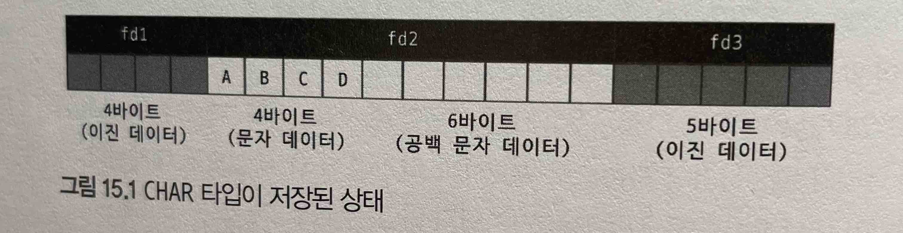
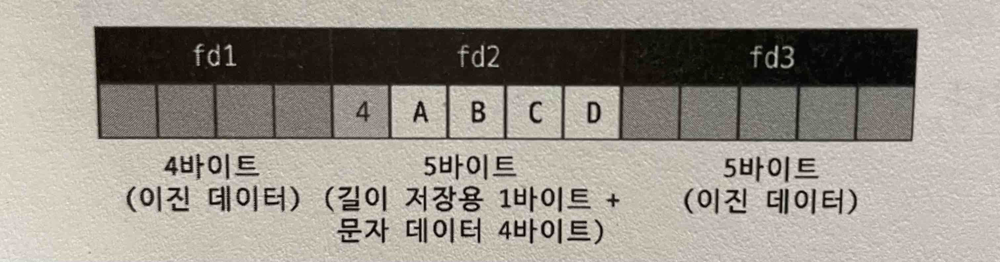
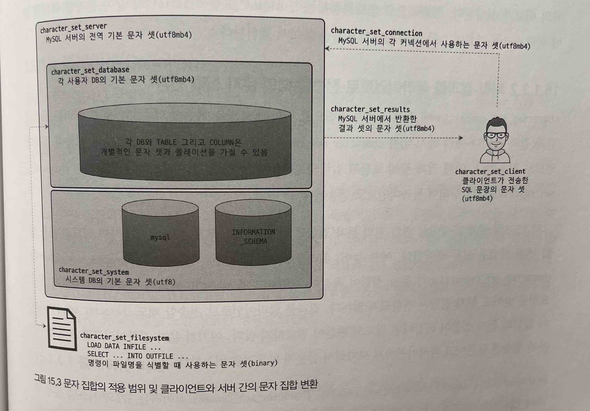

# 15장 데이터타입

- 데이터 타입과 길이를 선정할때 주의할 요소
    - 저장되는 값의 성격에 맞는 최적의 타입을 선정
    - 가변 길이 칼럼은 최적의 길이를 지정
    - 조인 조건으로 사용되는 칼럼은 똑같은 데이터 타입으로 선정

## 15.1 문자열(CHAR와 VARCHAR)

### 15.1.1 저장공간

- CHAR 와 VARCHAR 의 가장큰 차이는 고정길이냐 가변길이냐다.
    - 고정 길이는 실제 입력되는 칼럼값의 길이에 따라 사용하는 저장 공간의 크기가 변하지 않는다. CHAR 타입은 이미 저장 공간의 크기가 고정적이다. 실제 저장된 값의 유효 크기가 얼마인지 별도로 저장할 필요가 없으므로 추가로 공간이 필요하지 않다.
    - 가변 길이는 최대로 저장할 수 있는 값의 길이는 제한돼 있지만, 그 이하 크기의 값이 저장되면 그만큼 저장 공간이 줄어든다. 하지만 VARCHAR 타입은 저장된 값의 유효 크기가 얼마인지를 별도로 저장해 둬야 하므로 1~2바이트의 저장 공간이 추가로 더 필요하다.
- CHAR 와 VARCHAR 의 결정 시 중요한 판단 기준
    - 저장되는 문자열의 길이가 대개 비슷한가?
    - **칼럼의 값이 자주 변경되는가?**

```sql
CREATE TABLE tb_test (
    fd1 INT NOT NULL,
    fd2 CHAR(10) NOT NULL,
    fd3 DATETIME NOT NULL
);

INSERT INTO tb_test (fd1, fd2, fd3) VALUES (1, 'ABCD', '2011-06-27 11:02:11');
```



15.1 CHAR 타입이 저장된 상태



15.2 VARCHAR 타입이 저장된 상태

- fd2 컬럼을 ‘ABCDE’ 로 업데이트
    - CHAR(10) 타입을 사용하는 그림 15.1에서는 fd2 칼럼을 위해 공간이 10바이트가 준비돼 있으므로 그냥 변경되는 칼 럼의 값을 업데이트만 하면 된다.
    - VARCHAR(10) 타입을 사용하는 그림 15.2에서는 fd2 칼럼에 4바이트밖에 저장할 수 없는 구조로 만들어져 있다. 그 래서 ABCDE "와 같이 길이가 더 큰 값으로 변경될 때는 레코드 자체를 다른 공간으로 옮겨서(Row migraltion) 저장 해야 한다.
- 고정길이일때 ? → 당연히 CHAR
- 값이 2~3바이트씩 차이가 나더라도 자주 변경될수 있는 데이터는 CHAR 타입을 사용하는 것이 좋다. 왜냐하면 2~3바이트의 낭비보다 레코드가 물리적으로 다른위치로 이동하거나 분리되지 않아도 되기 때문
(COST : 2~3바이트의 낭비 < 레코드의 이동이나 분리)
- CHAR , VARCHAR 뒤 인자로 오는 숫자 → 바이트의 크기가 아니라 문자의 수를 의미한다.
    - CHAR(10) 일 경우
        - 일반적으로 영어를 포함한 서구권 언어는 각 문자가 1바이트를 사용하므로 10바이트를 사용한다.
        - 한국어나 일본어와 같은 아시아권 언어는 각 문자가 최대 2이트를 사용하므로 20바이트를 사용
        - UTF-8 과 같은 유니코드는 최대 4바이트까지 사용하므로 40바이트까지 사용할 수 있다.
        

> utf8 문자집합은 1~3바이트까지만 지원 → SMP, SIP, 플레인 문자, 이모티콘 저장 불가  
> utf8mb4 문자집합은 4바이트까지 지원 → 유니코드 지원 대부분의 문자를 지원  
> utf8mb4는 utf8의 수퍼 셋이기 때문에 테이블의 utf8 에서 utf8mb4의 전환은 아무런 문제가 되지 않음  
> utf8 은 8.0 에서 utf8mb3 을 가리키고 있고 이는 곧 deprecated 될 예정  
> utf8mb3이 제거된 이후에는 utf8은 utf8mb4를 가리킬 예정  
> 
> [https://dev.mysql.com/doc/refman/8.0/en/charset-unicode-utf8.html](https://dev.mysql.com/doc/refman/8.0/en/charset-unicode-utf8.html) 

### 15.1.2 저장공간과 스키마 변경 (Online DDL)

- MySLQ 서버에서는 데이터가 변경되는 도중에도 스키마 변경을 할 수 있도록 Online DDL이라는 기능(Online DDL에 대한 자세한 설명은 11.7.1절 '온라인 DDI'을 참조)을 제공한다.
- 하지만 모든 스키마 변경이 온라인으로 가능한 것은 아니며, 변경 작업의 특성에 따라 SELECT는 가능하지만 INSERT 나 UPDATE 같은 데이터 변경은 허용되지 않을 수도 있다. VARCHAR 데이터 타입을 사용하는 칼럼의 길이 를 늘리는 작업은 길이에 따라 매우 빠르게 처리될 수도 있지만 어떤 경우에는 테이블에 대해 읽기 잠 금을 걸고 레코드를 복사하는 작업이 필요할 수도 있다.
- 다음과 같이 길이가 60으로 정의된 VARCHAR 타입의 칼럼을 가진 테이블에서 확장하는 길이에 따른
ALTER TABLE 명령의 결과를 살펴보자.

```sql
CREATE TABLE test(
	id INT PRIMARY KEY,
	value VARCHAR(60)
) DEFAULT CHARSET=utf8mb64;
```

```sql
mysql) ALTER TABLE test MODIFY value VARCHAR(63), ALGORITHM=INPLACE, LOCK-NONE;
Query OK, 0 rows affected (0.00 sec)

mysql) ALTER TABLE test MODIFY value VARCHAR(64), ALGORITHM=INPLACE, LOCK=NONE;
ERROR 1846 (QA000): ALGORITHM=INPLACE is not supported. Reason: Cannot change column type
INPLACE. Try ALGORITHM=COPY. -- 64바이트 부터 COPY 알고리즘 , SHARED 잠금 사용
```

- 이러한 차이가 발생하는 이유는 VARCHAR 타입의 칼럼이 가지는 길이 저장 공간의 크기 때문이다.
VARCHAR(60)은 utf8mb4 문자 집합을 사용하는 VARCHAR(60) 칼럼은 최대 길이가 240(60 * 4)바이트이기 때문에 문자열 값의 길이를 저장하는 공간은 1바이트면 된다.
- 하지만 VARCHAR(64) 타입은 저장할 수 있 는 문자열의 크기가 최대 256바이트까지 가능하기 때문에 문자열 길이를 저장하는 공간의 크기가 2바이트로 바뀌어야 한다. 이처럼 문자열 길이를 저장하는 공간의 크기가 바뀌게 되면 MySQL 서버는 스키마 변경을 하는 동안 읽기 잠금(LOCK=-SHARED)을 걸어서 아무도 데이터를 변경하지 못하도록 막고 테이블의 레코드를 복사하는 방식으로 처리한다.
- 이러한 이유로 VARCHAR 타입의 길이가 변경될 것으로 예상된다면 길이 저장공간 크기가 바뀌지 않도록 미리 조금 크게 설계하는 것이 좋다.

### 15.1.3 문자 집합(캐릭터 셋)

- MySQL 서버에서 각 테이블의 칼럼은 모두 서로 다른 문자 집합을 사용해 문자열 값을 저장할 수 있다.
- 문자 집합은 문자열을 저장하는 CHAR, VARCHAR, TEXT 타입의 칼럼에만 설정할 수 있다.
- MySQL 에서 최종적으로는 칼럼 단위로 문자 집합을 관리하지만 관리의 편의를 위해 MySQL 서버와 DB 
그리고 테이블 단위로 기본 문자 집합을 설정할 수 있는 기능을 제공한다.
- 한글 기반의 서비스에서는 euckr 또는 utf8mb4 문자 집합을 사용 한다.
한글 윈도우에서 기본적으로 사용되는 MS949(MSWIN949) 문자 집합은 EUC-KR 조금 더 확장된 형태의 문자 집합으로 유닉스 계열의 운영체제에서 사용하는 CP949와 똑같은 문자 집합이다.
- MySQL 서버에서는 EUC-KR 만 지원한다.
- MySQL 서버에서 사용 가능한 문자 집합은 `SHOW CHARACTER SET` 명령으로 확인해 볼 수 있다.
    - `SHOW CHARACTER SET` 실행결과
        
        ```sql
        mysql> show character set;
        +----------+---------------------------------+---------------------+--------+
        | Charset  | Description                     | Default collation   | Maxlen |
        +----------+---------------------------------+---------------------+--------+
        | armscii8 | ARMSCII-8 Armenian              | armscii8_general_ci |      1 |
        | ascii    | US ASCII                        | ascii_general_ci    |      1 |
        | big5     | Big5 Traditional Chinese        | big5_chinese_ci     |      2 |
        | binary   | Binary pseudo charset           | binary              |      1 |
        | cp1250   | Windows Central European        | cp1250_general_ci   |      1 |
        | cp1251   | Windows Cyrillic                | cp1251_general_ci   |      1 |
        | cp1256   | Windows Arabic                  | cp1256_general_ci   |      1 |
        | cp1257   | Windows Baltic                  | cp1257_general_ci   |      1 |
        | cp850    | DOS West European               | cp850_general_ci    |      1 |
        | cp852    | DOS Central European            | cp852_general_ci    |      1 |
        | cp866    | DOS Russian                     | cp866_general_ci    |      1 |
        | cp932    | SJIS for Windows Japanese       | cp932_japanese_ci   |      2 |
        | dec8     | DEC West European               | dec8_swedish_ci     |      1 |
        | eucjpms  | UJIS for Windows Japanese       | eucjpms_japanese_ci |      3 |
        | euckr    | EUC-KR Korean                   | euckr_korean_ci     |      2 |
        | gb18030  | China National Standard GB18030 | gb18030_chinese_ci  |      4 |
        | gb2312   | GB2312 Simplified Chinese       | gb2312_chinese_ci   |      2 |
        | gbk      | GBK Simplified Chinese          | gbk_chinese_ci      |      2 |
        | geostd8  | GEOSTD8 Georgian                | geostd8_general_ci  |      1 |
        | greek    | ISO 8859-7 Greek                | greek_general_ci    |      1 |
        | hebrew   | ISO 8859-8 Hebrew               | hebrew_general_ci   |      1 |
        | hp8      | HP West European                | hp8_english_ci      |      1 |
        | keybcs2  | DOS Kamenicky Czech-Slovak      | keybcs2_general_ci  |      1 |
        | koi8r    | KOI8-R Relcom Russian           | koi8r_general_ci    |      1 |
        | koi8u    | KOI8-U Ukrainian                | koi8u_general_ci    |      1 |
        | latin1   | cp1252 West European            | latin1_swedish_ci   |      1 |
        | latin2   | ISO 8859-2 Central European     | latin2_general_ci   |      1 |
        | latin5   | ISO 8859-9 Turkish              | latin5_turkish_ci   |      1 |
        | latin7   | ISO 8859-13 Baltic              | latin7_general_ci   |      1 |
        | macce    | Mac Central European            | macce_general_ci    |      1 |
        | macroman | Mac West European               | macroman_general_ci |      1 |
        | sjis     | Shift-JIS Japanese              | sjis_japanese_ci    |      2 |
        | swe7     | 7bit Swedish                    | swe7_swedish_ci     |      1 |
        | tis620   | TIS620 Thai                     | tis620_thai_ci      |      1 |
        | ucs2     | UCS-2 Unicode                   | ucs2_general_ci     |      2 |
        | ujis     | EUC-JP Japanese                 | ujis_japanese_ci    |      3 |
        | utf16    | UTF-16 Unicode                  | utf16_general_ci    |      4 |
        | utf16le  | UTF-16LE Unicode                | utf16le_general_ci  |      4 |
        | utf32    | UTF-32 Unicode                  | utf32_general_ci    |      4 |
        | utf8mb3  | UTF-8 Unicode                   | utf8mb3_general_ci  |      3 |
        | utf8mb4  | UTF-8 Unicode                   | utf8mb4_0900_ai_ci  |      4 |
        +----------+---------------------------------+---------------------+--------+
        41 rows in set (0.00 sec)
        ```
        
- 한국에서 MySQL을 사용한다면 대부분  euckr 이나 utf8mb4 만으로도 충분
    - euckr : 한국어 전용으로 모든 글자는 1~2바이트를 사용한다.
    - utf8mb4 : 다국어 문자를 포함할 수 있는 칼럼에 적합. 한글자 저장을 위해 1~4바이트 사용. 메모리에 기록될 때는 실제 문자열의 길이와 관계없이 문자당 4바이트로 공간이 할당되는 경우도 있다.
- `SHOW CHARACTER SET` 명령의 결과에서 Default collation 칼럼에는 해당 문자 집합의 기본 콜레이션이 무엇인지 표시해준다.

- MySQL 에서는 문자 집합을 설정하는 시스템 변수가 여러가지가 있는데 모두 제각기 목적이 다르므로 주의해야 한다.
    - character_set 관련 시스템변수
        - `character_set_system` 
        MySQL 서버가 식별자(denifier, 테이블 명이나 칼럼 명 등)를 저장할 때 사용하는 문자 집합이다. 이 값은 기본적 으로 utf8로 설정되며, 사용자가 설정하거나 변경할 필요가 없다.
        - `character_set_server` 
        MySQL 서버의 기본 문자 집합이다. DB나 테이블 또는 칼럼에 아무런 문자 집합이 설정되지 않을 때 이 시스템 변 수에 명시된 문자 집합이 기본으로 사용된다. 이 시스템 변수의 기본값은 utf8mb4다.
        - `character_set_database` 
        MySQL DB의 기본 문자 집합이다. DB를 생성할 때 아무런 문자 집합이 명시되지 않았다면 이 시스템 변수 된 문자 집합이 기본값으로 사용된다. 이 변수가 정의되지 않으면 character set server 시스템 변수에 문자 집합이 기본으로 사용된다. 이 시스템 변수의 기본값은 utf8mb4이다.
        - `character_set_filesystem` 
        LOAD DATA INFILE .. 또는 SELECT ...INTO OUTFILE 문장을 실행할 때 인자로 지정되는 파일의 이름을 해석할 때 사용되는 문자 집합이다. 여기서 주의해야 할 것은 데이터 파일의 내용을 읽을 때 사용하는 문자 집합이 아니라 파일의 이름을 찾을 때 사용하는 문자 집합이라는 점이다. 이 설정값은 각 커넥션에서 임의의 문자 집합으로 변경해서 사용할 수 있다. 기본값은 binary인데, LOAD DATA INFILE 명령이나 SELECT INTO OUTFILE 명령에서 파 일명을 제대로 인식하지 못한다면 character_set_filesysten 시스템 변수를 utf8m4로 변경하는 것이 좋다.
        - `character_set_client` 
        MySQL 클라이언트가 보낸 SQL 문장은 character_set_client에 설정된 문자 집합으로 인코딩해서 MySQL 서버로 전송한다. 이 값은 각 커넥션에서 임의의문자 집합으로 변경해서 사용할 수 있다. 기본값은 utf8mb4이다. SQL 문장에서 문자열 리터럴에 대해 인트로듀서(*utf8mb4 string. value'" 형태로 문자열 리터럴에 문자 셋을 설정 하는 방법)가 사용된 경우에는 character*set.client 시스템 변수와 무관하게 개별적으로 설정된 문자 셋이 적
        - `character_set_connection` 
        MySQL 서버가 클라이언트로부터 전달받은 SQL 문장을 처리하기 위해 character_set_connection의 문자 집합 으로 변환한다. 또한 클라이언트로부터 전달받은 숫자 값을 문자열로 변환할 때도 character_set_connection에 설정된 문자 집합이 사용된다. 이 변숫값 또한 각 커넥션에서 임의로 문자 집합으로 변경해서 사용할 수 있다. 기본값은 utf8mb4다.
        - `character_set_results`
        MSQL 서버가 쿼리의 처리 결과를 클라이언트로 보낼 때 사용하는 문자 집합을 설정하는 시스템 변수다. 이 시스 템 변수도 각 커넥션에서 임의의 문자 집합으로 변경해서 사용할 수 있다. 기본값은 utf8mb4다.
    
    
    

**15.1.3.1 클라이언트로부터 쿼리를 요청했을 때의 문자 집합 변환**

- MySQL 서버는 클라이언트로부터 받은 메시지가 character_set_client에 지정된 문자 집합으로 인코딩돼 있다고 판단하고, 받은 문자열 데이터를 character_set_connection 에 정의된 문자 집합으로 변환한다.
- 하지만 SQL 문장에 별도의 문자집합이 지정된 리터럴은 변환대상에 포함하지 않는다.

```sql
	-- Matt 문자열이 character_set_connection 으로 문자집합이 변환된 이후 처리 
	mysql) SELECT emp_no, first_name FROM employees WHERE first_name= 'Matt"; 

	-- 인트로듀서
	-- character_set_connection 이 아니라 latain1 문자집합으로 first_name 칼럼의 값과의 비교가 실행 
	mysql) SELECT emp_no, first_name FROM employees WHERE first_name=_latin'Matt';
```

**15.1.3.2 처리 결과를 클라이언트로 전송할 때의 문자 집합 변환**

- `character_set_connection` 에 정의된 문자 집합으로 변환해 SQL을 실행한 다음, MySQL 서버는 쿼리의 결과(결과 셋이나 에러 메시지)를 character_set_results 변수에 설정된 문자 집합으로 변환해 클라이 언트로 전송한다. 이때 결과 셋에 포함된 칼럼의 값이나 칼럼명과 같은 메타데이터도 모두 `character_set_results`로 인코딩되어 클라이언트로 전송된다.
- 변환 전의 문자 집합과 변환해야 할 문자 집합이 똑같다면 별도의 문자 집합 변환 작업은 모두 생략한다. (콜레이션까지 포함해서 비교)
- `character_set_client` `character_set_connection` `character_set_results` 3개의 시스템 변수는 클라이언트 도구에서 마음대로 변경할 수 있다. 즉 세션 변수이면서 동적 변수이다. 다음과 같이 이들 변수 의 값을 한 번에 설정하거나 개별적으로 변경할 수 있다.
    
    ```sql
    mysql> SET character_set_client = 'utf8mb4';
    mysql> SET character_set_results = 'utf8mb4';
    mysql> SET character_set_connection = 'utf8mb4';
    
    mysq1> SET NAMES utf8mb4; -- 위 시스템 변수가 동시에 변환된다.
    mysql> CHARSET utf8mb4; -- 위 시스템 변수가 동시에 변환된다.
    ```
    

### 15.1.4 콜레이션(Collation)

- 콜레이션은 문자열 칼럼의 값에 대한 비교나 정렬 순서를 위한 규칙을 의미한다.
- MySQL의 모든 문자열 타입의 칼럼은 독립적인 문자 집합과 콜레이션을 가진다.
- 각 칼럼에 대해 독립적으로 지정하지 않으면 MySQL 서버나 DB의 기본 문자 집합과 콜레이션 이 자동으로 설정된다.
- 콜레이션이란 문자열 칼럼의 값을 비교하거나 정렬하는 기준이 된다.
- 각문자열 칼럼의 값을 비교하거나 정렬할 때는 항상 문자 집합뿐 아니라 콜레이션의 일치 여부에 따라 결 과가 달라지며, 쿼리의 성능 또한 상당한 영향을 받는다.

**15.1.4.1 콜레이션 이해**

- `SHOW COLLATION;`
    
    ```sql
    +---------------------------+--------+---+-------+--------+-------+-------------+
    |Collation                  |Charset |Id |Default|Compiled|Sortlen|Pad_attribute|
    +---------------------------+--------+---+-------+--------+-------+-------------+
    |armscii8_bin               |armscii8|64 |       |Yes     |1      |PAD SPACE    |
    |armscii8_general_ci        |armscii8|32 |Yes    |Yes     |1      |PAD SPACE    |
    |ascii_bin                  |ascii   |65 |       |Yes     |1      |PAD SPACE    |
    |ascii_general_ci           |ascii   |11 |Yes    |Yes     |1      |PAD SPACE    |
    |big5_bin                   |big5    |84 |       |Yes     |1      |PAD SPACE    |
    |big5_chinese_ci            |big5    |1  |Yes    |Yes     |1      |PAD SPACE    |
    |binary                     |binary  |63 |Yes    |Yes     |1      |NO PAD       |
    |cp1250_bin                 |cp1250  |66 |       |Yes     |1      |PAD SPACE    |
    |cp1250_croatian_ci         |cp1250  |44 |       |Yes     |1      |PAD SPACE    |
    |cp1250_czech_cs            |cp1250  |34 |       |Yes     |2      |PAD SPACE    |
    |cp1250_general_ci          |cp1250  |26 |Yes    |Yes     |1      |PAD SPACE    |
    |cp1250_polish_ci           |cp1250  |99 |       |Yes     |1      |PAD SPACE    |
    |cp1251_bin                 |cp1251  |50 |       |Yes     |1      |PAD SPACE    |
    |cp1251_bulgarian_ci        |cp1251  |14 |       |Yes     |1      |PAD SPACE    |
    |cp1251_general_ci          |cp1251  |51 |Yes    |Yes     |1      |PAD SPACE    |
    |cp1251_general_cs          |cp1251  |52 |       |Yes     |1      |PAD SPACE    |
    |cp1251_ukrainian_ci        |cp1251  |23 |       |Yes     |1      |PAD SPACE    |
    |cp1256_bin                 |cp1256  |67 |       |Yes     |1      |PAD SPACE    |
    |cp1256_general_ci          |cp1256  |57 |Yes    |Yes     |1      |PAD SPACE    |
    |cp1257_bin                 |cp1257  |58 |       |Yes     |1      |PAD SPACE    |
    |cp1257_general_ci          |cp1257  |59 |Yes    |Yes     |1      |PAD SPACE    |
    |cp1257_lithuanian_ci       |cp1257  |29 |       |Yes     |1      |PAD SPACE    |
    |cp850_bin                  |cp850   |80 |       |Yes     |1      |PAD SPACE    |
    |cp850_general_ci           |cp850   |4  |Yes    |Yes     |1      |PAD SPACE    |
    |cp852_bin                  |cp852   |81 |       |Yes     |1      |PAD SPACE    |
    |cp852_general_ci           |cp852   |40 |Yes    |Yes     |1      |PAD SPACE    |
    |cp866_bin                  |cp866   |68 |       |Yes     |1      |PAD SPACE    |
    |cp866_general_ci           |cp866   |36 |Yes    |Yes     |1      |PAD SPACE    |
    |cp932_bin                  |cp932   |96 |       |Yes     |1      |PAD SPACE    |
    |cp932_japanese_ci          |cp932   |95 |Yes    |Yes     |1      |PAD SPACE    |
    |dec8_bin                   |dec8    |69 |       |Yes     |1      |PAD SPACE    |
    |dec8_swedish_ci            |dec8    |3  |Yes    |Yes     |1      |PAD SPACE    |
    |eucjpms_bin                |eucjpms |98 |       |Yes     |1      |PAD SPACE    |
    |eucjpms_japanese_ci        |eucjpms |97 |Yes    |Yes     |1      |PAD SPACE    |
    |euckr_bin                  |euckr   |85 |       |Yes     |1      |PAD SPACE    |
    |euckr_korean_ci            |euckr   |19 |Yes    |Yes     |1      |PAD SPACE    |
    |gb18030_bin                |gb18030 |249|       |Yes     |1      |PAD SPACE    |
    |gb18030_chinese_ci         |gb18030 |248|Yes    |Yes     |2      |PAD SPACE    |
    |gb18030_unicode_520_ci     |gb18030 |250|       |Yes     |8      |PAD SPACE    |
    |gb2312_bin                 |gb2312  |86 |       |Yes     |1      |PAD SPACE    |
    |gb2312_chinese_ci          |gb2312  |24 |Yes    |Yes     |1      |PAD SPACE    |
    |gbk_bin                    |gbk     |87 |       |Yes     |1      |PAD SPACE    |
    |gbk_chinese_ci             |gbk     |28 |Yes    |Yes     |1      |PAD SPACE    |
    |geostd8_bin                |geostd8 |93 |       |Yes     |1      |PAD SPACE    |
    |geostd8_general_ci         |geostd8 |92 |Yes    |Yes     |1      |PAD SPACE    |
    |greek_bin                  |greek   |70 |       |Yes     |1      |PAD SPACE    |
    |greek_general_ci           |greek   |25 |Yes    |Yes     |1      |PAD SPACE    |
    |hebrew_bin                 |hebrew  |71 |       |Yes     |1      |PAD SPACE    |
    |hebrew_general_ci          |hebrew  |16 |Yes    |Yes     |1      |PAD SPACE    |
    |hp8_bin                    |hp8     |72 |       |Yes     |1      |PAD SPACE    |
    |hp8_english_ci             |hp8     |6  |Yes    |Yes     |1      |PAD SPACE    |
    |keybcs2_bin                |keybcs2 |73 |       |Yes     |1      |PAD SPACE    |
    |keybcs2_general_ci         |keybcs2 |37 |Yes    |Yes     |1      |PAD SPACE    |
    |koi8r_bin                  |koi8r   |74 |       |Yes     |1      |PAD SPACE    |
    |koi8r_general_ci           |koi8r   |7  |Yes    |Yes     |1      |PAD SPACE    |
    |koi8u_bin                  |koi8u   |75 |       |Yes     |1      |PAD SPACE    |
    |koi8u_general_ci           |koi8u   |22 |Yes    |Yes     |1      |PAD SPACE    |
    |latin1_bin                 |latin1  |47 |       |Yes     |1      |PAD SPACE    |
    |latin1_danish_ci           |latin1  |15 |       |Yes     |1      |PAD SPACE    |
    |latin1_general_ci          |latin1  |48 |       |Yes     |1      |PAD SPACE    |
    |latin1_general_cs          |latin1  |49 |       |Yes     |1      |PAD SPACE    |
    |latin1_german1_ci          |latin1  |5  |       |Yes     |1      |PAD SPACE    |
    |latin1_german2_ci          |latin1  |31 |       |Yes     |2      |PAD SPACE    |
    |latin1_spanish_ci          |latin1  |94 |       |Yes     |1      |PAD SPACE    |
    |latin1_swedish_ci          |latin1  |8  |Yes    |Yes     |1      |PAD SPACE    |
    |latin2_bin                 |latin2  |77 |       |Yes     |1      |PAD SPACE    |
    |latin2_croatian_ci         |latin2  |27 |       |Yes     |1      |PAD SPACE    |
    |latin2_czech_cs            |latin2  |2  |       |Yes     |4      |PAD SPACE    |
    |latin2_general_ci          |latin2  |9  |Yes    |Yes     |1      |PAD SPACE    |
    |latin2_hungarian_ci        |latin2  |21 |       |Yes     |1      |PAD SPACE    |
    |latin5_bin                 |latin5  |78 |       |Yes     |1      |PAD SPACE    |
    |latin5_turkish_ci          |latin5  |30 |Yes    |Yes     |1      |PAD SPACE    |
    |latin7_bin                 |latin7  |79 |       |Yes     |1      |PAD SPACE    |
    |latin7_estonian_cs         |latin7  |20 |       |Yes     |1      |PAD SPACE    |
    |latin7_general_ci          |latin7  |41 |Yes    |Yes     |1      |PAD SPACE    |
    |latin7_general_cs          |latin7  |42 |       |Yes     |1      |PAD SPACE    |
    |macce_bin                  |macce   |43 |       |Yes     |1      |PAD SPACE    |
    |macce_general_ci           |macce   |38 |Yes    |Yes     |1      |PAD SPACE    |
    |macroman_bin               |macroman|53 |       |Yes     |1      |PAD SPACE    |
    |macroman_general_ci        |macroman|39 |Yes    |Yes     |1      |PAD SPACE    |
    |sjis_bin                   |sjis    |88 |       |Yes     |1      |PAD SPACE    |
    |sjis_japanese_ci           |sjis    |13 |Yes    |Yes     |1      |PAD SPACE    |
    |swe7_bin                   |swe7    |82 |       |Yes     |1      |PAD SPACE    |
    |swe7_swedish_ci            |swe7    |10 |Yes    |Yes     |1      |PAD SPACE    |
    |tis620_bin                 |tis620  |89 |       |Yes     |1      |PAD SPACE    |
    |tis620_thai_ci             |tis620  |18 |Yes    |Yes     |4      |PAD SPACE    |
    |ucs2_bin                   |ucs2    |90 |       |Yes     |1      |PAD SPACE    |
    |ucs2_croatian_ci           |ucs2    |149|       |Yes     |8      |PAD SPACE    |
    |ucs2_czech_ci              |ucs2    |138|       |Yes     |8      |PAD SPACE    |
    |ucs2_danish_ci             |ucs2    |139|       |Yes     |8      |PAD SPACE    |
    |ucs2_esperanto_ci          |ucs2    |145|       |Yes     |8      |PAD SPACE    |
    |ucs2_estonian_ci           |ucs2    |134|       |Yes     |8      |PAD SPACE    |
    |ucs2_general_ci            |ucs2    |35 |Yes    |Yes     |1      |PAD SPACE    |
    |ucs2_general_mysql500_ci   |ucs2    |159|       |Yes     |1      |PAD SPACE    |
    |ucs2_german2_ci            |ucs2    |148|       |Yes     |8      |PAD SPACE    |
    |ucs2_hungarian_ci          |ucs2    |146|       |Yes     |8      |PAD SPACE    |
    |ucs2_icelandic_ci          |ucs2    |129|       |Yes     |8      |PAD SPACE    |
    |ucs2_latvian_ci            |ucs2    |130|       |Yes     |8      |PAD SPACE    |
    |ucs2_lithuanian_ci         |ucs2    |140|       |Yes     |8      |PAD SPACE    |
    |ucs2_persian_ci            |ucs2    |144|       |Yes     |8      |PAD SPACE    |
    |ucs2_polish_ci             |ucs2    |133|       |Yes     |8      |PAD SPACE    |
    |ucs2_romanian_ci           |ucs2    |131|       |Yes     |8      |PAD SPACE    |
    |ucs2_roman_ci              |ucs2    |143|       |Yes     |8      |PAD SPACE    |
    |ucs2_sinhala_ci            |ucs2    |147|       |Yes     |8      |PAD SPACE    |
    |ucs2_slovak_ci             |ucs2    |141|       |Yes     |8      |PAD SPACE    |
    |ucs2_slovenian_ci          |ucs2    |132|       |Yes     |8      |PAD SPACE    |
    |ucs2_spanish2_ci           |ucs2    |142|       |Yes     |8      |PAD SPACE    |
    |ucs2_spanish_ci            |ucs2    |135|       |Yes     |8      |PAD SPACE    |
    |ucs2_swedish_ci            |ucs2    |136|       |Yes     |8      |PAD SPACE    |
    |ucs2_turkish_ci            |ucs2    |137|       |Yes     |8      |PAD SPACE    |
    |ucs2_unicode_520_ci        |ucs2    |150|       |Yes     |8      |PAD SPACE    |
    |ucs2_unicode_ci            |ucs2    |128|       |Yes     |8      |PAD SPACE    |
    |ucs2_vietnamese_ci         |ucs2    |151|       |Yes     |8      |PAD SPACE    |
    |ujis_bin                   |ujis    |91 |       |Yes     |1      |PAD SPACE    |
    |ujis_japanese_ci           |ujis    |12 |Yes    |Yes     |1      |PAD SPACE    |
    |utf16le_bin                |utf16le |62 |       |Yes     |1      |PAD SPACE    |
    |utf16le_general_ci         |utf16le |56 |Yes    |Yes     |1      |PAD SPACE    |
    |utf16_bin                  |utf16   |55 |       |Yes     |1      |PAD SPACE    |
    |utf16_croatian_ci          |utf16   |122|       |Yes     |8      |PAD SPACE    |
    |utf16_czech_ci             |utf16   |111|       |Yes     |8      |PAD SPACE    |
    |utf16_danish_ci            |utf16   |112|       |Yes     |8      |PAD SPACE    |
    |utf16_esperanto_ci         |utf16   |118|       |Yes     |8      |PAD SPACE    |
    |utf16_estonian_ci          |utf16   |107|       |Yes     |8      |PAD SPACE    |
    |utf16_general_ci           |utf16   |54 |Yes    |Yes     |1      |PAD SPACE    |
    |utf16_german2_ci           |utf16   |121|       |Yes     |8      |PAD SPACE    |
    |utf16_hungarian_ci         |utf16   |119|       |Yes     |8      |PAD SPACE    |
    |utf16_icelandic_ci         |utf16   |102|       |Yes     |8      |PAD SPACE    |
    |utf16_latvian_ci           |utf16   |103|       |Yes     |8      |PAD SPACE    |
    |utf16_lithuanian_ci        |utf16   |113|       |Yes     |8      |PAD SPACE    |
    |utf16_persian_ci           |utf16   |117|       |Yes     |8      |PAD SPACE    |
    |utf16_polish_ci            |utf16   |106|       |Yes     |8      |PAD SPACE    |
    |utf16_romanian_ci          |utf16   |104|       |Yes     |8      |PAD SPACE    |
    |utf16_roman_ci             |utf16   |116|       |Yes     |8      |PAD SPACE    |
    |utf16_sinhala_ci           |utf16   |120|       |Yes     |8      |PAD SPACE    |
    |utf16_slovak_ci            |utf16   |114|       |Yes     |8      |PAD SPACE    |
    |utf16_slovenian_ci         |utf16   |105|       |Yes     |8      |PAD SPACE    |
    |utf16_spanish2_ci          |utf16   |115|       |Yes     |8      |PAD SPACE    |
    |utf16_spanish_ci           |utf16   |108|       |Yes     |8      |PAD SPACE    |
    |utf16_swedish_ci           |utf16   |109|       |Yes     |8      |PAD SPACE    |
    |utf16_turkish_ci           |utf16   |110|       |Yes     |8      |PAD SPACE    |
    |utf16_unicode_520_ci       |utf16   |123|       |Yes     |8      |PAD SPACE    |
    |utf16_unicode_ci           |utf16   |101|       |Yes     |8      |PAD SPACE    |
    |utf16_vietnamese_ci        |utf16   |124|       |Yes     |8      |PAD SPACE    |
    |utf32_bin                  |utf32   |61 |       |Yes     |1      |PAD SPACE    |
    |utf32_croatian_ci          |utf32   |181|       |Yes     |8      |PAD SPACE    |
    |utf32_czech_ci             |utf32   |170|       |Yes     |8      |PAD SPACE    |
    |utf32_danish_ci            |utf32   |171|       |Yes     |8      |PAD SPACE    |
    |utf32_esperanto_ci         |utf32   |177|       |Yes     |8      |PAD SPACE    |
    |utf32_estonian_ci          |utf32   |166|       |Yes     |8      |PAD SPACE    |
    |utf32_general_ci           |utf32   |60 |Yes    |Yes     |1      |PAD SPACE    |
    |utf32_german2_ci           |utf32   |180|       |Yes     |8      |PAD SPACE    |
    |utf32_hungarian_ci         |utf32   |178|       |Yes     |8      |PAD SPACE    |
    |utf32_icelandic_ci         |utf32   |161|       |Yes     |8      |PAD SPACE    |
    |utf32_latvian_ci           |utf32   |162|       |Yes     |8      |PAD SPACE    |
    |utf32_lithuanian_ci        |utf32   |172|       |Yes     |8      |PAD SPACE    |
    |utf32_persian_ci           |utf32   |176|       |Yes     |8      |PAD SPACE    |
    |utf32_polish_ci            |utf32   |165|       |Yes     |8      |PAD SPACE    |
    |utf32_romanian_ci          |utf32   |163|       |Yes     |8      |PAD SPACE    |
    |utf32_roman_ci             |utf32   |175|       |Yes     |8      |PAD SPACE    |
    |utf32_sinhala_ci           |utf32   |179|       |Yes     |8      |PAD SPACE    |
    |utf32_slovak_ci            |utf32   |173|       |Yes     |8      |PAD SPACE    |
    |utf32_slovenian_ci         |utf32   |164|       |Yes     |8      |PAD SPACE    |
    |utf32_spanish2_ci          |utf32   |174|       |Yes     |8      |PAD SPACE    |
    |utf32_spanish_ci           |utf32   |167|       |Yes     |8      |PAD SPACE    |
    |utf32_swedish_ci           |utf32   |168|       |Yes     |8      |PAD SPACE    |
    |utf32_turkish_ci           |utf32   |169|       |Yes     |8      |PAD SPACE    |
    |utf32_unicode_520_ci       |utf32   |182|       |Yes     |8      |PAD SPACE    |
    |utf32_unicode_ci           |utf32   |160|       |Yes     |8      |PAD SPACE    |
    |utf32_vietnamese_ci        |utf32   |183|       |Yes     |8      |PAD SPACE    |
    |utf8mb3_bin                |utf8mb3 |83 |       |Yes     |1      |PAD SPACE    |
    |utf8mb3_croatian_ci        |utf8mb3 |213|       |Yes     |8      |PAD SPACE    |
    |utf8mb3_czech_ci           |utf8mb3 |202|       |Yes     |8      |PAD SPACE    |
    |utf8mb3_danish_ci          |utf8mb3 |203|       |Yes     |8      |PAD SPACE    |
    |utf8mb3_esperanto_ci       |utf8mb3 |209|       |Yes     |8      |PAD SPACE    |
    |utf8mb3_estonian_ci        |utf8mb3 |198|       |Yes     |8      |PAD SPACE    |
    |utf8mb3_general_ci         |utf8mb3 |33 |Yes    |Yes     |1      |PAD SPACE    |
    |utf8mb3_general_mysql500_ci|utf8mb3 |223|       |Yes     |1      |PAD SPACE    |
    |utf8mb3_german2_ci         |utf8mb3 |212|       |Yes     |8      |PAD SPACE    |
    |utf8mb3_hungarian_ci       |utf8mb3 |210|       |Yes     |8      |PAD SPACE    |
    |utf8mb3_icelandic_ci       |utf8mb3 |193|       |Yes     |8      |PAD SPACE    |
    |utf8mb3_latvian_ci         |utf8mb3 |194|       |Yes     |8      |PAD SPACE    |
    |utf8mb3_lithuanian_ci      |utf8mb3 |204|       |Yes     |8      |PAD SPACE    |
    |utf8mb3_persian_ci         |utf8mb3 |208|       |Yes     |8      |PAD SPACE    |
    |utf8mb3_polish_ci          |utf8mb3 |197|       |Yes     |8      |PAD SPACE    |
    |utf8mb3_romanian_ci        |utf8mb3 |195|       |Yes     |8      |PAD SPACE    |
    |utf8mb3_roman_ci           |utf8mb3 |207|       |Yes     |8      |PAD SPACE    |
    |utf8mb3_sinhala_ci         |utf8mb3 |211|       |Yes     |8      |PAD SPACE    |
    |utf8mb3_slovak_ci          |utf8mb3 |205|       |Yes     |8      |PAD SPACE    |
    |utf8mb3_slovenian_ci       |utf8mb3 |196|       |Yes     |8      |PAD SPACE    |
    |utf8mb3_spanish2_ci        |utf8mb3 |206|       |Yes     |8      |PAD SPACE    |
    |utf8mb3_spanish_ci         |utf8mb3 |199|       |Yes     |8      |PAD SPACE    |
    |utf8mb3_swedish_ci         |utf8mb3 |200|       |Yes     |8      |PAD SPACE    |
    |utf8mb3_tolower_ci         |utf8mb3 |76 |       |Yes     |1      |PAD SPACE    |
    |utf8mb3_turkish_ci         |utf8mb3 |201|       |Yes     |8      |PAD SPACE    |
    |utf8mb3_unicode_520_ci     |utf8mb3 |214|       |Yes     |8      |PAD SPACE    |
    |utf8mb3_unicode_ci         |utf8mb3 |192|       |Yes     |8      |PAD SPACE    |
    |utf8mb3_vietnamese_ci      |utf8mb3 |215|       |Yes     |8      |PAD SPACE    |
    |utf8mb4_0900_ai_ci         |utf8mb4 |255|Yes    |Yes     |0      |NO PAD       |
    |utf8mb4_0900_as_ci         |utf8mb4 |305|       |Yes     |0      |NO PAD       |
    |utf8mb4_0900_as_cs         |utf8mb4 |278|       |Yes     |0      |NO PAD       |
    |utf8mb4_0900_bin           |utf8mb4 |309|       |Yes     |1      |NO PAD       |
    |utf8mb4_bg_0900_ai_ci      |utf8mb4 |318|       |Yes     |0      |NO PAD       |
    |utf8mb4_bg_0900_as_cs      |utf8mb4 |319|       |Yes     |0      |NO PAD       |
    |utf8mb4_bin                |utf8mb4 |46 |       |Yes     |1      |PAD SPACE    |
    |utf8mb4_bs_0900_ai_ci      |utf8mb4 |316|       |Yes     |0      |NO PAD       |
    |utf8mb4_bs_0900_as_cs      |utf8mb4 |317|       |Yes     |0      |NO PAD       |
    |utf8mb4_croatian_ci        |utf8mb4 |245|       |Yes     |8      |PAD SPACE    |
    |utf8mb4_cs_0900_ai_ci      |utf8mb4 |266|       |Yes     |0      |NO PAD       |
    |utf8mb4_cs_0900_as_cs      |utf8mb4 |289|       |Yes     |0      |NO PAD       |
    |utf8mb4_czech_ci           |utf8mb4 |234|       |Yes     |8      |PAD SPACE    |
    |utf8mb4_danish_ci          |utf8mb4 |235|       |Yes     |8      |PAD SPACE    |
    |utf8mb4_da_0900_ai_ci      |utf8mb4 |267|       |Yes     |0      |NO PAD       |
    |utf8mb4_da_0900_as_cs      |utf8mb4 |290|       |Yes     |0      |NO PAD       |
    |utf8mb4_de_pb_0900_ai_ci   |utf8mb4 |256|       |Yes     |0      |NO PAD       |
    |utf8mb4_de_pb_0900_as_cs   |utf8mb4 |279|       |Yes     |0      |NO PAD       |
    |utf8mb4_eo_0900_ai_ci      |utf8mb4 |273|       |Yes     |0      |NO PAD       |
    |utf8mb4_eo_0900_as_cs      |utf8mb4 |296|       |Yes     |0      |NO PAD       |
    |utf8mb4_esperanto_ci       |utf8mb4 |241|       |Yes     |8      |PAD SPACE    |
    |utf8mb4_estonian_ci        |utf8mb4 |230|       |Yes     |8      |PAD SPACE    |
    |utf8mb4_es_0900_ai_ci      |utf8mb4 |263|       |Yes     |0      |NO PAD       |
    |utf8mb4_es_0900_as_cs      |utf8mb4 |286|       |Yes     |0      |NO PAD       |
    |utf8mb4_es_trad_0900_ai_ci |utf8mb4 |270|       |Yes     |0      |NO PAD       |
    |utf8mb4_es_trad_0900_as_cs |utf8mb4 |293|       |Yes     |0      |NO PAD       |
    |utf8mb4_et_0900_ai_ci      |utf8mb4 |262|       |Yes     |0      |NO PAD       |
    |utf8mb4_et_0900_as_cs      |utf8mb4 |285|       |Yes     |0      |NO PAD       |
    |utf8mb4_general_ci         |utf8mb4 |45 |       |Yes     |1      |PAD SPACE    |
    |utf8mb4_german2_ci         |utf8mb4 |244|       |Yes     |8      |PAD SPACE    |
    |utf8mb4_gl_0900_ai_ci      |utf8mb4 |320|       |Yes     |0      |NO PAD       |
    |utf8mb4_gl_0900_as_cs      |utf8mb4 |321|       |Yes     |0      |NO PAD       |
    |utf8mb4_hr_0900_ai_ci      |utf8mb4 |275|       |Yes     |0      |NO PAD       |
    |utf8mb4_hr_0900_as_cs      |utf8mb4 |298|       |Yes     |0      |NO PAD       |
    |utf8mb4_hungarian_ci       |utf8mb4 |242|       |Yes     |8      |PAD SPACE    |
    |utf8mb4_hu_0900_ai_ci      |utf8mb4 |274|       |Yes     |0      |NO PAD       |
    |utf8mb4_hu_0900_as_cs      |utf8mb4 |297|       |Yes     |0      |NO PAD       |
    |utf8mb4_icelandic_ci       |utf8mb4 |225|       |Yes     |8      |PAD SPACE    |
    |utf8mb4_is_0900_ai_ci      |utf8mb4 |257|       |Yes     |0      |NO PAD       |
    |utf8mb4_is_0900_as_cs      |utf8mb4 |280|       |Yes     |0      |NO PAD       |
    |utf8mb4_ja_0900_as_cs      |utf8mb4 |303|       |Yes     |0      |NO PAD       |
    |utf8mb4_ja_0900_as_cs_ks   |utf8mb4 |304|       |Yes     |24     |NO PAD       |
    |utf8mb4_latvian_ci         |utf8mb4 |226|       |Yes     |8      |PAD SPACE    |
    |utf8mb4_la_0900_ai_ci      |utf8mb4 |271|       |Yes     |0      |NO PAD       |
    |utf8mb4_la_0900_as_cs      |utf8mb4 |294|       |Yes     |0      |NO PAD       |
    |utf8mb4_lithuanian_ci      |utf8mb4 |236|       |Yes     |8      |PAD SPACE    |
    |utf8mb4_lt_0900_ai_ci      |utf8mb4 |268|       |Yes     |0      |NO PAD       |
    |utf8mb4_lt_0900_as_cs      |utf8mb4 |291|       |Yes     |0      |NO PAD       |
    |utf8mb4_lv_0900_ai_ci      |utf8mb4 |258|       |Yes     |0      |NO PAD       |
    |utf8mb4_lv_0900_as_cs      |utf8mb4 |281|       |Yes     |0      |NO PAD       |
    |utf8mb4_mn_cyrl_0900_ai_ci |utf8mb4 |322|       |Yes     |0      |NO PAD       |
    |utf8mb4_mn_cyrl_0900_as_cs |utf8mb4 |323|       |Yes     |0      |NO PAD       |
    |utf8mb4_nb_0900_ai_ci      |utf8mb4 |310|       |Yes     |0      |NO PAD       |
    |utf8mb4_nb_0900_as_cs      |utf8mb4 |311|       |Yes     |0      |NO PAD       |
    |utf8mb4_nn_0900_ai_ci      |utf8mb4 |312|       |Yes     |0      |NO PAD       |
    |utf8mb4_nn_0900_as_cs      |utf8mb4 |313|       |Yes     |0      |NO PAD       |
    |utf8mb4_persian_ci         |utf8mb4 |240|       |Yes     |8      |PAD SPACE    |
    |utf8mb4_pl_0900_ai_ci      |utf8mb4 |261|       |Yes     |0      |NO PAD       |
    |utf8mb4_pl_0900_as_cs      |utf8mb4 |284|       |Yes     |0      |NO PAD       |
    |utf8mb4_polish_ci          |utf8mb4 |229|       |Yes     |8      |PAD SPACE    |
    |utf8mb4_romanian_ci        |utf8mb4 |227|       |Yes     |8      |PAD SPACE    |
    |utf8mb4_roman_ci           |utf8mb4 |239|       |Yes     |8      |PAD SPACE    |
    |utf8mb4_ro_0900_ai_ci      |utf8mb4 |259|       |Yes     |0      |NO PAD       |
    |utf8mb4_ro_0900_as_cs      |utf8mb4 |282|       |Yes     |0      |NO PAD       |
    |utf8mb4_ru_0900_ai_ci      |utf8mb4 |306|       |Yes     |0      |NO PAD       |
    |utf8mb4_ru_0900_as_cs      |utf8mb4 |307|       |Yes     |0      |NO PAD       |
    |utf8mb4_sinhala_ci         |utf8mb4 |243|       |Yes     |8      |PAD SPACE    |
    |utf8mb4_sk_0900_ai_ci      |utf8mb4 |269|       |Yes     |0      |NO PAD       |
    |utf8mb4_sk_0900_as_cs      |utf8mb4 |292|       |Yes     |0      |NO PAD       |
    |utf8mb4_slovak_ci          |utf8mb4 |237|       |Yes     |8      |PAD SPACE    |
    |utf8mb4_slovenian_ci       |utf8mb4 |228|       |Yes     |8      |PAD SPACE    |
    |utf8mb4_sl_0900_ai_ci      |utf8mb4 |260|       |Yes     |0      |NO PAD       |
    |utf8mb4_sl_0900_as_cs      |utf8mb4 |283|       |Yes     |0      |NO PAD       |
    |utf8mb4_spanish2_ci        |utf8mb4 |238|       |Yes     |8      |PAD SPACE    |
    |utf8mb4_spanish_ci         |utf8mb4 |231|       |Yes     |8      |PAD SPACE    |
    |utf8mb4_sr_latn_0900_ai_ci |utf8mb4 |314|       |Yes     |0      |NO PAD       |
    |utf8mb4_sr_latn_0900_as_cs |utf8mb4 |315|       |Yes     |0      |NO PAD       |
    |utf8mb4_sv_0900_ai_ci      |utf8mb4 |264|       |Yes     |0      |NO PAD       |
    |utf8mb4_sv_0900_as_cs      |utf8mb4 |287|       |Yes     |0      |NO PAD       |
    |utf8mb4_swedish_ci         |utf8mb4 |232|       |Yes     |8      |PAD SPACE    |
    |utf8mb4_tr_0900_ai_ci      |utf8mb4 |265|       |Yes     |0      |NO PAD       |
    |utf8mb4_tr_0900_as_cs      |utf8mb4 |288|       |Yes     |0      |NO PAD       |
    |utf8mb4_turkish_ci         |utf8mb4 |233|       |Yes     |8      |PAD SPACE    |
    |utf8mb4_unicode_520_ci     |utf8mb4 |246|       |Yes     |8      |PAD SPACE    |
    |utf8mb4_unicode_ci         |utf8mb4 |224|       |Yes     |8      |PAD SPACE    |
    |utf8mb4_vietnamese_ci      |utf8mb4 |247|       |Yes     |8      |PAD SPACE    |
    |utf8mb4_vi_0900_ai_ci      |utf8mb4 |277|       |Yes     |0      |NO PAD       |
    |utf8mb4_vi_0900_as_cs      |utf8mb4 |300|       |Yes     |0      |NO PAD       |
    |utf8mb4_zh_0900_as_cs      |utf8mb4 |308|       |Yes     |0      |NO PAD       |
    +---------------------------+--------+---+-------+--------+-------+-------------+
    ```
    
- 문자 집합(charset) 은 2개 이상의 콜레이션을 가지고 있는데, 하나의 문자 집합에 속한 콜레이션은 다른 문자 집합과 공유해서 사용할 수 없다.
- 콜레이션의 이름은 2개 또는 3개의 파트로 구분돼 있으며, 각 파트는 다음과 같은 의미로 사용된다.
    - 3개의 파트로 구성된 콜레이션 이름 ( ex utf32_general_ci )
        - 첫 번째 파트는 문자 집합의 이름이다.
        - 두 번째 파트는 해당 문자 집합의 하위 분류를 나타낸다.
        - 세 번째 파트는 대문자나 소문자의 구분 여부를 나타낸다. 즉. 세 번째 파트가 "`ci`”이면 대소문자를 구분하지 않는 콜레이션(Case Insenstive)을 의미하며, "`cs`"이면 대소문자를 별도의 문자로 구분하는 콜레이션(Case Sensitive)이다.
    - 2개의 파트로 구성된 콜레이션 이름 (utf8mb4_bin)
        - 첫 번째 파트는 마찬가지로 문자 집합의 이름이다.
        - 두 번째 파트는 항상 'bin'이라는 키워드가 사용된다. 여기서 "bin'은 이진 데이터(binany)를 의미하며, 이진 데이터로 관리되는 문자열 칼럼은 별도의 콜레이션을 가지지 않는다.
        - 콜레이션이 "xxx_bin"이라면 비교 및 정렬은 실제 문자 데이터의 바이트 값을 기준으로 수행된다.

- 0900, 520 은 문자규칙 버전을 의미함 (UCA: Unicode Collation Algorithm)
- `ai`(Accent Insensitive) , `as`(Accent Sensitive) 는 액센트 문자 정렬 순서상 동일문자로 판단할지에 대한 여부
- `latin`, `euckr`, `utf8mb4` 등의 문자집합의 디폴트 콜레이션(`latin1_swedish_ci`, `euckr_korean_ci`, `utf8mb4_0900_ci`)은 대소문자를 구분하지 않기 때문에(default 값이 `_ci` 다.) `_cs` 또는 `_bin` 의 콜레이션을 지정해주어야 한다.
- MySQL 문자열 칼럼은 콜레이션 없이 문자 집합만 가질수는 없다. 명시하지 않았다면 문자 집합의 기본 콜레이션이 묵시적으로 적용됨
- CHAR, VARCHAR 등 타입뿐 아니라 charset, collation 까지 동일해야 동일타입이라 할 수 있다. 앞선 조건을 완전히 일치해야만 조인이나 WHERE 조건이 인덱스를 효율적으로 사용할 수 있다.

- 콜레이션을 적용하는 방법
    
    ```sql
    CREATE DATABASE db_test CHARACTER SET=utf8mb4 -- db level
    
    mysql) CREATE TABLE tb_member (
    	member_id VARCHAR(20) NOT NULL COLLATE latin1_general_cs, -- column level
    	member_name VARCHAR(20) NOT NULL COLLATE utf8_bin, 
    	member_email VARCHAR(100) NOT NULL,
    );
    ```
    

- _ci, _cs, _bin 콜레이션 정렬테스트
    
    ```sql
    CREATE TABLE tb_collate (
        fd_latin1_general_ci VARCHAR(10) COLLATE latin1_general_ci,
        fd_latin1_general_cs VARCHAR(10) COLLATE latin1_general_cs,
        fd_latin1_bin VARCHAR(10) COLLATE latin1_bin,
        fd_latin7_general_ci VARCHAR(10) COLLATE latin7_general_ci
    );
    
    INSERT INTO tb_collate VALUES ('a', 'a', 'a', 'a'), ('A', 'A', 'A', 'A'), ('b', 'b', 'b', 'b'), ('B', 'B', 'B' ,'B'),
                                  ('_','_','_','_'), ('-','-','-','-'), ('.','.','.','.'), ('~','~','~','~');
    ```
    
    ```sql
    select fd_latin1_general_ci from tb_collate order by fd_latin1_general_ci;
    +--------------------+
    |fd_latin1_general_ci| -- 대소문자 구분없이 정렬
    +--------------------+
    |-                   |
    |.                   |
    |a                   |
    |A                   |
    |b                   |
    |B                   |
    |_                   |
    |~                   |
    +--------------------+
    
    select fd_latin1_general_cs from tb_collate order by fd_latin1_general_cs;
    +--------------------+
    |fd_latin1_general_cs| -- A 가 B보다 먼저 정렬. 같은 알파벳은 대문자 먼저 정렬
    +--------------------+
    |-                   |
    |.                   |
    |A                   |
    |a                   |
    |B                   |
    |b                   |
    |_                   |
    |~                   |
    +--------------------+
    
    select fd_latin1_bin from tb_collate order by fd_latin1_bin;
    +-------------+
    |fd_latin1_bin| -- 대문자 먼저 정렬, 그다음 소문자 정렬
    +-------------+
    |-            |
    |.            |
    |A            |
    |B            |
    |_            |
    |a            |
    |b            |
    |~            |
    +-------------+
    
    select fd_latin7_general_ci from tb_collate order by fd_latin7_general_ci;
    +--------------------+
    |fd_latin7_general_ci| -- 특수문자 먼저 정렬
    +--------------------+
    |-                   |
    |.                   |
    |_                   |
    |~                   |
    |a                   |
    |A                   |
    |b                   |
    |B                   |
    +--------------------+
    ```
    
- 테이블 구조 확인
    
    ```sql
    SHOW CREATE TABLE tb_collate;
    
    +----------+---------------------------------------------------------------------------------------------------------------------------------------------------------------------------------------------------------------------------------------------------------------------------------------------------------------------------------------------------------------------------------------------------------------------------------------------------------------------------------------+
    |Table     |Create Table                                                                                                                                                                                                                                                                                                                                                                                                                                                                           |
    +----------+---------------------------------------------------------------------------------------------------------------------------------------------------------------------------------------------------------------------------------------------------------------------------------------------------------------------------------------------------------------------------------------------------------------------------------------------------------------------------------------+
    |tb_collate|CREATE TABLE `tb_collate` (                                                                                                                                                                                                                                                                                                                                                                                                                                                            |
    |          |`fd_latin1_general_ci` varchar(10) CHARACTER SET latin1 COLLATE latin1_general_ci DEFAULT NULL,                                                                                                                                                                                                                                                                                                                                                                                        |
    |          |`fd_latin1_general_cs` varchar(10) CHARACTER SET latin1 COLLATE latin1_general_cs DEFAULT NULL,                                                                                                                                                                                                                                                                                                                                                                                        |
    |          |`fd_latin1_bin` varchar(10) CHARACTER SET latin1 COLLATE latin1_bin DEFAULT NULL,                                                                                                                                                                                                                                                                                                                                                                                                      |
    |          |`fd_latin7_general_ci` varchar(10) CHARACTER SET latin7 COLLATE latin7_general_ci DEFAULT NULL                                                                                                                                                                                                                                                                                                                                                                                         |
    |          |) ENGINE=InnoDB DEFAULT CHARSET=utf8mb4 COLLATE=utf8mb4_0900_ai_ci                                                                                                                                                                                                                                                                                                                                                                                                                     |
    +----------+---------------------------------------------------------------------------------------------------------------------------------------------------------------------------------------------------------------------------------------------------------------------------------------------------------------------------------------------------------------------------------------------------------------------------------------------------------------------------------------+
    
    SELECT table_name, column_name,
    column_type, character_set_name, collation_name
    FROM information_schema.columns
    WHERE table_schema='test' AND table_name='tb_collate';
    
    +----------+--------------------+-----------+------------------+-----------------+
    |TABLE_NAME|COLUMN_NAME         |COLUMN_TYPE|CHARACTER_SET_NAME|COLLATION_NAME   |
    +----------+--------------------+-----------+------------------+-----------------+
    |tb_collate|fd_latin1_bin       |varchar(10)|latin1            |latin1_bin       |
    |tb_collate|fd_latin1_general_ci|varchar(10)|latin1            |latin1_general_ci|
    |tb_collate|fd_latin1_general_cs|varchar(10)|latin1            |latin1_general_cs|
    |tb_collate|fd_latin7_general_ci|varchar(10)|latin7            |latin7_general_ci|
    +----------+--------------------+-----------+------------------+-----------------+
    ```
    

**15.1.4.2 utf8mb4 문자 집합의 콜레이션**

| 콜레이션 | UCA 버전 |
| --- | --- |
| utf8_unicode_ci | 4.0.0 |
| utf8_unicode_520_ci | 5.2.0 |
| utf8mb4_unicode_520_ci | 5.2.0 |
| utf8mb4_0900_ai_ci | 9.0.0 |
- 문자집합 뒤 zh(중국어), de(독일), ja(일본), ro(로마어), ru(러시아어) .. 등의 언어코드가 붙으면 해당 국가언어에 종속적인 콜레이션이다.
- 하지만 범용 응용 프로그램이라면 `utf8mb4_0900_ai_ci` 콜레이션으로도 충분할 것이다.
- 9.0.0 버전의 콜레이션이 성능이 더 좋다고 하나 실제 테스트해보면 그렇지 않다.
- 콜레이션은 성능보다 필요에 따라 결정해야할 부분이다.
- UCA 9.0.0 콜레이션은 NO PAD 옵션으로 문자열 뒤에 존재하는 공백도 유효 문자로 취급되어 비교되기 때문에 기존 콜레이션에서 UCA 9.0.0 으로 변경하고자 한다면 충분한 테스트와 각별한 주의가 필요하다.
- 신규서비스를 개발한다면 UCA 9.0.0 콜레이션 사용을 권장
- 8.0 이전 버전에서 8.0으로 업그레이드하는 경우 utf8mb4 콜레이션에 주의해야한다
- 8.0 이전 버전에서는 `utf8mb4` 기본 콜레이션이 `utf8mb4_general_ci` 였는데, 8.0부터는 `utf8mb4_0900_ai_ci` 로 변경되었다.
- 5.7 에서 8.0으로 올릴경우 기존 테이블은 `utf8mb4_general_ci` 콜레이션을 사용하고 있기 때문에 새로 생성되는 테이블과 조인을 할때 에러가 발생하거나 성능이 심각하게 떨어진다.
- `default_collation_for_utf8mb4` 시스템 변수에 `utf8mb4` 를 설정해 콜레이션을  `utf8mb4_general_ci` 로 초기화할 수 있다.
- 콜레이션 변경 예정이 없다면 my.cnf 에 `utf8mb4_general_ci` 로 콜레이션을 지정해주는 것이 좋다.

### 15.1.5 비교 방식

- MySQL에서 문자열 칼럼을 비교하는 방식은 CHAR와 VARCHAR가 거의 같다.
- CHAR 타입의 칼럼에 SELECT 를 실행했을 때 다른 DBMS처럼 사용되지 않는 공간에 공백 문자가 채워져서 나오지 않는다.
- MySOL 서버에서 지원하는 대부분의 문자 집합과 콜레이션에서 CHAR 타입이나 VARCHAR 타입을 비교할 때 공백 문자를 뒤에 붙여서 두 문자열의 길이를 동일하게 만든 후 비교를 수행한다.
    - 문자 동일 비교 테스트
        
        ```sql
        mysql> SELECT 'ABC'='ABC   ' AS is_equal; -- IDE 에서 하면 결과가 이상 !?
        +----------+
        | is_equal |
        +----------+
        |        1 |
        +----------+
        1 row in set (0.01 sec)
        
        mysql> SELECT 'ABC'='   ABC' AS is_equal;
        +----------+
        | is_equal |
        +----------+
        |        0 |
        +----------+
        1 row in set (0.00 sec)
        
        mysql> SELECT STRCMP('ABC','ABC   ');
        +------------------------+
        | STRCMP('ABC','ABC   ') |
        +------------------------+
        |                      0 |
        +------------------------+
        1 row in set (0.00 sec)
        
        mysql> SELECT STRCMP('ABC','   ABC');
        +------------------------+
        | STRCMP('ABC','   ABC') |
        +------------------------+
        |                      1 |
        +------------------------+
        1 row in set (0.00 sec)
        
        mysql> SET NAMES utf8mb4 COLLATE utf8mb4_bin;
        Query OK, 0 rows affected (0.00 sec)
        
        mysql> SELECT 'a ' = 'a';
        +------------+
        | 'a ' = 'a' |
        +------------+
        |          1 |
        +------------+
        1 row in set (0.00 sec)
        
        mysql>
        mysql> SET NAMES utf8mb4 COLLATE utf8mb4_0900_bin;
        Query OK, 0 rows affected (0.00 sec)
        
        mysql> SELECT 'a '='a';
        +----------+
        | 'a '='a' |
        +----------+
        |        0 |
        +----------+
        1 row in set (0.00 sec)
        ```
        
- 이와 같이 utf8mb4 문자집합을 사용하는 경우 공백이 문자열 비교규칙에 큰 영향을 미치기 때문에 주의해야 한다.
- 문자열 뒤의 공백이 결과에 영향을 미치는지 여부는 information_schema 데이터베이스의 COLLATIONS 뷰에서 PAD_ATTRIBUTE 칼럼의 값으로 판단할 수 있다.
    - PAD_ATTRIBUTE
        
        ```sql
        mysql> SELECT collation_name, pad_attribute 
        			 FROM information_schema.COLLATIONS 
        			 WHERE collation_name LIKE 'utf8mb4%';
        +----------------------------+---------------+
        | collation_name             | pad_attribute |
        +----------------------------+---------------+
        | utf8mb4_general_ci         | PAD SPACE     | -- 공백 추가해서 문자열 길이를 
        | utf8mb4_bin                | PAD SPACE     | -- 일치시켜 비교
        | utf8mb4_unicode_ci         | PAD SPACE     |
        | utf8mb4_icelandic_ci       | PAD SPACE     |
        | utf8mb4_latvian_ci         | PAD SPACE     |
        | utf8mb4_romanian_ci        | PAD SPACE     |
        | utf8mb4_slovenian_ci       | PAD SPACE     |
        | utf8mb4_polish_ci          | PAD SPACE     |
        | utf8mb4_estonian_ci        | PAD SPACE     |
        | utf8mb4_spanish_ci         | PAD SPACE     |
        | utf8mb4_swedish_ci         | PAD SPACE     |
        | utf8mb4_turkish_ci         | PAD SPACE     |
        | utf8mb4_czech_ci           | PAD SPACE     |
        | utf8mb4_danish_ci          | PAD SPACE     |
        | utf8mb4_lithuanian_ci      | PAD SPACE     |
        | utf8mb4_slovak_ci          | PAD SPACE     |
        | utf8mb4_spanish2_ci        | PAD SPACE     |
        | utf8mb4_roman_ci           | PAD SPACE     |
        | utf8mb4_persian_ci         | PAD SPACE     |
        | utf8mb4_esperanto_ci       | PAD SPACE     |
        | utf8mb4_hungarian_ci       | PAD SPACE     |
        | utf8mb4_sinhala_ci         | PAD SPACE     |
        | utf8mb4_german2_ci         | PAD SPACE     |
        | utf8mb4_croatian_ci        | PAD SPACE     |
        | utf8mb4_unicode_520_ci     | PAD SPACE     |
        | utf8mb4_vietnamese_ci      | PAD SPACE     |
        | utf8mb4_0900_ai_ci         | NO PAD        | -- 문자열 길이일치 없이 비교
        | utf8mb4_de_pb_0900_ai_ci   | NO PAD        |
        | utf8mb4_is_0900_ai_ci      | NO PAD        |
        | utf8mb4_lv_0900_ai_ci      | NO PAD        |
        | utf8mb4_ro_0900_ai_ci      | NO PAD        |
        | utf8mb4_sl_0900_ai_ci      | NO PAD        |
        | utf8mb4_pl_0900_ai_ci      | NO PAD        |
        | utf8mb4_et_0900_ai_ci      | NO PAD        |
        | utf8mb4_es_0900_ai_ci      | NO PAD        |
        | utf8mb4_sv_0900_ai_ci      | NO PAD        |
        | utf8mb4_tr_0900_ai_ci      | NO PAD        |
        | utf8mb4_cs_0900_ai_ci      | NO PAD        |
        | utf8mb4_da_0900_ai_ci      | NO PAD        |
        | utf8mb4_lt_0900_ai_ci      | NO PAD        |
        | utf8mb4_sk_0900_ai_ci      | NO PAD        |
        | utf8mb4_es_trad_0900_ai_ci | NO PAD        |
        | utf8mb4_la_0900_ai_ci      | NO PAD        |
        | utf8mb4_eo_0900_ai_ci      | NO PAD        |
        | utf8mb4_hu_0900_ai_ci      | NO PAD        |
        | utf8mb4_hr_0900_ai_ci      | NO PAD        |
        | utf8mb4_vi_0900_ai_ci      | NO PAD        |
        | utf8mb4_0900_as_cs         | NO PAD        |
        | utf8mb4_de_pb_0900_as_cs   | NO PAD        |
        | utf8mb4_is_0900_as_cs      | NO PAD        |
        | utf8mb4_lv_0900_as_cs      | NO PAD        |
        | utf8mb4_ro_0900_as_cs      | NO PAD        |
        | utf8mb4_sl_0900_as_cs      | NO PAD        |
        | utf8mb4_pl_0900_as_cs      | NO PAD        |
        | utf8mb4_et_0900_as_cs      | NO PAD        |
        | utf8mb4_es_0900_as_cs      | NO PAD        |
        | utf8mb4_sv_0900_as_cs      | NO PAD        |
        | utf8mb4_tr_0900_as_cs      | NO PAD        |
        | utf8mb4_cs_0900_as_cs      | NO PAD        |
        | utf8mb4_da_0900_as_cs      | NO PAD        |
        | utf8mb4_lt_0900_as_cs      | NO PAD        |
        | utf8mb4_sk_0900_as_cs      | NO PAD        |
        | utf8mb4_es_trad_0900_as_cs | NO PAD        |
        | utf8mb4_la_0900_as_cs      | NO PAD        |
        | utf8mb4_eo_0900_as_cs      | NO PAD        |
        | utf8mb4_hu_0900_as_cs      | NO PAD        |
        | utf8mb4_hr_0900_as_cs      | NO PAD        |
        | utf8mb4_vi_0900_as_cs      | NO PAD        |
        | utf8mb4_ja_0900_as_cs      | NO PAD        |
        | utf8mb4_ja_0900_as_cs_ks   | NO PAD        |
        | utf8mb4_0900_as_ci         | NO PAD        |
        | utf8mb4_ru_0900_ai_ci      | NO PAD        |
        | utf8mb4_ru_0900_as_cs      | NO PAD        |
        | utf8mb4_zh_0900_as_cs      | NO PAD        |
        | utf8mb4_0900_bin           | NO PAD        |
        | utf8mb4_nb_0900_ai_ci      | NO PAD        |
        | utf8mb4_nb_0900_as_cs      | NO PAD        |
        | utf8mb4_nn_0900_ai_ci      | NO PAD        |
        | utf8mb4_nn_0900_as_cs      | NO PAD        |
        | utf8mb4_sr_latn_0900_ai_ci | NO PAD        |
        | utf8mb4_sr_latn_0900_as_cs | NO PAD        |
        | utf8mb4_bs_0900_ai_ci      | NO PAD        |
        | utf8mb4_bs_0900_as_cs      | NO PAD        |
        | utf8mb4_bg_0900_ai_ci      | NO PAD        |
        | utf8mb4_bg_0900_as_cs      | NO PAD        |
        | utf8mb4_gl_0900_ai_ci      | NO PAD        |
        | utf8mb4_gl_0900_as_cs      | NO PAD        |
        | utf8mb4_mn_cyrl_0900_ai_ci | NO PAD        |
        | utf8mb4_mn_cyrl_0900_as_cs | NO PAD        |
        +----------------------------+---------------+
        89 rows in set (0.00 sec)
        ```
        
- LIKE 문자열 패턴 비교시에는 공백 문자가 유효문자로 취급
    - LIKE 비교
        
        ```sql
        mysql> SELECT 'ABC   ' LIKE 'ABC' AS is_same_pattern;
        +-----------------+
        | is_same_pattern |
        +-----------------+
        |               0 |
        +-----------------+
        1 row in set (0.00 sec)
        
        mysql> SELECT '   ABC' LIKE 'ABC' AS is_same_pattern;
        +-----------------+
        | is_same_pattern |
        +-----------------+
        |               0 |
        +-----------------+
        1 row in set (0.00 sec)
        
        mysql> SELECT 'ABC   ' LIKE 'ABC%' AS is_same_pattern;
        +-----------------+
        | is_same_pattern |
        +-----------------+
        |               1 |
        +-----------------+
        1 row in set (0.00 sec)
        ```
        
    

### 15.1.6 문자열 이스케이프 처리

| 이스케이프 표기 | 의미 |
| --- | --- |
| \0 | 아스키(ASCI) NULL 문자(0x00) |
| \’ | 홑따옴표(’) |
| \” | 쌍따옴표(") |
| \b | 백스페이스 문자 |
| \n | 개행문자(라인 피드) |
| \r | 캐리지 리턴 문자
유닉스 계열 운영체제에서는 ""만 개행문자로 사용하며, 윈도우 계열 운영체제에서는 으로 개행문자를 사용한다. |
| \t | 탭 문자 |
| \\ | 백슬래시(1) 문자 |
| \% | 퍼센트(%)문자(LIKE의 패턴에서만 사용함) |
| \_ | 언더 스코어(_)문자(LIKE의 패턴에서만 사용함) |

- 홑따옴표, 쌍따옴표의 경우 두 번 연속으로 표기해서 이스케이프 처리할 수도 있다.
- 홑따옴표로 문자열을 감쌀 때는 쌍따옴표는 두 번 연속으로 표기해도 이스케이프 용도로 해석되지 않는다.
반대도 마찬가지
    
    ```sql
    CREATE TABLE tb_char_escape (fd1 VARCHAR(100));
    
    INSERT INTO tb_char_escape VALUES ('ab''ba'); -- ab'ba
    INSERT INTO tb_char_escape VALUES ("ab""ba"); -- ab"ba
    INSERT INTO tb_char_escape VALUES ("ab\'ba"); -- ab'ba
    INSERT INTO tb_char_escape VALUES ('ab\"ba'); -- ab"ba
    INSERT INTO tb_char_escape VALUES ('ab""ba'); -- ab""ba
    INSERT INTO tb_char_escape VALUES ("ab''ba"); -- ab''ba
    
    mysql> select * from tb_char_escape;
    +--------+
    | fd1    |
    +--------+
    | ab'ba  |
    | ab"ba  |
    | ab'ba  |
    | ab"ba  |
    | ab""ba |
    | ab''ba |
    +--------+
    6 rows in set (0.00 sec)
    ```
    

## 15.2 숫자

- 숫자를 저장하는 타입은 값의 정확도에 따라 크게 참값(Extract value)과 근삿값 타입으로 나눌 수 있다.
    - 참값은 소수점 이하 값의 유무와 관계없이 정확히 그 값을 그대로 유지하는 것을 의미한다. (INTEGER, INT, DECIMAL)
    - 근삿값은 흔히 부동 소수점이라고 불리는 값을 의미하며, 처음 칼럼에 저장한 값과 조회된 값이 정확하게 일치하지 않고 최대한 비슷한 값으로 관리하는 것을 의미한다. 근삿값을 관리하는 타입으로는 (FLOAT, DOUBLE)
- 또한 값이 저장되는 포맷에 따라 십진 표기법(DECIMAL)과 이진 표기법(INTEGER, BIGINT 등 대부분 숫자타입)으로 나눌 수 있다.
- DBMS에서는 근삿값은 저장할 때와 조회할 때의 값이 정확히 일치하지 않고, 유효 자릿수를 넘어서는 소수점이하의 값은 계속 바뀔 수 있다.
- MySQL에서 FLOAT나 DOUBLE과 같은 부동 소수점 타입은 잘 사용하지 않는다.
- 십진 표기법을 사용하는 DECIMAL 타입은 이진 표기법 타입보다 저장공간을 2배 이상 필요로 한다.
- 매우큰 숫자값이나 고정소수점을 저장해야 하는 것이 아니라면 일반적으로 INTEGER나 BIGINT 타입을 자주 사용한다.

### 15.2.1 정수

- DECIMAL 타입을 제외하고 정수를 저장하는데 사용할 수 있는 데이터 타입으로는 5가지가 있다.
- unsigned, signed 옵션이 조인할 때 인덱스의 사용여부까지 영향을 미치지는 않는다.

| 데이터 타입 | 저장 가능한 값의 범위 (signed) | 저장 가능한 값의 범위 (unsigned) | 저장공간 |
| --- | --- | --- | --- |
| TINYINT | -128 ~ 127 | 0 ~ 255 | 1 바이트 |
| SMALLINT | -32,768 ~ 32,767 | 0 ~ 65,535 | 2 바이트 |
| MEDIUMINT | -8,388,608 ~ 8,388,607 | 0 ~ 16,777,215 | 3 바이트 |
| INT, INTEGER | -2,147,483,648 ~ 2,147,483,647 | 0 ~ 4,294,967,295 | 4 바이트 |
| BIGINT | -9,223,372,036,854,775,808 ~ 9,223,372,036,854,775,807 | 0 ~ 18,446,744,073,709,551,615 | 8 바이트 |

### 15.2.2 부동 소수점

- FLOAT , DOUBLE 타입을 사용할 수 있다.
- 부동의 의미는 소수점의 위치가 고정적이지 않다는 의미인데, 숫자 값의 길이에 따라 유효 범위의 소수점 자릿수가 바뀐다. (따라서 크기 비교가 쉽지 않음)
- 근삿값을 저장하는 방식이라 동등 비교 불가
- FLOAT는 일반적으로 정밀도를 명시하지 않으면 4바이트를 사용해 유효 자릿수를 8개까지 유지하며, 정밀도가 명시된 경우에는 최대 8바이트까지 저장 공간을 사용할 수 있다. DOUBLE의 경우 8바이트의 저장 공간을 필요로 하며 최대 유효 자릿수를 16개까지 유지할 수 있다.
    
    ```sql
    mysql> CREATE TABLE tb_float (fd1 FLOAT);
    Query OK, 0 rows affected (0.04 sec)
    
    mysql> INSERT INTO tb_float VALUES (0.1);
    Query OK, 1 row affected (0.01 sec)
    
    mysql> SELECT * FROM tb_float WHERE fd1=0.1; -- 동등비교 불가
    Empty set (0.00 sec)
    ```
    
- 레플리카 서버에서 부동 소수점을 사용할때 특별히 주의해야 한다.
- 부동 소수점 타입의 데이터는 MySQL 서버의 바이너리 로그 포맷이 STATEMENT 타입인 경우 복제에서 소스 서버와 레플리카 서버간의 데이터가 달라질 수 있다.

### 15.2.3 DECIMAL

- 부동 소수점에서 유효 범위 이외의 값은 가변적이므로 정확한 값을 보장할 수 없다.
- 금액이나 대출  등과 같이 고정된 소수점까지 정확하게 관리해야 할 때는 FLOAT나 DOUBLE 타입을 사용해서는 안 된다.
- 그래서 소수점의 위치가 가변적이지 않은 고정 소수점 타입을 위해 DECIMAL 타입을 제공한다.
- 숫자 하나를 저장하는데 1/2바이트가 필요하다.
- BIGINT가 DECIMAL 보다 연산속도가 미세하게 빠르다.
- 결론적으로 소수가 아닌 정숫값을 관리하기 위해 DECIMAL 타입을 사용하는 것은 성능상으로나 공간 사용면에서 좋지 않다.

### 15.2.4 정수 타입의 칼럼을 생성할 때의 주의사항

- DECIMAL , FLOAT, DOUBLE 타입의 경우 DECIMAL(20, 5) 와 같이 정밀도를 지정할 수 있다.
- 정수부 (20-5) = 15자리 소수부 5 자리라는 의미
- MySQL 5.7 버전까지는 정수타입을 생성할때도 BIGINT(10) 과같은 문법(괄호)을 제공했는데 이는 저장되는 자리수가 아닌 화면에 표시되는 자릿수를 의미할 뿐이다.
- 따라서 8.0부터는 정수타입에 괄호 지정 표현이 Deprecated 되었다.
    
    ```sql
    mysql> CREATE TABLE not_support_int (age BIGINT(10)); -- 경고문 출력
    Query OK, 0 rows affected, 1 warning (0.03 sec)
    
    mysql> SHOW WARNINGS;
    +---------+------+------------------------------------------------------------------------------+
    | Level   | Code | Message                                                                      |
    +---------+------+------------------------------------------------------------------------------+
    | Warning | 1681 | Integer display width is deprecated and will be removed in a future release. |
    +---------+------+------------------------------------------------------------------------------+
    1 row in set (0.00 sec)
    ```
    

### 15.2.5 자동 증가(AUTO_INCREMENT) 옵션 사용

- `auto_increment_offset` = 5, `auto_increment_increment` = 10 → 5, 15, 25, 35, 45
- AUTO_INCREMENT 칼럼은 테이블 당 하나만 사용할 수 있고, 반드시 프라이머리 키나 유니크 키의 일부로 정의해야 한다.
- PK나 UK가 여러개의 칼럼으로 구성되면 MyISAM 와 InnoDB의 칼럼값 증가 패턴이 다르다.
    - MyISAM 스토리지 엔진을 사용하는 테이블에서는 자동 증가 옵션이 사용된 칼럼이 프라이머리 키나 유니크 키의 아무 위치에나 사용될 수 있다.
    - InnoDB 스토리지 엔진을 사용하는 테이블에서는 AUTO_INCRENENT 칼럼으로 시작되는 인덱스(프라이머리 키 또는 일반 인덱스를 생성해야 한다.
    
    ```sql
    --// AUTO INCRERENT 칼럼을 프라이머리 키의 뒤쪽에 배치해 테이블 생성 시 오류 발생
    mysql> CREATE TABLE tb_autoinc_innodb
        -> (
        ->     fd_pk1 INT NOT NULL DEFAULT 0,
        ->     fd_pk2 INT NOT NULL AUTO_INCREMENT,
        ->     PRIMARY KEY (fd_pk1, fd_pk2)
        -> ) ENGINE = INNODB;
    ERROR 1075 (42000): Incorrect table definition; there can be only one auto column and it must be defined as a key
    
    --// AUTO_INCREMENT 칼럼을 프라이머리 키의 뒤쪽에 배치했으나
    -// 유니크 키에서 제일 선두에 위치하여 정상적으로 테이블이 생성됨
    mysql> CREATE TABLE tb_autoinc_innodb
        -> (
        ->     fd_pk1 INT NOT NULL DEFAULT '0',
        ->     fd_pk2 INT NOT NULL AUTO_INCREMENT,
        ->     PRIMARY KEY (fd_pk1, fd_pk2),
        ->     UNIQUE KEY ux_fdpk2 (fd_pk2)
        -> ) ENGINE = INNODB;
    Query OK, 0 rows affected (0.04 sec)
    ```
    
- AUTO_INCREMENT 칼럼의 현재 증가 값은 테이블의 메타 정보에 저장돼 있는데, 다음 증가값이 얼마인지는 SHOW CREATE TABLE 명령으로 조회할 수 있다.