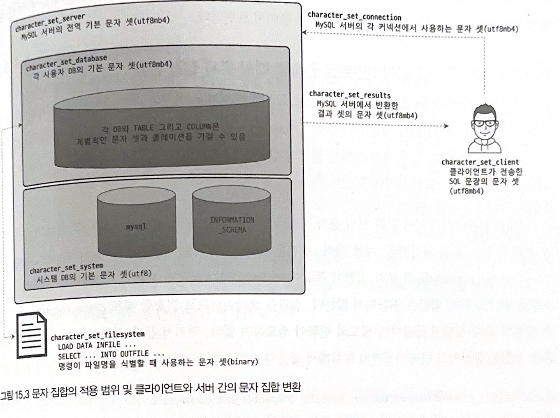

# 15.  데이터 타입

## 15.1 문자열(CHAR 와 VARCHAR)

문자열 칼럼을 사용할 때 `CHAR`, `VARCHAR` 타입 중 어떤 타입을 사용할지 결정 필요. 

저장 공간과 비교 방식의 관점, MySQL 내부적인 차이를 확인

### 15.1.1 저장 공간

|  | CHAR | VARCHAR |
| --- | --- | --- |
| 공통점 | 문자열 데이터 타입
한 글자 저장 시, 문자 집합에 따라 1~4B 저장 공간 사용 | 문자열 데이터 타입
한 글자 저장 시, 문자 집합에 따라 1~4B 저장 공간 사용 |
| 차이점 | 고정 길이
저장 공간의 크기가 고정이므로 추가 공간 필요 없음 | 가변 길이
최대 저장 길이 제한. 저장 공간은 가변적이므로 1~2B의 추가 저장 공간 필요
varchar 타입의 문자열 길이가 255B 이하면 1B, 256B 이상이면 2B 추가 저장 공간 필요 |
- 일반적으로 문자열 값의 길이가 일정하면 `CHAR`, 가변적이면 `VARCHAR` 사용이 일반적
- 중요한 판단 기준은 `저장되는 문자열의 길이가 대개 비슷한가?`, `칼럼의 값이 자주 변경되는가?` 를 고려해야 함
    - abcd 값 저장
        - char (10) ⇒ abcdㅁㅁㅁㅁㅁㅁ 로 구성(ㅁ은 공백을 의미)
        - varchar(10) ⇒ 4abcd 로 구성(4는 길이 저장용 공간이고, 유효 바이트 숫자)
    - abce → abcde 로 수정
        - char (10) ⇒ abcdeㅁㅁㅁㅁㅁ 로 업데이트하면 끝
        - varchar(10) ⇒ 공간이 없기 때문에 레코드 자체를 다른 공간으로 옮겨서 저장
    - 주민등록번호처럼 항상 값이 고정적인 경우, 2~3B 씩 차이나더라도 자주 변경될 수 있는 상태 값 등은 `char` 타입 사용
    → 자주 변경돼도 레코드가 `물리적으로 다른 위치로 이동하거나 분리되지 않아도 되기 때문`
- `MySQL 에서 CHAR, VARCHAR 뒤의 숫자는 문자의 수를 의미`
    - 일반 DBMS CHAR(10), VARCHAR(10) = 10 바이트 저장 공간
    - MySQL CHAR(10), VARCHAR(10) = 10 글자(문자) 저장 공간
        - 영어 포함 서구권 언어는 문자 당 1B 사용 = CHAR(10), VARCHAR(10) = 10B
        - 한글, 일어 등 아시아권  언어는 문자 당 2B 사용 = CHAR(10), VARCHAR(10) = 20B
        - UTF-8 같은 유니코드 언어는 문자 당 4B 사용 = CHAR(10), VARCHAR(10) = 40B
    

### 15.1.2 저장 공간과 스키마 변경(Online DDL)

### 15.1.3 문자 집합(캐릭터 셋)

- 한글 기반의 서비스에서는 `euckr`, `utf8mb4` 문자 집합 사용
- DB에서 다국어 지원 가능하도록 `NCHAR`, `National CHAR` 칼럼 타입 정의
    - MySQL 에서 nchar 타입 사용 시 UTF-8 문자 집합 사용하는 char 타입으로 생성
- MySQL 서버에서 사용 가능한 문자 집합은 `show character set;` 으로 확인
    - euckr 은 한국어 전용 문자 집합. 모든 글자 1~2B 사용
    - utf8mb4 은 다국어 문자 포함하는 칼럼에 사용하기 적합. 한 글자 저장 시 1~4B 사용
- MySQL의 문자 집합 설정 시스템 변수
    
    
    
    - `charcter_set_system` : MySQL 서버가 식별자를 저장할 때 사용하는 문자 집합. 기본 utf8mb4
    - `character_set_server` : MySQL 서버의 기본 문자 집합.기본 utf8mb4
    - `character_set_database` : MySQL DB의 기본 문자 집합.기본 utf8mb4
    - `character_set_filesystem` : load data infile … or select … into outfile 문장 실행 시 인자로 지정되는 파일의 이름을 해석할 때 사용하는 문자 집합
    - `character_set_client` : MySQL 클라이언트가 보낸 SQL 문장은 해당 시스템 변수에 설정된 문자 집합으로 인코딩해서 MySQL 서버로 저송. 기본 utf8mb4
    - `character_set_connection` : MySQL 서버가 클라이언트로부터 전달받은 SQL 문장을 처리하기 위해 해당 시스템 변수의 문자 집합을 변환. 기본 utf8mb4
    - `character_set_result` : MySQL 서버가 쿼리의 처리 결과를 클라이언트로 보낼 때 사용하는 문자 집합을 설정하는 시스템 변수. 기본 utf8mb4
    

### 15.1.4 콜레이션

콜레이션은 문자열 칼럼의 값에 대한 비교나 정렬 순서를 위한 규칙을 의미. MySQL 의 모든 문자열 타입의 칼럼은 독립적인 문자 집합과 콜레이션을 가짐

**15.1.4.1 콜레이션의 이해**

- 문자 집합은 2개 이상의 콜레이션을 가짐
- 하나의 문자 집합에 속한 콜레이션은 다른 문자 집합과 공유 불가
- `show collation` 명령으로 사용 가능한 콜레이션 목록 조회 가능
- 일반적으로 `콜레이션의 이름은 2~3개의 파트로 구분`
    - 3개의 파트로 구성된 콜레이션 이름
        - 1번째 파트 : 문자 집합의 이름
        - 2번째 파트 : 해당 문자 집합의 하위 분류
        - 3번째 파트 : 대문자나 소문자 구분 여부. `ci` 대소문자 구분 x, `cs` 대소문자 구분 o
        - ex) utf8mb4_general_ci, utf8mb4_0900_cs …
    - 2개의 파트로 구성된 콜레이션 이름
        - 1번째 파트 : 문자 집합의 이름
        - 2번째 파트: 항상 `bin` 키워드 사용. bin 은 이진 데이터 의미. 실제 문자 데이터의 바이트 값으로 정렬 수행
    
    ```sql
    mysql> show collation;
    +-----------------------------+----------+-----+---------+----------+---------+---------------+
    | Collation                   | Charset  | Id  | Default | Compiled | Sortlen | Pad_attribute |
    +-----------------------------+----------+-----+---------+----------+---------+---------------+
    | utf8mb4_0900_ai_ci          | utf8mb4  | 255 | Yes     | Yes      |       0 | NO PAD        |
    | utf8mb4_0900_as_ci          | utf8mb4  | 305 |         | Yes      |       0 | NO PAD        |
    | utf8mb4_0900_as_cs          | utf8mb4  | 278 |         | Yes      |       0 | NO PAD        |
    | utf8mb4_0900_bin            | utf8mb4  | 309 |         | Yes      |       1 | NO PAD        |
    | utf8mb4_bg_0900_ai_ci       | utf8mb4  | 318 |         | Yes      |       0 | NO PAD        |
    | utf8mb4_bg_0900_as_cs       | utf8mb4  | 319 |         | Yes      |       0 | NO PAD        |
    | utf8mb4_bin                 | utf8mb4  |  46 |         | Yes      |       1 | PAD SPACE     |
    | utf8mb4_bs_0900_ai_ci       | utf8mb4  | 316 |         | Yes      |       0 | NO PAD        |
    | utf8mb4_bs_0900_as_cs       | utf8mb4  | 317 |         | Yes      |       0 | NO PAD        |
    | utf8mb4_croatian_ci         | utf8mb4  | 245 |         | Yes      |       8 | PAD SPACE     |
    | utf8mb4_cs_0900_ai_ci       | utf8mb4  | 266 |         | Yes      |       0 | NO PAD        |
    ```
    
- 문자열 칼럼의 정렬이나 비교는 항상 문자열 칼럼의 콜레이션에 의해 판단
→ 문자열 칼럼에서 char, varchar 같은 타입의 이름과 길이만 같다고 해서 똑같은 타입이라고 판단 x

**15.1.4.2 utf8mb4 문자 집합의 콜레이션**

- MySQL 8.0 ~ `utf8mb4_0900_ai_ci` 콜레이션을 기본 사용을 권장
→ 범용 프로그램으로 사용할 콜레이션으로 적합
- utf8mb4_0900_ai_ci : 언어 비종속적인 콜레이션이고, 문자 셋의 기본 정렬 순서에 의해 정렬 및 비교가 수행 됨

### 15.1.5 비교 방식

- `utf8mb4_bin` 콜레이션은 문자열 뒤의 공백은 비교에 영향을 미치지 않음
- `utf8mb4_0900_bin` 콜레이션은 문자열 뒤의 공백이 비교 결과에 영향을 미침
- MySQL 서버에서 지원하는 대부분 콜레이션은 `PAD SAPCE` 이며, 비교 대상 문자열의 길이가 같아지도록 문자열 뒤에 공백을 추가해서 비교를 수행
- `utf8mb4_0900` 으로 시작하는 콜레이션은 `NO PAD`

## 15.2 숫자

- 숫자를 저장하는 타입은 값의 `정확도에 따라 참값, 근삿값으로 구분`
    - `참값`
        - 소수점 이하 값의 유무와 관계없이 정확히 그 값을 그대로 유지하는 것
        - INTEGER 포함해 INT 로 끝나는 타입, DECIMAL
    - `근삿값`
        - 부동 소수점이라고 불리는 값을 의미
        - FLOAT, DOUBLE
- 값이 저장되는 포맷에 따라 `십진 표기법`, `이진 표기법` 으로 구분
    - 이진 표기법
        - 프로그래밍 언어에서 사용하는 정수, 실수 타입
        - 256까지의 숫자 표현 가능
        - INTEGER, BIGINT
    - 십진 표기법
        - 숫자 값의 각 자릿값을 표현하기 위해 4비트나 한 바이트를 사용해서 표기하는 방법
        - 디스크나 메모리에 십진 표기법으로 저장된다는 것을 의미
        - DECIMAL
- MySQL 에서 FLOAT, DOUBLE, DECIMAL 타입은 잘 사용하지 않음
- INTEGER, BIGINT 타입 자주 사용

### 15.2.1 정수

- DECIMAL 타입을 제외하고 정수를 저장하는데 사용할 수 있는 데이터 타입은 `TINYINT`, `SMALLINT`, `MEDIUMINT`, `INT`, `BIGINT` 5가지로 구분
- 기본적으로 음수와 양수를 동시에 저장 하는 숫자 타입(SIGNED)
- AUTO_INCREMENT 칼럼 같이 양수만 저장되야 하는 칼럼에는 UNSIGNED 타입 명시

### 15.2.2 부동 소수점

- MySQL 에서 부동 소수점 저장하기 위해 FLOAT, DOUBLE 타입 사용
- FLOAT 타입의 부동은 소수점의 위치가 고정적이지 않다는 의미
    - 숫자 값의 길이에 따라 유효 범위의 소수점 자릿수가 변경됨
    - 근삿값 저장 방식이라 동등 비교 불가