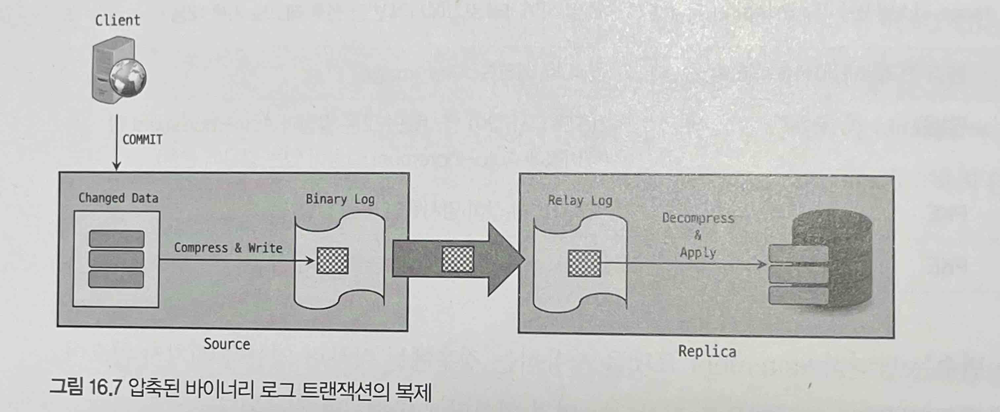

# 16장 복제

## 16.4 복제 데이터 포맷

- 바이너리 로그 이벤트가 어떤 포맷으로 기록되는지는 복제가 처리되는 과정에도 영향을 준다.
- 레플리카 서버가 소스 서버의 바이너리 로그 이벤트를 내부적으로 가공하지 않고 가져온 그대로 실행해 자신의 데이터에 적용하므로 복제에서 어떤 바이너리 로그 포맷을 사용하느냐는 중요한 부분이다.
- MySQL에서는 실행된 SQL문을 바이너리 로그에 기록하는 Statement 방식과 변경된 데이터 자체를 기록하는 Row 방식으로 두 종류의 바이너리 로그 포맷을 제공한다. (혼합된 형태도 가능)

### 16.4.1 Statement 기반 바이너리 로그 포맷

- 변경 이벤트에 대해 이벤트를 발생시킨 SQL문을 바이너리 로그에 기록하는 방식
- SQL 문이 그대로 바이너리 로그에 저장되어있다.
- 하나의 SQL 문은 여러개의 데이터를 수정할 수 있는데 Statement 포맷에서는 바이너리 로그에 SQL문 하나만 기록된다. 이렇게 되면 바이너리 로그 파일의 용량이 작아지므로 사용자 입장에서는 저장 공간에 대한 부담을 덜 수 있으며, 원격으로 바이너리 로그를 백업하거나 혹은 원격에 위치한 레플리카 서버와 복제할 때도 좀 더 빠르게 처리될 수 있다.
- 몇가지 단점들도 있는데 대표적인 단점은 비확정적으로 처리될 수 있는 쿼리가 실행된 경우 소스서버와 레플리카 서버간에 데이터가 달라질 수 있는 점이다. (`p470` 참고)
- 또 다른 단점은 Row 포맷으로 복제될 때보다 데이터에 락을 더 많이 건다는 것이다. `(INSERT.. SELECT` 등)
- 한 가지 제한사항이 있는데, 바로 트랜잭션 격리 수준이 반드시 `REFEATABLE-READ` 이상이어야 한다는 점.

### 16.4.2 Row 기반 바이너리 로그 포맷

- 서버에서 데이터 변경이 발생했을 때 변경된 값 자체가 바이너리 로그에 기록되는 방식
- 어떤 형태의 쿼리가 실행됐든 간에 복제 소스 서버와 레플리카 서버의 데이터를 일관되게 하는 가장 안전한 방식
- Statement 포맷보다 락이 최소화되어 처리된다. 레플리카 서버에서도 쿼리가 실행되는 것이 아니라 변경된 데이터가 바로 적용되므로 어떤 변경 이벤트건 더 적은 락을 점유하며 처리된다.
- 변경된 데이터가 바이너리 로그에 저장되므로, 실행된 쿼리가 굉장히 많은 데이터를 변경한 경우에는 변경된 데이터가 전부 기록되므로 바이너리 로그 파일의 크기가 단기간에 매우 커질 수 있다.

### 16.4.3 Mixed 포맷

- 두가지 바이너리 로그 포맷을 혼합해서 사용하도록 설정할 수 있다.
- `binlog_format` 시스템 변수를 `MIXED` 로 지정하면 된다.
- 기본적으로 Statement 포맷으로 저장되고, Statement 포맷으로 기록되어 복제될 때 문제가 될 경우 Row 포맷으로 변환되어 기록된다.
- 스토리지 엔진별 지원하는 바이너리 로그포맷의 종류 (`p472` 표 참조)
- Statement 포맷과 Row 포맷의 장점만 섞어 놓은 것 같지만 예상과 다르게 동작 할수 있으므로, 사용자가 적합한 방식을 설정하는것이 중요하다.

### 16.4.4 Row 포맷의 용량 최적화

**16.4.4.1 바이너리 로그 Row 이미지**

- Row 포맷의 바이너리 로그 파일 용량을 최소화하기 위해 저장되는 변경 데이터의 칼럼 구성을 제어하는 `binlog_row_image` 시스템 변수를 제공한다.
- Row 포맷을 사용할 경우 바이너리 로그에는 각 변경 데이터마다 변경전 레코드와 변경 후 레코드가 함께 저장되는데 `binlog_row_image` 시스템 변수는 각 변경 전후 레코드들에 대해 테이블의 어떤 칼럼들을 기록할 것인지를 결정한다. 다음 3가지 옵션이 있다.
    - `full` : 특정 칼럼에서만의 변경 여부와 관계없이 변경이 발생한 레코드의 모든 칼럼들의 값을 바이너리 로그에 기록
    - `minimal` : 변경 데이터에 대해 꼭 필요한 칼럼들의 값만 바이너리 로그에 기록
    - `noblob` : full 옵션과 동일하게 동작하지만 BLOB 이나 TEXT 칼럼에 대해 변경하지 않은 경우 해당 칼럼들은 바이너리 로그 파일에 기록하지 않는다.
- `minimal` 일 경우 PKE (Primary Key Equivalent) 를 통해 처리된다. (`p474`)

16.4.4.2 바이너리 로그 트랜잭션 압축

- 바이너리 로그 포맷을 Row 로 사용중인 상태에서 Row 이미지를 조정했다고 하더라도 유입되는 DML 쿼리의 양이 많은 MySQL 서버에서는 바이너리 로그 파일의 크기가 커질 수밖에 없다.
- 안정적인 복제나 신규 레플리카 서버 구축등을 위해서는 바이너리 로그 파일 보관 주기를 더 짧게 설정하고 압축한다 해도 한계가 있다.
- 8.0.20 버전부터 Row 포맷으로 기록되는 트랜잭션에 대해 트랜잭션에서 변경한 데이터를 압축해서 바이너리 로그에 기록할 수 있게 하는 기능이 도입됐다.
- 기존과 동일한 바이너리 로그 보관주기 유지 + 디스크 공간 절약 + 대역폭 사용량 절약 이 가능하게 됐다.
    
    
    

- `binlog_transaction_compression` 시스템 변수를 통해 압축 기능을 활성화할 수 있다.
- `binlog_transaction_compression_level_zstd` 시스템 변수를 통해 zstd 알고리즘 레벨을 설정할 수 있다.
    - 압축 레벨이 높을수록 압축률 및 디스크 저장공간 네트워크 대역폭에서 이점이 있지만, CPU와 메모리 사용량이 늘어나고 처리 시간이 증가할 수 있다.
    - 압축 레벨이 높다고해서 반드시 압축률이 좋아지는 것은 아니다.
- 바이너리 로그 트랜잭션 압축이 모든 경우에 대해 압축을 적용하는 것은 아니다.
- 압축된 트랜잭션 데이터는 트랜잭션의 개별 이벤트들의 내용이 어떤 것인지 실제로 확인이 필요할 때 압축이 해제된다.
- mysqlbinlog 를 통해 압축된 트랜잭션 데이터에 대해 압축된 크기와 압축되지 않은 크기를 나타내느 설명과 사용된 압축 알고리즘을 확인할 수 있다. (`p478` )
- Performance 스키마의 `binary_log_transaction_compression_stats` 통해 압축된 트랜잭션들의 통계 정보와 압축 성능을 확인할 수 있다. (`p479`)
    - `LOG_TYPE` 칼럼을 통해 로그 파일 종류를 확인할 수 있다.
    - `COMPRESSION_TYPE` 칼럼을 통해 압축 여부 및 압축에 사용된 알고리즘을 확인할 수 있다.
    - 각 통계 정보에는 수집 시작 시점부터 지금까지 기록된 트랜잭션 수와 총 크기, 압축률 첫번째와 마지막으로 기록된 트랜잭션에 대한 부가적인 정보들이 포함되어 있다.
- 트랜잭션의 압축 및 압축 해제에 소요된 시간도 확인 할 수 있는데 아래 UPDATE 문을 통해 Performance 스키마의 설정을 변경해야 한다.
    
    ```sql
    // 변경 이후부터 수집되므로 압축 전에 미리 설정해야 한다.
    UPDATE performance_schema.setup_instruments
    SET ENABLED='YES', TIMED='YES'
    WHERE NAME IN ('stage/sql/Compressing transaction changes.',
    							 'stage/Decompressing transaction changes, ');
    ```
    
    
    
    50만건 데이터를 저장하는 경우
    
    
    
    압축레벨이 잘 적용되는지 의문 ? (Default인 LEVEL=3으로 지정해도 무방해 보인다.
    
- 압축 기능 사용 여부에 따른 소요 시간 및 평균 CPU 사용률
    
    
    | 압축 사용 여부 | 총 소요시간(초) | 평균 CPU 사용률(%) |
    | --- | --- | --- |
    | 미사용 | 39.63 | 12.33 |
    | 사용 | 47.71 | 12.44 |
- 압축기능을 사용시 오버헤드로 인해 쿼리 지연 및 서버 자원을 더 소모하게 되므로 압축 기능을 사용하고자 할 때는 리소스 사용률 현황과 쿼리 응답 속도 등을 파악하여 압축 사용여부를 결정하는 것이 좋다.

## 16.5 복제 동기화 방식

### 16.5.1 비동기 복제(Asynchronous replication)

- MySQL 복제는 기본적으로 비동기 방식으로 동작한다.
- 비동기 방식이란 소스 서버가 자신과 복제 연결된 레플리카 서버에서 변경 이벤트가 정상적으로 전달되어 적용됐는지를 확인하지 않는 방식


- 동작방식
    1. 소스 서버 커밋 & 바이너리 로그에 기록
    2. 레플리카 서버에서 신규 트랜잭션에 대한 바이너리 로그를 소스서버에 요청
    3. 릴레이 로그에 기록
- 단점
    - 소스서버에 장애가 발생했을때 레플리카 서버에 적용되지 못한 트랜잭션을 직접 확인 및 수동 적용해야함
- 장점
    - 소스서버에서 레플리카 서버로 전송되는 부분을 고려하지 않기 때문에 성능이 빠르다.
    - 레플리카 서버에서 문제가 생기더라도 소스서버는 영향을 받지 않는다.

### 16.5.2 반동기 복제(Semi-synchronous replication)

- 비동기보다 향상된 무결성을 제공하는 복제 동기화 방식
- 소스 서버는 레플리카 서버가 소스 서버로부터 전달받은 변경 이벤트를 릴레이 로그에 기록 후 응답(ACK) 을 보내면 그 때 트랜잭션을 완전히 커밋시키고 클라이언트에 결과를 반환.
- 레플리카 서버에 전송 이후 트랜잭션이 커밋되므로, 레플리카 서버로의 `전송`을 보장한다.
하지만 `전송`을 보장하는 것이지 `적용`까지 보장하는 것은 아니다. (그래서 반동기)
- `rpl_semi_sync_master_wait_point` 시스템 변수로 소스 서버가 레플리카 서버의 응답을 기다리는 지점을 제어할 수 있다.
    - `AFTER_SYNC` : 트랜잭션을 바이너리 로그에 기록하고 난 후 커밋 전 단계에서 응답을 기다림
    레플리카 서버로 부터 정상적으로 응답이 내려오면 소스서버는 그때 커밋 후 트랜잭션을 완전히 끝난 후 결과를 반환한다. 8.0의 기본값이다.
        
        
        
    - `AFTER_COMMIT` : 스토리지 엔진에 커밋까지 진행 한후 레플리카서버의 응답을 기다린 후 클라이언트에 결과를 반환한다.
        
        
        
    - `AFTER SYNC` 방식의 장점
        - 소스 서버에 장애가 발생했을떄 팬텀 리드가 발생하지 않음 (`p489`)
        - 장애가 발생한 소스 서버에 대해 좀 더 수월하게 복구 처리가 가능
- 레플리카 서버의 응답을 기다리므로, 비동기 방식과 비교했을때 처리 속도가 느릴 수 있다.
- 응답시간에 대한 타임아웃 설정을 할 수 있으며 레플리카 응답이 없을 경우 비동기로 전환된다.

**16.5.2.1 반동기 복제 설정 방법**

- 플러그인 설치
    
    ```sql
    -- 소스 서버 
    INSTALL PLUGIN rpl_semi_sync_master SONAME 'semisync_master.so';
    
    -- 레플리카 서버
    INSTALL PLUGIN rpl_semi_sync_slave SONAME 'semisync_slave.so';
    ```
    
- 플러그인 설치 후 시스템 변수를 설정해야 한다.
    - `rpl_semi_sync_master_enabled` : 소스 서버에서 반동기 복제의 활성화 여부를 제어한다. ON(1) 또는 OFF (0)로 설정 가능하다.
    - `rpl_semi_sync_master_timeout` : 소스 서버에서 레플리카 서버의 응답이 올 때까지 대기하는 시간으로, 밀리초 단위로 설정할 수 있다. 소스 서버는 이 변수에 지정된 시간만큼 레플리카 서버의 응답을 기다렸다가 만약 지정된 시간이 초과할 때까지 응답이 오지 않 으면 비동기 복제로 전환된다. 기본값은 10000(10초)이다.
    - `rpl send_ sync_master_trace_level` : 소스 서버에서 반동기 북제에 대해 디버깅 시 어느 정도 수준으로 디버그 로그가 출력되게 할 것인지 디버링 추적을 지정하는 설정으로, 1, 16, 32, 64 값으로 설정 가능하다.
    - `rlp_semi_sync_master_wait_for_slave_count` : 소스 서버에서 반드시 응답을 받아야 하는 레플리카 수를 결정한다. 기본값은 10며, 최대 65533까지 설정 가능하다. 응답을 받이야 하는 레플리가 수가 않을수록 소스 서버에서의 처리 성능은 저하될 수 있다.
    - `rpl_semi_sync_master_wait_no_slave :`rpl_send_sync_master_timeout에 지정된 시간 동안 소스 서버에서 반동기 복제로 연결된 레플리카 서버 수가 `rpl_semi_sync_master_wait_for_slave_count`에 지정된 수보다 적어졌을 때 어떻게 처리할 것인지를 결정하는 변수로, ON(1)이면 레플리카 수가 적어지더라도 타임아웃 시간 동안 반동기 복제를 그대로 유지한다. OFF(0)로 설 정된 경우에는 레플리카 수가 적어지는 즉시 비동기 복제로 전환된다. 기본값은 ON이다. 소스 서버에 반동기 복제로 연결된 레플리카 서버 수는 SHOW GLOBAL STATUS 명령문의 결과에서 rpl_semi_sync_master_clients 상태 변수 를 통해 확인할 수 있다.
    - `rpl_semi_syne_master_wait_point :`소스 서버가 트랜잭션 처리 단계 중 레플리카 서버의 응답을 대기하는 지점을 설정하는 옵션이다. AFTER SYNC와 ATER COMIT 값으로 설정 가능하며, 기본값은 AFTER_ SYNC다.
    - `rpl_semi_sync_slave_enabled :`레플리카 서버에서 반동기 복제의 활성화 여부를 제어한다. ON(1) 또는 OFF (0)로 설정 가능하다.
    - `rpl_semi_sync_slave_trace_level :`레플리카 서버에서 반동기 복제에 대해 디버깅 시 어느 정도 수준으로 디버그 로그가 출력되게 할 것인지를 지정하 는 디버깅 추적 레벨에 대한 설정으로, 1, 16, 32, 64 값으로 설정 가능하다.

## 16.6 복제 토폴로지

### 16.6.1 싱글 레플리카 복제 구성


- 하나의 소스 서버에 하나의 레플리카 서버만 연결돼 있는 복제 형태를 말한다.
- 가장 기본적이고 제일 많이 사용되는 형태
- 레플리카 서버는 예비서버 및 데이터 백업 수행을 위한 용도로 많이 사용된다.

### 16.6.2 멀티 레플리카 복제 구성


- 하나의 소스 서버에 2개 이상의 레플리카 서버를 연결한 복제 형태
- 싱글 레플리카 구성에서 추가적인 용도를 위해 여분의 레플리카 서버가 더 필요해졌을때 자주 사용
- 서비스의 트래픽이 크게 증가했을때 레플리카 서버를 통해 읽기 요청처리를 분산할 수 있다.
- 레플리카 서버가 애플리케이션 읽기 요청을 처리할 경우 그 중요도가 매우 높아지기 때문에 별도의 백업 레플리카 서버를 구성해 두는 것이 좋다.

### 16.6.2 체인 복제 구성


- 멀티 레플리카 복제 구성에서 레플리카 서버가 너무 많아 소스 서버의 성능에 악영향이 예상된다면 1:M:M 구조의 체인 복제 구성을 고려해 볼 수 있다.
- MySQL 복제에서 소스 서버는 레플리카 서버가 요청할 때마다 계속 바이너리 로그를 읽어서 전달해야 한다. 그래서 만약 하나의 소스 서버에 연결된 레플리카 서버 수가 많다면 바이너리 로그를 읽고 전달 하는 작업 자체가 부하가 될 수도 있다. 이럴 때는 그림 16.15의 레플리카 서버 1-3/소스 서버 2 장 비와 같이 소스 서버가 해야 할 바이너리 로그 배포 역할을 새로운 MySOL 서버로 넘길 수 있다. 그림 16.15에서 소스 서버를 기준으로 1차 보제 그룹에는 "레플리카 서버 1-1, 레플리카 서버 1-2, 레플리카 서버 1-3/소스 서버 2" MySOL 서버가 연결돼 있다. 그리고 2차 복제 그룹에는 '레플리카 서버2-1, 레플리카 서버 2-2가 연결돼 있다. 1차 복제 그룹은 "소스 서버 1"과 직접 연결돼 있는 만 큼 소스 서버의 변경이 빠르게 적용될 것이므로 OLTP 서비스 용도로 사용하고, 2차 복제 그룹은 통계 나 배치. 백업 용도로 구분해서 사용할 수 있다.
- 또한 이 복제 형태는 MySOL 서버를 업그레이드하거나 장비를 일괄 교체할 때도 많이 사용된다. 기 존 장비의 MySOL은 그대로 두고, 새로운 장비에 업그레이드한 MySOL을 설치하고 데이터를 신규 장 비로 옮기는 형태의 업그레이드는 이 복제 구조로 서비스의 멈춤 없이 진행할 수 있다. "소스 서버 1
과 "'레플리카 서버 1-1% 레플리카 서버 1-2'는 기존 버전의 MySOL. 서버이고, "레플리카 서버 1-31 소스 서버 2°와 레플리카 서버 2-1". 레플리카 서버 2-2” 서버가 새로이 업그레이드하려는 버전의 MysQL이라고 보면 된다.

### 16.6.4 듀얼 소스 복제 구성


- 서로 소스 서버이자 레플리카 서버로 구성돼 있는 형태를 말한다.
- 듀얼 소스 구성은 두 MySQL 서버 모두 쓰기가 가능하다는 것이 제일 큰 특징이다.
- 각 서버에서 변경한 데이터는 복제를 통해 다시 각 서버에 적용되므로 양쪽에서 쓰기가 발생하지만 두 서버는 서로 동일한 데이터를 갖게 된다.
- ACTIVE-ACTIVE, ACTIVE-PASSIVE 형태로 사용 가능
- 다음과 같은 부분에서 문제가 발생할 수 있으므로 주의해야 한다.
    - 동일한 데이터를 각 서버에서 변경
    - 테이블에서 Auto-Increment 키 사용

> 듀얼 소스 구성을 포함해서 멀티 소스 복제 구성이 쓰기 처리량 향상에 도움이 될 것으로 생각하지만,
모든 소스서버들은 다른 소스 서버 변경 내용을 복제를 통해 자신에게도 똑같이 실행해야 하기 때문에 효과가 크지 않다. 여러 소스 서버에서 변경이 발생하면서 트랜잭션 충돌로 인해 여러가지 문제가 발생한다.
따라서 쓰기 성능 확장이 필요하다면 데이터베이스 서버를 샤딩하는 방법을 권장한다.
> 

### 16.6.5 멀티 소스 복제 구성


- 하나의 레플리카 서버가 둘 이상의 소스 서버를 갖는 형태
- 멀티 소스 복제 구성의 목적
    - 여러 MySQL 서버에 존재하는 각기 다른 데이터를 하나의 MySQL 서버로 통합
    - 여러 MySQL 서버에 샤딩돼 있는 테이블 데이터를 하나의 테이블로 통합
    - 여러 MySQL 서버의 데이터들을 모아 하나의 MySQL 서버에서 백업을 수행
- 충돌에 대한 고려가 필요하고, 대체 서버로 사용하기는 부적합하다.

**16.6.5.1 멀티 소스 복제 동작**


- 멀티 소스 복제에서 레플리카 서버는 자신과 연결된 소스 서버들의 변경 이벤트들을 동시점에, 병렬로 동기화 한다.
- 이는 각 소스 서버들에 대한 복제가 독립적으로 처리되는 것을 의미하며, 각각의 독립된 복제 처리를 채널이라고 한다.
    
    ```sql
    -- FOR CHANNEL 명령어를 통해 각 채널에 대한 명령을 사용할 수 있다.
    -- START, STOP, SHOW, FLUSH 의 경우 채널명을 명시하지 않을시 전체 채널이 대상이 된다.
    CHANGE (REPLICATION SOURCE | MASTER] TO ...FOR CHANNEL ["channel_name"]
    START (REPLICA | SLAVE] [IO_THREAD | SQL_THREAD] FOR CHANNEL ["channel_name"]
    STOP (REPLICA | SLAVE] [IO_THREAD | SQL_THREAD] FOR CHANNEL ["channel_name"]
    RESET (REPLICA | SLAVE] FOR CHANNEL ("channel _name")
    SHOW (REPLICA | SLAVE] STATUS FOR CHANNEL ("channel_name"]
    FLUSH RELAY LOGS FOR CHANNEL ("channel _name")
    SHOW RELAY LOG EVENTS FOR CHANNEL ["channel _name"]
    ```
    

**16.6.5.2 멀티 소스 복제 구축**

- 멀티 소스 복제라고 해서 기존의 단일 소스 복제와 달리 구축하는 과정에 큰 차이가 있는 것은 아니다.
- 다음과 같은 경우가 있을 수 있다.
    - 멀티 소스 서버와 레플리카 서버 모두 데이터가 없는 상태 → 연결만 하면된다.
    - 멀티 소스 서버중 한 서버만 데이터를 가지고 있는 상태 → 해당 서버만 레플리카 서버에 복구
    - **멀티 소스 서버중 두 서버 이상에서 데이터를 가지고 있는 상태 → 충돌과 병합을 고려**
- 두 서버 이상에서 데이터를 가지고 있는 경우 아래 2가지 도구를 적절히 혼합하여 백업한다.
    - mysqldump와 같은 논리 수준의 백업 도구를 이용 (주로 데이터가 작을 경우)
    - XtraBackup과 같은 물리 수준의 백업 도구 이용 (데이터가 큰 경우)
- 소스서버 A, B 레플리카 서버 C 인 경우
    1. 소스서버 A,B 의 데이터 백업 후 C 서버로 가져옴
    2. 데이터 백업 시점을 바탕으로 멀티 소스 복제 구성
        1. ❗️❗️ 복제 연결 전, `master_info_repository`, `relay_log_info_repository` 시스템 변수들이 반드시 `TABLE`로 설정돼 있어야 한다.
            
            ```sql
            SHOW GLOBAL VARIABLES LIKE '%repository%';
            
            +-------------------------+-----+
            |Variable_name            |Value|
            +-------------------------+-----+
            |master_info_repository   |FILE |
            |relay_log_info_repository|FILE |
            +-------------------------+-----+
            
            SET GLOBAL master_info_repository='TABLE';
            SET GLOBAL relay_log_info_repository='TABLE';
            ```
            
        2. 바이너리 로그 위치 기반 복제 `p508~p510`
            1. `CHANGE REPLICATION SOURCE TO`  명령어로 복제 연결
            2. `START REPLICA`  명령어로 복제 시작
            3. `SHOW REPLICA STATUS` 명령어로 복제 상태 확인
        3.  GTID 기반 복제 p`510~p514`
            1. `SET GLOBAL gtid_purged` 명령어로 각 소스 서버의 gtid 쉼표(,) 로 구분하여 나열
            2. 나머지 과정은 상동