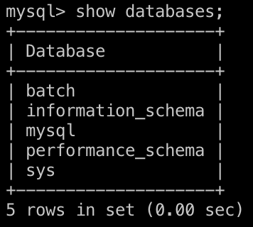
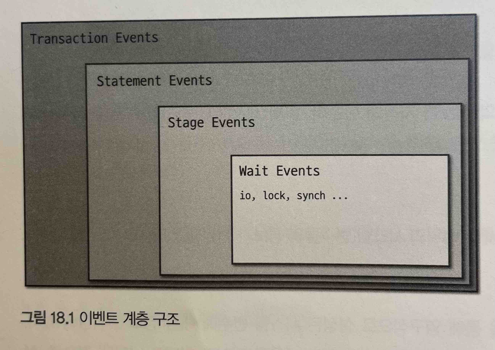

# 18장 Performance 스키마 & Sys 스키마

- MySQL 에서는  사용자가 데이터베이스 상태를 좀 더 수월하게 할 수 있게 MySQL 내부에서 발생하는 이벤트에 대한 상세한 정보를 수집해서 한 곳에 모아 사용자들이 손쉽게 접근해서 확인할 수 있게하는 기능을 제공한다. 이러한 기능이 바로 Performance 스키마와 Sys 스키마 이다.

## 18.1 Performance 스키마란

- MySQL 서버가 기본적으로 제공하는 시스템 베이스 중 하나 이다.
    
    
    
- Performance 스키마에는 MySQL 서버 내부 동작 및 쿼리 처리와 관련된 세부 정보들이 저장되는 테이블이 존재하며, 사용자는 이러한 테이블들을 통해 MySQL 서버의 성능을 분석하고 내부 처리 과정 등을 모니터링 할 수 있다.
- Performance 스키마에 저장되는 데이터들은 MySQL 서버 소스코드 곳곳에 존재하는 성능 측정 코드로부터 수집된다. 이는 Performance 스키마 전용 `PERFORMANCE_SCHEMA` 스토리지 엔진에 의해 수행된다.
- `PERFORMANCE_SCHEMA` 스토리지 엔진은 MySQL 서버가 동작 중인 상태에서 실시간으로 정보를 수집하며, 수집한 정보를 디스크가 아닌 메모리에 저장한다.
- Performance 스키마가 활성화된 MySQL 서버는 비활성화 서버보다 리소스를 좀 더 소모한다.
- 설정을 통해 수집가능한 전체 데이터가 아닌 특정 이벤트에 대한 데이터들만 수집하도록 설정하여 오버헤드를 줄일 수 있다.

## 18.2 Performance 스키마 구성

- Performance 스키마는 크게 두가지로 분류하면 설정과 관련된 테이블, 수집한 데이터가 저장되는 테이블로 나눌 수 있다.

### 18.2.1 Setup 테이블

- Setup 테이블에는 Performance 스키마의 데이터 수집 및 저장과 관련된 설정 정보가 저장돼 있으며, 사용자는 이 테이블을 통해 Performance 스키마의 설정을 동적으로 변경할 수 있다.

| 테이블 | 설명 |
| --- | --- |
| setup_actors | 모니터링하며 데이터를 수집할 대상 유저 목록 |
| setup_consumers | 얼마나 상세한 수준으로 데이터를 수집하고 저장할 것인지를 결정하는 데이터 저장 레벨 설정 |
| setup_instruments | 데이터를 수집할 수 있는 MySQL 내부 객체들의 클래스 목록과 클래스별 데이터 수집 여부 설정 |
| setup_objects | 모니터링하며 데이터를 수집할 대상 데이터베이스 객체(프로시저, 테이블, 트리거 등과 같은) 목록이 저장 |
| setup_threads | 모니터링하며 데이터를 수집할 수 있는 MySQL 내부 스레드들의 목록과 스레드별 데이터 수집 여부 설정이 저장돼 있다. |

### 18.2.2 Instance 테이블

- Instance 테이블들은 Performance 스키마가 데이터를 수집하는 대상인 실체화된 객체들, 즉 인스턴스들에 대한 정보를 제공하며, 인스턴스 종류별로 테이블이 구분 돼 있다.

| 테이블 | 설명 |
| --- | --- |
| cond_instances | 현재 MySQL 서버에서 동작 중인 스레드들이 대기하는 조건(Condition) 인스턴스들의 목록을 확인할 수 있다. 조건 은 스레드 간 동기화 처리와 관련해 특정 이벤트가 발생했음을 알리기 위해 사용되는 것으로, 스레드들은 자신들이 기다리고 있는 조건이 참이 되면 작업을 재개한다. |
| file instances | 현재 MySQL 서버가 열어서 사용 중인 파일들의 목록을 확인할 수 있다. 사용하던 파일이 삭제되면 이 테이블에서도 데이터가 삭제된다. |
| mutex_instances | 현재 MySQL 서버에서 사용 중인 뮤텍스 인스턴스들의 목록을 확인할 수 있다. |
| rwlock instances | 현재 MySQL 서버에서 사용 중인 읽기 및 쓰기 잠금 인스턴스들의 목록을 확인할 수 있다. |
| socket instances | 현재 MySQL 서버가 클라이언트의 요청을 대기하고 있는 소켓(Socket) 인스턴스들의 목록을 확인할 수 있다. |

### 18.2.3 Connection 테이블

- Connection 테이블들은 MySQL에서 생성된 커넥션들에 대한 통계 및 속성 정보를 제공한다.

| 테이블 | 설명 |
| --- | --- |
| accounts | DB 계정명과 MySQL 서버로 연결한 클라이언트 호스트 단위의 커넥션 통계 정보를 확인할 수 있다. |
| hosts | 호스트별 커넥션 통계 정보를 확인할 수 있다. |
| users | DB 계정명별 커넥션 통계 정보를 확인할 수 있다. |
| session_account_connect_attrs | 현재 세션 및 현재 세션에서 MySQL에 접속하기 위해 사용한 DB 계정과 동일한 계정으로 접속한 다른 세션들의 커넥션 속성 정보를 확인할 수 있다. |
| session_connect_attrs | MySQL에 연결된 전체 세션들의 커넥션 속성 정보를 확인할 수 있다. |

### 18.2.4 Variable 테이블

- Variable 테이블들은 MySQL 서버의 시스템 변수 및 사용자 정의 변수와 상태 변수들에 대한 정보를 제공한다.

| 테이블 | 설명 |
| --- | --- |
| global_variables | 전역 시스템 변수들에 대한 정보가 저장돼 있다. |
| session_variables | 현재 세션에 대한 세션 범위의 시스템 변수들의 정보가 저장돼 있으며, 현재 세션에서 설정한 값들을 확인할 수 있다. |
| variables_by _thread | 현재 MySQL에 연결돼 있는 전체 세션에 대한 세션 범위의 시스템 변수들의 정보가 저장돼 있다. |
| persisted variables | SET PERSIST 또는 SET PERSIST_ONLY 구문을 통해 영구적으로 설정된 시스템 변수에 대한 정보가 저장돼 있다.

persisted_variables 테이블은 mysqld-auto. cnf 파일에 저장돼 있는 내용을 테이블 형태로 나타낸 것으로, 사 용자가 SQL 문을 사용해 해당 파일의 내용을 수정할 수 있게 한다. |
| variables_info | 전체 시스템 변수에 대해 설정 가능한 값 범위 및 가장 최근에 변수의 값을 변경한 계정 정보 등이 저장돼 있다. |
| user_variables_by_thread | 현재 MySQL에 연결돼 있는 세션들에서 생성한 사용자 정의 변수들에 대한 정보(변수명 및 값)가 저장돼 있다. |
| global_status | 전역 상태 변수들에 대한 정보가 저장돼 있다. |

### 18.2.5 Event 테이블

- Event 테이블은 크게 Wait, Stage, Statement, Transaction 이벤트 테이블로 구분돼 있다. 이 네 가지 이벤트들은 일반적으로 스레드에서 실행된 쿼리 처리와 관련된 이벤트로서 다음과 같은 계층구조를 가진다.
    
    
    
- 각 이벤트는 세 가지 유형의 테이블을 가지는데, 테이블명 후미에 해당 테이블이 속해있는 유형의 이름이 표시된다. 다음과 같은 유형이 있다.
    - `current`: 스레드별로 가장 최신의 이벤트 1건만 저장되며, 스레드가 종료되면 해당 스레드의 이벤트 데이터는 바로 삭제된다.
    - `history`: 스레드별로 가장 최신의 이벤트가 지정된 최대 개수만큼 저장된다. 스레드가 종료되면 해당 스레드의 이벤트 데이터는 바로 삭제되며, 스레드가 계속 사용 중이면서 스레드별 최대 저장 개수를 넘은 경우 이전 이벤트를 삭제하고 최근 이벤트를 새로 저장함으로써 최대 개수를 유지한다.
    - `history_long`: 전체 스레드에 대한 최근 이벤트들을 모두 저장하며, 지정된 전체 최대 개수만큼 데이터가 저장된다. 스레드가 종료되는 것과 관계없이 지정된 최대 개수만큼 이벤트 데이터를 가지고 있으며, 저장된 이벤트 데이터가 전 체최대 저장 개수를 넘어가면 이전 이벤트들을 삭제하고 최근 이벤트를 새로 저장함으로써 최대 개수를 유지한다.
    
- Wait Event 테이블
    - 각 스레드에서 대기하고 있는 이벤트들에 대한 정보를 확인할 수 있다. 일반적으로 잠금 경합 또는 I/O 작업 등으로 인해 스레드가 대기한다.
        - `events_waits_current`
        - `events_waits_history`
        - `events_waits_history_long`

- Stage Event 테이블
    - 각 스레드에서 실행한 쿼리들의 처리 단계에 대한 정보를 확인할 수 있다. 이를 통해 실행된 쿼리가 구문 분석, 테이블 열기, 정렬 등과 같은 쿼리 처리 단계 중 현재 어느 단계를 수행하고 있는지와 처리 단계별 소요시간 등을 알 수 있다.
        - `events_stages_current`
        - `events_stages_history`
        - `events_stages_history_long`
        
- Statement Event 테이블
    - 각 스레드에서 실행한 쿼리들에 대한 정보를 확인할 수 있다. 실행된 쿼리와 쿼리에서 반환된 레코드 수, 인덱스 사용 유무 및 처리된 방식 등의 다양한 정보를 함께 확인할 수 있다.
        - `events_statements_current`
        - `events_statements_history`
        - `events_statements_history_long`

- Transaction Event 테이블
    - 각 스레드에서 실행한 트랜잭션에 대한 정보를 확인할 수 있다. 트랜잭션별로 트랜잭션 종류와 현재 상태, 격리 수준 등을 알 수 있다.
        - `events_transactions_current`
        - `events_transactions_history`
        - `events_transactions_history_long`
    
- 네 가지 이벤트들은 앞서 언급한 바와 같이 계층 구조를 가지므로 각 이벤트 테이블에는 상위 계층에 대한 정보가 저장되는 칼럼들이 존재한다. 테이블에서 “NESTING EVENT_"로 시작하는 칼럼들이 이에 해당하며, 다음과 같은 형태로 연결돼 있다.


### 18.2.6 Summary 테이블

- Summary 테이블들은 Performance 스키마가 수집한 이벤트들을 특정 기준별로 집계한 후 요약한 정보를 제공한다. 이벤트 타입별로, 집게 기준별로 다양한 Summary 테이블들이 존재한다. (`p654`)

### 18.2.7 Lock 테이블

- Lock 테이블들에서는 MySQL에서 발생한 잠금과 관련된 정보를 제공한다.

| 테이블 | 설명 |
| --- | --- |
| data locks | 현재 잠금이 점유됐거나 잠금이 요청된 상태에 있는 데이터 관련 락(레코드 락 및 갭 락)에 대한 정보를 보여준다. |
| data_ lock_waits
 | 이미 점유된 데이터 락과 이로 인해 잠금 요청이 차단된 데이터 락 간의 관계 정보를 보여준다. |
| metadata_locks
 | 현재 잠금이 점유된 메타데이터 락들에 대한 정보를 보여준다. |
| table_handles | 현재 잠금이 점유된 테이블 락들에 대한 정보를 보여준다. |

### 18.2.8 Replication 테이블

- Replication 테이블들에서는 “`SHOW [REPLICA | SLAVE] STATUS`” 명령문에서 제공하는 것보다 더 상세한 복제 관련 정보를 제공한다. (`p659`)

### 18.2.9 Clone 테이블

- Clone 테이블들은 Clone 플러그인을 통해 수행되는 복제 작업에 대한 정보를 제공한다. Clone 테이블들은 MySQL 서버에 Clone 플러그인이 설치될 때 자동으로 생성되고, 플러그인이 삭제될 때 마찬가지로 함꼐 제거된다. (`p661`)

### 18.2.10 기타 테이블

- 기타 테이블은 앞서 분류된 범주들에 속하지 않는 나머지 테이블들을 의미하며, 다음의 테이블들이 이에 해당된다. (`p661`, `p662`)

## 18.3 Performance 스키마 설정

- Performance 스키마는 기본적으로 기능이 활성화되도록 설정돼있다. (~v5.6.6) 명시적으로 Performance 스키마 기능의 활성화 여부를 제어하고 싶은 경우 다음과 같이 MySQL 설정 파일에 옵션을 추가하면 된다.
    
    ```
    [mysqld]
    performance_schema=[ON/OFF]
    ```
    
- SHOW GLOBAL VARIABLES 명령을 통해 활성여부를 확인할 수 있다.
- 사용자는 Performance 스키마에 대해 크게 두 가지 부분으로 나누어 설정할 수 있다.

### 18.3.1 메모리 사용량 설정

- MySQL 서버에서는 Performance 스키마가 사용하는 메모리 양을 제어할 수 있는 시스템 변수들을 제공한다.
- -1 또는 0, 0보다 큰 값들로 설정될 수 있다. -1은 제한 없이 필요에 따라 자동으로 크기가 증가할 수 있음을 의미한다.
- 메모리 관련 변수들 (설명: `p665`~`p669`)
    
    ```sql
    mysql> select variable_name, variable_value
        -> from performance_schema.global_variables
        -> where variable_name like '%performance_schema%'
        -> and variable_name not in ('performance_schema', 'performance_schema_show_processlist');
    +----------------------------------------------------------+----------------+
    | variable_name                                            | variable_value |
    +----------------------------------------------------------+----------------+
    | performance_schema_accounts_size                         | -1             |
    | performance_schema_digests_size                          | 10000          |
    | performance_schema_error_size                            | 5242           |
    | performance_schema_events_stages_history_long_size       | 10000          |
    | performance_schema_events_stages_history_size            | 10             |
    | performance_schema_events_statements_history_long_size   | 10000          |
    | performance_schema_events_statements_history_size        | 10             |
    | performance_schema_events_transactions_history_long_size | 10000          |
    | performance_schema_events_transactions_history_size      | 10             |
    | performance_schema_events_waits_history_long_size        | 10000          |
    | performance_schema_events_waits_history_size             | 10             |
    | performance_schema_hosts_size                            | -1             |
    | performance_schema_max_cond_classes                      | 150            |
    | performance_schema_max_cond_instances                    | -1             |
    | performance_schema_max_digest_length                     | 1024           |
    | performance_schema_max_digest_sample_age                 | 60             |
    | performance_schema_max_file_classes                      | 80             |
    | performance_schema_max_file_handles                      | 32768          |
    | performance_schema_max_file_instances                    | -1             |
    | performance_schema_max_index_stat                        | -1             |
    | performance_schema_max_memory_classes                    | 450            |
    | performance_schema_max_metadata_locks                    | -1             |
    | performance_schema_max_mutex_classes                     | 350            |
    | performance_schema_max_mutex_instances                   | -1             |
    | performance_schema_max_prepared_statements_instances     | -1             |
    | performance_schema_max_program_instances                 | -1             |
    | performance_schema_max_rwlock_classes                    | 60             |
    | performance_schema_max_rwlock_instances                  | -1             |
    | performance_schema_max_socket_classes                    | 10             |
    | performance_schema_max_socket_instances                  | -1             |
    | performance_schema_max_sql_text_length                   | 1024           |
    | performance_schema_max_stage_classes                     | 175            |
    | performance_schema_max_statement_classes                 | 219            |
    | performance_schema_max_statement_stack                   | 10             |
    | performance_schema_max_table_handles                     | -1             |
    | performance_schema_max_table_instances                   | -1             |
    | performance_schema_max_table_lock_stat                   | -1             |
    | performance_schema_max_thread_classes                    | 100            |
    | performance_schema_max_thread_instances                  | -1             |
    | performance_schema_session_connect_attrs_size            | 512            |
    | performance_schema_setup_actors_size                     | -1             |
    | performance_schema_setup_objects_size                    | -1             |
    | performance_schema_users_size                            | -1             |
    +----------------------------------------------------------+----------------+
    43 rows in set (0.02 sec)
    ```
    

### 18.3.2 데이터 수집 및 저장 설정

- 사용자는 Performance 스키마가 어떤 대상에 대해 모니터링 하며 어떤 이벤트들에 대한 데이터를 수집하고 또 수집한 데이터를 어느 정도 상세한 수준으로 저장하게 할 것인지를 제어할 수 있다.
- Performance 스키마는 생성자(Producer)-소비자(Consumer) 방식으로 구현되어 내부적으로 데이터를 수집하는 부분과 저장하는 부분으로 나뉘어 동작한다.
- 서버 구동중에 바로 적용하는 런타임 적용방식과 MySQL 서버 설정 파일을 통해 영구적으로 적용하는 방식이 있다.

**18.3.2.1 런타임 설정 적용**

- Performance 스키마에서 “`setup_`” 접두사로 시작하는 테이블들이 바로 Performance 스키마의 설정 테이블이다.


**18.3.2.1.1 저장 레벨 설정**

- Performance 스키마에서 데이터를 수집하고 저장하는 데 가장 큰 영향을 미치는 설정은 저장 레벨 설정이다.
- performance 스키마의 데이터 저장 레벨을 설정할 수 있는 `setup_consumers` 테이블에는 다음과 같은 설정 데이터들이 저장돼 있다.
    
    ```sql
    mysql> SELECT * FROM performance_schema.setup_consumers;
    +----------------------------------+---------+
    | NAME                             | ENABLED |
    +----------------------------------+---------+
    | events_stages_current            | NO      |
    | events_stages_history            | NO      |
    | events_stages_history_long       | NO      |
    | events_statements_cpu            | NO      |
    | events_statements_current        | YES     |
    | events_statements_history        | YES     |
    | events_statements_history_long   | NO      |
    | events_transactions_current      | YES     |
    | events_transactions_history      | YES     |
    | events_transactions_history_long | NO      |
    | events_waits_current             | NO      |
    | events_waits_history             | NO      |
    | events_waits_history_long        | NO      |
    | global_instrumentation           | YES     |
    | thread_instrumentation           | YES     |
    | statements_digest                | YES     |
    +----------------------------------+---------+
    16 rows in set (0.00 sec)
    ```
    
- 이 설정들은 다음과같은 계층구조로 이루어져있다.
    
    
    

- `global_instrumentation` 저장 레벨은 최상위 저장 레벨로, 수집한 데이터를 이벤트 클래스별로 전역적으로만 저장되게 한다.
- `thread_instrumentation` 저장 레벨은 스레드별로 데이터가 저장되게 한다.
- `statements_digest` 저장 레벨은 다이제스트 별로 데이터를 저장해 다이제스트별 통계 정보를 확인할 수 있게 한다.
- “events_”로 시작하는 저장 레벨은 각 저장 레벨명과 일치하는 Performance 스키마 테이블의 데이터 저장 가능 여부를 결정한다.
- 다음과 같이 SQL 문을 실행해 각 옵션의 활성화 여부를 설정할 수 있다.
    
    ```sql
    UPDATE performance_schema.setup_consumers
    SET ENABLED = 'YES'
    WHERE NAME LIKE '%history%';
    ```
    

**18.3.2.1.2 수집 대상 이벤트 설정**

- 사용자는 setup_instruments 테이블을 통해 Performance 스키마가 어떤 이벤트들에 대한 데이터를 수집하게 할 것인지 수집 대상 이벤트를 설정할 수 있다.
- setup_instruments 테이블의 레코드들은 MySQL 소스코드에서 성능 측정이 설정된 객체들의 클래스 목록이 자동으로 표시된 것으로,  Performance 스키마는해당 목록에 속한 클래스의 인스턴스들로부터 데이터를 수집할 수 있다.
    
    ```sql
    mysql> SELECT * FROM performance_schema.setup_instruments \G
    *************************** 1. row ***************************
             NAME: wait/synch/mutex/pfs/LOCK_pfs_share_list
          ENABLED: NO
            TIMED: NO
       PROPERTIES: singleton
            FLAGS: NULL
       VOLATILITY: 1
    DOCUMENTATION: Components can provide their own performance_schema tables. This lock protects the list of such tables definitions.
    *************************** 2. row ***************************
             NAME: wait/synch/mutex/sql/TC_LOG_MMAP::LOCK_tc
          ENABLED: NO
            TIMED: NO
       PROPERTIES:
            FLAGS: NULL
       VOLATILITY: 0
    DOCUMENTATION: NULL
    *************************** 3. row ***************************
             NAME: wait/synch/mutex/sql/MYSQL_BIN_LOG::LOCK_commit
          ENABLED: NO
            TIMED: NO
       PROPERTIES:
            FLAGS: NULL
       VOLATILITY: 0
    DOCUMENTATION: NULL
    *************************** 4. row ***************************
    .....
    ```
    
- 각 칼럼이 의미하는 바는 다음과 같다.
    - `NAME`: 구분자(”/”)를 사용해 계충형으로 구성된 이벤트 클래스명이다. 이벤트, 클래스명은 디렉터리 경로와 같은 표현 방법 을 사용하는데, 구분자를 기준으로 부모 자식 노드의 관계를 가지게 된다.
    - `ENABLED`: 성능 지표를 측정할지 여부를 나타내며, 이벤트 데이터들을 수집할 것인지를 결정한다.
    - `TIMED` :이벤트들에 대해 경과 시간 등과 같은 시간 측정을 수행할 것인지에 대한 여부를 나타낸다. 이 칼럼값이 NULL로 표 시되는 이벤트 클래스들은 이러한 시간 촉정을 지원하지 않음을 의미한다.측정된 시간 값은 수집된 이벤트 데이터 들이 저장되는 테이블들에서 이름이 "TIMER "로 시작하는 칼럼들에 표시된다.
    - `PROPERTIES`: 이벤트 클래스의 특성을 나타낸다.
    - `VOLATILITY`: 이벤트 클래스의 휘발성을 나타낸다. 큰 값일수록 이벤트 클래스의 인스턴스 생성 주기가 짧음을 의미한다. 0 값으 로 표시된 경우도 있는데, 이는 "알 수 없음(Unknown)'을 의미한다.
    - `DOCUMENTATION`: 이벤트 클래스에 대한 간략한 설명이 나와 있다

- 이벤트 클래스명에서 최상위 분류 값은 이벤트 타입을 의미하며, setup_instruments 테이블에는 다음과 같은 이벤트 타입들이 존재한다.
    
    ```sql
    mysql> SELECT DISTINCT SUBSTRING_INDEX(NAME, '/', 1) AS 'Event Type'
        -> FROM performance_schema.setup_instruments;
    +-------------+
    | Event Type  |
    +-------------+
    | wait        |
    | idle        |
    | stage       |
    | statement   |
    | transaction |
    | memory      |
    | error       |
    +-------------+
    7 rows in set (0.00 sec)
    ```
    
- 각 이벤트 타입의 의미는 다음과 같다.
    - `wait`: IO/ 작업 및 잠금, 스레드 동기화 등과 같이 시간이 소요되는 이벤트를 의미한다.
    - `stage`: SQL 명령문의 처리 단계와 관련된 이벤트를 의미한다.
    - `statement`: SQL명령문 또는 스토어드프로그램에서 실행되는 내부 명령들에 대한 이벤트를 의미한다.
    - `transaction`: MySQL 서버에서 실행된 트랜잭션들에 대한 이벤트를 의미한다.
    - `memory`: MYSQL 서버에서 사용 중인 메모리와 관련된 이벤트를 의미한다.
    - `idle`: 유휴 상태에 놓여있는 소켓과 관련된 이벤트를 의미한다.
    - `error`: MySQL 서버에서 발생하는 경고 및 에러와 관련된 이벤트를 의미한다.
    
- 수집 대상 이벤트 설정 시에는 필요에 따라 이벤트 타입 단위로 혹은 좀 더 구체적으로 수집 대상들을 정해서 설정한다.
- 전체 이벤트 클래스들을 수집 대상으로 설정하는 것은 MySQL 서버의 성능 저하를 초래할 수 있으므로 권장하지 않는다.
- setup_instruments 테이블에서 이름이 “`memory/performance_schema`” 로 시작하는 이벤트 클래스들은 항상 활성화돼 있으며, 사용자가 비활성화 할 수 없다.
- 그 외 나머지 이벤트 클래스들에 대해서는 다음과 같이, UPDATE 문을 사용해 설정한다.
    
    ```sql
    UPDATE performance_schema.setup_instruments
    SET ENABLED='YES' , TIMED='YES'
    WHERE NAME='stage/innodb/alter table%';
    ```
    

**18.3.2.1.3 모니터링 대상 설정**

- Performance 스키마는 setup instruments 테이블에서 설정된 수집 대상 이벤트들의 데이터를 모두 수집하는 것은 아니며, Performance 스키마가 모니터링하는 대상들과의 관련 여부를 확인해서 관련 이 있는 경우 모니터링 대상들에 설정된 내용을 고려해 이벤트 데이터를 수집한다.
- 사용자는 `setup_objects`, `setup_threads`, `setup_actors` 테이블을 통해 Performance 스키마가 모니터링할 대상을 설정 할 수 있다.
- `setup_ objects` 테이블은 MySQL 서버 내에 존재하는 데이터베이스 객체들에 대한 모니터링 설정 정보 를 담고 있다. 초기 `setup_objects` 테이블에 저장돼 있는 데이터는 다음과 같다.
    
    ```sql
    mysql> SELECT * FROM performance_schema.setup_objects;
    +-------------+--------------------+-------------+---------+-------+
    | OBJECT_TYPE | OBJECT_SCHEMA      | OBJECT_NAME | ENABLED | TIMED |
    +-------------+--------------------+-------------+---------+-------+
    | EVENT       | mysql              | %           | NO      | NO    |
    | EVENT       | performance_schema | %           | NO      | NO    |
    | EVENT       | information_schema | %           | NO      | NO    |
    | EVENT       | %                  | %           | YES     | YES   |
    | FUNCTION    | mysql              | %           | NO      | NO    |
    | FUNCTION    | performance_schema | %           | NO      | NO    |
    | FUNCTION    | information_schema | %           | NO      | NO    |
    | FUNCTION    | %                  | %           | YES     | YES   |
    | PROCEDURE   | mysql              | %           | NO      | NO    |
    | PROCEDURE   | performance_schema | %           | NO      | NO    |
    | PROCEDURE   | information_schema | %           | NO      | NO    |
    | PROCEDURE   | %                  | %           | YES     | YES   |
    | TABLE       | mysql              | %           | NO      | NO    |
    | TABLE       | performance_schema | %           | NO      | NO    |
    | TABLE       | information_schema | %           | NO      | NO    |
    | TABLE       | %                  | %           | YES     | YES   |
    | TRIGGER     | mysql              | %           | NO      | NO    |
    | TRIGGER     | performance_schema | %           | NO      | NO    |
    | TRIGGER     | information_schema | %           | NO      | NO    |
    | TRIGGER     | %                  | %           | YES     | YES   |
    +-------------+--------------------+-------------+---------+-------+
    20 rows in set (0.02 sec)
    ```
    
- 각 칼럼이 의미하는 바는 다음과 같다.
    - `OBEJCT_TYPE`: 객체 타입을 나타낸다.
    - `OBJECT_SCHEMA`: 객체가 속한 스키마를 나타낸다. “%” 값은 모든 스키마를 의미한다.
    - `OBJECT_NAME`: 객체의 이름을 나타낸다. “%” 값은 모든 객체를 의미한다.
    - `ENABLED`: 모니터링 대상 여부를 나타낸다.
    - `TIMED`: 시간 측정 수행 여부를 나타낸다.
- Performance 스키마에서는 객체가 현재 모니터링 대상인지 확인하기 위해 setup_objects 테이블의 OBJECT_SCHEMA와 OBJECT_NAME 칼럼을 바탕으로 매칭되는 데이터를 찾으며, 매칭되는 데이터가 여러 개 존재하는 경우 두 칼럼 값이 최대한 일치하는 데이터의 설정 값을 확인한다.
- 사용자는 모니터링 대상 객체 설정을 위해 setup_objects 테이블에 새로운 데이터를 입력하거나 기존 데이터를 삭제할 수 있으며, 데이터를 변경할 때는 ENABLED와 TIMED 칼럼값만 변경할 수 있다.

---

- `setup_threads` 테이블에는 Performance 스키마가 데이터를 수집할 수 있는 스레드 객체의 클래스 목록이 저장돼 있다.
    
    ```sql
    mysql> SELECT * FROM performance_schema.setup_threads \G
    *************************** 1. row ***************************
             NAME: thread/performance_schema/setup
          ENABLED: YES
          HISTORY: YES
       PROPERTIES: singleton
       VOLATILITY: 0
    DOCUMENTATION: NULL
    *************************** 2. row ***************************
             NAME: thread/sql/bootstrap
          ENABLED: YES
          HISTORY: YES
       PROPERTIES: singleton
       VOLATILITY: 0
    DOCUMENTATION: NULL
    *************************** 3. row ***************************
             NAME: thread/sql/manager
          ENABLED: YES
          HISTORY: YES
       PROPERTIES: singleton
       VOLATILITY: 0
    DOCUMENTATION: NULL
    *************************** 4. row ***************************
    ...
    ```
    

- 각 칼럼의 의미는 다음과 같다.
    - `NAME`: 스레드 클래스명으로, 구분자" /"를 사용해 계층형으로 구성된다.
    - `ENABLED`: 성능 지표를 측정할지 여부를 나타내며, 해당 스레드에 대한 모니터링 여부를 결정한다.
    - `HISTORY`: 과거 이벤트 데이터 보관 여부를 나타낸다.
    - `PROPERTIES`: 클래스의 특성을 나타낸다.
    - `VOLATILITY`: 클래스의 휘발성을 나타낸다. 큰 값일수록 이벤트 클래스의 인스턴스 생성 주기가 짧음을 의미한다. 0 값으로 표시 된 경우도 있는데, 이는 "알 수 없음(Unknown)”을 의미한다.
    - `DOCUMENTATION`: 클래스에 대한 간략한 설명이 나와 있다.

---

`setup_actors` 테이블에서는 모니터링 대상 DB 계정을 설정할 수 있다. 기본적으로는 모든 DB 계정에 대해 모니터링하고 과거 이벤트 데이터를 보관하도록 설정돼 있다.

```sql
mysql> SELECT * FROM performance_schema.setup_actors;
+------+------+------+---------+---------+
| HOST | USER | ROLE | ENABLED | HISTORY |
+------+------+------+---------+---------+
| %    | %    | %    | YES     | YES     |
+------+------+------+---------+---------+
1 row in set (0.01 sec)
```

- `HOST`: 호스트명을 나타낸다. "%" 값은 모든 호스트를 의미한다.
- `USER`: 유저명을 나타낸다. "" 값은 모든 유저를 의미한다.
- `ROLE`: 현재 사용되지 않는 칼럼이다.
- `ENABLED`: 모니터링 여부를 나타낸다.
- `HISTORY`: 과거 이벤트 데이터 보관 여부를 나타낸다.

**18.3.2.2 Performance 스키마 설정의 영구 적용**

- MySQL 서버가 동작 중인 상태에서 사용자가 setup 테이블을 통해 동적으로 변경한 Performance 스키마 설정은 MySQL 서버가 재시작되면 모두 초기화된다.
- 설정을 유지하고 싶거나 MySQL 서버 시작시 바로 설정이 적용되게 하고 싶은 경우에는 MySQL 설정파일을 사용할 수 있다.
- 수집대상 이벤트에 대한 설정은 다음과 같다.
    
    ```sql
    [mysqld]
    performance_schema_instrument='instrument_name=value'
    ```
    
- `instruemnt_name` 에는 수집 대상 이벤트 클래스명을 지정하며, 와일드카드(%)를 사용할 수도 있다.
- `value` 에는 다음의 값을 설정할 수 있다.
    - `0`, `OFF`, `FALSE` : 수집대상에서 제외
    - `1`, `ON`, `TRUE` : 수집대상으로 설정 및 시간 측정 수행도 활성
    - `COOUNTED`: 수집대상으로만 설정하며, 시간 측정은 되지 않는다.

- 데이터 저장 레벨은 다음과 같은 형태로 설정할 수 있다.
    
    ```sql
    [mysqld]
    performance_schema_consumer_consumer_name=value
    ```
    
- `consumer_name` 에는 저장 레벨명을 지정하며(와일드카드 불가), `value` 에는 다음의 값으로 설정할 수 있다.
    - `0`, `OFF` 또는 `FALSE`: 저장 레벨 비활성화
    - `1`, `ON` 또는 `TRUE`: 저장 레벨 활성화