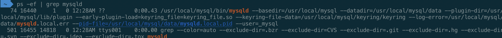
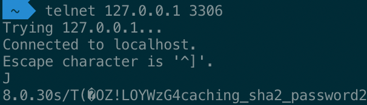
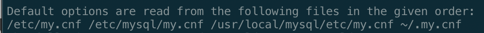
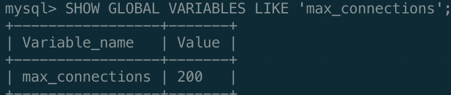
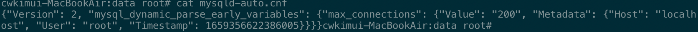
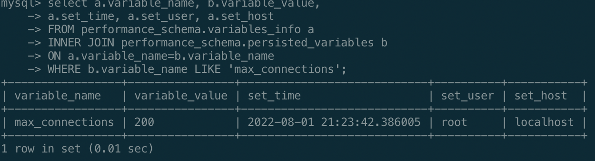

# 2장 설치와 설정 

## 2.1 MySQL 서버 설치
- Tar or Zip
- 리눅스 RPM , 윈도우 인스톨러 , macOS 설치 패키지
- 소스코드  빌드

### 2.1.1 버전과 에디션(엔터프라이즈, 커뮤니티) 선택
- 가능한한 최신버전을 선택
- 갓 출시된 메이저버전은 치명적인 버그가 있을 수 있으니 최소 패치버전이 15~20번 릴리즈된 버전을 선택
- 핵심기능에선 엔터프라이즈와 커뮤니티 버전의 차이가 없으며 부가적인 기능 기술지원등이 엔터프라이즈에서 지원된다.

### 2.1.2 MySQL 설치
#### 2.1.2.3 macOS용 DMG 패키지 설치
- https://dev.mysql.com/downloads/mysql/
- 위 링크에서 DMG MySQL 버전 및 OS 에 맞게 DMG 다운로드
- 설치화면 중 사용자 인증방식 선택
  + Use Strong Password Encryption : Caching SHA-2 Authentication 사용
  + Use Legacy Password Encryption : Native Authentication 방식 사용
- 기본 설치 디렉터리는 `/usr/local/mysql` 하위에 생성된다.
- 설치 후 MySQL 서버가 자동으로 실행된다
  + `ps -ef | grep mysqld` 명령어로 프로세스 확인 가능
  
- `/usr/local/mysql` 하위 디렉터리
  + `bin` : MySQL 서버와 클라이언트 프로그램, 유틸리티를 위한 디렉터리
  + `data` : 로그 파일과 데이터 파일들이 저장되는 디렉터리
  + `include` : C/C++ 헤더 파일들이 저장된 디렉터리
  + `lib` : 라이브러리 파일들이 저장된 디렉터리
  + `share` : 다양한 지원파일 및 에러 메시지, 샘플 설정파일(`my.cnf`)이 있는 디렉터리
- Command 또는 시스템환경설정 >  MySQL 에서 서버 실행 및 중지 가능
```bash
## MySQL 서버 시작
sudo /usr/local/mysql/support-files/mysql.server start
## MySQL 서버 중지
sudo /usr/local/mysql/support-files/mysql.server stop
```

## 2.2 MySQL 서버의 시작과 종료
### 2.2.1 설정 파일 및 데이터 파일 준비
- 리눅스 서버에서 Yum 이나 RPM 을 이용해 MySQL 서버를 설치하면 트랙잭션 로그 파일과 시스템 테이블이 준비 되지 않기 때문에
  `/etc/my.cnf`에 기본적인 설정을 해줘야함
- 다음 명령어로 초기 데이터 파일과 트랜잭션 파일 생성
  ```bash
  mysqld --defaults-file=/etc/my.cnf --initialize-insecure
  ```
- 옵션
  + `--initialize-insecure` : 초기 데이터 파일, 로그파일, 비밀번호가 없는 root 계정 생성
  + `--initialize` : 비밀번호가 있는 root 계정을 생성 비밀번호는 `/var/log/mysqld.log`에 생성됨

### 2.2.2 시작과 종료
- 유닉스 계열 운영체제에서는 `/usr/lib/systemd/systrm/mysqld.service` 파일 생성
- systemctl 유틸리티를 활용하여 MySQL을 기동 및 종료 가능
  ```bash
  systemctl start mysqld # 실행
  systemctl stop mysqld # 종료
  ```
- 원격으로 셧다운 하려면 MySQL 서버에 로그인한 상태에서 SHUTDOWN 명령어를 실행한다. (SHUTDOWN 권한 필요)
  ```mysql
  SHUTODWN;
  ```
- 서버 종료시 커밋된 데이터가 데이터파일에 남지 않고 로그파일에만 남는 경우가 있다.
- 커밋된 데이터를 데이터 파일에 남기고 종료하려면 다음 명령어를 사용한다.
  ```mysql
  SET GLOBAL inoodb_fast_shutdown=0;
  ```
  ```bash
  systemctl stop mysqld.service
  ```

### 2.2.3 서버 연결 테스트
> 환경변수 설정
> shell 에서 `mysql` 명령어를 바로 사용하기 위해서 환경변수를 설정한다.  
> 나의 경우 zsh shell을 사용하기 때문에  
> `~/.zshrc` 파일에 아래 내용을 추가 한뒤  
> `export PATH="$PATH:/usr/local/mysql/bin"`  
> shell 에서 `source ~/.zshrc` 를 입력하여 적용하였다.
- 다음 명령어로 서버에 연결
  ```bash
  mysql -uroot -p --host=localhost --socket=/tmp/mysql.sock # 1
  mysql -uroot -p --host=127.0.0.1 --port=3306 # 2
  mysql -uroot -p # 3
  ```
  + 1 : 소켓 파일 활용
  + 2 : TCP/IP 로 로컬호스트 접속. 원격호스트에 접속시 이 옵션을 사용해야 한다.
  + 3 : 옵션 명시하지 않을 경우 기본값으로 localhost , 소켓파일을 사용


- telnet 으로 접속 확인


## 2.3 MySQL 서버 업그레이드
- 두가지 방법이 있음
  + MySQL 서버의 데이터 파일을 그대로 두고 업그레이드 (인플레이스 업그레이드)
  + `mysqldump` 도구 등을 이용해 서버 데이터를 덤프한 뒤,   
  새로 업그레이드 된 버전의 MySQL 서버에서 덤프된 데이터를 적재 (논리적 업그레이드)

### 2.3.1 인플레이스 업그레이드 제약사항
- 마이너 버전간 업그레이드 , 메이저 버전간 업그레이드로 생각할 수 있다.
- 동일버전 메이저 버전 간 업그레이드는 데이터 파일 변경 없이 업그레이드가 진행 
  + (ex: `8.0.16` → `8.0.21`)
- 두 단계 이상의 메이저 버전을 한번에 업그레이드 해야한다면 논리적업그레이드가 더 나을 수 있다.
- 업그레이드 시 최소 GA 버전은 지나서 15~20번 이상의 마이너버전을 선택하는 것이 좋다.
  + GA 버전 : 오라클에서 MySQL 서버의 안정성이 확인된 버전

### 2.3.2 MySQL 8.0 업그레이드 시 고려 사항
- 사용자 인증 방식 변경
- MySQL 8.0과의 호환성 체크
- 외래키 이름의 길이
- 인덱스 힌트
- GROUP BY에 사용된 정렬 옵션
- 파티션을 위한 공용 테이블스페이스

### 2.3.3 MySQL 8.0 업그레이드
- 데이터 딕셔너리 업그레이드
- 서버 업그레이드
- 데이터 딕셔너리 업그레이드 작업은 서버(`mysqld`)가 실행, 서버 업그레이드 작업은 `mysql_upgrade`가 실행

## 2.4 서버 설정
- MySQL 서버는 단 하나의 설정파일을 사용함
  + 윈도우 계열 : `my.ini`
  + 리눅스, 유닉스 계열 : `my.cnf`
- 서버가 어느 디렉터리에서 `my.cnf` 파일을 읽는지 궁금하다면 
  ```bash
  mysqld --verbose --help
  ```
  

### 2.4.1 설정 파일의 구성
- `my.cnf` 나 `my.ini` 에 여러 개의 설정그룹을 담을 수 있음
- 대체로 실행 프로그램명을 그룹명으로 사용한다.

### 2.4.2 MySQL 시스템 변수의 특징
- MySQL 서버는 기동하면서 설정 파일의 내용을 읽어 메모리나 작동 방식을 초기화하고, 접속된 사용자를 제어하기 위해 이러한 값을 별도로 저장해 둔다.
- `SHOW VARIABLES`, `SHOW GLOBAL VARIABLES` 명령어로 확인 가능
- 각 변수 값이 미치는 영향도를 판단하기 위해 변수가 글로벌 변수인지 세션 변수인지 알아야 함

### 2.4.3 글로벌 변수와 세션 변수
- MySQL 시스템 변수는 적용범위에 따라 글로벌 변수, 세션 변수로 나뉜다.
- 글로벌 변수 : 하나의 MySQL 서버 인스턴스에서 전체적으로 영향을 미치는 시스템 변수
- 세션 변수 : 세션 범위의 시스템 변수는 MySQL 클라이언트가 서버에 접속할 때 기본으로 부여하는 옵션의 기본 값을 제어하는데 사용. (`autocommit` 이 대표적)

### 2.4.4 동적변수와 정적 변수
- 서버가 기동중일때 변동 가능한지 여부에 따라 동적변수, 정적변수로 구분된다.
- 시스템변수는 디스크에 저장된 설정파일(`my.cnf`,`my.ini`) 를 변경하는 경우, 기동중인 메모리에 있는 시스템변수를 변경하는 경우로 구분할 수 있다.
- `SHOW` 명령어를 통해 변수를 보거나 `SET` 명령어를 통해 변수를 변경할 수 있다.
  + `SET` 명령어로 변경한 변수의 경우 해당 인스턴스 내에서만 유효하다.
  + `8.0` 버전부터는 SET PERSIST 명령을 이용해 설정파일도 함께 변경이 가능. (동적변수에 한함)
  ```mysql
  SET PERSIST max_connections=200; -- 실행 후 서버 재기동 결과 (default: 151)
  ```
  
- `SET PERSIST` 명령어로 시스템 변수를 변경시 `mysqld-auto.cnf`, `performance_schema.variables_info`, `performance_schema.persisted_variables` 에 기록이 남는다.
  
  
- 현재 실행중인 서버에 변경내용을 저장하지 않고 다음 재기동 이후 적용을 위해 `SET PERSIST_ONLY` 명령어를 사용할 수 있다.
- 위 명령어로 추가된 시스템 변수를 삭제하려면 `RESET PERSIST` 명령어를 활용한다.
  ```mysql
  RESET PERSIST [시스템 변수명]; -- 옵션명을 안넣을시 mysqld-auto.cnf 모든 시스템변수를 삭제
  ```

### 2.4.6 my.cnf 파일
- MySQL 서버의 시스템변수는 570개 정도이며, 잘못튜닝할경우 오히려 성능이 저하될 수 있다.