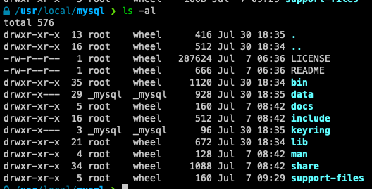
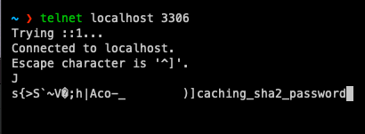

# 2장 설치와 설정

## 2.1 MySQL 서버 설치

- Tar 또는 Zip 아카이브 버전
- RPM
- 소스코드 빌드

### 2.1.1 버전과 에디션 선택

- 가능한 최신 버전 선택을 권장한다
- 최소 패치 버전 15~20번 이상 릴리스 권장 ⇒  `MySQL 8.0.15` 이상
- 엔터프라이즈 에디션 부가기능이 필요한 경우가 아니라면 커뮤니티 에디션을 권장한다
    - 엔터프라이즈 부가 기능 ⇒ 대체 플러그인이 존재한다(Percona)
        - Thread Pool
        - Enterprise Audit
        - Enterprise TDE(Master Key 관리)
        - Enterprise Authentication
        - Enterprise Firewall
        - Enterprise Monitor
        - Enterprise Backup
        - MySQL 기술 지원

## 2.1.2 MySQL 설치

- 기본 설치 파일 경로(MacOS)
    - `/usr/local/mysql`
        
        
        
        - bin: MySQL 서버와 클라이언트 프로그램, 유틸리티
        - data: 로그 파일과 데이터 파일
        - include: C/C++ 헤더 파일
        - lib: 라이브러리 파일
        - share: 다양한 지원 파일. 에러 메시지나 샘플 설정 파일(my.cnf)
- 서버 시작 및 종료
    
    ```bash
    /usr/local/mysql/support-files/mysql.server start
    /usr/local/mysql/support-files/mysql.server stop
    ```
    
    - Mac 의 경우 PID가 없다고 동작하지 않는 경우
        - `/usr/local/mysql/bin mysqladmin -uroot -p shutdown`
    
    ## 2.2 MySQL 서버의 시작과 종료
    
    ### 2.2.1 설정 파일 및 데이터 파일 준비
    
    - 초기 데이터 파일 설정
        
        ```bash
        mysqld --delfaults-file=/etc/my.cnf --initialize-insecure
        mysqld --defaults-file=/etc/my.cnf --initialize
        ```
        
    
### 2.2.2 시작과 종료

- systemctl
    - 유닉스 계열 운영체제에서 RPM 패키지 설치 시 `mysqld.service` 가 자동으로 등록된다
    
    ```bash
    systemctl status mysqld
    systemctl start mysqld
    systemctl stop mysqld 
    ```
    
- mysqld_safe 스크립트
    - mysqld_safe 스크립트를 사용하는 경우 my.cnf 파일 내 [mysqld_safe] 섹션을 참고한다
        - `systemd` 사용 시 해당 스크립트를 참조하지 않는다
    - `malloc-lib` 와 같은 시스템 설정 적용이 필요한 경우 mysqld_safe 스크립트를 사용해야 한다
        
        ```bash
        mysqld_safe --user=root --max_connections=1024 --wait_timeout=60 &
        ```
        
- SHUTDOWN 권한 사용
    
    ```bash
    mysql> SHUTDOWN;
    ```
    
    - 트랜잭션이 정상 커밋돼도 데이터 파일 변경된 내용이 기록되지 않고 로그에만 기록될 수 있음
    - MySQL 서버가 종료되고 다시 시작된 이후에도 이 상태로 남아 있을 수 있다
        
        ⇒ 즉시 커밋 내용을 기록하고 종료하는 것을 `Clean Shutdown` 이라고 한다
        
        ```bash
        mysql> SET GLOBAL innodb_fast_shutdown=0;
        ```
        
        - 재기동시  별도의 트랜잭션 복구 과정을 진행하지 않기 때문에 빠르게 시작할 수 있음

### 2.2.3 서버 연결 테스트

- 접속
    
    ```bash
    linux > mysql -uroot -p --host=localhost --socket=/tmp/mysql.sock
    linux > mysql -uroot -p --host=127.0.0.1 --port=3306
    linux > mysql -uroot -p 
    ```
    
    - localhost vs 127.0.01
        - localhost: `Unix domain socket` 접속 방식을 사용(IPC; Inter Process Communication)
        - 127.0.0.1: 루프백 IP. TCP/IP 프로토콜 사용
        - [https://stackoverflow.com/questions/3715925/localhost-vs-127-0-0-1-in-mysql-connect](https://stackoverflow.com/questions/3715925/localhost-vs-127-0-0-1-in-mysql-connect)
- 데이터베이스 조회
    
    ```bash
    mysql> SHOW DATABASES;
    ```
    
- 원격 접속 여부 확인(Telnet/ Netcat)
    
    
    

## 2.3 MySQL 서버 업그레이드

- 인플레이스 업그레이드(In-Place Upgrade)
    - 서버의 데이터 파일을 그대로 두고 업그레이드
    - 논리적 업그레이드에 비해 속도가 빠르다
    - 여러 제약 사항이 존재한다
- 논리적 업그레이드
    - `mysqldump` 도구 등을 이용해 서버 데이터를 덤프한 후 적재하는 방식

### 2.3.1 인프레이스 업그레이드 제약사항

- 마이너 버전 간에는 제약사항이 없다
- 메이저 버전 간에는 버전 별 업그레이드가 선행되어야 한다
    - `5.1v` ⇒ `5.5v` ⇒ `5.6v` ⇒ `5.7v` ⇒ `8.0v`
    - 논리적 업그레이드를 권장한다
- 특정 마이너 버전에서만 가능한 버전이 있다
    - `5.7.8v` ⇒ `8.0v` (x)
        - GA(General Availability) 버전이 아님
        - 15 ~ 20 이상 마이너 버전을 권장한다

### 2.3.2 MySQL 8.0 업그레이드 고려 사항

- 사용자 인증 방식 변경: Caching SHA-2 Authentication
    - `default_authentication_plugin=mysql_native_password` (이전 버전 인증 방식 사용)
- MySQL 8.0과의 호환성 체크: mysqlcheck 유틸리티
- 외래키 이름의 길이: 64자 이하
- 인덱스 힌트: 성능저하가 발생할 우려가 있음. 테스트 필요
- GROUP BY 정렬 옵션: 제거하거나 다른 방식으로 변경
- 파티션을 위한 공용 테이블스페이스: 파티션의 각 테이블 스페이스를 공용 테이블스페이스에 저장할 수 없음

### 2.3.3 MySQL 8.0 업그레이드

1. 데이터 딕셔너리 업그레이드 
2. 서버 업그레이드 
- MySQL 셧다운 ⇒ 5.7 프로그램 삭제 ⇒ 8.0 프로그램 설치 ⇒ MySQL8.0 서버 실행 ⇒  (mysql_upgrade 프로그램 실행)
    - 8.0.15버전 이상부터 `mysql_upgrade` 프로그램으로 서버 업그레이드하는 기능을 자동으로 수행

## 2.4 서버 설정

- `my.cnf` , `my.ini`
- 지정된 여러 개의 디렉터리를 순차적으로 탐색하면서 처음 발견된 my.cnf 파일을 사용한다

```bash
mysqld --verbose --help
```

- `/etc/my.cnf` `/etc/mysql/my.cnf`  `~/.my.cnf`
    - 우선순위를 가진다

### 2.4.1 설정 파일의 구성

```bash
[mysdqld_safe]
malloc-lib = /opt/lib/libtcmalloc_minimal.so

[mysqld]
socket = /usr/local/mysql/tmp/mysql.sock
port = 3306

[mysql]
default-character-set = utf8mb4
socket = /usr/local/mysql/tmp/mysql.sock
port = 3304

[mysqldump]
default-character-set = utf8mb4
socket = /usr/local/mysql/tmp/mysql.sock
port = 3305
```

- 프로그램 이름이 그룹명이 되고, 프로그램이 해당 설정을 참조한다
- `mysqld` ⇒ MySQL 서버 설정, `mysql` ⇒ MySQL 클라이언트 설정

### 2.4.2 MySQL 시스템 변수의 특징

- 설정 파일의 내용을 읽어 시스템 변수에 저장한다

```bash
mysql> SHOW GLOBAL VARIABLES;
```

- 시스템 변수의 속성
    - Cmd-Line: 서버 명령어 인자 설정 여부
    - Option File: `my.cnf` 설정 파일 제어 여부
    - System Var: 시스템 변수인지 구분  ⇒ 하이픈, 언더스코어 주의 필요
    - Var Scope: 시스템 변수의 적용 범위 ⇒ `Global` , `Session` , `Both`
    - Dynamic: 시스템 변수가 동적인지 정적인지 구분

### 2.4.3 글로벌 변수와 세션 변수

- 글로벌 변수
    - 하나의 MySQL 서버 인스턴스에서 전체적으로 영향을 미치는 변수
    - 주로 서버 자체의 설정일 경우가 많다
        - `innodb_buffer_pool_size`
        - `key_buffer_size`
- 세션 변수
    - MySQL 클라이언트가 서버에 접속할 때 기보능로 부여하는 옵션의 기본값으로 사용
    - 기본값은 글로벌 시스템 변수이며, 클라이언트가 가지는 값이 세션 변수이다
        - `autocommit`
- Both
    - 세션 범위의 시스템 변수 가운데 `my.cnf` 에 명시해 초기화할 수 있는 변수
    - 실제 클라이언트와의 커넥션이 생성되는 순간 해당 커넥션의 기본값으로 사용된다

### 2.4.4 정적 변수와 동적 변수

- MySQL 서버가 기동 중인 상태에서 변경 가능한지에 따라 `정적 변수`와 `동적변수`로 구분한다
- `my.cnf` 파일의 수정 ⇒ 정적 변수
    - MySQL 서버가 재시작하기전에는 적용되지 않는다
- `SET` command ⇒ 동적 변수
    - 현재 기동중인 인스턴스에서만 유효하다
    - `8.0` 버전이상부터 `SET PERSIST` 명령으로 영구히 적용이 가능한 설정을 지원한다
- `GLOBAL` 키워드
    
    ```bash
    mysql> SHOW GLOBAL VARIABLES LIKE '%max_connection%';
    ```
    
    - 글로벌 시스템 변수를 조회/수정하는 키워드
    - 해당 키워드가 없는 경우 자동으로 세션 변수를 조회/수정 한다

### 2.4.5 SET PERSIST

- 동적 변수 설정을 즉시 적용하며 영구히 저장함
    
    ```bash
    mysql> SET PERSIST max_connections=5000
    ```
    
    - `mysqld-auto.cnf` 파일에 변경 내용을 기록
        - JSON
    - 서버가 다시 시작될 때 참조
    - `세션 변수`에는 적용되지 않으며, 서버는 자동으로 `글로벌 변수`로 인식하고 변경한다
    - `SET PERSIST_ONLY` ⇒ 현재 인스턴스에는 적용하지 않는 경우
- mysqld-auto.cnf 파일의 내용을 삭제

    ```bash
    mysql> RESET PERSIST max_connections;
    mysql> RESET PERSIST IF EXISTS max_connections;
    mysql> RESET PERSIST;
    ```

    - JSON 파일 변경의 위험성 때문에 명령어 사용을 권장한다