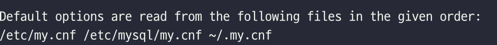
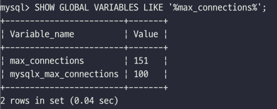
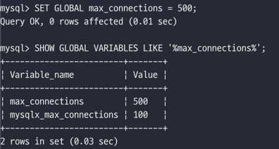
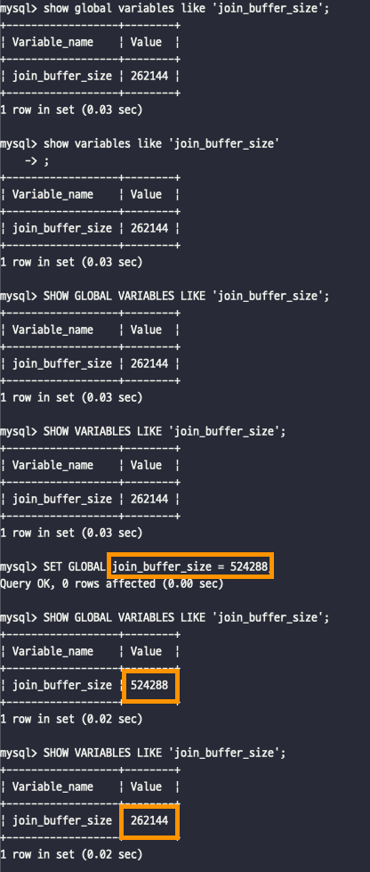
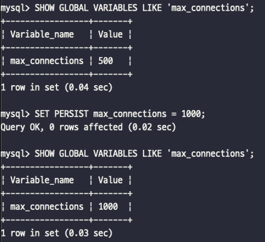
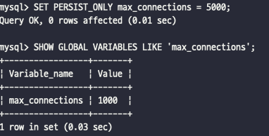
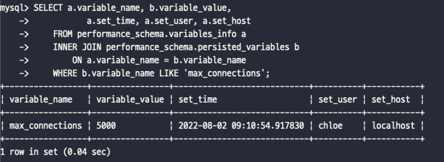

# 2장. 설치와 설정
[MySQL 8.0 Reference Manual](https://dev.mysql.com/doc/refman/8.0/en/)

[1. MySQL 서버 설치](#1-mysql-서버-설치)  
[2. MySQL 서버의 시작과 종료](#2-mysql-서버의-시작과-종료)  
[3. MySQL 서버 업그레이드](#3-mysql-서버-업그레이드)  
[4. 서버 설정](#4-서버-설정)

## 1. MySQL 서버 설치

### 버전과 에디션 선택

- 기존 버전에서 새로운 메이저 버전으로 업그레이 하는 경우라면 최소 패치 버전이 15~20번 이상 릴리스된 버전을 선택하는 것이 안정적이다.  
  **e.g.** MySQL 8.0 버전이라면, MySQL 8.0.15 부터 MySQL 8.0.20 버전부터 시작

- **MySQL 5.5** 버전부터는 커뮤니티와 엔터프라이즈 에디션의 기능이 달라지면서 소스코드도 달라졌고, MySQL 엔터프라이즈 에디션의 소스코드는 더이상 공개되지 않는다.

- MySQL 서버의 상용화 전략
    - _오픈 코어 모델_ : 핵심 내용은 엔터프라이즈 에디션과 커뮤니티 에디션 모두 동일하고, 특정 부가 기능들만 엔터프라이즈 에디션에 포함되는 방식  
      ⇒ 즉, 엔터프라이즈 에디션과 커뮤니티 에디션의 핵심 기능은 거의 차이가 없고, 부가적인 기능과 서비스들은 엔터프라이즈 에다션에서만 지원된다.

## 2. MySQL 설치

### 리눅스 서버

- [Yum 인스톨러 사용](https://dev.mysql.com/downloads/repo/yum)
    - Yum 리포지토리 정보 등록
      ```bash
      sudo rpm -Uvh mysql80-community-release-el7-6.noarch.rpm
      ```
    - 버전별로 설치 가능한 MySQL 소프트웨어 목록을 확인
        ```bash
      sudo yum search mysql-community
      ```
    - MySQL 설치
      ```bash
      sudo yum install mysql-community-server-8.0.21
      ```
- [Yum 인스톨러를 사용하지 않고 RPM 패키지로 직접 설치](https://dev.mysql.com/downloads/mysql/)

### macOS 용 DMG 패키지 설치

- [DMG 패키지 파일 다운로드](https://dev.mysql.com/downloads/mysql/)
- 설치 설정 확인
    - `Use Lagacy Password Encryption` : MySQL 서버를 사설 네트워크에서만 사용
    - `Use Strong Password Encryption` : 인터넷을 경유해서 MySQL 서버에 접속

- 설치가 완료되면 MySQL 서버가 자동으로 실행됨
  ```bash
  ps -ef | grep mysqld
  ```

- 기본 설정으로 설치하면 데이터 디렉터리와 로그 파일들은 `/usr/local/mysql` 디렉터리 하위에 생성됨
    - `bin`: MySQL 서버와 클라이언트 프로그램, 유틸리티
    - `data`: 로그 파일과 데이터 파일
    - `include`: C/C++ 헤더 파일
    - `lib`: 라이브러리 파일
    - `share`: 다양한 지원 파일. 에러 메시지나 샘플 설정 파일(my.cnf)

- macOS [시스템 환경 설정]에서 MySQL 관리 프로그램을 통해 설정 파일 등록 및 시작과 종료 가능

- 터미널로 MySQL 시작과 종료
  ```bash
  ## MySQL 서버 시작
  sudo /usr/local/mysql/support-files/mysql.sever start
  ## MySQL 서버 종료
  sudo /usr/local/mysql/support-files/mysql.sever stop
  ```

### 윈도우 MSI 인스톨러 설치

- [윈도우 설치 프로그램 다운로드](https://dev.mysql.com/downloads/mysql/)
- 설치 유형 선택
    - `Developer Default` 선택 시, MySQL 서버와 클라이언트 도구, MySQL Workbench 같은 GUI 클라이언트 도구가 모두 설치된다.
    - `Custom` 선택 시, 꼭 필요한 소프트웨어만 선택하여 설치할 수 있다.  
      **e.g.** MySQL 서버(MySQL 클라이언트 프로그램이 포함돼 있음), MySQL bash, MySQL Router 선택

- 고가용성 옵션 선택
    - `Standalone MySQL Server / Classic MySQL Replication` : 단일 서버 실행 모드

- 네트워크 옵션 선택
    - `Development Computer` : 테스트용으로 설정으로, MySQL 서버가 허용하는 커넥션 개수를 적게 설정
    - MySQL 서버의 기본 포트 : `3306`

- MySQL 서버의 설정이 모두 완료되면 MySQL Router 옵션을 설정하는 화면이 나타나는데, 이 설정 화면은 취소하고 넘어간다.

## 2. MySQL 서버의 시작과 종료

### 설정 파일 및 데이터 파일 준비

- my.cnf (my.ini)
    - MySQL 서버가 설치되면 `/etc/my.cnf` 설정 파일이 준비된다. macOS, 유닉스 계열에서 `my.cnf`이지만, 윈도우 운영체제는 `my.ini` 파일명을 사용한다.

- MySQL 서버를 실행하는데 필요한 초기 데이터 파일(시스템 테이블이 저장되는 데이터 파일)과 트랜잭션 로그(리두 로그) 파일을 생성한다.
    ```bash
    mysqld --default-file=/etc/my.cnf --initialize-insecure
    ```
    - `--initialize-insecure` : 필요한 초기 데이터 파일과 로그 파일들을 생성하고, 비밀번호가 없는 관리자 계정인 root 유저를 생성한다.
    - 비밀번호를 가진 관리자 계정을 생성하고자 한다면 `--initialize` 옵션을 사용하면 된다.
    - 생성된 관리자 계정의 비밀번호는 에러 로그 파일에 기록된다.
    - 에러 로그 파일의 기본 경로는 `/var/log/mysqld.log` 파일이다.

### 시작과 종료

- 유닉스 계열 운영체제에서 RPM 패키지로 설치하면 자동으로 `/usr/lib/systemd/system/mysqld.service` 파일이 생성된다.
- `systemctl` 유틸리티를 이용해 MySQL 시작하거나 종료할 수 있다.
    ```bash
    systemctl status mysqld
    systemctl start mysqld
    systemctl stop mysqld
    ```

- `systemd`를 이용해 시작하고 종료할 수도 있지만, [mysqld_safe](https://dev.mysql.com/doc/refman/8.0/en/mysqld-safe.html) 스크립트를 이용해서
  시작하고 종료할 수도 있다.
    - `systemd`를 이용하는 경우에는 MySQL 설정 파일의 `[mysqld_safe]` 섹션을 무시한다.
    - `[mysqld_safe]` 섹션에만 설정 가능한 "malloc-lib"같은 시스템 설정을 적용한다면 mysqld_safe 스크립트로 서버를 시작해야 한다.
        - `--malloc-lib` : 동적 링크에 영향을 주는 `LD_PRELOAD` 환경 값을 수정하여 로더가 `mysqld`가 실행될 때 시스템 라이브러리 대신 메모리 할당 라이브러리를 찾을 수 있도록
          한다.
        - `systemd`를 이용하더라도 `/etc/syscnfig/mysql`에서 `LD_PRELOAD`를 설정하여 할당 라이브러리를 지정할 수도 있다.
    - `mysqld_safe` 는 유닉스에서 `mysqld` 서버를 시작하는 데 권장되는 방법이다.
        - mysqld_safe는 에러가 발생했을 때 서버를 재 구동 시키고 런타임 정보를 에러 로그에 기록하는 것과 같은 안전 기능을 추가로 가지고 있다.


- MySQL 서버를 종료하려면 SHUTDOWN 권한을 가지고 있어야 한다.

#### 클린 셧다운

- 트랜잭션이 정상적으로 커밋돼도 데이터 파일에 변경된 내용이 기록되지 않고 로그 파일(리두 로그)에만 기록될 수도 있다.
- MySQL 서버가 종료될 때 모든 커밋된 내용을 데이터 파일에 기록하고 종료할 수 있게 하려면, MySQL 서버의 옵션을 변경하고 종료하면 된다.
    ```bash
    mysql> SET GLOBAL innodb_fast_shutdown=0;
    ```
- 모든 커밋된 데이터를 데이터 파일에 적용하고 종료하는 것을 클린 셧다운이라고 한다.
- 클린 셧다운으로 종료되면 다시 MySQL 서버가 기동할 때 별도의 트랜잭션 복구 과정을 진행하지 않기 때문에 빠르게 시작할 수 있다.
    ```bash
    ## 실행 중인 MySQL 서버 종료
    linux> systemctl stop mysqld.service
  
    ## 또는 원격으로 MySQL 서버 종료
    mysql> SHUTDOWN;
    ```

### 서버 연결 테스트

- 접속 시도
    ```bash
    ## 소켓 파일을 이용해 접속
    mysql -uroot -p --host=localhost --socket=/tmp/mysql.sock
  
    ## TCP/IP를 통해 접속
    mysql -uroot -p --host=127.0.0.1 --port=3306
  
    ## 호스트 주소와 포트를 명시하지 않고 접속
    mysql -uroot -p 
    ```
    - localhost로 명시하면, 소켓 파일을 통해 MySQL 서버에 접속하게 된다.
    - 127.0.0.1을 사용하면 루프백 IP 이기는 하지만, TCP/IP 통신 방식을 사용한다.
    - 별도로 호스트 주소를 명시하지 않으면, localhost가 되어 소켓 파일을 사용하게 된다.

- 원격 서버에서 MySQL 접속 확인
    - Telnet 또는 Netcat 으로 확인
      ```bash
      ## telnet 으로 확인
      linux> telnet 10.2.40.61 3306
    
      ## telnet 으로 확인
      linux> nc 10.2.40.61 3306 
      ```

## 3. MySQL 서버 업그레이드

업그레이드하는 방법은 다음 두 가지 방법을 생각해 볼 수 있다.

1. **인플레이스 업그레이드**
    - 서버의 데이터 파일을 그대로 두고 업그레이드
2. **논리적 업그레이드**
    - `mysqldump`를 통해 새로 업그레이드된 버전의 MySQL 서버에 데이터를 적재하는 방법

- 마이너 버전 간 업그레이드는 대부분 데이터 파일을 변경하지 않고도 MySQL 서버 프로그램만 재설치 하면 된다.
- 메이저 버전 간 업그레이드는 직전 버전에서만 허용된다.  
  **e.g.** MySQL 5.1 ➡️ MySQL 8.0 으로 업그레이드  
  (MySQL 5.1 →️ MySQL 5.5 →️ MySQL 5.6 →️ MySQL 5.7 →️ MySQL 8.0)
- 만약 두 단계 이상을 업그레이드 한다면 `mysqldump`로 데이터를 백업받은 후 새로 구축된 서버에 데이터를 적재하는 논리적 업그레이드가 더 나은 방법일 수 있다.
- 인플레이스 업그레이드의 경우, GA 버전(서버의 안정성이 확인된 버전)이 아닌 경우 메이저 버전으로 업그레이드가 불가능할 수 있다.

### MySQL 8.0 업그레이드 시 고려사항

- 사용자 인증 방식 변경
    - MySQL 8.0 부터 Caching SHA-2 Authentication 인증 방식이 기본 인증방식으로 바뀌었다.

- 호환성 체크
    - `mysqlcheck` 유틸리티를 이용해서 호환되지 않는 데이터 타입 또는 함수가 있는지 확인해 볼 것을 권장한다.
      ```bash
      ## mysqlcheck 유틸리티 실행
      linux> mysqlcheck -u root -p --all-database --check-upgrade
      ```

- 외래키 이름의 길이
    - MySQL 8.0에서는 외래키의 이름이 64글자로 제한된다.
      ```bash
      ## 외래키 이름의 길이 체크
      mysql> SELECT TABLE_SCHEMA, TABLE_NAME
              FROM information_schema.TABLES
              WHERE TABLE_NAME IN (SELECT LEFT(SUBSTR(ID, INSTR(ID, '/')+1),
                                               INSTR(SUBSTR(ID, INSTR(ID, '/')+1), 'ibfk_')-1)
                                   FROM information_schema.INNODB_FOREIGN
                                   WHERE LENGTH(SUBSTR(ID, INSTR(ID, '/')+1)) > 64              
                                  );
      ```

- 인덱스 힌트
    - MySQL 5.x에서 사용되던 인덱스 힌트가 있다면 MySQL 8.0에서 먼저 성능 테스트를 수행하자.

- `GROUP BY`에 사용된 정렬 옵션
    - MySQL 5.x에서 `GROUP BY` 절 컬럼 뒤에 `ASC`나 `DESC`를 사용하고 있다면 제거하거나 다른 방식으로 변경하자.

- 파티션을 위한 공용 테이블스페이스
    - MySQL 8.x에서는 파티션의 각 테이블스페이스를 공용 테이블스페이스에 저장할 수 없다.
      ```bash
      ## 공용 테이블스페이스에 저장된 파티션이 있는지 체크
      mysql> SELECT DISTINCT NAME, SPACE, SPACE_TYPE
              FROM information_schema.INNODB_TABLES
              WHERE NAME LIKE '%#P#%' AND SPACE_TYPE NOT LIKE '%Single%';
      ```

### MySQL 8.0 업그레이드

업그레이드 단계는 크게 두 가지 단계로 나뉘어서 처리된다.

1. **데이터 딕셔너리 업그레이드**
    - 데이터 딕셔너리를 FRM 파일에서 InnoDB 테이블로 저장  
      \- MySQL 5.7 버전까지는 데이터 딕셔너리 정보가 FRM 확장자를 가진 파일로 별도로 보관  
      \- MySQL 8.0 버전부터는 데이터 딕셔너리 정보가 트랜잭션이 지원되는 InnoDB 테이블로 저장

2. **서버 업그레이드**
    - 시스템 데이터베이스의 테이블 구조를 변경하는 작업

- MySQL 8.0.15 버전까지는 데이터 딕셔너리 업그레이드 작업은 `mysqld` 프로그램이 실행하고, 서버 업그레이드 작업은 `mysql_upgrade` 프로그램이 실행했다.
- **MySQL 8.0.16** 부터는 mysql_upgrade 유틸리티가 없어지고, `mysqld` 프로그램이 시작되면서 데이터 딕셔너리 업그레이드를 실행 후, 시스템 테이블 구조를 버전에 맞게 변경한다.
    - `--upgrade` 옵션을 사용하면 데이터 딕셔너리 및 서버 업그레이드를 수행할지 여부를 제어할 수 있다.
    - `--upgrade` 파라미터를 지정하지 않으면 기본적으로 `AUTO`로 설정된다.   
      (파라미터 값: `AUTO`, `NONE`, `MINIMAL`, `FORCE`)

## 4. 서버 설정

- 일반적으로 MySQL 서버는 단 하나의 설정 파일을 사용한다.
    - `my.cnf` : 유닉스 계열
    - `my.ini` : 윈도우 계열

- 설정 파일의 경로 확인
    - MySQL은 단 하나의 설정 파일만 사용하지만, 설정 파일이 여러 개 있을 수 있기 때문에 어느 디렉터리를 참조해서 서버가 기동되었는지 확인한다.
        ```bash
        mysqld --verbose --help
        mysql --help
        ```
      

    - 설정 파일 탐색 순서  
      ① `/etc/my.cnf`  
      ② `/ect/mysql/my.cnf`  
      ③ `/usr/etc.my.cnf`  
      ④ `~/.my.cnf`

### 설정 파일의 구성

- 설정 파일에는 여러 개의 설정 그룹을 담을 수 있고, 대체로 실행 프로그램 이름을 그룹명으로 사용한다.

    ```bash
    [mysdqld_safe]
    malloc-lib = /opt/lib/libtcmalloc_minimal.so
    
    [mysqld]
    socket = /usr/local/mysql/tmp/mysql.sock
    port = 3306
    
    [mysql]
    default-character-set = utf8mb4
    socket = /usr/local/mysql/tmp/mysql.sock
    port = 3304
    
    [mysqldump]
    default-character-set = utf8mb4
    socket = /usr/local/mysql/tmp/mysql.sock
    port = 3305
    ```
    - mysqld_safe 프로그램은 `[mysqld_safe]`와 `[mysqld]` 그룹을 참조
    - `[mysqld]` : MySQL 서버 프로그램
    - `[mysql]` : MySQL 클라이언트 프로그램
    - `[mysqldump]` : mysqldump 프로그램

### MySQL 시스템 변수의 특징

- MySQL 서버를 기동하면 설정 파일의 내용을 읽어 시스템 변수에 저장한다.
    - 시스템 변수 확인
        ```bash
        mysql> SHOW GLOBAL VARIABLES;
        ```

- [MySQL 서버 시스템 변수 매뉴얼](https://dev.mysql.com/doc/refman/8.0/en/server-system-variable-reference.html)
    - Cmd-Line : 명령행 인자로 시스템 변수의 값을 변경하는 것이 가능한지 여부
    - Option File : `my.cnf` 설정으로 제어할 수 있는지 여부
    - System Var : 시스템 변수인지 아닌지 여부
    - Var Scope : 시스템 젼수의 적용 범위
        - Global : MySQL 서버 전역에 적용
        - Session : MySQL 서버와 클라이언트 간의 커넥션에 적용
        - Both :  세션과 글로벌 범위에 모두 적용
    - Dynamic : 시스템 변수가 동적인지 정적인지 구분

### 글로벌 변수와 세션 변수

#### Global

- 글로벌 범위의 시스템 변수는 하나의 MySQL 서버 인스턴스에서 전체적으로 영향을 미치는 시스템 변수를 의미한다.
    - 주로 서버 자체에 관련된 설정이다.   
      **e.g.** `innodb_buffer_pool_size`, `key_buffer_size`

#### Session

- 세션 범위의 시스템 변수는 MySQL 클라이언트가 MySQL 서버에 접속할 때 기본으로 부여하는 옵션을 제어하는데 사용된다.
    - 처음 접속할 때의 기본값을 유지할 수도 있고, 개별 커넥션 단위로 다른 값으로 변경할 수 있는 것이 세션 시스템 변수다.  
      **e.g.** `autocommit`
    - 세션 변수는 커넥션별로 설정값을 서로 다르게 지정할 수 있으며, 한번 연결된 커넥션의 세션 변수는 서버에서 강제로 변경할 수 없다.
    - 설정 파일에 초기값을 명시할 수 없으며, 커넥션이 만들어지는 순간부터 해당 커넥션에서만 유효한 변수이다.

#### Both

- MySQL 서버가 기억만 하고 있다가 실제 클라이언트와의 커넥션이 생성되는 순간에 해당 커넥션의 기본값으로 사용되는 값이다.
    - 설정 파일에 명시해 초기화할 수 있는 변수는 대부분 Both로 명시되어 있다.  
      **e.g.** `join_buffer_size`

### 정적 변수와 동적 변수

- 시스템 변수는 MySQL 서버가 기동 중인 상태에서 변경 가능한지에 따라 동적 변수와 정적 변수로 구분된다.
    - 디스크에 저장돼 있는 설정 파일을 수정하여 시스템 변수를 변경할 수 있다.
    - 이미 기동 중인 서버의 메모리에 있는 시스템 변수를 `SET` 명령을 통해 변경할 수 있다.

- 시스템 변수값 확인
    ```bash
    mysql> SHOW GLOBAL VARIABLES LIKE '%max_connections%';
    ```

  

- 시스템 변수값 변경
    ```bash
    mysql> SET GLOBAL max_connections = 500;
    mysql> SHOW GLOBAL VARIABLES LIKE '%max_connections%';
    ```
  

#### 동적 변수

- 동적 시스템 변수는 서버를 재시작하지 않고 `SET` 명령어로 변경이 가능하다.
- `SET` 명령을 통해 변경된 시스템 변수값은 `my.cnf` 파일에 반영되는 것이 아니고, 현재 기동중인 MySQL의 인스턴스에서만 유효하다.
- MySQL 8.0 버전부터는 `SET PERSIST` 명령을 이용하면 실행 중인 MySQL 서버의 시스템 변수를 변경함과 동시에 자동으로 설정 파일(`mysqld-auto.cnf`)에도 기록해 둔다.
- `SHOW`나 `SET` 명령에서 `GLOBAL` 키워드를 사용하면 글로벌 변수의 목록과 내용을 읽고 변경할 수 있으며, `GLOBAL` 키워드를 빼면 자동으로 세션 변수를 조회하고 변경한다.
- 시스템 변수의 범위가 Both인 경우, 글로벌 시스템 변수의 값을 변경해도 이미 존재하는 커넥션의 세션 변수값은 변경되지 않고 그대로 유지된다.

  

### SET PERSIST

- `SET PERSIST` 명령을 이용하면 실행 중인 MySQL 서버의 시스템 변수를 변경함과 동시에 자동으로 설정 파일(`mysqld-auto.cnf`)에도 기록해 둔다.
    ```sql
    SHOW GLOBAL VARIABLES LIKE 'max_connections';
    SET PERSIST max_connections = 1000;
    SHOW GLOBAL VARIABLES LIKE 'max_connections';
    ```

  

- `SET PERSIST` 명령은 세션 변수에는 적용되지 않는다.
- `SET PERSIST` 명령으로 시스템 변수를 변경하면 자동으로 GLOBAL 시스템 변수의 변경으로 인식한다.
- 현재 실행 중인 MySQL 서버에는 변경 내용을 적용하지 않고, 다음 재시작을 위해 `mysqld-auto.cnf` 파일에만 변경 내용을 기록해두고자 한다면 `SET PERSIST_ONLY` 명령을 사용하면
  된다.
    ```sql
    SET PERSIST_ONLY max_connections = 5000;
    SHOW GLOBAL VARIABLES LIKE 'max_connections';
    ```

  

- 정적 변수를 `mysqld-auto.cnf` 파일에 기록해두고자 할 때 `SET PERSIST_ONLY` 명령을 활용하면 된다.
    ```sql
    SET PERSIST innodb_doublewrite = ON;  -- 정적 변수를 변경할 수 없다.   
    -- Variable 'innodb_doublewrite' is a read only variable
  
    SET PERSIST_ONLY innodb_doublewrite = ON;
    ```
- `SET PERSIST`나 `SET PERSIST_ONLY` 명령으로 시스템 변수를 변경하면 JSON 포맷의 `mysqld-auto.cnf` 파일이 생성된다.
    ```bash
    ## MySQL 데이터 디렉토리 조회
    mysql> SHOW VARIABLES LIKE 'DATADIR';
  
    ## mysqld-auto.cnf 파일 조회
    linux> cat /var/lib/mysql/mysqld-auto.cnf
    ```

    ```text
    {
      "Version": 1,
      "mysql_server": {
        "max_connections": {
          "Value": "5000",
          "Metadata": {
            "Timestamp": 1659399367229479,
            "User": "chloe",
            "Host": "localhost"
          }
        },
        "mysql_server_static_options": {
          "innodb_doublewrite": {
            "Value": "ON",
            "Metadata": {
              "Timestamp": 1659399445644128,
              "User": "chloe",
              "Host": "localhost"
            }
          }
        }
      }
    }
    ```

- `SET PERSIST`나 `SET PERSIST_ONLY` 명령으로 변경된 시스템 변수의 메타데이터는 `performance_schema.variables_info`
  뷰와 `performance_schema.persisted_variables` 테이블을 통해 참조할 수도 있다.

    ```sql
    SELECT a.variable_name, b.variable_value,
           a.set_time, a.set_user, a.set_host
    FROM performance_schema.variables_info a
    INNER JOIN performance_schema.persisted_variables b
        ON a.variable_name = b.variable_name
    WHERE b.variable_name LIKE 'max_connections';
    ```

  

- `mysqld-auto.cnf` 파일의 내용을 삭제해야 하는 경우에는 파일을 직접 변경하지 말고, `REST PERSIST` 명령을 사용하는 것이 안전하다.

    ```bash
    ## 특정 시스템 변수만 삭제
    mysql> RESET PERSIST max_connections;
    mysql> RESET PERSIST IF EXISTS max_connections;
  
    ## mysqld-auto.cnf 파일의 모든 시스템 변수를 삭제
    mysql> RESET PERSIST;
    ```

### my.cnf 파일

- MySQL 8.0 서버의 시스템 변수는 대략 570개 수준이며, MySQL 서버를 제대로 사용하려면 시스템 변수에 대한 이해가 상당히 많이 필요하다.
- [my.cnf](2장_설치와_설정/images/winnie/my.cnf)
- [MySQL Doc | 서버 시스템 변수](https://dev.mysql.com/doc/refman/8.0/en/server-system-variables.html)
