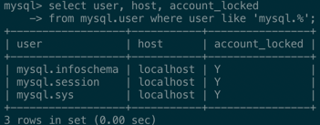
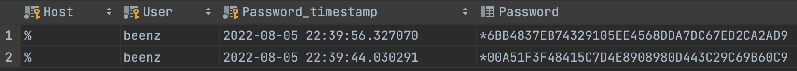
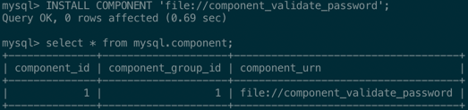
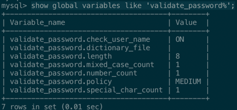
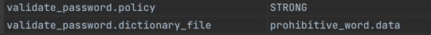
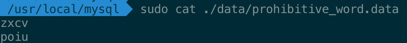
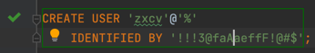
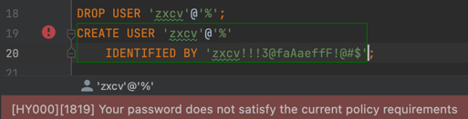
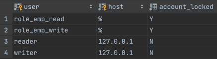

# 3장 사용자 및 권한

## 3.1 사용자 식별
- MySQL은 사용자의 계정뿐이라 접속지점(호스트명, IP, 도메인)도 계정의 일부가 된다.
    ```sql
    'beenz'@'192.168.0.10' -- 192.168.0.1 에서만 접속 가능
    'beenz'@'%' -- 모든 외부 컴퓨터에서 접속 가능
    ```
- 위 코드와 같이 같은 계정명에 대해 여러 IP 설정이 있을 경우  
  192.168.0.10 IP를 가진 PC에서 접속할 경우 MySQL은 범위가 더 좁은   
  'beenz'@'192.168.0.10' 정보를 사용하게 된다.

  > issue: 원격접속테스트

## 3.2 사용자 계정 관리
### 3.2.1 시스템 계정과 일반 계정
- MySQL 8.0부터 SYSTEM_USER 권한 보유 여부에 따라 시스템 계정과 일반 계정으로 구분된다.
- 시스템계정은 일반계정에서 할 수 없는 서버관리와 관련된 중요한 작업을 수행할 수 있다.
  - 계정관리
  - 세션 및 세션에서 실행중인 쿼리에 대한 관리
  - 스토어드 프로그램 생성시 DEFINER를 타 사용자로 설정

    > - Stored Programs in general refers to:  
    > PROCEDURE  
    > FUNCTION  
    > TABLE TRIGGER  
    > EVENT  
    > 
    >
    >  ```mysql
    > UPDATE `mysql`.`proc` p SET definer = 'YournewDefiner' WHERE definer='OldDefinerShownBefore'
    > ```
    > https://dev.mysql.com/doc/dev/mysql-server/latest/stored_programs.html
    > https://stackoverflow.com/questions/3206820/change-the-stored-procedure-definer

- MySQL 서버 내장 계정
  - `55p` 참조
  - 해당 계정들은 처음부터 참겨있는 상태(`account_locked='Y'`)이므로 의도적으로 잠금을 풀지 않는한 보안을 걱정할 필요는 없다.
  

### 3.2.2 계정 생성
- MySQL 5.7 버전까지는 GRANT 명령어로 권한부여와 계정생성이 가능했다.
- MySQL 8.0 버전부터는 계정의 생성(`CEATE USER`)과 권한 부여(`GRANT`)를 구분해서 실행하도록 바뀌었다.
- 계정생성시 다양한 옵션을 설정할 수 있다.
  ```
    CREATE USER '계정명'@'호스트' 
    IDENTIFIED WITH '인증방식' BY '비밀번호'
    REQUIRE NONE
    PASSWORD EXPIRE INTERVAL 30 DAY
    ACCOUNT UNLOCK
    PASSWORD HISTORY DEFAULT
    PASSWORD REUSE INTERVAL DEFAULT
    PASSWORD REQUIRE CURRENT DEFAULT;
  ```
  > https://dev.mysql.com/doc/refman/8.0/en/create-user.html

#### 3.2.2.1 IDENTIFIED WITH
- 인증 방식(`p56`)
  - Native Pluggable Authentication 
  - Caching SHA-2 Pluggable Authentication
  - PAM Pluggable Authentication
  - LDAP Pluggable Authentication
- MySQL 8.0 Caching SHA-2 Pluggable Authentication가 default 인데 두가지 방법으로 변경이 가능하다.
  ```mysql
  SET GLOBAL default_authentication_plugin="mysql_native_password"
  -- 또는 my.cnf에 추가
  ```
  > SCRAM 인증방식
  > https://ko.wikipedia.org/wiki/Salted_Challenge_Response_Authentication_Mechanism

#### 3.2.2.2 REQUIRE
- 서버 접속시 암호화된 SSL/TLS 채널을 사용할지에 대한 여부  

#### 3.2.2.3 PASSWORD EXPIRE
- 비밀번호 유효기간
- 시스템변수 `default_password_lifetime` (default : 0)  

#### 3.2.2.4 PASSWORD HISTORY
- 패스워드 이력을남겨 이력에 남은 비밀번호는 재사용 불가
- 시스템변수 `password_history` (default: 0) 

  

#### 3.2.2.5 PASSWORD REUSE INTERVAL
- 한번 사용했던 비밀번호 재사용 금지기간 설정
- 시스템변수 `password_reuse_interval` (default: 0)
- 테스트 결과 REUSE INTERVAL는 PASSWORD_HISTORY 테이블을 사용하는듯하다.(그중에서 PASSWORD_TIMESTAMP 컬럼이 기준)

#### 3.2.2.6 PASSWORD REQUIRE
- 비밀번호 변경시 현재 비밀번호 필요 여부
- `password_require_current` (default: off)  

#### 3.2.2.7 ACCOUNT LOCK / UNLOCK
- `ALTER USER` 로 계정정보를 변경할 떄 계정을 사용하지 못하게 잠글지 여부를 결정

## 3.3 비밀번호 관리
### 3.3.1 고수준 비밀번호
- 앞선 기본 설정 외에도 `validate_password` 컴포넌트를 통해  
  글자 조합을 강제하거나 금칙어 설정 등 고수준 비밀번호 설정을 할 수 있다.

- 설치
  
- 시스템 변수  

- 비밀번호 정책
  - `LOW` : 비밀번호 길이만 검증  
  - `MEDIUM` : 길이를 및 숫자 대소문자, 특수문자 배합 검증
  - `STRONG` : `MEDIUM` + 금칙어포함 여부
- 각 정책은 시스템변수에 정의된 값을 기준으로 비밀번호를 검증한다.
- 테스트  






### 3.3.3 이중 비밀번호
- DB는 응용어플리케이션과 밀접하게 연관되어 있는데 계정비밀번호 변경시 응용 어플리케이션의 일괄중단이 불가피한 단점이 있다.
- 따라서 MySQL 8.0 부터는 계정 비밀번호를 2개(Primary, Secondary) 동시에 사용하는 기능을 추가
- 문법은 다음과 같다.
  ```mysql
  -- 기존 비밀번호 변경 구문에 RETAIN CURRENT PASSWORD 옵션 추가
  ALTER USER 'root'@'localhost' IDENTIFIED BY 'old_password';
  ALTER USER 'root'@'localhost' IDENTIFIED BY 'new_password' RETAIN CURRENT PASSWORD;
  
  -- Secondary 삭제
  ALTER USER 'root'@'localhost' DISCARD OLD PASSWORD;
  ```

## 3.4 권한
- GLOBAL 권한 / 객체권한 / 동적권한
  - GLOBAL 권한 : 데이터베이스나 테이블 이외의 객체에 적용(~v5.7, v8.0)
  - 객체권한 : 데이터베이스나 테이블에 제어(~v5.7, v8.0)
  - 정적권한 : 서버가 시작되면서 동적으로 생성되는 권한 (v8.0~) 
    - ex) 컴포넌트나 플러그인 설치 후 등록되는 권한
- SUPER 라는 권한이 8.0부터 여러갈래로 나뉘어 동적권한에 분산되었다.
- `GRANT` 명령어로 권한을 부여하고 각 권한의 범위에 따라 `ON`절 뒤에 오브젝트의 내용이 바뀌어야 한다.
- 테이블 및 컬럼 단위의 권한은 잘 사용하지 않는다. 컬럼단위의 권한이 하나라도 부여될경우 모든테이블의 모든컬럼에 대해서도 권한을 체크하기 때문에 성능이 저하된다.
- `SHOW GRANT` 명령어나 mysql DB의 권한관련 테이블 (`p70`)을 통해 권한이나 역할을 확인할 수 있다. 
  ```mysql
  -- 문법
  GRANT privilege_list ON db.table TO 'user'@'localhost';
  
  -- GRANT OPTION
  GRANT OPTION 
  
  -- GLOBAL
  GRANT SUPER ON *.* TO 'user'@'localhost'; -- SUPER는 GLOBAL 권한 이라서 ON절뒤에 *.* 밖에 올 수 없다. (특정 오브젝트 지정 불가)
  
  -- DB
  GRANT EVENT ON [*.* / db.*]  TO 'user'@'localhost';
  
  -- TABLE
  GRANT SELECT,INSERT,UPDATE,DELETE ON [*.* / db.* / db.table ] TO 'user'@'localhost';
  
  -- column
  GRANT SELECT,INSERT,UPDATE(column_name) ON db.table TO 'user'@'localhost';
  ```

## 3.5 역할(Role)
- MySQL 8.0 부터는 권한을 묶어서 역할을 사용할 수 있게 됐다.
  ```mysql
  -- 권한생성(껍데기)
  CREATE ROLE role_emp_read, role_emp_write; 
  
  -- 껍데기에 실제 권한 부여
  GRANT SELECT ON employees.* TO role_emp_read; 
  GRANT INSERT, UPDATE, DELETE ON employees.* TO role_emp_write;
  
  -- 유저에 권한 부여
  GRANT role_emp_read TO reader@'127.0.0.1'
  GRANT role_emp_read, role_emp_write TO writer@'127.0.0.1'
  
  -- 권한 활성화
  SET ROLE 'role_emp_read';
  SET ROLE 'role_emp_writer';
  
  -- activate_all_roles_on_login 글로벌 변수를 ON 으로 설정해놓으면
  -- 매번 SET ROLE을 해주지 않아도 된다.
  SET GLOBAL activate_all_roles_on_login=ON;
  ```
- MySQL 서버 내부적으로 역할과 계정은 <b>동일한 객체로 취급</b> 된다.
- 관리를 위해 역할에는 prefix를 붙여 구분하는게 좋다.
- 역할은 `account_locked` 컬럼이 'Y' 로 설정되어 있다.
  
- 역할 또는 역할 그래프 관계는 SHOW GRANTS 명령을 사용할 수도 있지만
  mysql DB의 권한 관련 테이블 (`p75`)로 깔끔하게 볼 수 있다.
  

