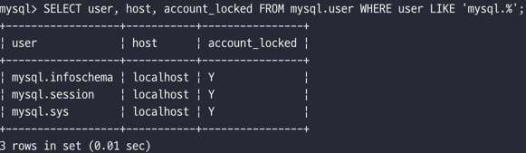
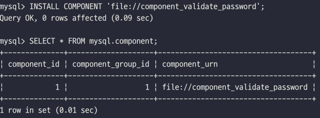
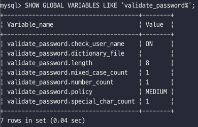
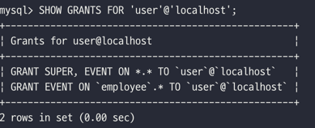
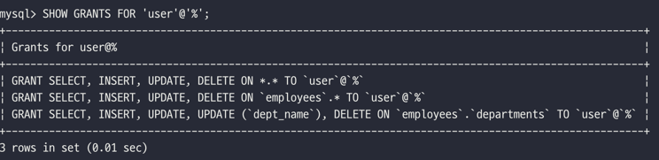
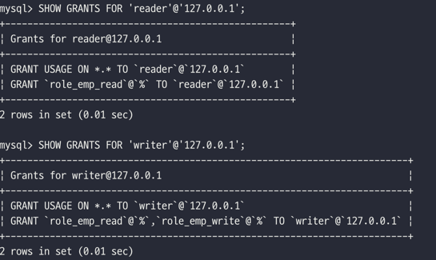
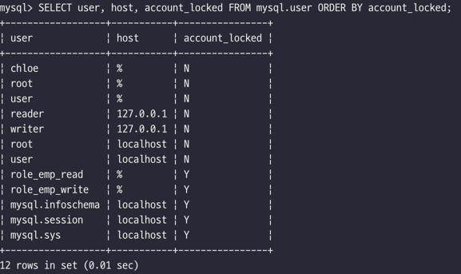
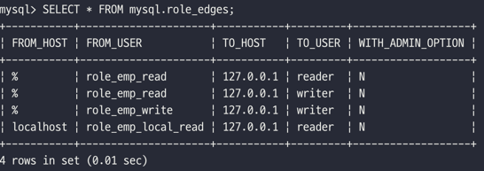

# 3장. 사용자 및 권한

[MySQL 8.0 Reference Manual](https://dev.mysql.com/doc/refman/8.0/en/)

[1. 사용자 식별](#1-사용자-식별)  
[2. 사용자 계정 관리](#2-사용자-계정-관리)  
[3. 비밀번호 관리](#3-비밀번호-관리)  
[4. 권한(Privilege)](#4-권한privilege)  
[5. 역할(Role)](#5-역할Role)

## 1. 사용자 식별

- MySQL의 사용자 계정에는 `사용자 아이디`와 `접속 지점`(호스트명, 도메인 또는 IP 주소)이 포함된다.
- MySQL에서 계정을 이용할 때는 항상 아이디와 호스트를 함께 명시해야 한다.  
  **e.g.** `'svc_id'@'127.0.0.1'`
- 모든 외부 컴퓨터에서 접속 가능한 계정을 생성하고 싶다면, 호스트 부분에 `'%'`문자를 사용하면 된다.  
  **e.g.** `'svc_id'@'%'`
- 서로 동일한 아이디가 있는 경우, MySQL은 권한이나 범위가 작은 것 부터 먼저 할당한다.

## 2. 사용자 계정 관리

### 시스템 계정과 일반 계정

- MySQL8.0 부터 `시스템 계정`과 `일반 계정`으로 구분된다.
    - 시스템 계정은 `SYSTEM_USER` 권한을 가지고 있다.
    - 시스템 계정도 일반 계정 처럼 사용자를 위한 계정이다.  
      (시스템 계정은 데이터베이스 서버 관리자를 위한 계정이며, 일반 계정은 응용 프로그램이나 개발자를 위한 계정으로 생각하면 된다.)
    - 시스템 계정과 일반 계정의 개념이 도입된 것은 DBA 계정에 `SYSTEM_USER` 권한을 할당하고, 일반 사용자에게는 `SYSTEM_USER` 권한을 부여하지 않기 위해서 이다.

- DB 서버 관리와 관련된 작업을 시스템 계정으로 수행
    - 계정 관리: 계정 생성 및 삭제, 계정의 권한 부여 및 제거
    - 다른 세션 또는 그 세션에서 실행중 중인 쿼리를 강제 종료
    - 스토어드 프로그램 생성 시 DEFINER를 타 사용자로 지정

#### MySQL 내장 계정

- MySQL에는 `'root'@'localhost'`를 제외하고 3개의 계정이 내장되어 있다.
- 이 계정들은 내부적으로 다른 목적으로 사용되므로 삭제하지 않도록 주의해야 한다.
    - `'mysql.sys'@'localhost'` : MySQL8.0부터 기본으로 내장된 sys 스키마의 객체(뷰, 함수, 프로시저)들의 `DEFINER`로 사용되는 계정
    - `'mysql.session'@'localhost'` : MySQL 플러그인이 서버로 접근할 때 사용되는 계정
    - `'mysql.infoschema'@'localhost'` : `information_schema`에 정의된 뷰의 `DEFINER`로 사용되는 계정
- 이 계정들은 초기에 잠겨 있는 상태(`account_locked`)이다.
    ```sql
    SELECT user, host, account_locked FROM mysql.user WHERE user LIKE 'mysql.%';
    ```
  

### 계정 생성

- MySQL5.7 버전까지는 GRANT 명령으로 권한의 부여와 동시에 계정 생성이 가능했다.
- MySQL8.0 버전부터는 계정 생성은 `CREATE USER` 명령으로, 권한 부여는 `GRANT` 명령으로 구분해서 실행해야 한다.

- 계정을 생설할 때는 다양한 옵션을 설정할 수 있다.
    - 계정의 인증 방식과 비밀번호
    - 비밀번호 관련 옵션 (비밀번호 유효 기간, 비밀번호 이력 개수, 비밀번호 재사용 불가 기간)
    - 기본 역할 (Role)
    - SSL 옵션
    - 계정 잠금 여부

- 일반적으로 많이 사용되는 사용자 생성 쿼리
    ```sql
    -- 사용자 생성
    CREATE USER 'user'@'localhost'
        IDENTIFIED WITH 'mysql_native_password' BY 'password'
        REQUIRE NONE
        PASSWORD EXPIRE INTERVAL 30 DAY
        ACCOUNT UNLOCK
        PASSWORD HISTORY DEFAULT
        PASSWORD REUSE INTERVAL DEFAULT 
        PASSWORD REQUIRE CURRENT DEFAULT;
  
    -- 사용자 확인
    SELECT user, host FROM mysql.user;
    ```

#### 계정 생성 옵션

- `IDENTIFIED WITH '인증 방식(인증 플러그인의 이름)'`: 사용자의 인증 방식과 비밀번호를 설정
    - 서버의 기본 인증 방식을 사용하려면, `IDENTIFIED WITH BY 'password'`로 명시하면 된다.
    - **대표적인 인증 방식**
        - `Native Pluggable Authentication`: MySQL5.7 까지 기본 인증 방식
        - `Caching SHA-1 Pluggable Authentication`: MySQL8.0 부터 기본 인증 방식
        - `PAM Pluggable Authentication`
        - `LDAP Pluggable Authentication`

      **cf.** `Caching SHA-1 Pluggable Authentication`은 SCRAM 인증 방식을 사용하는데, SCRAM 방식은 평문 비밀번호를 5000번 이상 암호화 해시 함수를 실행한다.
      SCRAM 인증은 무차별 대입 공격을 피할 수 있지만, 악의가 없는 정상 유저나 응용프로그램의 연결을 느리게 만든다. caching_sha2_password_digest_rounds 시스템 변수로
      SCRAM 인증 방식에서 해시 함수를 몇 번이나 실행할지 설정할 수 있다.
      (기본값과 최소 설정 가능값 모두 5000이다.)

    ```sql
    -- Native Authentication을 기본 인증 방식으로 설정
    SET GLOBAL default_authentication_plugin = "mysql_native_password";
    ```    

- `REQUIRE`: MySQL 서버에 접속할 때 암호화된 SSL/TLS 채널을 사용할지 여부를 설정

- `PASSWORD EXPIRE`: 비밀번호의 요효기간을 설정
    - `PASSWORD EXPIRE`: 계정 생성과 동시에 비밀번호 만료 처리
    - `PASSWORD EXPIRE NAVER`: 비밀번호 만료 기간 없음
    - `PASSWORD EXPIRE DEFAULT`: `default_password_lifetime` 시스템 변수에 저장된 기간으로 유효기간 설정(기본값 0)
    - `PASSWORD EXPIRE INTERVAL n DAY`: 오늘부터 n 일자 까지 유효기간 설정

- `PASSWORD HISTORY`: 이력에 남아있는 지밀번호는 재사용하지 못하게 하는 설정
    - `PASSWORD HISTORY DEFAULT`: `password_history` 시스템 변수에 저장된 개수만큼 비밀번호의 이력을 저장(기본값 0)
    - `PASSWORD HISTORY n`: 비밀번호의 이력을 최근 n개 까지만 저장
    ```sql
    SELECT * FROM mysql.password_history;
    ```
- `PASSWORD REUSE INTERVAL`: 한 번 사용했던 비밀번호의 재사용 금지 기간을 설정
    - `PASSWORD REUSE INTERVAL DEFAULT`: `password_reuse_interval` 시스템 변수에 저장된 기간으로 설정(기본값 0)
    - `PASSWORD REUSE INTERVAL n DAY`: n일자 이후에 비밀번호를 재사용할 수 있게 설정

- `PASSWORD REQUIRE`: 새로운 비밀번호로 변경할 때 현재 비밀번호가 필요한지 여부
    - `PASSWORD REQUIRE CURRENT`: 비밀번호를 변경할 때 현재 비밀번호 먼저 입력
    - `PASSWORD REQUIRE OPTIONAL`: 비밀번호를 변경할 때 현재 비밀번호를 입력하지 않아도 가능
    - `PASSWORD REQUIRE DEFAULT`: `password_require_current` 시스템 변수의 값으로 설정(기본값 OFF)

- `ACCOUNT UNLOCK`: 계정을 사용하지 못하게 잠글지 여부를 결정
    - `ACCOUNT LOCK`: 계정을 사용하지 못하게 잠금
    - `ACCOUNT UNLOCK`: 잠긴 계정을 다시 사용 가능 상태로 잠금 해제

## 3. 비밀번호 관리

### 고수준 비밀번호

- 비밀번호의 유효성 체크 규칙을 적용하려면 `validate_password` 컴포넌트를 이용하면 된다.
    ```sql
    -- 컴포넌트 설치
    INSTALL COMPONENT 'file://component_validate_password';
  
    -- 설치된 컴포넌트 확인
    SELECT * FROM mysql.component;
    ```
  

- `validate_password` 컴포넌트에서 제공하는 시스템 변수 확인
    ```sql
    SHOW GLOBAL VARIABLES LIKE 'validate_password%';
    ```
  

    - 비밀번호 정책
        - `LOW`: 비밀번호의 길이만 검증
        - `MEDIUM`: 비밀번호의 길이를 검증하며, 숫자와 대소문자, 특수문자의 배합을 검증
        - `STRONG`: MEDIUM 레벨의 검증을 모두 수행하며, 금칙어가 포함됐는지 여부 검증

- MySQL5.7 버전까지는 `validate_password`가 플러그인 형태로 제공됐지만, MySQL8.0 버전부터는 컴포넌트 형태로 제공된다.
    - 사용자 측면에서는 플러그인이나 컴포넌트 모두 거의 동일한 기능을 제공하며, 단지 제공되는 시스템 변수의 이름에만 차이가 있다.

### 이중 비밀번호

- 데이터베이스 계정의 비밀번호는 보안을 위해 주기적으로 변경해야 하지만 서비스를 모두 멈추지 않고는 비밀번호를 변경하지 못했었다.
- MySQL8.0 버전부터는 하나의 계정에 대해 2개의 비밀번호를 동시에 설정할 수 있다.
    - 최근에 변경된 비밀번호가 프라이머리(Primary)가 되고, 이전 비밀번호는 세컨더리(Secondary)가 된다.
    - 비밀번호 변경이 완료되면, 세컨더리 비밀번호는 꼭 삭제해야 하는 것은 아니지만 보안을 위해 삭제하는 것이 좋다.

## 4. 권한(Privilege)

- MySQL5.7 버전까지는 글로벌 권한과 객체 단위의 권한으로 구분되었다.
    - 글로벌 권한: 데이터베이스나 테이블 이외의 객체에 적용되는 권한  
      `GRANT` 명령으로 권한을 부여할 때 특정 객체를 명시하지 말아야 한다.
    - 객체 권한: 데이터베이스나 테이블을 제어하는데 필요한 권한  
      `GRANT` 명령으로 권한을 부여할 때 특정 객체를 명시해야 한다.
    - `ALL` 또는 `PRIVILEGES`: 글로벌 권한과 객체 권한 두서가지 용도로 사용될 수 있다.

- MySQL8.0 버전부터는 MySQL5.7 버전의 권한에서 동적 권한이 더 추가되었다.
    - 정적 권한: MySQL 서버의 소스코드에 고정적으로 명시돼 있는 권한
    - 동적 권한: (일부는 MySQL 서버에 명시돼 있기도 하지만) MySQL 서버가 시작되면서 동적으로 생성하는 권한  
      **e.g.** MySQL 서버의 컴포넌트나 플러그인이 설치되면 등록되는 권한

- MySQL5.7 버전까지는 `SUPER` 권한이 데이터베이스 관리를 위해 꼭 필요한 권한이었지만, MySQL8.0 부터는 `SUPER` 권한이 세부적으로 분리되었다.
    - 그래서 백업 관리자와 복제 관리자에게 개별적으로 필요한 권한만 부여할 수 있게 되었다.

#### 권한 부여

- 사용자에게 권한을 부여할 때는 `GRANT` 명령어를 사용한다.
    - 형식: `GRANT [privileges_list] ON [db.table] TO ['user'@'localhost'];`
- GRANT OPTION 권한은 다른 권한과 달리 명령의 마지막에 `WITH GRANT OPTION`을 명시해서 부여한다.  
  **e.g.** `GRANT ALL PRIVILEGES ON *.* TO 'root'@'%' WITH GRANT OPTION;` 

    ```sql
    -- 권한 확인
    SHOW GRANTS FOR 'user'@'localhost';
    SHOW GRANTS FOR CURRENT_USER;
    
    -- 글로벌 권한
    GRANT SUPER ON *.* TO 'user'@'localhost';
    
    -- DB 권한
    GRANT EVENT ON *.* TO 'user'@'localhost';
    GRANT EVENT ON employee.* TO 'user'@'localhost';
    ```
    - 글로벌 권한의 `ON` 절에는 항상 `*.*` 를 사용하게 된다.
    - `*.*`은 모든 DB의 모든 오브젝트(테이블과 스토어드 프로시저나 함수 등)를 포함해서 MySQL 서버 전체를 의미한다.

    

    ```sql
    -- 테이블 권한
    GRANT SELECT, INSERT, UPDATE, DELETE ON *.* TO 'user'@'%';
    GRANT SELECT, INSERT, UPDATE, DELETE ON employees.* TO 'user'@'%';
    GRANT SELECT, INSERT, UPDATE, DELETE ON employees.departments  TO 'user'@'%';
    GRANT SELECT, INSERT, UPDATE(dept_name), DELETE ON employees.departments  TO 'user'@'%';
    
    -- 권한 확인
    SHOW GRANTS FOR 'user'@'%';
    ```
    - privilege_list에는 구분자(,)를 써서 권한 여러 개를 동시에 명시할 수 있다.
    - DB 권한 범위는 테이블에 대해 부여할 수 없다.   
      **e.g.** `GRANT EVENT ON employees.departments TO 'user'@'localhost';`
    - 테이블 권한은 특정 DB의 특정 테이블에 대해서만 권한을 부여할 수 있다.
    - 칼럼에 부여할 수 있는 권한은 `DELETE`를 제외한 `INSERT`, `UPDATE`, `SELECT` 3가지 이다.
    - 테이블이나 칼럼 단위의 권한은 잘 사용하지 않는다.
    - 칼럼 하나에 권한을 설정하더라도 나머지 모든 테이블의 모든 칼럼에 대해서도 권한을 체크하기 때문에 전체적인 성능에 영향을 미칠 수 있다.
    - 칼럼 단위의 접근 권한이 꼭 필요하다면, 테이블에서 권한을 허용하고자 하는 칼럼만 별도의 뷰(VIEW)를 만들어 사용하는 방법을 생각해 볼 수 있다.

    

#### 권한 제거

- 사용자에게 권한을 제거할 때는 `REVOKE` 명령어를 사용한다.
    ```sql
    -- `user`@`localhost` 권한 제거
    REVOKE SUPER, EVENT ON *.* TO `user`@`localhost`; REVOKE EVENT ON `employee`.* TO `user`@`localhost`;
  
    -- `user`@`%` 권한 제거 
    REVOKE SELECT, INSERT, UPDATE, DELETE ON *.* TO `user`@`%`; 
    REVOKE SELECT, INSERT, UPDATE, DELETE ON `employee`.* TO `user`@`%`;
    ```

#### 권한 관련 테이블

<table>
  <tr>
    <th>구분</th>
    <th>저장소 테이블</th>
    <th>설명</th>
  </tr>
  <tr>
    <td rowspan="5">정적 권한 </td>
    <td>mysql.user</td>
    <td>계정 정보 & 계정이나 역할에 부여된 글로벌 권한</td>
  </tr>
  <tr>
    <td>mysql.db</td>
    <td>계정이나 역할에 DB 단위로 부여된 권한</td>
  </tr>
  <tr>
    <td>mysql.tables_priv</td>
    <td>계정이나 역할에 테이블 단위로 부여된 권한</td>
  </tr>
  <tr>
    <td>mysql.columns_priv</td>
    <td>계정이나 역할에 칼럼 단위로 부여된 권한</td>
  </tr>
  <tr>
    <td>mysql.procs_priv</td>
    <td>계정이나 역할에 스토어드 프로그램 단위로 부여된 권한</td>
  </tr>
  <tr>
    <td>동적 권한</td>
    <td>mysql.global_grants</td>
    <td>계정이나 역할에 부여되는 동적 글로벌 권한</td>
  </tr>
</table>

## 5. 역할(Role)

MySQL8.0 버전부터 권한을 묶어서 역할(Role)을 사용할 수 있게 되었다.

#### 역할 생성

- 역할을 제거할 때는 `CREATE ROLE ` 명령어를 사용한다.
    ```sql
    -- 역할 생성 
    CREATE ROLE 
        role_emp_read,
        role_emp_write;
    
    -- 역할에 권한을 부여
    GRANT SELECT ON employees.* TO role_emp_read;
    GRANT INSERT, UPDATE, DELETE ON employees.* TO role_emp_write;
    
    -- 계정 생성
    CREATE USER reader@'127.0.0.1' IDENTIFIED BY 'qwert';
    CREATE USER writer@'127.0.0.1' IDENTIFIED BY 'qwert';
    
    -- 계정에 역할을 부여
    GRANT role_emp_read TO reader@'127.0.0.1';
    GRANT role_emp_read, role_emp_write TO writer@'127.0.0.1';
    
    -- 권한 확인
    SHOW GRANTS FOR 'reader'@'127.0.0.1';
    SHOW GRANTS FOR 'writer'@'127.0.0.1';
    ```

  

#### 역할 활성화

- 그런데 지금 상태에서 reader나 writer 계정으로 로그인해서 employees DB의 데이터를 조회하거나 변경하려고 하면 **권한이 없다는 에러가 나타난다.**
  ```sql
  -- reader 계정 접속
  linux> mysql -h 127.0.0.1 -u reader -p
  
  -- 테이블 조회
  SELECT * FROM employees.employees LIMIT 10;
  ```

  

- reader 계정이 role_emp_read 역할을 사용할 수 있게 하려면 활성화 해야 한다.
    ```sql
    -- 활성화된 역할 조회
    SELECT current_role();
  
    -- 역할 활성화
    SET ROLE 'role_emp_read';
  
    -- 테이블 조회
    SELECT * FROM employees.employees LIMIT 10;
    ```

- MySQL 서버에 로그인할 때 역할을 자동으로 활성화할지 여부를 `activate_all_roles_login` 시스템 변수로 설정할 수 있다.

#### 역할 제거

- 역할을 제거할 때는 `DROP ROLE` 명령어를 사용한다.
    ```sql
    DROP ROLE role_emp_read;
    DROP ROLE role_emp_write;
    ```

#### 역할과 계정

- MySQL 서버 내부적으로 역할과 계정은 동일한 객체로 취급된다.
- mysql DB의 user 테이블을 조회하면 실제 권한과 계정이 구분 없이 조회된다.
    ```sql
    SELECT user, host, account_locked FROM mysql.user ORDER BY account_locked;
    ```
  
  
    - `account_locked` 칼럼의 값이 다른것을 제외하고 아무런 차이가 없다.
    - 역할을 `account_locked` 칼럼의 값이 `Y`로 설정되어, 로그인 용도로 사용할 수 없다.
    - `CREATE ROLE`에서 호스트를 명시하지 않았지만, 자동으로 모든 호스트(`%`)가 추가되었다.

- MySQL 서버 내부적으로 계정과 역할은 아무런 차이가 없으며, 관리자나 사용자가 볼 때도 역할인지 계정인지 구분하기 어렵다.
- **따라서, 역할과 계정을 명확히 구분하고자 한다면, 프리픽스를 활용해서 'role_'로 역할의 이름을 정하는 방법을 권장한다.**

#### 역할에서 호스트

- 역할의 호스트 부분이 어떤 영향을 미치는지 살펴보자.

    ```sql
    -- 호스트를 포함한 역할 생성 (기본적으로 역할의 호스트는 '%' 이다) 
    CREATE ROLE role_emp_local_read@localhost;
    -- 사용자 생성 (이미 생성되어 있다면 생략)
    CREATE USER reader@'127.0.0.1' IDENTIFIED BY 'qwert';
    -- 역할에 권한 부여
    GRANT SELECT ON employees.* TO role_emp_local_read@'localhost';
    -- 계정에 역할 부여
    GRANT role_emp_local_read@'localhost' TO reader@'127.0.0.1';
    ```
    - 위의 예제에서 사용자 계정(reader)은 employees DB 에 대해 `SELECT` 권한이 부여된다.
    - 즉, 계정에 역할을 부여할 때 역할의 호스트 부분은 아무런 영향이 없다.

#### 역할 관련 테이블

| 저장소 테이블 | 설명 |
|---|---|
| mysql.default_roles | 계정별 기본 역할 |
| mysql.role_edges | 역할에 부여된 역할 관계 그래프 |

