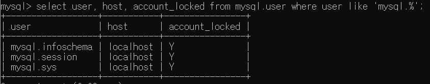
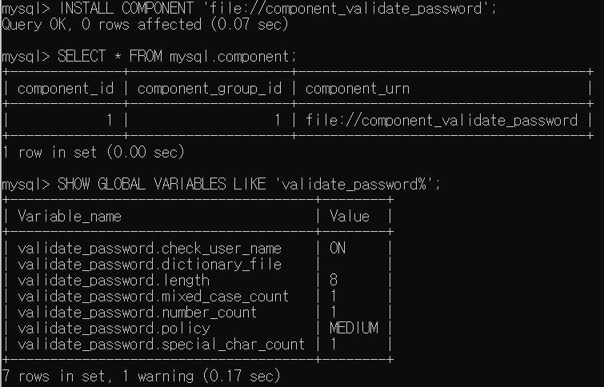

# 03. 사용자 및 권한


MySQL은 사용자 계정과 함께 접속 IP도 확인하며 MySQL8.0 버전부터 Role 개념을 도입

## 3.1 사용자 식별


`사용자 계정@HOST IP` 형식으로 접근. 동일한 사용자 아이디가 있고 HOST IP가 다른 경우, 범위가 좁은 것으로 우선 인식

```sql
svc_id@127.0.0.1
svc_id@%                 -- '%' 모든 HOST 에서 접근 가능
svc_id@192.168.0.10
```

## 3.2 사용자 계정 관리


### 3.2.1 시스템 계정과 일반 계정  

MySQL 8.0 부터 **`SYSTEM_USER 권한 여부에 따라 시스템/일반 계정을 구분.`** 

- 시스템 계정(System Account)
    - DBA
    - 시스템 계정, 일반 계정의 관리(계정 생성삭제 및 변경)
    - 다른 세션(Connection)에서 실행 중인 쿼리 강제 종료
    - 스토어드 프로그램 생성 시 DEFINER를 타 사용자로 설정  
    
    <br/>
    <aside>
    💡 <br/> 

    **스토어드 프로그램(Stored Program) 이란?**  

    [https://chinggin.tistory.com/268](https://chinggin.tistory.com/268)
    
    DEFINER?  
    [https://myinfrabox.tistory.com/232](https://myinfrabox.tistory.com/232)
    
    </aside>
    <br/>
    
- 일반 계정(Regular Account)
    - 응용 프로그램이나 개발자

<br/>


MySQL 서버에 내장된 기본 계정이 존재. 각기 다른 목적으로 이용되므로 삭제하지 않도록 유의!

- `‘mysql.sys’@’localhost’` : MySQL 8.0 부터 기본 내장된 sys 스키마의 객체들의 DEFINER로 사용되는 계정
- `‘mysql.session’@’localhost’` : MySQL 플러그인이 서버로 접근할 때 사용되는 계정
- `‘mysql.infoschema’@’localhost’`



### 3.2.2 계정 생성

- ~ MySQL 5.7
    - GRANT : 권한 부여 및 계정 생성
- MySQL 8.0 ~
    - GRANT : 권한 부여
    - CREATE USER : 계정 생성
    
<br/>

계정 생성 시 **계정 인증 방식과 비밀번호, 비밀번호 관련 옵션, Role, SSL 옵션, 계정 잠금 여부 설정 가능**

```sql
mysql> CREATE USER 'user@%'
                IDENTIFIED WITH 'mysql_native_password' BY 'password'
                REQUIRE NONE
                PASSWORD EXPIRE INTERVAL 30 DAY
                ACCOUNT UNLOCK
                PASSWORD HISTORY DEFAULT
                PASSWORD REUSE INTERVAL DEFAULT
                PASSWORD REQUIRE CURRENT DEFAULT;

-- Native Authentication 기본 인증 방식으로 설정
mysql> SET GLOBAL default_authentication_plugin="mysql_native_password"
```

- `IDENTIFIED WITH` : 사용자 인증방식
    - `Native Pluggable Authentication` : ~ MySQL 5.7 기본 인증 방식. 클라이언트가 보낸 비밀번호 값과 저장된 비밀번호의 해시값이 일치하는지 비교하는 방식
    - `Caching SHA-2 Pluggable Authentication` : MySQL 8.0 기본 인증 방식. Native Authentication 과 가장 큰 차이는 사용되는 암호화 해시 알고리즘의 차이이며, 보다 보완이 강화된 방식.  클라이언트 접속 시 SSL 옵션 활성화 필수.
    - PAM Pluggable Authentication
    - LDAP Pluggable Authentication
- `REQUIRE` : 서버 접속 시 암호화된 SSL/TLS 채널 사용 여부
    - 미설정시 비암호화 채널로 연결
    - Caching SHA-2 Authentication 인증 방식 사용 시, REQUIRE 옵션을 SSL 로 설정하지 않았더라도 암호화된 채널만으로 서버 접속 가능
- `PASSWORD EXPIRE` : 비밀번호 유효기간 설정 옵션
    - `PASSWORD EXPIRE` : 계정 생성과 동시에 비밀번호 만료 처리
    - `PASSWORD EXPIRE NEVER` : 계정 비밀번호의 만료 기간 없음
    - `PASSWORD EXPIRE DEFAULT` : 기본 옵션. `default_password_lifetime` 시스템 변수에 저장된 값으로 비민번호 유효기간 설정
    - `PASSWORD EXPIRE INTERVAL n DAY` : 오늘부터 n일자로 비밀번호 유효기간 설정
- `PASSWORD HISTORY` : 비밀번호 재사용 불가 옵션.
    - `PASSWORD HISTORY DEFAULT` : `password_history` 시스템 변수에 저장된 개수만큼 비밀번호 이력 저장. 이력에 남아있는 비밀번호 재사용 불가
    - `PASSWORD HISTORY n` : 최근 사용한 n개의 비밀번호 이력을 저장하여, 이력에 남아있는 비밀번호 재사용 불가
- `PASSWORD REUSE INTERVAL` : 사용했던 비밀번호 재사용 금지 기간 설정 옵션.
    - `PASSWORD REUSE INTERVAL DEFAULT` : 기본 옵션. `password_reuse_interval` 변수에 저장된 기간으로 설정
    - `PASSWORD REUSE INTERVAL n DAY` : n 일자 이후 재사용 가능하도록 설정
- `PASSWORD REQUIRE` : 비밀번호가 만료되어 새로운 비밀번호 변경 시 현재 비밀번호 필요 여부 결정 옵션.
    - `PASSWORD REQUIRE CURRENT` : 비밀번호 변경 시 현재 비밀번호 먼저 입력하도록 설정
    - `PASSWORD REQUIRE OPTIONAL` : 현재 비밀번호 입력하지 않아도 되도록 설정
    - `PASSWORD REQUIRE DEFAULT` : 기본 옵션. `password_require_current` 시스템 변수 값 설정
- `ACCOUNNT LOCK / UNLOCK` : 계정 생성 시 또는 ALTER USER 명령을 이용해 계정 정보 변경할 대 잠금 여부 옵션
    - `ACOOUNT LOCK` : 계정 사용하지 못하게 잠금
    - `ACCOUNT UNLOCK` : 잠긴 계정을 다시 사용 가능하도록 잠금 해제

<br/>

## 3.3 비밀번호 관리

### 3.2.1 고수준 비밀번호
`validate_password` 내장 컴포넌트를 이용해 비밀번호 유효성 체크 규칙 적용 가능.

```sql
-- 내장 컴포넌트 설치
mysql> INSTALL COMPONENT 'file://component_validate_password';

-- 설치된 컴포넌트 확인
mysql> SELECT * FROM mysql.component;

-- 컴포넌트에서 제공하는 시스템 변수 확인
mysql> SHOW GLOBAL VARIABLES LIKE 'validate_password%';
```

비밀번호 정책은 3가지로 구분

- LOW : `validate_password.length` 설정된 비밀번호 길이만 검증
- MEDIUM : **기본 정책**. LOW + `validate_password.number_count`설정된 숫자와 `validate_password.mixed_case_count` 대소문자 조합 + `validate_password.special_char_count` 특수문자 배합 검증
- STRONG : MEDIUM + `validate_password.dictionary_file` 설정된 금칙어 포함 여부 확인

금칙어 설정 시 금칙어가 입력된 파일 경로를 등록하고, 비밀번호 정책을 STRONG으로 설정

```sql
mysql> SET GLOBAL validate_password.dictionary_file='파일경로.확정자';
mysql> SET GLOBAL validate_password.policy='STRONG';
```

<aside>
💡 실습



</aside>

### 3.2.2 이중 비밀번호  


MySQL 8.0 ~ **계정의 비밀번호를 2개의 값을 동시에 사용 가능 한 이중 비밀번호 기능**이 추가 됨.

2개의 비밀번호는 프라이머리(Primary), 세컨더리(Secondary) 로 구분되며, 최근 설정된 비밀번호가 프라이머리, 이전 비밀번호가 세컨더리 이다.

```bash
## 비밀번호 변경, 프라이머리로 설정
mysql> ALTER USER 'root'@'localhjost' IDENTIFIED BY 'old_password';

## 비밀번호 변경 후 기존 비밀번호 = 세컨더리, 신규 비밀번호 = 프라이머리
mysql> ALTER USER 'root'@'localhost' IDENTIFIED BY 'new_password' RETAIN CURRENT PASSWORD
```


## 3.4 권한(Previlege)

- ~ MySQL 5.7
- `글로벌(Global) 권한` : 데이터 베이스나 테이블 이외의 객체에 적용되는 권한. GRANT  명령에서 특정 객체 명시하지 말야아 함,
- `객체 권한` : 데이터 베이스나 테이블을 제어하는데 필요한 권한. GRANT 명령어로 권한 부여시 반드시 특정 객체 명시해야 함.
- 예외) `ALL(or ALL PREVILEGES)` : 글로벌과 객체 권한 두 가지 용도 사용 가능. 글로벌 권한에 사용 시,  글로벌 수준에서 가능 한 모든 권한 부여. 객체 권한 부여 시, 해당 객체에 적용될 수 있는 모든 권한 부여.
- MySQL 8.0  ~
- ~ MySQL 5.7 의글로벌 & 객체 권한(정적 권한) 에 `동적 권한` 추가
- 동적 권한 : 서버가 시작되면서 동적으로 생성하는 권한 
정적 권한 : 서버의 소스코드에 고정적으로 명시돼 있는 권한

```sql
-- 사용자 권한 부여 예시
mysql> GRANT privilege_list ON db.table TO 'user'@'host';

-- 글로벌 권한
-- 특정 객체에 부여할 수 없기 때문에 *.* 사용
mysql> GRANT SUPER ON *.* TO 'user'@'localhost';

-- DB 권한
mysql> GRANT EVENT ON *.* TO 'user'@'localhost';
mysql> GRANT EVENT ON employees.* TO 'user'@'localhost';

-- 테이블 권한
mysql> GRANT SELECT,INSERT,UPDATE,DELETE ON *.* TO 'user'@'localhost';
mysql> GRANT SELECT,INSERT,UPDATE,DELETE ON employees.* TO 'user'@'localhost';
mysql> GRANT SELECT,INSERT,UPDATE,DELETE ON employees.department TO 'user'@'localhost';
```

| 구분 | 저장소 테이블 | 설명 |
| --- | --- | --- |
| 정적 권한 | mysql.user | 계정정보, 계정이나 역할에 부여된 글로벌 권한 |
|  | mysql.db | 계정이나 역할에 DB 단위로 부여된 권한 |
|  | mysql.tables_priv | 계정이나 역할에 테이블 단위로 부여된 권한 |
|  | mysql.columns_priv | 계정이나 역할에 칼럼 단위로 부여된 권한 |
|  | mysql.procs_priv | 계정이나 역할에 스토어드 프로그램 단위로 부여된 권한 |
| 동적 권한 | mysql.global_grants | 계정이나 역할에 부여되는 동적 글로벌 권한 |

## 3.5 역할(Role)

MySQL 8.0 ~ 부터 `권한을 묶어서 Role로 사용`. 내부적으로 `역할과 계정은 똑같은 모습`

```sql
-- role 생성
mysql> CREATE ROLE role_emp_read;

-- role 에 권한 부여
mysql> GRANT SELECT ON employees.* TO role_emp_read;

-- role 에 계정 부여
mysql> GRANT role_emp_read TO reader@127.0.0.1;

-- 부여된 권한 확인
mysql> SHOW GRANTS;
-- 부여된 권한을 표형태로 확인
mysql> SELECT * FROM mysql.default_roles;
mysql> SELECT * FROM mysql.role_edges;

-- 권한이 부여된 계정으로 로그인
window> mysql -u reader -h 127.0.0.1 -p
mysql> SELECT * FROM employees.employees;
ERROR 1142 (42000): SELECT command denied to user 'reader'@'localhost' for table 'employees'

-- 계정에 활성화된 역할 조회 -> 결과 empty
mysql> SELECT current_role();

-- 역할 활성화
mysql> SET ROLE 'role_emp_read';

-- 로그아웃 시에 역할 비활성화 시킴. 자동으로 활성화 시키기 위한 설정
mysql> SET GLOBAL activate_all_roles_on_login=ON;
```

`SELECT user, host FROM mysql.user` 쿼리 조회 시 역할과 계정 모두 조회되고 account_locked 필드를 제외하고는 거의 동일한 내용. 서버 내부적으로 역할과 계정을 별도로 구분하지 않음.