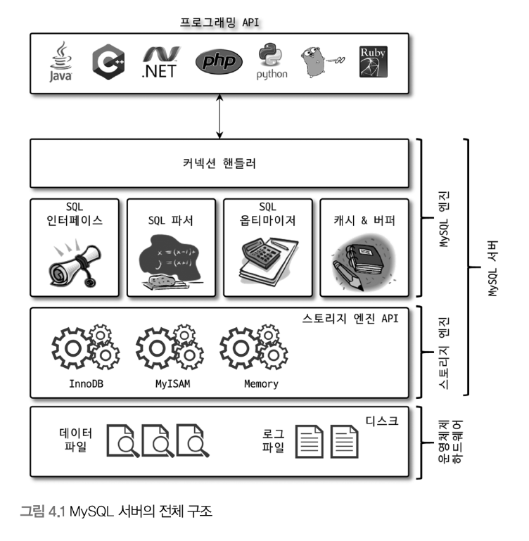

# 4장 아키텍처

## 4.1 MySQL 엔진 아키텍처



**4.1.1.1 MySQL 엔진**

- SQL 문장의 분석 최적화 등 DBMS의 두뇌에 해당하는 처리를 담당.
- 접속 및 쿼리 요청을 처리하는 커넥션 핸들러, SQL 파서 및 전처리기, 쿼리의 최적화된 실행을 위한 옵티마이저가 중심을 이룬다.

**4.1.1.2 스토리지 엔진**

- 실제 데이터를 디스크 스토리지에 저장하거나 디스크 스토리지로부터 데이터를 읽어오는 부분을 전담. DBMS의 손발 역할을 한다.
    
    ```sql
    -- 엔진을 지정하면 이후 해당 테이블의 모든 읽기작업이나 변경작업은 정의된 스토리지 엔진이 처리
    CREATE TABLE test_table (fd1 int, fd2 int) ENGINE=INNODB;
    ```
    

**4.1.1.3 핸들러 API**

- 핸들러 요청 : MySQL엔진이 데이터를 읽거나 쓸 때, 스토리지 엔진에 읽기, 쓰기를 요청하는 행위.
- 핸들러 API : 스토리지 엔진이 MySQL 엔진과 데이터를 주고 받을 때 사용하는 API
    
    
    
    핸들러 API 를 통한 작업을 볼 수 있다.
    

### 4.1.2 MySQL 스레딩 구조


- MySQL 서버는 프로세스 기반이 아니라 스레드 기반으로 동작
- 포그라운드 백그라운드 스레드로 구분
    
    ```sql
    -- MySQL 서버에 실행중인 목록
    SELECT thread_id, name, type, processlist_user, processlist_host
    FROM performance_schema.threads ORDER BY type, thread_id;
    ```
    

**4.1.2.1 포그라운드 스레드(클라이언트 스레드)**

- 각 클라이언트 사용자가 요청하는 쿼리 문장을 처리. 클라이언트 수 만큼 존재
- 사용자가 작업을 마치고 커넥션을 종료하면 스레드 캐시로 들어감
- 데이터를 MySQL의 데이터버퍼나 캐시로 부터 가져오며  없을경우, 디스크의 데이터나 인덱스 파일로부터 데이터를 읽어와서 작업을 처리.
- MyISAM 테이블은 디스크 쓰기작업까지 포그라운드가 처리
- InnoDB 테이블은 데이터 버퍼 캐시까지만 처리하고 디스크 쓰기작업은 백그라운드 스레드가 처리

**4.1.2.2 백그라운드 스레드**

- InnoDB 가 처리하는 백그라운드 작업
    - 인서트 버퍼를 병합하는 스레드
    - 로그를 디스크로 기록하는 스레드(Log thread) ★
    - InnoDB 버퍼 풀의 데이터를 디스크에 기록하는 스레드(Write thread) ★
    - 데이터를 버퍼로 읽어 오는 스레드
    - 잠금이나 데드락을 모니터링하는 스레드
- 데이터 쓰기 스레드와 데이터 읽기 스레드의 개수를 2개 이상 지정할 수 있게 되었다
    - 각각 innodb_write_io_threds , innodb_read_io_thread 시스템 변수로 스레드의 개수를 설정
    - 데이터를 읽는 작업은 주로 클라이언트 스레드에서 처리되기 때문에 많이 설정할 필요가 없지만, 쓰기 스레드는 많은 백그라운드 작업을 수행하기 때문에 디스크를 최적으로 사용할 수 있을 만큼 충분히 설정하는 것이 좋다.
- 사용자의 요청을 처리하는 도중 데이터의 쓰기 작업은 지연(버퍼링)되어 처리될 수 있지만 데이터의 읽기 작업은 절대 지연될 수 없다.
- InnoDB는 쓰기 작업시 데이터를 버퍼링하여 일괄처리 한다.

### 4.1.3 메모리 할당 및 사용 구조

- MySQL 메모리공간은 글로벌 메모리 영역과 로컬 메모리 영역으로 구분된다. 구분하는 기준은 MySQL 서버 내 많은 스레드가 공유해서 사용하는 공간인지 여부에 따라 구분된다.
- 글로벌 메모리영역의 메모리 공간은 MySQL 서버가 시작되면서 운영체제로부터 할당 받는데, 운영체제가 메모리를 할당하는 방식은 상당히 복잡하기 때문에 MySQL 시스템 변수로 설정해 둔 만큼 할당받는다고 생각해도 된다.

**4.1.3.1 글로벌 메모리 영역**

- 클라이언트 스레드의 수와 무관하게 하나의 메모리 공간만 할당. (필요에따라 2개도 가능)
- 모든 스레드에 의해 공유된다.
- 대표적인 글로벌 메모리 영역
    - 테이블 캐시
    - InooDB 버퍼 풀
    - InnoDB 어댑티브 해시 인덱스
    - InooDB 리두 로그 버퍼
    

**4.1.3.2 로컬 메모리 영역 ( = 세션 메모리 영역, 클라이언트 메모리 영역)**

- 클라이언트 스레드가 쿼리를 처리하는 데 사용하는 메모리 영역이다.
- 로컬메모리는 독립적으로 할당되며 절대 공유되어 사용되지 않는다.
- 각 쿼리의 용도별로 필요할 때만 공간이 할당되고, 그렇지 않을때에는 할당조차 하지 않을 수도 있다.
- 대표적인 로컬 메모리 영역
    - 정렬 버퍼(Sort buffer)
    - 조인 버퍼
    - 바이너리 로그 캐시
    - 네트워크 버퍼

### 4.1.4 플러그인 스토리지 엔진 모델

- 플러그인 모델은 스토리지 엔진뿐 아니라 검색어 파서, 사용자 인증방식 등 다양한 종류가 있다.
- 사용자가 직접 개발 및 커스텀해서 사용할 수도 있다.
- MySQL 쿼리 실행과정
    
    
    
    엔진과 스토리지 엔진의 처리영역. 대부분의 작업은 MySQL 엔진에서 처리되고, 읽기/쓰기만 스토리지 엔진이 처리한다.
    
- MySQL 엔진이 각 스토리지 엔진에게 데이터를 읽기 또는 저장을 명령하려면 반드시 핸들러를 통해야 한다.
- ‘Handler_’ 로 시작하는 상태변수 = MySQL엔진이 각 스토리지 엔진에게 보낸 멸령의 횟수를 의미하는 변수
- 하나의 쿼리 작업은 여러 하위 작업으로 나뉘는데. 각 하위 작업이 MySQL 엔진 영역에서 처리되는지 아니면 스토리지 엔진 영역에서 처리되는지 구분할 줄 알아야 한다.

- MySQL에서 지원하는 스토리지 엔진
    
    
    
    MySQL에서 지원하는 스토리지 엔진
    
    - Support 컬럼
        - YES: MySQL 서버에 해당 스토리지 엔진이 포함되어 있고, 사용가능으로 활성화된 상태.
        - DEFAULT: YES와 동일한 상태이지만 필수 스토리지 엔진임을 의미.
        - NO: 현재 MySQL 서버에 포함되지 않았음을 의미
        - DISABLED: 현재 MySQL 서버에는 포함됐지만 파라미터에 의해 비활성화된 상태임

- 플러그인 목록


### 4.1.5 컴포넌트

- MySQL 8.0 부터 플러그인 아키텍처를 대체하기 위해 도입. 플러그인의 단점들을 보완한다.
    1. 플러그인은 오직 MySQL 서버와 인터페이스할 수 있고, 플러그인끼리는 통신할 수 없음.
    2. 플러그인은 MySQL 서버의 변수나 함수를 직접 호출하기 때문에 안전하지 않음(캡슐화 안 됨)
    3. 플러그인은 상호 의존 관계를 설정할 수 없어서 초기화가 어려움
    

### 4.1.6 쿼리 실행 구조


**4.1.6.1 쿼리 파서**

- 사용자 요청으로 들어온 쿼리 문장을 토큰으로 분리해 트리형태의 구조로 만든다.
- 기본문법 오류를 여기서 감지하고 사용자에게 오류를 전달한다.

**4.1.6.2 전처리기**

- 파서 트리를 기반으로 구조적인 문제가 있는지 확인 (객체 존재여부, 권한 등)

**4.1.6.3 옵티마이저 ★★★(매우중요)**

- 사용자의 요청으로 드렁온 쿼리 문장을 최적화
- DBMS의 두뇌에 해당

**4.1.6.4 실행엔진**

- 사람으로 치면 손과 발에 해당되며, 실행 엔진은 만들어진 계획대로 각 핸들러에게 요청해서 받은 결과를 또 다른 핸들러 요청의 입력으로 연결하는 역할을 수행한다.

**4.1.6.5 핸들러(스토리지 엔진)**

- MySQL 서버의 가장 밑단에서 데이터를 디스크로 저장하고 디스크로부터 읽어오는 역할을 담당.
- MyISAM 테이블을 조작하는경우 핸들러가 MyISAM 스토리지 엔진이 되고, InnoDB 테이블을 조작하는 경우 핸들러가 InnoDB 스토리지 엔진이 된다.

<aside>
💡 회사로 비유하면 옵티마이저는 회사의 경영진, 실행엔진은 중간관리자, 핸들러는 각 업무의 실무자로 볼 수 있다.

</aside>

### 4.1.8 쿼리 캐시

- SQL 실행결과를 메모리에 캐시하고, 동일한 요청이 왔을때 테이블을 읽지않고 즉시 결과를 반환. 매우 빠른 성능을 보였으나 각종 버그로 인해 MySQL 8.0 부터는 완전히 제거되었다.

### 4.1.9 스레드 풀

- 스레드 풀은 내부적으로 사용자의 요청을 처리하는 스레드 개수를 줄여서 동시 처리되는 요청이 많다 하더라도 MySQL 서버의 CPU가 제한된 개수의 스레드 처리에만 집중할 수 있게 해서 서버의 자원 소모를 줄이는 것이 목적이다.
- 스레드 풀은 CPU 코어개수 만큼 스레드 그룹을 생성한다. 따로 변경도 가능하지만, 일반적으로 CPU 코어의 개수와 맞추는 것이 좋다.
- 스레드풀 관련 시스템 변수들
    - thread_pool_size : 스레드 그룹 개수
    - thread_pool_max_threads : 스레드풀 최대 스레드 개수
    - thread_pool_oversubscribe : 추가 가능한 스레드 개수
    - thread_pool_stall_limit : 스레드 작업 제한시간. 이 변수에 설정된 시간 통해 처리를 기다릴지 새로운스레드를 추가할지가 결정된다.
    

### 4.1.10 트랜잭션 지원 메타데이터

- 테이블 구조 정보와 스토어드 프로그램 등의 정보를 데이터 딕셔너리 또는 메타데이터라고 한다.
- 8.0 이전에는 메타데이터를 파일로 저장해(트랜잭션 지원 X) 서버 비정상 종료시 정합성에 문제가 생겼다.
이를 해결하기 위해 8.0부터는 메타데이터를 InnoDB 테이블에 저장하도록 개선하였다.
- 이러한 메타데이터들은 mysql(스키마) DB에 저장된다.
- mysql DB는 통째로 mysql.ibd라는 이름의 테이블 스페이스에 저장된다. (관리에 주의를 요함)

<aside>
💡 mysql 스키마에서 테이블 목록을 살펴보면 실제 테이블의 구조가 저장된 테이블은 보이지 않는다.
사용자가 임의로 수정하지 못하게 화면에 보이지 않을뿐 실제 테이블은 존재한다.
대신 information_schema DB의 TABLES와 COLUMNS 등과 같은 뷰를 통해 조회할 수 있다.


</aside>

## 4.2 InnoDB 스토리지 엔진 아키텍처


### 4.2.1 프라이머리 키에 의한 클러스터링

- InnoDB의 모든 테이블은 기본적으로 프라이머리 키를 기준으로 클러스터링되어 저장된다. (프라이머리 키 값의 순서대로 디스크에 저장된다는 뜻)
- 모든 세컨더리 인덱스는 레코드의 주소 대신 프라이머리 키의 값을 논리적인 주소로 사용한다.
- 프라이머리 키가 클러스터링 인덱스이기 때문에 프라이머리 키를 이용한 레인지 스캔은 상당히 빠르다.
- 프라이머리 키는 기본적으로 다른 보조 인덱스에 비해 비중이 높게 설정

<aside>
💡 클러스터링 인덱스 : *페이지를 알고 있어서 해당 페이지를 바로 펼침*
세컨더리 인덱스 : *목차에서 찾고자 하는 내용의 페이지를 찾고 나서 해당 페이지로 이동*

[https://soyeon207.github.io/db/2021/07/06/index-theory.html](https://soyeon207.github.io/db/2021/07/06/index-theory.html)

</aside>

### 4.2.2 외래 키 지원

- InnoDB에서 외래 키는 부모 테이블과 자식 테이블 모두 해당 칼럼에 인덱스 생성이 필요하고, 변경 시에는 반드시 부모 테이블이나 자식 테이블에 데이터가 있는지 체크하는 작업이 필요하므로 잠금이 여러 테이블로 전파되고, 그로 인해 데드락이 발생할 때가 많으므로 개발할때에도 외래 키의 존재에 주의하는 것이 좋다.
- foreign_key_checks 시스템 변수를 OFF 로 설정 시 외래 키 관계에 대한 체크 작업을 일시로 멈출 수 있다.

### 4.2.3 MVCC(Multi Version Concurrency Control)

- 잠금을 사용하지 않는 일관된 읽기를 제공하는데 목적이 있다. InnoDB는 Undo log를 기반으로 이 기능을 구현한다.
- INSERT , UPDATE 작업 절차
    1. INSERT & COMMIT 시 InnoDB 버퍼풀 및 데이터파일(디스크)에 저장
    2. UPDATE 시(Commit X) 버퍼풀에 새로운 데이터 저장 언두로그에 기존 데이터 저장. 
    (데이터 파일에는 InnoDB 스토리지 엔진의 백그라운드 스레드가 저장하기 때문에 시점에따라 다를 수 있음.)
    3. 커밋하지 않은 상태에서 SELECT 시 어떤 데이터가 조회?
        
        → 격리 수준에 따라 다르다. transaction_isolation 시스템변수를 사용하며, 격리 수준에는READ_UNCOMMITTED, READ_COMMITTED, REPEATABLE_READ, SERIALIZABLE 가 있다.
        
        
        
    4. COMMIT : InnoDB는 더 이상의 변경 작업 없이 현재 상태를 영구적인 데이터로 만듦. 
    ROLLBACK : 언두영역에 있는 데이터를 버퍼풀로 복구하고 언두 영역의 내용을 삭제한다.

### 4.2.4 잠금 없는 일관된 읽기

- InooDB는 MVCC기술을 이용해 잠금을 걸지 않고 읽기 작업을 수행한다.
- 사용자 A가 특정 레코드 변경작업을 실행하는 도중 사용자 B 가 해당 레코드를읽어도 A의 작업과 관계 없이 항상 잠금을 대기하지 않고 바로 실행된다.
- InnoDB는 변경되기 전의 데이터를 읽기 위해 언두로그를 사용한다.
- 트랜잭션이 길어지면 MySQL 서버가 느려지거나 발생할 때가 가끔 있는데 잠금없는 일관된 읽기를 하기 위해 언두로그가 계속 유지되기 때문에 발생하는 문제이다. 따라서 트랜잭션은 가급적 빨리 완료해주는것이 좋다.

### 4.2.5 자동 데드락 감지

- InnoDB 스토리지 엔진은 내부적으로 잠금이 교착 상태에 빠지지 않았는지 체크하기 위해 잠금 목록을 그래프 (Wait-for List)형태로 관리한다.
- 데드락 감지 스레드가 주기적으로 잠금대기 그래프를 검사해 교착상태에 빠진 트랜잭션을 찾아 그 중 하나를 강제 종료한다. (기준은 언두로그의 양)
- InnoDB 스토리지 엔진은 MySQL 엔진에서 관리되는 테이블 잠금(LOCK TABLES 명령)은 볼 수가 없어서 데드락 감지가 불확실할 수도 있는데 innodb_table_locks 변수를 활성화하 테이블 레벨의 잠금까지 감지할 수 있다.
- 데드락 감지 스레드는 잠금 목록을 검사해야 하기 때문에 잠금 상태가 변경되지 않도록 잠금 목록이 저장된 리스트에 새로운 잠금을 건다.
- 데드락 감지 스레드가 느려지면 서비스 쿼리를 처리중인 스레드는 작업을 진행하지 못하고 대기, 서비스에 악영향을 미치게 된다.
- innodb_deadlock_detect 시스템 변수로 자동 데드락 감지 스레드를 사용하지 않도록 설정할 수 있다.
이 경우 데드락에 빠지면 무한정 대기 하기 때문에 innodb_lock_wait_timeout 시스템 변수를 활성화하여 타임아웃 시간을 짧게 설정해주는것이 좋다.

### 4.2.6 자동화된 장애 복구

- InnoDB는 손실 장애로부터 데이터를 보호하기 위한 여러가지 메커니즘이 탑재되어 있다.
- InnoDB 데이터 파일은 기본적으로 MySQL 서버가 시작될 때 항상 자동 복구를 수행한다.
- 자동 복구중 복구될 수 없는 손상이 있다면 MySQL 서버는 종료된다.
    - 이 경우 innodb_force_recovery 시스템 변수를 설정해서 서버를 시작해야한다.
    - innodb_force_recovery 는 1~6까지 있으며 숫자가 올라갈수록 심각한 상황이다.
- 위 경우에도 MySQL 서버가 시작되지 않으면 백업 및 바이너리 로그로 복구해야 한다.

### 4.2.7 InnoDB 버퍼 풀 ★

- InnoDB 스토리지 엔진에서 가장 핵심적인 부분이다.
- 디스크의 데이터 파일이나 인덱스 정보를 메모리에 캐시해 두는 공간이다.
- 쓰기작업을 지연시켜 일괄처리하는 버퍼 역할도 한다.
- 데이터를 변경하는 쿼리는 이곳저곳에 위치한 레코드를 변경하기 때문에 랜덤한 디스크 작업을 발생시키는데 버퍼의 일괄처리를 통해 이러한 현상을 줄일 수 있다.

**4.2.7.1 버퍼 풀의 크기 설정**

- 운영체제와 각 클라이언트 스레드가 사용할 메모리를 충분히 고려해서 설정해야 한다.
- InnoDB 버퍼 풀의 크기를 적절히 작은 값으로 설정해서 조금씩 상황을 봐가며 증가시키자.
- innodb_buffer_pool_size 시스템 변수로 크기를 설정할 수 있다.
- 버퍼풀 사이즈 변경은 크리티컬한 변경이므로 서버가 한가할 때 진행하는게 좋다.
- innodb_buffer_pool_instances 시스템 변수를 이용해 버퍼 풀을 여러개로 분리해서 관리할 수 있다. 이를 통해  내부 잠금 경합을 줄일 수 있음.
- 반드시 매뉴얼의 내용을 숙지하고 진행
    
    > https://dev.mysql.com/doc/refman/8.0/en/innodb-buffer-pool-resize.html
    > 

**4.2.7.2 버퍼 풀의 구조**

- InnoDB 스토리지 엔진은 버퍼 풀이라는 거대한 메모리 공간을 페이지 크기의 조각으로 쪼개어 엔진이 데이터를 필요로 할 때 해당 데이터 페이지를 읽어서 각 조각에 저장한다.
- 버퍼 풀의 페이지 크기 조각 관리 자료구조
    - LRU 리스트 : LRU + MRU (Least/Most Recently Used) 로 디스크로부터 한번 읽어온 페이지를 최대한 오랫동안 InnoDB 버퍼풀의 메모리에 유지해서 디스크 읽기를 최소화 함.
        - InnoDB 스토리지 엔진에서 데이터를 찾는 과정
            1. 필요한 레코드가 저장된 데이터 페이지가 버퍼 풀에 있는지 검사
            2. 디스크에서 필요한 데이터를 버퍼 풀에 적재하고, 적재된 페이지에 대한 포인터를 LRU 헤더 부분에 추가
            3. 버퍼풀의 LRU 헤더 부분에 적재된 데이터 페이지가 실제로 읽히면 MRU 헤더 부분으로 이동
            4. 사용자 쿼리가 얼마나 최근에 접근했는지에 따라 데이터페이지에 나이(Age)가 부여되고, 나이가 오래되면(Aging) 버퍼풀에서 제거 된다. 데이터페이지가 쿼리에의해 사용되면 나이가 젊어지고 MRU의 헤더 부분으로 옮겨진다.
            5. 필요한 데이터가 자주 접근됐다면 해당 페이지의 인덱스 키를 어댑티브 해시 인덱스에 추가
    - Flush 리스트 : 디스크로 동기화되지 않은 데이터를 가진 데이터 페이지(=더티 페이지)의 변경 시점 기준의 페이지 목록을 관리
    - Free 리스트 : 버퍼 풀에서 실제 사용자 데이터로 채워지지 않은 비어 있는 페이지들의 목록을 관리. 일단 한 번 데이터 변경이 가해진 데이터 페이지는 플러시 리스트에 관리되고 특정 시점이 되면 디스크로 기록 돼야 한다.
- 데이터가 변경되면 InnoDB는 변경 내용을 리두로그에 기록하고 버퍼 풀의 데이터 페이지에도 변경 내용을 반영한다. 그래서 리두 로그의 각 엔트리는 특정 데이터 페이지와 연결된다.
- InnoDB 스토리지 엔진은 체크 포인트를 발생 시켜 리두 로그와 데이터 페이지의 상태를 동기화 한다.
- 체크 포인트는 MySQL 서버가 시작될 때 InnoDB 엔진이 리두 로그의 어느 부분부터 복구를 실행해야 할지 판단하는 기준점을 만드는 역할을 한다.

**4.2.7.3 버퍼 풀과 리두 로그**

- InnoDB 에서 버퍼 풀과 리두 로그는 매우 밀접한 관계를 맺고 있다.
- 버퍼 풀은 데이터 베이스 서버 성능 향상을 위해 데이터 캐시와 쓰기 버퍼링이라는 두가지 용도가 있다.

**4.2.7.4 버퍼 풀 플러시(Buffer Pool Flush)**

- InnoDB 스토리지 엔진은 버퍼 풀에서 아직 디스크로 기록되지 않은 더티 페이지들을 성능상의 악영향 없이 디스크에 동기화하기 위해 플러시 리스트 플러시, LRU 리스트 플러시  2가지의 기능을 백그라운드 실행한다.

**4.2.7.4.1 플러시 리스트 플러시**

- 오래된 리두 로그 공간이 지워지려면 반드시 버퍼풀의 더티페이지가 먼저 디스크로 동기화돼야 한다. 이를 위해 주기적으로 플러시 리스트 플러시 함수를 호출해서 플러시 리스트에서 오래전에 변경된 데이터 페이지 순서대로 디스크에 동기화하는 작업을 수행한다.
- 이때 언제부터 얼마나 많은 더티 페이지를 한 번에 디스크로 기록하느냐에 따라 사용자의 쿼리가 부드럽게 처리된다. (관련 시스템 변수는 p114 참조)
- 더티 페이지를 디스크로 동기화하는 스레드를 클리너 스레드라고 한다.
- innodb_page_cleaners 와 innodb_buffer_pool_instances는 되도록 동일한 값으로 설정하자
- 버퍼 풀에 더티 페이지가 많을수록 디스크 쓰기 폭발 현상(Disk IO Burst)이 발생할 가능성이 높아진다.
InnoDB 엔진 스토리지에서는 일정 수준 이상의 더티 페이지가 발생하면 조금씩 디스크에 기록한다.
- 어댑티브 플러시 알고리즘은 리두 로그의 증가 속도를 분석해서 적절한 수준의 더티 페이지가 버퍼 풀에 유지될 수 있도록 디스크 쓰기를 실행한다.

**4.2.7.4.2 LRU 리스트 플러시**

- InnoDB 스토리지 엔진은 LRU 리스트에서 사용 빈도가 낮은 데이터 페이지들을 제거해서 새로운 페이지들을 읽어올 공간을 만들어야 하는데, 이를 위해 LRU 리스트 플러시 함수가 사용된다.

**4.2.7.5 버퍼 풀 상태 백업 및 복구**

- InnoDB 서버의 버퍼 풀은 쿼리의 성능에 매우 밀접하게 연결돼 있다.
- 버퍼풀에 쿼리들이 사용할 데이터가 준비(워밍업 상태)돼있기 때문에 만약 서버를 셨다운했다가 다시 시작한 쿼리 성능이 평상시보다 안좋아진다.
- 5.6부터는 위와 같은 상황을 대비하기 위해 InnoDB의 버퍼풀 상태를 백업 및 복구할 수 있다.
- InnoDB 스토리지는 백업 및 복구를 자동으로 해주는 기능을 제공한다.

**4.2.7.6 버퍼 풀의 적재 내용 확인**

- MySQL 8.0 부터 information_schema 데이터베이스에 innodb_cached_indexes 테이블을 통해 테이블의 인덱스별로 데이터 페이지가 얼마나 InnoDB 버퍼풀에 적재돼 있는지 확인할 수 있다.
    
    
    
- 테이블 전체 페이지 중에서 대략 어느정도 비율이 InnoDB 버퍼 풀에 적재돼 있는지 다음과같이 확인할 수 있다.
    
    


### 4.2.8 Double Write Buffer


### 4.2.9 언두로그

- 트랜잭션과 격리 수준을 보장하기 위해 변경되기 이전 버전의 데이터를 별도로 백업한다. 이렇게 백업된 데이터를 언두로그라고 한다.

**4.2.9.1 언두 로그 레코드 모니터링**

- 트랜잭션이 종료됐다고 해서 언두로그가 바로 삭제되는 것은 아니다. 다른 유저가 해당 레코드에 대해 조회중이면 해당 레코드에 대한 쓰기 및 변경작업이 계속되면 언두로그는 계속 증가한다.
- MySQL 5.7, 8.0 부터는 언두로그 공간에 대한 문제가 완전히 해결됐다.
- 8.0부터는 언두로그를 돌아가면서 순차적으로 사용해 디스크 공간을 줄이는 것도 가능하며 때로는 서버가 필요한 시점에 사용공간을 자동으로 줄여주기도 한다.

**4.2.9.2 언두 테이블스페이스 관리**

- 언두 로그가 저장되는 공간을 테이블스페이스라고 한다.
- 예전에는 테이블 스페이스 파일에 같이 저장이 되었으나 8.0.14부터 외부의 별도 로그파일로 기록되도록 개선되었다

### 4.2.10 체인지 버퍼

- InnoDB는 변경해야 할 인덱스 페이지가 버퍼 풀에 있으면 바로 업데이트를 수행하지만 그렇지 않고 디스크로부터 읽어와서 업데이트해야 한다면 이를 즉시 실행하지 않고 임시공간에 저장해 두고 바로 사용자에게 결과를 반환하는 형태로 성능을 향상시키게 되는데, 이때 사용하는 임시 메모리 공간을 체인지 버퍼라고 한다.

### 4.2.11 리두 로그 및 로그 버퍼

- 서버가 비정상적으로 종료됐을 때 데이터 파일에 기록되지 못한 데이터를 잃지 않게 해주는 안전장치다.
- MySQL을 포함 대부분의 데이터베이스 서버는 데이터 변경 내용을 로그로 먼저 기록한다.
- 비 정상 종료가 발생하면 리두 로그의 내용을 토대로 데이트파일의 복구를 진행한다.
- 리두 로그는 트랜잭션이 커밋되면 즉시 디스크로 기록되도록 시스템 변수를 설정하는것을 권장한다.
- 리두 로그 파일들의 전체 크기는 InnoDB 스토리지 엔진이 가지고 있는 버퍼 풀의 효율성을 결정하기 때문에 신중히 결정해야 한다.

**4.2.11.1 리두 로그 아카이빙**

- MySQL 8.0의 리두 로그 아카이빙 기능은 데이터 변경이 많아서 리두 로그가 덮어쓰인다고 하더라도 백업이 실패하지 않게 해준다.

**4.2.11.2 리두 로그 활성화 및 비활성화**

- 트랜잭션이 커밋돼도 데이터 파일은 즉시 디스크로 동기화되지 않는 반면, 리두 로그(트랜잭션 로그)는 항상 디스크로 기록된다.
- 리두 로그가 비활성화된 상태에서 MySQL 서버가 비정상적으로 종료된다면 MySQL 서버의 마지막 체크포인트 이후 시점의 데이터는 모두 복구할 수 없게 된다.

### 4.2.12 어댑티브 해시 인덱스

- InnoDB 스토리지 엔진에서 사용자가 자주 요청하는 데이터에 대해 자동으로 생성하는 인덱스이다.
- 자주 읽히는 데이터 페이지의 키 값을 이용해 해시 인덱스를 만들고, 필요할 때마다 어댑티브 해시 인덱스를 검색해서 레코드가 저장된 데이터 페이지를 즉시 찾아갈 수 있다.
- 해시 인덱스는 인덱스 키값과 데이터 페이지 주소의 쌍으로 관리된다.
- 어댑티브 해시 인덱스는 버퍼 풀에 올려진 데이터 페이지에 대해서만 관리된다.
- 어댑티브 해시 인덱스가 성능향상에 크게 도움이 되지 않는 경우
    - 디스크 읽기가 많은 경우
    - 특정 패턴의 쿼리가 많은 경우(조인 ,LIKE)
    - 매우 큰 데이터를 가진 레이블의 레코드를 폭넓게 읽는 경우
- 어댑티브 해시 인덱스가 성능향상에 도움이 되는 경우
    - 디스크의 데이터가 InnoDB 버퍼풀 크기와 비슷한 경우(디스크 읽기가 많지 않은 경우)
    - 동등 조건 검색(동등비교와 IN 연산자)이 많은 경우
    - 쿼리가 데이터 중에서 일부 데이터에만 집중되는 경우
- 어댑티브 해시 인덱스의 도움을 많이 받을수록 테이블 삭제 또는 변경작업은 더 치명적인 작업이 된다.
- 어댑티브 해시 인덱스 적용에 대한 판단을 할 수 있는 가장 쉬운 방법은 MySQL 서버의 상태 값들을 살펴보는 것이다.

### 4.2.13 InnoDB와 MyISAM, MEMORY 스토리지 엔진 비교

- 8.0 버전 부터는 MySQL 서버의 모든 기능을 InnoDB 스

## 4.3 MyISAM 스토리지 엔진 아키텍처

### 4.3.1 키 캐시

- InnoDB의 버퍼 풀과 비슷한 역할을 하는 것이 키 캐시이다.
- 인덱스만을 대상으로 작동하고 인덱스의 디스크 쓰기 작업에 대해서만 부분적으로 버퍼링 역할을 한다.
- 키 캐시를 이용한 쿼리의 비율을 99% 이상으로 유지하는것을 권장한다.

### 4.3.2 운영체제의 캐시 및 버퍼

- MyISAM 테이블의 데이터 읽기나 쓰기 작업은 항상 운영체제의 디스크 읽기 또는 쓰기 작업으로 요청될 수밖에 없다.
- 운영체제의 캐시 공간은 남는 메모리를 사용하는 것이 기본원칙이다.
- 키캐시를 최대 물리 메모리의 40% 이상을 넘지 않도록 설정한다.

### 4.3.3 데이터 파일과 프라이머리 키(인덱스) 구조

- MyISAM 테이블은 프라이머리 키에 의한 클러스터링 없이 데이터 파일이 힙 공간처럼 활용된다.
- MyISAM 테이블에 저장되는 레코드는 모두 ROWID 라는 물리적인 주솟값을 가진다.
- 프라이머리키와 세컨더리 인덱스는 모두 데이터파일에 저장된 레코드의 ROWID 값을 포인터로 가진다.
- ROWID는 가변길이와 고정길이 두가지 방법으로 저장될 수 있다.

## 4.4 MySQL 로그 파일

- 로그 파일을 이용하면 MySQL의 상태나 부하를 일으키는 원인을 쉽게 찾아서 해결할 수 있다.

### 4.4.1 에러 로그 파일

- 에러나 경고 메시지가 출력되는 로그 파일이다.

**4.4.1.1 MySQL이 시작하는 과정과 관련된 정보성 및 에러 메시지**

- 비정상적으로 종료된 후에는 반드시 에러로그 파일을 통해 설정된 변수의 이름이나 값이 명확하게 설정되고 의도한 대로 적용됐는지 확인해야한다.

**4.4.1.2 마지막으로 종료할 때 비정상적으로 종료된 경우 나타내나는 InnoDB 트랜잭션 복구 메시지**

- InnoDB의 경우 MySQL서버가 비정상 또는 강제 종료됐다면 완료되지 못한 트랜잭션을 정리하고 디스크에 기록되지 못한 데이터가 있다면 다시 기록하는 재처리 작업을 하게 된다.

**4.4.1.3 쿼리 처리 도중 발생하는 문제에 대한 에러 메시지**

- 쿼리 도중 발생하는 문제점은 사전 예방이 어려우며, 그래서 에러로그파일을 자주 검토하는 것이 숨겨진 문제점을 해결하는데 도움이 된다.

**4.4.1.4 비정상적으로 종료된 커넥션 메시지**

- 클라이언트 어플리케이션에서 정상적으로 접속종료를 하지 못하고 프로그램이 종료된 경우 기록된다.

**4.4.1.5 InnoDB의 모니터링 또는 상태 조회 명령(SHOW ENGINE INNODB STATUS 같은)의 결과 메시지**

- InnoDB의 모니터링을 활성화하게 되면 에러 로그 파일이 매우 커지기 때문에, 모니터링을 사용한 이후에는 다시 비활성화해서 파일이 커지지 않게 만들어야 한다.

**4.4.1.6 MySQL의 종료 메시지**

- MySQL이 마지막으로 종료되면서 출력한 메시지를 확인하는 것이 왜 서버가 종료됐는지 확인하는 유일한 방법이다.

### 4.4.2 제네럴 쿼리 로그 파일(제네럴 로그 파일, General log)

- 실행쿼리에 대해 전체 목록을 뽑아서  검토해 볼 때가 있는데 쿼리 로그를 활성화해서 쿼리를 쿼리로그파일로 기록하게 한 다음, 그 파일을 검토하면 된다.

### 4.4.3 슬로우 쿼리 로그

- 쿼리 튜닝은 서비스가 적용되기 전에 전체적으로 튜닝하는 경우와 서비스 운영 중에 서버의 전체적인 성능저하를 검사하거나 정기적인 점검을 위한 튜닝으로 나눌 수 있다.
- long_query_time 시스템 변수에 설정된 이상의 시간이 소요된 쿼리가 모두 기록된다.
- 슬로우 쿼리 로그는 파일 내용이 상당히 많아서 직접 쿼리를 하나씩 검토하기에는 시간이 너무 많이 걸리거나 튜닝을 해야할 대상 쿼리를 식별하기 어려울 수도 있다.
- Percona Toolkit 의 pt-query-digest 스크립트를 이용하면 쉽게 빈도나 처리 성능별로 쿼리를 정렬해서 살펴볼 수 있다.

**4.4.3.1 슬로우 쿼리 통계**

**4.4.3.2 실행 빈도 및 누적 실행 시간순 랭킹**

**4.4.3.3 쿼리별 실행 횟수 및 누적 실행 시간 상세 정보**