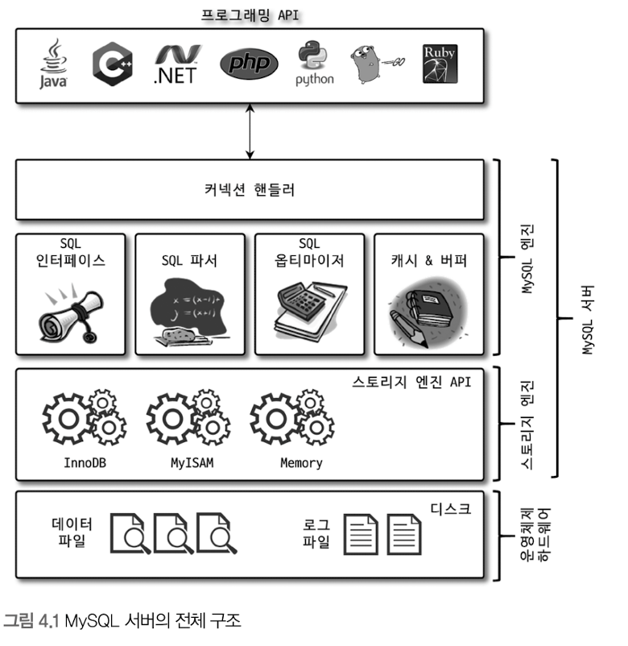
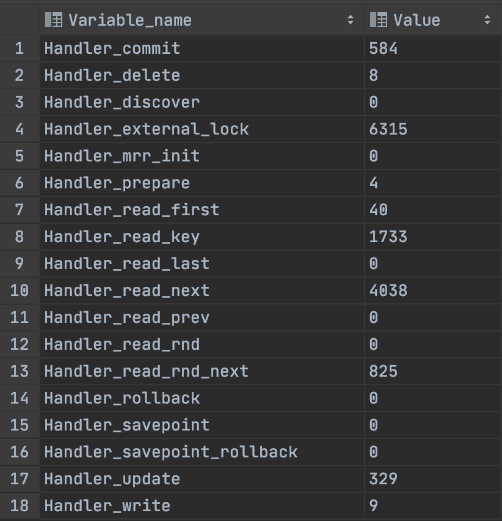

# 4장 아키텍처

- MySQL 서버의 구성
    - MySQL 엔진
    - 스토리지 엔진
        - InnoDB 스토리지 엔진
        - MyISAM 스토리지 엔진

## 4.1 MySQL 엔진 아키텍처

### 4.1.1 MySQL 전체 구조



### 4.1.1.1 MySQL 엔진

- MySQL 서버의 두뇌 역할
- 클라이언트 접속 및 쿼리 요청 처리하는 커넥션 핸들러, SQL 파서 및 전 처리기, 쿼리의 최적화된 실행을 위한  옵티마이저로 구성
- 표준 SQL 문법을 지원하기 때문에 표준 문법에 따라 작성된 쿼리는 타 DBMS와 호환되어 실행할 수 있다

### 4.1.1.2 스토리지 엔진

- MySQL 서버의 손과 발 역할
- 실제 데이터를 디스크 스토리지에 저장하거나 디스크 스토리지로부터 데이터를 읽어오는 기능을 담당
- 여러 개를 동시에 사용할 수 있다
    
    ```sql
    CREATE TABLE test_table(fd1 INT, fd2 INT) ENGINE=INNODB;
    ```
    
    - `test_table` 에 작업이 발생하면 `InnoDB` 스토리지 엔진이 처리를 담당한다
- 스토리지 엔진은 성능 향상을 위해 키 캐시(MyISAM), InnoDB 버퍼 풀(InnoDB)과 같은 기능을 내장한다

### 4.1.1.3 핸들러 API

- 쿼리 실행기에서 데이터를 쓰거나 읽어야 할 때 각 스토리지 엔진에 읽기/쓰기 요청을 하는 것을 `핸들러` 요청이라하고 여기서 사용하는 API를 `핸들러 API` 라 한다
- InnoDB 스토리지 엔진 또한 이 핸들러 API를 이용하여 MySQL 엔진과 데이터를 주고 받는다

```sql
SHOW GLOBAL STATUS LIKE 'Handler%';
```



- 핸들러 API를 통해 얼마나 많은 데이터 작업이 있었는지 확인할 수 있다

### 4.1.2 MySQL 스레딩 구조


- MySQL 서버는 `스레드` 기반으로 작동하며 `포그라운드 스레드`, `백그라운드 스레드` 로 구분된다
- 실행 중인 스레드 목록은 `performance_schema.thread` 에서 확인할 수 있다

```sql
SELECT thread_id, name, type, processlist_user, processlist_host
  FROM performance_schema.threads;
```


- 사용자 요청 스레드는 `포그라운드` 로 동작한다. (위 사진에서 40번째 line)
- 백그라운드 스레드 개수는 MySQL 서버 설정에 따라 가변적일 수 있다
- 동일 이름의 스레드는 동일 작업을 병렬 처리하는 경우이다

**스레드 모델과  스레드 풀의 차이점**

- 스레드 모델: 커넥션 별로 포그라운드 스레드가 하나씩 생성 및 할당
- 스레드 풀: 스레드와 커넥션이 `1:N` 관계를 가진다

### 4.1.2.1 포그라운드 스레드(클라이언트 스레드)

- 최소한 MySQL 서버에 접속된 클라이언트 수만큼 존재하며, 사용자 요청의 쿼리 문장을 처리한다
- 클라이언트가 작업을 마치고 커넥션을 종료하면 스레드는 다시 `스레드 캐시(thread cache)` 로 돌아간다
    - 스레드 캐시에 일정 개수 이상 대기 중인 스레드가 있는 경우에는 스레드를 종료하여 스레드 수를 관리
    - 스레드 캐시에 유지할 수 있는 최대 스레드 개수는 `thread_cache_size` 로 관리한다
- 데이터를 MySQL의 데이터 버퍼나 캐시로부터 가져온다
    - 버퍼나 캐시에 없는 경우 직접 디스크의 데이터나 인덱스 파일로부터 데이터를 읽어온다
- `MyISAM 테이블` : 디스크 쓰기 작업까지 포그라운드 스레드에서 처리
- `InnoDB 테이블` : 데이터 버퍼나 캐시까지만 처리, 나머지는 백그라운드 스레드에서 처리

### 4.1.2.2 백그라운드 스레드

- InnoDB 백그라운드 스레드 작업
    - 인서트 버퍼(Insert Buffer)를 병합하는 스레드
    - **로그를 디스크로 기록하는 스레드**
    - **InnoDB 버퍼 풀의 데이터를 디스크에 기록하는 스레드**
    - 데이터를 버퍼로 읽어오는 스레드
    - 잠금이나 데드락을 모니터링하는 스레드
- MySQL 5.5 버전부터 데이터 쓰기/읽기 스레드 개수를 2개 이상 지정할 수 있게 되었다
    - `innodb_write_io_threads` : 일반적으로 2~4, DAS나 SAN과 같은 스토리지의 경우 충분히 설정
    - `innodb_read_io_threads` : 데이터 읽는 작업은 백그라운드에서 이루어지므로 많이 설정할 필요가 없다
- 사용자 요청 처리 도중 데이터의 쓰기 작업의 처리
    - `InnoDB` : 쓰기 작업을 버퍼링하여 일괄 처리, 쿼리로 데이터 변경되는 경우 데이터가 디스크의 데이터 파일로 완전히 저장될 때까지 기다리지 않아도 된다
    - `MyISAM` : 사용자 쓰레드가 쓰기 작업까지 함께 처리, 일반적인 쿼리는 쓰기 버퍼링 기능을 사용할 수 없다

### 4.1.3 메모리 할당 및 사용 구조


- 메모리 공간 구성
    - 글로벌 메모리 영역
    - 로컬 메모리 영역

### 4.1.3.1 글로벌 메모리 영역

- 클라이언트의 수와 무관하게 하나의 메모리 공간만 할당 ⇒ 필요에 따라 2개 이상의 메모리 공간을 할당
- 글로벌 영역이 N개라 하더라도 모든 스레드에 의해 공유되는 영역
- 대표적인 글로벌 메모리 영역
    - 테이블 캐시
    - InnoDB 버퍼 풀
    - InnoDB 어댑티브 해시 인덱스
    - InnoDB 리두 로그 버퍼

### 4.1.3.2 로컬 메모리 영역

- 또는 세션 메모리 영역. 클라이언트 스레드가 쿼리를 처리하는 데 사용하는 영역
- 클라이언트 스레드가 사용하는 메모리 공간, `클라이언트 메모리 영역`
    - 클라이언트와 서버와의 커넥션을 세션이라고 하여 `세션 메모리 영역`이라고도 함
- 로컬 메모리는 클라이언트 스레드 별로 독립적이며 공유되지 않는다
- 로컬 메모리 공간을 적절하게 설정하지 않는 경우 MySQL 서버가 멈출 수 있다
- 각 쿼리의 용도별로 필요할 때만 공간이 할당되고 필요하지 않는 경우 할당조차 하지 않는다
- 대표적인 로컬 메모리 영역
    - 정렬 버퍼
    - 조인 버퍼
    - 바이너리 로그 캐시
    - 네트워크 버퍼

### 4.1.4 플러그인 스토리지 엔진 모델


- MySQL은 기본적으로 제공되는 스토리지 엔진 이외의 부가적인 기능을 더하기 위한 플러그인 모델을 지원
    - 전문 검색 엔진을 위한 검색어 파서
    - 사용자 인증을 위한 Native Authentication, Caching SHA-2 Authentication
- MySQL 쿼리 실행 과정
    
    
    
    - 사용자가 스토리지 엔진을 만드는 경우 DBMS 전체의 기능이 아닌 그림과 같이 데이터 읽기/쓰기 부분을 담당하는 스토리지 영역에서 동작하는 엔진을 작성하게 된다
    - 데이터 읽기/쓰기 작업은 대부분 `1건의 레코드 단위`로 처리된다
    - MySQL 엔진은 `핸들러` 를 통해 스토리지 엔진에게 데이터를 읽거나 저장하도록 명령을 전달한다
        - `MyISAM` 과 `InnoDB` 스토리지 엔진은 읽기/쓰기 영역의 처리만 차이가 있다
- 스토리지 엔진
    
    ```sql
    SHOW ENGINES;
    ```
    
    
    
    - Support
        - YES: 스토리지 엔진 포함 및 활성화 상태
        - DEFAULT: YES와 동일하지만 필수 스토리지 엔진
        - NO: 포함되지 않음 ⇒ 사용 시 MySQL 서버를 다시 빌드해야 한다
        - DISABLED: 포함되어있지만 비활성화 상태
- 플러그인
    
    ```sql
    SHOW PLUGINS;
    ```
    
    
    

### 4.1.5 컴포넌트

- 플러그인의 단점을 보완하기 위해 MySQL 8.0부터 지원
- 플러그인의 단점
    - 오직 MySQL 서버와 인터페이스할 수 있고 플러그인끼리는 통신할 수 없다
    - MySQL 서버 변수나 함수를 직접 호출하기 때문에 안전하지 않다(캡슐화x)
    - 플러그인은 상호 의존 관계를 설정할 수 없어서 초기화가 어렵다
- 컴포넌트 설치
    
    ```sql
    INSTALL COMPONENT 'file://component_validate_password';
    
    SELECT * FROM mysql.component;
    ```
    

### 4.1.6 쿼리 실행 구조


### 4.1.6.1 쿼리 파서

- 쿼리 문장을 토큰(MySQL이 인식할 수 있는 최소 단위)으로 분리하여 트리 형태의 구조로 만든다
- 기본 문법의 오류를 검증하고 오류메시지를 사용자에게 전달한다

### 4.1.6.2 전처리기

- 파서 트리를 기반으로 쿼리 문장의 구조적 문제점을 확인한다
- 각 토큰을 테이블 이름,컬럼 이름, 내장 함수 개체와 매핑하여 객체 존재 여부와 접근 권한을 확인한다

### 4.1.6.3 옵티마이저

- 사용자 요청 쿼리 문장을 저렴한 비용으로 ㅂ가장 빠르게 처리할지를 결정하는 역할을 담당한다

### 4.1.6.4 실행 엔진(쿼리 실행기)

- 옵티마이저에서 작성한 실행 계획을 각 핸들러에게 요청하고 받은 결과를 또 다른 핸들러에게 전달하는 역할을 담당한다

### 4.1.6.5 핸들러(스토리지 엔진)

- MySQL 서버의 가장 밑단에서 MySQL 실행 엔진의 요청에 따라 데이터를 저장하거나 읽어오는 역할

### 4.1.7 복제

### 4.1.8 쿼리 캐시(deprecated)

- 빠른 응답을 필요로 하는 웹 기반의 응용프로그램에서 중요한 역할을  담당
- SQL 실행 결과를 캐시하고, 즉시 결과를 반환하여 빠른 성능을 보였음
    - 단, 테이블 데이터가 변할 경우 동시 성처리 성능 저하를 유발
- MySQL 8.0버전에서는 기능이 완전히 제거되었다

### 4.1.9 스레드 풀

- 엔터프라이즈 에디션에서만 제공한다
- 커뮤니티 버전은 Percona Server에서 제공하는 플러그인 형태의 스레드 풀을 사용한다
- 내부적으로 사용자 요청을 처리하는 스레드 개수를 줄여 서버 자원 소모를 줄이는 것을 목적으로 한다
- 스케줄링 과정에서 CPU 시간을 제대로 확보하지 못하는 경우 쿼리 처리가 더 느려질 수 있다
- 스레드 그룹의 개수는 `thread_pool_size` 로 변경할 수 있다 ⇒ CPU 코어에 맞추는 것이 좋다
- 서버에서 처리할 요청을 스레드 풀로 이관할 때 스레드 풀에서 모두 작업을 처리중인 경우에는 `thread_pool_oversubscribe` 변수의 개수만큼 추가로 받아서 처리한다
- 스레드 그룹에 새로운 작업 스레드를 추가할 지 기존 작업 스레드 처리를 기다릴 지 `thread_pool_stall_limit` 변수를 사용하여 현재 처리 중인 작업을 끝내지 못하면 새로운 스레드를 생성해서 추가한다
- 전체 스레드 풀에 있는 스레드 개수는 `thread_pool_max_thread` 만큼 초과할 수 없다
- Percona Server 스레드 풀 플러그인은 특정 트랜잭션이나 쿼리를 우선적으로 처리할 수 있는 기능을 제공
    - 먼저 시작된 트랜잭션 내 sQL을 빨리 처리해줘서 잠금을 빨리 해제하여 성능을 향상시킨다

### 4.1.10 트랜잭션 지원 메타데이터

- 테이블의 구조 정보와 스토어드 프로그램 등의 정보를 `데이터 딕셔너리` 또는 `메타데이터` 라고 한다
- 5.7 버전
    - 테이블 구조를 FRM 파일에 저장하고 일부 스토어드 프로그램 또한 파일(*.TRN, *.TRG, *.PAR)로 관리
    - 파일기반의 메타데이터는 생성 및 변경 작업 시 트랜잭션을 지원하지 않기 때문에 비정상 종료 시 일관되지 않은 살태로 남는 문제가 발생하였다
- 8.0버전
    - InnoDB
        - 테이블 구조 정보나 스토어드 프로그램의 코드 관련 정보를 트랜잭션 기반의 `InnoDB` 테이블에 저장
            - 스키마 변경 중간에 서버가 비정상적으로 종료된다하더라도 완전한 성공 또는 완전한 실패로 정리
        - MySQL 시스템 테이블을 InnoDB 스토리지 엔진을 사용하도록 개선
        - 시스템 테이블과 데이터 딕셔너리 정보를  `mysql` DB에 저장
        - `mysql` DB는 통째로 `mysql.ibd` 라는 테이블 스페이스에 저장된다 ⇒ 주의할 것
        - 데이터 딕셔너리 저장 테이블은 사용자가 수정하지 못하도록 화면에 노출되지 않지만 실제 테이블은 존재한다
            
            ```sql
            SHOW CREATE TABLE INFORMATION_SCHEMA.TABLES; 
            ```
            
    - MyISAM 이나 CSV 같은 스토리지 엔진(InnoDB 이외)
        - SDI(Serialized Dictionary Information) 파일을 이용 ⇒ 기존 FRM 파일과 동일한 역할
            - InnoDB 테이블의 구조도 SDI 파일로 변환이 가능
- idb2sdi 유틸리티로 메타데이터 조회하기

```bash
linux> ibd2sdi mysql_data_dir/mysql.ibd > mysql_schema.json
linux> cat mysql_schema.json
```

## 4.2 InnoDB 스토리지 엔진 아키텍처


- InnoDB 스토리지 엔진은 유일하게 `레코드 기반의 잠금`을 제공한다.
    - 높은 동시성 처리, 안정적이며 성능이 뛰어나다

### 4.2.1 프라이머리 키에 의한 클러스터링

- 모든 테이블은 기본적으로 `프라이머리 키`를 기준으로 클러스터링되어 저장 ⇒ 프라이머리 키 순서대로 저장
- 모든 세컨더리 인덱스는 레코드의 주소 대신 프라이머리 키의 값을 논리주소로 사용한다
- 따라서 프라이머리 키를 이용한 레인지 스캔이 상당히 빨리 처리된다
    - 다른 보조 인덱스에 비해 비중이 높게 설정된다(실행 계획에서 보조 인덱스보다 우선순위를 가짐)

### 4.2.2 외래 키 지원

- 서버 운영의 불편함 때문에 생성하지 않는 경우도 많음 ⇒ 개발 환경에서는 데이터베이스 가이드 역할을 한다
- 외래 키는 부모, 자식 테이블에 모두 인덱스 생성이 필요하다
- 잠금이 여러 테이블로 전파되어 데드락이 발생할 수 있어서 사용에 주의를 해야 한다
- 외래 키 관계 설정을 일시적으로 멈출 수 있다
    
    ```sql
    SET foreign_key_checks=OFF;
    // 작업 실행
    SET foreign_key_checks=ON;
    ```
    
    - 데이터의 일관성 유지는 필요하다
    - 기본적으로 `SESSION` 변수로 동작하므로 생략해도 동일하다

### 4.2.3 MVCC(Multi Version Concurrency Control)

- 레코드 레벨의 트랜잭션을 지원하는 DBMS가 제공하는 기능
- `잠금을 사용하지 않는 일관된 읽기`를 제공
- InnoDB는 `언두 로그(Undo Log)` 를 이용해 이 기능을 구현한다
- 멀티 버전이라 함은 하나의 레코드에 대해 여러 개의 버전이 동시에 관리된다는 의미이다
- 테이블 데이터 변경 처리 동작 순서
    1. `UPDATE` 문장이 실행되면 커밋 여부와 관계 없이 InnoDB 버퍼 풀에 새로운 값을 업데이트 한다
    2. InnoDB 버퍼풀에서 업데이트 된 문장은 언두 로그로 복사된다
    
     3. 1.에서 변경된 데이터를 조회하는 경우 트랜잭션 격리 상황에 따라 데이터 반환 위치가 결정된다
    
    - `READ_UNCOMMITTED` : InnoDB 버퍼풀 데이터를 반환
    - `READ_COMMITTED`, `REPEATABLE_READ`,  `SERIALIZABLE` : 언두 로그에서 데이터 반환
    1. COMMIT/ROLLBACK
        - `COMMIT` : 현재 상태를 영구 저장한다
        - `ROLLBACK` : 언두 영역에 있는 백업된 데이터를 InnoDB 버퍼풀로 복구, 언두 영역의 내용 삭제

### 4.2.4 잠금 없는 일관된 읽기(Non-Locking Consistence Read)


- 격리 수준이 `SERIALIZABLE` 이 아닌 경우 항상 잠금을 대기하지 않고 바로 실행된다
- 특정 사용자가 레코드를 변경하고 커밋을 하지 않아더라도 SELECT 작업을 방해하지 않는다
- 활성 트랜잭션이 오래 지속되면 일관된 읽기를 위해 언두 로그를 삭제하지 못해 성능에 영향이 있을 수 있다
    - 트랜잭션이 시작되면 가능한 빨리 롤백/커밋을 해야 한다

### 4.2.5 자동 데드락 감지

- 잠금 교착 상태를 체크하기 위해 잠금 대기 목록을 그래프(Wait - for List) 형태로 관리
- 데드락 감지 스레드가 주기적으로 잠금 대기 그래프를 검사해 교착 상태에 빠진 트랜잭션을 강제 종료한다
    - `언두 로그` 의 양이 적은 트랜잭션을 강제 종료한다 ⇒ 롤백 처리 시 부하가 덜하기 때문
- `innodb_table_locks` 변수를 활성화 하면 테이블 레벨의 잠금도 감지할 수 있다 ⇒ 활성화 권장
- 동시 처리 스레드가 많아 지거나 트랜잭션이 가진 잠금이 많아지는 경우 데드락 감지 스레드가 느려질 수 있다
    - 서비스 쿼리를 처리중인 스레드는 대기하게 되면서 악영향을 미치게 된다
    - `innodb_deadlock_detect` 변수로 데드락 감지 스레드를 ON/OFF 할 수 있다
        - OFF 시  데드락 무한대기에 빠질 수 있음
    - `innodb_lock_wait_timeout` 시스템 변수로 데드락 대기 시간을 지정할 수 있다

### 4.2.6 자동화된 장애 복구

- 서버 시작 시 완료되지 못한 트랜잭션, 디스크에 일부만 기록된 데이터 페이지의 복구 작업이 자동 진행된다
- InnoDB 데이터 파일은 기본적으로 서버가 시작될 때 항상 자동 복구를 시작한다
- 자동 복구가 안되는 경우 `innodb_force_recovery`  변수를 설정해서 서버를 시작한다
    - 0이 아닌 복구 모두에서는 `INSERT`, `UPDATE`, `DELETE` 쿼리는 사용할 수 없다
- 파일 손상 여부 검사 과정([https://dev.mysql.com/doc/refman/8.0/en/forcing-innodb-recovery.html](https://dev.mysql.com/doc/refman/8.0/en/forcing-innodb-recovery.html))
    - InnoDB 로그 파일 손상: 6
    - InnoDB 테이블의 데이터 파일 손상: 1
    - 문제를 알 수 없는 경우 1 ⇒ 6 순서로 시작

### 4.2.7 InnoDB 버퍼 풀

- 디스크의 데이터 파일이나 인덱스 정보를 메모리에 캐시해두는 공간이다
- 쓰기 작업을 지연시켜 일괄 작업으로 처리해주는 버퍼 역할
- `INSERT`, `UPDATE`, `DELETE` 등 랜덤 디스크 작업을 모아서 처리하여 작업 횟수를 줄일 수 있다

### 4.2.7.1 버퍼 풀의 크기 설정

- 적절히 작은 값으로 설정해서 증가시키는 방법이 최적이다  ⇒ 운영체제의 `전체 메모리의 50%` 에서 시작
- `innodb_buffer_pool_size`으로 동적으로 버퍼풀 크기를 변경할 수 있다
    - 리소스가 없을 때 하는 것이 좋다 ⇒ 부하 우려
- 기존에는 버퍼 풀 전체를 관리하는 잠금으로 인해 경합이 있었는데 8.0버전에서 개선되었다
    - 버퍼 풀을 여러개로 쪼개서 관리하게 변경됨 ⇒  `innodb_buffer_pool_instances`
    - 버퍼 풀 인스턴스는 기본적으로 8개로 초기화, 메모리가 1GB 이하일 경우 1개만 생성한다

### 4.2.7.2 버퍼 풀의 구조

- 버퍼 풀은 `innodb_page_size` 페이지 크기 만큼 조각으로 쪼개어 데이터 페이지를 저장한다
- 버퍼 풀 페이지 조각 관리 자료구조
    - `LRU(Least Recently Used)`
        
        
        
        - 데이터 찾는 순서
            1. 필요한 레코드가 저장된 데이터 페이지가 버퍼 풀에 있는지 검사
                1. InoDB 어댑티브 해시 인덱스를 이용해 페이지 검색
                2. 해당 테이블의 인덱스(B-Tree)를 이용해 버퍼 풀에서 페이지 검색
                3. 버퍼 풀에 이미 데이터 페이지가 있었다면 해당 페이지의 포인터를 MRU 방향으로 승급
            2. 디스크에서 필요한 데이터 페이지를 버퍼 풀에 적재하고, 적재된 페이지에 대한 포인터를 LRU 헤더 부분에 추가 
            3. 버퍼 풀의 LRU 헤더 부분에 적재된 데이터가 실재로 읽히면 MRU 헤더부분으로 이동
            4. 버퍼 풀 상주 데이터 페이지는 `나이(age)` 에 따라 위/아래로 이동
            5. 필요한 데이터가 자주 접근됐다면 해당 페이지의 인덱스 키를 어댑티브 해시 인덱스에 추가
    - `플러시(Flush) 리스트`
        - 디스크로 동기화되지 안은 데이터(더티 페이지)의 변경 시점 기준의 페이지 목록을 관리한다
        - 한 번 데이터 변경이 가해진 데이터만 플러스 리스트에 관리되고 특정 시점이 되면 디스크에 기록되어야 한다
        - 데이터가 변경되면 `리두 로그` 에 기록하고 버퍼 풀의 데이터 페이지에도 변경을 반영
        - `리두 로그` 의 각 엔트리는 특정 데이터 페이지와 연결된다
        - 리두 로그가 디스크로 기록되어도 데이터 페이지가 디스크로 기록됨을 보장하지 못한다
            - `체크포인트` 를 사용하여 리두 로그와 데이터 페이지를 동기화한다
    - `프리(Free) 리스트`
        - 실제 사용자 데이터로 채워지지 않은 비어 있는 페이지 목록
        - 사용자 쿼리를 디스크에서 읽어와야할 경우 사용한다

### 4.2.7.3 버퍼 풀과 리두 로그


- 버퍼 풀은 클린 페이지, 더티 페이지(INSERT, UPDATE, DELETE 명령으로 변경된 데이터)로 구성된다
- 더티 페이지는 디스크와 메모리의 데이터 상태가 다르기 때문에 언젠가는 디스크로 기록되어야 한다
- 더티 페이지가 버퍼 풀에 영원히 머무를 수 없으니 리두 로그 파일에 연결해서 사용한다
- 리두 로그는 더티페이지와 연결된 `활성 리두 로그` , `비활성 리두 로그` 로 구성된다
    - 활성 리두 로그는 재사용 불가능한 공간을 의미한다
- 리두 로그 파일의 공간은 재사용되지만 기록될 때마다 로그 포지션은 증가하게 된다
    - `LSN(Log Sequence Number)`
- InnoDB는 주기적으로 체크포인트 이벤트로 리두로그와 버퍼 풀의 더티페이지를 동기화한다
    - 가장 최근 체크포인트 지점이 LSN 활성 리두 로그 공간의 시작점이 된다
    - 최근 체크포인트 지점의 LSN과 마지막 리두 로그 지점의 차이를 `체크포인트 에이지` 라 한다
    - 체크포인트가 발생하면 체크포인트 LSN보다 작은 리두 로그의 더티 페이지는 모두 동기화 대상이 된다

### 4.2.7.4 버퍼 풀 플러시(Buffer Pool Flush)

- 8.0 버전 이후부터 더티 페이지를 디스크에 동기화할 때 발생했던 폭증 현상이 발생하지 않게 되었다
- 더티 페이지의 성능을 악영향없이 동기화하기 위한 2개의 플러시 기능을 백그라운드로 실행한다
    - 플러시 리스트(Flush_list) 플러시
    - LRU 리스트(LRU_list) 플러시

### 4.2.7.4.1 플러시 리스트 플러시

- 플러시 리스트에서 오래전에 변경된 데이터 페이지 순서대로 디스크에 동기화하는 작업을 수행한다
- 더티 페이지를 디스크로 동기화하는 스레드를 `클리너 스레드(Cleaner Thread)` 라고 한다
    - `innodb_page_cleaners` 로 클리너 스레드 수를 조정할 수 있다
    - `innodb_page_cleaners` 설정 값이 버퍼 풀 인스턴스 수보다 많은 경우 자동으로 맞춰준다
- InnoDB 스토리지 엔진 버퍼 풀은 90% 까지 더티 페이지를 가질 수 있다
    - `innodb_max_dirty_pages_pct` 로 더티 페이지 비율을 조정할 수 있다
    - 더티 페이지가 많을 수록 디스크 쓰기 폭발 현상 가능성이 높아진다
        - `innodb_max_dirty_pages_pct_lwm` 일정 수준 이상 더티 페이지 발생 시 디스크로 기록
            - 기본값 10%. 변수 값을 높일 수록 디스크 쓰기 횟수를 줄일 수있다
- 더티 페이지의 디스크 쓰기는 `innodb_io_capacity`, `innodb_io_capacity_max` 변수를 사용한다
    - 서버의 트래픽을 봐 가면서 설정하는 것은 상당히 번거로울 수 있다
- `어댑티브 플러시(Adaptive Flush)` 는 더티 페이지 비율을 `어댑티브 플러시 알고리즘`으로 관리한다
- `innodb_flush_neighbors` 시스템 변수는 더티 페이지 디스크 기록 시 디스크 근접 페이지가 있다면 묶어서 기록하는 역할을 한다
    - 하드 디스크인 경우 활성화를 권장한다

### 4.2.7.4.2 LRU 리스트 플러시

- LRU 리스트에서 사용 빈도가 낮은 데이터 페이지를 제거하는 기능을 담당한다
- LRU 리스트 끝부분부터 `innodb_lru_scan_depth` 개수의 페이지를 스캔한다
- 스캔하면서 더티 페이지는 디스크에 동기화하게 하며 클린 페이지는 즉시 Free 리스트로 옮긴다
- LRU 리스트 스캔은 (`innodb_buffer_pool_instances` * `innodb_lru_scan_depth`) 수만큼 수행

### 4.2.7.5 버퍼 풀 상태 백업 및 복구

- 디스크의 데이터가 버퍼풀에 적재돼 있는 상태를 `워밍업(Warming Up)`이라 표현한다
- MySQL 5.6 버전부터 `inno_db_buffer_pool_load_now` 시스템 변수로 버퍼 풀 상태를 복구할 수 있다

```sql
// 셧다운 전에 버퍼 풀 상태를 백업한다
SET GLOBAL innodb_buffer_pool_dump_now=ON;
// 재시작 후 백업된 버퍼풀의 상태를 복구한다
SET GLOBAL innodb_buffer_pool_load_now=ON;
```

- 버퍼 풀의 백업은 데이터 디렉토리에 `ib_buffer_pool` 이라는 이름의 파일로 생성된다
    - 데이터 페이지의 메타 정보만 저장하여 파일 크기는 적으나 복구 시 디스크를 읽어야한다
- 버퍼 풀 적재 작업이 오래걸려 중간에 멈추고 싶은 경우  아래 옵션을 설정한다
    
    ```sql
    SET GLOBAL innodb_buffer_pool_load_abort=ON;
    ```
    
- 버퍼 풀의 백업과 복구를 자동화하려면 아래 설정을 추가하자
    - `innodb_buffer_pool_dump_at_shutdown`
    - `innodb_buffer_pool_load_at_startup`

### 4.2.7.6 버퍼 풀의 적재 내용 확인

- MySQL 8.0 부터 `information_schema.innodb_cached_indexes` 테이블이 추가되었다
    - 테이블의 인덱스별로 데이터 페이지가 얼마나 InnoDB 버퍼 풀에 적재돼 있는지 확인할 수 있다

### 4.2.8 Double Write Buffer


- 하드웨어 오작동, 시스템 비정상 종료 시 페이지가 일부 기록될 수 있는데 이를 막기 위한 기법이다
- 실제 데이터 파일에 변경 내용을 기록하기 전에 더티 페이지를 우선 묶어 `Double Write 버퍼`에 기록한다
- Double Write 버퍼는 실제 데이터 파일의 쓰기가 중간에 실패할 때만 원래 목적으로 사용된다
- `innodb_doublewrite` 로 활성화 여부를 제어할 수 있다
- 데이터 안정성을 위해 사용되며 SSD처럼 랜덤IO 저장 시스템에선 부담이 될 수 있다
- 데이터베이스 성능을 위해 리두 로그 동기화 설정을 1이 아닌 값으로 설정하는 경우 비활성화하는 것이 좋다

### 4.2.9 언두 로그

- 트랜잭션 보장
    - 트랜잭션이 롤백되면 트랜잭션 도중 변경 데이터를 언두 로그에서 백업하여 복구한다
- 격리 수준 보장 및 높은 동시성을 제공
    - 특정 커넥션에서 데이터를 변경하는 도중 다른 커넥션에서 조회 시 격리 수준에 맞게 변경 중인 레코드를 읽지 않고 언두 로그에서 읽어서 반환한다

### 4.2.9.1 언두 로그 레코드 모니터링

- 대용량의 데이터 또는 장시간의 트랜잭션은 언두 로그의 양을 급격히 증가시켜 쿼리 성능을 떨어뜨린다
- 5.7과 8.0버전 이후부터 언두 로그 공간의 문제점을 해결하여 늘어난 언두 로그 공간을 자동으로 줄일 수 있다
- 언두 로그 레코드 건수 조회
    
    ```sql
    // History List length
    SHOW ENGINE INNODB STATUS\G
    
    SELECT count
     FROM information_schema.INNODB_METRICS
    WHERE SUBSYSTEM='transaction' AND NAME ='trx_rseg_history_len';
    ```
    

### 4.2.9.2 언두 테이블스페이스 관리

- 언두 로그가 저장되는 공간을 `언두 테이블스페이스` 라고 한다
- MySQL 8.0부터 `innodb_undo_tablespaces` 변수가 Deprecated 되고 별도의 로그 파일에 기록된다
- 언두 스페이스 구성
    - 1 ~ 128개 이하의 롤백 세그먼트를 가진다
    - 롤백 세그먼트는 1개 이상의 `언두 슬롯(Undo Slot)` 가진다
        - 롤백 세그먼트는 InnoDB 페이지 크기를 16바이트로 나눈 값의 개수만큼 언두 슬롯을 가진다
        - 하나의 트랜잭션이 필요로 하는 언두 슬롯의 개수는 트랜잭션이 실행하는 `INSERT`, `UPDATE`, `DELETE` 문장의 특성에 따라 최대 4개까지 언두 슬롯을 사용한다
- 최대 동시처리 가능 트랜잭션 개수 수식
    
    ```sql
    최대 동시 트랜잭션 수 = (InnoDB 페이지 크기) / 16 * (롤백 세그먼트 개수) * (언두 스페이스 개수)
    ```
    
- 언두 슬롯이 부족하게 되는 경우 트랜잭션을 시작할 수 없다
- 8.0 버전부터 `CREATE UNDO TABLESPACE` 나 `DROP TABLESPACE` 같은 명령으로 새로운 언두 스페이스를 동적으로 추가/삭제할 수 있다
    
    ```sql
    SELECT TABLESPACE_NAME, FILE_NAME
      FROM information_schema.FILES
     WHERE FILE_TYPE like 'UNDO LOG';
    ```
    
    
    
    ```sql
    //활성화 undo 조회하기
    SELECT TABLESPACE_NAME, FILE_NAME
      FROM information_schema.FILES
     WHERE FILE_TYPE LIKE 'UNDO LOG';
    
    //undo 생성하기
    CREATE UNDO TABLESPACE extra_undo_003 ADD DATAFILE '/usr/local/var/mysql/undo_003.ibu';
    
    //undo 테이블스페이스 비활성화
    ALTER UNDO TABLESPACE extra_undo_003 SET INACTIVE;
    
    //비활성화된 테이블스페이스 삭제
    DROP UNDO TABLESPACE extra_undo_003;
    
    //활성화 여부 확인하기
    SELECT NAME, SPACE_TYPE, STATE
    FROM INFORMATION_SCHEMA.INNODB_TABLESPACES
    WHERE SPACE_TYPE = 'Undo' ORDER BY NAME;
    ```
    
    - `MySQL 8.0.14` 버전부터 undo 파일의 확장자를 `.ibu` 를 필수적으로 붙여주어야 한다
    - [https://dev.mysql.com/blog-archive/new-in-mysql-8-0-14-create-undo-tablespace/](https://dev.mysql.com/blog-archive/new-in-mysql-8-0-14-create-undo-tablespace/)
- 언두 테이블스페이스 공간을 필요한 만큼 남기고 불필요하거나 과도하게 할당된 공간을 반납하는 것을 `Undo tablespace truncate` 라고 한다
    - 자동 모드: `innodb_undo_log_truncate` 가 활성화되면 퍼지 스레드에 의해 주기적으로 사용되지 않은 공간을 반납한다. `innodb_purge_rseg_truncate_frequency` 변수로 빈도를 조절할 수 있다
    - 수동 모드: `innodb_undo_log_truncate` 가 비활성화 상태일때 언두 테이블스페이스가 더이상 사용되지 않도록 설정하면 퍼지 스레드는 비활성 상태의 언두 테이블 스페이스를 찾아서 불필요한 공간을 잘라내고 운영체제로 공간을 반납한다. 반납 이후 언두 테이블 스페이스를 다시 활성화한다

### 4.2.10 체인지버퍼(5.5 이전에는 Insert Buffer라고 불림)

- 변경해야할 인덱스 페이지가 디스크에서 읽어와서 업데이트를 해야 한다면 즉시 실행하지 않고 임시 공간에 저장하여 사용자에게 결과를 반환하여 성능을 향상시키는데 이 때 사용하는 메모리를 `체인지 버퍼(Change Buffer)` 라고 한다
- 사용자 결과를 전달하기 전에 반드시 중복 체크를 하는 유니크 인덱스는 체인지 버퍼를 사용할 수 없다
    - 체인지 버퍼에 임시로 저장된 인덱스 레코드 조각은 `체인지 버퍼 머지 스레드` 에 의해 병합된다
- 8.0 버전부터 `INSERT`, `UPDATE`, `DELETE` 작업에 대해서도 버퍼링 될 수 있게 개선되었다
- `innodb_change_buffering` 변수로 체인지 버퍼를 활성화할 수 있다
    - [https://dev.mysql.com/doc/refman/5.7/en/innodb-change-buffer.html](https://dev.mysql.com/doc/refman/5.7/en/innodb-change-buffer.html)
- 체인지버퍼는 InnoDB 버퍼 풀로 설정된 메모리 공간의 25%까지 사용할 수 있게 설정되어 있다
    - `innodb_change_buffer_max_size` 로 비율을 설정할 수 있다 ⇒ 50%까지
- 체인 버퍼가사용중인 메모리 공간 크기
    
    ```sql
    SELECT EVENT_NAME, CURRENT_NUMBER_OF_BYTES_USED
      FROM performance_schema.memory_summary_global_by_event_name
     WHERE EVENT_NAME='memory/innodb/ibuf0ibuf'
    ```
    
- 체인지 버퍼 관련 오퍼레이션 처리 횟수
    
    ```sql
    SHOW ENGINE INNODB STATUS \G
    
    //ex 
    -------------------------------------
    INSERT BUFFER AND ADAPTIVE HASH INDEX
    -------------------------------------
    Ibuf: size 1, free list len 0, seg size 2, 0 merges
    merged operations:
     insert 0, delete mark 0, delete 0
    discarded operations:
     insert 0, delete mark 0, delete 0
    ```
    

### 4.2.11 리두 로그(Write Ahead Log, WAL 로그) 및 로그 버퍼

- 리두 로그는 트랜잭션 4요소 중 `영속성(Durable)` 과 가장 밀접하게 연관되어 있다
- 리두 로그는 서버가 비정상 종료 시 데이터 파일에 기록되지 못한 데이터를 잃지 않게 해주는 안전 장치이다
- 대부분의 데이터베이스 서버는 데이터 변경 내용을 로그로 먼저 기록한다
- 모든 DBMS의 데이터 파일은 `읽기 성능` 을 고려한 자료 구조를 가지고 있기 때문에 데이터 파일 쓰기는 디스크 랜덤 액세스가 필요하다
    - 데이터 파일에 기록하려면 상대적으로 큰 비용이 필요하다
- 성능 저하를 막기 위해 데이터베이스는 쓰기 비용이 낮은 자료 구조인 `리두 로그` 를 사용한다
- MySQL 서버 비정상 종료 시나리오
    1. 커밋됐지만 데이터 파일에 기록되지 않은 데이터 ⇒ 리두 로그
        - 리두 로그에 저장된 데이터를 데이터 파일에 복사하기만 하면 된다
    2. 롤백됐지만 데이터 파일에 이미 기록된 데이터 ⇒ 언두 로그
        - 변경되기 전 데이터를 가지고 있는 언두 로그를 사용하여 데이터 파일에 복사한다
- 리두 로그는 트랜잭션이 커밋되면 즉시 디스크로 기록하기 때문에 부하를 유발할 수 있다
    - `innodb_flush_log_at_trx_commit` 변수는 리두 로그 디스크 동기화 주기를 설정한다
        - 0 : 1초에 한번씩 리두 로그를 디스크에 기록 및 동기화 실행.
            - 최대 1초 동안의 트랜잭션은 커밋됐다고 하더라도 트랜잭션 변경 데이터는 사라질 수 있음
        - 1 : 매번 트랜잭션이 커밋될 때마다 디스크로 기록 및 동기화 실행
            - 트랜잭션이 커밋되면 해당 트랜잭션에서 변경한 데이터는 사라짐
        - 2 : 매번 트랜잭션이 커밋될 때마다 디스크로 기록하나 동기화는 1초에 한번씩 수행
            - 트랜잭션 커밋되면 변경 내용이 운영체제의 메모리 버퍼로 기록되는 것을 보장
            - MySQL 비정상 종료 시 운영체제가 정상적으로 작동하는 경우 트랜잭션 데이터는 복구 가능
- 리두 로그는 최대 1초 정도 손실이 발생할 수 있다고 기억해두자
- 리두 로그의 파일들의 전체 크기는 버퍼 풀의 효율성을 결정하기 때문에 신중하게 결정해야 한다
    - `innodb_log_file_size` : 리두 로그 파일 크기
    - `innodb_log_files_in_group` : 리두 로그 파일 개수
- 사용량이 많은 DBMS 서버의 경우 리두 로그 기록 시 ACID 속성을 보장하는 수준에서 `버퍼링`을 한다
    - 리두 로그 버퍼링에 사용되는 공간을 `로그 버퍼` 라고 한다

### 4.2.11.1 리두 로그 아카이빙

- 8.0 버전부터 추가된 기능으로 데이터 변경이 많아 리두 로그가 덮어쓰이더라도 백업에 실패하지 않게 해준다
- [https://dev.mysql.com/doc/refman/8.0/en/innodb-redo-log.html#innodb-redo-log-archiving](https://dev.mysql.com/doc/refman/8.0/en/innodb-redo-log.html#innodb-redo-log-archiving)

### 4.2.11.2 리두 로그 활성화 및 비활성화

- 8.0 버전부터 수동으로 리두 로그를 활성화/비활성화 할 수 있게 되었다

```sql
ALTER INSTANCE DISABLE INNODB REDO_LOG;

LOAD DATA ...

ALTER INSTANCE INABLE INNODB REDO_LOG;

//리두 로그 활성화 여부 확인하기
SHOW GLOBAL STATUS LIKE 'Innodb_redo_log_enabled';
```

- 리두 로그 비활성화 도중 서버가 비정상 종료 시 서버의 마지막 체크포인트 이후 데이터를 복구할 수 없게 된다
- 리두 로그를 활성화하는 것을 권장한다

### 4.2.12 어댑티브 해시 인덱스

- InnoDB 스토리지 엔진에서 사용자가 자주 요청하는 데이터에 대해 자동으로 생성하는 인덱스
- `innodb_adaptive_hash_index` 로 활성화/비활성화 할 수 있다
- 어댑티브 해시 인덱스는 B-Tree 검색 시간을 줄여주기 위해 도입되었다
- 자주 읽히는 데이터 페이지의 키 값으로 인덱스를 만들고, 어댑티브 해시 인덱스로 검색한다
    - B-Tree를 루트 노드부터 리프 노드까지 찾아가는 비용이 없어지고 쿼리 성능이 향상된다
- 어댑티브 해시 인덱스 구조
    
    ```
    {
    		[`B-Tree 인덱스 고유번호(Id) + B-Tree 인덱스 실제 키 값]  //KEY
    	:
    		[데이터 페이지의 메모리 주소]  //VALUE
    }
    ```
    
- 8.0 버전부터 내부 잠금(세마포어) 경합을 줄이기 위해 어댑티브 해시 인덱스의 파티션 기능을 제공한다
    - [https://stackoverflow.com/questions/2332765/what-is-the-difference-between-lock-mutex-and-semaphore](https://stackoverflow.com/questions/2332765/what-is-the-difference-between-lock-mutex-and-semaphore)
- 어댑티브 해시 인덱스 성능을 향상시키는 경우
    - 디스크 읽기가 많은 경우
        - 데이터 페이지를 메모리(버퍼 풀) 내에서 접근하는 것을 빠르게 하는 것이기 때문
    - 특정 패턴의 쿼리가 많은 경우(조인이나 LIKE)
    - 매우 큰 데이터를 가진 테이블의 레코드를 폭넓게 읽는 경우
- [https://jirak.net/wp/mysql-innodb의-adaptive-hash-index-활용/](https://jirak.net/wp/mysql-innodb%EC%9D%98-adaptive-hash-index-%ED%99%9C%EC%9A%A9/)
- 테이블의 삭제 작업 시 스키마가 변경되는 동안 상당히 많은 자원이 사용된다

## 4.3 MyISAM 스토리지 엔진 아키텍처


### 4.3.1 키 캐시

- InnoDB 버퍼 풀의 비슷한 역할을 MyISAM 엔진에서는 키 캐시(키 버퍼)가 담당한다
- 인덱스만을 대상으로 작동하며, 인덱스 디스크 쓰기 작업에 대해서만 부분적으로 버퍼링한다
- 히트율 계산
    
    ```sql
    SHOW GLOBAL STATUS LIKE 'Key%';
    ```
    
    
    
    - key_reads : 인덱스를 디스크에서 읽은 횟수
    - key_read_requests : 키 캐시로부터 인덱스를 읽은 횟수
    
    ```
    키 캐시 히트율(Hit rate) = 100 - (Key_reads / Key_read_requests * 100)
    ```
    
    - 키 캐시를 이용한 쿼리의 비율은 `99%` 이상으로 유지하는 것이 좋다 ⇒ 낮은 경우 키 캐시를 더 크게 설정
- 키 캐시 공간은 `key_buffer_size` 파라미터로 설정한다 ⇒ 기본 4GB
- 키 캐시의 생성 단위는 `테이블` 이다
    - ex) CACHE INDEX db1.board, db2.board IN kbuf_board;

### 4.3.2 운영체제의 캐시 및 버퍼

- MyISAM 스토리지 엔진은 디스크로부터의 I/O를 해결해줄만한 캐시나 버퍼링 기능을 가지고 있지 않다
    - 운영체제의 디스크 읽기 또는 쓰기 작업으로 요청된다
- 운영 체제의 캐시 기능은 남은 메모리를 사용하기 떄문에 최대 물리 메모리의 40% 이상을 넘지 않아야 한다

### 4.3.3 데이터 파일과 프라이머리 키(인덱스) 구조

- MyISAM 테이블은 프라이머리 키에 의한 클러스터링 없이 데이터 파일이 힙(Heap) 공간처럼 활용된다
    - `INSERT` 순서대로 저장
- MyISAM 테이블에 저장되는 레코드는 모두 `ROWID` 라는 물리적인 주소값을 가진다
- 프라이머리 키와 세컨더리 인덱스는 모두 데이터 파일에 저장된 레코드의 ROWID 값을 포인터로 가진다
- ROWID 저장 방식
    - 고정 길이 ROWID
        - `MAX_ROWS` 옵션으로  최대 레코드 한정 테이블 생성
        - `INSERT` 된 순번이 `ROWID` 가 된다
    - 가변 길이 ROWID
        - `maisam_data_pointer_size` 바이트만큼 공간한다
        - 2~ 7 바이트의 길이. 첫번째 바이트는 ROWID의 길이를 저장하고 나머지는 ROWID를 저장

## 4.4. MySQL 로그 파일

### 4.4.1 에러 로그 파일

- 실행 도중 발생하는 에러나 경고 메시지 출력 로그
- `my.cnf` 내 log_error 파라미터 정의 경로를 사용 ⇒ default는 데이터 디렉터리 아래 .err 파일로 생성

### 4.4.1.1 MySQL이 시작하는 과정과 관련된 정보성 및 에러 메시지

- 정상 기동 로그 확인
    - mysqld: ready  for connections
- 특별한 에러나 경고성 메시지가 없는 경우 정상적으로 기동되었다고 판단하면 된다

### 4.4.1.2. 마지막으로 종료할 때 비정상적으로 종료된 경우 나타나는 InnoDB 트랜잭션 복구 메시지

- 자동 트랜잭션 복구 시 재처리 과정 로그가 남는다 ⇒ 복구불가 시 에러메시지를 출력하고 종료된다
    - `innodb_force_recovery` 로 재시작한다

### 4.4.1.3 쿼리 처리 도중에 발생하는 문제에 대한 에러 메시지

- 사전 예방은 어렵고 주기적으로 에러 로그 파일을 검토해야 한다

### 4.4.1.4 비정상적으로 종료된 커넥션 메시지(Aborted connection)

- 클라이언트 애플리케이션에서 정상적으로 접속 종료하지 못하고 프로그램이 종료된 경우
- 네트워크에 문제가 있는 경우
- 커넥션 종료 로직 검토 필요하다

### 4.4.1.5 InnoDB의 모니터링 또는 상태 조회 명령(SHOW ENGINE INNODB STATUS)

- 모니터링 활성화 시 에러 로그 파일이 매우 커질 수 있다
- 반드시 사용 이후 비활성화해서 로그 파일이 커지지 않게 해야 한다

### 4.4.1.6 MySQL의 종료 메시지

- 정상 종료 시
    - `Received SHUTDOWN for user...`

---

### 4.4.2 제네럴 쿼리 로그 파일(제네럴 로그 파일, General log)

- 쿼리 실행 전에 기록된다
- 파일 또는 테이블에 저장할 수 있다
    - `general_log_file`  : 로그 저장 파일 경로
    - `log_output` : 로그 저장 방식(테이블/파일)

### 4.4.3 슬로우 쿼리 로그

- 정기적인 점검 시 많은 도움이 된다
- 슬로우 쿼리 내용
    - 쿼리 종료 시점
    - 실행 사용자 계정 정보
    - 쿼리 실행 전체 시간
    - 쿼리 처리 시 접근한 레코드 수