# 4장. 아키텍처

[MySQL 8.0 Reference Manual](https://dev.mysql.com/doc/refman/8.0/en/)

[1. MySQL 엔진 아키텍처](#1-mysql-엔진-아키텍처)  
[2. InnoDB 스토리지 엔진 아키텍처](#2-innodb-스토리지-엔진-아키텍처)  
[3. MyISAM 스토리지 엔진 아키텍처](#3-myisam-스토리지-엔진-아키텍처)  
[4. MySQL 로그 파일](#4-mysql-로그-파일)

## 1. MySQL 엔진 아키텍처

MySQL 서버는 크게 MySQL 엔진과 스토리지 엔진으로 구분한다.

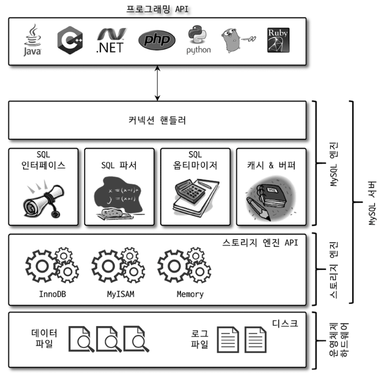

- **MySQL 엔진**
    - **SQL 문장을 분석하거나 최적화하고, DBMS의 두뇌에 해당하는 처리를 수행한다.**   
      **e.g.** SQL 인터페이스, SQL 파서, SQL 옵티마이저, 캐시&버퍼 ..
- **스토리지 엔진**
    - **실제 데이터를 디스크 스토리지에 저장하거나 읽어오는 역할을 전담한다.**
    - 스토리지 엔진은 여러 개를 동시에 사용할 수 있다.
    - 각 스토리지 엔진은 성능 향상을 위해 키 캐시(MyISAM 스토리지 엔진)나 InnoDB 버퍼 풀(InnoDB 스토리지 엔진)과 같은 기능을 내장하고 있다.
    - 테이블이 사용할 스토리지 엔진을 지정하면 테이블의 모든 작업은 해당 스토리지 엔진이 처리하게 된다.
    ```sql
    CREATE TABLE test_table (fd1 INt, fd2 INT) ENGINE = INNODB;
    ```

- 핸들러 API
    - 쿼리 실행기에서 데이터를 읽거나 쓸 때 스토리지 엔진과 주고 받는 요청이다.
    ```sql
    SHOW GLOBAL STATUS LIKE 'Handler%';
    ```

### 스레딩 구조

MySQL 서버는 프로세스 기반이 아닌 스레드 기반으로 작동한다.

- MySQL 스레드 구조는 포그라운드 스레드와 백그라운드 스레드로 구분할 수 있다.
  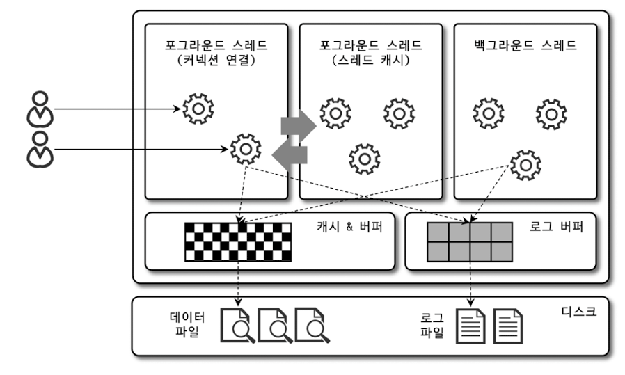

- 스레드 테이블 조회
  ```sql
  SELECT thread_id, name, type, processlist_user, processlist_host
  FROM performance_schema.threads ORDER BY type, thread_id;
  ```
    - `thread/sql/one_connection` 스레드만 실제 사용자의 요청을 처리하는 포그라운드 스레드이다.
    - 동일한 이름의 스레드가 2개 이상 있는 것은 MySQL 서버 설정에 의해 여러 스레드가 동일 작업을 병렬로 처리하는 것이다.

#### 포그라운드 스레드

(포그라운드 스레드 = 클라이언트 스레드 = 사용자 스레드)

- **포그라운드 스레드는 각 클라이언트가 요청하는 쿼리 문장을 처리하며, 작업을 마치고 커넥션을 종료하면 해당 스레드는 스레드 캐시로 되돌아간다.**
    - 이때, 일정 개수 이상 대기 중인 스레드가 있으면 바로 스레드를 종료시켜 일정 개수의 스레드만 스레드 캐시에 존재하도록 한다.
    - 스레드 캐시에 유지할 수 있는 최대 스레드 개수는 `thread_cache_size` 시스템 변수로 설정한다.
      ```sql
      -- 기본값: 8 + (max_connections / 100), -1: 자동 크기 조정
      SHOW VARIABLES LIKE 'thread_cache_size';  -- 결과: 9
      ```
      **cf.** 멀티스레드 프로그램은 스레드가 너무 많아지면 성능이 떨어지기 때문에 스레드 풀(thread pool)을 이용해서 스레드의 갯수를 제한 한다.

#### 백그라운드 스레드

- MyISAM의 경우에는 별로 해당 사항이 없지만, InnoDB는 여러 가지 작업이 백그라운드로 처리된다.
    - 인서트 버퍼(Insert Buffer)를 병합하는 스레드
    - **로그를 디스크로 기록하는 스레드**
    - **InnoDB 버퍼 풀의 데이터를 디스크에 기록하는 스레드**
    - 데이터를 버퍼로 읽어 오는 스레드
    - 잠금이나 데드락을 모니터링하는 스레드

- 이 중 가장 중요한 것은 로그 스레드와 쓰기 스레드이다.
    - MySQL5.5 버전부터 데이터의 쓰기 스레드와 읽기 스레드를 2개 이상 지정할 수 있게 되었다.
    - `innodb_write_io_threads`, `innodb_read_io_threads` 시스템 변수로 스레드의 개수를 설정한다.

- 읽기 작업은 주로 클라이언트 스레드에서 수행되기 때문에 스레드를 많이 설정할 필요가 없다.
- **쓰기 작업은 많은 작업을 백그라운드로 처리하기 때문에 쓰기 스레드를 충분히 설정하는 것이 좋다.**

    ```sql
    -- 기본값: 4
    SHOW VARIABLES LIKE 'innodb_write_io_threads';  -- 결과: 4
    -- 기본값: 4
    SHOW VARIABLES LIKE 'innodb_read_io_threads';   -- 결과: 4
    ```

- **MyISAM 테이블**: 디스크 쓰기 작업까지 포그라운드 스레드가 처리 (쓰기 작업을 버퍼링 X)
- **InnoDB 테이블**: 데이터 버퍼나 캐시까지만 포그라운드 스레드가 처리 (쓰기 작업을 버퍼링 O)

### 메모리 할당 및 사용 구조

- MySQL에서 사용되는 메모리 공간은 글로벌 메모리 영역과 로컬 메모리 영역으로 구분할 수 있다.
  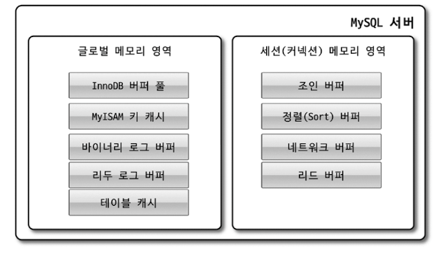

- 글로벌 메모리 영역과 로컬 메모리 영역은 MySQL 내에서 **스레드가 공유하는 공간인지 여부**에 따라 결정된다.

#### 글로벌 메모리 영역

- **클라이언트 스레드 수와 무관하게 하나의 메모리 공간만 할당된다.**
    - 필요에 따라 2개 이상의 메모리 공간을 할당받을 수도 있지만, 클라이언트의 스레드 수와 무관한다.
    - 생성된 글로벌 영역이 N개라도 **모든 스레드에 의해 공유된다.**
- 대표적인 로컬 메모리 영역
    - 테이블 캐시
    - InnoDB 버퍼 풀
    - InnoDB 어댑티브 해시 인덱스
    - InnoDB 리두 로그 버퍼

#### 로컬 메모리 영역

(로컬 메모리 영역 = 세션 메모리 영역 = 클라이언트 메모리 영역)

- **클라이언트 스레드가 쿼리를 처리하는데 사용하는 메모리 영역이다.**
- 각 클라이언트 스레드별로 독립적으로 할당되며 절대 **공유되어 사용되지 않는다.**
- 각 쿼리의 용도별로 필요할 때만 공간이 할당된다.  
  **e.g.** 소트 버퍼, 조인 버퍼
- 로컬 메모리 공간은 커넥션이 열려 있는 동안 계속 할당된 상태로 남아있는 공간도 있고, 쿼리를 실행하는 순간에만 할당했다가 다시 해제하는 공간도 있다.
- 대표적인 로컬 메모리 영역
    - 정렬 버퍼
    - 조인 버퍼
    - 바이너리 로그 캐시
    - 네트워크 버퍼

### 플러그인 스토리지 엔진 모델

- MySQL에서 스토리지 엔진뿐만 아니라 검색어 파서, 사용자 인증을 위한 플러그인, 또는 플러그인을 직접 개발해서 사용하는 것이 가능하다.
- MySQL에서 쿼리가 실행되면, 대부분의 작업은 MySQL 엔진에서 처리되고, '데이터 읽기/쓰기' 작업만 스토리지 엔진에서 처리한다.
    - GROUP BY나 ORDER BY 등 복잡한 처리는 스토리지 엔진 영역이 아닌 MySQL 엔진의 쿼리 실행기에서 처리된다.
- MySQL 엔진이 각 스토리지 엔진에게 데이터를 읽어오거나 저장하도록 명령하려면 핸들러를 통해야 한다.
- **하나의 쿼리 작업은 여러 하위 작업으로 나뉘는데, 각 하위 작업이 MySQL 엔진 영역에서 처리되는지 스토리지 엔진 영역에서 처리되는지 구분할 줄 알아야 한다.**

  ```sql
  SHOW ENGINES;
  SHOW PLUGINS;
  ```

### 컴포넌트

- MySQL8.0 부터는 기존의 플러그인 아키텍처를 대체하기 위해 컴포넌트 아키텍처가 지원된다.
- 플러그인 아키텍처의 단점
    - 플러그인끼리는 통신할 수 없음
    - MySQL 서버의 변수나 함수를 직접 호출하기 때문에 안전하지 않음
    - 상호 의존관계를 설정할 수 없어서 초기화가 어려움

### 쿼리 실행 구조

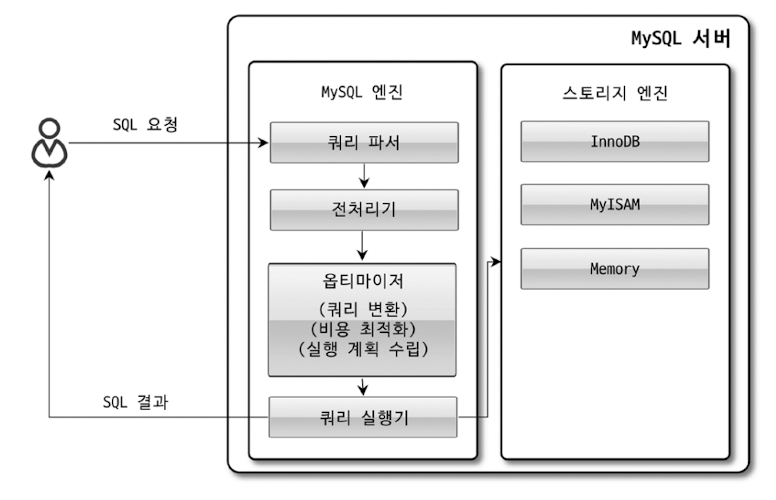

#### 쿼리 파서

- 쿼리 파서는 사용자 요청으로 들어온 쿼리 문장을 토큰으로 분리해 트리 형태의 구조로 만들어 내는 작업을 의미한다.
- 쿼리 문장의 기본 문법 오류는 이 과정에서 발견되고 사용자에게 오류 메시지를 전달한다.

#### 전처리기

- 파서 과정에서 만들어진 파서 트리를 기반으로 쿼리 문장에 구조적인 문제점이 있는지 확인한다.
- 실제 존재하지 않거나 권한상 사용할 수 없는 개체의 토큰은 이 단계에서 걸러진다.

#### 옵티마이저

- 쿼리 문장을 저렴한 비용으로 가장 빠르게 처리할지를 결정한다.
- DBMS의 두뇌에 해당한다고 볼 수 있다.
- 옵티마이저가 선택하는 과정에서 어떻게 하면 더 나은 선택을 할 수 있게 유도하는지 아는 것이 중요하다.

#### 실행 엔진

- 옵티마이저가 두뇌라면 실행 엔진과 핸들러는 손과 발에 비유할 수 있다.
- 실행 엔진은 만들어진 계획대로 각 핸들러에게 요청해서 받은 결과를 다시 다른 핸들러 요청의 입력으로 연결하는 역할을 수행한다.

#### 핸들러(스토리지 엔진)

- MySQL 실행 엔진의 요청에 따라 데이터를 디스크로 저장하고, 읽어오는 역할을 담당한다.
- 핸들러는 결국 스토리지 엔진을 의미한다.

### 복제

- MySQL 서버에서 복제는 매우 중요한 역할을 담당한다. (→ 16장에서 별도 주제로 다룸)

### 쿼리 캐시

- SQL의 실행 결과를 메모리에 캐시하고, 동일 쿼리가 실행되면 테이블을 읽지 않고 메모리에서 즉시 결과를 반환한다.
- 하지만 테이블의 데이터가 변경되면 캐시 데이터도 변경되어야 하기 때문에 심각한 동시 처리 성능 저하를 유발하게 된다.
- MySQL8.0 버전부터 쿼리 캐시 기능은 완전히 제거되고, 관련 시스템 변수도 모두 제거됐다.

### 스레드 풀

- 스레드 풀은 동시 처리되는 요청이 많더라도 MySQL 서버의 CPU가 제한된 개수의 스레드 처리에만 집중할 수 있게 해서 서버의 자원 소모를 줄이는 것이 목적이다.
- 일반적으로 CPU 코어의 개수와 맞추는 것이 CPU 프로세서 친화도를 높이는데 좋다.

- 하지만, MySQL 커뮤니티 에디션에서는 스레드 풀 기능을 지원하지 않는다.
- 대신 *Percona Server*에서 제공하는 스레드 풀 기능을 사용할 수 있다.
    - Percona Server의 스레드 풀 라이브러리(thread_pool.so)를 설치해서 사용하면 된다.
    - [Percona Server 스레드 풀 관련 변수](https://docs.percona.com/percona-server/latest/performance/threadpool.html#thread-pool-oversubscribe)
        - `thread_pool_size`: 동시에 CPU를 사용할 수 있는 스레드 수를 정의 (기본적으로 CPU 코어의 개수만큼 스레드 그룹을 생성)
        - `thread_pool_oversubscribe`: 스레드 풀이 처리 중인 작업이 있을 때 추가로 처리할 수 있는 스레드 개수 지정
        - `thread_pool_small_limit`: 모든 스레드가 일을 처리하고 있을 때 기존 작업 스레드의 처리를 대기하는 밀리초  
          응답 시간에 민감한 서비스라면 `thread_pool_small_limit` 값을 적절히 낮춰서 설정해야 한다. 하지만, 0에 가까운 값으로 설정하는 것은 권하지 않는다.
    - 선순위 큐와 후순위 큐를 이용해 특정 트랜잭션이나 쿼리를 우선적으로 처리할 수 있는 기능도 제공한다.

### 트랜잭션 지원 메타 데이터

- 테이블의 구조 정보와 스토어드 프로그램 등의 정보를 데이터 딕셔너리 또는 메타데이터라고 한다.
- MySQL5.7 버전까지는 파일 기반으로 메타데이터를 관리했다.
- MySQL8.0 버전부터는 테이블 구조 정보나 스토어드 프로그램의 코드 관련 정보를 모두 InnoDB의 테이블에 저장한다.
    - 서버가 작동하는데 기본적으로 필요한 시스템 테이블과 데이터 딕셔너리 정보를 모두 모아서 mysql DB에 저장한다.
    - mysql DB는 통째로 `mysql.ibd`라는 이름의 테이블스페이스에 저장된다.
- 파일 기반에서 테이블 기반으로 변경됨으로써 스키마 변경 작업 중간에 MySQL 서버가 비정상적으로 종료되더라도 트랜잭션 처리가 완전한 성공 또는 실패로 정리된다.
- MySQL 서버는 데이터 딕셔너리 정보를 `information__schema` DB의 TABLES와 COLUMNS 등과 같은 뷰를 통해서만 조회 가능하다.
    ```sql
    -- information__schema에서 TABLES 테이블의 구조 확인 → View로 만들어져 있고, mysql.tables 테이블을 참조하고 있다. 
    SHOW CREATE TABLE INFORMATION_SCHEMA.TABLES;
  
    -- Access to data dictionary table 'mysql.tables' is rejected.
    SELECT * FROM mysql.tables LIMIT 1;
    ```
- MySQL 서버는 InnoDB 스토리지 엔진 이외의 스토리지 엔진을 사용하는 테이블들을 위해 SDI(Serialized Dictionary Information) 파일을 사용한다.
- InnoDB 테이블 구조는 `ibd2sdi` 유틸리티를 사용해 SDI 파일로 변환할 수 있다.
  ```bash
  linux> ibd2sdi /var/lib/mysql/mysql.ibd > /etc/mysql/mysql_schema.json
  ```
    - `SHOW TABLES` 명령으로 확인할 수 없었던 `mysql.tables` 딕셔너리 데이터를 위한 테이블 구조도 볼 수 있다.

## 2. InnoDB 스토리지 엔진 아키텍처

InnoDB는 MySQL에서 사용할 수 있는 스토리지 엔진 중 거의 유일하게 **레코드 기반의 잠금을 제공하며, 그 때문에 높은 동시성 처리가 가능하고 안정적이며 성능이 뛰어나다.**

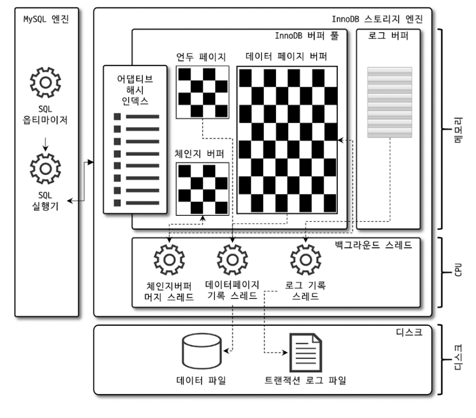

### 1) 프라이머리 키에 의한 클러스터링

- InnoDB의 모든 테이블은 기본적으로 프라이머리 키를 기준으로 클러스터링되어 저장된다.
    - **프라이머리 키 값의 순서대로 디스크에 저장**되는 형태이다.
    - 모든 세컨더리 인덱스는 레코드 주소 대신 프라이머리 키의 값을 논리적인 주소로 사용한다.
- **쿼리의 실행 계획에서 프라이머리 키는 기본적으로 다른 보조 인덱스에 비해 비중이 높게 설정된다.**
    - **프라이머리 키가 클러스터링 인덱스**이기 때문에 프라이머리 키를 이용한 레인지 스캔은 상당히 빨리 처리될 수 있다.
    - 오라클 DBMS의 IOT(Index organized table)와 동일한 구조가 InnoDB에서는 일반적인 테이블의 구조가 되는 것이다.      
      **cf.** 오라클 IOT: Table Random Access가 발생하지 않도록 처음부터 인덱스 구조로 생성된 테이블

### 외래 키 지원

- 외래키는 InnoDB 스토리지 엔진 레벨에서 지원하는 기능으로, MyISAM이나 MEMORY 테이블에서는 사용할 수 없다.
- 외래키 설정 시 주의할 점
    - 부모 테이블과 자식 테이블 모두 해당 컬럼에 인덱스 생성이 필요
    - 데이터 변경 시 부모테이블과 자식테이블에 데이터가 있는지 체크하여 잠금이 여러 테이블로 전파되고, 그로인해 데드락이 자주 발생
- 외래키 관련 시스템 변수
    - `foreign_key_checks`: 외래 키 관계에 대한 체크 작업을 설정 (OFF인 경우 일시적으로 외래 키 관계 체크를 무시한다)
    ```sql
    SET foreign_key_checks = OFF;
    -- // 작업 실행
    SET foreign_key_checks = ON; 
    ```
    - 외래 키 체크를 일시적으로 중지한 상태에서 외래 키 관계를 가진 부모 테이블의 레코드를 삭제했다면 반드시 자식 테이블의 레코드도 삭제해서 일관성을 맞춘 후 다시 외래 키 체크 기능을 활성화 해야 한다.
    - `foreign_key_checks`가 비활성화되면 `ON DELETE CASCADE`와 `ON UPDATE CASCADE` 옵션도 무시하게 된다.
    - `foreign_key_checks` 변수의 적용 범위는 Both이므로, 현재 작업을 실행하는 세션에서만 외래 키 체크 기능을 멈추게 해야 한다.
     ```sql
    -- Global 변수 변경 
    SET foreign_key_checks = OFF;
    -- SESSION 변수 변경 
    SET SESSION foreign_key_checks = OFF; 
    ``` 

### MVCC (Multi Version Concurrency Control)

- Multi Version은 하나의 레코드에 대해 여러 개의 버전이 동시에 관리된다는 의미이다.
    - 즉, **하나의 레코드에 대해 2개의 버전이 유지되고, 필요에 따라 어느 데이터가 보여지는지 여러 가지 상황에 따라 달라진다.**
- InnoDB는 언두로그를 이용해 이 기능을 구현한다.
    - 트랜잭션 격리 수준이 `READ_UNCOMMITTED`라면 버퍼 풀이 현재 가지고 있는 변경된 데이터를 반환하고, `READ_COMMITTED`, `REPEATABLE_READ`
      , `SERIALIZABLE`인 경우 언두 영역의 데이터를 반환한다.
- **MVCC의 가장 큰 목적은 잠금을 사용하지 않는 일관된 읽기를 제공하는데 있다.**

### 잠금 없는 일관된 읽기 (Non-Locking Consistent Read)

- InnoDB 스토리지 엔진은 MVCC 기술을 이용해 잠금을 걸지 않고 읽기 작업을 수행한다.
    - 트랜잭션 격리 수준이 `SERIALIZABLE`이 아닌 `READ_UNCOMMITTED`, `READ_COMMITTED`, `REPEATABLE_READ` 수준에서 순수한 읽기 작업은 다른 트랜잭션의 변경
      작업과 관계없이 항상 잠금을 대기하지 않고 바로 실행된다.
- **InooDB에서 읽기 작업은 다른 트랜잭션이 가지고 있는 잠금을 기다리지 않고, 읽기 작업이 가능하다.**
- 트랜잭션을 시간동안 유지하면 언두 로그가 쌓여 성능 저하 문제가 발생할 수 있기 때문에 가능한 트랜잭션을 완료하는 것이 좋다.

### 자동 데드락 감지

- InnoDB 스토리지 엔진은 데드락 감지 스레드를 가지고 있어서 주기적으로 잠금 대기 그래프를 검사해 교착 상태에 빠진 트랜잭션들을 찾아서 그 중 하나를 강제 종료한다.
    - 일반적으로 언두 로그를 더 적게 가진 트랜잭션이 롤백의 대상이 된다.
- 락(Lock) 관련 시스템 변수
    - `innodb_table_locks`: InnoDB 스토리지 엔진 내부의 레코드 잠금뿐만 아니라 MySQL 엔진에서 관리되는 테이블 레벨의 잠금까지 감지하도록 설정
    - `innodb_deadlock_detect`: 데드락 감지 스레드를 작동 시킬지 여부
    - `innodb_lock_wait_timeout`: 데드락 상황에서 일정 시간이 지나면 요청이 실패하고 에러 메시지를 반환하도록 설정

  **cf.** 만약 PK 또는 세컨더리 인덱스를 기반으로 매우 높은 동시성 처리를 요구하는 서비스가 있다면 `innodb_deadlock_detect`를
  비활성화하고, `innodb_lock_wait_timeout`을 기본값인 50초 보다 낮은 시간으로 변경해서 성능을 비교 해볼 수 있다.

### 자동화된 장애 복구

- InnoDB 데이터 파일은 기본적으로 MySQL 서버가 시작될 때 항상 자동 복구를 수행한다.
    - 완료되지 못한 트랜잭션이나 디스크에 일부만 기록된 데이터 등에 대한 복구 작업을 자동으로 수행한다.
    - 디스크나 하드웨어 이슈로 InnoDB 스토리지 엔진이 자동으로 복구될 수 없다면 MySQL 서버는 종료된다.
- `innodb_force_recovery`
    - MySQL 서버가 시작될 때 InnoDB 스토리지 엔진이 데이터 파일이나 로그 파일의 손상 여부 검사 과정을 선별적으로 진행할 수 있게 한다.
    - `innodb_force_recovery`의 값은 `1 ~ 6`까지 설정하며, 값이 커질수록 심각한 상황이어서 데이터 손실 가능성이 커지고 복구 가능성은 적어진다.

#### 장애 상황

- `1 (SRV_FORCE_IGNORE_CORRUPT)`: 데이터나 인덱스에서 손상된 부분이 발견되더라도 무시하고 서버를 시작한다.  
  `Database page corruption on disk or a failed` 메시지가 출력되면 대부분 이 경우에 해당한다.
- `2 (SRV_FORCE_NO_BACKGROUND)`: 백그라운드 스레드 가운데 메인 스레드를 시작하지 않고 서버를 시작한다.     
  InnoDB의 메인 스레드에서는 불필요한 언두 데이터를 삭제하는데 이 과정에서 장애가 발생한 경우 사용한다.
- `3 (SRV_FORCE_NO_TRX_UNXO)`: MySQL 서버가 정상적으로 시작되면 커밋되지 않은 트랜잭션은 롤백을 수행하지만, 이 모드에서는 커밋되지 않은 트랜잭션 작업을 롤백하지 않고 그대로 놔둔다.
- `4 (SRV_FORCE_NO_IBUF_MERGE)`: 인서트 버퍼의 내용을 무시하고 서버를 시작한다.  
  인서트 버퍼란 데이터 변경(INSET, UPDATE, DELETE)으로 인한 인덱스 변경 작업을 나중에 처리하도록 기록한 것이다.
- `5 (SRV_FORCE_UNDO_LOG_SCAN)`: 언두 로그를 모두 무시하고 서버를 시작한다.  
  MySQL 서버가 종료되던 시점에 커밋되지 않은 작업도 모두 커밋된 것처럼 처리되므로 실제로는 잘못된 데이터가 데이터베이스에 남는 것이라고 볼 수 있다.
- `6 (SRV_FORCE_NO_LOG_READ)`: 리두 로그를 모두 무시하고 서버를 시작한다.  
  MySQL 서버가 종료되던 시점에 커밋된 작업이라도 리두 로그에만 기록되고 데이터 파일에 기록되지 않은 데이터는 모두 무시된다.

### InnoDB 버퍼 풀

- InnoDB 스토리지 엔진에서 가장 핵심적인 부분으로, **디스크의 데이터 파일이나 인덱스 정보를 메모리에 캐시해 두는 공간이다.**
- **쓰기 작업을 지연시켜 일괄 작업으로 처리할 수 있게 해주는 버퍼 역할도 한다.**
    - `INSERT`, `UPDATE`, `DELETE` 처럼 데이터를 변경하는 쿼리는 데이터 파일의 이곳저곳에 위치한 레코드를 변경하기 때문에 랜덤한 디스크 작업을 발생시킨다.
    - 하지만 버퍼 풀이 이러한 변경된 데이터를 모아서 처리하면 랜덤한 디스크 작업의 횟수를 줄일 수 있다.

#### 버퍼 풀의 크기 설정

- MySQL5.7 버전부터는 InnoDB 버퍼 풀의 크기를 동적으로 조절할 수 있게 되었다.
    - 일반적으로 전체 물리 메모리의 80%를 설정하라는 내용은 적절하지 않으며, 운영체제와 각 클라이언트 스레드가 사용할 메모리를 고려해서 설정해야 한다.
- 하지만, MySQL 서버가 사용하는 **레코드 버퍼 공간은 별도로 설정할 수 없다.**
    - 전체 커넥션 개수와 각 커넥션에서 읽고 쓰는 테이블 개수에 따라서 결정된다.
    - 레코트 버퍼란?
        - 각 클래이언트 세션에서 테이블의 레코드를 읽고 쓸 때 버퍼로 사용하는 공간이다.
        - 커넥션이 많고, 테이블도 많다면 레코드 버퍼의 메모리 공간이 꽤 많이 필요해질 수 있다.
- 운영체제의 전체 메모리 공간에 따른 버퍼 풀 메모리의 초기 설정
    - 8GB 미만: InnoDB 버퍼 풀 크기를 50% 정도로 설정
    - 8GB 이상 ~ 50GB 미만: InnoDB 버퍼 풀 크기를 50%에서 시작해서 조금씩 올려가며 최적으로 설정
    - 50GB 이상: 대략 15GB에서 30GB 정도를 남겨두고 나머지를 InnoDB 버퍼 풀로 설정(50% ~ 75%)
- `innodb_buffer_pool_size`: 버퍼 풀의 크기 설정
    - 버퍼 풀의 크기 변경은 크리티컬한 변경이므로 가능하면 MySQL 서버가 한가한 시점을 골라서 진행하는 것이 좋다.
    - 버퍼 풀의 크기를 줄이는 작업은 서비스 영향도가 매우 크므로 가능하면 버퍼 풀의 크기를 줄이는 작업은 하지 않도록 주의해야 한다.
    - 버퍼 풀은 내부적으로 128MB 청크 단위로 관리되고 처리된다.
- `innodb_buffer_pool_instances`: 버퍼 풀 인스턴스의 개수 (기본값 8)
    - 전체 버퍼 풀을 위한 메모리 크기가 1GB 미만이면 1개만 생성된다.
    - 메모리 공간이 40GB 이하 수준이면 8개를 유지한다.
    - 메모리가 크다면 인스턴스당 5GB 정도로 개수를 설정한다.

#### 버퍼 풀의 구조

- InnoDB 스토리지 엔진은 버퍼 풀이라는 거대한 메모리 공간을 페이지 크기의 조각으로 쪼개어 관리한다.
    - `innodb_page_size`: 페이지 크기 설정

- 페이지 크기 조각을 관리하기 위해 3개의 자료 구조를 관리한다.
    - **LRU(Least Recently Used) 리스트**
        - LRU + MRU(Most Recently Used) 리스트가 결합된 형태이다.
        - LRU 리스트를 관리하는 목적은 **디스크로부터 한 번 읽어온 페이지를 최대한 오랫동안 버퍼 풀의 메모리에 유지해서 디스크 읽기를 최소화하는 것이다.**
    - **플러시(Flush) 리스트**
        - 디스크로 동기화되지 않은 데이터를 가진 데이터 페이지(더티 페이지)의 변경 시점 기준의 페이지 목록을 관리한다.
        - **데이터 변경이 가해진 데이터 페이지는 플러시 리스트에 관리되고, 특정 시점이 되면 디스크로 기록되어야 한다.**
        - InnoDB 스토리지 엔진은 **체크포인트를 발생시켜 디스크의 리두 로그와 데이터 페이지의 상태를 동기화하게 된다.**
        - _체크포인트_: MySQL 서버가 시작될 때 InnoDB 스토리지 엔진이 리두 로그의 어느 부분부터 복구를 실행해야 할지 판단하는 기준점을 만드는 역할
    - **프리(Free)리스트**
        - InnoDB 버퍼 풀에서 실제 사용자 데이터로 채워지지 않은 비어 있는 페이지들의 목록이다.
        - 사용자의 쿼리가 새롭게 디스크의 데이터 페이지를 읽어와야 하는 경우 사용된다.

- LRU 리스트 구조

  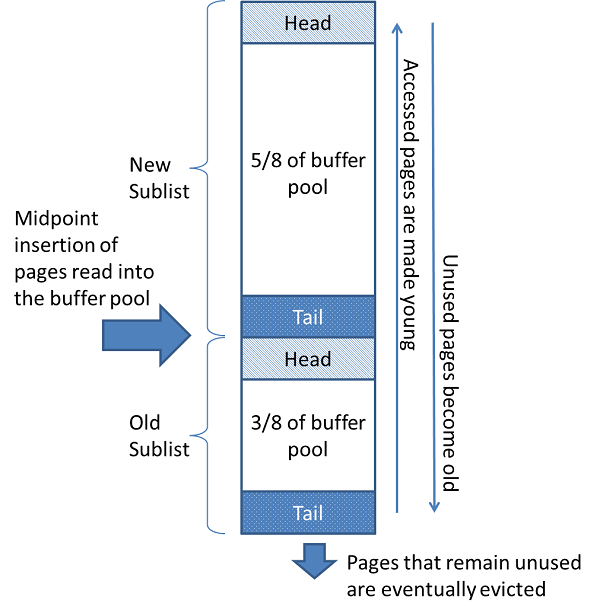

  > p.110  
  > 버퍼 풀 내부에서 최근 접근 여부에 따라서 데이터 페이지는 서로 경쟁하면서 MRU 또는 LRU로 이동하는 것이다.  
  > 그리고 InnoDB 스토리지 엔진은 LRU의 끝으로 밀려난 데이터 페이지들을 버퍼 풀에서 제거해서 새로운 데이터 페이지를 적재할 수 있는 빈 공간을 준비한다.

  ① 필요한 레코드가 저장된 데이터 페이지가 버퍼 풀에 있는지 검사  
  &nbsp;&nbsp;&nbsp;&nbsp;− 어댑티브 해시 인덱스를 이용해 페이지를 검색  
  &nbsp;&nbsp;&nbsp;&nbsp;− 해당 테이블의 인덱스(B-Tree)를 이용해 버퍼 풀에서 페이지를 검색  
  &nbsp;&nbsp;&nbsp;&nbsp;− 버퍼 풀에 이미 데이터 페이지가 있다면 해당 페이지의 포인터를 MRU 방향으로 승급   
  ② 디스크에서 필요한 데이터 페이지를 버퍼 풀에 적재하고, 적재된 페이지에 대한 포인터를 LRU 헤더 부분에 추가  
  ③ 버퍼 풀의 LRU 헤더 부분에 적재된 데이터 페이지가 실제로 읽히면, MRU 헤더 부분으로 이동  
  ④ 버퍼 풀에 상주하는 데이터 페이지는 사용자 쿼리가 얼마나 최근에 접근했었는지에 따라 나이가 부여되며, 오랫동안 사용되지 않으면 나이가 오래되고(Aging) 해당 페이지는 버퍼 풀에서 제거    
  &nbsp;&nbsp;&nbsp;&nbsp;− _Eviction_: 버퍼 풀에서 데이터 페이지를 삭제해 추가 공간을 확보하는 작업  
  &nbsp;&nbsp;&nbsp;&nbsp;− 버퍼 풀의 데이터 페이지가 쿼리에 의해 사용되면 나이가 초기화되어 다시 MRU의 헤더로 이동  
  ⑤ 필요한 데이터가 자주 접근됐다면 해당 페이지의 인덱스 키를 어댑티브 해시 인덱스에 추가

#### 버퍼 풀과 리두 로그

- InnoDB 버퍼 풀은 데이터베이스 서버의 성능 향상을 위해 **데이터 캐시**와 **쓰기 버퍼링**이라는 두 가지 용도가 있다.
- 단순히 버퍼 풀의 메모리 공간만 늘리는 것은 데이터 캐시 기능만 향상시키는 것이고, 버퍼 풀의 쓰기 버퍼링 기능까지 향상시키려면 InnoDB 버퍼 풀과 리두 로그와의 관계를 이해해야 한다.

- 리두 로그의 각 엔트리는 특정 데이터 페이지와 연결된다.

  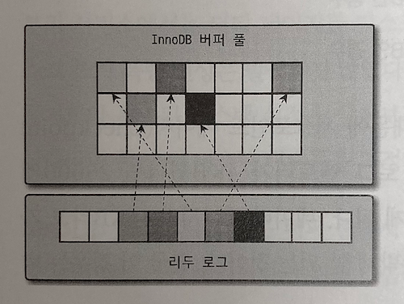

- InnoDB 버퍼 풀은 클린 페이지와 더티 페이지를 가지고 있다.
    - 클린 페이지: 디스크에서 읽은 상태로 전혀 변경되지 않은 페이지
    - **더티 페이지**: `INSERT`, `UPDATE`, `DELETE` 명령으로 변경된 데이터를 가진 페이지  
      더티 페이지는 버퍼 풀에 무한정 머무를 수 없고, 데이터 변경이 발생하면 리두 로그 파일에 기록됐던 로그 엔트리는 다시 새로운 로그 엔트리로 덮어 쓰인다.

- InnoDB 스토리지 엔진은 전체 리두 로그 파일에서 재사용 가능한 공간과 재사용 불가능한 공간을 구분해서 관리한다.
    - **활성 리두 로그**: 재사용 불가능한 공간
    - **LSN (Log Sequence Number)**: 로그 포지션
        - 가장 최근 체크포인트 지점의 LSN이 활성 리두 로그 공간의 시작점이 된다.
        - 리두 로그 파일의 공간은 계속 순환되어 재사용되는데, 매번 기록될 때마다 로그 포지션이 증가한다.
    - **체크포인트 에이지**: 가장 최근 체크포인트의 LSN과 마지막 리두 로그 엔트리의 LSN의 차이
        - 체크포인트 에이지는 활성 리두 로그 공간의 크기와 같다.

- 버퍼 풀의 크기가 100GB 이하의 MySQL 서버에서는 리두 로그 파일의 전체 크기를 대략 5~10GB 수준으로 선택하고 필요에 따라 조금씩 늘려가면서 최적값을 선택하는 것이 좋다.
    - 리두 로그 파일의 크기를 너무 작게 설정하면, 실제 쓰기 버퍼링을 위한 효과는 거의 없게 된다.
    - 리두 로그 파일의 크기를 버퍼 풀의 크기와 비슷하게 설정하면, 더티 페이지의 비율이 너무 높은 상태에서 디스크 쓰기가 발생할 수 있다.
    - 일반적으로 리두 로그는 변경분만 가지고 버퍼 풀은 데이터 페이지를 통째로 가지기 때문에 데이터 변경이 발생해도 리두 로그는 훨씬 작은 공간만 있으면 된다.

#### 버퍼 풀 플러시 (Buffer Pool Flush)

- MySQL8.0 버전에서는 더티 페이지를 디스크에 동기화하는 부분(더티 페이지 플러시)에서 예전과 같은 디스크 쓰기 폭증 현상은 발생하지 않는다.
- InnoDB 스토리지 엔진은 **더티 페이지를 디스크에 동기화하기 위해 2개의 플러시 기능을 백그라운도 실행한다.**

1. 플러시 리스트 플러시
    - 플러시 리스트 플러시 함수를 호출해서 플러시 리스트에서 **_오래전에 변경된_ 데이터 페이지 순서대로 디스크에 동기화 하는 작업**을 수행한다.
    - `innodb_page_cleaners`: 클리너 스레드의 개수를 조정 (기본값 1)    
      `innodb_buffer_pool_instance` 값 보다 클 수 없으므로, 일반적으로 동일한 값으로 설정한다.
    - `innodb_max_dirty_pages_pct_lwm`: 일정 수준 이상의 더티 페이지가 발생하면 더티 페이지를 디스크로 기록 (기본값 10)
    - `innodb_max_dirty_pages_pct`: 더티 페이지의 비율을 조정 (기본값 90)  
      전체 버퍼 풀이 가진 페이지의 90%까지 더티 페이지를 가질 수 있는데, 더티 페이지를 많이 가질 수록 디스크 쓰기 작업을 줄일 수 있으므로 기본 값을 유지하는 것이 좋다.
    - `innodb_io_capacity`: 일반적인 상황에서 디스크가 적절히 처리할 수 있는 수준의 값으로 설정 (기본값 200)
    - `innodb_io_capacity_max`: 디스크가 최대의 성능을 발휘할 때 어느 정도의 디스크 읽고 쓰기가 가능한지 설정 (기본값 2000)
    - `innodb_flush_neighbors`: 디스크에 근접한 페이지 중에서 더티 페이지가 있다면 함께 디스크에 기록하게 해주는 기능의 활성화 여부 (기본값 0. 비활성화)
    - `innodb_adaptive_flushing`: 어댑티드 플러시 사용 여부 (기본값 ON)  
      어댑티브 플러시 알고리즘은 **리두 로그의 증가 속도를 분석해서 적걸한 수준의 더티 페이지가 버퍼 풀에 유지될 수 있도록 디스크 쓰기를 실행한다.**
    - `innodb_adaptive_flushing_lwm`: 어댑티브 플러시 알고리즘이 작동하는 활성 리두 공간의 비율 설정(기본값 10)

2. LRU 리스트 플러시
    - LRU 리스트 플러시 함수를 호출해서 LRU 리스트에서 **_사용 빈도가 낮은_ 데이터 페이지를 제거**한다.
    - `innodb_lru_scan_depth`: LRU 리스트의 끝부분부터 시작해서 스캔할 페이지 개수 설정    
      페이지를 스캔하면서 더티 페이지는 디스크에 동기화 하고, 클린 페이지는 프리 리스트로 옮긴다.

#### 버퍼 풀 상태 백업 및 복구

- InnoDB 서버의 버퍼 풀은 쿼리의 성능에 매우 밀접하게 연결된다.
- 디스크의 데이터가 버퍼 풀에 적재되어 있는 상태를 워밍업이라고 표현하는데, 버퍼 풀이 잘 워밍업된 상태에서는 그렇지 않은 경부보다 몇십 배의 쿼리 처리 속도를 보이는 것이 일반적이다.
- MySQL5.5 버전에서는 점검을 위해 서버를 셧다운 했다가 다시 시작하는 경우, 주요 테이블과 인덱스에 대해 풀 스캔을 한 번씩 실행하고 서비스를 오픈했다.
- MySQL5.6 버전부터 버퍼 풀 덤프 및 적재 기능이 도입되었다.

- 버퍼 풀의 백업과 복구 과정
  ```sql
  -- // MySQL 서버 셧다운 전에 버퍼 풀의 상태 백업
  SET GLOBAL innodb_buffer_pool_dump_now = ON;
    
  -- // MySQL 서버 재시작 후, 백업된 버퍼 풀의 상태 복구
  SET GLOBAL innodb_buffer_pool_load_now = ON;
    
  -- 버퍼 풀의 복구 진행 상황 확인
  SHOW STATUS LIKE 'Innodb_buffer_pool_dump_status'\G
  
  -- 버퍼 풀 복구 도중에 급히 서비스를 시작하는 경우에 버퍼 풀 복구를 멈추는 것을 권장
  SET GLOBAL innodb_buffer_pool_load_abort = ON;
  
  ```
    - 버퍼 풀의 백업은 데이터 디렉터리에 `ib_buffer_pool`이라는 이름의 파일로 생성된다.
    - 버퍼 풀의 백업은 매우 빨리 완료되지만, 다시 복구하는 과정은 각 테이블의 데이터 페이지를 다시 디스크에서 읽어와야 하기 때문에 상당한 시간이 걸릴 수도 있다.

- **버퍼 풀의 백업과 복구를 자동화하려면 `innodb_buffer_pool_dump_at_shutdown`과 `innodb_buffer_pool_dump_at_startup`를 설정하면 된다.**

#### 버퍼 풀의 적재 내용 확인

- MySQL5.6 버전부터 information_schema 데이터베이스의 `innodb_buffer_page` 테이블에서 버퍼 풀 메모리에 어떤 테이블의 페이지들이 적재되어 있는지 확인할 수 있었다.
    - 하지만 버퍼 풀이 큰 경우에 이 테이블을 조회하면 상당히 큰 부하가 있기 때문에 실제 서비스에서 버퍼 풀의 상태를 확인하는 것이 거의 불가능했다.
- MySQL8.0 버전에는 information_schema 데이터베이스에 `innodb_cached_indexes` 테이블의 인덱스별로 데이터 페이지가 얼마나 적재되어 있는지 확인할 수 있다.

    ```sql
    SELECT 
        it.name table_name,
        ii.name index_name,
        ici.n_cached_pages n_cached_pages
    FROM information_schema.innodb_tables it
         INNER JOIN information_schema.innodb_indexes ii ON ii.table_id = it.table_id
         INNER JOIN information_schema.innodb_cached_indexes ici ON ici.index_id = ii.index_id
    WHERE it.name = CONCAT('employees', '/', 'employees');
    ```
  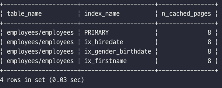
- 테이블 전체(인덱스 포함) 페이지 중에서 대략 어느 정도 비율이 InnoDB 버퍼 풀에 적재되어 있는지 확인

    ```sql
    SELECT
        (SELECT SUM(ici.n_cached_pages) n_cached_pages
         FROM information_schema.innodb_tables it
             INNER JOIN information_schema.innodb_indexes ii ON ii.table_id = it.table_id
             INNER JOIN information_schema.innodb_cached_indexes ici ON ici.index_id = ii.index_id
         WHERE it.name = CONCAT(t.table_schema, '/', t.table_name)
        ) as total_cached_pages,
        (
          (t.data_length + t.index_length - t.data_free) / @@innodb_page_size
        ) as total_pages
    FROM information_schema.tables t
    WHERE t.table_schema = 'employees'
        AND t.table_name = 'employees'; 
    ```
  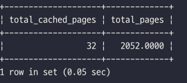

### Double Write Buffer

- 리두 로그는 공간의 낭비를 막기 위해 페이지의 변경된 내용만 기록한다.
- 하드웨어의 오작동이나 시스템의 비정상 종료 등의 문제로 **더티 페이지를 디스크 파일로 플러시할 때 일부만 기록되는 문제**(파셜 페이지 또는 톤 페이지)가 발생할 수 있다.
- InnoDB의 Double-Write 기법을 이용하면, 더티 데이터를 우선 묶어서 시스템 테이블스페이스의 DoubleWrite 버퍼에 기록한다.
- 그리고 더티 페이지를 개별 파일로 적당한 위치에 랜덤 쓰기를 실행한다.
- **InnoDB 스토리지 엔진은 재시작 될 때 항상 DoubleWrite 버퍼의 내용과 데이터 파일의 페이지들을 모두 비교해서 다른 내용을 담고 있는 페이지가 있으면 DoubleWrite 버퍼의 내용을 데이터
  파일의 페이지로 복사한다.**
- `innodb_doublewrite`: DoubleWrite 기능 사용 여부 설정
    - 데이터의 무결성이 매우 중요한 서비스에서는 DoubleWrite의 활성화를 고려하는 것이 좋다.
    - 데이터베이스의 성능을 위해 리두 로그의 동기화 설정(`innodb_flush_log_at_trx_commit`)을 1이 아닌 값으로 설정했다면, DoubleWrite도 비활성화하는 것이 좋다.

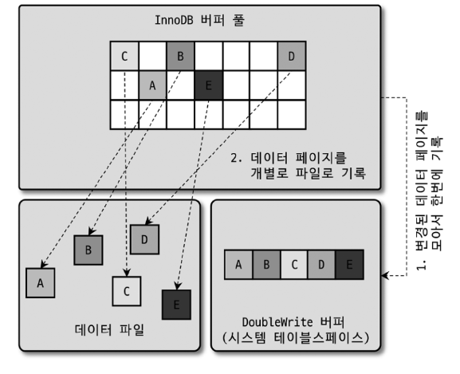

### 언두 로그

- InnoDB 스토리지 엔진은 `DMI(INSERT, UPDATE, DELETE)`로 변경되기 이전 버전의 데이터를 별도로 백업하는데, 이를 언두로그라고 한다.
- 언두 로그의 목적
    - **1) 트랜잭션 보장**  
      트랜잭션이 롤백되면 언두 로그에 백업해 둔 이전 버전의 데이터를 이용해 데이터를 복구한다.
    - **2) 격리 수준 보장**  
      트랜잭션 격리 수준에 맞게 변경 중인 레코드를 읽지 않고, 언두 로그에 백업해둔 데이터를 읽어서 반환하기도 한다.

#### 언두 로그 레코드 모니터링

- ***트랜잭션의 격리 수준*이란 동시에 여러 트랜잭션이 데이터를 변경하거나 조회할 때 한 트랜잭션의 작업 내용이 다른 트랜잭션에 어떻게 보일지 결정하는 기준이다.**
- **대용량의 데이터를 처리하는 트랜잭션이나 트랜잭션이 오랜 시간 동안 지속될 때 언두 로그의 양은 급격히 증가할 수 있다.**
    - 테이블에 변경이 있으면 언두 로그도 복사되므로 대용량 데이터를 처리할 때 사용하는 공간의 크기 만큼 언두 로그 공간도 필요하다.
    - 트랜잭션이 완료됐다고 해서 해당 트랜잭션이 생성한 언두 로그를 즉시 삭제할 수 있는 것은 아니다.
- 언두 로그 레코드 건수 확인
    ```sql
    -- MySQL 서버의 모든 버전에서 사용 가능한 명령
    SHOW ENGINE INNODB STATUS \G
    ```
  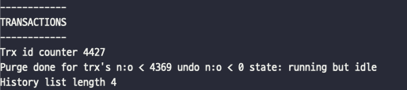

    ```sql
    -- MySQL 8.0버전에서 사용 가능한 명령
    SELECT count
    FROM information_schema.innodb_metrics
    WHERE SUBSYSTEM = 'transaction' AND NAME = 'trx_rseg_history_len';
    ```
  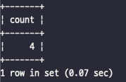

- 서버별로 안정적인 시점의 언두 로그 레코드 건수를 확인해 이를 기준으로 언두 로그의 급증 여부를 모니터링하는 것이 좋다.

#### 언두 테이블스페이스 관리

- 언두 로그가 저장되는 공간을 언두 테이블스페이스라고 한다.
    - MySQL5.6 이전 버전에서는 언두 로그가 모두 시스템 테이블스페이스(`ibdta.ibd`)에 저장되어 서버가 초기화될 때 생성되었기 때문에 확장의 한계가 있었다.
    - MySQL5.6 버전에서는 `innodb_undo_tablespaces` 변수가 도입되어, 이 값을 2보다 큰 값으로 설정하면 언두 로그를 시스템 테이블스페이스에 저장하지 않고 별도의 언두 로그 파일을
      사용하게 된다.
    - MySQL8.0.14 버전부터 `innodb_undo_tablespaces` 변수의 효력이 없어졌으며, 언두 로그는 항상 시스템 테이블스페이스 외부의 별도 로그 파일에 기록되도록 개선되었다.

- 언두 테이블스페이스 구조
    - 하나의 언두 테이블스페이스는 1 ~ 128개의 롤백 세그먼트를 가진다.
    - 롤백 세그먼트는 1개 이상의 언두 슬롯을 가진다.
    - 하나의 롤백 세그먼트는 InnoDB 페이지 크기를 16바이트로 나눈 값의 개수 만큼의 언두 슬롯을 가진다.    
      **e.g.** 페이지 크가가 16KB라면 하나의 롤백 세그먼트는 1024개의 언두 슬롯을 갖게 된다.
    - 하나의 트랜잭션이 필요로 하는 언두 슬롯의 개수는 트랜잭션이 실행하는 `INSERT`, `UPDATE`, `DELETE` 문장의 특성에 따라 최대 4개까지 언두 슬롯을 사용하게 된다.
    - 최대 동시 처리 가능한 트랜잭션의 개수는 다음 수식으로 예측해 볼 수 있다. (하나의 트랜잭션에 대략 2개 정도의 언두 슬롯이 필요하다고 가정)
    ```text
    최대 동시 트랜잭션 수 = (InnoDB 페이지 크기) / 16 * (롤백 세그먼트 개수) * (언두 테이블 스페이스 개수)
  
    e.g. 일반적인 16KB InnoDB 기본 설정값으로 계산
         - innodb_undo_tablespaces = 2
         - innodb_rollback_segments = 128
    ⇒ ((16 * 1024) / 16) * 128 * (2 / 2) = 131,072개
    ```

    - 언두 로그 공간이 남는 것은 크게 문제되지 않지만 언두 로그 슬롯이 부족한 경우에는 트랜잭션을 시작할 수 없는 심각한 문제가 발생한다.
        - MySQL8.0 이전까지는 한 번 생성된 언두 로그는 변경할 수 없었다.
        - MySQL8.0 버전부터는 새로운 언두 테이블 스페이스를 동적으로 추가하고 삭제할 수 있게 개선되었다.

        ```sql
        -- 언두 테이블 스페이스 조회
        SELECT tablespace_name, file_name
        FROM information_schema.files
        WHERE file_type LIKE 'UNDO LOG';
        ```

      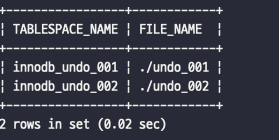

        ```sql
        -- 언두 테이블 스페이스 생성
        CREATE UNDO TABLESPACE extra_undo_003 ADD DATAFILE '/var/lib/mysql/undo_003';
        ```

      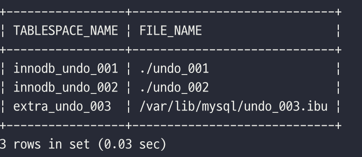

        ```sql
        -- 언두 테이블 스페이스 비활성화
        ALTER UNDO TABLESPACE extra_undo_003 SET INACTIVE;
      
        -- 언두 테이블 스페이스 삭제
        DROP UNDO TABLESPACE extra_undo_003;
        ```

- **Undo tablespace truncate**: 언두 테이블스페이스 공간을 필요한 만큼만 남기고 불필요하거나 과도하게 할당된 공간을 운영체제로 반납하는 것을 의미한다.
    - 자동 모드
        - 퍼지 스레드는 주기적으로 깨어나서 언두 로그 공간에서 불필요해진 언두 로그를 삭제하는 작업(언두 퍼지 작업)을 실행한다.
        - `innodb_undo_log_truncate` 변수가 ON으로 설정되면 언두 퍼지 작업을 실행한다. (기본값 ON)
        - `innodb_purge_rseg_truncate_frequency` 변수로 언두 퍼지 작업의 빈도를 설정할 수 있다. (기본값 128)
    - 수동 모드
        - 자동 모드의 언두 퍼지 작업이 부진한 경우에는 언두 테이블스페이스를 비활성화하면 퍼지 스레드가 동작하게 된다.
        - 퍼지 스레드는 비활성화 상태의 언두 테이블스페이스를 찾아서 언두 퍼지 작업을 수행하고 운영체제로 해당 공간을 반납한다.
        - 반납이 완료되면 언두 테이블스페이스를 다시 활성화 한다.
        - 수동 모드가 동작하려면 최소 3개 이상의 언두 테이블스페이스가 있어야 한다.

        ```sql
        -- 언두 테이블스페이스 비활성화
        ALTER UNDO TABLESPACE table_space_name SET INACTIVE;
        
        -- 퍼지 스레드에 의해 언두 테이블스페이스 공간이 반납되면 다시 활성화
        ALTER UNDO TABLESPACE table_space_name SET ACTIVE;
        ```

### 체인지 버퍼

- **RDBMS에서 `INSERT`, `UPDATE`는 데이터를 변경할 뿐만 아니라 해당 테이블에 포함된 인덱스를 업데이트하는 작업도 필요하다.**
- 인덱스를 업데이트하는 작업은 랜덤하게 디스크를 읽기 때문에 테이블에 인덱스가 많다면 이 작업은 상당히 많은 자원을 소모하게 된다.

- InnoDB는 변경해야 할 인덱스가 버퍼 풀에 있으면 바로 업데이트를 수행한다.
- 변경해야 할 인덱스가 버퍼 풀에 없는 경우, 디스크에서 즉시 읽지 않고 임시 공간(체인지 버퍼)에 저장해두고 사용자에게 변경된 결과를 반환한다.
    - 단, 사용자에게 결과를 전달하기 전에 반드시 중복 여부를 체크해야 하는 유니크 인덱스는 체인지 버퍼를 사용할 수 없다.
- 체인지 버퍼에 임시로 저장된 인덱스 레코드 조각은 이후 백그라운드 스레드인 체인지 버퍼 머지 스레드에 의해 병합된다.

- MySQL5.5 이전
    - `INSERT` 작업에 대해서만 버퍼링이 가능해서 인서트 버파라고 했다.
    - 인서트 버퍼가 기본적으로 활성화 되었다.
- MySQL5.5 이후
    - `INSERT`, `UPDATE`, `DELETE` 작업에 대해서도 버처링이 될 수 있게 개선되었다.
    - `innodb_change_buffer` 변수가 추가되어 체인지 버퍼를 비활성화 하거나 작업의 종류별로 체인지 버퍼를 활성화할 수 있게 되었다.

- 체인지 버퍼는 InnoDB 버퍼 풀 메모리의 25% ~ 50%까지 설정할 수 있다.
    - `innodb_change_buffer_max_size`: 버퍼 풀 메모리 공간에서 체인지 버퍼 비율 (기본값 25)

      ```sql
      -- 체인지 버퍼가 사용 중인 메모리 공간의 크기 조회
      SELECT event_name, current_number_of_bytes_used
      FROM performance_schema.memory_summary_global_by_event_name
      WHERE event_name = 'memory/innodb/ibuf0ibuf';
      
      -- 체인지 버퍼 관련 오퍼레이션 처리 횟수
      SHOW ENGINE INNODB STATUS \G
      ```

      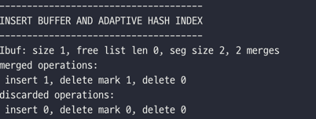

### 리두 로그 및 로그 버퍼

- 리두 로그는 **MySQL 서버가 비정상적으로 종료됐을 때 데이터 파일에 기록되지 못한 데이터를 잃지 않게 해주는 안전장치이다.**
- 대부분의 데이터베이스 서버는 데이터 변경 내용을 로그로 먼저 기록한다. (그래서 리두 로그를 WAL(Write Ahead Log)라고도 한다)
- **데이터 파일은 쓰기보다 읽기 성능을 고려한 자료 구조이기 때문에, 데이터 파일 쓰기는 디스크의 랜덤 액세스가 필요하다.**
- 랜덤 액세스로 인한 성능 저하를 막기 위해 쓰기 비용이 낮은 자료 구조를 가진 리두 로그를 사용해 서버가 종료되기 직전의 상태로 복구한다.

- MySQL 서버가 비정상 종료되는 경우  
  ① 커밋됐지만 데이터 파일에 기록되지 않은 데이터  
  &nbsp;&nbsp;&nbsp;&nbsp;→ 리두 로그의 내용을 데이터 파일에 복사  
  ② 롤백됐지만 데이터 파일에 이미 기록된 데이터  
  &nbsp;&nbsp;&nbsp;&nbsp;→ 언두 로그의 내용을 데이터 파일에 복사  
  ①, ②번 모두 리두 로그는 먼저 트랜잭션이 어떤 상태에서 종료되었는지 확인하기 위해서 필요하다.

- `innodb_flush_log_at_trx_commit`: 리두 로그를 어느 주기로 디스크에 동기화할지 설정 (기본값 1)
    - `0`: 1초에 한 번씩 리두로그를 디스크로 기록하고 동기화를 실행  
      MySQL 서버가 비정상 종료되면 최대 1초 동안 트랜잭션에서 변경한 데이터는 사라질 수 있다.
    - `1`: 매번 트랜잭션이 커밋될 때마다 디스크로 기록되고 동기화까지 수행
    - `2`: 매번 트랜잭션이 시작될 때마다 디스크로 기록은 되지만, 동기화는 1초에 한 번씩 실행    
      트랜잭션이 커밋되면 변경 내용이 운영체제의 메모리 버퍼로 기록되는 것이 보장된다.  
      MySQL 서버가 비정상 종료되더라도 운영체제가 정상적으로 작동한다면 트랜잭션의 데이터는 사라지지 않는다.
    - 리두 로그는 트랜잭션이 커밋되면 즉시 디스크로 기록되도록 시스템 변수를 설정하는 것을 권장한다.

- 전체 리두 로그 파일 크기는 두 시스템 변수의 곱으로 결정된다.
    - `innodb_log_file_size`: 리두 로그 파일들의 전체 크기 설정 (기본값 50,331,648)
    - `innodb_log_files_in_group`: 리두 로그 파일의 개수 설정 (기본값 2)

- 리두 로그 파일의 전체 크기가 InnoDB 버퍼 풀의 크기에 맞게 적절히 설정되어야 변경된 내용을 버퍼 풀에 모았다가 한 번에 디스크에 기록할 수 있다.
- **로그 버퍼는 리두 로그 버퍼링에 사용되는 공간**으로, 기본값인 16MB 수준에서 설정하는 것이 적합하다.

#### 리두 로그 아카이빙

- MySQL8.0 버전부터 InnoDB 스토리지 엔진의 리두 로그를 아카이빙할 수 있는 기능이 추가됐다.
- MySQL8.0의 리두 로그 아카이빙 기능은 데이터 변경이 많아서 아카이빙 작업 도중 리두 로그가 덮어쓰인다고 하더라도 백업이 실패하지 않게 해준다.

- 백업 툴이 리두 로그 아카이빙을 사용하려면 아카이빙된 리두 로그가 저장될 디렉터리를 설정해야 하며, 이 디렉터리는 운영체제의 MySQL 서버를 실행하는 유저(일반적으로 mysql 유저)만 접근이 가능해야 한다.
- `innodb_redo_log_archive_dirs`: 리두 로그가 저장될 디렉터리 경로

    ```bash
    ## 리두 로그 아카이빙 디렉터리 설정
    linux> mkdir /var/log/mysql_redo_archive
    linux> cd /var/log/mysql_redo_archive
    linux> mkdir 20220811
    linux> chmod 700 20220811
    
    mysql> SET GLOBAL innodb_redo_log_archive_dirs = 'backup:/var/log/mysql_redo_archive';
    
    ## 리두 로그 아카이빙 UDF 실행
    mysql> DO innodb_redo_log_archive_start('backup', '20220811');
    
    ## 리두 로그 아카이빙이 정상적으로 실행되는지 확인
    mysql> CREATE TABLE RODO_TEST (
        id bigint auto_increment,
        data mediumtext,
        PRIMARY KEY(id)
    );
    mysql> INSERT INTO RODO_TEST (data) SELECT repeat('123456789', 10000) FROM employees.salaries LIMIT 100;
    
    ## 아카이빙된 로그 파일 크기 확인
    linux> ls -alh 20220811/
    
    ## 리두 로그 아카이빙 종료 UDF 실행
    mysql> DO innodb_redo_log_archive_stop();
    ```

#### 리두 로그 활성화 및 비활성화

- MySQL 서버에서 트랜잭션이 커밋되더라도 데이터 파일은 즉시 디스크로 동기화되지 않는 반면, 리두 로그(트랜잭션 로그)는 항상 디스크로 기록된다.  
  (`innodb_flush_log_at_trx_commit` 값이 0 또는 2인 경우에는 리두 로그가 디스크로 즉시 동기화되지 않을 수도 있다.)
- MySQL8.0 버전부터는 수동으로 리두 로그를 활성화하거나 비활성화할 수 있게 되었다.
    ```sql
    ALTER INSTANCE DISABLE INNODB REDO_LOG;
  
    -- // 리두 로그를 비활성화한 후 대량 데이터 적재를 실행
    -- LOAD DAT ...
  
    ALTER INSTANCE ENABLE INNODB REDO_LOG;
  
    -- 리두 로그 활성화 여부 확인
    SHOW GLOBAL STATUS LIKE 'Innodb_redo_log_enabled';
    ```
    - 리두 로그를 비활성화하고 데이터 적재 작업을 실행했다면 데이터 적재 완료 후 리두 로그를 다시 활성화하는 것을 잊지 말자.

### 어댑티브 해시 인덱스

- 어댑티브 해시 인덱스는 사용자가 수동으로 생성하는 인덱스가 아니라 **InnoDB 스토리지 엔진에서 사용자가 자주 요청하는 데이터에 대해 자동으로 생성하는 인덱스이다.**
- `innodb_adaptive_hash_index`: 어댑티브 해시 인덱스 기능 활성화 여부 (기본값 ON)
- 어댑티브 해시 인덱스는 B-Tree 검색 시간들 줄여주기 위해 도입되었다.
    - B-Tree 인덱스에서 특정 값을 찾기 위해서는 (루트 노드 - 브랜치 노드 - 리프 노트)까지 찾아가야 원하는 레코드를 읽을 수 있다.
    - 어댑티드 해시 인덱스 사용하면 B-Tree의 (루트 노트 - 브랜치 노드)까지 찾아가는 비용이 없어진다.
- 어댑티브 해시 인덱스는 **버퍼 풀에 올려진 데이터 페이지에 대해서만 관리**되고, 버퍼 풀에서 해당 데이터 페이지가 없어지면 어댑티브 해시 인덱스에서도 해당 페이지의 정보는 사라진다.

> p.138
> 어댑티브 해시 인덱스가 활성화되지 않았을 때는 초당 20,000개 정도의 쿼리를 처리하면서 CPU 처리률은 100%였다.
> 어댑티브 해시 인덱스를 활성화한 후 쿼리의 처리량은 2배 가까이 늘어났음에도 불구하고 CPU 사용률은 오히려 떨어졌다.

- MySQL8.0 버전부터는 내부 잠금(세마포어) 경합을 줄이기 위해 어댑티브 해시 인덱스의 파티션 기능을 제공한다.
    - MySQL8.0 이전 버전에서는 어댑티브 해시 인덱스는 하나의 메모리 객체여서 경합이 상당히 심했다.
    - `innodb_adaptive_hash_index_parts`: 어댑티브 해시 인덱스의 파티션 개수 설정 (기본값 8)

- 어댑티브 해시 인덱스가 성능 향상에 크게 도움이 되지 않는 경우
    - 디스크 읽기가 많은 경우
    - 특정 패턴의 쿼리가 많은 경우 (조인이나 LIKE 패턴 검색)
    - 매우 큰 데이터를 가진 테이블의 레코드를 폭넓게 읽는 경우

- 어댑티브 해시 인덱스가 성능 향상에 도움이 되는 경우
    - 디스크의 데이터가 InnoDB 버퍼 풀 크기와 비슷한 경우 (디스크 읽기가 많지 않은 경우)
    - 동등 조건 검색(동등 비교와 IN 연산자)이 많은 경우
    - 쿼리 데이터 중에서 일부 데이터에만 집중되는 경우

- **어댑티브 해시 인덱스는 데이터 페이지를 메모리(버퍼 풀) 내에서 접근하는 것을 더 빠르게 만드는 기능이기 때문에 데이터 페이지를 디스크에서 읽어오는 경우가 빈번한 경우에는 도움이 되지 않는다.**

- 어댑티브 해시 인덱스가 도움이 되는지 아니면 불필요한 오버헤드를 만들고 있는지 판단해야 한다.
    - 어댑티브 해시 인덱스를 사용하면 데이터 페이지의 인덱스 키가 해시 인덱스로 만들어져야 하고 불필요한 경우 제거되어야 하며, 키 값이 해시 인덱스에 있든 없든 검색해봐야 한다.
    - 어댑티브 해시 인덱스에 적재되어 있는 테이블을 삭제하거나 변경하려고 하면 이 테이블이 가진 모든 데이터 페이지의 내용을 어댑티브 해시 인덱스에서 제거해야 한다.
- 어댑티브 해시 인덱스의 비율 및 메모리 사용량 조회
    - **e.g.** `1.03 hash searches/s, 2.64 non-hash searches/s` 인 경우
        - 초당 3.67(=2.64 + 1.03)번의 검색이 실행되었고, 어댑티브 해시 인덱스 사용 비율은 28% 정도이다.
        - 이 값은 어댑티브 해시 인덱스가 사용 중인 메모리 공간, 서버의 CPU 사용량을 종합해서 판단해야 한다.
        - 어댑티브 해시 인덱스가 사용 중인 메모리 사용량이 높다면 어댑티브 해시 인덱스를 비활성화해서 InnoDB 버퍼 풀이 더 많은 메모리를 사용하게 하는 것도 좋은 방법이다.
    ```sql
    -- INSERT BUFFER AND ADAPTIVE HASH INDEX 상태 확인 
    SHOW ENGINE INNODB STATUS\G 
    
    -- 어댑티트 해시 인덱스 메모리 사용량 확인
    SELECT event_name, current_number_of_bytes_used
    FROM performance_schema.memory_summary_global_by_event_name
    WHERE event_name = 'memory/innodb/adaptive hash index';
    ``` 

### InnoDB와 MyISAM, MEMORY 스토리지 엔진 비교

- MySQL8.0 으로 업그레이드되면서 MySQL 서버의 모든 시스템 테이블이 InnoDB 스토리지 엔진으로 교체되었다.

- InnoDB와 MyISAM 비교

| | InnoDB | MyISAM |
|:---:|:---:|:---:|
| 클러스터링 테이블(인덱스) | O | X <br> 프라이머리 키와 세컨더리 인덱스의 구분이 없음|
| 외래키 설정 지원 | O | X |
| 트랜잭션 지원 | O | X |
| Locking Level(잠금 방식) | 레코드 단위 잠금 | 테이블 단위 잠금 |
| 데이터 캐싱 | 버퍼 풀 사용 | 키 캐시 사용 |
| 전문 검색 및 공간 좌표 검색 | O | O |

- InnoDB 스토리지 엔진의 기능이 개선되는 만큼 MyISAM 스토리지 엔진의 기능은 도태되어, 이후 버전에서는 MyISAM 스토리지 엔진은 없어질 것으로 예상한다.

## 3. MyISAM 스토리지 엔진 아키텍처

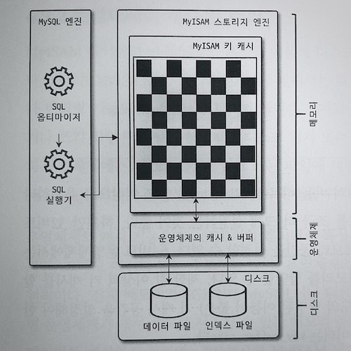

### 키 캐시

- MyISAM의 키 캐시(Key cache, 키 버퍼라고도 불림)는 InnoDB의 버퍼 풀과 비슷한 역할을 한다.
    - 하지만 MyISAM의 키 캐시는 인덱스만 대상으로 작동하며, 인덱스의 디스크 쓰기 작업에 대해서만 부분적으로 버퍼링 역할을 한다.

- 키 캐시의 효율성 측정 수식
    ```text
    키 캐시 히트율 = 100 - (Key_reads / Key_read_requests * 100) Key_reads
    ```
    - Key_reads: 인덱스를 디스크에서 읽어 들인 횟수를 저장
    - Key_read_requests: 키 캐시로부터 인덱스를 읽은 횟수를 저장

    ```sql
    -- Key_reads, Key_read_requests의 상태 값 조회
    SHOW GLOBAL STATUS LIKE 'Key%';
    ```

- 일반적으로 키 캐시를 이용한 쿼리의 비율(히트율)을 99% 이상으로 유지하라고 권장한다.
    - 히트율 99% 미만인 경우 키 캐시를 조금 더 크게 설정 하는 것이 좋다.
    - `key_buffer_size`: 기본 키 캐시 공간을 설정

- 제한 값 이상의 키 캐시를 할당하려면 기본 키 캐시 이외의 별도의 명명된 키 캐시 공간을 설정해야 한다.
    - 기본 키 캐시는 4GB이며, 명명된 키 캐시를 따로 2GB씩 설정한다.
    ```text
    key_buffer_size = 4GB
    kbuf_board.key_buffer_size = 2GB
    kbuf_comment.key_buffer_size = 2GB
    ```
    - 추가 키 캐시는 어떤 인덱스를 캐시할지 별도로 설정해 주어야 한다.
    ```sql
    CACHE INDEX db1.board, db2.board IN kbuf_board;
    CACHE INDEX db1.comment, db2.comment IN kbuf_comment;
    ```

### 운영체제의 캐시 및 버퍼

- MyISAM 테이블의 데이터에서 읽거나 쓰는 작업은 캐시나 버퍼링 기능이 없기 때문에 항상 운영체제의 디스크를 읽거나 쓰는 작업으로 요청된다.
- 운영체제의 캐시 기능은 사용할 수 있지만, 운영체제 메모리에 남는 공간이 없다면 MyISAM 테이블 데이터는 캐시하지 못하게 되어 쿼리 속도가 느려진다.
- 일반적으로 키 캐시는 최대 물리 메모리의 40% 이상을 넘지 않게 설정하고, 나머지 공간은 운영체제 자체 파일 시스템을 위한 캐시 공간으로 남겨두는 것이 좋다.

### 데이터 파일과 프라이머리 키(인덱스) 구조

- MyISAM 테이블은 **프라이머리 키에 의한 클러스터링 없이** 데이터 파일이 힙(Heap) 공간처럼 활용 되어, 프라이머리 키 값과 무관하게 `INSERT`되는 순서대로 데이터 파일에 저장된다.
- MyISAM 테이블에 저장되는 레코드는 모두 `ROWID`라는 물리적인 주소값을 가진다.
    - 프라이머리 키와 세컨더리 인덱스는 모두 데이터 파일에 저장된 레코드의 `ROWID`값을 포인터로 가진다.

- `ROWID`은 두 가지 방법으로 저장될 수 있다.
    - 고정 길이 ROWID
        - `MAX_ROWS` 옵션을 명시하면 최대로 가질 수 있는 레코드가 한정된 테이블 생성한다.
    - 가변 길이 ROWID
        - `myisam_data_pointer_size`: `ROWID`의 최대 사용 가능 공간을 바이트 수로 설정 (기본값 7)
        - `MAX_ROWS` 옵션을 설정하지 않고 `myisam_data_pointer_size`의 기본값으로 사용하는 경우 최대 크기는 256TB(2⁸⁽⁷⁻¹⁾)이 된다.

## 4. MySQL 로그 파일

- 로그 파일을 이용하면 MySQL 서버의 깊은 내부 지식이 없어도 MySQL의 상태나 부하를 일으키는 원인을 쉽게 찾아서 해결할 수 있다.

### 에러 로그 파일

- MySQL이 실행되는 도중에 발생하는 에러나 경고 메시지가 출력되는 로그 파일이다.
- `log_error`: 에러 로그 파일의 위치를 설정
    - 별도로 설정하지 않은 경우에는 데이터 디렉터리에 `.err` 확장자가 붙은 파일로 생성된다.

#### MySQL이 시작하는 과정과 관련된 정보성 및 에러 메시지

- 에러 로그 파일을 통해 설정된 변수의 이름이나 값이 명확하게 설정되고 의도한 대로 적용되었는지 확인해야 한다.

#### 마지막으로 종료할 때 비정상적으로 종료된 경우 나타나는 InnoDB의 트랜잭션 복구 메시지

- 일반적으로 이 단계에서 발생하는 문제는 상대적으로 해결하기 어려운 문제점일 때가 많다.
- 자동화된 장애 복구 내용(`innodb_force_recover`)을 참고하자. (p.106)

#### 쿼리 처리 도중에 발생하는 문제에 대한 에러 메시지

- 쿼리 도중 발생하는 문제점은 사전 예방이 어려우며, 주기적으로 에러 로그를 검토하는 과정에서 알게 된다.
- 쿼리 실행 도중 발생한 에러나 복제에서 문제가 될 만한 쿼리에 대한 경고 메시지가 에러 로그에 기록된다.

#### 비정상적으로 종료된 커넥션 메시지(Aborted connection)

- 클라이언트 애플리케이션에서 정상적으로 접속 종료를 하지 못하고 프로그램이 종료된 경우 MySQL 서버의 에러 로그 파일에 이런 내용이 기록된다.
- 네트워크에 문제가 있어서 접속이 끊어지는 경우에도 이런 메시지가 기록된다.
- `max_connection_errors` 변수 값이 낮게 설정된 경우 "Host 'host_name' is blocked"라는 에러가 발생할 수도 있다.

#### InnoDB의 모니터링 또는 상태 조회 명령의 결과 메시지

- InnoDB의 테이블 모니터링, 락 모니터링, 엔진 상태를 조회하는 명령은 큰 메시지를 에러 로그 파일에 기록한다.
- 모니터링을 활성화 계속 유지하면 에러 로그 파일이 매우 커져서 파일 시스템 공간을 많이 차지하게 되므로, 모니터링을 사용한 이후에는 다시 비활성화해서 에러 로그 파일이 커지니 않게 해야 한다.

#### MySQL의 종료 메시지

- 만약 누군가가 MySQL 서버를 종료시켰다면 에러 로그 파일에 'Received SHUTDWON for user ...'라는 메시지를 확인할 수 있을 것이다.
- 하지만, 종료 관련 메시지가 없거나 스택 트레이스와 같은 내용이 출력되는 경우에는 MySQL 서버가 세그먼테이션 폴트로 비정상적으로 종료된 것으로 판단할 수 있다.
- 세그먼트 폴트로 종료된 경우에는 스택 트레이스의 내용을 참조해서 MySQL 버그를 조사하고, 버전을 업그레이드하거나 회피책을 찾는 것이 최선이다.

### 제너럴 쿼리 로그 파일

- 쿼리 로그 파일에는 시간 단위로 실행됐던 쿼리의 내용이 모두 기록된다.
- 제너럴 쿼리 로그는 실행되기 전에 MySQL이 쿼리 요청을 받으면 바로 기록하기 때문에 실행 중에 에러가 발생해도 일단 로그 파일에 기록된다.
- `general_log_file`: 쿼리 로그 파일의 경로 설정
- `log_output`: 쿼리 로그를 파일이 아닌 테이블에 저장하도록 설정 (기본값 FILE)
    - `TABLE`로 설정하면, 제너럴 로그를 `general_log` 테이블에 저장한다.

### 슬로우 쿼리 로그

- 서버의 쿼리를 튜닝하기 위해 어떤 쿼리가 문제의 쿼리인지 판단하는데 슬로우 쿼리 로그가 상당히 많은 도움이 된다.
- `long_query_time`: 슬로우 쿼리 로그에 기록되는 쿼리 수행 시간을 설정 (기본값 10)
- 슬로우 쿼리 로그는 쿼리가 정상적으로 실행 완료 되어야 기록될 수 있다.
- `log_output`: 쿼리 로그를 파일이 아닌 테이블에 저장하도록 설정 (기본값 FILE)
    - `TABLE`로 설정하면, 슬로우 쿼리 로그를 `slow_log` 테이블에 저장한다.

- 슬로우 쿼리 로그에 출력되는 내용
    - `Time`: 쿼리 종료된 시점
    - `User@Host`: 쿼리를 실행한 사용자의 계정
    - `Query_time`: 쿼리가 실행되는데 걸린 전체 시간
    - `Lock_time`: MySQL 엔진 레벨에서 관장하는 테이블 잠금에 대한 대기 시간  
      InnoDB 테이블에만 접근하는 쿼리 문장의 슬로우 쿼리 로그에서는 Lock_time 값은 튜닝이나 쿼리 분석에 별로 도움이 되지 않는다.
    - `Rows_examined`: 쿼리가 처리되기 레코드에 접근한 건 수
    - `Rows_sent`: 실제 처리 결과를 클라이언트로 보낸 건 수

- 일반적으로 슬로우 쿼리 또는 제너럴 로그 파일의 내용이 상당히 많아서 어느 쿼리를 집중적으로 튜닝해야 할지 식별하기가 어려울 수도 있다.
    - [Percona Tookit](https://www.percona.com/doc/percona-toolkit/LATEST/index.html) 의 pt_query_digest 스크립트를 이용하면 쉽게
      빈도나 처리 성능별로 쿼리를 정렬해서 살펴볼 수 있다.
    ```bash
    ## General Log 파일 분석
    linux> pt_query_digest --type='genlog' general.log > parsed_general.log
  
    ## Slow Log 파일 분석
    linux> pt_query_digest --type='slowlog' mysql-slow.log > parsed_mysql-slog.log  
    ```

- 로그 파일의 분석이 완료되면 그 결과는 3개의 그룹으로 나뉘어 저장된다.

#### 슬로우 쿼리 통계

- 분석 결과 최상단에 표시되며, 모든 쿼리를 대상으로 슬로우 쿼리 로그의 실행 시간, 잠금 대기 시간 등에 대해 평균 및 최소/최대 값을 표시한다.

#### 실행 빈도 및 누적 실행 시간순 랭킹

- 각 쿼리별로 응답 시간과 실행 횟수를 보여주는데, 일반적으로 같은 모양의 쿼리라면 동일한 Query ID를 갖게 된다.
- pt_query_digest 명령 실행 시 --order-by 옵션으로 정렬 순서를 변경할 수 있다.

#### 쿼리별 실행 횟수 및 누적 실행 시간 상세 정보

- Query ID별로 쿼리가 얼마나 실행됐는지, 쿼리의 응답 시간에 대한 히스토그램 같은 상세한 내용을 보여준다.

<br>

## Reference

- [DBMS 버퍼 관리의 두 가지 흐름](https://www.datanet.co.kr/news/articleView.html?idxno=115592)
- [InnoDB 스토리지 엔진 아키텍처](https://jwkim96.tistory.com/261)
- [우기의 MySQL 아키텍처](https://www.youtube.com/watch?v=vQFGBZemJLQ)
