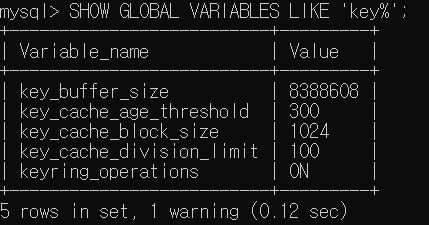

# 04. 아키텍쳐

`MySQL 서버` = `MySQL 엔진`  + `스토리지 엔진(기본 InnoDB, MyISAM 제공)`

핸들러 API 를 만족하면 스트리지 엔진을 구현해서 MySQL 서버에 추가해서 사용 가능

## 4.1 MySQL 엔진 아키텍쳐

MySQL 서버는 다른 DBMS에 비해 독특한 구조를 가짐

### 4.1.1 MySQL의 전체 구조

대부분의 프로그래밍 언어로 접근 가능.


### MySQL 엔진

클라이언트의 접속 및 쿼리 요청을 처리하는 `커넥션 핸들러`와 `SQL 파서` 및 전처리기, `옵티마이저`가 중심. `표준 SQL 문법을 지원` 하기 때문에 타 DBMS 와 호환 가능.

→ MySQL 엔진 : **`요청된 SQL 문장 분석, 최적화 등을 처리하며 엔진은 1개로 구성`**


### 스토리지 엔진

→ 스토리지 엔진 : **`실제 데이터를 디스크 스토리지에 저장`** 및 **`디스크 스토리지로부터 데이터를 읽어오는 부분을 담당. n개의 엔진 동시 사용 가능`**

테이블 단위로 작업을 담당할 스토리지 엔진 지정이 가능. 스토리지 엔진 성능 향상을 위해 키 캐시(MyISAM 스토리지 엔진), InnoDB 버퍼 풀 등 기능 내장 됨.

```sql
mysql> CREATE TABLE test_table(fd1 INT, fd2 INT) ENGINE=INNODB;
```

### 핸들러 API

`데이터 읽기, 쓰기 작업을 위해 스토리지 엔진에 읽기, 쓰기 요청` = `핸들러(Hnadler) 요청`

요청 수행 시 사용되는 API가 핸들러 API.

```sql
mysql> SHOW GLOBAL STATUS LIKE 'Handler%';
```


### 4.1.2 MySQL의 스레딩 구조

MySQL 서버는 `스레드기반` 으로 작동. `포그라운드(Foreground)`, `백그라운드(Background)` 스레드로 구성 됨.


```sql
-- 실행중인 스레드 목록 확인
mysql> SELECT thread_id, name, type, processlist_user, processlist_host
 				FROM performance_schema.threads ORDER BY type, thread_id;
```


- `포그라운드(Foregraound) 스레드`
    - **클라이언트 스레드**, `최소 MySQL 서버에 접속된 클라이언트 수만큼 존재`
    - `사용자가 요청하는 쿼리 문장을 처리`. 사용자가 요청한 작업을 처리하기 때문에 **사용자 스레드**라고도 불림.
    - **커넥션 종료 시** 담당하는 스레드는 **스레드 캐시로 되돌아 감**
    `thread_cache_size` 시스템 변수에 정의된 갯수만큼만 캐시로 유지하며 나머지는 스레드 종료 시킴
        
        
        
    - 포그라운드 스레드는 `MySQL 데이터 버퍼/캐시 에서 데이터를 가져 옴`. 없는 경우 디스크의 데이터나 인덱스 파일로 읽어와서 작업을 처리
    - MyISAM : 데이터 읽기/쓰기 처리
    InnoDB : 데이터 읽기만 처리. 쓰기는 백그라운드 스레드에서 처리.
- `백그라운드(Background) 스레드`
    - InnoDB 는 여러 작업을 백그라운드로 처리
        - 인서트 버퍼(Insert Buffer) 병합 스레드
        - `로그를 디스크 쓰기 스레드`
        - `InnoDB 버퍼 풀의 데이터 쓰기 스레드`
        - 데이터를 버퍼로 읽어오는 스레드
        - 잠금이나 데드락을 모니터링하는 스레드
    - MySQL 5.5 ~ 데이터 읽기/쓰기 스레드를 2개 이상 지정 가능
    `innodb_read_io_threads`, `innodb_wirte_io_threads` 시스템 변수로 설정 가능하며, 보통 쓰기 쓰레드는 아주 많은 백그라운드 작업을 처리하기 때문에 2~4(일반 디스크), 사용 가능한 만큼 충분(NAS, SAN)하게 설정.
        
        
        
    

### 4.1.3 메모리 할당 및 사용 구조

`MySQL 메모리 공간`은 `글로벌 메모리` 영역과 `로컬 메모리` 영역으로 구분.

글로벌 메모리 영역의 모든 공간은 MySQL 서버가 시작되면서 운영체제로부터 할당 됨.


- **`글로벌 메모리 영역`**
    - **하나의 메모리 공간만 할당**(클라이언트 스레드 수와 무관)
    - 필요에 따라 2개 이상 할당 가능하며, 생성된 **글로벌 영역은 모든 스레드에 의해 공유**
    - `테이블 캐시` / `InnoDB 버퍼 풀` / `InnoDB 어댑티브 해시 인덱스` / `InnoDB 리두 로그 버퍼`
- **`로컬 메모리 영역`**
    - **세션 메모리 영역. 클라이언트 메모리 영역** 이라고도 부름.
    **클라이언트 스레드 쿼리 처리 시 사용하는 메모리 영역**
    - 각 클라이언트 **스레드별로 독릭접으로 할당**되며 ***절대 공유되지 않음***
    - 쿼리 용도 별 필요 시에만 공간을 할당함
    - `정렬 버퍼` / `조인 버퍼` / `바이너리 로그 캐시` / `네트워크 버퍼`

### 4.1.4 플러그인 스토리지 엔진 모델

MySQL 은 `플러그인 모델` 을 제공하며 스토리지 엔진, 검색어 파서, 사용자 인증 등 다양한 형태의 플러그인 제공.


쿼리 실행 시 거의 **대부분 작업을 MySQL 엔진에서 처리. `데이터 읽기/쓰기` 작업만 스토리지 엔진에서 처리.**  각 처리 영역에서 1건의 레코드 단위로 처리.


> `핸들러(Handler)` 란? MySQL 엔진이 스토리지 엔진을 조정하기 위해 사용하는 것.
> 

**MySQL 엔진이 스토리지 엔진에게** 데이터 읽기/저장 **명령 시 반드시 핸들러를 통해야 함.**

다른 스토리지 엔진을 사용하는 테이블 쿼리 시, MySQL 처리 내용은 대부분 동일하며 데이터 읽기/쓰기 영역의 처리만 다름. 

GROUP BY, ORDER BY 등 복잡한 처리는 MySQL 처리영역 > `SQL 쿼리 실행기`  담당

하나의 쿼리 작업은 여러개의 하위 작업으로 나뉘는데, 하위 **작업 처리가 MySQL 엔진 영역인지 스토리지 엔진 영역인지 구분하는 것이 중요**

```sql
-- mysqld(MySQL 서버) 에서 지원하는 engine 목록
-- SUPPORT 칼럼
--        YES: 서버에 포함 및 활성화
--         NO: 서버에 불포함
--    DEFAULT: YES 와 동일 상태. 필수 스토리지 엔진
--   DISABLED: 서버에 포함 및 비활성화
mysql> SHOW ENGINES;
```


MySQL 서버에 불포함 된 스토리지 엔진 사용을 위해서는 서버를 다시 빌드(컴파일) 해야 하지만 플러그인 형태로 빌드된 라이브러리로 끼워넣기 가능하며 업그레이드 가능. MySQL 서버에서 스토리지 엔진 뿐 아니라 다양한 기능을 플러그인 형태로 지원하고, 확장 및 커스텀하게 사용 가능

```sql
-- 플러그인 목록 확인
mysql> SHOW PLUGINS;
```


플러그인은 아래와 같은 단점을 가짐

- 오직 MySQL 서버와 인터페이스 할수 있고, 플러그인끼리 통신 불가
- MySQL 서버의 변수나 함수를 직접 호출하므로 안전하지 않음(캡슐화X)
- 상호 의존 관계 설정 불가로 초기화 어려움

### 4.1.5 컴포넌트

MySQL 8.0 ~ 플러그인 아키텍처 대체하기 위해 컴포넌트 아키텍처 지원

예시)
  ~ MySQL 5.7 비밀번호 검증 기능을 플러그인 형태로 제공. 
  MySQL 8.0 ~  컴포넌트로 개선되어 제공.

### 4.1.6 쿼리 실행 구조


- `쿼리 파서`
    - 사용자 요청에 의한 **쿼리 문장을 토큰으로 분리**해 트리 형태의 구조로 만들어 내는 작업
    토큰? MySQL 이 인식하는 최소 단위의 어휘나 기호
    - **기본 문법 오류 발견** 및 사용자에게 오류 메시지 전달
- `전처리기`
    - 파서 트리를 기반으로 **쿼리 문장에 구조적 문제점 포함 여부 확인**
    - 토큰을 테이블/칼럼 명칭 및 내장 함수 개체를 매핑해 **객체 존재 여부와 접근 권한 확인 수행**
    - **존재하지 않거나 권한 미보유로 사용 불가 개체의 토큰을 발견**
- **`옵티마이저` : DBMS의 두뇌에 해당**
    - 쿼리 문장을 **저렴한 비용으로  빠르게 처리하기 위한 결정을 담당**
- `실행엔진`
    - 만들어진 계획대로 **각 핸들러에게 요청** 및 요청 후 받은 **결과를 또 다른 핸들러  요청의 입력으로 연결**하는 역할 수행
- `핸들러(스토리지엔진)`
    - MySQL 서버의 가장 밑단에서 **MySQL 실행 엔진의 요청에 따라 데이터 조회/저장 역할을 담당**
    - 핸들러 == 스토리지엔진

### 4.1.7 복제

### 4.1.8 쿼리 캐시

- **SQL 쿼리 실행 결과를 메모리에 캐시**. 동일 SQL 쿼리가 실행되면 캐시된 정보를 결과로 반환하기 때문에 매우 빠른 성능을 가짐.
- 데이터 변경 시 캐시에 저장된 결과 중 변경된 데이터를 Invalidate 해야 함 → 심각한 동시 처리 성능 저하 유발 및 버그의 원인이 됨 → **MySQL 8.0 ~ Deprecated.**

### 4.1.9 스레드 풀

- 엔터프라이즈 에디션에서 스레드 풀 기능 제공
- 커뮤니티 에디션은 미지원 → `Percona Server(퍼코나 서버) 에서 제공하는 스레드 풀 플러그인 라이브러리 (thread_pool.so) 를 MySQL 서버에 설치`하여 사용
- `사용자의 요청을 처리하는 스레드 개수를 줄여 MySQL 서버의 CPU가 제한된 개수의 스레드 처리에만 집중하도록 서버의 자원 소모를 줄이는 것이 목적`. 동시에 실행 중인 스레드들을 CPU가 최대한 잘 처리해낼 수 있는 수준으로 줄여서 빠르게 처리하게 하는 기능.
- Percona Server의 스레드 풀은 CPU 코어의 개수만큼 스레드 그룹 생성.
`thread_pool_size` 시스템 변수로 스레드 그룹 개수 조정 가능
- 스레드 풀이 처리중인 작업이 있는 경우 `thread_pool_oversubscribe(Default 3)` 시스템 변수에 설정된 개수만큼 추가로 처리 가능.
- 스레드 그룹의 모든 스레드가 일을 처리하고 있다면, 새로운 그룹에 스레드 추가 or 기존 작업 스레드가 처리 완료까지 기다릴지 여부를 판단 해야 함
→ `thread_pool_stall_limit` 시스템 변수에 정의된 밀리초 내에 작업이 끝나지 못하면 새로운 스레드 생성 후 그룹에 추가함.
→ 스레드 풀의 최대 스레드 갯수는 `thread_pool_max_threads` 시스템 변수에 정의된 값을 넘을 수 없음
- Percona Server의 스레드 풀 플러그인은 선순위 큐와 후순위 큐를 이용해 트랙잭션이나 쿼리를 우선적으로 처리하는 기능 제공
    
    > https://github.com/Growing-Up-Together/ReadingRecord/issues/13
    [Percona Server 스레드 풀 - 트랜잭션 처리 관련](https://www.percona.com/blog/2014/01/29/percona-server-thread-pool-improvements/)
    
    Queuing Order 는 우측의 BEGIN이 1번째 요청, 좌측의 요청들이 순서대로 쌓임
    Executing Order 는 좌측의 BEGIN이 1번째 실행 순서, 우측의 요청들이 순서대로 실행
    > 
    > 
    > 
    > 
    > 파랑/초록/노랑 BEGIN, QUERY, COMMIT 순서대로 사용자 요청 유입 -> Queuing Order
    > 우선 순위를 적용하지 않은 상태에서 사용자 요청이 유입된 순서대로 요청 처리 -> Execution Order
    > 파랑/초록/노랑 BEGIN, QUERY, COMMIT 순서대로 작업이 진행되며 마지막 파랑/초록/노랑 COMMIT 요청이 실행되는 시점에 각 트랜잭션의 쿼리가 처리되고 스레드 작업 종료
    > 
    > 
    > 
    > 파랑/초록/노랑 BEGIN, QUERY, COMMIT 순서대로 사용자 요청 유입 -> Queuing Order
    > 우선 순위가 적용되어 실행 순서가 재배치 되어 사용자 요청 처리 -> Execution Order
    > BEGIN 요청 이후 파랑 QUERY/COMMIT, 초록 QUERY/COMMIT, 노랑 QUERY/COMMIT 순으로 요청이 실행되어 COMMIT 요청 시점에 각 트랜잭션의 쿼리가 처리되고 스레드 작업 종료
    > 
    > **→ 따라서 우선순위를 적용하여 실행순서가 재배치된 경우,
    > 우선순위가 적용되지 않은 작업보다 `트랜잭션 처리 시점이 빨라져 잠금 경합을 낮출 수 있으므로 전체적인 처리 성능 향상`**
    > 

### 4.1.10 트랜잭션 지원 메타데이터

- `메타데이터 / 데이터 딕셔너리` : 데이터베이스 서버에서 테이블의 구조 정보 및 스토어드 프로그램 등의 정보
- ~ MySQL 5.7 버전까지 테이블 구조 및 일부 스토어드 프로그램을 FRM 파일 기반으로 관리 → MySQL 서버 비정상 종료 시 데이터베이스나 테이블 깨짐 현상 발생
- `MySQL 8.0 ~ 관련 정보 모두를 InnoDB의 테이블에 저장하도록 개선`. 시스템 테이블(=MySQL 서버가 동작하는데 기본적으로 필요한 테이블들, 사용자의 인증과 권한에 관련된 테이블) 과 데이터 딕셔너리 정보 모두 `mysql DB에 저장하며 통째로 mysql.ibd 테이블 스페이스에 저장`

## 4.2 InnoDB 스토리지 엔진 아키텍쳐

InnoDB 엔진은 MySQL에서 사용가능 한 `스토리지 엔진 중 가장 많이 사용되며, 유일하게 레코드 기반의 잠금을 제공하여 높은 동시성 처리가 가능하고 안정적이면 성능이 뛰어남`.


### 4.2.1 프라이머리 키에 의한 클러스터링

- `InnoDB의 모든 테이블은 프라이머리 키를 기준으로 클러스터링 되어 저장 됨 → 프라이머리 키 값의 순서대로 디스크에 저장`.
- 레코드의 주소 대신 프라이머리 키 값을 논리적 주소로 사용.
- 프라이머리 키가 클러스터링 인덱스이기에 프라이머리 키를 이용한 레인지 스캔의 처리속도는 상당히 빠름.
- MyISAM 에서는 지원하지 않음.

> 레인지 스캔(Range Scan) : 테이블의 특정 레코드에만 엑세스하여 읽어들임
> 
> 
> 
> 

> 클러스터링 인덱스 : 프라이머리 키값이 비슷한 레코드끼리 묶어서 저장하는 것
> 

### 4.2.2 외래 키 지원

- InnoDB 스토리지 엔진 레벨에서 지원함. MyISAM, Memory 테이블 사용 불가.
- `InnoDB 외래키는 부모/자식 테이블 모두 칼럼 생성이 필요하고, 데이터 변경 시 부모/자식 테이블 모두 데이터 체크 작업`이 필요하므로 외래 키 존재에 유의 해야 함.
- 외래키가 복잡하게 얽힌 경우 작업이 쉽지 않으므로 `foreign_key_checks`시스템 변수 설정으로 외래 키 관계 체크 작업을 멈춤 가능

```sql
--  GLOBAL, SESSION 모두 설정 가능한 변수
-- 반드시 SESSION 변수로 사용하고, 작업 후 ON 
mysql> SET SESSION foreign_key_checks=OFF;
mysql> SET SESSION foreign_key_checks=ON;
```

### 4.2.3 MVCC(Multi Version Concurrency Control)

- 레코드 레벨의 트랜잭션을 지원하는 DBMS가 제공하는 기능
- `잠금을 사용하지 않는 일관된 읽기를 제공하는것이 가장 큰 목적`, InnoDB는 언두로그를 이용해 기능을 구현
- 하나의 레코드에 대해 2개의 버전이 유지되고, 필요에 따라 어느 데이터가 보여지는지 여러가지 상황에 따라 달라지는 구조

### 4.2.4 잠금 없는 일관된 읽기(Non-Locking Consistent Read)

- `InnoDB 스토리지 엔진은 MVCC 기술을 이용해 잠금을 걸지 않고 읽기 작업을 수행`
- 사용자1이 레코드 변경 후 커밋하지 않은 상태여도 변경 트랜잭션이 사용자2의 SELECT 작업을 방해하지 않음 → `잠금 없는 일관된 읽기`
- InnoDB에서 변경 전 데이터 조회를 위해 언두로그를 사용

### 4.2.5 자동 데드락 감지

- InnoDB 스토리지 엔진은 **잠금 대기 목록을 그래프 형태로 관리**.
- **`데드락 감지 스레드가 주기적으로 잠금 대기 그래프를 검사해 교착 상태에 빠진 트랜잭션 확인 → 언두 로그 양이 적은 트랜잭션을 강제 종료`**
- `innodb_table_locks` 시스템 변수를 활성화하여 엔진 내부 레코드 잠금 뿐 아니라 테이블 레벨 잠금까지 감지 가능
- 동시 처리 스레드가 매우 많거나 각 트랜잭션의 잠금 개수가 많아지면 데드락 감지 스레드가 느려짐 → `innodb_deadlock_detect` 시스템 변수를 제공하여 데드락 감지 스레드를 off 시킬수 있음. → 데드락 감지 스레드가 비활성화 되면 경우 데드락 상황 발생 시 무한정 대기 발생 → innodb_lock_wait_timeout 스템 변수 활성화 하여 문제 해결 가능
- `innodb_lock_wait_timeout` 시스템 변수를 초 단위로 설정 가능. 데드락 상황에서 일정 시간 초과 시 자동으로 요칭 실패 후 에러메시지 리턴

### 4.2.6 자동화된 장애 복구

- InnoDB 데이터 파일은 MySQL 서버 시작 시 항상 자동 복구를 수행 함. 이 단계에서 자동 복구 불가능한 손상이 있다면 복구를 멈추고 서버를 종료 시팀.
- `innodb_force_recovery` 시스템 변수를 이용해 서버를 시작해야함. 1~6까지 입력 가능
    - 1( SRV_FORCE_IGNORE_CORRUPT) : 데이터 손상 시, 손상된 부분 무시 후 시작
    - 2(SRV_FORCE_NO_BACKGROUND) : 언두 데이터 삭제과정에서 장애 발생 시, 백그라운드 스레드 중 메인 스레드를 시작하지 않고 서버 시작
    - 3(SRV_FORCE_NO_TRX_UNDO) : 커밋되지 않고 종료된 트랜잭션은 계속 그 상태로 남아있게 서버 시작
    - 4(SRV_FORCE_NO_IBUF_MERGE) : InnoDB 스토리지 엔진이 인서트 버퍼의 내용 무시 후 강제로 서버 시작
    - 5(SRV_FORCE_NO_UNDO_LOG_SCAN) :  언두 로그 모두 무시 후 서버 시작. 서버가 종료되던 시점에 커밋되지 않았던 작업도 모두 커밋된 것처럼 처리되므로 실제로 잘못 된 데이터가 데이터베이스에 남음.
    - 6(SRV_FORCE_NO_LOG_REDO) : 리두 로그 손상 시 서버 시작 불가. 리두 로그 모두 무시한 채로 서버 시작.

### 4.2.7 InnoDB 버퍼 풀

InnoDB 스토리지 엔진에서 가장 핵심 적인 부분이며 `디스크의 데이터 파일이나 인덱스 정보를 메모리에 캐시해 두는 공간.`  랜덤한 디스크 작업을 발생시키는 INSERT, UPDATE, DELETE 쿼리들을 데이터 풀이 모아서 처리하여 랜덤한 디스크 작업의 횟수를 줄임.

### 버퍼 풀의 크기 설정

- InnoDB 버퍼 풀은 `운영체제와 각 클라이언트 스레드가 사용할 메모리를 고려해서 설정`
    - `레코드 버퍼`(각 클라이언트 세션에서 테이블의 레코드를 읽고 쓸 때 버퍼로 사용하는 공간)가 상당한 메모리를 사용 함 → MySQL 서버가 사용하는 `레코드 버퍼 공간은 설정 불가하며 전체 커넥션 개수와 읽고 쓰는 테이블 개수에 따라 결정 됨`
- MySQL 5.7 ~ `innodb_buffer_pool_size` 시스템 변수로 크기를 설정하여 InnoDB 버퍼 풀 크기 동적 조절 가능
    - `운영체제 전체 메모리 8GB 미만 → 50% 정도`만 InnoDB 버퍼 풀로 설정
    `50GB 이상 → 대략 15~30GB` InnoDB 버퍼풀로 설정
    - `버퍼 풀의 크기 변경은 크리티컬한 변경`이므로 한가한 시점에 작업하는 것이 좋음
    - `버퍼 풀 크기를 줄이는 작업은 서비스 영향도가 매우 큼.` 작업을 피하는게 좋음
    - InnoDB 버퍼 풀은 내부적으로 128MB 청크 단위로 쪼개어 관리 됨.
- `innodb_buffer_pool_instances` 시스템 변수를 이용해 버퍼 풀을 여러개로 분리해서 관리 가능
    - 기본 버퍼 풀 인스턴스는 기본 8개
    메모리 크기 1GB 미만 → 1개의 버퍼 풀 인스턴스만 생성
    메모리 40GB 이하 → 기본값 8개의 버퍼 풀 인스턴스 유지
    메모리 40GB 초과 → 버퍼 풀 인스턴스 당 5GB 유지 되도록 개수 설정

### 버퍼 풀의 구조

- InnoDB 스토리지 엔진은 `버퍼 풀이라는 거대한 메모리 공간을 innodb_page_size 시스템 변수에 설정된 페이지 크기만큼 쪼개어 InnoDB 스토리지 엔진이 데이터를 필요로 할 때 해당 데이터 페이지를 읽어서 각 조각에 저장 함`
- 버퍼 풀의 페이지 크기 조각 관리를 위해 `LRU, Flush, Free 리스트 3개의 자료 구조를 관리`
    - `LRU(Least Recently User) 리스트` : LRU와 MRU(Most Recently User) 리스트가 결합된 형태. 디스크로부터 한 번 읽어온 페이지를 최대한 오랫동안 InnoDB 버퍼 풀의 메모리에 유지 후 디스크 읽기 최소화를 위해 관리 함
        
        
        
        - Old Sublist = LRU, New Sublist = MRU
        - 처음 한 번 읽힌 페이지가 이후 자주 사용 → 해당 데이터 페이지는 MRU 영역에 생존
        거의 사용되지 않음 → LRU의 끝으로 밀려남 → InnoDB 풀에서 제거(=Eviction)
    - `Free 리스트` : InnoDB 버퍼 풀에서 실제 사용자 데이터로 채워지지 않은 빈 페이지 목록. 사용자의 쿼리가 새롭게 디스크의 데이터 페이지를 읽어와야 하는 경우 사용
    - `Flush 리스트` : 더티 페이지(=디스크로 동기화되지 않은 데이터를 가진 데이터 페이지)의 변경 시점 기준의 페이지 목록을 관리

### 버퍼 풀과 리두 로그

- InnoDB 버퍼 풀은 `서버의 메모리가 허용하는 만큼 크게 설정할수록 쿼리 성능이 빨라짐`
- 데이터베이스 성능 향상을 위해 `데이터 캐시`, `쓰기 버퍼링` 두 가지 용도를 사용
    - 버퍼 풀의 메모리 공간만 단순히 증가 시킴 → 캐시 기능만 향상
    - 버퍼 풀과 리두 로그 관계를 이용해 적절한 리두 로그 공간 확보 → 쓰기 버퍼링 향상
- InnoDB 버퍼 풀은 `클린페이지` + `더티페이지` 모두 가짐 → 데이터 변경 발생 시 디스크에 기록 되어야 하기 때문에 **버퍼 풀에 더티페이지가 무한정 머무를 수 없음** → 리두 로그 파일에 기록된 로그 엔트리는 **새로운 로그 엔트리로 덮어 씀** → 전체 리두 로그 파일에서 **재사용 가능, 불가능(활성 리두 로그, Active Redo Log) 공간을 구분 해서 관리**해야 함
- InnoDB 버퍼 풀의 더티 페이지는 특정 리두 로그 엔트리와 관계를 가지고, 체크 포인트 발생 시 체크 포인트 LSN 보다 작은 리두 로그 엔트리와 관련된 더티 페이지 모두 디스크로 동기화
    - 활성 리두 로그는 기록될 때마다 로그 포지션이 계속 증가하며, 이를 LSN(Log Sequencce Number) 라고 부름

<br/>

### 버퍼 풀 플러시(Buffer Pool Flush)

InnoDB 스토리지 엔진은 `더테 페이지들을 성능상의 악영향 없이 디스크에 동기화하기 위해 플러시 리스트 플러시, LRU 리스트 플러시를 백그라운드로 실행`

- 플러시 리스트(Flush_list) 플러시
    - 리두 로그 공간 재활용을 위해 **주기적으로 오래된 리두 로그 엔트리 사용 공간을 비워야 함**
    → 리두 로그 공간 삭제 전 **반드시 InnoDB 버퍼 풀의 더티 페이지가 먼저 디스크로 동기화**
    → InnoDB 스토리지 엔진은 **주기적으로 플러시 리스트 플러시 함수 호출**하여 오래전 **변경된 데이터 페이지 순서대로 디스크에 동기화 작업 수행**
    - `언제부터, 얼마나 많은 더티 페이지를 한번에 디스크로 기록하는가에 따라` 사용자의 쿼리 처리가 부드럽게 처리 되는데, 이를 위해 8가지 시스템 변수를 제
        - `innodb_page_cleaners` : 더티 페이지를 디스크로 동기화하는 클리너 스레드 개수 조정
        - `innodb_max_dirty_pages_pct` : 더티 페이지 비율 조정. 기본적으로 전체 버퍼 풀이 가진 페이지의 90%를 더티 페이지로 가짐
        - `innodb_max_dirty_pages_pct_lwm` : 일정 수준 이상 더티 페이지 발생 시 더티 페이지를 디스크로 기록하도록 하는 시스템 변수
        - `innodb_io_capacity`, `innodb_io_capacity_max`: 일반 상황에서 or 최대의 성능을 발휘할 때 어느 정도의 디스크 읽기 쓰기가 가능한지 설정하는 값
        - `innodb_adaptive_flushing`, `innodb_adaptive_flushing_lwm` : 기본값은 어댑티브 플러시브 사용. 활성화 시 새로운 알고리즘 사용. 리두 로그의 증가 속도를 분석 후 적절한 수준의 더티 페이지가 버퍼 풀에 유지될 수 있도록 디스크 쓰기 실행
        - `innodb_flush_neighbors` : 더티 페이지 디스크 기록 시 디스크에서 근접한 페이지 중 더티 페이지가 있다면 함께 묶어서 디스크로 기록하는 기능 활성화 여부 결정. SSD 사용 시 비활성 모드(기본값) 유지, HDD 사용 시 1 or 2 설정
- LRU 리스트(LRU_list) 플러시
    - LRU 리스트 플러시 함수를 사용해 사용 빈도가 낮은 데이터 페이지들을 제거 후 새로운 페이지들을 읽을 공간을 만들어야 함
    - LRU 리스트의 끝부분에서 `innodb_lru_scan_depth` 에 설정된 페이지 만큼 스캔하면서 더티페이지는 디스크에 동기화, 클린 페이지는 즉시 프리 리스트로 페이지를 옮김

### 버퍼 풀 상태 백업 및 복구

- 버퍼 풀이 잘 `워밍업(Warming Up, 디스크의 데이터가 버퍼 풀에 적재돼 있는 상태)된 상태에서는 몇십 배의 쿼리 처리 속도를 보임`
- MySQL 5.6 ~ 버퍼 풀 덤프 및 적재 기능 도입
    
    ```sql
    mysql> SET GLOBAL innodb_buffer_pool_dump_now=ON;
    mysql> SET GLOBAL innodb_buffer_pool_load_now=ON;
    ```
    
    - `innodb_buffer_pool_dump_now` 시스템 변수를 이용해 현재 InnoDB 버퍼 풀 상태 백업 가능
    - `innodb_buffer_pool_load_now` 시스템 변수를 이용해 백업된 버퍼 풀 다시 복구 가능
    - InnoDB 버퍼 풀의 백업은 데이터 디렉토리 > ib_buffer_pool 명칭으로 파일 생성
- MySQL 서버 셧다운 되기 직전 버퍼 풀 백업 실행, 서버 시작 시 자동으로 백업된 버퍼 풀 상태 복구 기능을 제공 → `innodb_buffer_pool_dump_at_shutdow`, `innodb_buffer_pool_load_at_startup` 설정을 MySQL 서버 설정파일에 넣어두면 됨.

### 버퍼 풀의 적재 내용 확인

MySQL8.0 ~ `버퍼 풀 상태 확인을 위해 information_schema.innodb_cached_indexes 테이블이 추가 됨`. 

### 4.2.8 Double Write Buffer

 InnoDB 스토리지 엔진의 `리두 로그는 페이지의 변경된 내용만 기록`한다. 하드웨어의 오작동이나 시스템 비정상 종료 등으로 발생하는 `파셜페이지(Partial-page), 톤 페이지(Ton-page) 발생 시 페이지의 내용을 복구하기 어려운 문제 발생` → `Double-Write 기법`을 이용하여 문제 해결

- `innodb_doublewrite` 시스템 변수로 DoubleWrite 기능 활성화 여부 제어 가능. 데이터 무결성을 위해 활성화를 고려하는 것이 좋음

TODO 4.2.9 ~

## 4.3 MyISAM(:마이아이삼) 스토리지 엔진 아키텍쳐

MyISAM 스토리지 엔진의 성능에 영향을 미치는 요소 : `키 캐시`, `운영체제의 캐시/버퍼`


### 4.3.1 키 캐시

`MyISAM의 키 캐시는` Key cache, 키 버퍼라고도 불리며 `인덱스만을 대상으로 작동하며, 디스크 쓰기 작업에 대해서만 버퍼링 역할을 함.` InnoDB의 버퍼 풀과 비슷한 역할을 함. 

- `키 캐시를 이용한 쿼리의 비율(히트율, hit rate)을 99% 이상 유지`하는걸 권장
    
    **키 캐시 히트율 = 100 - (Key_reads / Key_read_requests * 100)**
    Key_reads : 인덱스를 디스크에서 읽어 들인 횟수를 저장
    Key_read_requests : 키 캐시로부터 인덱스를 읽은 횟수를 저장
    
    
    
- 히트율 99% 미만인 경우 `키 캐시를 크게 설정 하는 것이 좋음`
32비트 운영체제는 1개의 키 캐시에 4GB까지의 메모리만 할당 가능
64비트 운영체제는 OS_PER_PROCESS_LIMIT 값에 설정된 크기만큼 메모리 할당 가능
- 제한 값 이상의 키 캐시 할당을 위해서는 기본 키 캐시 이외에 `이름이 붙은 키 캐시 공간을 설정` → `Multiple Key caches`
- key_buffer_size 시스템 변수로 기본 키 캐시 공간 설정 가능
    
    
    
- **kbuf_board**.key_buffer_size, **kbuf_comment**.key_buffer_size 시스템 변수로 각 명칭에 해당하는 키 캐시 공간 생성
- `명명된 키 캐시영역은 반드시 메모리 할당`해야 테이블의 인덱스 키 캐시 사용 가능
    
    ```sql
    mysql> CACHE INDEX db1.board, db2.board IN kbuf_board;
    mysql> CACHE INDEX db1.comment, db2.comment IN kbuf_comment;
    ```
    

### 4.3.2 운영체제의 캐시 및 버퍼

- MyISAM 테이블의 데이터는 별도의 MyISAM 엔진을 가지고 있지 않기 때문에 `운영체제의 디스크로 읽기/쓰기 작업이 요청` 됨.
- 운영 체제에서도 캐시 기능을 제공하지만 `캐시 공간은 잔여 메모리만 사용 가능` → 메모리 공간이 없다면 `테이블의 데이터를 캐시하지 못함` → `MyISAM 테이블의 쿼리 속도 저하`
⇒ MyISAM 테이블 사용 시 충분한 메모리를 비워둬야 함
- `MyISAM 테이블의 인덱스는 키 캐시를 이용해 검색 속도 향상 가능`. 키 캐시는 최대 물리 메모리의 40% 이상을 넘지 않게 설정하는 것이 좋음

### 4.3.3 데이터 파일과 프라이머리 키(인덱스) 구조

- `MyISAM 테이블은 데이터 파일이 힙(Heap) 공간처럼 활용` 됨. 
InnoDB 테이블은 프라이머리 키 클러스터링되어 저장.
- `레코드는 INSERT 되는 순서대로 데이터 파일이 저장`되며, `ROWID 라는 물리적인 주솟값`을 가짐.
프라이머리 키와 세컨더리 인덱스 모두 ROWID 값을 포인터로 가짐
    - 가변길이 ROWID : MAX_ROWS 옵션 지정X, 최대 myisam_data_pointer_size(기본값 7) 시스템 변수에 설정된 바이트 수만큼 공간 사용 가능
    - 고정길이 ROWID : MAX_ROWS 옵션을 명시하면 최대로 가질 수 있는 레코드가 한정된 테이블 생성
    

## 4.4 MySQL 로그 파일

로그 파일을 이용하면 MySQL의 상태나 부하의 원인을 쉽게 찾아 해결 가능 함

### 4.4.1 에러 로그 파일

`MySQL 설정 파일(my.cnf, my.ini) 에서 log_error 파라미터로 정의된 경로에 로그가 생성`되며, 파라미터 정의 하지 않은 경우, 데이터 디렉토리 경로 아래 .err 확장자 파일이 생성 됨.

빈도가 높은 로그 메시지

- MySQL이 시작하는 과정과 관련된 정보성 및 에러 메시지
    - 에러 로그 파일에서 `설정된 변수의 이름이나 값이 의도대로 적용되었는지 확인` 필요
    - MySQL 서버가 정상적으로 기동했는지 `mysqld: ready for connections` 메시지로 확인
    - 경고성 메시지 확인
- 비정상 종료 시 InnoDB 트랜잭션 복구 메시지
- 쿼리 처리 도중 발생하는 문제에 대한 메시지
- 비정상적 종료된 커넥션 메시지(Aborted connection)
    - 에러 발생 원인 파악 후 `Host 'host_name' is blocked` 에러 발생 시 `max_connect_errors` 변수 값이 작게 설정되었는지 확인 필요
- InnoDB의 모니터링 또는 상태 조회 명령의 결과 메시지
- MySQL의 종료 메시지
    - 종료 관련 메시지가 없거나 스택 트레이스(16진수 주솟값이 잔뜩 출력) 내용이 출력되는 경우 MySQL 서버가 세그먼테이션 폴트로 비정상적 종료된 것으로 판단
    → MySQL 버전 업그레이드 or 회피책 찾는 것이 최적의 방법

### 4.4.2 제너럴 쿼리 로그 파일

- `제너럴 쿼리 로그는 실행되기 전에 MySQL 이 쿼리 요청을 받으면 바로 기록`함 → 쿼리 실행 중 에러 발생해도 로그 파일에 기록 됨
- 쿼리 로그 파일에는 시간 단위로 실행된 쿼리 내용 모두 기록 됨.
- `log_output` 파라미터 설정 값에 따라 `TABLE`, `FILE`로 생성되며 쿼리 로그 파일의 경로는 `general_log_file` 파라미터에 설정 됨.

### 4.4.3 슬로우 쿼리 로그

- `슬로우 쿼리 로그는 사용되는 쿼리 중 어떤 쿼리가 문제인지 판한다는데 도움이 됨`
- `long_query_time` 시스템 변수에 설정한 시간 이상의 시간이 소요된 쿼리가 모두 기록 됨
- **`쿼리가 정상적으로 실행이 완료되어야 쿼리 로그에 기록 가능`** → 즉, 슬로우 쿼리 로그는 정상적으로 실행 완료된 쿼리이며 log_query_time 보다 오래 걸린 쿼리

- 슬로우 쿼리 로그
    
    
    
    - Time : 쿼리 종료된 시점
    - User@Host : 쿼리를 실행한 사용자의 계정
    - Query_time : 쿼리가 실행되는데 걸린 전체 시간
    - Rows_examined : 쿼리가 처리되기 위해 몇 건의 레코드에 접근했는지 의미
    Rows_sent : 실제 몇 건의 처리 결과를 클라이언트에 보냈는지를 의미
    → Rows_examined에 비해 Ronw_sent 레코드 건수가 상당히 낮다면 튜닝 추천
- Percona Tookit의 pt_query_digest 스크립트를 이용해 쿼리 정렬 가능
    
    ```bash
    linux> pt_query-digest --type='genlog' general.log > parsed_general.log
    linux> pt_query-digest --type='slowlog' mysql-slow.log > parsed_mysql-slog.log
    ```