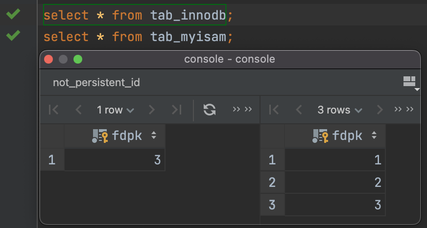
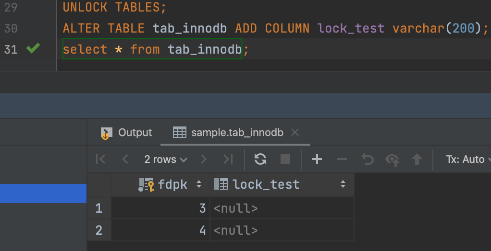
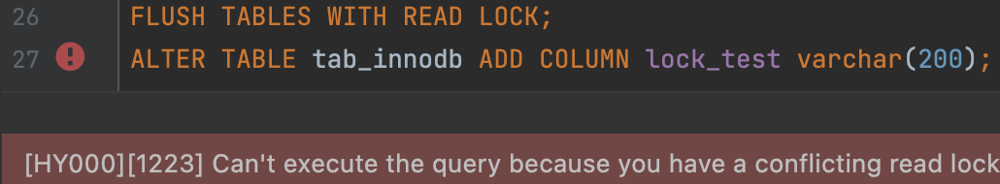
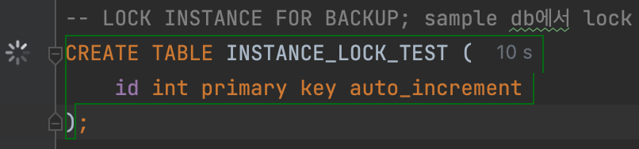
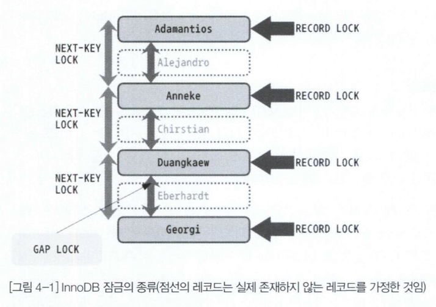
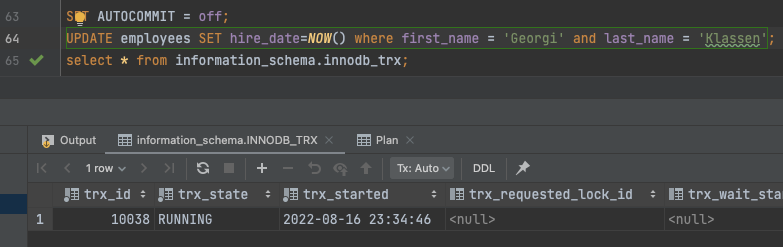
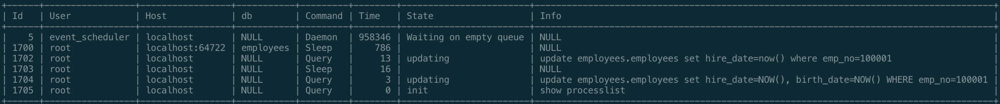
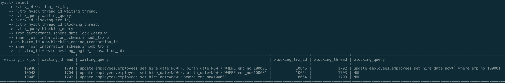
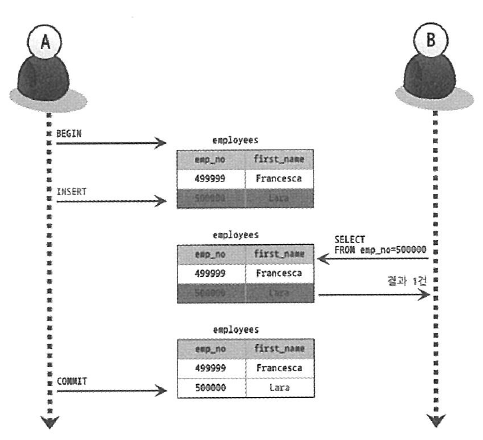
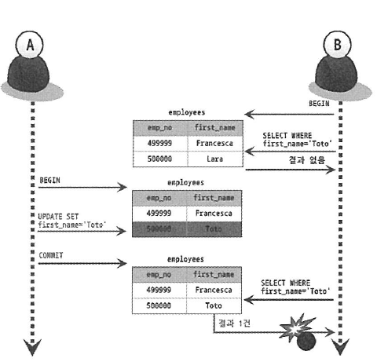

# 5장 트랜잭션과 잠금

- 트랜잭션은 작업의 완전성을 보장해 주는 것이다.
- 잠금은 동시성을 제어하기 위한 기능이고, 트랜잭션은 데이터의 정합성을 보장하기 위한 기능이다.

## 5.1 트랜잭션

### 5.1.1 MySQL에서의 트랜잭션

- 논리적인 작업 셋 자체가 100% 적용되거나, 아무것도 적용되지 않아야 함을 보장해주는 것
- MyISAM 테이블에서는 부분 업데이트 현상이 발생한다.
    
    
    
- 트랜잭션은 어플리케이션 개발에서 고민해야할 문제를 줄여주는 아주 필수적인 DBMS의 기능이다.

### 5.1.2 주의사항

- 꼭 필요한 최소의 코드에만 적용하는 것이 좋다.
- 일반적으로 데이터베이스 커넥션은 개수가 제한적이어서 각 단위 프로그램이 커넥션을 소유하는 시간이 길어질수록 사용가능한 여유 커넥션의 개수는 줄어들 것이다.
- 메일전송이나 FTP 파일전송 작업 또는 네트워크를 통해 원격 서버와 통신하는 등과 같은 작업은 어떻게 해서든 DBMS의 트랜잭션 내에서 제거하는 것이 좋다.
- 프로그램의 코드가 데이터베이스 커넥션을 가지고 있는 범위와 트랜잭션이 활성화돼 있는 프로그램의 범위를 최소화

## 5.2 MySQL 엔진의 잠금

- 스토리지 엔진레벨과 MySQL 엔진 레벨로 나눌 수 있다.
- 스토리지 엔진을 제외한 나머지 부분을 MySQL 엔진이라고 보면된다.
- MySQL 엔진 레벨의 잠금은 모든 스토리지 엔진에 영향을 미치지만, 스토리지 엔진 레벨의 잠금은 스토리지 엔진 간 상호 영향을 미치지 않는다.
- MySQL 엔진에서는 테이블락, 메타데이터락, 네임드락과 같은 잠금 기능을 제공한다.

### 5.2.1 글로벌 락

- `FLUSH TABLES WITH READ LOCK` 명령으로 획득
    
    
    
    
    
- MySQL에서 제공하는 잠금 가운데 범위가 가장 크다.
- 한 세션에서 글로벌 락을 획득하면 다른 세션에서 `SELECT` 를 제외한 대부분의 DDL 문장이나 DML 문장을 실행하는 경우 글로벌 락이 해제될 때까지 해당 문장이 대기 상태로 남는다.
- 글로벌 락의 범위는 MySQL 서버 전체이며, 작업 대상 테이블이나 데이터베이스가 다르더라도 동일하게 영향을 미친다.
- InnoDB 스토리지 엔진은 트랜잭션을 지원하기 때문에 일관된 데이터 상태를 위해 모든 데이터 변경 작업을 멈출 필요는 없다.
- MySQL 8.0 부터는 조금 더 가벼운 글로벌 락의 필요성이 생겼고 이를 위해 백업락이 도입되었다.
- 특정 세션에서 백업 락을 획득하면 모든 세션에서 다음과 같이 테이블의 스키마나 사용자의 인증 관련 정보를 변경할 수 없게 된다.
    - 데이터베이스 및 테이블 등 모든 객체 생성 및 변경, 삭제
    - REPAIR TABLE과 OPTIMIZE TABLE 명령
    - 사용자 관리 및 비밀번호 변경
        
        
        
        sample db 에서 lock을 걸고 동시에 다른 세션에서 테이블을 생성한 경우
        
- 백업 락은 일반적인 테이블의 데이터 변경은 허용된다.
- MySQL 서버의 구성은 소스 서버와 레플리카 서버로 구성된다. 글로벌 락을 획득하면 복제는 백업 시간 만큼 지연될 수 밖에 없다.
- MySQL 서버의 백업 락은 위와같은 상황을 위해 도입되었으며, 정상적으로 복제는 실행되지만 백업의 실패를 막기 위해 DDL 명령이 실행되면 복제를 일시 중지하는 역할을 한다.

### 5.2.2 테이블 락

- 테이블 락은 개별 테이블 단위로 설정되는 잠금이며, 명시적 또는 묵시적으로 획득할 수 있다.
- 명시적으로는 `LOCK TABLES table_name [ READ | WRITE ]` 명령으로 획득
- 특별한 상황이 아니면 명시적 테이블락도 애플리케이션에서 사용할 필요가 거의 없다.
- 묵시적 테이블 락은 MyISAM이나 MEMORY 테이블에 데이터를 변경하는 쿼리를 실행하면 발생
- 데이터가 변경되는 테이블에 잠금을 설정하고 데이터를 변경한 후 즉시 잠금을 해제하는 형태로 사용.
- InnoDB 테이블의 경우 스토리지 엔진 차원에서 레코드 기반의 잠금을 제공하기 때문에 단순 데이터 변경 쿼리로 인해 묵시적인 테이블 락이 설정되지는 않는다.

### 5.2.3 네임드 락

- 네임드 락은 `GET_LOCK()` 함수를 이용해 임의의 문자열에 대해 잠금을 설정할 수 있다.
- 네임드락은 자주 사용되지 않는다.
- 여러 클라이언트가 상호 동기화를 처리해야할 때 네임드 락으로 쉽게 해결할 수 있다.
- 많은 레코드에 대해서 복잡한 요건으로 레코드를 변경하는 트랜잭션에 유용 (ex 배치)
- MySQL 8.0 부터 네임드 락을 중첩해서 사용할 수 있다.

### 5.2.4 메타데이터 락

- 메타데이터락은 데이터베이스 객체의 이름이나 구조를 변경하는 경우(명시X, 자동O)에 획득하는 잠금이다.

## 5.3 InnoDB 스토리지 엔진 잠금

- InnoDB 스토리지 엔진은 스토리지 엔진 내부에서 레코드 기반의 잠금 방식을 탑재하고 있다.
- 최근 버전에서 InnoDB의 트랜잭션과 잠금, 그리고 잠금 대기 중인 트랜잭션의 목록을 조회할 수 있는 방법이 도입됐다.

### 5.3.1 InnoDB 스토리지 엔진의 잠금

- 레코드 기반의 잠금 기능을 제공하며, 잠금 정보가 상당히 작은 공간으로 관리되기 때문에 레코드 락이 페이지 락으로, 또는 테이블 락으로 레벨업되는 경우는 없다
- 레코드와 레코드 사이의 간격을 잠그는 갭(GAP) 락이라는 것이 존재한다.

  

**5.3.1.1 레코드 락**

- 레코드 자체만을 잠그는 것을 레코드락이라고 한다.
- InnoDB 스토리지 엔진은 레코드 자체가 아니라 인덱스의 레코드를 잠근다.
- 레코드 자체를 잠그느냐, 인덱스를 잠그느냐는 상당히 크고 중요한 차이를 만든다.
- 보조 인덱스를 이용한 변경 작업은 넥스트 키 락 또는 갭락을 사용한다.
- 프라이머리 키 또는 유니크 인덱스에 의한 변경 작업에서는 갭에 대해서는 잠그지 않고 레코드 자체에 대해서만 락을 건다.

**5.3.1.2 갭 락**

- 갭 락은 레콬드와 바로 인접한 레코드 사이의 간격만을 잠그는 것을 의미한다.
- 레코드와 레코드 사이의 간격에 새로운 레코드가 생성되는 것을 제어하는 것이다.
- 갭락 자체로 사용되기보다 넥스트 키 락의 일부로 자주 사용된다.

**5.3.1.3 넥스트 키 락**

- 레코드 락과 갭 락을 합쳐 놓은 형태의 잠금
- InnoDB의 갭 락이나 넥스트 키 락은 바이너리 로그에 기록되는 쿼리가 레플리카 서버에서 실행될 때 소스 서버에서 만들어 낸 결과와 동일한 결과를 만들어 내도록 보장하는 것이 주 목적
- 하지만 넥스트 키 락과 갭락으로 인해 데드락이나 다른 트랜잭션을 기다리는 일이 은근히 자주 발생한다.
- 가능하다면 바이너리 로그 포맷을 ROW 형태로 바꿔서 넥스트 키 락이나 갭 락을 줄이는 것이 좋다.

**5.3.1.4 자동 증가 락**

- `AUTO_INCREMENT` 칼럼이 사용된 테이블에 동시에 여러 레코드가 INSERT되는 경우, 저장되는 각 레코드는 중복되지 않고 저장된 순서대로 증가하는 일련번호 값을 가져야 한다.
- 트랜잭션과 관계 없이 INSERT나 REPLACE 문장에서 AUTO_INCREMENT 값을 가져오는 순간만 락이 걸렸다가 즉시 해제된다.
- 테이블에 단 하나만 존재한다.
- 하나의 쿼리가 `AUTO_INCREMENT`을 걸면 나머지 쿼리는 `AUTO_INCREMENT` 락을 기다려야 한다.
- `innodb_autoinc_lock_mode` 시스템 변수를 이용해 자동 증가 락의 작동방식을 변경할 수 있다.
- 자동 증가 값이 한번 증가하면 절대 줄어들지 않는 이유는 AUTO_INCREMENT 잠금을 최소화하기 위함.

### 5.3.2 인덱스와 잠금

- InnoDB의 잠금은 레코드를 잠그는 것이 아니라 인덱스를 잠그는 방식으로 처리된다.
- 즉, 변경해야 할 레코드를 찾기 위해 검색한 인덱스의 레코드를 모두 락을 걸어야 한다.
- UPDATE 문장을 위해 적절한 인덱스가 준비돼 있지 않다면 각 클라이언트 간의 동시성이 상당히 떨어져서 한 세션에서 UPDATE 작업을 하는 중에는 다른 클라이언트는 그 테이블을 업데이트하지 못하고 기다려야 하는 상황이 발생한다.

### 5.3.3 레코드 수준의 잠금 확인 및 해제

- MySQL 5.1 부터는 각 트랜잭션이 어떤 잠금을 기다리고 있는지, 기다리고 있는 잠금을 어떤 트랜잭션이 가지고 있는지를  information_schema DB에 `INNODB_TRX` 테이블과 `INNODB_LOCKS`, `INNODB_LOCK_WAITS` 테이블을 통해 확인이 가능했다.
    
    
    
- MySQL 8.0 부터는 information_schema의 정보들은 조금씩 제거되고 있으며, 그 대신 performance_schema의 `data_locks`와 `data_lock_waits` 테이블로 대체 되고 있다.
    - `p173` 예제
        
        
        
        
        

## 5.4 MySQL의 격리 수준

- 여러 트랜잭션이 동시에 처리될 때 특정 트랜잭션이 다른 트랜잭션에서 변경하거나 조회하는 데이터를 볼 수 있게 허용할지 말지를 결정
- `READ UNCOMMITTED`, `READ COMMITTED,` `REPEATABLE READ,` `SERIALIZABLE`
- 순서대로 뒤로 갈수록 각 트랜잭션 간의 데이터 격리(고립)정도가 높아지며, 동시 처리 성능도 떨어지는 것이 일반적이다.
- InnoDB에서는 독특한 특성때문에 `REPEATABLE READ` 격리 수준에서도 PHANTOM READ가 발생하지 않는다

  |  | DIRTY READ | NON-REPEATABLE READ | PHANTOM READ |
  | --- | --- | --- | --- |
  | READ UNCOMMITTED | 발생 | 발생 | 발생 |
  | READ COMMITTED | 없음 | 발생 | 발생 |
  | REPEATABLE READ | 없음 | 없음 | 발생(InnoDB는 없음) |
  | SERIALIZABLE | 없음 | 없음 | 없음 |

### 5.4.1 READ UNCOMMITTED

- 트랜잭션에서의 변경 내용이 `COMMIT` 이나 `ROLLBACK` 여부에 상관없이 다른 트랜잭션에서 보인다.
- 어떤 트랜잭션에서 처리한 작업이 완료되지 않았는데도 다른 트랜잭션에서 볼 수 있는 현상을 더티 리드(Dirty read) 라고 한다.
- RDBMS 표준에서는 트랜잭션의 격리수준으로 인정하지 않을 정도로 정합성에 문제가 많은 격리수준이다.

    
  READ UNCOMMITTED

### 5.4.2 READ COMMITTED

- 오라클 DBMS에서 기본으로 사용되는 격리수준이다.
- 온라인 서비스에서 가장 많이 선택되는 격리 수준이다.
- `COMMIT`이 완료된 데이터만 다른 트랜잭션에서 조회할 수 있다.
    
  READ COMMITTED

    
  NON-REPEATABLE READ

- 사용자 A가 커밋을 하게되면 B는 하나의 트랜잭션 내에서 같은 쿼리에 대해 다른 결과를 출력한다.
- 이는 하나의 트랜잭션 내에서 똑같은 SELECT 쿼리를 실행했을 때는 항상 같은 결과를 가져와야 한다는 `REPEATABLE READ` 정합성에 어긋나는 것이다.
- 언뜻보면 `READ COMMITTED` 격리수준은 문제가 없어보이지만 은행 입출금처리가 계속 진행되는 상황에서 다른 트랜잭션에서 오늘 입금된 금액의 총합을 조회한다고 가정하면 SELECT 쿼리는 조회시마다 다른 결과를 반환하게 되어 문제가 발생할 것이다.

### 5.4.3 REPEATABLE READ

- MySQL의 InnoDB 스토리지 엔진에서 기본으로 사용되는 격리 수준이다.
- 바이너리 로그를 가진 MySQL 서버에서는 최소 `REPEATABLE READ` 격리 수준 이상을 사용해야 한다.
- `REPEATABLE READ`와 `READ COMMITTED`의 차이는 언두 영역에 백업된 레코드의 여러 버전 가운데 몇 번째 이전 버전까지 찾아 들어가야 하느냐에 있다.
- 모든 InnoDB 트랜잭션은 고유한 트랜잭션 번호를 가지며, 언두 영역에 백업된 모든 레코드에는 변경을 발생시킨 트랜잭션의 번호가 포함돼 있다.
- MVCC를 보장하기 위해 실행 중인 트랜잭션 가운데 가장 오래된 트랜잭션번호보다 트랜잭션 번호가 앞선 언두 영역의 데이터는 삭제할 수가 없다.

    
  REPEATABLE READ

- 사용자 B는 트랜잭션 시작시 10번 트랜잭션을 부여 받는데 트랜잭션이 종료될때까지 10번보다 작은 번호에서 변경한 데이터만 보여주게 된다.

    
  PHANTOM READ(PHANTOM ROWS)

- 위 그림과 같이 다른 트랜잭션에서 수행한 변경 작업에 의해 레코드가 보였다 안보였다 하는 현상을 `PHANTOM READ`(또는 `PHANTOM ROW`) 라고 한다.
- SELECT .. FOR UPDATE 쿼리는 SELECT 하는 레코드에 쓰기 잠금을 걸어야 하는데, 언두 레코드에는 잠금을 걸 수 없다. 그래서 언두 영역의 변경 전 데이터를 가져오는 것이 아니라 현재 레코드의 값을 가져오게 되는 것이다.
  > ***SELECT***~ ***FOR UPDATE*** 구문은 "데이터 수정하려고 ***SELECT*** 하는 중이야~ 다른 사람들은 데이터에 손 대지 마!" 라고 할 수 있습니다.

### 5.4.4 SERIALIZABLE

- 가장 단순한 격리 수준이면서 동시에 가장 엄격한 격리 수준이다.
- SERIALIZABLE로 설정되면 읽기 작업도 공유 잠금(읽기 잠금)을 획득해야만 하며, 동시에 다른 트랜잭션은 그러한 레코드를 변경하지 못하게 된다. 즉, 한 트랜잭션에서 읽고 쓰는 레코드를 다른 트랜잭션에서는 절대 접근할 수 없는 것이다.
- InnoDB 스토리지엔진에서는 갭 락과 넥스트 키 락 덕분에 `REPEATABLE READ` 격리 수준에서도 `PHANTOM READ`가 발생하지 않는다