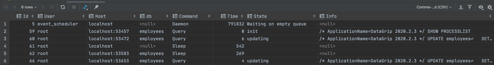

# 5장 트랜잭션과 잠금

## 5.1. 트랜잭션


- 작업의 완전성, 데이터의 정합성을 보장하는 기능
- 논리적인 작업 셋을 모두 완벽하게 처리하거나, 처리하지 못하는 경우 원 상태로 복구

### 5.1.1 MySQL에서의 트랜잭션

- InnoDB 스토리지 엔진 ⇒ 트랜잭션을 보장한다
- MyISAM, MEMORY 스토리지 엔진 ⇒ 트랜잭션을 보장하지 않는다
- MyISAM vs InnoDB 스토리지 엔진 트랜잭션 관점 비교
    
    ```sql
    // given
    CREATE TABLE tab_myisam
    (
        fdpk INT NOT NULL,
        PRIMARY KEY (fdpk)
    ) ENGINE = MyISAM;
    INSERT INTO tab_myisam (fdpk)
    VALUES (3);
    
    CREATE TABLE tab_innodb
    (
        fdpk INT NOT NULL,
        PRIMARY KEY (fdpk)
    ) ENGINE = INNODB;
    INSERT INTO tab_innodb (fdpk)
    VALUES (3);
    
    // when
    INSERT INTO tab_myisam (fdpk) VALUES (1), (2), (3); //failed by duplicate key
    INSERT INTO tab_innodb (fdpk) VALUES (1), (2), (3); //failed by duplicate key
    ```
    
    - MyISAM 스토리지 엔진은 부분 업데이트(Partial Update)의 결과로 쓰레기 데이터가 남아있을 가능성이 있다
    - InnoDB 스토리지 엔진은 트랜잭션의 원칙대로 INSERT 문장을 실행하기 전 상태로 복구한다

### 5.1.2 주의사항

- 트랜잭션의 범위를 최소화하기
    
    ```
    //Before 트랜잭션의 범위가 넓다. 불필요한 작업이 트랜잭션 내에 포함된다
    1) 처리 시작
    	=> 데이터베이스 커넥션 생성
    	=> 트랜잭션 시작
    2) 사용자의 로그인 여부 확인
    3) 사용자의 글쓰기 내용의 오류 여부 확인
    4) 첨부로 업로드된 파일 확인 및 저장
    5) 사용자의 입력 내용을 DBMS에 저장
    6) 첨부 파일 정보를 DBMS에 저장
    7) 저장된 내용 또는 기타 정보를 DBMS에서 조회
    8) 게시물 등록에 대한 알림 메일 발송
    9) 알림 메일 발송 이력을 DBMS에 저장
    	<= 트랜잭션 종료(COMMIT)
    	<= 데이터베이스 커넥션 반납
    10) 처리 완료
    
    //After
    1) 처리 시작
    2) 사용자의 로그인 여부 확인
    3) 사용자의 글쓰기 내용의 오류 여부 확인
    4) 첨부로 업로드된 파일 확인 및 저장
    	=> 데이터베이스 커넥션 생성
    	=> 트랜잭션 시작
    5) 사용자의 입력 내용을 DBMS에 저장
    6) 첨부 파일 정보를 DBMS에 저장
    	<= 트랜잭션 종료(COMMIT)
    7) 저장된 내용 또는 기타 정보를 DBMS에서 조회
    8) 게시물 등록에 대한 알림 메일 발송
    	=> 트랜잭션 시작
    9) 알림 메일 발송 이력을 DBMS에 저장
    	<= 트랜잭션 종료(COMMIT)
    	<= 데이터베이스 커넥션 종료
    10) 처리 완료
    ```
    

## 5.2 MySQL 엔진의 잠금

- MySQL 엔진 레벨의 잠금
    - 모든 스토리지 엔진에 영향을 미친다
- 스토리지 엔진 레벨의 잠금
    - 스토리지 엔진 간 상호 영향을 미치지 않는다

### 5.2.1 글로벌 락

- `FLUSH TABLES WITH READ LOCK`
- 글로벌 락의 범위는 MySQL 서버 전체이며, 작업 대상 테이블이나 데이터베이스가 다르더라도 영향을 미친다
- 한 세션에서 글로벌 락을 획득하면 다른 세션에서 `SELECT`를 제외한 대부분의 DDL 문장이나 DML문장은 글로벌 락이 해제될 때까지 대기 상태로 남는다.
- MyISAM이나 MEMORY 테이블에 대해 mysqldump로 일괄된 백업을 받아야할 때 사용한다
- 글로벌 락 사용 주의사항
    - `FLUSH` 명령을 수행하기 때문에 명령 수행 전 테이블이나 레코드에 쓰기 잠금이 걸려있을 경우 대기한다
    - 장시간 실행되는 쿼리와 글로벌락 명령은 모든 테이블에 영향을 미치기 때문에 사용에 주의해야한다
- InnoDB 스토리지 엔진은 트랜잭션을 지원하기 때문에 일관된 데이터 상태를 위해 모든 데이터 변경을 멈출 필요가 없다
- 8.0 버전부터 `Xtrabackup` , `Enterprise Backup` 와 같은 백업툴들의 안정적인 실행을 위해 백업 락이 도입되었다
- 백업 락
    
    
    
    - 특정 세션에서 백업 락을 획득하면 모든 세션에서 아래와 같은 정보를 변경할 수 없다
        - 데이터베이스 및 테이블 등 모든 객체 생성 및 변경, 삭제 ⇒ `DDL`
        - REPAIR TALBE과 OPTIMIZE TABLE 명령
        - 사용자 관리 및 비밀번호 변경

### XtraBackup, Enterprise Backup

- XtraBackup
    - `Percona` 사에서 오픈소스로 제공하는 무료 백업 유틸리티
    - 백업 도중 데이터베이스를 잠그지 않는다
    - 프로덕션 환경에서도 서버 성능을 방해하지 않으면서도 원활하게 백업 절차를 수행하도록 설계
    - 우아한형제들 xtraBackup 적용기 관련 포스팅
        - [https://techblog.woowahan.com/2576/](https://techblog.woowahan.com/2576/)
- Enterprise Backup
    - `Enterprise Edition` 에서 제공하는 백업 유틸리티
    - `Non Blocking` 백업 기능 제공
    - Features
        - [https://www.mysql.com/products/enterprise/backup/features.html](https://www.mysql.com/products/enterprise/backup/features.html)

### 5.2.2 테이블 락

- 개별 테이블 단위로 설정되는 잠금
    - 명시적 테이블 락
        - `LOCK TABLES table_name [READ | WRITE]`
        - `UNLOCK TABLES`
        - 온라인 작업에 상당히 영향을 미치기 때문에 애플리케이션에서 사용할 필요가 없다
    - 묵시적 테이블 락
        - `MyISAM` , `MEMORY` 테이블에 데이터를 변경하는 쿼리를 실행하면 발생한다
        - 데이터가 변경되는 테이블에 잠금을 설정하고 데이터를 변경 후 잠금을 해제한다
            - 자동적으로 획득됐다가 쿼리가 완료된 후 자동 해제된다
- 레코드 잠금 방식인 `InnoDB` 스토리지 엔진은 테이블 락이 설정되지만 DML 쿼리에서는 무시된다

### 5.2.3 네임드 락(유저 락)


- `GET_LOCK()` 함수를 이용해 임의의 문자열에 대해 잠금을 설정한다
- 자주 사용 되지 않으며, 클라이언트 상호 동기화 처리 시 유용하다
- 8.0 버전부터 네임드 락을 중첩해서 사용할 수 있고, 현재 세션에서 획득한 네임드 락을 한번에 해제할 수 있다

### 5.2.4 메타데이터 락

- 데이터베이스 객체(테이블이나 뷰 등)의 이름이나 구조를 변경하는 경우 획득하는 잠금
- 명시적으로 획득하거나 할 수 없다
    - `RENAME TABLE tab_a TO tab_b` 와 같은 명령을 수행 시 자동으로 획득하는 잠금이다
- `RENAME TABLE` 명령은 원본 이름과 변경될 이름 두 개 모두 한꺼번에 잠금을 설정한다
    
    ```sql
    // 명령어로 수행된 테이블 이름들이 한꺼번에 잠금 처리된다 
    RENAME TABLE rank TO rank_backup, rank_new TO rank;
    
    //table not found 'rank';  //시연 시 발생하지 않음
    RENAME TABLE rank To rank_backup;
    RENAME TABLE rank_new TO rank;   
    ```
    
- 배치 프로그램 작성 시 사용된다
- 메타데이터 락 사용 예시
    
    ```sql
    create table access_log_new (
        id bigint not null AUTO_INCREMENT,
        client_ip varchar(20),
        access_dttm date,
        PRIMARY KEY(id)
    ) KEY_BLOCK_SIZE = 4;
    
    INSERT INTO access_log_new SELECT * FROM access_log where id >= 0 and id < 100;
    
    LOCK TABLES access_log WRITE, access_log_new WRITE;
    
    SELECT max(id) as @MAX_ID FROM access_log_new;
    INSERT INTO access_log_new SELECT * FROM access_log WHERE id > 399;
    
    COMMIT;
    
    RENAME TABLE access_log TO access_log_old, access_log_new TO access_log;
    
    UNLOCK TABLES;
    
    DROP TABLE access_log_old;
    
    select *
      from access_log;
    ```
    
    - 샘플 데이터의 row count ⇒ 1000
    - 잠금을 최소화 하기 위해 기타 세션에서 데이터 restore 작업을 병렬로 수행하였다 (399rows)

## 5.3 InnoDB 스토리지 엔진 잠금

- 레코드 기반의 잠금 방식
    - 뛰어난 동시성 처리
    - 잠금에 대한 정보는 MySQL 명령을 이용해 접근이 까다롭다 ⇒ 8.0 버전에서 단점을 보완함

### 5.3.1 InnoDB 스토리지 엔진의 잠금


- 잠금 정보가 상당히 작은 공간으로 관리 ⇒ 락 에스컬레이션 X
    - [https://www.ibm.com/docs/en/db2/11.1?topic=management-lock-escalation](https://www.ibm.com/docs/en/db2/11.1?topic=management-lock-escalation)

### 5.3.1.1 레코드 락 ⇒ 프라이머리 키, 유니크 키

- 레코드 자체만을 잠금 ⇒ 타 DBMS의 레코드 락과 다르게 `인덱스의 레코드를 잠금` ⇒ 락의 범위가 좁다
- 인덱스가 하나도 없는 테이블이더라도 내부적으로 자동 생성된 클러스터 인덱스를 이용해 잠금을 설정
- `프라이머리 키`, `유니크 키` 변경에 대해서 사용된다

### 5.3.1.2 갭 락  ⇒ 보조 인덱스 잠금

- 레코드 자체가 아니라 레코드와 바로 인접한 레코드 사이의 간격을 잠금
- 레코드와 레코드 사이의 간격에 새로운 레코드가 `INSERT` 되는 것을 제어

### 5.3.1.3 넥스트 키 락 ⇒ 보조 인덱스 잠금

- `레코드 락`, `갭 락` 을 합쳐 놓은 형태의 잠금
- Binary Log 종류에 따른 넥스트 키 락의 차이 비교
    - `Statement` : SQL 쿼리를 binLog에 text 기반으로 기록 ⇒ 5.7까지 기본 포맷
        - `REPEATABLE STATEMENT` 격리 수준을 사용
        - `innodb_locks_unsafe_for_binlog` 비활성화 시 변경을 위한 검색 시 넥스트 키 락 방식으로 잠금이 걸림
    - `Row` : 변경된 행이 바이너리 형식으로 `binLog`에 기록 ⇒ 8.0 기본 포맷
        - `INSERT` , `UPDATE` , `DELETE`
    - `Mixed` : `Statement` , `Row` 방식의 혼합
- `Statement` 포맷은 데드락이나 다른 트랜잭션을 기다리게 만드는 일이 자주 발생할 수 있다
    - `Row` 형태로 변경하여 넥스트 키락이나 갭락을 줄이도록 하자

### 5.4.1.4 자동 증가 락

- `AUTO_INCREMENT`
- 테이블 수준의 잠금으로 `INSERT` , `REPLACE` 문장 같이 새로운 레코드를 저장하는 쿼리에서만 필요하다
- `AUTI_INCREMENT` 문장에서 값을 가져오는 순간만 락이 걸렸다가 즉시 해제된다
- 명시적으로 획득하거나 해제하는 방법은 없다
- 5.1. 버전이상부터 `innodb_autoinc_lock_mode` 시스템 변수로 자동 증가 락의 작동 방식을 변경 가능
    - `innodb_autoinc_lock_mode=0` : `모든 INSERT 문장`은 자동 증가락을 사용 ⇒ 5.0 버전과 동일
    - `innodb_autoinc_lock_mode=1` : INSERT 레코드 건수를 예측 가능할 경우 래치를 이용. 에측 불가 시 자동 증가락을 이용한다.
        - 5.7버전에서 기본 값
        - 래치(뮤텍스) : 아주 짧은 시간 동안만 잠금을 걸고 자동 증가 값을 가져오면 해제한다
        - [https://m.blog.naver.com/PostView.naver?isHttpsRedirect=true&blogId=fochaerim&logNo=70177353912](https://m.blog.naver.com/PostView.naver?isHttpsRedirect=true&blogId=fochaerim&logNo=70177353912)
    - `innodb_autoinc_lock_mode=2` : 경량화된 래치(뮤텍스)를 사용한다
        - 8.0버전에서 기본 값
        - `인터리빙 모드` 라고 하며, `연속 모드` 와 다르게 연속된 자동 증가값을 보장하지 않는다.
        - 단, 유니크한 값은 보장한다

### 5.3.2 인덱스와 잠금


- 레코드 방식의 잠금은 인덱스의 레코드를 모두 락을 걸어야 한다
- 인덱스가 하나도 없는 경우 테이블 풀 스캔을 하게 되어 테이블 전체가 잠겨버린다

### 5.3.3. 레코드 수준의 잠금 확인 및 해제



- 락 대기 상태 확인

```sql
//5.1버전에서 트랜잭션 잠금 확인하기 
SELECT
    r.trx_id waiting_rx_id,
    r.trx_mysql_thread_id waiting_thread,
    r.trx_query waiting_query,
    b.trx_id blocking_trx_id,
    b.trx_mysql_thread_id blocking_thread,
    b.trx_query blocking_query
  FROM performance_schema.data_lock_waits w
INNER JOIN information_schema.innodb_trx b
  ON b.trx_id = w.BLOCKING_ENGINE_TRANSACTION_ID
INNER JOIN information_schema.innodb_trx r
  ON r.trx_id = w.REQUESTING_ENGINE_TRANSACTION_ID;
```


```sql
//8.0 버전에서 트랜잭션 잠금 확인하기
SELECT *
  FROM performance_schema.data_locks;
```


### 5.4 MySQL 격리 수준

- 트랜잭션 격리 레벨


- 단, `Phantom Read` 의 경우 InnoDB 스토리지 엔진에서는 발생하지 않는다

### 5.4.1 READ UNCOMMITTED


- 각 트랜잭션에서의 변경 내용이 `commit` , `rollback` 상관 없이  다른 트랜잭션에서 값을 읽을 수 있다(dirty read).
- 정합성에 문제가 많은 격리 수준이기 때문에 사용하지 않는 것을 추천한다

### 5.4.2 READ-COMMITTED


- RDB 대부분이 사용하는 격리 수준
- 실제 테이블에서 값을 가져오는 것이 아니라 `UNDO` 영역에 백업 된 레코드에서 값을 가져온다


- `트랜잭션` 에서 변경된 값이 `COMMIT` 되지 않은 경우 `UNDO` 에서 값을 읽어온다
- `트랜잭션1` 에서 변경된 값이 `COMMIT` 이 되는 경우 `트랜잭션2` 에서는 변경된 값을 읽게 된다.
- 하나의 트랜잭션에서 항상 같은 결과를 가져오지 못해 정합성에 어긋나게 된다
- 입금, 출금 처리가 진행되는 부분에서 주로 발생한다

### 5.4.3 REPEATABLE-READ


- `MYSQL` 기본 트랜잭션 전략.
- 트랜잭션마다 ID를 부여하여 트랜잭션 ID보다 작은 트랜잭션 번호에서 변경한 것만 읽는다.
- `UNDO` 공간에 백업해두고 실제 레코드 값을 변경한다
    - 백업 된 데이터는 불필요하다고 판단하는 시점에 주기적으로 삭제한다
    - `UNDO` 에 백업 된 레코드가 많아지면 성능이 저하될 수 있다
- 이러한 변경 방식을 `MVCC(Multi Version Concurrency Control)` 이라고 부른다


- `PHANTOM READ` : 다른 트랜잭션에서 수행한 변경 작업에 의해 레코드가 보였다가 안보였다가 하는 현상. 방지하기 위해 쓰기 잠금을 걸어야 한다 ⇒ `InnoDB` 에서는 나타나지 않는다

### 5.4.4 SERIALIZABLE

- 가장 단순한 격리 수준이지만 가장 엄격한 격리 수준
- 동시 처리 성능이 낮다
- `Phantom Read` 현상이 발생하지 않지만 거의 사용 되지 않는다