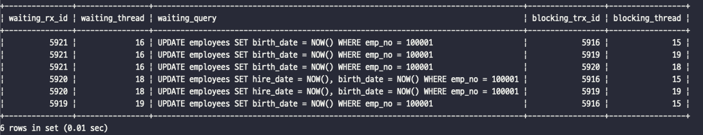
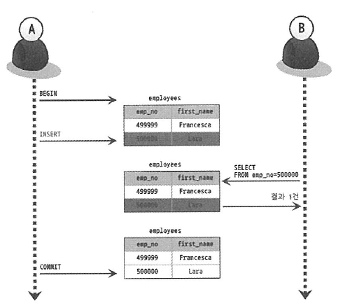

# 5장. 트랜잭션과 잠금

[MySQL 8.0 Reference Manual](https://dev.mysql.com/doc/refman/8.0/en/)

[1. 트랜잭션](#1-트랜잭션)  
[2. MySQL 엔진의 잠금](#2-mysql-엔진의-잠금)  
[3. InnoDB 스토리지 엔진 잠금](#3-innodb-스토리지-엔진-잠금)  
[4. MySQL의 격리 수준](#4-mysql의-격리-수준)

## 1. 트랜잭션

- 트랜잭션은 데이터의 정합성을 보장하기 위한 기능이다.
    - 논리적인 작업 셋을 온저히 처리하거나, 복구하여 작업의 일부만 적용되는 현상이 발생하지 않게 한다.
- 잠금(Lock)은 동시성을 제어하기 위한 기능이다.
    - 여러 커넥션에서 동시에 동일한 자원을 요청하는 경우 한 시점에 하나의 커넥션만 처리할 수 있도록 해준다.
- 격리수준은 하나의 트랜잭션 내에서 또는 여러 트랜잭션 간의 작업 내용을 어떻게 공유하고 차단할 것인지를 결정한다.

### MySQL에서의 트랜잭션

- 트랜잭션 관점에서 InnoDB 테이블과 MyISAM 테이블의 차이

    ```sql
    CREATE TABLE tab_myisam (
        fdpk INT NOT NULL,
        PRIMARY KEY(fdpk)
    ) ENGINE-MyISAM;
    
    CREATE TABLE tab_innodb (
        fdpk INT NOT NULL,
        PRIMARY KEY(fdpk)
    ) ENGINE-INNODB;
    
    INSERT INTO tab_myisam (fdpk) VALUES (3);
    INSERT INTO tab_innodb (fdpk) VALUES (3);
    
    -- AUTO-COMMIT 활성화
    SET autocommit = ON;
    
    INSERT INTO tab_myisam (fdpk) VALUES (1), (2), (3);
    INSERT INTO tab_innodb (fdpk) VALUES (1), (2), (3);
    
    -- 결과 확인
    SELECT * FROM tab_myisam;
    SELECT * FROM tab_innodb;
    ```

    - MyISAM 테이블에는 오류가 발생했음에도 '1'과 '2'는 `INSERT`된 상태로 남아있다.
    - InnoDB는 쿼리 중 일부라도 오류가 발생하면 전체를 원상태로 만든다.

- 이러한 부분 업데이트 현상은 데이터의 정합성을 맞추는데 상당히 어려운 문제를 만든다.

### 주의사항

#### 트랜잭션 처리 예시

- Before
    ```text
    1) 처리 시작
    ⟹ 데이터베이스 커넥션 생성
        ⟹  트랜잭션 시작
            2) 사용자의 로그인 여부 확인
            3) 사용자의 글쓰기 내용의 오류 여부 확인
            4) 첨부로 업로드된 파일 확인 및 저장
            5) 사용자의 입력 내용을 DBMS에 저장
            6) 첨부 파일 정보를 DBMS에 저장
            7) 저장된 내용 또는 기타 정보를 DBMS에서 조회
            8) 게시물 등록에 대한 알림 메일 발송
            9) 알림 메일 발송 이력을 DBMS에 저장
        ⟸ 트랜잭션 종료(COMMIT)
    ⟸ 데이터베이스 커넥션 반납
    10) 처리 완료
    ```
- After
    ```text
    1) 처리 시작
    2) 사용자의 로그인 여부 확인
    3) 사용자의 글쓰기 내용의 오류 여부 확인
    4) 첨부로 업로드된 파일 확인 및 저장
    ⟹ 데이터베이스 커넥션 생성
        ⟹ 트랜잭션 시작
            5) 사용자의 입력 내용을 DBMS에 저장
            6) 첨부 파일 정보를 DBMS에 저장
        ⟸ 트랜잭션 종료(COMMIT)
        7) 저장된 내용 또는 기타 정보를 DBMS에서 조회
        8) 게시물 등록에 대한 알림 메일 발송
        ⟹ 트랜잭션 시작
            9) 알림 메일 발송 이력을 DBMS에 저장
        ⟸ 트랜잭션 종료(COMMIT)
    ⟸ 데이터베이스 커넥션 종료
    10) 처리 완료
    ```

- **프로그램 코드에서 데이터베이스 커넥션을 가지고 있는 범위와 트랜잭션이 활성화 되어 있는 범위를 최소화해야 한다.**
    - 일반적으로 데이터베이스 커넥션은 개수가 제한적이어서 커넥션을 소유하는 시간이 길어질수록 사용 가능한 여유 커넥션의 개수는 줄어들고, 커넥션을 기다려야 하는 상황이 발생할 수도 있다.
- **네트워크 작업이 있는 경우에는 반드시 트랜잭션에서 배제해야 한다.**
    - 메일 전송, FTP 파일 전송 또는 네트워크를 통해 원격 서버와 통신하는 경우, 서버와 통신할 수 없는 상황이 발생하면 웹 서버 뿐만 아니라 DBMS 서버까지 위험해지는 상황이 발생할 것이다.

## 2. MySQL 엔진의 잠금

- MySQL 엔진 레벨의 잠금은 **모든 스토리지 엔진에 영향을 미친다.**
- 스토리지 엔진 레벨의 잠금은 **스토리지 엔진 간 상호 영향을 미치지 않는다.**

- MySQL 엔진의 잠금 기능
    - **테이블 데이터 동기화를 위한 테이블 락**
    - **테이블의 구조를 잠그는 메타데이터 락**
    - **사용자의 필요에 맞게 사용할 수 있는 네임드 락**

### 글로벌 락

- `FLUSH TABLES WITH READ LCOK` 명령으로 획득할 수 있다.
- MySQL에서 제공하는 잠금 가운데 가장 범위가 크다.
- `SELECT`를 제외한 대부분의 `DDL`, `DML` 문장을 실행하는 경우 글로벌 락이 해제될 때까지 대기 상태로 남는다.
- 단, 장시간 `SELECT` 쿼리가 실행되고 있을 때는 `FLUSH TABLES WITH READ LCOK` 명령은 `SELECT` 쿼리가 종료될 때까지 기다려야 한다.
- **웹 서비스용으로 사용되는 MySQL 서버에서는 가급적 사용하지 않는 것이 좋다.**


- mysqldump 같은 백업 프로그램이 내부적으로 글로벌 락 명령어를 실행할 수 있으므로, 백업을 수행하기 전 미리 확인해보는 것이 좋다.
- MySQL 8.0 버전부터는 Xtrabackup이나 Enterprise Backup 같은 백업 툴의 안정적인 실행을 위해 백업 락이 도입되었다.
    ```sql
    LOCK INSTANCE FOR BACKUP;
    -- // 백업 실행
    UNLOCK INSTANCE;
    ```

    - 백업 락은 백업의 실패를 막기 위해 DDL 명령이 실행되면 복제를 일시 중지하는 역할을 한다.
    - 특정 세션에서 백업 락을 획득하면 모든 세션에서 다음과 같은 정보를 변경할 수 없게 된다.
        - 데이터베이스 및 테이블 등 모든 객체 생성 및 변경, 삭제
        - `REPAIR TABLE`과 `OPTIMIZE TABLE` 명령
        - 사용자 관리 및 비밀번호 변경
    - 백업 락은 일반적인 테이블의 데이터 변경은 허용되지만, 글로벌 락을 획득해야 하므로 시간이 지연된다.

### 테이블 락

- 테이블락은 개별 테이블 단위로 설정되는 잠금이다.
- `LOCK TABLES table_name [ READ | WRITE ]` 명령으로 획득할 수 있다.
- 특별한 상황이 아니면 명시적인 테이블 락을 사용할 필요가 거의 없다.
- 묵시적인 테이블 락은 데이터를 변경하는 쿼리가 실행되는 동안 자동으로 획득됐다가 쿼리가 완료된 후 자동으로 해제된다.
- InnoDB 테이블의 경우 스토리지 엔진 차원에서 레코드 기반의 잠금을 제공하기 때문에 단순 데이터 변경 쿼리로 인해 묵시적인 테이블 락이 설정되지는 않는다.

### 네임드 락

- 네임드 락은 `GET_LOCK()` 함수를 이용해 임의의 문자열에 대해 잠금을 설정할 수 있다.
- 네임드 락의 대상은 데이터베이스 객체가 아니라 사용자가 지정한 문자열이다.
    - DB 서버 1대에 5대의 웹 서버가 접속해서 서비스하는 상황에서 여러 클라이언트가 상호 동기화를 처리해야할 때 네임드 락을 사용하면 쉽게 해결할 수 있다.
    - 많은 레코드에 대해서 복잡한 요건으로 레코드를 변경하는 트랜잭션에 유용하게 사용할 수 있다.
- 네임드 락은 자주 사용되지 않는다.

```sql
-- mylock 이라는 문자열에 대해 잠금을 획득한다.
SELECT GET_LOCK('mylock', 2);

-- mylock 이라는 문자열에 대해 잠금이 설정되어 있는지 확인한다.
SELECT IS_FREE_LOCK('mylock');

-- mylock 이라는 문자열에 대해 획득했던 잠금을 반납(해제)한다.
-- 락을 획득하거나 해제한 경우에는 1, 아니면 NULL 또는 0을 반환한다.
SELECT RELEASE_LOCK('mylock'); 
```

- MySQL 8.0 버전부터는 네임드락을 중첩해서 사용할 수 있게 되었다.

```sql
SELECT GET_LOCK('mylock_1', 10);
SELECT GET_LOCK('mylock_2', 10);

SELECT RELEASE_LOCK('mylock_2');
SELECT RELEASE_LOCK('mylock_1');

SELECT RELEASE_ALL_LOCKS();
```

### 메타데이터 락

- 메타데이터 락은 데이터베이스 객체(테이블이나 뷰 등)의 이름이나 구조를 변경하는 경우에 획득하는 잠금이다.
- 메타데이터 락은 명시적으로 획득하거나 해제할 수 없다.
    - `RENAME TABLE tab_a TO tab_b` 같이 테이블의 이름을 변경하는 경우 자동으로 획득하는 잠금이다.

#### RENAME TABLE

- RENAME TABLE 명령을 2번에 나눠 실행하게 되면 아주 짧은 시간이지만, rank 테이블이 존재하지 않는 순간이 생기며, Table not found 'rank' 오류를 발생시킨다.

    ```sql
    RENAME TABLE rank TO rank_backup;
    RENAME TABLE rank_new TO rank;
    ```

- 위의 문제를 해결하려면 RENAME TABLE 명령을 한번에 실행하면 된다.
    ```sql
    RENAME TABLE rank TO rank_backup, rank_new TO rank;
    ```    

#### 트랜잭션 처리와 동시에 수행되어야 하는 메타데이터 락

**e.g.** INSERT만 실행되는 로그 테이블(`access_log`)의 구조를 변경해야 하는 경우

- MySQL DDL은 단일 스레드로 작동하기 때문에 상당히 많은 시간이 걸릴 수 있다.
- 새로운 구조의 테이블을 먼저 생성하고, 최근 데이터까지는 미리 여러 개의 스레드로 빠르게 복사한다. (PK인 id 값으로 범위를 나눠서 복사)
- 남아 있는 가장 최신의 데이터는 트랜잭션을 autocommit 모드로 설정하고, 테이블을 잠근 뒤 복사한다. (복사하는 동안 해당 테이블에 INSERT를 할 수 없다.)
- 복사가 완료되면 테이블 명을 변경하고, 기존 테이블을 삭제한다.

```sql
CREATE TABLE access_log_new (
    id          BIGINT    NO NULL    AUTO_INCREMENT,
    client_ip   INT UNSIGNED,
    access_dttm TIMESTAMP
    PRIMARY KEY(id)
) KEY_BLOCK_SIZE = 4;

INSERT INTO access_log_new SELECT *FROM access_log WHERE id >= 0 AND id < 10000;
INSERT INTO access_log_new SELECT *FROM access_log WHERE id >= 10000 AND id < 20000;
INSERT INTO access_log_new SELECT *FROM access_log WHERE id >= 20000 AND id < 30000;
INSERT INTO access_log_new SELECT *FROM access_log WHERE id >= 30000 AND id < 40000;

-- // 트랜잭션을 autocommit으로 실행 (BEGIN이나 START TRANSACTION으로 실행하면 안됨)
SET autocommit = 0;

-- // 작업 대상 테이블 2개에 대해 테이블 쓰기 락을 획득
LOCK TABLES access_log WRITE, access_log_new WRITE;

-- // 남은 데이터 복사
SELECT max(id) as @MAX_ID FROM access_log_new;
INSERT INTO access_log_new SELECT *FROM access_log WHERE id > @MAX_ID;
COMMIT;

-- // 새로운 테이블로 데이터 복사가 완료되면 RENAME 명령으로 새로운 테이블을 서비스로 투입
RENAME TABLE access_log TO access_log_old, access_log_new TO access_log; UNLOCK TABLES;

-- // 불필요한 테이블 삭제
DROP TABLE access_log_old;
```

## 3. InnoDB 스토리지 엔진 잠금

- MySQL에서 제공하는 잠금과 별개로 스토리지 엔진 내부에서 레코드 기반 잠금 방식을 탑재하고 있다.
- 레코드 기반 잠금 때문에 MyISAM보다 훨씬 뛰어난 **동시성 처리를 제공**할 수 있다.

#### 잠금 모니터링

- 하지만 이원화된 잠금 처리 탓에 InnoDB 스토리지 엔진에서 사용되는 잠금에 대한 정보는 MySQL 명령을 이용해 접근하기 까다롭게 되었다.
- 이전 버전에서는 InnoDB 잠금 정보를 덤프하는 방법과 SHOW ENGINE INNODB STATUS 명령으로 확인하는 것이 전부였다.
- 최근 버전에서는 트랜잭션과 잠금, 대기 중인 트랜잭션의 목록을 조회할 수 있다.
    - `information_schema`에서 `INNODB_TRX`, `INNODB_LOCKS`, `INNODB_WAITS` 테이블을 조인해서 조회하여 확인할 수 있다. (MySQL5.1)
    - `performance_shcema`를 이용해 InnoDB 스토리지 엔진의 내부 잠금(세마포어)에 대한 모니터링 방법도 추가되었다. (MySQL8.0)


- InnoDB 스토리지 엔진은 레코드 기반의 잠금 기능은 상당히 작은 공간으로 관리되기 때문에 레코드 락이 페이지 락으로, 또는 테이블 락으로 레벨업되는 경우(락 에스컬레이션)는 없다
- 레코드와 레코드 사이의 간격을 잠그는 갭(GAP) 락이라는 것이 존재한다.

#### 레코드 락

- 레코드 자체만 잠그며, InnoDB 레코드 락은 **레코드 자체가 아니라 인덱의 레코드를 잠근다.**
- 인덱스가 하나도 없는 테이블이더라도 내부적으로 자동 생성된 클러스터 인덱스를 이용해 잠금을 설정한다.
- 레코드 자체를 잠그느냐, 인덱스를 잠그느냐는 상당히 크고 중요한 차이를 만든다.
    - InnoDB에서는 대부분 보조 인덱스를 이용한 변경 작업은 넥스트 키 락 또는 갭 락을 사용한다.
    - 하지만, 프라이머리 키 또는 유니크 인덱스에 의한 변경 작업에서는 갭에 대해서는 잠그지 않고 레코드 자체에 대해서만 락을 건다.

#### 갭 락

- 갭 락은 레코드 자체가 아니라 레코드와 바로 인접한 레코드 사이의 간격만 잠근다.
- 갭 락의 역할은 레코드와 레코드 사이의 간격에 새로운 레코드가 생성(INSERT)되는 것을 제어하는 것이다.
- 갭 락은 그 자체보다는 넥스크 키 락의 일부로 자주 사용된다.

#### 넥스트 키 락

- 레코드 락과 갭 락을 합쳐 놓은 형태이다.
- STATEMENT 포맷의 바이너리 로그를 사용하는 MySQL 서버에서는 REPEATABLE READ 격리 수준을 사용해야 한다.
- `innodb_locks_unsafe_for_binlog` 가 0으로 설정(비활성화)되면 변경을 위해 검색하는 레코드에는 넥스크 키 락 방식으로 잠금이 걸린다.
- 갭 락이나 넥스트 키 락은 바이너리 로그에 기록되는 쿼리가 레플리카 서버에서 실행될 때 소스 서버에서 만들어 낸 결과와 동일한 결과를 만들어내도록 보장하는 것이 주목적이다.
- 의외로 넥스크 키락과 갭 락으로 인해 데드락이 발생하거나 다른 트랜잭션을 기다리게 만드는 일이 자주 발생한다.
- 가능하면 바이너리 로그 포맷을 ROW 형태로 바꿔서 넥스트 키 락이나 갭 락을 줄이는 것이 좋다.
- MySQL8.0 버전에서는 ROW 포맷의 바이너리 로그가 기본 설정으로 변경되었다.

#### 자동 증가 락

- InnoDB 스토리지 엔진에서는 자동 증가하는 숫자 값을 추출(채번)하기 위해 내부적으로 AUTO_INCREMENT 락을 사용한다.
- AUTO_INCREMENT 락은 테이블 수준의 잠금이며, 테이블에 단 하나만 존재한다.
- AUTO_INCREMENT 락은 트랜잭션과 관계없이 INSERT나 REPLACE 문장에서 값을 추출(채번)하는 순간만 락이 걸렸다가 즉시 해제된다.
- AUTO_INCREMENT 락을 명시적으로 획득하고 해제하는 방법은 없다.
- MySQL5.1 이상부터는 `innodb_autoinc_lock_mode` 라는 시스템 변수를 이용해 자동 증가 락의 작동 방식을 변경할 수 있다.
    - innodb_autoinc_lock_mode=0 : 모든 INSERT 문에 자동 증가 락을 사용
    - innodb_autoinc_lock_mode=1 : 레코드의 건 수를 정확히 예측할 수 있는 경우에는 래치(뮤택스)를 이용해 처리 (=연속 모드)
    - innodb_autoinc_lock_mode=2 : 자동 증가 락을 걸지 않고 래치(뮤택스)를 사용 (=인터리빙 모드)  
      MySQL8.0 버전의 기본 값이며, 대량 INSERT 문장이 실행되는 중에도 다른 커넥션에서 INSERT를 수행할 수 있으므로 동시 처리 성능이 높아진다.
- 단, STATEMENT 포맷의 바이너리 로그를 사용한다면 innodb_autoinc_lock_mode를 1로 설정할 것을 권장한다.

### 인덱스와 잠금

- InnoDB의 잠금은 레코드를 잠그는 것이 아니라 인덱스를 잠그는 방식으로 처리된다.

#### 1건의 데이터를 업데이트 하기 위해 잠기는 레코드 수

- employees 테이블에서 first_name 컬럼만 담긴 ix_firstname 인덱스가 있을 때, last_name 컬럼을 사용해 UPDATE 하더라도 first_name으로 검색한 결과 전체 레코그에
  잠금이 걸린다.
- **테이블에 인덱스가 하나도 없다면, 테이블을 풀스캔 하면서 UPDATE 작업을 하게 되므로 전체 테이블이 잠기게 된다.**

```sql
-- 253 건
SELECT COUNT(*)FROM employees WHERE first_name = 'Georgi';

-- 1 건
SELECT COUNT(*)FROM employees WHERE first_name = 'Georgi' AND last_name = 'Klassen';

-- // 1건이 아닌 253 건의 레코드에 잠금이 걸린다.
UPDATE employees SET hire_date = NOW()WHERE first_name = 'Georgi' AND last_name = 'Klassen';
```

### 레코드 수준의 잠금 확인 및 해제

- MySQL5.1 버전부터는 레코드 잠금과 잠금 대기에 대한 조회가 가능하여 잠금과 잠금 대기를 바로 확인할 수 있다.
- MySQL8.0 버전부터는 `information_schema` 정보들은 조금씩 제거(Deprecated)되고 있으며, `performance_schema`의 `data_locks`
  와 `data_lock_waits` 테이블로 대체되고 있다.

#### 레코드 잠금 확인

- 잠금 상황 만들기(서로 다른 세션에서 실행)
    ```sql
    SET GLOBAL autocommit = OFF;
  
    BEGIN;
    UPDATE employees SET birth_date = NOW() WHERE emp_no = 100001;
    UPDATE employees SET hire_date = NOW(), birth_date = NOW() WHERE emp_no = 100001;
    UPDATE employees SET birth_date = NOW() WHERE emp_no = 100001;
    ```

- 프로세스 목록 확인

    ```sql
    SHOW PROCESSLIST;
    ```

  

- 잠금 대기 순서 확인

    ```sql
    SELECT r.trx_id waiting_rx_id,
           r.trx_mysql_thread_id waiting_thread,
           r.trx_query waiting_query,
           b.trx_id blocking_trx_id,
           b.trx_mysql_thread_id blocking_thread
    FROM performance_schema.data_lock_waits w
      INNER JOIN information_schema.innodb_trx b 
        ON b.trx_id = w.BLOCKING_ENGINE_TRANSACTION_ID 
      INNER JOIN information_schema.innodb_trx r 
        ON r.trx_id = w.REQUESTING_ENGINE_TRANSACTION_ID;
    ```

  

- 잠금에 대한 내용 상세 확인

    ```sql
    SELECT * FROM performance_schema.data_locks \G
    ```

  

    - employees 테이블에 대해 IX 잠금을 가지고 있음을 확인
    - employees 테이블의 특정 레코드에 대해서 쓰기 잠금을 가지고 있음을 확인

- 잠금을 가진 스레드를 강제 종료

    ```sql
    KILL 16;
    ```

## 4. MySQL의 격리 수준

- 격리 수준이란, 여러 트랜잭션이 동시에 처리될 때 특정 트랜잭션이 다른 트랜잭션에서 변경하거나 조회하는 데이터를 볼 수 있게 허용할지 말지를 결정하는 것이다.

|         | DIRTY READ | NON-REPEATABLE READ | PHANTOM READ |
|:-------:|:----------:|:-------------------:|:------------:|
| READ UNCOMMITTED | 발생 | 발생 | 발생 |
| READ COMMITTED | 없음 | 발생 | 발생 |
| REPEATABLE READ | 없음 | 없음 | 발생<br>(InnoDB는 없음) |
| SERIALIZABLE | 없음 | 없음 | 없음 |

- **DIRTY READ**라고 하는 READ UNCOMMITTED는 일반적인 데이터베이스에서는 거의 사용하지 않는다.
- SERIALIZABLE 또한 동시성이 중요한 일반적인 데이터베이스에서는 거의 사용하지 않는다.
- 격리 수준이 높아질수록 MySQL 서버의 처리 성능이 많이 떨어질 것이라고 생각하지만, **SERIALIZABLE 격리 수준이 아니라면 크게 성능의 개선이나 저하는 발생하지 않는다.**
- **일반적인 DBMS에서는 REPEATABLE READ 격리 수준에서 PHANTOM READ가 발생할 수 있지만, InnoDB에서는 발생하지 않는다.**
- 일반적인 온라인 서비스 용도의 데이터베이스는 READ COMMITTED 또는 REPEATABLE READ를 사용한다.
    - READ COMMITTED는 주로 오라클에서, REPEATABLE READ는 주로 MySQL에서 사용한다.

### READ UNCOMMITTED

- 트랜잭션에서의 변경 내용이 `COMMIT` 이나 `ROLLBACK` 여부에 상관없이 다른 트랜잭션에서 보인다.
- 어떤 트랜잭션에서 처리한 작업이 완료되지 않았는데도 다른 트랜잭션에서 볼 수 있는 현상을 더티 리드(Dirty read) 라고 한다.
- RDBMS 표준에서는 트랜잭션의 격리 수준으로 인정하지 않을 정도로 정합성에 문제가 많은 격리 수준이다.

  

### READ COMMITTED

- 오라클 DBMS에서 기본으로 사용되는 격리 수준이며, 온라인 서비스에서 가장 많이 선택되는 격리 수준이다.
- 어떤 트랜잭션에서 데이터를 변경했더라도 `COMMIT`이 완료된 데이터만 다른 트랜잭션에서 조회할 수 있다.
- 한 트랜잭션에서 변경된 데이터가 커밋되기 전에 다시 조회하면 언두 영역의 백업된 레코드를 반환한다.

  

- READ COMMITTED 격리 수준에서도 NON-REPEATABLE READ 라는 부정합의 문제가 있다.
- 사실 사용자 B가 하나의 트랜잭션 내에서 똑같은 SELECT 쿼리를 실행했을 때는 항상 같은 결과를 가져와야 한다는 REPEATABLE READ 정합성에 어긋나는 것이다.
- 이러한 부정합 현상은 일반적인 웹 프로그램에서는 크게 문제되지 않지만, 하나의 트랜잭션에서 동일 데이터를 여러 번 읽고 변경하는 작업이 금전적인 처리와 연결되면 문제가 될 수 있다.

  

### REPEATABLE READ

- MySQL의 InnoDB 스토리지 엔진에서 기본으로 사용되는 격리 수준이다.
- **바이너리 로그를 가진 MySQL 서버에서는 최소 REPEATABLE READ 격리 수준 이상을 사용해야 한다.**
- **REPEATABLE READ는 기본적으로 SELECT 쿼리 문장도 트랜잭션 범위 내에서만 작동한다.**
- MVCC를 위해 언두 영역에 백업된 이전 데이터를 이용해 동이 트랜잭션 내에서는 동일한 결과를 보여줄 수 있게 보장한다.
    - READ COMMITTED도 MVCC를 이용해 COMMIT되기 전의 데이터를 보여주지만, 언두 영역에 버전을 관리하는 방식이 다르다.

  

- 하지만 REPEATABLE READ 격리 수준에서도 부정합이 발생할 수 있다.
- 한 트랜잭션에서 데이터를 조회한 뒤, INSERT를 통해 데이터가 추가되면, 다음번 조회 시에 추가된 데이터가 보일 수 있다.
- **다른 트랜잭션에서 수행한 변경 작업에 의해 레코드가 보였다 안보였다 하는 현상을 PHANTOM READ라고 한다.**
    - 하지만, InnoDB 스토리지 엔진에서는 갭 락과 넥스트 키 락 덕분에 REPEATABLE READ 격리 수준에서도 PHANTOM READ가 발생하지 않는다.

  

### SERIALIZABLE

- 가장 단순한 격리 수준이면서 동시에 가장 엄격한 격리 수준이다.
- 동시 처리 성능이 다른 트랜잭션 격리 수준보다 떨어진다.
- SERIALIZABLE로 설정되면 읽기 작업도 공유 잠금(읽기 잠금)을 획득해야 하며, 다른 트랜잭션은 그 레코드를 변경하지 못하게 된다.
    - 즉, 한 트랜잭션에서 읽고 쓰는 레코드를 다른 트랜잭션에서는 절대 접근할 수 없다.
- SERIALIZABLE 격리 수준에서는 PHANTOM READ가 발생하지 않는다.