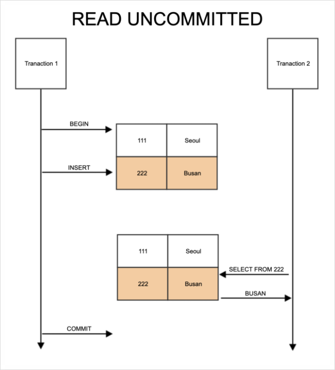
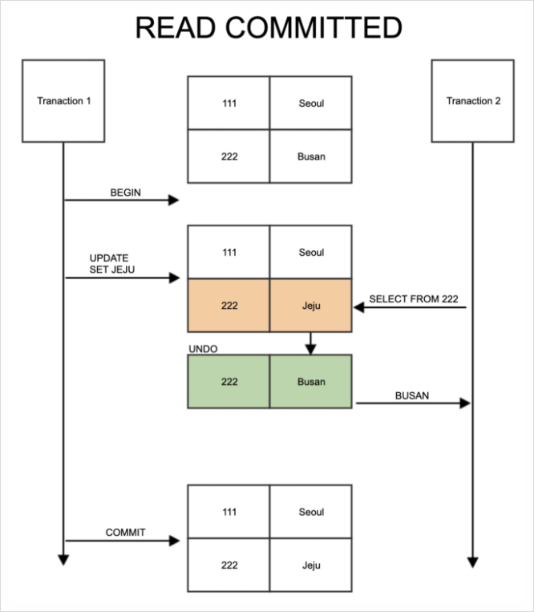
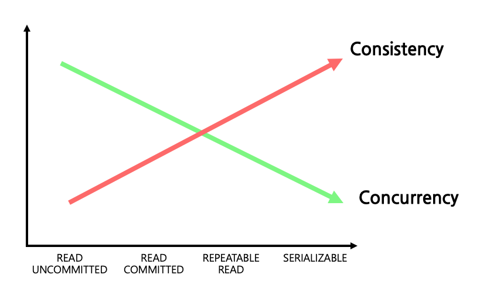

# 05. 트랜잭션과 잠금

> `트랜잭션` 이란?
작업의 완정성을 보장하여 데이터의 정합성(=어떤 데이터들의 값이 서로 일치함)을 보장하기 위한 기능.
논리적인 작업 셋을 모두 완벽하게 처리 or 처리하지 못한 경우에는 원 상태로 복구해서 작업의 일부만 적용되는 현상을 방지하는 기능
> 

> `잠금` 이란?
동시성을 제어하기 위한 기능. 
여러 커넥션에서 동시에 유일한 자원(레코드나 테이블)을 요청할 경우 순서대로 하나의 커넥션만 변경할 수 있게 해주는 역할
> 

> `격리수준` 이란?
하나의 트랜잭션 내에서 또는 여러 트랜잭션 간의 작업 내용을 어떻게 공유하고 차단할 것인지 결정하는 레벨을 의미
> 

## 5.1 트랜잭션

`트랜잭션`은 **하나의 논리적인 작업 셋에 쿼리의 갯수와 관계없이 논리적인 작업 셋 자체가 100% 적용되거나(COMMIT을 실행했을 때) 아무것도 적용되지 않아야(ROLLBACK 또는 트랜잭션을 ROLLBACK시키는 오류가 발생했을 때) 함을 보장**해 주는 것

### 5.1.1 MySQL에서의 트랜잭션

`MyISAM 엔진으로 실행되는 테이블`에서 실행되는 쿼리는 오류가 발생하더라도, 정상적으로 처리된 쿼리는 실행되어 INSERT 처리 후 별다른 삭제 처리 없으 쿼리가 종료됨 
    → `부분 업데이터(Partitial Update)` 
    → 데이터 정합성 맞추는데 어려운 문제를 발생시킴

```sql
-- myisam engine
mysql> create table tab_myisam(fdpk int not null, primary key(fdpk)) engine=MyISAM;
mysql> insert into tab_myisam(fdpk) values(3);
mysql> select * from tab_myisam;
+------+
| fdpk |
+------+
|    3 |
+------+
mysql> insert into tab_myisam(fdpk) values (1),(2),(3);
ERROR 1062 (23000): Duplicate entry '3' for key 'tab_myisam.PRIMARY'
mysql> select * from tab_myisam;
+------+
| fdpk |
+------+
|    1 |
|    2 |
|    3 |
+------+
```

`InnoDB 엔진으로 실행되는 테이블`의 쿼리는 일부라도 오류가 발생하면 전체를 원 상태로 만드는 트랜잭션의 원칙대로 INSERT 문장을 실행하기 전 상태로 그대로 복구 함

```sql
-- innodb engine
mysql> create table tab_innodb(fdpk int not null, primary key(fdpk)) engine=innodb;
mysql> insert into tab_innodb (fdpk) values(3);
mysql> select * from tab_innodb;
+------+
| fdpk |
+------+
|    3 |
+------+
mysql> insert into tab_innodb(fdpk) values (1),(2),(3);
ERROR 1062 (23000): Duplicate entry '3' for key 'tab_innodb.PRIMARY'
mysql> select * from tab_innodb;
+------+
| fdpk |
+------+
|    3 |
+------+
```

### 5.1.2 주의사항

트랜잭션은 DBMS의 커넥션과 동일하게 꼭 필요한 최소의 코드에만 적용하는 것이 좋음 → `프로그램 코드에서 데이터베이스 커넥션을 가지고 있는 범위와 트랜잭션이 활성화돼 있는 프로그램의 범위를 최소화` 하라는 의미

## 5.2 MySQL 엔진의 잠금

MySQL에서 사용되는 잠금은 두 가지로 구분 됨

- MySQL 엔진 레벨의 잠금 : 모든 스토리지에 영향을 미침
- 스토리지 엔진 레벨의 잠금 : 스토리지 엔진 간 상호 영향을 미치지 않음

### 5.2.1 글로벌 락

- `FLUSH TABLES WITH READ LOCK` 명령으로 글로벌 락 획득
- `영향을 미치는 범위는 MySQL 서버 전체`로 그 범위가 가장 큼
- 한 세션에서 글로벌 락 획득 시, `다른 세션에서 SELECT를 제외한 DDL, DML 문장 실행 시 글로벌 락이 해제될 때까지 해당 문장이 대기 상태`로 남음
- 여러 데이터베이스에 존재하는 MyISAM, MEMORY 테이블에 대해 mysqldump 백업 실행 시에는 글로벌 락 사용해야 함
- InnoDB 스토리지 엔진은 트랜잭션을 지원 → 일관된 데이터상태를 위해 모든 데이터 변경 작업을 멈출 필요X
    - `MySQL8.0 ~` Xtrabackup, Enterprise Backup 같은 백업 툴들의 안정적 실행을 위해 `백업락이 도입 됨`
    - `백업락 획득 시 테이블의 스키마나 사용자의 인증 관련 정보 변경 불가`. 일반적인 테이블의 데이터 변경은 허용
        - 데이터베이스 및 테이블 등 모든 객체 생성 및 변경,삭제
        - REPAIR TABLE과 OPTIMIZE TABLE 변경
        - 사용자 관리 및 비밀번호 변경

### 5.2.2 테이블 락

`테이블 락(Table Lock)은 개별 테이블 단위로 설정되는 잠금.` 명시적 또는 묵시적으로 테이블 락 획득 가능

- 명시적 테이블 락 : `LOCK TABLES table_name [READ|WRITE]` 명령으로 특정 테이블 락 획득
`UNLOCK TABLES` 명령으로 작므을 반납(해제)
- 묵시적 테이블 락 : MyISAM, MEMORY 테이블에 데이터 변경 쿼리 실행 시에 발생. `쿼리가 실행되는 동안 자동으로 획득했다가 쿼리가 완료된 후 자동으로 해제 됨`
- InnoDB 테이블에도 테이블 락이 설정되지만 데이터 변경(DML) 쿼리에서는 무시, 스키마 변경(DDL) 쿼리에만 영향

### 5.2.3 네임드 락

`네임드 락(Named Lock)은 GET_LOCK() 함수를 이용해 임의의 문자열에 대해 잠금 설정 가능.` 단순히 사용자가 지정한 문자열에 대해 획득하고 반납하는 잠금. 

```sql
-- 함수 모두 정상적을 락 획득/해제 시 1 리턴, 아닌경우 null 이나 0 리턴
mysql> select get_lock('mylock', 2);
mysql> select is_free_lock('mylock');
mysql> select release_lock('mylock');

-- MySQL8.0 ~ 네임드 락 중첩 사용 가능
mysql> select get_lock('mylock_1', 10);
mysql> select get_lock('mylock_2', 10);
-- MySQL8.0 ~ 동시에 네임드락 해제 가능
mysql> select release_all_locks();
```

### 5.2.4 메타데이터 락

`메타데이터 락(Metadata Lock)은 데이터베이스 객체(테이블, 뷰 등)의 이름이나 구조를 변경하는 경우 획득하는 잠금.` 이 메타데이터 락은 명시적으로 획득하거나 해제할 수 있는 것이 아니고 `RENAME TABLE tab_a TO tab_b` 같이 테이블의 이름을 변경하는 경우 자동으로 획독하는 잠금

ex. 메타데이터 잠금과 InnoDB의 트랙잭션을 동시에 사용해야 하는 경우. 테이블 구조 변경 시, Online DDL 사용 시 작업시간이 오래 걸림 → 새로운 구조의 테이블 생성 후 최근 데이터까지 pk값을 범위별로 나눠서 여러개의 스레드로 빠르게 복사하여 작업

```sql
mysql> create table access_log(id bigint not null auto_increment, ..., primary key(id));
-- 테이블 압축을 위해 key_block_size=4 옵션 추가하여 테이블 생성
mysql> create table access_log_new(...) key_block_size=4;

-- 4개의 스레드를 이용해 각 범위 별 신규테이블로 복사
mysql_thread1> insert into access_log_new select * from access_log where id > 0 and id < 10000;
mysql_thread2> insert into access_log_new select * from access_log where id > 10000 and id < 20000;
mysql_thread3> insert into access_log_new select * from access_log where id > 20000 and id  < 30000;
mysql_thread4> insert into access_log_new select * from access_log where id > 30000 and id < 40000;

-- 트랜잭션 autocommit 실행(begin, start transaction 실행 X)
mysql> set autocommit=0;
-- 작업 대상 테이블 2개에 대해 테이블 쓰기 락 획득
mysql> lock tables access_log write, access_log_new write;

-- 남은 데이터 복사 -> 이 시점엔 테이블 잠금으로 insert 불가
-- 따라서, 아주 최근 데이터까지 복사해 둬야 잠금시간을 최소화 가능
mysql> select max(id) as @max_id from access_log_new;
mysql> insert into access_log_new select * from access_log where pk > @max_id;
mysql> commit;

-- 새로운 테이블로 데이터 복사 완료 시, rename 명령으로 새로운 테이블 서비스로 투입 -> 메타데이터 락
mysql> rename table access_log to access_log_old, access_log_new to access_log;
mysql> unlock tables;

-- 불필요 데이터 삭제
mysql> drop table access_log_old;
```

## 5.3 InnoDB 스토리지 엔진 잠금

- InnoDB 스토리지 엔진은 MySQL에서 제공하는 잠금과는 별개로 `스토리지 엔진 내부에서 레코드 기반의 잠금 방식을 탑재`.
- MyISAM 보다 훨씬 뛰어난 동시성 처리를 제공
- 이원화된 잠금 처리로 잠금에 대한 정보는 MySQL 명령으로 접근하기 까다로웠음 → 최신 버전에서 InnoDB 의 트랜잭션과 잠금, 잠금 대기 중인 트랜잭션의 목록 조회 방법이 도임 됨.
`information_schema.innodb_trx`, `information_schema.innodb_locks`, `information_schema.innodb_lock_waits` 테이블 조인해서 어떤 트랜잭션이 어떤 잠금을 대기하고 있는지, 해당 작믕르 어떤 트랜잭션이 가지고 있는지 확인 가능하며 장시간 잠금을 가진 클라이언트를 찾아 종료 시킬 수 있음
- `performance_schema` 를 이용해 InnoDB 스토리지 엔진의 내부 잠금에 대한 모니터링 방법도 추가 됨

### 5.3.1 InnoDB 스토리지 엔진의 잠금

`InnoDB 스토리지 엔진은 레코드 기반의 잠김 기능을 제공`하며, 잠금 정보가 상당히 작은 공간으로 관리되기 때문에 `락 에컬레이션은 없다`. 레코드 락뿐 아니라 레코드와 레코드 사이의 간격을 잠그는 `갭(GAP) 락` 존재.

### 레코드 락

레코드 자체만을 잠그는 것을 `레코드 락(Record lock, Record only lock)` 이라고 함.

- 타 사용 DBMS 와 동일한 역할
- `InnoDB엔진은 인덱스의 레코드를 잠금다는 점`(레코드 자체X)이 타 사용 DBMS와 차이 됨
인덱스가 하나도 없는 테이블은 내부적으로 자동 생성된 클러스터 인덱스를 이용해 잠금 설정
- 프라이머리 키 또는 유니크 인덱스에 의한 변경 작업에서는 레코드 자체에 대해서만 락을 검

### 갭락

타 DBMS와의 차이는 `갭 락(Gap Lock)`. 레코드와 인접한 레코드 사이의 간격만을 잠그는 것을 의미. 레코드와 레코드 사이의 간격에 새로운 레코드가 생성(INSERT) 되는 것을 제어.

### 넥스트 키 락

`넥스트 키 락(Next key lock)은 레코드 락과 갭 락을 합쳐 놓은 형태의 잠금`. 

- 보조 인덱스를 이용한 변경 작업은 텍스트 키 락, 갭 락을 사용
- 로그에 기록되는 쿼리가 레플리카 서버에서 실행 시 소스 서버에서 만들어 낸 결과와 동이랗ㄴ 결과를 만들어내도록 보장하는 것이 주 목적
- 넥스트 키 락, 갭 락으로 인해 데드락 발생하거나 다른 트랜잭션을 기다리게 만드는 일이 자주 발생 → 바이너리 로그 포맷을 ROW 형태로 바꿔서 넥스트 키 락이나 갭 락을 줄이는 것이 좋음

### 자동 증가 락

- MySQL 에서는 자동 증가하는 숫자 값을 추출하기 위해 AUTO_INCREMENT라는 컬럼 속성 제공
- 각 레코는 중복되지 않고 저장된 순서대로 증가하는 일련변호 값을 가져야 함 → InnoDB 스토리지 엔진은 내부적으로 `AUTO_INCREMENT 락(auto increment lock)` 이라고 하는 테이블 수준의 잠금을 사용

AUTO_INCREMENT 락은 

- INSERT, REPLACE 쿼리 문장과 같이 새로운 레코드 저장 쿼리에만 필요
- `트랜잭션과 관계없이 INSERT, REPLACE 문장에서 AUTO_INCREMENT 값을 가져오는 순간만 락이 걸렸다가 즉시 해제 됨`
- `테이블에 단 하나만 존재`→ 두 개의 INSERT 쿼리 동시 실행 시 , 하나의 쿼리가 AUTO_INCREMENT 락을 걸면 나머지 쿼리는 AUTO_INCREMENT 락 대기
- 명시적으로 획득 및 해제 방법은 없음
- 아주 짧은 시간 걸렸다가 해제되는 잠금이라 대부분의 경우 문제가 되지 않음

MySQL 5.1 ~ `innodb_autoinc_lock_mode` 시스템 변수를 이용해 자동 증가락의 작동 방식 변경 가능

- innodb_autoinc_lock_mode=0
~ MySQL 5.0 과 동일한 잠금 방식으로 모든 INSERT 문장은 자동 증가 락을 사용
- innodb_autoinc_lock_mode=1
    - MySQL 서버가 INSERT 되는 레코드 건수를 정확히 예측할 수 있을 때 사용 → 훨씬 가볍고 빠른 `래치(뮤텍스)` 를 이용
    - 래치는 자동 증가 락과 달리 아주 짧은 시간 동안만 잠금을 걸고 필요한자동 증가 값을 가져오면 즉시 잠금 해제
    - INSERT … SELECT 와 같이 MySQL 서버가 건수를 예측 불가 시 MySQL 5.0 에서와 같이 자동 증가락 사용
    - 최소 하나의 INSERT 문장으로 INSERT 되는 레코드는 연속된 자동 증가 값을 가짐 → `연속 모드(Consecutive mode)`
- innodb_autoinc_lock_mode=2
    - InnoDB 스토리지 엔진은 절대 자동 증가 락을 걸지 않고 경량화된 래치(뮤텍스)를 이용
    - INSERT 문장으로 INSERT 되는 레코드라고 하더라고 연속된 값을 보증X → `인터리빙 모드(Interlevaed mode)`

### 5.3.2 인덱스와 잠금

InnoDB 의 잠금은 인덱스를 잠그는 방식으로 처리

- 변경할 레코드를 찾기 위해 검색한 인덱스의 레코드에 모두 락을 걸어야 함.
- 테이블에 인덱스가 없을 경우, 테이블을 풀 스캔하면서 update 작업을 진행 → 테이블에 있는 모든 레코드를 잠금 처리 해버림.

```sql
mysql> desc employees;
+------------+---------------+------+-----+---------+-------+
| Field      | Type          | Null | Key | Default | Extra |
+------------+---------------+------+-----+---------+-------+
| emp_no     | int           | NO   | PRI | NULL    |       |
| birth_date | date          | NO   |     | NULL    |       |
| first_name | varchar(14)   | NO   | MUL | NULL    |       |
| last_name  | varchar(16)   | NO   |     | NULL    |       |
| gender     | enum('M','F') | NO   | MUL | NULL    |       |
| hire_date  | date          | NO   | MUL | NULL    |       |
+------------+---------------+------+-----+---------+-------+
6 rows in set (0.00 sec)

mysql> select count(*) from employees where first_name = 'Georgi';
+----------+
| count(*) |
+----------+
|      253 |
+----------+
1 row in set (0.00 sec)

mysql> select count(*) from employees where first_name = 'Georgi' and last_name='Klassen';
+----------+
| count(*) |
+----------+
|        1 |
+----------+
1 row in set (0.05 sec)

-- update 쿼리 시 인덱스가 걸린 first_name='Georgi' 조건에 맞는 레코드가 모두 잠김
-- last_name 은 인덱스가 없기 때문에 잠금 불가
mysql> update employees set hire_date=now() where first_name = 'Georgi' and last_name='Klassen';
Query OK, 1 row affected, 1 warning (0.02 sec)
Rows matched: 1  Changed: 1  Warnings: 1
```

### 5.3.3 레코드 수준의 잠금 확인 및 해제

InnoDB 스토리지 엔진을 사용하는 테이블의 레코드 수준 잠금은 테이블 레코드 각각에 잠금이 걸리므로 레코드가 자주 사용되지 않는다면 오랜 시간 동안 잠겨진 상태로 남음 → 잘 발견되지 않음.

MySQL 5.1 ~ 레코드 잠금과 잠금 대기에 대한 조회가 가능하며 쿼리 실행 시 바로 조회 가능

MySQL 8.0 ~ ~~information_schema deprecated~~, `performance_schema.data_locks`, `performance_schema.data_lock_waits` 테이블로 조회

```sql
-- 1번 connection
-- update query 실행
mysql> begin;
mysql> update employees set hire_date='2010-05-05' where emp_no=100002;

-- 프로세스 목록 확인
-- `kill 프로세스 ID` 사용하여 작업 강제 종료
mysql> show processlist;
+----+-----------------+-----------+-----------+---------+--------+------------------------+------------------+
| Id | User            | Host      | db        | Command | Time   | State                  | Info             |
+----+-----------------+-----------+-----------+---------+--------+------------------------+------------------+
|  5 | event_scheduler | localhost | NULL      | Daemon  | 117065 | Waiting on empty queue | NULL             |
|  8 | root            | localhost | employees | Sleep   | 114560 |                        | NULL             |
| 10 | root            | localhost | employees | Query   |      0 | init                   | show processlist |
| 11 | root            | localhost | NULL      | Sleep   |      8 |                        | NULL             |
+----+-----------------+-----------+-----------+---------+--------+------------------------+------------------+
4 rows in set (0.01 sec)

-- 잠금 및 잠금 대기 목록 확인
mysql> select * from performance_schema.data_locks \G
*************************** 1. row ***************************
               ENGINE: INNODB
       ENGINE_LOCK_ID: 281473214816256:1083:281473097722784
ENGINE_TRANSACTION_ID: 2590
            THREAD_ID: 50
             EVENT_ID: 61
        OBJECT_SCHEMA: employees
          OBJECT_NAME: employees
       PARTITION_NAME: NULL
    SUBPARTITION_NAME: NULL
           INDEX_NAME: NULL
OBJECT_INSTANCE_BEGIN: 281473097722784
            LOCK_TYPE: TABLE              -- 테이블 잠금. IX 잠금
            LOCK_MODE: IX
          LOCK_STATUS: GRANTED
            LOCK_DATA: NULL
*************************** 2. row ***************************
               ENGINE: INNODB
       ENGINE_LOCK_ID: 281473214816256:18:746:26:281473097719872
ENGINE_TRANSACTION_ID: 2590
            THREAD_ID: 50
             EVENT_ID: 61
        OBJECT_SCHEMA: employees
          OBJECT_NAME: employees
       PARTITION_NAME: NULL
    SUBPARTITION_NAME: NULL
           INDEX_NAME: PRIMARY
OBJECT_INSTANCE_BEGIN: 281473097719872
            LOCK_TYPE: RECORD             -- 레코드 잠금, 순수 레코드 잠금(GAP 잠금 포함X)
            LOCK_MODE: X,REC_NOT_GAP
          LOCK_STATUS: GRANTED
            LOCK_DATA: 100002
2 rows in set (0.00 sec)

-- 2번 connection
mysql> begin;
mysql> select * from employees.employees where emp_no=100002;
+--------+------------+------------+-----------+--------+------------+
| emp_no | birth_date | first_name | last_name | gender | hire_date  |
+--------+------------+------------+-----------+--------+------------+
| 100002 | 1957-03-04 | Claudi     | Kolinko   | F      | 2022-08-16 |
+--------+------------+------------+-----------+--------+------------+
1 row in set (0.01 sec)

-- 1번 connection
mysql> commit;
mysql> select * from employees.employees where emp_no=100002;
+--------+------------+------------+-----------+--------+------------+
| emp_no | birth_date | first_name | last_name | gender | hire_date  |
+--------+------------+------------+-----------+--------+------------+
| 100002 | 1957-03-04 | Claudi     | Kolinko   | F      | 2010-05-05 |
+--------+------------+------------+-----------+--------+------------+

-- 2번 connection(1번 connection 에서 commit 후) -> REPEATABLE READ 격리수준
mysql> select * from employees.employees where emp_no=100002;
+--------+------------+------------+-----------+--------+------------+
| emp_no | birth_date | first_name | last_name | gender | hire_date  |
+--------+------------+------------+-----------+--------+------------+
| 100002 | 1957-03-04 | Claudi     | Kolinko   | F      | 2022-08-16 |
+--------+------------+------------+-----------+--------+------------+
1 row in set (0.00 sec)
```

## 5.4 MySQL의 격리 수준

> 트랜잭션의 격리 수준(isolation level) 이란?
여러 트랜잭션이 동시에 처리될 때 특정 트랜잭션이 다른 트랜잭션에서 변경하거나 조회하는 데이터를 볼 수 있게 허용할지 말지를 결정하는 것
> 



왼쪽→오른쪽 방향으로 갈수록 consitentcy(일관성) 은 높아져 강력한 isolation 효과를 볼수 있지만, concurrency(동시성) 은 떨어지게 됨

데이터베이스의 격리 수준에서는 세가지 부정합의 문제점이 존재하며 부정합의 문제는 아래와 같음

|  | DIRTY READ | NON-REPEATABLE READ | PHANTOM READ |
| --- | --- | --- | --- |
| READ UNCOMMITTED | 발생 | 발생 | 발생 |
| READ COMMITTED | X | 발생 | 발생 |
| REPEATABLE READ | X | X | 발생 (InnoDB는 없음) |
| SERIALIZABLE | X | X | X |

> Dirty Read(더티 리드) 란?
다른 트랜잭션에서 처리한 작업이 완료되지 않았음에도 불구하고 다른 트랜잭션에서 볼 수 있게 되는 현상
> 

> NON-REPEATABLE READ 란?
하나의 트랜잭션 내에서 동일한 SELECT 쿼리를 실행했을 때 항상 같은 결과를 보장해야 한다는 REPEATABLE READ 정합성에 어긋나는 것
> 

> PHANTOM READ 란?
`SELECT ... FOR UPDATE` 쿼리와 같은 쓰기 잠금을 거는 경우, 다른 트랜잭션에서 수행한 변경 작업에 의해 레코드가 보였다가 안 보였다가 하는 현상
> 

### READ UNCOMMITTED



- 각 트랜잭션에서의 변경 내용이 COMMIT이나 ROLLBACK 여부에 상관없이 다른 트랜잭션에서 보임.
- 더티 리드를 유발
- RDBMS 표준에서는 트랜잭션의 격리 수준으로 인정하지 않음. 정합성 문제가 많은 격리 수준

### READ COMMITED



- `MySQL 에서 권장하는 최소 격리 수준`, 오라클 DBMS에서 기본으로 사용되는 격리 수준. 온라인 서비스에서 가장 많이 사용하는 격리 수준
- 더티 리드 발생X
- 사용자 A가 데이터 변경 후 커밋하지 않은 상태, 변경하기 전 데이터는 언두 로그에 저장 → 사용자 B가 동일 데이터 조회 시, 언두 로그에 저장된 변경전 데이터를 조회 함 → 더티 리드 발생X
- NON-REPEATABLE READ 는 발생

### REPEATABLE READ


- `MySQL의 InnoDB 스토리지 엔진에서 기본으로 사용되는 격리 수준`
- NON-REPEATABLE READ 부정합 발생 X
- REPEATABLE READ 와 READ COMMITED 차이는 언두 영역에 백업된 레코드의 여러 버전 중 몇 번째 버전을 사용하느냐 → InnoDB 트랜잭션은 순차적으로 증가하는 고유한 번호를 가지며, 언두 영역에 백업된 모든 레코드에는 변경을 발생시킨 트랜잭션의 번호가 포함 됨
- PHANTOM READ 발생
단, InnoDB 스토리지 엔진은 갭 락과 넥스트 키 락 덕분에 PHANTOM READ 발생X

### SERIALIZABLE

- `가장 단순한 격리 수준이면서 동시에 가장 엄격한 격리 수준` → 동시 성능 처리는 떨어짐
- PHANTOM READ 발생X
- InnoDB 테이블에서 순수한 SELECT 작업은 레코드 잠금을 설정하지 않고 실행 → 트랜잭션에서 읽고 쓰는 레코드를 다른 트랜잭션에서 절대 접근 불가