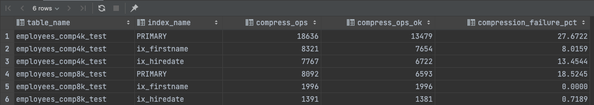
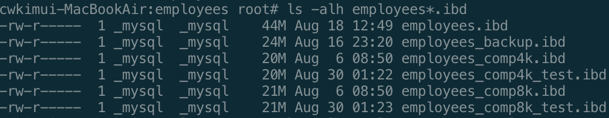

# 6장 데이터 압축

## 6.1 페이지 압축

- 페이지 압축은 서버가 디스크에 저장하는 시점에 디이터 페이지가 압축되어 저장되고, 반대로 MySQL 서버가 디스크에서 데이터 페이지를 읽어 올 때 압축이 해제 된다.
- 페이지 압축은 펀치홀 기능을 사용하는데 운영체제 및 하드웨어에 대한 의존성이 있어 잘 사용되지 않는다.

## 6.2 테이블 압축

- 테이블 압축은 운영체제나 하드웨어에 대한 제약 없이 사용한다.
- 디스크 데이터 파일의 크기를 줄일수 있다.
- 단점
    - 버퍼 풀 공간 활용률이 낮음
    - 쿼리 처리 성능이 낮음
    - 빈번한 데이터 변경시 압축률이 떨어짐

### 6.2.1 압축 테이블 생성

- 전제 조건으로 압축을 사용하려는 테이블이 별도의 테이블 스페이스를 사용해야 한다.
- `innodb_file_per_table` 시스템 변수가 ON
- 테이블을 생성할때 `ROW_FORMAT=COMPRESSED` 옵션을 명시해야 함.
    - 추가로 `KEY_BLOCK_SIZE` 옵션을 이용해 페이지의 타깃 크기를 명시한다. (2^n, n≥2)
- 그리고 페이지 크기가 32KB 또는 64KB인 경우에는 테이블 압축을 적용할 수 없다.
- 압축 과정 (예: 16KB)
    1. 16KB의 데이터 페이지를 압축
        
        1.1 압축된 결과가 8KB 이하이면 그대로 디스크에 저장(압축 완료)
        
        1.2 압축된 결과가 8KB를 초과하면 원본 페이지를 스플릿해서 2개의 페이지에 8KB씩 저장
        
    2. 나뉜 페이지 각각에 대해 1번 단계를 반복 실행

### 6.2.2 KEY_BLOCK_SIZE 결정

- 테이블 압축에서 가장 중요한 부분은 압축된 결과가 어느 정도가 될지를 예측해서 `KEY_BLOCK_SIZE`를 결정하는 것이다.
- 테이블을 압축을 적용하기 전 `KEY_BLOCK_SIZE` 4KB 8KB로 테이블을 생성해서 샘플 데이터를 저장해보고 적절한지 판단하는 것이 좋다.
- `p190` 예제
    
    
    
    
    
- 압축 실패율이 높다고 압축을 사용하지 말야아한다는 것은 아니다. 예를들어 INSERT후 데이터가 변경될 일이 없는 되는 로그 테이블의 경우. 압축을 고려해볼 수 있다.

### 6.2.3 압축된 페이지의 버퍼 풀 적재 및 사용

- InnoDB 스토리지 엔진은 압축된 테이블의 데이터 페이지를 버퍼 풀에 적재하면 압축된 상태와 압축이 해제된 상태 2개의 버전을 관리한다.
- `LRU 리스트`와 `Unzip_LRU리스트`가 각각의 버전을 관리한다.
- 압축된 테이블에 대해서는 버퍼풀의 공간을 이중으로 사용함으로써 메모리를 낭비하는 효과를 가진다.
- 또한 압축 및 압축을 해제하는 과정에서 CPU를 상대적으로 많이 소모한다.
- 따라서 MySQL 서버와 InnoDB 스토리지 엔진은 어댑티브 알고리즘을 활용해 위 단점을 보완한다.

### 6.2.4 테이블 압축 관련 설정

- 압축 실패율을 낮추기 위한 튜닝포인트를 제공하는 시스템 변수들이 있다.
- `p193`, `p194` 참조
    - `innodb_cmp_per_index_enabled`
    - `innodb_compression_level`
    - `innodb_compression_failure_threshold_pct`
    - `innodb_compression_pad_pct_max`
    - `innodb_log_compressed_pages`