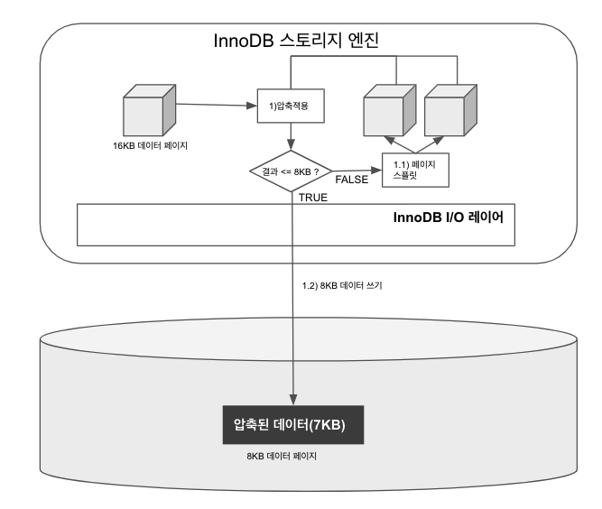

# 6장 데이터 압축

### 데이터 파일 크기가 커지게 되면?

- 더 많은 데이터 페이지를 버퍼 풀로 읽어야 한다
- 새로운 페이지가 버퍼 풀로 적재되기 때문에 더티 페이지가 더 자주 디스크로 기록돼야 한다
- `백업 시간`, `복구 시간` 이 오래 걸린다

## 6.1 페이지 압축

- `Transparent Page Compression`
- 지원 압축 알고리즘 ⇒ `zlib` , `LZ4`
- 디스크에 저장하는 시점에 데이터 페이지가 압축되어 저장되고, 디스크에서 읽어올 때 압축이 해제된다
    - 버퍼 풀에 데이터가 한 번 적재되면 `압축이 해제된 상태로만 데이터 페이지를 관리`한다
- 데이터 페이지 압축 결과는 예측 불가하지만 하나의 테이블은 동일한 크기의 페이지(블록)로 통일돼야 한다
    - 운영체제별로 특정 버전의 파일 시스템에만 지원되는  `펀치 홀(Puhch hole)` 기능을 사용한다
- 페이지 압축 자동 방식
    1. 16KB 페이지를 압축(압축 결과를 7KB로 가정한다)
    2. MYSQL 서버는 디스크에 압축된 결과 7KB를 기록한다
    3. 디스크에 데이터를 기록한 후, 7KB 이후의 공간 9KB에 대해 `펀치 홀` 을 생성한다
        1. [https://www.percona.com/blog/2019/02/11/compression-options-in-mysql-part-2/](https://www.percona.com/blog/2019/02/11/compression-options-in-mysql-part-2/)
    4. 파일 시스템은 7KB만 남기고 나머지 9KB를 운영체제에 반납한다


- 운영체제에서 16KB 공간을 읽으면 압축된 데이터(7KB)와 펀치홀 공간(9KB)을 합쳐서 읽는다
- 페이지 압축의 문제점
    - 운영체제 뿐만 아니라 하드웨어 자체에서도 해당 기능을 지원해야 사용 가능하다
    - 파일시스템 관련 명령어(유틸리티)가 펀치 홀을 지원하지 못한다
        - `cp`
        - `XtraBackup`
- 페이지 압축 명령어 ⇒ 5.7 버전으로 테스트
    
    ```sql
    CREATE TABLE t1(c1 INT) COMPRESSION='zlib';
    
    // 테이블 변경 시
    ALTER TABLE t1 COMPRESSION='zlib';
    OPTIMIZE TABLE t1;
    
    //5.7 
    SELECT SPACE, NAME, FS_BLOCK_SIZE, FILE_SIZE, ALLOCATED_SIZE FROM
           INFORMATION_SCHEMA.INNODB_SYS_TABLESPACES WHERE NAME in ('employees/employees', 'employees/employees_zlib');
    // 8.0
    SELECT SPACE, NAME, FS_BLOCK_SIZE, FILE_SIZE, ALLOCATED_SIZE FROM
           INFORMATION_SCHEMA.INNODB_TABLESPACES WHERE NAME in ('employees/employees', 'employees/employees_zlib');
    ```
    
    
    
    
    
    - 지원 커널 확인하기
        - [https://dev.mysql.com/doc/refman/5.7/en/innodb-page-compression.html](https://dev.mysql.com/doc/refman/5.7/en/innodb-page-compression.html)

## 6.2 테이블 압축

- 운영체제나 하드웨어 제약 없이 사용
- 디스크의 데이터 파일을 크기를 줄일 수 있다
- 테이블 압축의 단점
    - 버퍼 풀 공간 활용률이 낮다
    - 쿼리 처리 성능이 낮다
    - 빈번한 데이터 변경 시 압축률이 떨어진다

### 6.2.1 압축 테이블 생성

- 테이블 압축 전제 조건
    - 압축을 사용하려는 테이블은 별도의 테이블 스페이스를 사용해야 한다
    - `innodb_file_per_table` 이 `ON` 상태에서 테이블이 생성돼야 한다
    - 테이블 생성 시 `ROW_FORMAT=COMPRESSED` 옵션을 명시해야 한다
    - `KEY_BLOCK_SIZE` 옵션으로 압축된 페이지의 타깃 크기를 명시해야 한다
        - `2n` 단위로 설정 가능
        - ex) 페이지 크기가 16KB 이면 4KB 또는 8KB까지 설정 가능하다
        - 페이지 크기가 32KB 또는 64KB인 경우 테이블 압축을 적용할 수 없다
- 테이블 압축 명령어

```sql
SET GLOBAL innodb_file_per_table=ON;

CREATE TABLE compressed_table (
	c1 INT PRIMARY KEY 
)
ROW_FORMAT=COMPRESSED
KEY_BLOCK_SIZE=8;
```

- InnoDB 스토리지 엔지 압축을 적용하는 방법
    
    
    
    - 압축 결과가 목표 크기(KEY_BLOCK_SIZE)보다 작거나 같을 때까지 페이지를 스플릿한다

### 6.2.2 KEY_BLOCK_SIZE 결정

- 압축 결과를 예측해서  `KEY_BLOCK_SIZE` 를 정하는 것이 가장 테이블 압축에서 가장 중요하다
- 4KB 또는 8KB로 테이블을 생성하여 샘플 데이터를 저장해보고 판단하는 것이 좋다
    - 최소한 데이터 페이지가 10개 정도는 생성되도록 `INSERT` 해보는 것이 좋다
- KEY_BLOCK_SIZE 선택 예시

```sql
// KEY_BLOCK_SIZE=4
CREATE TABLE `employees_comp4k` (
  `emp_no` int NOT NULL,
  `birth_date` date NOT NULL,
  `first_name` varchar(14) NOT NULL,
  `last_name` varchar(16) NOT NULL,
  `gender` enum('M','F') NOT NULL,
  `hire_date` date NOT NULL,
  PRIMARY KEY (`emp_no`),
  KEY `ix_firstname` (`first_name`),
  KEY `ix_hiredate` (`hire_date`)
) ROW_FORMAT=COMPRESSED KEY_BLOCK_SIZE=4;

// default OFF 
SET GLOBAL INNODB_CMP_PER_INDEX_ENABLED  = ON;

// 압축 테스트 테이블로 복사
INSERT INTO employees_comp4k SELECT * FROM employees;

// 인덱스 별로 압축 횟수와 성공 횟수, 압축 실패율 조회하기
SELECT
  table_name, index_name, compress_ops, compress_ops_ok,
  (compress_ops-compress_ops_ok)/compress_ops * 100 as compression_failure_pct
  FROM information_schema.INNODB_CMP_PER_INDEX;
```


- 압축 실패율은 3~5%미만으로 유지할 수 있도록 KEY_BLOCK_SIZE를 선택하는 것을 권장한다
- 압축 실패율이 높지 않은 경우라도 데이터가 빈번하게 조회하고 변경된다면 압축을 고려하지 않는게 좋다
    - 압축 알고리즘은 많은 CPU자원을 소모한다

### 6.2.3 압축된 페이지의 버퍼 풀 적재 및 사용

- 압축된 테이블의 데이터 페이지를 버퍼 풀에 적재하면 `압축된 상태`와 `압축이 해제된 상태`로 관리한다.
    - `LRU 리스트`  : 디스크에서 읽은 상태 그대로의 데이터 페이지 목록을 관리
    - `Unzip_LRU 리스트` : 압축된 페이지들의 압축 해제 버전
- 압축된 테이블과 압축되지 않은 테이블이 공존하므로 LRU 리스트는 아래 두 가지 데이터 페이지를 가진다
    - 압축이 적용되지 않은 테이블의 데이터 페이지 ⇒ LRU 리스트가 관리
    - 압축이 적용된 테이블의 압축된 데이터 페이지 ⇒ Unzip_LRU 리스트가 관리

### 문제점

- 압축된 테이블에 대해 버퍼 풀의 공간을 이중으로 사용하여 메모리를 낭비하는 효과를 가진다
- 압축 및 압축 해제 작업은 CPU를 상대적으로 많이 소모한다

### 해결방안

- InnoDB 버퍼 풀의 공간이 필요한 경우 LRU 리스트에서 원본 데이터 페이지는 유지, Unzip_LRU 압축 해제 버전 제거하여 버퍼 풀 공간을 확보한다
- 압축된 데이터 페이지가 자주 사용되면 Unzip_LRU 리스트의 압축 해제 페이지를 유지하고, 압축 및 해제 작업을 최소화한다
- 압축된 데이터 페이지가 사용되지 않아 LRU 리스트에서 제거되는 경우 Unzip_LRU 리스트에서도 제거된다

### 압축 해제된 버전의 데이터 페이지를 적절 수준으로 유지하는 어댑티브 알고리즘

- CPU 사용량이 높은 서버에서는 압축과 압축해제를 피하기 위해 Unzip_LRU 비율을 높여 유지한다
- Disk IO 사용량이 높은 서버에서는 Unzip_LRU 리스트의 비율을 낮춰 버퍼 풀 공간을 확보한다

### 6.2.4 테이블 압축 관련 설명

- 테이블 압축 관련 시스템 변수
    - `innodb_cmp_per_index_enabled` : 테이블 압축이 사용된 테이블의 모든 인덱스별로 압축 성공 및 압축 실행 횟수를 수집하도록 설정
        - `information_schema.INNODB_CMP`  ⇒ 테이블 단위 기록
        - `information_schema.INNODB_CMP_PER_INDEX` ⇒ 인덱스 단위 기록
    - `innodb_compression_level` :압축률을 설정할 수 있다
        - 0 ~ 9 까지 설정 가능하며 값이 커질수록 압축률이 높아진다
            - innoDB 테이블 압축은 `zlib` 알고리즘만 지원하다
    - `innodb_comporession_failure_threshold_pct` : 압축을 실행하기 전 원본 데이터 페이지의 끝에 의도적으로 일정 크기의 빈 공간(패딩)을 추가한다
    - `innodb_comporession_pad_pct_max` :  전체 데이터 페이지 크기 대비 패딩 공간의 비율
    - `innodb_log_compressed_pages` : 비정상 종료 후 다시 시작되는 경우 압축 알고리즘의 버전 차이가 있더라도 복구 과정이 실패하지 않도록 압축된 데이터 페이지를 그대로 리두 로그에 기록한다
        - 리두 로그의 증가량에 상당한 영향을 미칠 수 있다