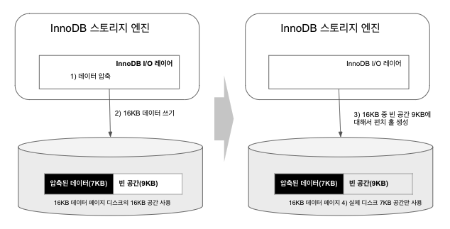
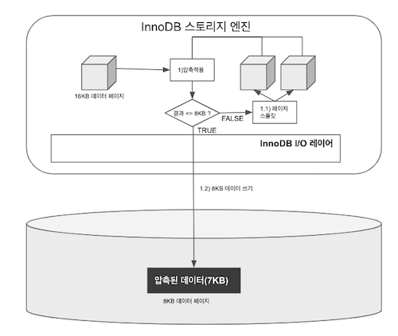
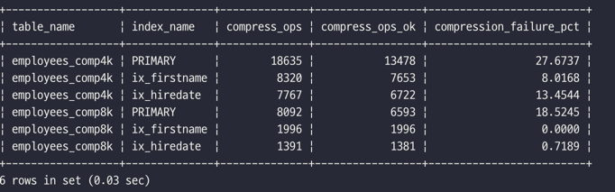
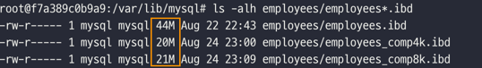

# 6장. 데이터 압축

[MySQL 8.0 Reference Manual](https://dev.mysql.com/doc/refman/8.0/en/)

[1. 페이지 압축](#1-페이지-압축)  
[2. 테이블 압축](#2-테이블-압축)

#### 디스크의 데이터 파일이 큰 경우 문제점

- 쿼리를 처리하기 위해서 더 많은 데이터 페이지를 버퍼 풀로 읽어야 한다.
- 새로운 페이지가 버퍼 풀로 적재되면 그만큼 더티 페이지가 더 자주 디스크로 기록되어야 한다.
- 백업과 복구 시간이 오래 걸린다.
- 저장 공간이 많이 필요하기 때문에 비용 문제가 발생할 수 있다.

➡️ MySQL 서버에서 두 가지 종류의 데이터 압축 방식을 제공한다. (페이지 압축 /테이블 압축)

## 1. 페이지 압축

- MySQL 서버가 디스크에 저장하는 시점에 데이터 페이지가 압축되어 저장된다.
- MySQL 서버가 디스크에서 데이터 페이지를 읽어올 때 압축이 해제된다.
- 즉, 버퍼 풀에 데이터 페이지가 한 번 적재되면 압축이 해제된 상태로만 데이터 페이지를 관리한다.

#### 페이지 압축의 작동 방식



- 운영체제(파일 시스템)의 블록 사이즈가 512바이트인 경우  
  ① 16KB 페이지를 압축(압축 결과를 7KB로 가정)  
  ② MySQl 서버는 디스크에 압축된 결과 7KB를 기록 (이때 MySQL 서버는 압축 데이터 7KB에 9KB의 빈 데이터를 기록)  
  ③ 디스크에 데이터를 기록한 후, 7KB 이후의 공간 9KB에 대해 펀치 홀 생성  
  ④ 파일 시스템은 7KB만 남기고 나머지 디스크의 9KB 공간은 다시 운영체제로 반납

#### 페이지 압축의 문제점

- 적어도 하나의 테이블은 동일한 크기의 페이지(블록)로 통일되어야 하는데, 데이터 페이지를 압축한 결과 용량이 어느정도 될지 예측이 불가능하다.
- 페이지 압축 기능은 '펀치 폴'이라는 기능을 사용하는데, 펀치 홀은 다음과 같은 한계점이 있다.
    - 펀치 홀 기능은 운영체제 뿐만 아니라 하드웨어 자체에서도 해당 기능을 지원해야 상용 가능하다.
    - 아직 파일 시스템 관련 명령어(유틸리티)가 펀치 홀을 지원하지 못한다.

➡️ 이런 이유로 실제 페이지 압축은 많이 사용되지 않는다.

#### 페이지 압축을 사용하는 방법

```sql
-- // 테이블 생성
CREATE TABLE t1 (
    c1 INT
) COMPRESSION = 'zlib';

-- // 테이블 변경
ALTER TABLE t1 COMPRESSION = 'zlib';

-- // 테이블 변경 사항 적용 
OPTIMIZE TABLE t1;
```

## 2. 테이블 압축

- 테이블 압축은 운영체제나 하드웨어에 대한 제약이 없기 때문에 일반적으로 더 활용도가 높은 편이다.
- 테이블 압축은 디스크의 데이터 파일 크기를 줄일 수 있어 이득이 있지만, 다음과 같은 단점이 있다.

#### 테이블 압축의 단점

- 버퍼 풀 공간 활용률이 낮음
- 쿼리 처리 성능이 낮음
- 빈번한 데이터 변경 시 압축률이 떨어짐

### 압축 테이블 생성

- 압축을 사용하려는 테이블이 별도의 테이블 스페이스를 사용해야 한다.
    - `innodb_file_per_table` 변수가 ON으로 설정된 상태에서 테이블 생성
- 테이블을 생성할 때 `ROW_FORMAT=COMPRESSED` 옵션을 명시한다.
- `KEY_BLOCK_SIZE` 옵션을 이용해 압축된 페이지의 타깃 크기(목표)를 명시하는데, `2n`인 값으로 설정해야 한다.
- InnoDB 스토리지 엔진의 페이지 크기(`innodb_pare_size`)가 16KB라면 `KEY_BLOCK_SIZE는` 4KB 또는 8KB만 설정할 수 있다.
    - 페이지 크기가 32KB 또는 64KB인 경우에는 테이블 압축을 적용할 수 없다.

```sql
SET GLOBAL innodb_file_per_table = ON;

CREATE TABLE compressed_table (
    c1 INT PRIMARY KEY
) 
ROW_FORMAT=COMPRESSED
KEY_BLOCK_SIZE=8;
```

- 압축 적용에 사용되는 KEY_BLOCK_SIZE 옵션은 페이지가 저장될 크기를 지정한다.



- InnoDB 스토리지 엔진의 데이터 페이지(블록) 크기가 16KB, KEY_BLOCK_SIZE가 8로 설정된 경우  
  ① 16KB의 데이터 페이지를 압축
    - 압축된 결과가 8KB 이하이면 그대로 디스크에 저장(압축 완료)
    - 압축된 결과가 8KB를 초과하면 원본 페이지를 스플릿해서 2개의 페이지에 8KB씩 저장

  ② 나뉜 페이지 각각에 대해 "1"번 단계를 반복 실행

### KEY_BLOCK_SIZE 결정

- 원본 데이터 페이지의 압축 결과가 목표 크기(KEY_BLOCK_SIZE)보다 작거나 같을 때까지 반복해서 페이지를 스플릿한다.
- **`KEY_BLOCK_SIZE`가 잘못 설정되면 MySQL 서버의 처리 성능이 급격히 떨어질 수 있으니 주의해야 한다.**

- 그래서 테이블 압축을 적용하기 전에 먼저 KEY_BLOCK_SIZE를 4KB 또는 8KB로 테이블을 생성해서 샘플 데이터를 저장해보고 적절한지 판단하는 것이 좋다.
- 최소한 테이블의 데이터 페이지가 10개 정도는 생성되도록 가능한 많은 샘플 데이터를 INSERT해보는 것이 좋다.

```sql
-- // 테이블 압축을 사용하는 테이블 생성
CREATE TABLE employees_comp4k (
    emp_no     int         NOT NULL,
    birth_date date        NOT NULL,
    first_name varchar(14) NOT NULL,
    last_nam   varchar(16) NOT NULL,
    gender     enum('M','F') NOT NULL,
    hire_date  date        NOT NULL,
    PRIMARY KEY (emp_no),
    KEY        ix_firstname (first_name),
    KEY        ix_hiredate (hire_date)
) 
ROW_FORMAT=COMPRESSED 
KEY_BLOCK_SIZE=4;

-- // 인덱스별로 압출 실행 횟수와 성공 횟수가 기록되게 설정
SET GLOBAL innodb_cmp_per_index_enabled = ON;

-- // employees 테이블의 데이터를 압축 테이블로 저장
INSERT INTO employees_comp4k SELECT *FROM employees;

-- // 인덱스 별로 압축 횟수와 성공 횟수, 압축 실패율 조회
SELECT table_name, index_name, compress_ops, compress_ops_ok,
       (compress_ops - compress_ops_ok) / compress_ops * 100 as compression_failure_pct
FROM information_schema.INNODB_CMP_PER_INDEX;
```

- `KEY_BLOCK_SIZE가` 4KB와 8KB인 경우 비교

  

    - 4KB로 설정한 경우, 18635번 압축을 실행했고, 그 중 13478번 성공했다. 압축 실패율은 27.6%이다.
    - 일반적으로 압축 실패율은 3~5% 미만으로 유지할 수 있게 KEY_BLOCK_SIZE가를 선택하는 것이 좋다.
    - 8KB로 설정한 경우, 6593번 압축을 실행했고, 그 중 8092번 성공햇다. 압축 실패율은 18.5%이다.
    - 따라서 이 경우에 압축을 한다면 8KB를 선택하는 것이 효율적일 것이다.

- 압축 실패율이 높으면 InnoDB 버퍼 풀에서 디스크로 기록되기 전에 압축하는데 시간이 꽤 오래 걸릴 것이라고 예측할 수 있다.
- 하지만 압축 실패율이 높다고 해서 압축을 사용하지 말아야 한다는 것을 의미하지 않는다.

  

    - 압축되지 않은 테이블의 크기는 44MB인 반면, 압축을 하면 20MB 정도이다.

- 압축 시도가 실패되더라도 전체적인 파일 크기가 큰 폭으로 줄어드는 경우라면 압축을 고려하는 것이 좋다.
    - e.g. INSERT만 되는 로그 테이블
- 반면, 압축 실패율이 높지 않더라도 테이블의 데이터가 빈번하게 조회되고 변경된다면 압축은 고려하지 않는 것이 좋다.
- 테이블 압축은 zlib를 이용해서 압축을 실행하는데, 예상외로 압축 알고리즘은 많은 CPU 자원을 소모한다.

### 압축된 페이지의 버퍼 풀 적재 및 사용

- InnoDB 스토리지 엔진은 압축된 테이블의 데이터 페이지를 버퍼 풀에 적재하면, 두 가지 상태의 데이터 페이지를 관리한다.  
    ① 압축 상태를 관리하는 LRU 리스트  
    ② 압축 해제 버전인 Unzip_LRU 리스트

#### 버퍼 풀에서 서로 다른 압축 상태가 공존하는 경우 문제점 

① 압축된 테이블에 대해 버퍼 풀 공간을 이중으로 사용함으로써 메모리를 낭비한다.  
② 압축된 페이지에서 데이터를 읽거나 변경하기 위해서 압축을 해제해야 하는데, 이는 CPU를 많이 소모하는 작업이다.

#### 버퍼 풀에서 압축된 페이지를 관리하는 방식

- MySQL 서버로 유입되는 요청 패턴에 따라서 적절히(Adaptive) Unzip_LRU 리스트를 관리한다.
    
    ① 버퍼 풀 공간이 필요한 경우  
      Unzip_LRU 리스트에서 압축 해제된 버전은 제거해서 버퍼 풀의 공간을 확보  
    ② 압축된 데이터 페이지가 자주 사용되는 경우   
      Unzip_LRU 리스트에 압축 해제된 페이지를 계속 유지하면서 압축 및 압축 해제 작업 최소화  
    ③ 압축된 데이터 페이지가 사용되지 않아서 LRU 리스트에서 제거되는 경우  
      Unzip_LRU 리스트에서도 함께 제거
    
####  압축 해제된 데이터 페이지를 적절한 수준으로 유지하기 위한 방식

① CPU 사용량이 높은 서버  
  가능하면 압축 해제를 피하기 위해 Unzip_LRU의 비율을 높여 유지  
② Disk IO 사용량이 높은 서버  
  가능하면 Unzip_LRU 리스트의 비율을 낮춰서 InnoDB 버퍼 풀의 공간을 더 확보

### 테이블 압축 관련 설정

- 데이블 압축과 연관된 시스템 변수는 페이지 압축 실패율을 낮추기 위한 튜닝 포인트를 제공한다.

|변수 명|설명|
|:----:|----|
|innodb_cmp_per_index_enabled<br>(default OFF)|- OFF: 테이블 단위의 압축 성공 및 압축 실행 횟수만 수집<br>- ON: 테이블 압축이 사용된 테이블의 모든 인덱스별로 압축 성공 및 압축 실행 횟수를 수집 <br>- 수집된 정보는 information_schema의 INNODB_CMP, INNODB_CMP_PER_INDEX에 기록된다.|
|innodb_compression_level<br>(default 6)|- zlib 압축 알고리즘의 압축률을 설정한다. <br>- 0~9 값에서 작을수록 압축 속도(CPU 자원 소모량)는 빠르지만 저장 공간은 커진다.|
|innodb_compression_failure_threshold_pct<br>(default 5)|- 압축 실패율 임계값을 설정한다. <br>-압축 실패율이 임계값을 넘으면, 압축을 실행하기 전 원본 데이터 페이지 끝에 빈 공간을 추가한다. <br>- 빈 공간(패딩)은 압축률을 높여 압축 결과가 KEY_BLOCK_SIZE보다 작어지게 만든다.|
|innodb_compression_pad_pct_max<br>(default 50)|- 추가할 수 있는 빈 공간(패딩)의 최대 크기이다. |
|innodb_log_compressed_pages<br>(default ON)|- 압축된 데이터 페이지를 리두 로그에 기록할지 설정한다. <br>- 압축을 적용한 후 리두 로그 용량이 매우 빠르게 증가하거나 버퍼 풀로부터 더티 페이지가 한꺼번에 많이 기록되는 경우 OFF로 설정한 후 모니터링해보는 것이 좋다.|