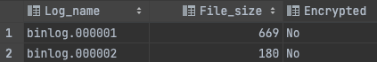

# 7장 데이터 암호화

- 5.7 버전부터 지원하였다. 처음에는 데이터 파일(테이블스페이스)에 대해서만 암호화기능이 제공됐으나 
8.0 버전부터는 리두로그, 언두로그, 바이너리 로그 등 모두 암호화 기능을 지원한다.
- 응용프로그램 암호화는 칼럼단위 (주요정보), 데이어베이스 수준에서는 테이블 단위로 암호화를 적용한다.

## 7.1 MySQL 서버의 데이터 암호화

- 암복호화는 데이터베이스 서버와 디스크 사이의 데이터를 읽고 쓰는 지점에서 일어난다.
- MySQL 서버에서 디스크 입출력 이외의 부분에서는 암호화 처리가 전혀 필요하지 않다. 즉 InnoDB 스토리지 엔진의 I/O 레이어에서만 데이터의 암호화 및 복호화 과정이 실행된다.
- 데이터 암호화 기능이 활성화돼 있다고 하더라도 MySQL 내부와 사용자 입장에서는 아무런 차이가 없다.
이러한 암호화 방식을 TDE(Transparent Data Encryption)이라고 한다.

### 7.1.1 2단계 키 관리

- 암호화 키는 키링 플러그인에 의해 관리된다.
    - `keyring_file` File-Based 플러그인
    - `keyring_encrypted_file` Keyring 플러그인 (only enterprise)
    - `keyring_okv` KMIP 플러그인 (only enterprise)
    - `keyring_aws` Amazon Web Service Keyring 플러그인 (only enterprise)
    
    
    
- 마스터 키와 테이블스페이스 키 두가지 종류의 키를 가지고 있다.
- 외부키 솔루션 또는 디스크 파일에서 마스터 키를 가져오고, 암호화된 테이블이 생성될 때마다 해당 테이블을 위한 임의의 테이블스페이스 키를 발급한다.
- 마스터 키를 이용해 테이블스페이스키를 암호화해서 각 테이블의 데이터 파일 헤더에 저장한다.
- 테이블스페이스 키는 절대 MySQL 서버 외부로 노출되지 않는다. (주기적 변경 불필요)
- 반면에 마스터 키는 외부의 파일을 이용하기 때문에 노출될 가능성이 있다. (주기적 변경이 필요)
    
    ```sql
    ALTER INSTANCE ROTATE INNODB MASTER_KEY;
    ```
    
- 마스터 키를 변경하면 MySQL 서버는 기존의 마스터 키를 이용해 각 테이블스페이스 키를 복호화한 다음 새로운 마스터 키로 다시 암호화 한다.
- MySQL서버에서 이렇게 2단계 암호화 방식을 사용하는 이유는 암호화 키 변경으로 인한 과도한 시스템 부하를 피하기 위해서이다.
- MySQL 서버의 TDE에서 지원되는 암호화 알고리즘은 AES 256비트이다.

### 7.1.2 암호화의 성능

- 디스크로부터 한번 읽은 데이터 페이지는 복호화되어 InnoDB의 버퍼 풀에 적재 된다.
그래서 데이터 페이지가 한 번 메모리에 적재되면 암호화되지 않은 테이블과 동일한 성능을 보인다.
- 하지만 쿼리가 InnoDB 버퍼 풀에 존재하지 않는 데이터 페이지를 읽어야 하는 경우에는 복호화 과정을 거치기 때문에 복호화 시간 동안 쿼리 처리가 지연될 것이다.
- 디스크에 저장할때도 시간이 더 걸리는데, 데이터 페이지 저장은 사용자 쿼리를 처리하는 스레드가 아닌 백그라운드 스레드에서 실행되기 때문에 사용자 쿼리가 지연되는 것은 아니다.
- 데이터 페이지는 암호화 키보다 훨씬 크기 때문에 암호화 결과는 평문의 결과와 동일한 크기의 암호문을 반환한다.
- 암호화한다고 해서 InnoDB 버퍼 풀의 효율이 달라지거나 메모리 사용 효율이 떨어지는 현상은 발생하지 않는다.

## 7.2 keyring_file 플러그인 설치

## 7.3 테이블 암호화

- 키링 플러그인은 마스터 키를 생성하고 관리하는 부분까지만 담당하기 때문에 어떤 키링 플러그인을 사용하든 관계없이 암호화된 테이블을 생성하고 활용하는 방법은 모두 동일하다.

### 7.3.1 테이블 생성

- 일반적인 테이블 생성 구문과 동일하며 마지막에 `ENCRYPTION=’Y’` 옵션만 추가로 넣으면 된다.
- MySQL 서버에서 암호화된 테이블만 검색할 때는 `information_schema`의 `TABLES` 뷰를 이용한다.
- MySQL 서버의 모든 테이블에 대해 암호화를 적용하고자 한다면 `default_table_encryption` 시스템 변수를 ON으로 설정하면 ENCRYPTION 옵션을 별도로 설정하지 않아도 암호화된 테이블로 생성된다.

### 7.3.2 응용 프로그램 암호화와의 비교

- 응용 프로그램에서 직접 암호화하는 경우 저장되는 컬럼의 값이 이미 암호화된 것인지 여부를 MySQL 서버는 인지하지 못한다.
- 인덱스를 생성하더라도 인덱스의 기능을 100% 활용할 수 없다.
- 응용프로그램 암호화 vs MySQL 서버 의 암호화 중 선택해야한다면 고민할 필요 없이 MySQL 서버의 암호화 기능을 선택할 것을 권장한다.
- MySQL 암호화는 서버에 로그인시 모든 데이터를 평문으로 확인 가능하기 때문에 사용용도에 맞춰 적절히 암호화응용프로그램과 혼합해서 사용하는것이 좋다.

### 7.3.3 테이블 스페이스 이동

- 테이블 스페이스 이동 기능이 레코드를 덤프했다가 복구하는 방식보다 훨씬 효율적이고 빠르다.
- 암호화된 테이블의 경우 원본 MySQL 서버와 목적지 MySQL 서버의 암호화키(마스터키)가 다르기 때문에 하나 더 신경써야할 부분이 있다. 반드시 데이터 파일과 임시 마스터키가 저장된 *.cfp 파일을 함께 복사해야 한다.
    
    ```sql
    -- 테이블 스페이스 익스포트
    FLUSH TABLES source_table FOR EXPORT;
    ```
    

## 7.4 언두 로그 및 리두 로그 암호화

- 테이블의 암호화를 적용하더라도, 디스크로 저장되는 데이터만 암호화되고 서버의 메모리에 존재하는 데이터는 복호화된 평문으로관리되며, 이 평문 데이터가 테이블의 데이터 파일 이외의 디스크 파일로 기록되는 경우 여전히 평문으로 저장된다.
- MySQL 8.0.16 버전부터는 innodb_undo_log_encrypt 시스템 변수와 innodb_redo_log_encrypt 시스템 변수를 이용해 InnoDB 스토리지 엔진의 리두 로그와 언두 로그를 암호화된 상태로 저장할 수 있게 개선되었다.
- 실행중인 MySQL 서버에서 언두 로그나 리두 로그를 활성화한다고 하더라도 모든 리두 로그나 언두 로그의 데이터를 해당 시점에 한 번에 암호화해서 다시 저장할 수 없다.
- 그래서 MySQL 서버는 리두 로그나 언두 로그를 평문으로 저장하다가 암호화가 활성화되면 그때부터 생성되는 리두 로그나 언두 로그만 암호화해서 저장한다. 복호화의 경우도 마찬가지이다.
- 그래서 리두로그와 언두 로그는 암호화를 활성화했다가 비활성화했다고 해서 암호화 키가 필요 없어 지는 것은 아니다.
- 리두 로그와 언두 로그 데이터 모두 각각의 테이블스페이스 키로 암호화되고, 테이블스페이스 키는 다시 마스터 키로 암호화된다.

## 7.5 바이너리 로그 암호화

- 테이블 암호화가 적용돼도 바이너리 로그와 릴레이 로그 또한 리두 로그나 언두 로그처럼 평문을 저장한다.
- 리두,언두로그와 달리 바이너리 로그는 의도적으로 상당히 긴 시간동안 보관하는 서비스도 있기 때문에 바이너리 로그 파일의 암호화는 상황에 따라 중요도가 높아질 수도 있다.
- 바이너리 로그와 릴레이 로그는 디스크에 저장된 로그 파일에 대한 암호화만 담당한다.

### 7.5.1 바이너리 로그 암호화 키 관리


### 7.5.2 바이너리 로그 암호화 키 변경

```sql
-- 바이너리 로그 암호화 키 변경
ALTER INSTANCE ROTATE BINLOG MASTER KEY;

-- MySQL 서버의 바이너리 로그 파일 암호화 여부 (Encrypted 컬럼)
SHOW BINARY LOGS;
```



### 7.5.3 mysqlbinlog 도구 활용

- MySQL 서버에서는 트랜잭션의 내용을 추적하거나 백업 복구를 위해 암호화된 바이너리 로그를 평문으로 복호화 할 일이 자주 발생한다.
- 하지만 한번 바이너리 로그 파일이 암호화 되면 바이너리 로그 암호화 키가 없으면 복호화할 수 없다.
- 그런데 바이너리 로그 암호화 키는 MySQL 서버만 가지고 있어서 복호화가 불가능하다.
- 그나마 바이너리 로그 파일의 내용을 볼 수 있는 방법은 MySQL 서버를 통해 가져오는 방법이 유일하다.
- 로그 파일의 내용을 확인하려면, MySQL 서버가 해당 로그 파일을 가지고 있다는 가정 하에 mysqlbinlog 도구가 MySQL 서버에 접속해서 바이너리 로그를 가져오는 방법밖에 없다.
    
    ```bash
    mysqlbinlog --read-from-remote-server -uroot -p -vvv [로그파일명]
    ```