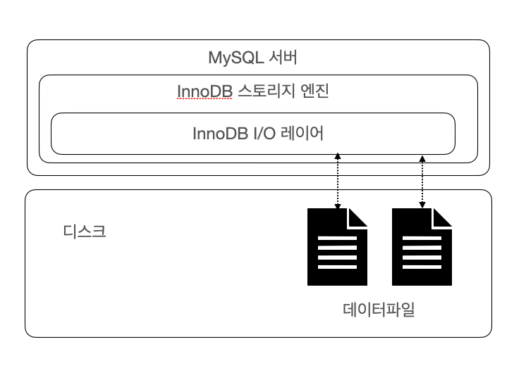
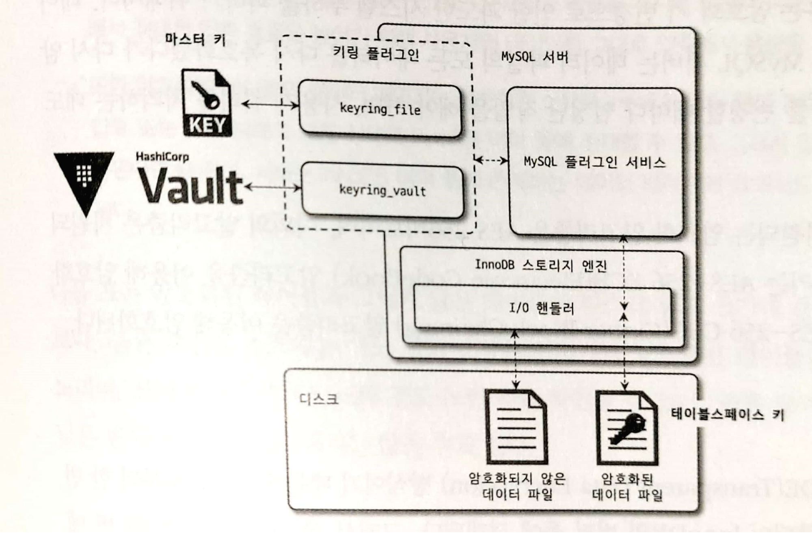
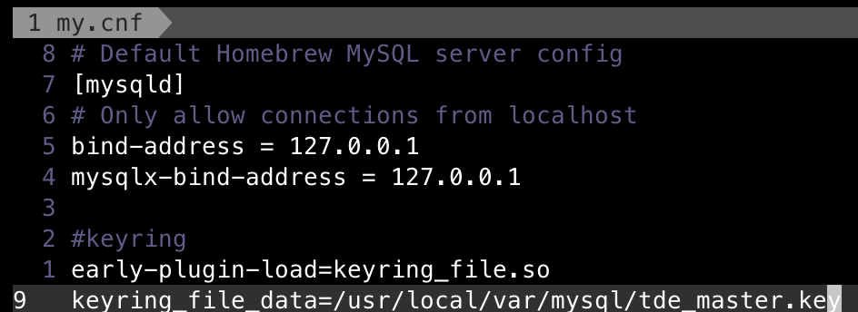
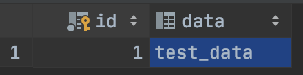
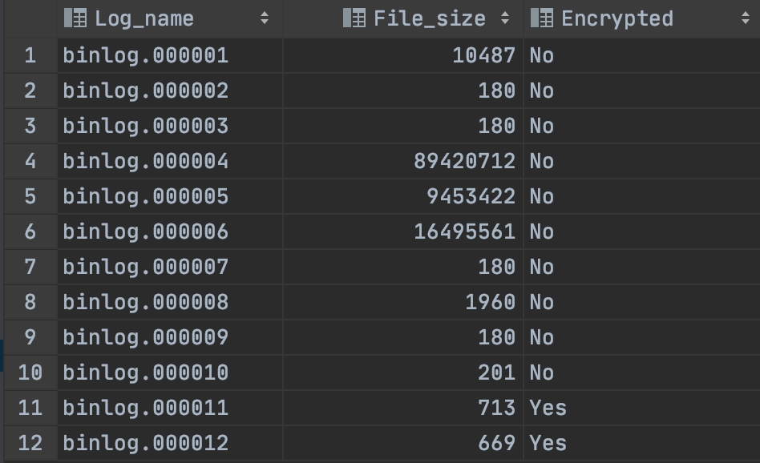
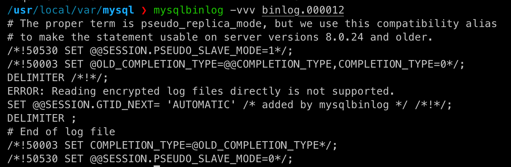
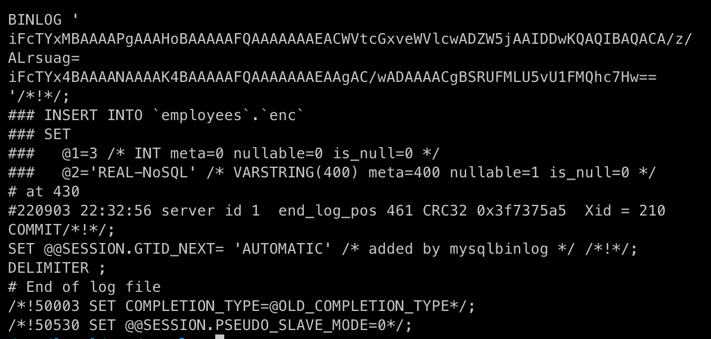

# 7장 데이터 암호화

- 8.0 버전부터 `데이터 파일` , `리두 로그` , `언두 로그` , `복제를 위한 바이너리 로그` 의 암호화를 지원한다

## 7.1 MySQL 서버의 데이터 암호화



- 데이터베이스 서버와 디스크 사이에서 데이터를 읽고 쓰는 지점에서 암/복호화를 수행한다.
- 암호화된 테이블과 그렇지 않은 테이블 모두 동일한 처리 과정을 거친다.
- 암호화 여부와 상관없이 사용자 입장에서는 아무런 차이가 없다
    - `TDE(Transparent Data Encryption)` 암호화 방식 ⇒ 디스크에 저장된 단계에서만 암호화

### 7.1.1 2단계 키 관리

- `TDE` 에서 암호화 키는 `키링(KeyRing) 플러그인`에 의해 관리된다
- 키링 플러그인
    - `keyring_file File-Based 플러그인` ⇒ 커뮤니티 에디션 지원
    - `keyring_encrypted_file Keyring 플러그인` ⇒ 엔터프라이즈 에디션 지원
    - `keyring_okv KMIP 플러그인` ⇒ 엔터프라이즈 에디션 지원
    - `keyring_aws Amazon Web Services Keyring 플러그인` ⇒ 엔터프라이즈 에디션 지원
- 2단계 키 관리 방식
    
    
    
    - `마스터 키`
        - 외부의 파일을 이용하기 때문에 노출될 가능성이 있다
        - 주기적으로 변경해야 한다
            
            ```sql
            ALTER INSTANCE ROTATE INNODB MASTER KEY;
            ```
            
        - 마스터 키가 변경되면 기존의 마스터 키를 이용해 각 테이블스페이스 키를 복호화한 다음 새로운 마스터 키로 다시 암호화한다
    - `테이블스페이스 키`
        - 프라이빗 키
        - 외부로 노출되지 않기 때문에 주기적으로 변경하지 않아도 보안상 취약하지 않음
        - `AES-256 ECB(Electronic CodeBook) 알고리즘` 을 사용한다
            - 실제 데이터 파일은 `AES-256 CBC(Cipher Block Chaining) 알고리즘` 을 이용하여 암호화

### 7.1.2 암호화의 성능

- TDE 암호화 방식으로 디스크로부터 한 번 읽은 데이터 페이지는 복호화되어 InnoDB의 버퍼 풀에 적재된다
- 데이터 페이지가 한 번 메모리에 적재되면 암호화되지 않은 테이블과 동일한 성능을 보인다
- 존재하지 않은 데이터 페이지를 읽을 경우 복호화 과정을 거치기 때문에 복호화 시간 동안 쿼리가 지연된다
- `AES(Advanced Encryption Standard) 암호화 알고리즘` 의  사용으로 데이터 파일의 크기는 암호화되지 않은 테이블과 동일한 크기를 가진다
- **암호화와 압축이 동시에 적용되는 경우**
    - 암호화 결과는 랜덤 바이트 배열로 압축률을 상당히 떨어뜨린다
        - 사용자 데이터를 그대로 압축하여 용량을 최소화한 후 암호화를 적용한다
    - 암호화된 테이블의 데이터 페이지는 복호화 상태로 InnoDB 버퍼풀에 저장, 압축된 데이터 페이지는 압축 또는 압축 해제의 모든 상태로 버퍼풀에 존재할 수 있다
        - 암호화가 먼저 실행되고 압축이 적용되면 버퍼풀에 존재하는 데이터 페이지도 매번 암복호화를 수행
    - 암호화된 테이블은 읽기 쓰기 평균 시간이 더 오래 걸린다
- **디스크 읽고 쓰기 속도 확인 방법**
    
    ```sql
    SELECT (SUM(SUM_TIMER_READ)/ SUM(COUNT_READ))/1000000000 as avg_read_latency_ms,
           (SUM(SUM_TIMER_WRITE)/ SUM(COUNT_WRITE))/1000000000 as avg_write_latency_ms
      FROM performance_schema.file_summary_by_instance
     WHERE file_name LIKE '%DB_NAME/TABLE_NAME%'
    ```
    

### 7.1.3 암호화와 복제

- TDE를 이용한 암호화 사용 시 레플리카 서버의 마스터 키와 테이블스페이스 키는 원본 서버와 동일하지 않다
- MySQL 서버의 모든 노드는 각자의 마스터 키를 할당해야 한다
- 마스터 키 로테이션을 실행하면 소스 서버와 레플리카 서버가 각각 다른 마스터 키를 새로 발급받는다

## 7.2 keyring_file 플러그인 설치

- keyring_file 플러그인은 마스터 키를 암호화하지 않은 상태의 평문으로 로컬 디스크에 저장 ⇒ 보안 취약함
- TDE 플러그인의 경우 MySQL 서버가 시작되는 단계에서 가장 빨리 초기화돼야 한다




- 플러그인이 초기화되면 해당 경로에 빈 파일을 생성한다
- 데이터 암호화 기능을 사용하는 테이블을 생성하거나 마스터 로테이션을 실행하면 마스터키가 초기화된다

```sql
ALTER INSTANCE ROTATE INNODB MASTER KEY;
```


## 7.3 테이블 암호화

### 7.3.1 테이블 생성

```sql
CREATE TABLE tab_encrypted (
    id INT,
    data VARCHAR(100),
    PRIMARY KEY(id)
) ENCRYPTION ='Y';

SELECT *
   FROM tab_encrypted;
```



```sql
SELECT table_schema, table_name, create_options
  FROM information_schema.TABLES
 WHERE TABLE_NAME = 'tab_encrypted';
```


### 7.3.2 응용 프로그램 암호와와의 비교

- 응용 프로그램의 암호화는 암호화 이전의 값을 기준으로 정렬할 수 없다
    - MySQL 서버의 암호화 기능(TDE)를 이용하면 위와 같은 제약 사항이 없다
- 응용 프로그램 암호화는 평문 내용을 확인할 수 없으나 서버 암호화는 그렇지 않다
- 혼합해서 사용하면 더 안전한 서비스를 구축할 수 있다

### 7.3.3 테이블스페이스 이동

- 테이블을 다른 서버로 복사하는 경우 또는 특정 테이블 데이터 파일만 백업했다가 복구하는 경우 사용한다
    - 레코드 덤프했다가 복구하는 방식보다 훨씬 효율적이고 빠르다
- 원본 MySQL 서버와 목적지 MySQL 서버의 암호화 키가 다르기 때문에 신경써야 한다

```sql
FLUSH TABLES source_table FOR EXPORT;
```

- 암호화되지 않은 테이블의 테이블스페이스 복사 과정
    1. 저장되지 않은 변경 사항을 모두 디스크로 기록하고 테이블을 잠근다
    2. 테이블 구조를 `테이블명.cfg` 파일로 기록해둔다
    3. `테이블명.ibd` 파일과 `테이블명.cfg` 파일을 목적지 서버로 복사한다
    4. 복사가 완료되면 UNLOCK TABLES 명령으로 락을 해제한다
- 암호화된 테이블의 테이블스페이스 복사 과정
    1. 임시로 사용할 마스터 키를 발급하여 `테이블명.cfp` 파일로 기록한다
    2. 암호화된 테이블스페이스 키를 기존 마스터 키로 복호화 후  임시 발급 마스터 키로 암호화한다
        - 암호화된 테이블의 경우 데이터 파일과 임시 마스터 키가 저장된 *.cfp 파일을 함께 복사해야 한다

## 7.4 언두 로그 및 리두 로그 암호화

- 테이블 암호화를 적용하더라도 `디스크로 저장되는 데이터만` 암호화된다
    - 서버 메모리에 존재하는 데이터는 복호화된 평문으로 관리된다
        - `리두 로그`, `언두 로그`, `복제를 위한 바이너리 로그`
- 암호화가 활성화되면 그때부터 생성되는 `리두 로그` 나 `언두 로그` 만 암호화해서 저장한다
    - 암호화가 비활성화된 경우 그때부터 저장되는 로그만 평문으로 저장한다
- 리두로그와 언두 로그 데이터 모두 각각의 테이블스페이스 키로 암호화되고 테이블 스페이스 키는 마스터 키로 암호화된다
- **리두 로그 암호화 확인 방법**

```sql
SHOW GLOBAL VARIABLES LIKE 'innodb_redo_log_encrypt';

INSERT INTO enc values (1, 'REAL-MySQL');

SET GLOBAL innodb_redo_log_encrypt=ON;

INSERT INTO enc values (2, 'REAL-MongoDB');
```


## 7.5 바이너리 로그 암호화

### 7.5.1 바이너리 로그 암호화 키 관리

- `2단계 암호화 키 방식`을 사용한다
- 바이너리 로그 와 릴레이 로그 파일의 데이터는 파일 키(File Key)로 암호화해서 디스크로 저장한다
- `바이너리 로그 암호화 키` 는 테이블의 암호화의 마스터 키와 동일한 역할을 한다

### 7.5.2 바이너리 로그 암호화 키 변경

```sql
SET GLOBAL binlog_encryption = ON;
ALTER INSTANCE ROTATE BINLOG MASTER KEY;
```

- **바이너리 로그 암호화 키 변경 과정**
    1. 증가 시퀀스 번호와 함께 새 바이너리 로그 암호화 키 발급 후 키링 파일에 저장
    2. 바이너리 로그 파일과 릴레이 로그 파일을 스위치한다(새로운 로그 파일로 로테이션)
    3. 새로 생성되는 바이너리 로그와 릴레이 로그 파일의 암호화를 위해 파일 키를 생성한다
        - 파일 키는 바이너리 로그 파일 키로 암호화해서 각 로그 파일에 저장된다
    4. 기존 바이너리 로그와 릴레이 로그 파일의 파일 키를 읽어서 새로운 바이너리 로그 파일 키로 암호화
        - 암호화되지 않은 로그 파일은 무시한다
    5. 모든 바이너리 로그와 릴레이 로그 파일이 새로운 바이너리 로그 암호화 키로 다시 암호화됐다면 기존 바이너리 로그 암호화 키를 키링 파일에서 제거한다
- **바이너리 로그 암호 여부 확인**

```sql
SHOW BINARY LOGS;
```



### 7.5.3 mysqlbinlog 도구 활용

```bash
mysqlbinlog -vvv binlog.000012
```



- 바이너리 로그 파일이 암호화되면 바이너리 로그 암호화 키가 없으면 복호화할 수 없다
- 바이너리 로그 암호화 키는 MySQL 서버만 가지고 있어서 복호화가 불가능하다

```bash
mysqlbinlog --read-from-remote-server -uroot -p -vvv binlog.000012
```



- `read-from-remote-server` 옵션으로 바이너리 로그의 내용을 볼 수 있다