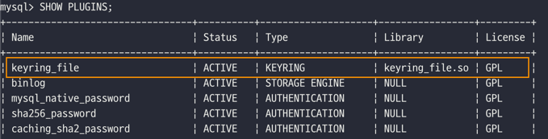
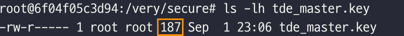
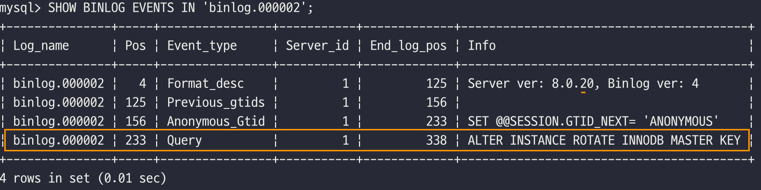
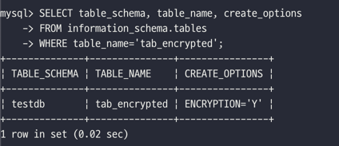
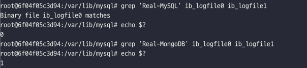
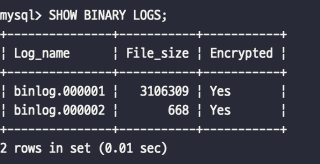
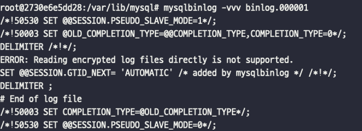
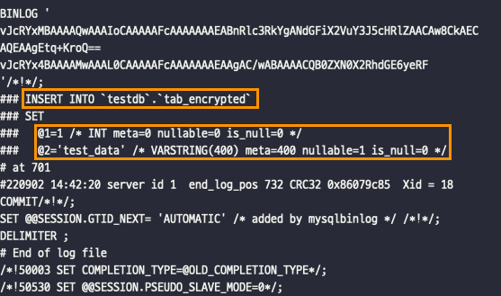

# 7장. 데이터 암호화

[MySQL 8.0 Reference Manual](https://dev.mysql.com/doc/refman/8.0/en/)

[1. MySQL 서버의 데이터 암호화](#1-mysql-서버의-데이터-암호화)  
[2. keyring_file 플러그인 설치](#2-keyring_file-플러그인-설치)  
[3. 테이블 암호화](#3-테이블-암호화)  
[4. 언두 로그 및 리두 로그 암호화](#4-언두-로그-및-리두-로그-암호화)  
[5. 바이너리 로그 암호화](#5-바이너리-로그-암호화)

## 1. MySQL 서버의 데이터 암호화

- MySQL5.7 버전부터 암호화를 지원
    - 데이터 파일(테이블스페이스)에 대해서만 암호화
- MySQL8.0 버전
    - 데이터 파일(테이블스페이스)에 대해서만 암호화
    - 리두 로그, 언두 로그 암호화
    - 복제를 위한 바이너리 로그 암호화

#### 데이터 암호화의 필요성

- 데이터 암호화 여부는 보안 감사에서 필수적으로 언급된다.
- 중요한 정보를 저장하는 서비스에서는 응용 프로그램에서 암호화한 데이터를 DB 서버에서 다시 암호화 하는 이중 암호화를 선택하기도 한다. (e.g. 핀테크)
- **응용 프로그램의 암호화는 주요 정보를 가진 컬럼 단위이지만, DB 수준에서는 테이블 단위로 암호화를 적용한다.**

#### TDE (Transparent Data Encryption) (= Data at Rest Encryption)

- MySQL 서버의 암호화 기능은 데이터베이스 서버와 디스크 사이의 데이터를 읽고 쓰는 지점에서 암호화 또는 복호화를 수행한다.  
  **→ MySQL 서버의 I/O 레이어에서만 데이터의 암호화 및 복호화 과정이 실행된다.**
- 따라서 쿼리를 처리하는 과정에서 테이블이 암호화 되어 있는지 여부는 식별할 필요가 없다.

### 2 단계 키 관리

- TDE에서 암호화는 키링(KeyRing) 플러그인에 의해 관리된다.
- MySQL8.0 버전에서 다양한 키링 플러그인이 제공되며, 마스터 키를 관리하는 방식이 다를 뿐 내부적으로 작동하는 방식은 모두 동일하다.
    - keyring_file File-Based 플러그인 _(→ 커뮤니티 에디션에서 사용 가능)_
    - keyring_encrypted_file Keyring 플러그인
    - keyring_okv KMIP 플러그인
    - keyring_aws Amazon Web Services Keyring 플러그인

- 키링 플러그인은 2단계 키 관리 방식을 사용한다.
    - MySQL 서버의 데이터 암호화는 두 가지 종류의 키를 가지고 있다.
        - 마스터 키(master key)
        - 테이블스페이스 키(tablespace key) = 프라이빗 키(private key)
    - MySQL 서버는 HashiCorp Vault 같은 외부 키 관리 솔루션(KMS) 또는 디스크의 파일에서 마스터 키를 가져오고, 암호화된 테이블이 생성될 때마다 해당 테이블을 위한 임의의 테이블스페이스
      키를 발급한다.
    - 마스터 키를 이용해 테이블스페이스 키를 암호화해서 각 테이블의 데이터 파일 헤더에 저장한다.
    - 이렇게 생성된 테이블스페이스 키는 테이블이 삭제되지 않는 이상 절대 변경되지 않는다.
    - 테이블스페이스 키는 MySQL 서버 외부로 노출되지 않기 때문에 주기적으로 변경하지 않아도 보안상 취약점이 되지 않는다.
    - 하지만 **마스터 키는 외부의 파일을 이용하기 때문에 노출될 가능성이 있으므로 주기적인 변경이 필요하다.**

    ```sql
    ALTER INSTANCE ROTATE INNODB MASTER KEY;
    ```

    - 마스터 키를 변경하면 MySQL 서버는 기존의 마스터 키를 이용해 각 테이블의 테이블스페이스 키를 복호화한 다음 새로운 마스터 키로 다시 암호화한다.
    - 마스터 키가 변경되는 동안 MySQL 서버의 테이블스페이스 키 자체와 데이터 파일의 데이터는 전혀 변경되지 않는다.
    - **2단계 암호화 방식을 사용하는 이유는 키 변경으로 인한 과도한 시스템 부하를 피하기 위해서이다.**  
      (만약 테이블스페이스 키가 변경된다면 MySQL 서버는 데이터 파일의 모든 데이터를 다시 복호화했다가 암호화해야 한다.)

- TDE에서 지원되는 암호화 알고리즘은 AES 256 비트이며, 이외의 알고리즘은 지원되지 않는다.

### 암호화와 성능

- TDE 방식의 암호화를 사용하면 디스크로부터 한 번 읽은 데이터 페이지는 복호화되어 InnoDB의 버퍼 풀에 적재되고, **메모리에 적재되면 암호화되지 않은 테이블과 동일한 성능을 보인다.**
- InnoDB 버퍼풀에 존재하지 않는 데이터 페이지를 읽어야 하는 경우에는 복호화 과정을 거치기 때문에 복호화 시간 동안 쿼리 처리가 지연된다.
- 또한, 암호화된 테이블이 변경되면 디스크로 동기화될 때 암호화되어야 하기 때문에 추가로 시간이 더 걸린다.
- 하지만 **데이터 페이지 저장은 사용자의 쿼리를 처리하는 스레드가 아닌 MySQL 서버의 백그라운드 스레드가 수행하기 때문에 실제 사용자 쿼리가 지연되는 것은 아니다.**
- 일반적으로 데이터 페이지가 암호화 키보다 훨씬 크기 때문에 AES 암호화 알고리즘을 사용하더라도 암호화 결과와 평문의 크기가 동일하다.  
  ➡️ **암호화 한다고 해서 InnoDB 버퍼 풀의 효율이 달라지거나 메모리 사용 효율이 떨어지는 현상은 발생하지 않는다.**

#### 암호화와 압축

- 같은 테이블에 대해 암호화와 압축이 동시에 적용되면 MySQL 서버는 압축을 먼저 실행하고 암호화를 적용한다.
    - 암호화된 결과문은 랜덤한 바이트 배열을 가지게 되는데, 이는 압축률을 상당히 떨어뜨린다.
    - 압축된 데이터 페이지는 모든 상태(압축, 압축 해제)로 InnoDB 버퍼 풀에 존재할 수 있지만, 암호화된 테이블의 데이터 페이지는 복호화된 상태로만 버퍼 풀에 존재할 수 있다.

#### 성능 측정

- 디스크에 읽고 쓰는데 걸리는 평균 시간을 비교해보면, 암호화된 테이블은 암호화 되지 않은 테이블에 비해 읽기의 경우 3~5배, 쓰기의 경우 5~6배 느리다.

```sql
-- 암호화된 테이블의 일고 쓰기 성능 조회
SELECT (SUM(SUM_TIMER_READ) / SUM(COUNT_READ)) / 1000000000   AS avg_read_latency_ms,
       (SUM(SUM_TIMER_WRITE) / SUM(COUNT_WRITE)) / 1000000000 AS avg_write_latency_ms
FROM performance_schema.file_summary_by_instance
WHERE file_name LIKE '%DB_NAME/TABLE_NAME%';
```

### 암호화와 복제

- 마스터 키와 테이블스페이스 키는 레플리카 서버로 복제되지 않는다.
- 따라서 **소스 서버와 레플리카 서버는 서로 각자의 마스터 키와 테이블스페이스 키를 관리해야 한다.**
- 그래서 소스 서버와 레플리카 서버의 암호화 전 데이터 파일이 동일하더라도 실제 암호화된 데이터 파일의 내용은 완전히 달라진다.

#### 마스터 키 변경

- 소스 서버의 마스터 키를 변경할 때, 명령어 자체는 레플리카 서버로 복제되지만 실제 소스 서버의 마스터 키가 레플리카 서버로 전달되는 것은 아니다.
- 마스터 키 로테이션 명령을 실행하면 소스 서버와 레플리카 서버가 각각 서로 다른 마스터 키를 새로 발급받는다.
- 또한, **MySQL 서버를 백업 할 때 TDE의 키링을 백업하지 않으면 데이터를 복구할 수 없게 된다.**
- 보안을 위해 키링 파일을 데이터 파일과 별도로 보관하는 것을 권장하지만, 마스터 키가 주기적으로 변경될 수 있기 때문에 데이터 복구를 감안해서 결정해야 한다.

## 2. keyring_file 플러그인 설치

- TDE의 암호화 키 관리는 플로그인 방식으로 제공되는데, MySQL 커뮤니티 에디션에서는 keyring_file 플러그인만 사용할 수 있다.
- keyring_file 플러그인은 테이블스페이스 키를 암호화하기 위한 마스터 키를 관리한다.
    - 마스터 키는 평문으로 디스크에 저장되므로 노출되지 않도록 주의해야 한다.
    - 그래서 MySQL 서버가 시작될 때만 키링 파일을 다른 서버로부터 다운로드해서 로컬 디스크에 저장하는 방법을 고려해볼 수 있다. 
    - MySQL 서버가 시작되면 마스터 키를 메모리에 캐시하기 때문에 디스크에서 키링 파일을 삭제해도 동작하는데 문제가 없다.
    - 다만, 마스터 키를 로테이션하는 경우에는 로컬의 키링 파일이 최신이 되므로 다시 외부 서버에 복사해둬야 한다.
- 또한, Percora Server에서 [HashiCorp Vault](https://www.vaultproject.io)를 연동하는 키 관리 플러그인을 오픈소스로 제공한다.

#### keyring_file 플러그인 설정 

- `early-plugin-load` : keyring_file 플러그인을 위한 라이브러리 명시 (`keyring_file.so`)
- `keyring_file_data` : 마스터 키를 저장할 키링 파일 경로 설정. 오직 하나의 MySQL 서버만 참조해야 함.
    
    ```text
    ## my.cnf
    early-plugin-load=keyring_file.so
    keyring_file_data=/very/secure/tde_master.key
    ```
    - keyring_file 플러그인 조회
    
      
    
    - 플러그인 초기화 상태에서는 마스터 키를 사용한 적이 없기 때문에 실제 키링 파일의 내용은 비어있다.
      ```bash
      linux> ls -lh tde_master.key
      ```
      
    
    - 데이터 암호화를 사용하는 테이블을 생성하거나, 마스터 키 로테이션을 실행하면 마스터 키가 초기화 된다.
      ```sql
      ALTER INSTANCE ROTATE INNODB MASTER KEY;
      ```
      

    - 마스터 키 로테이션을 실행하면 Event_type 이 쿼리이다. 
    - 이는 SQL 문장이 레플리카 서버로 전달되지만, 마스터 키 값은 바이너리 로그로 전달되지 않음을 의미한다.
      ```sql
      SHOW BINLOG EVENTS IN 'binlog.000002';
      ```
      
    
## 3. 테이블 암호화

- 어떤 키링 플러그인을 사용하는지 관계없이 암호화된 테이블을 생성하고 활용하는 방법은 모두 동일하다. 

### 테이블 생성

- 암호화된 테이블을 생성하는 방법은 `ENCRYPTION='Y'` 옵션만 추가하면 된다.
- 암호화된 테이블의 데이터가 디스크에 기록될 때 데이터가 자동으로 암호화되어 저장되고, 디스크에서 메모리로 읽어올 때 복호화된다.
- `default_table_encryption` 변수를 `ON`으로 설정하면 ENCRYPTION 옵션을 별도로 설정하지 않아도 암호화된 테이블로 생성된다.

```sql
CREATE TABLE tab_encrypted(
    id INT,
    data VARCHAR(100),
    PRIMARY KEY (id)
) ENCRYPTION='Y';

INSERT INTO tab_encrypted VALUES (1, 'test_data');

SELECT * FROM tab_encrypted;

SELECT table_schema, table_name, create_options
FROM information_schema.tables
WHERE table_name='tab_encrypted';
```


### 응용 프로그램 암호화와의 비교

- 응용 프로그램에서 암호화해서 저장하더라도 MySQL 서버는 암호화 여부를 인지하지 못한다.
- 그래서 암호화된 컬럼은 인덱스를 생성하더라도 인덱스 기능을 100% 활용할 수 없다.
    
    ```sql
    CREATE TABLE app_user(
        id BIGINT,
        enc_birth_year VARCHAR(50), /* 응용 프로그램에서 미리 암호화해서 저장된 컬럼 */
        PRIMARY KEY (id),
        INDEX ix_birthyear (enc_birth_year)
    );
    
    -- 동일 값 검색 쿼리에서 인덱스 사용 가능
    SELECT * FROM app_user WHERE enc_birth_year = #{encryptedYear}
    -- 이미 암호화된 값이기 때문에 범위 검색을 제대로 사용할 수 없음 
    SELECT * FROM app_user WHERE enc_birth_year BETWEEN #{encryptedMinYear} AND #{encryptedMaxYear}
    -- 이미 암호화된 값이기 때문에 정렬을 제대로 사용할 수 없음
    SELECT * FROM app_user ORDER BY enc_birth_year LIMIT 10;
    ```
    
  - 위의 예제 처럼 응용 프로그램에서 암호화 하면, MySQL은 암호화되기 전의 값을 기준으로 범위 검색이나 정렬을 할 수 없다.
  - 하지만 MySQL의 암호화 기능(TDE)을 사용하면, MySQL 서버는 인덱스 관련 작업을 모두 처리한 후 암호화하기 때문에 이 같은 제약이 없다.
- **응용 프로그램의 암호화와 MySQL 서버의 암호화 기능 중 선택해야 하는 상황이라면 MySQL 서버의 암호화 기능을 선택할 것을 권장한다.**
- 단, MySQL의 암호화만 사용하면 MySQL 로그인 시 모든 데이터를 평문으로 확인할 수 있으므로, 더 안전한 서비스를 구축하고자 한다면 응용 프로그램에서의 암호화를 혼합해서 사용해야 한다. 

### 테이블스페이스 이동

- 테이블스페이스 이동(Export&Import) 기능이 레코드를 덤프했다가 복구하는 방식보다 훨씬 효율적이고 빠르다.
    - e.g. 테이블을 다른 서버로 복사, 특정 테이블의 데이터 파일만 백업 및 복구
- 암호화된 테이블의 경우 원본 서버와 목적지 서버의 마스터 키가 다르기 때문에 `FLUSH TABLES` 명령을 실행해야 한다. 
    - 일반적인 테이블스페이스 Export  
      ```text
      ① 소스 테이블의 저장되지 않은 변경 사항을 모두 디스크에 기록 
      ② 소스 테이블에 접근할 수 없도록 잠금  
      ③ 소스 테이블의 구조를 source_table.cfg 파일로 기록  
      ④ source_table.ibt 파일과 source_table.cfg 파일을 목적지 서버로 복사  
      ⑤ 복사가 완료되면 소스 테이블의 잠금 해제
      ```
    - 암호화된 테이블스페이스 Export  
      ```text
      ① FLUSH TABLES source_table FOR EXPORT 명령을 실행  
      ② 임시로 사용할 마스터 키를 발급해서 source_table.cfp 파일에 기록
      ③ 암호화된 테이블의 테이블스페이스 키를 기존 마스터 키로 복호화  
      ④ 임시로 발급한 마스터 키를 이용해 다시 암호화해서 데이터 파일의 헤더 부분에 저장  
      ⑤ 복사가 완료되면 소스 테이블의 잠금 해제
      ```  
      ➡️ 암호화된 테이블의 경우 테이블스페이스 이동 기능을 사용할 때 데이터 파일과 `*.cfp` 파일을 함께 복사해야 한다. 

## 4. 언두 로그 및 리두 로그 암호화

- MySQL 8.0.16 버전 이전에는 테이블에 암호화를 적용하더라도 데이터 파일 이외의 파일은 여전히 평문으로 저장되었다.
    - 리두 로그, 언두 로그, 바이너리 로그에는 평문 데이터가 노출되었다.
- MySQL 8.0.16 버전부터 `innodb_undo_log_encrypt`, `innodb_redo_log_encrypt` 변수를 이용해 언두 로그와 리두 로그도 암호화된 상태로 저장할 수 있게 되었다.

#### 암호화 적용 시점
- 테이블 암호화는 적용 시점과 상관없이 한 번 적용되면 모든 데이터가 암호화 된다.
- 하지만 리두 로그나 언두 로그는 암호화가 활성화 되는 시점부터 암호화 되고, 이전 로그는 평문 상태로 남아있게 된다.
- 마찬가지로 리두 로그나 언두 로그의 암호화를 비활성화 하더라도 이전 로그는 암호화 되어 있으므로 여전히 암호화 키가 필요할 수도 있다.

#### 리두 로그 암호화 예시
```sql
SHOW GLOBAL VARIABLES LIKE 'innodb_redo_log_encrypt'; /* OFF */

INSERT INTO tab_encrypted VALUES (1, 'Real-MySQL');

-- 리두 로그 암호화 설정 ON
SET GLOBAL innodb_redo_log_encrypt = ON;

INSERT INTO tab_encrypted VALUES (2, 'Real-MongoDB');
```

```bash
## grep 명령의 결과, 문자열이 존재하면 "matches"라는 메시지를 보여준다.
## 검색한 문자열이 존재한다면 grep 명령은 반환 값으로 "0"리턴한다.
linux> grep 'Real-MySQL' ib_logfile0 ib_logfile1
linux> echo $?

## grep 명령의 결과, 문자열이 존재하지 않으면 아무런 메시지를 출력하지 않는다.
## 검색한 문자열이 존재하지 않으면 grep 명령은 반환 값으로 "1"리턴한다.
linux> grep 'Real-MongoDB' ib_logfile0 ib_logfile1
linux> echo $?
```



## 5. 바이너리 로그 암호화

- 테이블 암호화가 적용되더라도 바이너리 로그와 릴레이 로그는 평문으로 저장된다.
    - 일반적으로 언두 로그와 리두 로그는 짧은 시간 동안 유지하기 때문에 보안에 민감하지 않을 수 있다. 
    - 하지만 바이너리 로그는 의도적으로 상당히 긴 시간 동안 보관하기도 하고, 증분 백업을 위해 보관하기도 한다.  
  \- cf. 바이너리 로그: 데이터베이스에 대한 모든 변경 사항(데이터 및 구조)과 각 명령문 실행 시간을 기록하는 로그  
  \- cf. 릴레이 로그: 레플리카 서버에서 바이너리 로그 역할을 하는 로그
- `binlog-encryption` 변수를 ON 으로 설정하면 바이너리 로그를 암호화 할 수 있다.
- 바이너리 로그와 릴레이 로그는 디스크에 저장된 파일에만 암호화가 적용되고, 네트워크 구간에서는 데이터를 암호화하지는 않는다.
- 복제 멤버 간의 네트워크 구간에서도 바이너리 로그를 암호화하려면 복제를 위한 계정이 SSL을 사용하도록 설정하면 된다.

### 바이너리 로그 암호화 키 관리

- 바이너리 로그와 릴레이 로그 파일의 데이터 암호화를 위해서도 2단계 암호화 키 관리 방식을 사용한다.
- 바이너리 로그 암호화 키는 마스터 키와 동일한 역할을 하고, 파일 키는 테이블스페이스 키와 동일한 역할을 한다.
    - 바이너리 로그와 릴레이 로그 파일의 데이터는 파일 키로 암호화해서 디스크에 저장한다.
    - 파일 키는 바이너리 로그 암호화 키로 암호화해서 각 로그 파일의 헤더에 저장된다.

### 바이너리 로그 암호화 키 변경

- 바이너리 로그 암호화 키 변경 과정

    ```sql
    ALTER INSTANCE ROTATE BINLOG MASTER KEY;
    ```
    ```text
    ① 시퀀스 번호를 증가하여 새로운 바이너리 로그 암호화 키 발급 후 키링 파일에 저장  
    ② 바이너리 로그 파일과 릴레이 로그 파일 스위치 (새로운 로그 파일로 로테이션하기 위함)  
      - cf. 로그 스위치: FLUSH LOGS를 실행하여 MySQL 서버가 새 로그로 전환하도록 한다.
    ③ 암호화를 위해 새로운 파일 키를 생성, 파일 키는 새로운 바이너리 로그 파일 키로 암호화해서 각 로그 파일에 저장  
    ④ 기존의 파일 키를 읽어서 새로운 바이너리 로그 파일 키로 암호화해서 다시 저장   
    ⑤ 모든 바이너리 로그와 릴레이 로그 파일이 암호화되면 키링 파일에서 기존 바이너리 로그 암호화 키를 제거  
    ```
    - ④번 과정은 시간이 오래 걸릴 수 있는데, 이를 위해 키링 파일에서 바이너리 로그 암호화 키는 내부적으로 버전(시퀀스 번호) 관리가 이뤄진다.
    - 연속으로 바이너리 로그 키 로테이션이 실행되더라도 최근 순서대로 파일 키를 암호화해서 저장하는 작업을 수행한다.

- 바이너리 로그 파일 암호화 여부
    ```sql
    SHOW BINARY LOGS;
    ```
  

### mysqlbinlog 도구 활용

- MySQL 서버에서는 트랜잭션의 내용을 추적하거나 백업 복구를 위해 암호화된 바이너리 로그를 평문으로 복호화할 일이 자주 발생한다.
- 하지만 바이너리 로그 암호화 키는 MySQL 서버만 가지고 있어서 복호화가 불가능하다.
    - mysqlbinlog 도구를 이용해 암호화된 바이너리 로그 파일을 보려고하면 에러 메시지를 출력한다.
    ```bash
    linux> mysqlbinlog -vvv binlog.000002
    ```
      

- 그나마 바이너리 로그를 볼 수 있는 방법은 MySQL 서버를 통해 가져오는 방법이다.
    - mysqlbinlog 도구가 MySQL 서버에 접속해서 바이너리 로그를 가져오도록 한다.
    - mysqlbinlog 명령을 실행할 때 `--read-from-remote-server` 파라미터와 함께 서버 정보를 입력한다.
    ```bash
    linux> mysqlbinlog --read-from-remote-server -u chloe -p -vvv binlog.000002
    ```
    !

## Reference

- [[데이터베이스] binary log 란?](https://github.com/heesuk-ahn/today-I-learned/blob/master/database/binary-log.md)
- [The MySQL Log Files](https://www.oreilly.com/library/view/mysql-reference-manual/0596002653/ch04s09.html)