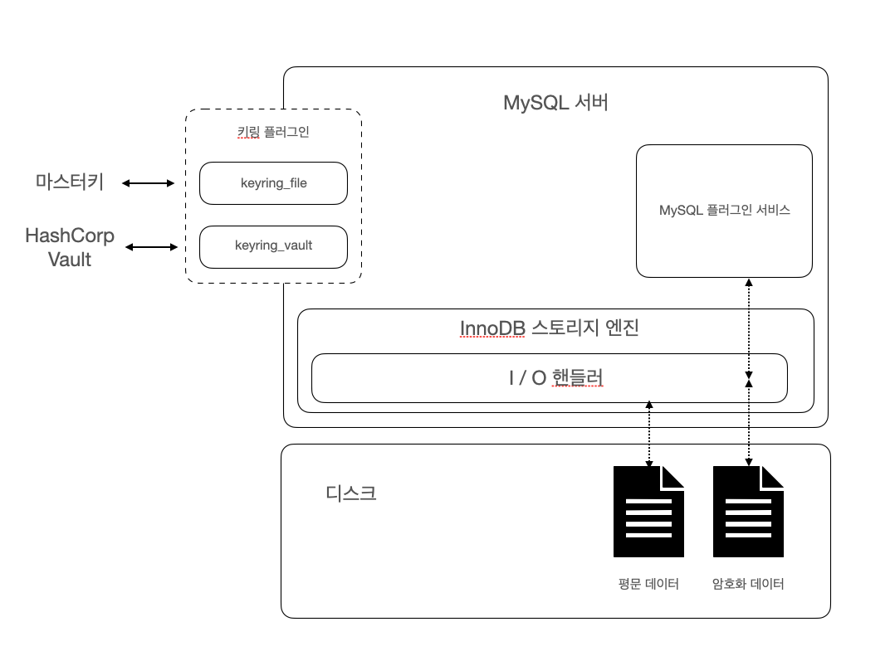
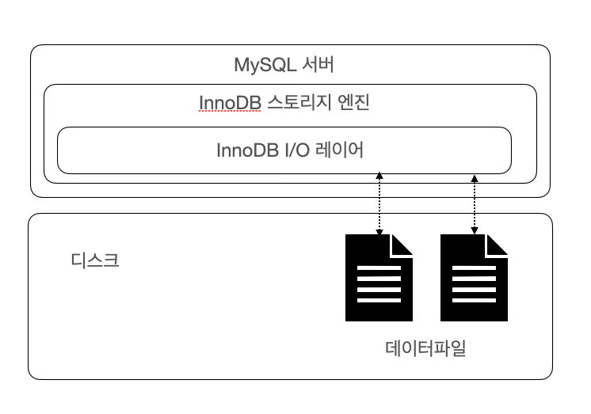

# 07. 데이터 암호화

MySQL 5.7 ~ 데이터 파일(테이블 스페이스)에 대해서만 암호화 기능 지원.
MySQL 8.0 ~ 데이터 파일, 언두 로그, 리두 로그, 복제를 위한 바이너리 로그 등 모두 암호화 기능 지원
→ 응용 프로그램 수준의 암호화 : 주요 정보를 가진 칼럼 단위로 암호화
    데이터베이스 수준의 암호화 : 테이블 단위로 암호화

## 7.1 MySQL 서버의 데이터 암호화

데이터베이스 서버와 디스크 사이의 데이터 읽기, 쓰기 지점에서 암호화 또는 복호화를 진행. `MySQL 서버의 I/O 레이어에서만 데이터의 암호화 및 복호화 과정이 실행 됨`



MySQL 서버에서는 `TDE(Transparent Data Encryption)` 암호화 방식을 지원 함. TDE는 `Data Rest Encryption` 이라고도 불리며, 메모리(In-Process)나 네트워크 전송(In-Transit) 단계가 아닌 디스크에 저장(At Rest)된 단계에서만 암호화된다는 의미로 사용.

### 7.1.1 2단계 키 관리

MySQL 서버의 TDE에서 암호화 키는 `키링(KeyRing) 플러그인`에 의해 관리 됨. 
MySQL 8.0 에서 지원하는 키링 플러그인은 총 4가지 이며, keyring_file 플러그인만 커뮤니티 버전에서 사용 가능

- `keyring_file File-Based 플러그인`
- keyring_encrypted_file Keyring 플러그인
- keyring_okv KMIP 플러그인
- keyring_aws Amazon Web Services Keyring 플러그인

다양한 플러그인들은 마스터 키를 관리하는 방법만 다를 뿐 MySQL 서버 내부적으로 작동하는 방식은 모두 동일 함. `MySQL 서버의 키링 플러그인은 2단계(2-Tier) 키 관리 방식을 사용`함.



- MySQL 서버의 데이터 암호화는 `마스터 키(master key)`와 `테이블스페이스 키(tablespace key, private key)` 두 가지 종류의 키를 가짐.
- MySQL 서버는 `외부 키 관리 솔루션(KMS, Key Management Service) 또는 디스크의 파일(keyring_file, ketring_encrypted_file 플러그인 사용 시) 에서 마스터 키를 가져오고, 암호화 된 테이블 생성 시마다 해당 테이블을 위한 임의 테이블스페이스 키를 발급`
- MySQL 서버는 `마스터 키 이용하여 테이블스페이스 키를 암호화해서 각 테이블의 데이터 파일 헤더에 저장`
- 생성된 `테이블스페이스 키는 테이블이 삭제되지 않은 이상 삭제되지 않음`
- `테이블스페이스 키는 절대 MySQL 서버 외부로 노출되지 않음` → 주기적으로 변경하지 않아도 보안상 취약점이 되지 않음
- 마스터 키는 외부 파일을 이용 → 노출될 가능성 있음 → 주기적 변경 필요
마스터 키 변경 시, MySQL 서버는 기존의 마스터 키를 이용해 각 테이블의 테이블 스페이스 키를 복호화한 다음 새로운 마스터 키로 다시 암호화 진행
    
    ```bash
    mysql> ALTER INSTANCE ROTATE INNODB MASTER KEY;
    ```
    
- MySQL 서버는 `암호화 키 변경으로 인한 과도환 시스템 부하를 피하기 위해 2단계 암호화 방식을 사용`
- TDE 암호화 알고리즘 : AES 256비트
테이블스페이스 키 : AES-256 ECB(Electronic CodeBook) 알고리즘 이용해 암호화
실제 데이터 파일 : AES-256 CBC(Cipher Block Chaining) 알고리즘 이용해 암호화

### 7.1.2 암호화와 성능

MySQL 서버는 `TDE(Transparent Data Encryption)` 방식

- 따라서 `디스크로부터 한번 읽은 데이터 페이지는 복호화 되어 InnoDB 버퍼 풀에 적재` 됨.
- 데이터 `페이지가 한 번 메모리에 적재되면 암호화되지 않은 테이블과 동일한 성능`을 보임.
- `InnoDB 버퍼 풀에 존재하지 않는 데이터 페이지 SELECT, UPDATE, DELETE 시, 복호화 과정을 거치는 시간 동안 쿼리 처리가 지연` 됨.
- 데이터 페이지 저장은 MySQL 서버의 백그라운드 스레드가 수행 → 실제 사용자 쿼리 지연 X
- `AES(Advanced Encryption Standard) 암호화 알고리즘은 암호화하고자 하는 평문의 길이가 짧은 경우 암호화 키의 크기에 따라 암호화된 결과의 용량이 더 커질 가능성 있음` → 데이터 페이지는 이미 암호화 키보다 훨씬 크기 때문에 암호화 한다고 해서  InnoDB 버퍼 풀의 효율이 달라지거나 메모리 효율이 떨어지는 현상은 발생하지 X
- 같은 테이블에 암호화와 압축이 동시에 적용되면 `MySQL 서버는 압축 → 암호화 순서로 적용`

### 7.1.3 암호화와 복제

MySQL 서버의 복제에서 레플리카 서버는 소스 서버의 모든 사용자 데이터를 동기화 하지만, `소스 서버와 레플리카 서버는 서로 각자의 마스터 키와 테이블스페이스 키를 관리하기 때문에 복제되어 암호화 된 데이터 결과물은 완전히 달라진다`. 마스터 키 변경 시 `ALTER INSTANCE ROTATE INNODB MASTER KEY` 명령어를 실행하면 되고, 해당 명령은 쿼리로 전달되기 때문에, `소스 서버의 마스터 키 값이 레플리카 서버로 전달되지는 않는다.`

## 7.2 keyring_file 플러그인 설치

- MySQL 서버에서는 `TDE의 암호화 키 관리는 플러그인 방식으로 제공.`
- keyring_file 플러그인은 테이블스페이스 키를 암호화하기 위한 마스터 키를 디스크 파일로 관리 → 마스터 키는 평문으로 디스크에 저장 → 보안에 취약
- TDE 플러그인은 MySQL 서버가 시작되는 단계에서도 가장 빨리 초기화해야 함
my.cnf 파일에서 정보 수정 후 서버 재시작하면 자동으로 keyring_file 플러그인이 초기화 됨.
플러그인 초기화 시 MySQL 서버는 플러그인의 초기화와 동시에 keyring_file_data 시스템 변수의 경로에 빈 파일을 생성 함.
    
    ```bash
    ## my.cnf
    early-plugin-load=keyring_file.so
    keyring_file_data=마스터키파일경로.key
    ```
    

## 7.3 테이블 암호화

### 7.3.1 테이블 생성

기본 테이블 생성 명령문에 `encrypted='Y'` 옵션을 추가하여 TDE를 이용하는 테이블을 생성함. tab_encrypted `테이블의 데이터가 디스크에 기록될 때는 데이터가 자동으로 암호화되어 저장되고, 디스크에서 메모리로 읽어올 때 복호화` 된다.

```sql
mysql> create table tab_encrypted(
					id int,
					data varchar(100),
					primary key(id)
			 ) encrypted='Y';
mysql> insert into tab_encrypted values(1, 'test_data');
mysql> select * from tab_encrypted;
```

MySQL 서버의 모든 테이블에 대해 암호화를 적용하려면 `default_table_encryption=ON` 시스템 변수 설정 시 자동으로 암호화 테이블로 생성 됨

### 7.3.2 응용 프로그램 암호화와의 비교

응용 프로그램에서 암호화 해서 MySQL 서버에 저장하는 경우 컬럼 값의 암호화 여부를 서버는 인지하지 못함. 따라서, 응용 프로그램에서 암호화 된 칼럼은 인덱스를 생성해도 100% 활용 불가
⇒ `MySQL 서버의 암호화 기능 사용하는 것을 권장`

### 7.3.3 테이블스페이스 이동

테이블스페이스 익스포트(Export) 시 FLUSH TABLES 명령어 사용.

```sql
mysql> FLUSH TABLES source_table FOR EXPORT;
```

FLUSH 명령 실행 시 MySQL 서버는 `암호화되지 않은 테이블스페이스의 복사`를 아래 과정으로 실행함.
1. source_table의 저장되지 않은 변경사항을 모두 디스크로 기록
2. source_table 잠금(더이상 접근 불가)
3. source_table 구조를 `source_table.cfg 파일로 기록`
4. `source_table.ibd, source_table.cfg 파일을 목적지 서버로 복사`
5. 복사 완료 시 `UNLOCK TABLES 명령어 실행하여 source_table 사용`하면 됨

`TDE로 암호화된 테이블`에서는
1. 임시로 사용할 마스터 키를 발급해서 `source_table.cfp` 파일로 기록
2. 암호화 된 테이블의 테이블스페이스 키를 기존 마스터 키로 복호화
3. `임시로 발급한 마스터 키를 이용해 다시 암호화 하여 데이터 파일의 헤더부분에 저장`

## 7.4 언두 로그 및 리두 로그 암호화

테이블의 암호화를 적용하더라도 디스크로 저장되는 데이터만 암호화되고 `MySQL 서버의 메모리에 존재하는 데이터는 복호화된 평문으로 관리`. 따라서, `리두 로그나 언두 로그, 복제를위한 바이너리 로그에는 평문으로 저장` 됨.

```sql
mysql> SHOW GLOBAL VARIABLES LIKE 'innodb_redo_log_encrypt';
mysql> INSERT INTO enc VALUES (1, 'Real-MySQL');

mysql> SET GLOBAL innodb_redo_log_encrypt=ON;
mysql> INSERT INTO enc VALUES (2, 'Real-MySQL');
```

- MySQL 8.0 ~ `innodb_undo_log_encrypt`, `innodb_redo_log_encrypted` 시스템 변수를 이용해 InnoDB 스토리지 엔진의 리두 로그와 언두 로그를 암호화된 상태로 저장 가능
- 리두 로그나 언두 로그를 평문으로 저장하다가 `암호화가 설정되면 그때부터 생성되는 리두 로그와 언두 로그만 암호화해서 저장` 함
- `리두 로그와 언두 로그 데이터 모두 각각의 테이블 스페이스 키로 암호화(=프라이빗 키, 실제 테이블의 암호화에 사용된 테이블스페이스 키 X)`
- 프라이빗 키는 마스터 키로 암호화되어 리두 로그 파일과 언두 로그 파일의 헤더에 저장 됨

## 7.5 바이너리 로그 암호화

`테이블 암호화가 적용돼도 바이너리 로그와 릴레이 로그 파일 또한 평문을 저장` 함. 바이너리 로그는 의도적으로 긴 시간 동안 보관하는 서비스도 있고, 증분 백업을 위해 바이너리 로그를 보관 하기도 하기때문에 암호화는 상황에 따라 중요도 높아질 가능성이 있음. 

바이너리 로그와 릴레이 로그 파일 암호화 기능은 디스크에 저장된 로그 파일에 대한 암호화만 담당하고, `MySQL 서버의 메모리 내부 또는 소스 서버와 레플리카 서버 간의 네트워크 구간에서 로그 데이터를 암호화 하지 않음`. → 네트워크 구간에서 바이너리 로그 암호화 하려면 MySQL 복제를 위한 계정이 SSL 사용하도록 설정

### 7.5.1 바이너리 로그 암호화 키 관리

바이너리 로그와 릴레이 로그 파일 데이터의 암호화도 `2단계 암호화 키 관리 방식`을 사용. `바이너리 로그와 릴레이 로그 파일의 데이터는 파일 키로 암호화 해서 디스크로 저장. 파일 키는 '바이너리 로그 암호화 키'로 암호화해서 각 바이너리 로그와 릴레이 로그 파일의 헤더에 저장`

### 7.5.2 바이너리 로그 암호화 키 변경

`ALTER INSTANCE ROTATE BINLOG MASTER KEY` 명령어 실행하여 바이너리 로그 암호화 키 변경 가능.

바이너리 로그 암호화 키 변경 시 다음과 같은 과정을 거침

1. 증가된 시퀀스 번호와 함께 새로운 바이너리 로그 암호화 키 발급 후 키링 파일에 저장
2. 바이너리 로그 파일과 릴레이 로그 파일 스위치(새로운 로그 파일로 로테이션)
3. 새로 생성되는 바이너리 로그와 릴레이 로그 파일의 암호화를 위해 파일 키를 생성.
파일 키는 바이너리 로그 파일키(마스터 키)로 암호화해서 각 로그 파일에 저장
4. 기존 바이너리 로그와 릴레이 로그 파일의 파일 키를 읽어서 새로운 바이너리 로그 파일 키로 
암호화한 후 다시 저장
5. 모든 바이너리 로그와 릴레이 로그 파일이 새로운 바이너리 로그 암호화 키로 다시 암호화 됐다면, 기존 바이너리 로그 암호화 키를 키링 파일에서 제거

MySQL 서버의 바이너리 로그 파일 암호화 여부는 아래와 같이 확인

```sql
mysql> show binary logs;
+---------------+-----------+-----------+
| Log_name      | File_size | Encrypted |
+---------------+-----------+-----------+
| binlog.000001 |   3025278 | No        |
| binlog.000002 |  89052657 | No        |
| binlog.000003 |      4038 | No        |
| binlog.000004 |      2682 | No        |
| binlog.000005 |       180 | No        |
| binlog.000006 |       180 | No        |
| binlog.000007 |       157 | No        |
+---------------+-----------+-----------+
7 rows in set (0.00 sec)
```