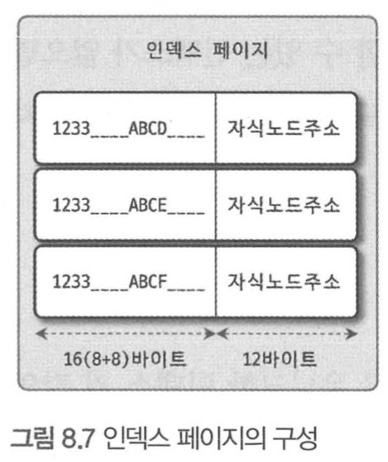
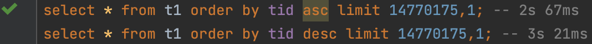
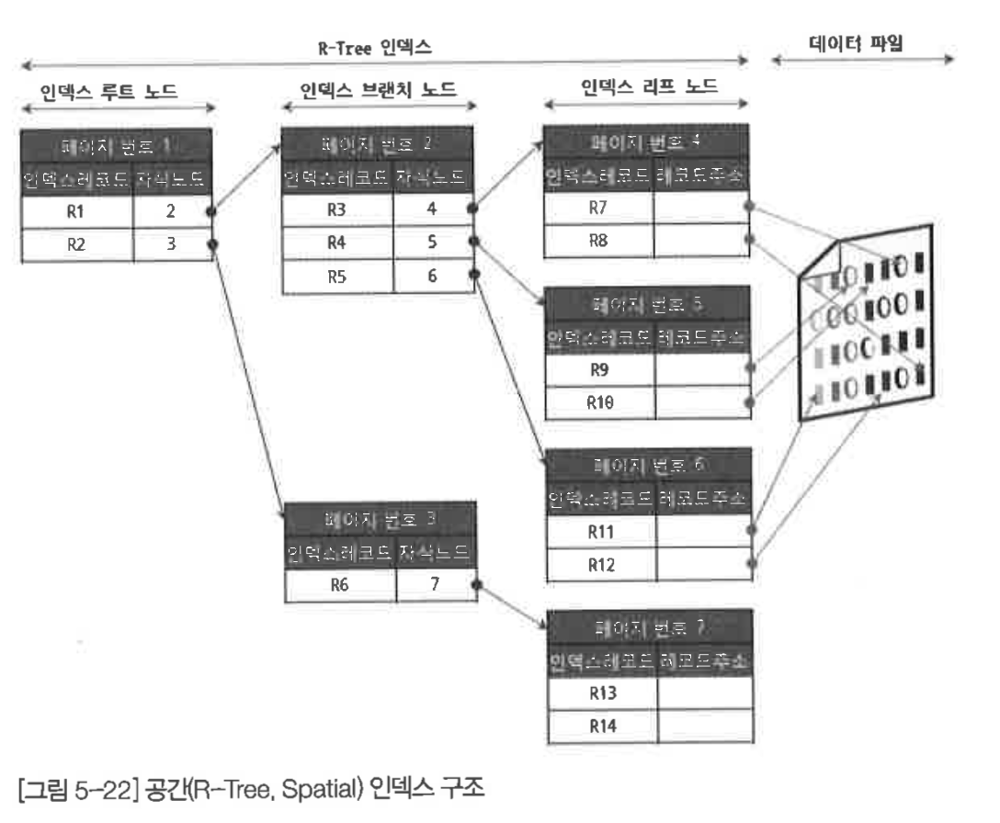
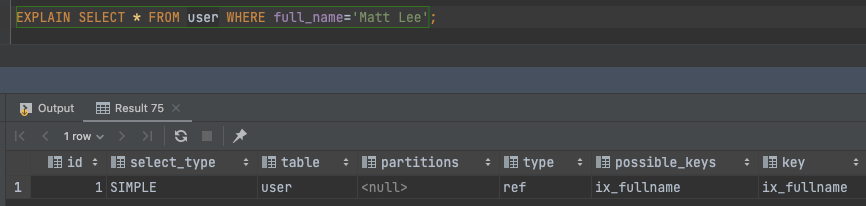
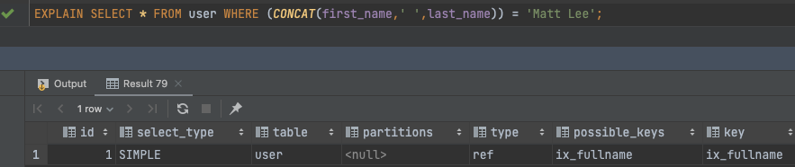
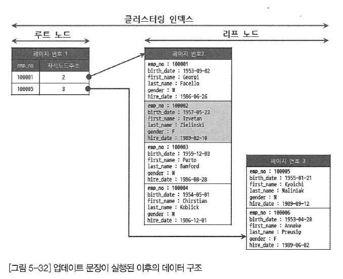

# 8장 인덱스

## 8.1 디스크 읽기 방식

### 8.1.1 하드디스크와 SSD

- CPU > D-RAM > SSD > HDD 순으로 빠르다.
- 디스크가 많이 빨라지긴 했지만 메모리보다는 여전히 느리다.
- 데이터베이스 성능 튜닝은 어떻게하면 디스크 I/O를 줄이느냐에 관건이 있다.
- 순차 I/O의 경우 SSD 와 HDD의 속도가 비슷하지만 데이터베이스에서 주로 읽고쓰이는데 사용되는 랜덤 I/O에서는 SSD가 월등히 빠르다.

### 8.1.2 랜덤 I/O와 순차 I/O

- 3개의 페이지를 디스크에 기록하는데 순차 I/O는 시스템콜을 1번 요청하지만 랜덤 I/O는 3번 요청한다.
- 디스크 헤드를 움직이는 횟수가 성능에있어서 중요하다.

## 8.2 인덱스란?

- DBMS도 데이터베이스 테이블의 모든 데이터를 검색해서 원하는 결과를 가져오려면 시간이 오래 걸린다.
- 그래서 컬럼의 값과 해당 레코드가 저장된 주소를 키와 값의 쌍으로 삼아 인덱스를 만들어 두어 미리 정렬해 두는 것이다.
- 인덱스 = SortedList(정렬된 상태 유지) , 데이터파일 = ArrayList (정렬 없이 저장된 순서대로 저장)
- SortedList 자료구조는 저장시에도 정렬해서 저장을해야되기 때문에 결국 인덱스는 데이터의 저장성능을 희생하고 대신에 데이터의 읽기 속도를 높이는 기능이다.
- 인덱스를 역할별로 구분해 본다면 프라이머리 키와 보조키로 구분할 수 있다.
    - `Primary key` : 레코드를 대표하는 컬럼의 값으로 만들어진 인덱스. 식별자라고도 부름
    - `Secondary key` : 프라이머리 키를 제외한 나머지 모든 인덱스. 대체키라고도 부름
- 저장방식(알고리즘)은 대표적으로 `B-Tree` 인덱스와 `Hash` 인덱스로 구분할 수 있다. 최근에는 Fractal-Tree, Merge-Tree와 같은 알고리즘을 사용하기도 한다.
- 중복 여부에 따라 유니크(`Unique`) 인덱스와 논 유니크(`Non-Unique`) 인덱스로 구분할 수 있다.
- 중복 여부는 옵티마이저에게 상당히 중요한 문제가 된다. 유니크 인덱스에 대해 동등조건(Equal, =)으로 검색한다는 것은 한 레코드만 찾으면 더 찾지 않아도 된다는 것을 옵티마이저에게 알려주는 효과를 낸다.

## 8.3 B-Tree 인덱스

- 가장 먼저 도입되고 가장 범용적인 인덱스 알고리즘이다.
- B-Tree의 B는 Binary가 아닌 `Balanced` 이다.
- 컬럼의 원래 값을 변형시키지 않고 인덱스 구조체 내에서는 항상 정렬된 상태로 유지한다.

### 8.3.1 구조 및 특성


- 트리 구조의 최상위에 하나의 루트노드(`Root node`)가 존재하고 그 하위에 자식 노드가 붙어 있는 형태이다.
- 가장 하위에 있는 노드를 리프 노드(`Leaf node`)라 하고 루트노드도 아니고 리프노드도 아닌 중간의 노드를 브랜치 노드(`Branch node`) 라고 한다.
- 인덱스의 키 값은 모두 정렬돼 있지만, 데이터 파일의 레코드는 정렬돼 있지 않고 임의의 순서로 저장돼 있다.
- 데이터 파일의 레코드는 저장된 순서대로 저장되는 것은 아니다. 중간에 레코드가 삭제되는 경우 새로 INSERT가 되는 데이터의 경우 삭제된 공간을 재활용한다.
- MyISAM과 InnoDB 스토리지 엔진의 인덱스에서 가장 큰 차이점은 세컨더리 인덱스를 통해 데이터 파일의 레코드를 찾아가는 방법에 있다. MyISAM 테이블은 세컨더리 인덱스가 물리적인 주소를 가지는 반면 InnoDB 테이블은 프라이머리 키를 주소처럼 사용하기 때문에 논리적인 주소를 가진다고 볼 수 있다.
- 그래서 InnoDB 테이블에서 인덱스를 통해 레코드를 읽을 때는 MyISAM 과 다르게 데이터 파일을 바로 찾아갈 수 없다.
- 인덱스에 저장돼 있는 프라이머리 키 값을 이용해 프라이머리 키 인덱스를 한 번 더 검색한 후, 프라이머리 키 인덱스의 리프 페이지에 저장돼 있는 레코드를 읽는다.

### 8.3.2 B-Tree 인덱스 키 추가 및 삭제

- 테이블의 레코드를 저장하거나 변경하는 경우 인덱스 키 추가나 삭제 작업이 발생한다.
- 인덱스 키 추가나 삭제가 어떻게 처리되는지 알아두면 쿼리의 성능을 쉽게 예측할 수 있을 것이다.

**8.3.2.1 인덱스 키 추가**

- B-Tree는 상대적으로 쓰기 작업에 비용이 많이 든다.
    - 레코드의 키 값과 대상 레코드의 주소 정보를 리프노드에 저장하는데, 리프노드가 꽉 찼을 경우 리프노드가 분리되어야하는데 분리될 때 상위 브랜치 노드까지 범위가 넓어지기 때문.
- 인덱스가 추가 될떄 INSERT, UPDATE 문장이 어떤 영향을 받는지
    - 테이블의 칼럼수, 칼럼의 크기, 인덱스 칼럼의 특성 등을 확인해야 한다.
    - 테이블에 레코드를 추가하는 작업비용을 1이라고 가정하면 해당 테이블의 인덱스에 키를 추가하는 작업 비용을 1.5정도로 예측한다.
- MyISAM 이나 메모리 스토리지 엔진을 사용하는 테이블에서는 INSERT 문이 실행되면 즉시 새로운 키 값을 B-Tree 인덱스에 변경한다.
- 하지만 InnoDB 스토리지 엔진은 이 작업을 조금 더 지능적으로 처리하는데, 필요하다면 인덱스 키 추가 작업을 지연시켜 나중에 처리 할 수 있다. 하지만 PK나 유니크 인덱스의 경우 중복 체크가 필요하기 때문에 즉시 B-Tree에 추가하거나 삭제 한다.

**8.3.2.2 인덱스 키 삭제**

- B-Tree의 키 값이 삭제되는 경우는 상당히 간단하다. 해당 키 값이 저장된 B-Tree의 리프 노드를 찾아서 그냥 삭제 마크만 하면 작업이 완료된다.
- 삭제 마킹된 인덱스 키 공간은 그대로 방치하거나 재활용할 수 있다.
- 인덱스 키 삭제로 인한 마킹 작업 또한 디스크 쓰기가 필요하므로 이 작업 역시 디스크 I/O가 필요한 작업이다.

**8.3.2.3 인덱스 키 변경**

- B-Tree의 키 값 변경작업은 단순히 키 값만 변경하는 것이 불가능하다. 먼저 키값을 삭제한 후, 다시 새로운 키 값을 추가하는 형태로 처리된다.
- InnoDB 스토리지 엔진에서는 이 작업 모두 체인지 버퍼를 활용해 지연 처리 될 수 있다.

**8.3.2.4 인덱스 키 검색 ★**

- 인덱스를 검색하는 작업은 B-Tree 루트 노드부터 시작해 브랜치 노드를 거쳐 최종 리프 노드까지 이동하면서 비교 작업을 수행하는데, 이 과정을 트리 탐색이라고 한다.
- 인덱스 트리 탐색은 SELECT에서만 사용하는 것이 아니라 UPDATE 나 DELETE를 처리하기 위해 항상 해당 레코드를 먼저 검색해야 할 경우에도 사용된다.
- `B-Tree 인덱스를 이용한 검색은 100% 일치 또는 값의 앞부분만 일치하는 경우에 사용할 수 있다.`
- 부등호 (< , >) 비교 조건에서도 인덱스를 활용할 수 있지만, 인덱스를 구성하는 키 값의 뒷부분만 검색하는 용도로는 인덱스를 사용할 수 없다.
- 또한 인덱스를 이용한 검색에서 중요한 사실은 인덱스의 키 값에 변형이 가해진 후 비교되는 경우에는 절대 B-Tree의 빠른 검색 기능을 사용할 수 없다는 것이다.
- 이미 변형 된 값은 B-Tree의 인덱스에 존재하는 값이 아니다. 따라서 함수나 연산을 수행한 결과로 정렬한다거나 검색하는 작업은 B-Tree의 장점을 이용할 수 없으므로 주의해야 한다.
- InnoDB 스토리지 엔진에서 인덱스는 InnoDB 테이블에서 지원하는 레코드 잠금이나 넥스트 키락(갭락)이 검색을 수행한 후 인덱스를 잠근 후 테이블의 레코드를 잠그는 방식으로 구현돼있다. 따라서 UPDATE나 DELETE문장이 실행될 때 테이블에 적절히 사용할 수 있는 인덱스가 없으면 불필요하게 많은 레코드를 잠근다. 심지어 모든 테이블의 레코드를 잠글 수도 있다.
- InnoDB 스토리지 엔진에서는 그만큼 인덱스의 설계가 중요하고 많은 부분에 영향을 미친다.

### 8.3.3 B-Tree 인덱스 사용에 영향을 미치는 요소

- B-Tree 인덱스는 인덱스를 구성하는 칼럼의 크기와 레코드의 건수, 그리고 유니크한 인덱스의 키 값의 개수 등에 의해 검색이나 변경 작업의 성능이 영향을 받는다.

**8.3.3.1 인덱스 키 값의 크기**

- 인덱스는 페이지 단위로 관리된다.
- B-Tree는 자식 노드의 개수가 가변적인 구조이다.
- 인덱스 페이지의 크기와 키 값의 크기에 따라 자식 노드의 개수가 달라진다.



- 인덱스를 구성하는 키 값의 크기가 커지면 디스크로부터 읽어야 하는 횟수가 늘어나고, 그만큼 느려진다는 것을 의미한다.
- 또한 인덱스의 키 값의 길이가 길어진다는 것은 전체적인 인덱스의 크기가 커진다는 것을 의미한다. 하지만 인덱스를 캐시해 두는 캐시 영역은 크기가 제한적이기 때문에 하나의 레코드를 위한 인덱스 크기가 커지면 메모리에 캐시해 둘 수 있는 레코드 수는 줄어들고 메모리의 효율이 떨어지는 결과를 가져온다.

**8.3.3.2 B-Tree 깊이**

- 인덱스 키 값의 크기가 커지면 커질수록 하나의 인덱스 페이지가 담을 수 있는 인덱스 키 값의 개수가 적어지고, 같은 레코드 건수라 하더라도 B-Tree의 깊이가 깊어져 디스크 읽기가 더 많이 필요하다.

**8.3.3.3 선택도(가수성) → 어렵다**

- 선택도 또는 기수성은 거의 같은 의미로 사용되며, 모든 인덱스 키 값 가운데 유니크한 값의 수를 의미.
- 인덱스 키 값 가운데 중복된 값이 많아지면 기수성이 낮아지고 선택도가 떨어진다.
- 인덱스는 선택도가 높을수록 검색대상이 줄어들기 때문에 그만큼 빨리 처리된다.

**8.3.3.4 읽어야 하는 레코드의 건수**

- 인덱스를 통해 테이블의 레코드를 읽는 것은 인덱스를 거치지 않고 바로 테이블의 레코드를 읽는 것보다 높은 비용이 드는 작업이다.
- 인덱스를 통해 읽어야할 레코드의 건수가 전체 테이블 레코드의 20~25%를 넘어서면 인덱스를 이용하지 않고 테이블을 모두 직접 읽어서 레코드만 가려내는 방식으로 처리하는 것이 효율적이다.

### 8.4.4 B-Tree 인덱스를 통한 데이터 읽기

- 어떤 경우에 인덱스를 사용하게 유도할지, 또는 사용하지 못하게 할지 판단하려면 MySQL이 어떻게 인덱스를 경유해서 실제 레코드를 읽어내는지 알아야 한다.

**8.3.4.1 인덱스 레인지 스캔**

- 인덱스 접근 방법 가운데 가장 대표적인 접근 방식이다.
- 검색해야할 인덱스의 범위가 결정됐을 때 사용하는 방식
- 인덱스 레인지 스캔 3단계
    1. 인덱스에서 조건을 만족하는 값이 저장된 위치를 찾는다. (인덱스 탐색)
    2. 1번에서 탐색된 위치부터 필요한만큼 인덱스를 차례대로 쭉 읽는다. (인덱스 스캔)
    3. 2번에서 읽어들인 인덱스 키와 레코드 주소를 이용해 레코드가 저장된 페이지를 가져오고, 최종 레코드를 읽어 온다.

**8.3.4.2 인덱스 풀 스캔**

- 인덱스의 처음부터 끝까지 모두 읽는 방식
- 인덱스 레인지 스캔보다는 빠르지 않지만 테이블 풀 스캔보다는 효율적이다.

**8.3.4.3 루스 인덱스 스캔**

- 느슨하게 또는 듬성듬성하게 인덱스를 읽는것
- 중간에 필요치 않은 인덱스 키 값은 무시하고 다음으로 넘어가는 형태로 처리

**8.3.4.4 인덱스 스킵 스캔**

```sql
-- ALTER TABLE employees ADD INDEX ix_gender_birthdate(gender, birthdate)
-- SET optimizer_switch='skip_scan=[on/off]';
EXPLAIN
SELECT gender, birth_date
FROM employees
WHERE birth_date >= '1965-02-01';
```

- 실행계획에서 type 컬럼이 `index` → 풀 인덱스 스캔
실행계획에서 type 컬럼이 `range`→ 범위 검색에서 꼭 필요한 부분만 읽음
- skip_switch 옵션을 활성화하면 옵티마이저가 내무적으로 `gender=’M’` , `gender=’F’`  식으로 쿼리를 만들어 최적화한다.
- 선행 칼럼이 가진 유니크한 값의 개수가 소량일 때만 적용 가능한 최적화이다.

> 실행계획 타입 참고
[https://jeong-pro.tistory.com/243](https://jeong-pro.tistory.com/243)
> 

### 8.3.5 다중 칼럼 인덱스

- 두개 이상의 칼럼으로 구성된 인덱스를 다중 칼럼 인덱스라고 한다.
- 다중 칼럼 인덱스에서는 인덱스의 n+1번째 컬럼은 n 번째 칼럼에 의존해 정렬돼 있다.
따라서 다중 칼럼 인덱스 내에서 각 칼럼의 순서가 상당히 중요하며, 그것을 아주 신중히 결정해야 한다.

### 8.3.6 B-Tree 인덱스의 정렬 및 스캔 방향

**8.3.6.1 인덱스의 정렬**

- 인덱스를 생성할때 설정한 정렬 규칙에 따라서 인덱스의 키 값은 항상 오름차순이거나 내림차순으로 정렬되어 저장된다.

```sql
-- ASC, DESC로 정렬방향을 지정, 다음과 같이혼합도 가능
CREATE INDEX ix_teamname_userscore ON employees (team_name ASC, user_score DESC);
```

**8.3.6.1.1 인덱스 스캔 방향**

- 어떤인덱스가 오름차순으로 생성됐다고 해서 그 인덱스를 오름차순으로만 읽을 수 있다는 뜻은 아니다.
- 인덱스를 어느 방향으로 읽을지는 쿼리에 따라 옵티마이저가 실시간으로 만들어내는 실행계획에 따라 결정된다.

**8.3.6.1.2 내림차순 인덱스**



- 인덱스 역순 스캔이 인덱스 정순 스캔에 비해 느릴 수 밖에 없는 이유
    - 페이지 잠금이 인덱스 정순 스캔에 적합한 구조
    - 페이지 내에서 인덱스 레코드가 단방향으로만 연결된 구조

### 8.3.7 B-Tree 인덱스의 가용성과 효율성

**8.3.7.1 비교 조건의 종류와 효율성**

- 다중 칼럼 인덱스에서 각 칼럼의 순서와 그 칼럼에 사용된 조건이 동등(`=`) 인지 아니면 크다(`>`) 작다(`<`) 같은 범위 조건인지에 따라 각 인덱스 칼럼의 활용형태 및 효율이 달라진다.

```sql
SELECT * FROM dept_emp
WHERE dept_no='d002' AND emp_no >= 10114;

-- 케이스 A: INDEX(dept_no, emp_no)
-- 케이스 B: INDEX(emp_no, dept_no)
```

- 공식적인 명칭은 아니지만 케이스 A 인덱스에서의 두 조건과 같이 작업 범위를 결정하는 조건을 `작업범위 결정 조건` 이라 하고 케이스 B 인덱스의 조건과 같이 비교 작업의 범위를 줄이지 못하고 다순히 거름종이 역할만 하는 조건을 `필터링 조건` 또는 `체크 조건`이라고 표현한다.
- 작업 범위를 결정하는 조건은 많으면 많을수록 쿼리의 처리 성능을 높이지만 체크 조건은 많다고 해서 쿼리의 처리 성능을 높이지는 못한다. 오히려 쿼리 실행을 더 느리게 만들때가 많다.

**8.3.7.2 인덱스의 가용성**

- B-Tree 인덱스의 특징은 왼쪽 값에 기준해서 오른쪽 값이 정렬돼 있다는 것이다. 여기서 왼쪽이란 하나의 칼람 내에서뿐만아니라 다중 칼럼 인덱스에 대해서도 함께 적용된다.

```sql
-- 케이스 A: INDEX (first_name)
-- 케이스 B: INDEX (dept_no, emp_no)

SELECT * FROM employees WHERE first_name LIKE '%mer'; -- 왼쪽이 고정되어있지않아 레인지 스캔 불가
SELECT * FROM dept_emp WHERE emp_no >= 10144; -- 선행 인덱스가 조건에 없어 비효율적
```

**8.3.7.3 가용성과 효율성 판단**

- 기본적으로 B-Tree 인덱스의 특성상 다음조건에서는 작업범위 결정 조건으로서는 사용할 수 없다. (체크조건으로는 가능)
    - NOT-EQUAL
        
        ```sql
        <> , NOT IN, NOT BETWEEN, IS NOT NULL
        ```
        
    - LIKE
        
        ```sql
        WHERE column LIKE ‘%??’
        ```
        
    - 스토어드 함수나 다른연산자로 인덱스 칼럼이 변형된 후 비교
        
        ```sql
        WHERE SUBSTRING(column,1,1) = ‘X’
        WHERE DAYOFMONTH(column) = 1
        ```
        
    - NOT-DETERMINISTIC 속성의 스토어드 함수가 비교조건에 사용된 경우
        
        ```sql
        WHERE column = deterministic_function()
        ```
        
    - 데이터 타입이 서로 다른 비교
        
        ```sql
        WHERE char_column = 10
        ```
        
    - 문자열 데이터 타입의 콜레이션이 다른 경우
        
        ```sql
        WHERE utf8_bin_char_column = euckr_bin_char_column
        ```
        
- MySQL 에서는 NULL 값도 인덱스에 저장된다.
    
    ```sql
    WHERE column IS NULL -- 인덱스를 사용한다.
    ```
    
- 다중 칼럼 인덱스 사용 O / 사용 X 예시
    
    ```sql
    INDEX ix_test (col1, col2, col3 ...)
    ```
    
    - 작업 범위 결정 조건으로 인덱스를 사용하지 못하는 경우
        - col1 에 대한 조건이 없는 경우
        - col1 칼럼의 비교 조건이 위의 인덱스 사용 불가 조건 중 하나 인 경우
    - 작업 범위 결정 조건으로 인덱스를 사용하는 경우
        - col1 ~ col(i-1) 칼럼 까지 동등 비교 형태 ( = , IN )
        - col i 번째 컬럼에 대해 다음 연산자중 하나로 비교
            - 동등비교 ( = , IN )
            - 크다 작다 ( > , < )
            - LIKE 좌측일치 패턴 (LIKE ‘beenz%’)

## 8.4 R-Tree 인덱스

- 공간인덱스는 R-Tree 인덱스 알고리즘을 이용해 2차원의 데이터를 인덱싱하고 검색하는 목적의 인덱스다.
- 기본적인 내부 매커니즘은 B-Tree와 흡사하다.
- B-Tree는 인덱스를 구성하는 칼럼의 값이 1찬원의 스칼라 값인 반면, R-Tree 인덱스는 2차원의 공간 개념 값이라는 것이다.
- 위치 기반 서비스를 구현하는 방법중 하나는 MySQL의 공간 확장을 이용하면 간단하게 이러한 기능을 구현할 수 있다.
- MySQL 공간확장의 세가지 기능
    - 공간 데이터를 저장할 수 있는 데이터 타입
    - 공간 데이터의 검색을 위한 공간 인덱스(R-Tree 알고리즘)
    - 공간 데이터의 연산 함수(거리 또는 포함 관계의 처리)
    

### 8.4.1 구조 및 특성


- ? 는 수퍼타입으로 앞선 3가지 객체를 모두 저장할 수 있다.
- R-Tree 알고리즘을 이해하려면 MBR이라는 개념을 알고 있어야 한다.
- MBR(Minumum Bounding Rectangle)은 해당 도형을 감싸는 최소 크기의 사각형을 의미한다.


- 최상위 레벨 : R1, R2 → ROOT
- 차상위 레벨 : R3, R4, R5, R6 → 중간 크기의 MBR, 브랜치 노드
- 최하위 레벨 : R7 ~ R14 → 도형 데이터 MBR
- 각 도형의 객체 : 리프 노드



### 8.4.2 R-Tree 인덱스의 용도

- 일반적으로 GPS 기준의 위도, 경도 좌표 저장에 주로 사용된다. 이 뿐만 아니라 좌표 시스템에 기반을 둔 정보에 대해서는 모두 적용할 수 있다.
- R-Tree는 각 도형 MBR의 포함 관계를 이용해 만들어진 인덱스다. 따라서 `ST_Contains()` 또는 `ST_Within()` 등과 같은 포함 관계를 비교하는 함수로 검색을 수행하는 경우에만 인덱스를 이용할 수 있다.

## 8.5 전문 검색 인덱스

- 문서 내용 전체를 인덱스화해서 특정 키워드가 포함된 문서를 검색하는 전문 검색에는 일반적인 용도의 B-Tree 인덱스를 사용할 수 없다.

### 8.5.1 인덱스 알고리즘

- 전문 검색에서는 문서 본문의 내용에서 사용자가 검색하게 될 키워드를 분석해 내고, 빠른 검색용으로 사용할 수 있게 이러한 키워드로 인덱스를 구축한다.
- 문서의 키워드를 인덱싱하는 기법에 따라 단어의 어근 분석과 n-gram 분석 알고리즘으로 구분할 수 있다.

**8.5.1.1 어근 분석 알고리즘**

- 전문검색 인덱스는 다음과 같은 두 가지 중요한 과정을 거쳐서 색인 작업이 수행된다.
    - 불용어(Stop Word) 처리 : 별 가치가 없는 단어를 모두 필터링해서 제거하는 작업
    - 어근 분석(Stemming) : 검색어로 선정된 단어의 뿌리인 원형을 찾는 작업
- MySQL 서버에 불용어가 정의되어 있지만, 사용자가 불용어를 커스텀할 수도 있다.
- MeCab (일어, 한국어) , Snowball (MongoDB) 오픈소스 플러그인으로 형태소 분석이 가능하다.
    - https://taku910.github.io/mecab/

**8.5.1.2 n-gram 알고리즘**

- 형태소 분석이 문장을 이해하는 알고리즘이라면, n-gram은 단순히 키워드를 검색해내기 위한 인덱싱 알고리즘이라고 할 수 있다.
- n-gram 이란 본문을 무조건 몇 글자씩 잘라서 인덱싱하는 방법이다.
- 일반적으로 2글자 단위로 키워드를 쪼개서 인덱싱하는 2-gram 방식이 많이 사용된다.
- 예시 문장
    
    ```
    To be or not to be. That is the question
    ```
    
    | 단어 |  |  |  |  |  |  |  |
    | --- | --- | --- | --- | --- | --- | --- | --- |
    | To | To |  |  |  |  |  |  |
    | be | be |  |  |  |  |  |  |
    | or | or |  |  |  |  |  |  |
    | not | no | ot |  |  |  |  |  |
    | to | to |  |  |  |  |  |  |
    | be | be |  |  |  |  |  |  |
    | That | th | ha | at |  |  |  |  |
    | is | is |  |  |  |  |  |  |
    | the | th | he |  |  |  |  |  |
    | question | qu | ue | es | st | ti | io | on |

**8.5.1.3 불용어 변경 및 삭제**

- 불용어 처리를 무시하는 방법은 두 가지가 있다.
    - MySQL 서버의 모든 전문 검색 인덱스에 대해 불용어를 완전히 제거
    이를 위해 my.cnf 파일의 `ft_stopword_file` 시스템 변수에 빈 문자열을 설정한다. (재시작 필요)
    - 전문검색 인덱스에 대해서만 불용어 처리를 무시
    `innodb_ft_enable_stopword` 시스템 변수를 OFF 로 설정 한다.
        
        ```sql
        SET GLOBAL innodb_ft_enable_stopword=OFF;
        ```
        
- 사용자 정의 불용어 사용
    - MySQL 서버 설정 파일에서 파일의 경로를 다음과 같이 `ft_stopword_file` 설정에 등록하면 된다.
        
        ```sql
        ft_stopword_file='/data/my_custom_stopword.txt'
        ```
        
    - 두번째 방법은 InnoDB 스토리지 엔진을 사용하는 테이블의 전문 검색 엔진에서만 사용할 수 있는데, 불용어의 목록을 테이블로 저장하는 방식이다.
    - 다음과 같이 불용어 테이블을 생성하고, `innodb_ft_server_stopword_table` 시스템 변수에 불용어 테이블을 설정하면 된다.
        
        ```sql
        CREATE TABLE my_stopword(value VARCHAR(30)) ENGINE = INNODB;
        INSERT INTO my_stopword(value) VALUES ('MySQL');
        
        SET GLOBAL innodb_ft_server_stopword_table='mydb/my_stopword'
        ALTER TABLE tb_bi_gram
        ADD FULLTEXT INDEX fx_title_body(title, body) WITH PARSER ngram;
        ```
        
    - `innodb_ft_user_stopword_table` 도 `innodb_ft_server_stopword_table` 과 사용법은 동일하다. 단 여러 전문 검색 인덱스가 서로 다른 불용어를 사용해야 하는 경우라면 `innodb_ft_user_stopword_table` 시스템 변수를 이용하면 된다.

### 8.5.2 전문 검색 인덱스의 가용성

- 전문 검색 인덱스 사용 조건
    - 쿼리 문장이 전문 검색을 위한 문법(MATCH .. AGAINST .. )을 사용
    - 테이블이 전문 검색 대상 칼럼에 대해서 전문 인덱스 보유

## 8.6 함수 기반 인덱스

- 칼럼의 값을 변형해서 만들어진 값에 대해 인덱스를 구축할때 사용

### 8.6.1 가상 칼럼을 이용한 인덱스

```sql
CREATE TABLE user(
	user_id BIGINT,
	first_name VARCHAR(10),
	last_name VARCHAR(10),
	PRIMARY KEY (user_id)
)

-- 기존에는 full_name 컬럼 생성후 업데이트를 쳐줬어야했으나
-- 가상컬럼으로 인덱스 선언 가능
ALTER TABLE user
	ADD full_name VARCHAR(30) AS (CONCAT(first_name,' ',last_name)) [VIRTUAL/STORED],
	ADD INDEX ix_fullname (full_name);
```

- 실행계획
    
    
    

### 8.6.2 함수를 이용한 인덱스

```sql
-- 8.0 버전부터 함수를 직접 사용하는 인덱스를 생성할 수 있다.
CREATE TABLE user(
	user_id BIGINT,
	first_name VARCHAR(10),
	last_name VARCHAR(10),
	PRIMARY KEY (user_id),
	INDEX ix_fullname ((CONCAT(first_name,' ',last_name)))
);
```

- 실행계획
    
    
    
    → 함수 인덱스는 반드시 인덱스에 선언한 함수와 동일한 함수로 검색해야한다.
    

## 8.7 멀티 밸류 인덱스

- 전문 검색 인덱스를 제외한 모든 인덱스는 레코드 1건이 1개의 인덱스 키 값을 가진다. (1 : 1 관계)
- 멀티 밸류 인덱스의 경우 하나의 레코드가 여러 개의 키 값을 가질 수 있는 형태의 인덱스
- RDBMS에서 JSON 컬럼을 지원하기 시작하면서 JSON 배열 내 원소들에 대한 인덱스 요건이 필요하기때문
- 멀티 밸류 인덱스를 활용하기 위해서는 다음함수를 써야 옵티마이저가 인식한다.
    - MEMBER OF()
    - JSON_CONTAINS()
    - JSON_OVERLAPS()

## 8.8 클러스터링 인덱스

### 8.8.1 클러스터링 인덱스

- InnoDB에서만 지원한다.
- PK에 대해서만 적용된다. 즉 PK 값이 비슷한 레코드끼리 묶어서 저장하는 것을 클러스터링 인덱스라 한다.
- PK 값에 의해 레코드의 저장 위치가 결정된다. (= PK 값이 바뀌면 저장위치도 변경되야함을 의미)
- PK 값으로 클러스터링된 테이블은 PK 값 자체에 대한 의존도가 상당히 크기 때문에 신중히 PK를 결정해야 한다.
- 인덱스 알고리즘이라기 보다 테이블 레코드의 저장 방식이라고 볼 수 있다.
- 검색은 빠르지만 레코드의 저장이나 PK 변경이 상대적으로 느리다.
- B-Tree ≠ 클러스터링인덱스 인 이유는 PK에 의해 정렬되어 저장된 경우만 클러스터링 인덱스로 보기 때문



- B-Tree 인덱스와 달리 리프 노드에 레코드의 모든 컬럼이 같이 저장돼 있다.

```sql
UPDATE tb_test SET emp_no=100002 WHERE emp_no=100007; -- 페이지 이동
```

- InnoDB 스토리지 엔진의 클러스터링 키 선택 우선순위
    1. PK 를 클러스터링 키로 선택
    2. NOT NULL UNIQUE 인덱스 중에서 첫번째 인덱스를 클러스터링 키로 선택
    3. 자동으로 유니크한 값을 가지도록 증가되는 칼럼을 내부적으로 추가한 후 클러스터링 키로 선택

### 8.8.2 세컨더리 인덱스에 미치는 영향

- MyISAM이나 MEMORY 테이블같이 클러스터링 되지 않은 테이블은 INSERT 될때 처음 저장된 공간에서 절대 이동하지 않고, 데이터가 저장된 주소는 내부적인 레코드아이디 (ROWID) 역할을 한다. 따라서 프라이머리 키와 세컨더리 인덱스는 구조적으로 아무런 차이가 없다.
- InnoDB의 경우 클러스터링 값이 변경될 때, 레코드의 주소가 변경될 수 있기 때문에 세컨더리 인덱스에서는 레코드가 저장된 주소가 아니라 PK 값을 저장한다.
    
    ```sql
    CREATE TABLE employees (
    	emp_no INT NOT NULL,
    	first_name VARCHAR(20) NOT NULL,
    	PRIMARY KEY (emp_no),
    	INDEX ix_firstname (first_name) -- 세컨더리 인덱스
    )
    
    SELECT * FROM employees WHERE first_name='Aamer';
    
    --MyISAM : ix_firstname 인덱스를 검색해서 주소를 확인한후, 주소를 이용해 최종 레코드를 가져옴
    --InnoDB : ix_firstname 인덱스를 검색해 레코드의 PK 값을 확인 한 후, PK 인덱스를 검색해 최종 레코드를 가져옴.
    ```
    

### 8.8.3 클러스터링 인덱스의 장점과 단점

| 장점 | - PK(클러스터링 키)로 검색할 때 처리 성능이 매우 빠름 (특히, PK를 범위 검색하는 경우 매우 빠름)
- 테이블의 모든 세컨더리 인덱스가 PK를 가지고 있기 때문에 인덱스만으로 처리될 수 있는 경우가 많음 (이를 커버링 인덱스라고 함) |
| --- | --- |
| 단점 | - 테이블의 모든 세컨더리 인덱스가 클러스터링 키를 갖기 때문에 클러스터링 키 값의 크기가 클 경우 전체적으로 인덱스의 크기가 커짐
- 세컨더리 인덱스를 통해 검색할 때 PK로 다시 한번 검색해야 하므로 처리 성능이 느림
- INSERT할 때 PK에 의해 레코드의 저장 위치가 결정되기 때문에 처리 성능이 느림
- PK를 변경할때 레코드를 DELETE하고 INSERT하는 작업이 필요하기 때문에 처리 성능이 느림 |
| 총평 | - 느린쓰기, 빠른 읽기 |

### 8.8.4 클러스터링 테이블 사용 시 주의사항

**8.8.4.1 클러스터링 인덱스 키의 크기**

- 5개의 세컨더리 인덱스가 있는 경우
    
    
    | PK 크기 | 레코드당 증가하는 인덱스 크기 | 100만건 레코드 저장시 증가하는 인덱스 크기 |
    | --- | --- | --- |
    | 10바이트 | 10바이트 * 5 = 50바이트 | 50바이트 * 1,000,000 = 47MB |
    | 50바이트 | 50바이트 * 5 = 250바이트 | 250바이트 * 1,000,000 = 238MB |

**8.8.4.2 프라이머리 키는 AUTO-INCREMENT보다는 업무적인 칼럼으로 생성**

- 검색에서 상당히 빈번하게 사용되기 때문에 업무적으로 해당 레코드를 대표하는 컬럼을 PK로 지정

**8.8.4.3 프라이머리 키는 반드시 명시할 것**

- PK 가 없는 테이블의 경우 **AUTO_INCREMENT** 로라도 생성하는걸 권장한다.
- PK 가 없으면 내부적으로 생성된 일련번호를 쓰는데 이는 사용자가 제어할 수 없기 때문
- PK는 ROW 기반의 복제나 InnoDB Cluster에서 복제 성능을 보장해준다

**8.8.4.4 AUTO-INCREMENT 칼럼을 인조 식별자로 사용할 경우**

- 복합 PK + 세컨더리 인덱스 X → 그대로 사용
- 복합 PK + 세컨더리 인덱스 O → AUTO_INCREMENT 컬럼 추가 후 PK로 지정 (인조 식별자)
- 조회보다 INSERT 위주의 테이블들은 AUTO_INCREMENT를 이용한 인조 식별자를 PK로 설정하는 것이 성능 향상에 도움이 된다.

## 8.9 유니크 인덱스

- 인덱스라기 보다는 제약조건
- MySQL에서는 인덱스 없이 유니크 제약만 설정할 수 없다.
- NULL의 경우 특정 값이 아니기 때문에 2개이상 저장가능
- MyISAM 이나 MEMORY 테이블은 (NOT NULL + 유니크 인덱스 = PK) 지만 클러스터링을 지원하는 InnoDB는 앞선 경우와 근본적으로 다르다.

### 8.9.1 유니크 인덱스와 일반 세컨더리 인덱스의 비교

- 인덱스 구조상 아무런 차이가 없다.

**8.9.1.1 인덱스 읽기**

- 유니크하지 않은 세컨더리 인덱스는 중복된 값이 허용되므로 읽어야 할 레코드가 많아서 느린 것이지, 인덱스 자체의 특성 때문에 느린 것이 아니다.

**8.9.1.2 인덱스 쓰기**

- 유니크 인덱스의 경우 저장하려는 값이 유니크한지 체크하는 과정이 필요하기 때문에 유니크하지 않은 세컨더리 인덱스의 쓰기보다 느리다.
- InnoDB에서는 인덱스 키의 저장을 버퍼링하기 위해 체인지 버퍼가 사용되는데, 유니크 인덱스의 경우 중복 체크가 필요하기 때문에 작업자체를 버퍼링하지 못한다.

### 8.9.2 유니크 인덱스 사용 시 주의사항

- 꼭 필요한경우에는 생성해야하지만, 단순히 성능향상을 기대하기 위해 유니크인덱스를 생성하는것은 지양
- 같은 컬럼에 대해 유니크 인덱스와 일반 인덱스를 중복해서 생성해둔 경우가 있는데, 유니크 인덱스는 일반 다른 인덱스와 같은 역할을 하므로 중복해서 인덱스를 생성할 필요는 없다.
- PK 와 유니크 인덱스를 중복 생성하는 경우도 마찬가지로 불필요한 중복이다.
- 결론적으로 유일성이 꼭 보장돼야 하는 컬럼에는 유니크 인덱스를 생성하되, 그렇지 않은 컬럼의 경우 유니크하지 않은 세컨더리 인덱스를 생성하는 것을 고려하자.

## 8.10 외래키

- InnoDB 스토리지 엔진에서만 생성 가능
- 외래키 제약이 설정되면 자동으로 연관되는 테이블의 컬럼에 인덱스까지 생성. 외래키가 제거되지 않은 상태에서는 자동으로 생성된 인덱스를 삭제할 수 없다.
- 외래키 관리에는 중요한 두 가지 특징이 있다.
    - 테이블의 변경(쓰기 잠금)이 발생하는 경우에만 잠금 경합(잠금 대기)이 발생한다.
    - 외래키와 연관되지 않은 컬럼의 변경은 최대한 잠금 경합(잠금 대기)을 발생시키지 않는다.

### 8.10.1 자식 테이블의 변경이 대기하는 경우

| 작업 번호 | 커넥션-1 | 커넥션-2 |
| --- | --- | --- |
| 1 | BEGIN; |  |
| 2 | UPDATE tb_parent
SET fd=’changed-2’ WHERE id=2; |  |
| 3 |  | BEGIN; |
| 4 |  | UPDATE tb_child
SET pid=2 WHERE id=100; |
| 5 | ROLLBACK; |  |
| 6 |  | Query OK. |
- 동작 순서
    - 1번 작업: 커넥션-1 트랜잭션 시작
    - 2번 작업: tb_parent의 id=2 에 대해 커넥션 1에서 쓰기 잠금 획득
    - 3번 작업: 커넥션-2 트랜잭션 시작
    - 4번 작업 : 자식테이블의 외래키 컬럼을 변경하려고 하지만 부모테이블의 id=2에 대해 쓰기 잠금이 걸려있기 때문에 대기
    - 5번 작업 : ROLLBACK 또는 COMMIT으로 트랜잭션 종료시 tb_parent의 id=2 에 대해 커넥션 1에서 쓰기 잠금이 해제 됨과 동시에 6번작업 실행됨.

### 8.10.2 부모 테이블의 변경이 대기하는 경우

| 작업 번호 | 커넥션-1 | 커넥션-2 |
| --- | --- | --- |
| 1 | BEGIN; |  |
| 2 | UPDATE tb_child
SET fd=’changed-100’ WHERE id=100; |  |
| 3 |  | BEGIN; |
| 4 |  | UPDATE tb_parent
SET id=2 WHERE id=1; |
| 5 | ROLLBACK; |  |
| 6 |  | Query OK. |
- 동작 순서
    - 1번 작업 : 커넥션-1 트랜잭션 시작
    - 2번 작업 : tb_child의 id=100 (pid=1)에 대해 잠금 발생
    - 3번 작업 : 커넥션-2 트랜잭션 시작
    - 4번 작업 : 자식에서 잠금발생한 pid 가 1번이기 때문에 2번 작업이 끝날때까지 대기
    - 5번 작업 : ROLLBACK 또는 COMMIT으로 트랜잭션 종료시 tb_child의 pid=1 에 대해 커넥션 1에서 쓰기 잠금이 해제 됨과 동시에 6번작업 실행됨.