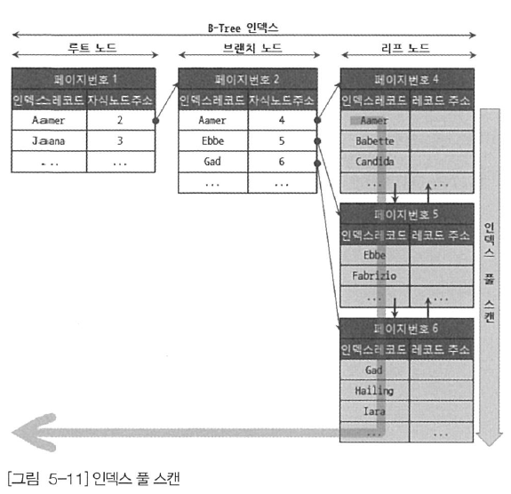
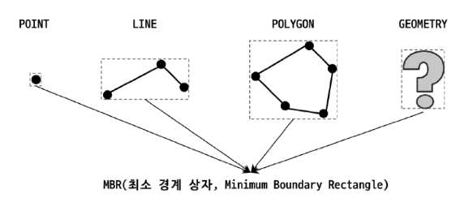
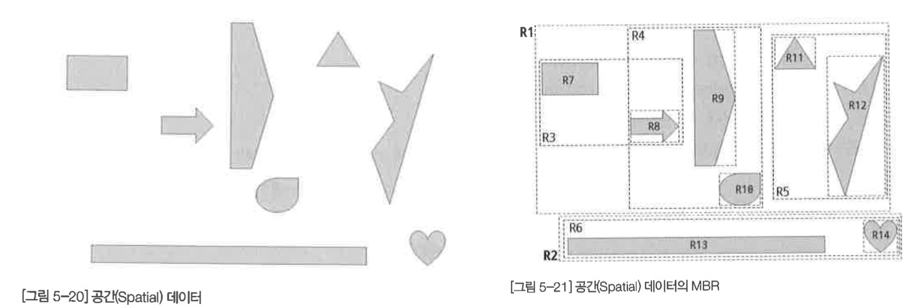
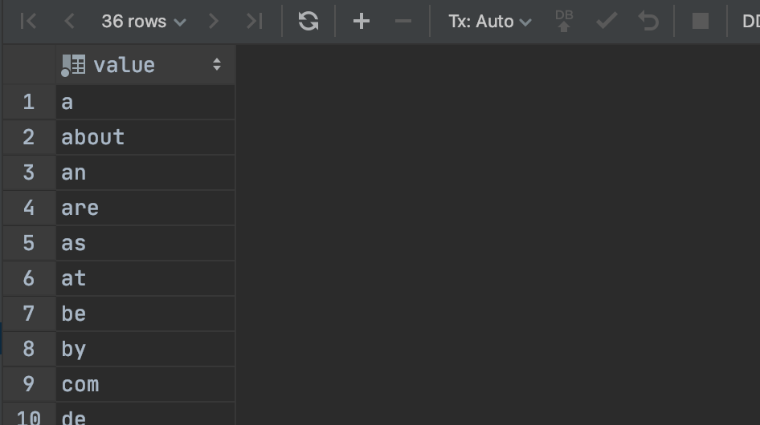
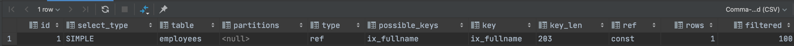

# 8장 인덱스

## 8.1 디스크 읽기 방식

- 데이터베이스의 성능 튜닝은 어떻게 `디스크I/O` 를 줄이는냐가 관건이다

### 8.1.1 HDD vs SSD

- CPU나 메모리 같은 장치는 전자식 장치지만 하드 디스크 드라이브는 기계식 장치라 `병목 현상` 을 일으킨다
- HDD는 데이터 저장용 플래터를 사용하고, SSD는 플래시 메모리를 사용한다
- SSD는 HDD보다 `랜덤I/O` 가 훨씬 빠르다
- 데이터베이스 서버에서는 `랜덤I/O` 의 비중이 크기 때문에 SSD가 DBMS용 스토리지에 최적이다

### 8.1.2 랜덤 I/O와 순차 I/O

- `순차I/O` 는 3개의 페이지를 디스크에 기록하기 위해 1번 요청하지만 `랜덤I/O` 는 3번 요청을한다
    - 디스크를 기록할 때 순차I/O는 디스크 헤더를 1번 움직이지만, 랜덤I/O는 3번 움직여야 한다
- SSD에서도 랜덤I/O는 순차I/O보다 전체 스루풋이 떨어진다
- 쿼리 튜닝은 `랜덤I/O` 자체를 줄여주는 것이 목적이다 ⇒ 필요한 데이터만 읽도록 쿼리를 개선한다

## 8.2 인덱스란?

- 인덱스는 `색인`
- `SortedList` 는 DBMS의 인덱스와 같은 자료구조이고, `ArrayList` 는 데이터 파일과 같은 자료 구조
- 인덱스의 장/단점
    - 저장하는 과정은 복잡하고 느리지만, 이미 정렬돼 있어 아주 빨리 원하는 값을 찾아올 수 있다
        - `insert`, `update` , `delete`  처리가 느려진다
    - 읽기 속도를 높여준다
- 인덱스의 역할로 `프라이머리 키 인덱스` 와 `세컨더리 키 인덱스` 로 구분한다
    - 프라이머리 키는 레코드를 대표하는 컬럼으로 만들어진 인덱스
    - 레코드 식별할 수 있는 기준값으로 식별자라고 한다
    - `Null` 을 허용하지 않고 `중복`을 허용하지 않는다
- 데이터 저장 방식으로 `B-Tree인덱스` , `Hash 인덱스` 로 구분된다
    - `B-Tree 인덱스` 는 가장 일반적으로 사용되는 인덱스 알고리즘이다
        - 값을 변형하지 않고, 원래의 값을 이용해 인덱싱한다
    - `Hash 인덱스` 알고리즘은 칼럼의 값으로 해시값을 계산해서 인덱싱한다 ⇒ 매우 빠른 검색을 지원한다
        - 메모리 기반의 데이터베이스에서 많이 사용한다
- 데이터 중복 허용 여부로 `유니크 인덱스` , `유니크 아닌 인덱스` 로 구분한다
    - 유니크 인덱스는 옵티마이저에게 동등 조건에 대해 1건의 결과만 찾는 것이라고 알려준다
- 인덱스의 기능별로 분류하면 `전문 검색용 인덱스`, `공간 검색용 인덱스` 로 구분한다

## 8.3 B-Tree 인덱스

- `Balanced` 인덱스
- 컬럼의 원래 값을 변형시키지 않고 구조체 내에서 항상 정렬된 상태를 유지한다

### 8.3.1 구조 및 특징


- 리프 노드는 실제 데이터 레코드의 `실제 주소값` 을 가지고 있다
- 인덱스의 키 값은 정렬돼 있지만, 데이터 파일의 레코드는 임의의 순서로 저장돼 있다
- 데이터 파일은 `INSERT` 순서대로 저장되지 않는다
    - 레코드가 삭제되어 빈 공간이 생기면 재활용한다

### MyISAM vs InnoDB 인덱스

- MyISAM
    - 리프 노드가 `물리적 주소값`을 가진다
    - `ROWID` 로 INSERT된 순번이거나 데이터 파일 내의 위치(Offset)이다
- InnoDB
    - 인덱스에 저장돼있는 프라이머리 키 값을 이용해 프라이머리 키 인덱스를 한 번 더 검색한다

### 8.3.2 B-Tree 인덱스 키 추가 및 삭제

### 8.3.2.1 인덱스 키 추가

- 새로운 키 값이 B-Tree에 저장될 때 즉시 인덱스에 저장될 수도 있고 안될 수 도 있다
- MyISAM이나 MEMORY 스토리지 엔진에서는 `INSERT` 문장이 즉시 인덱스에 변경한다
- InnoDB는 `체인지 버퍼` 를 이용해서 키 추가 작업을 지연한다

### 8.3.2.2 인덱스 키 삭제

- B-Tree 리프 노드에 삭제 마크만 하면 된다

### 8.3.2.3 인덱스 키 변경

- 먼저 키 값을 삭제한 후, 다시 새로운 키를 추가한다
- 체인지 버퍼를 활용해 지연 처리할 수 있다

### 8.3.3 B-Tree 인덱스 사용에 영향을 미치는 요소

### 8.3.3.1 인덱스 키 값의 크기

- InnoDB 스토리지 엔진의 디스크에 데이터를 저장하는 가장 기본적인 단위는 `페이지` 또는 `블록`
- B-Tree 자식 노드의 개수는 가변적이며, 인덱스의 페이지의 크기와 키 값의 크기로 결정된다

### 8.3.3.2 B-Tree 깊이

- 인덱스 키 값의 크기가 커질수록 B-Tree 깊이는 깊어진다

### 8.3.3.3 선택도(기수성)

- 모든 인덱스 키 값 가운데 유니크한 값의 수를 의미한다

### 8.3.3.4 읽어야 하는 레코드의 건수

- DBMS의 옵티마이저는 20~ 25%를 넘어서면 인덱스를 이용하지 않는다
    - 강제로 인덱스를 사용하도록 힌트를 추가해도 성능 상 얻을 수 있는 이점은 없다

### 8.3.4 B-Tree 인데스를 통한 읽기

### 8.3.4.1 인덱스 레인지 스캔


- 대표적인 접근 방식으로 가장 빠르다
- 검색해야할 인덱스의 범위가 결정되었을 때 사용하는 방식


- 인덱스의 리프 노드에서 검색 조건에 일치하는 건들은 데이터 파일에서 레코드를 읽어오는 과정이 필요하다
- 인덱스를 통해 읽을 데이터가 20 ~ 25%를 넘으면 인덱스보다 데이터를 직접 읽는 것이 효율적이다

### 8.3.4.2 인덱스 풀 스캔



- 인덱스를 사용하지만 인덱스의 처음부터 끝까지 읽는 방식
    - 테이블 풀 스캔보다 성능이 좋다 ⇒ 사실 당연한..

### 8.3.4.3 루스 인덱스 스캔

- 8.0버전부터 지원하며 느슨하게 또는 듬성등성하게 인덱스를 읽는 것을 의미한다
- `GROUP BY` 또는 `집합 함수` (MIN, MAX) 최적화하는 경우 사용한다

### 8.3.4.4. 인덱스 스킵 스캔

- 인덱스를 구성하는 컬럼의 순서가 매우 중요하다
- 8.0 버전부터 WHERE 조건절의 검색을 위해 사용 가능하도록 최적화가 되었다

### 8.3.5 다중 컬럼(Multi-column) 인덱스

- 두 개 이상의 컬럼으로 구성된 인덱스를 다중 컬럼 인덱스라고 한다
- 루프 노드와 리프 노드는 항상 존재한다
- 인덱스의 두 번째 칼럼은 첫 번째 칼럼에 의존해서 정렬되어 있다

### 8.3.6 B-Tree 인덱스의 정렬 및 스캔 방향

- 인덱스를 어느 방향으로 읽을지는 쿼리에 따라 옵티마이저에 실시간을 만들어 실행 계획에 따라 결정된다

### 8.3.6.1 인덱스 정렬

- 8.0 버전부터 혼합 인덱스를 지원한다
    
    ```sql
    CREATE INDEX ix_team_name_userscore ON employeees(team_name ASC, user_score DESC);
    ```
    

### 8.3.6.1.1 인덱스 스캔 방향

- 인덱스는 항상 오름차순으로만 정렬돼 있지만 인덱스를 최솟값부터 읽으면 오름차순으로 값을 가져올 수 있고, 최대값부터 거꾸로 읽으면 내림차순으로 값을 가져올 수 있다는 것을 옵티마이저는 이미 알고 있다
- 인덱스 생성 시점에 정렬이 결정되며 쿼리가 인덱스를 사용하는 시점에 인덱스를 읽는 방향에 따라 정렬된다

### 8.3.6.2 내림차순 인덱스


- 역순 정렬 쿼리가 정순 쿼리 보다 `28%` 더 시간이 걸린다
- 느린 이유
    - 페이지 잠금이 인덱스 정순에 적합한 구조이다
    - 페이지 내에서 인덱스 레코드가 단방향으로만 연결된 구조

### 8.3.7 B-Tree 인덱스의 가용성과 효율성

- 쿼리의 Where 조건 이나 GROUP BY, 또는 ORDER BY절이 어떤 경우에 인덱스를 사용할 수 있고 어떤 방식으로 사용할 수 있는지 식별해야 한다

### 8.3.7.1 비교 조건의 종류와 효율성

- `작업 범위 결정 조건` , `필터링 조건` 으로 구분되며 작업 범위 결정 조건은 쿼리 성능을 높여준다

### 8.3.7.2 인덱스의 가용성

- B-Tree 인덱스의 특징은 `왼쪽 값에 기준해서 정렬`돼어 있다

### 8.3.7.3 가용성과 효율성 판단

- B-Tree 인덱스를 사용할 수 없는 경우
    - NOT_EQUAL(<>, NOT IN, NOT BETWEEN, IS NOT NULL)
    - LIKE %??
    - 스토어드 함수나 다른 연산자로 변형된 경우
    - NOT_ETERMINISTIC 속성의 스토어드 함수가 비교 조건으로 사용된 경우
    - 데이터 타입이 서로 다른 경우 비교
    - 문자열 데이터 타입의 콜레이션이 다른 경우

## 8.4 R-Tree 인덱스

- 공간 인덱스
- 2차원의 데이터를 인덱싱하고 검색
- `2차원의 공간 개념 값`
- MySQL의 공간 확장의 기능
    - 공간 데이터를 저장할 수 있는 데이터 타입
    - 공간 데이터의 검색을 위한 공간 인덱스(R-Tree 알고리즘)
    - 공간 데이터의 연산 함수(거리 또는 포함 관계의 처리)

### 8.4.1 구조 및 특성

- MySQL은 기하학적 도형 정보를 관리할 수 있는 데이터 타입을 제공한다
    - GEOMETRY 타입은 나머지 3개 타입의 슈퍼 타입이다


- `MBR(Minimum Bounding Rectangle)` 최소 경계 상자
    - 사각형들의 포함 관계를 B-Tree 형태로 구현한 인덱스가 `R-Tree 인덱스`



- 공간 데이터의 MBR
    - `최상위 레벨` , `차상위 레벨` , `최하위 레벨`
    - 최하위 레벨은 각 도형 데이터의 MBR을 의미




### 8.4.2 R-Tree 인덱스의 용도

- 일반적으로 WGS84(GPS) 기준의 위도, 경도 좌표 저장에 주로 사용
- CAD/CAM 소프트웨어 또는 회로 디자인 등과 같이 `좌표 시스템`에도 적용 가능
- `ST_Contains()` , `ST_Within()` 등과 같은 포함 관계를 비교하는 함수를 사용해야만 한다
    - ex) 사용자 위치 반경 5Km 이내 음식점 검색하기
    
    ```sql
    create table tb_location (
        id BIGINT NOT NULL AUTO_INCREMENT,
        geo GEOMETRY NOT NULL,
        PRIMARY KEY (id),
        SPATIAL KEY sx_geo (geo)
    ) ENGINE=INNODB;
    
    -- p
    insert into tb_location (geo)
      values (point(5,5));
    
    -- p1
    insert into tb_location (geo)
      values (point(6,11));
    
    -- p2
    insert into tb_location (geo)
      values (point(9,4));
    
    -- p3
    insert into tb_location (geo)
      values (point(-2,1));
    
    -- p4
    insert into tb_location (geo)
      values (point(3,1));
    
    -- p5
    insert into tb_location (geo)
      values (point(11,11));
    
    -- p6
    insert into tb_location (geo)
      values (point(1,9));
    
    -- p7
    insert into tb_location (geo)
      values (point(11,1));
    
    -- rectangle
    insert into tb_location (geo)
      values (ST_GeomFromText('Polygon((0 0, 0 10, 10 10, 10 0, 0 0))'));
    
    -- 반경 내 좌표 찾기 => 결과는 동일
    SELECT id, ST_AsText(geo)
      FROM tb_location
     WHERE ST_Contains(ST_GeomFromText('Polygon((0 0, 0 10, 10 10, 10 0, 0 0))'), geo);
    
    -- 반경 내 좌표 찾기 => 결과는 동일
    SELECT id, ST_AsText(geo)
      FROM tb_location
     WHERE ST_Contains(ST_GeomFromText('Polygon((0 0, 0 10, 10 10, 10 0, 0 0))'), geo);
    
    -- 원형 내 좌표 찾기
    SELECT id, ST_AsText(geo)
      FROM tb_location
     WHERE ST_Contains(ST_GeomFromText('Polygon((0 0, 0 10, 10 10, 10 0, 0 0))'), geo)
       AND ST_Distance_Sphere(point(5,5), geo) <= 5 * 100000; // 1000 이 안나오네 
    ```
    
    - 사각형 내 좌표를 조회한다
        
        
        
    - 원형 내 좌표를 조회한다
        
        
        
    

## 8.5 전문 검색 인덱스

- 문서의 내용 전체를 인덱스화해서 특정 키워드가 포함된 문서를 검색하는 방법
    - 일반적인 용도의 B-Tree 인덱스는 사용할 수 없다

### 8.5.1 인덱스 알고리즘

- 문서의 본문 내용에서 검색하게 될 키워드를 분석해내고, 빠른 검색용으로 사용할 수 있게 키워드 인덱스 구축
    - `어근 분석 알고리즘`
    - `n-gram 분석 알고리즘`

### 8.5.1.1 어근 분석 알고리즘

- 색인 작업
    - `불용어(Stop Word) 처리`
        - 가치 없는 단어를 필터링해서 제거
        - 상수로 정의하거나 데이터베이스화해서 사용자가 추가, 삭제할 수 있다
    - `어근 분석(Stemming)`
        - 선정된 단어의 뿌리인 원형을 찾는 작업
        - 오픈소스 형태소 분석 라이브러리인 `MeCab` 플러그인 사용 지원
            - 일본어를 위한 프로그램이지만 한글 분석이 가능하다

### 8.5.1.2 n-gram 알고리즘

- `MeCab` 알고리즘은 만족할만한 결과를 내기 위해 많은 노력과 시간이 필요 ⇒ `n-gram 알고리즘` 도입
- 키워드를 검색해내기 위한 인덱싱 알고리즘
- 본문을 무조건 몇 글자씩 잘라서 인덱싱하는 방법
- 단순하고 국가별 언어에 대한 이해와 준비 작업이 필요없음
- 인덱스의 크기가 상당히 큼
- `n` 은 인덱싱할 키워드의 최소 글자 수를 의미한다

```
To be or not to be. That is the question
```

- 2-gram 알고리즘은 2글자씩 중첩해서 토큰으로 분리한다 ⇒ 띄어쓰기(공백), 마침표는(.)는 제거한다
- 10글자 단어라면 n -1 개 토큰을 가진다
    - ex) postgresql ⇒ `po, os, st, tg, gr, re, es, sq, ql`
- 생성된 토큰은 불용어를 걸러내는 작업을 수행한다
- 서버 내장 불용어 테이블
    
    ```sql
    SELECT *
      FROM information_schema.INNODB_FT_DEFAULT_STOPWORD;
    ```
    
    
    
- 불용어 포함여부를 확인 후 최종 인덱스에 등록된다
    - 단순 B-Tree 로 저장된다

### 8.5.1.3 불용어 변경 및 삭제

- 불용어 처리는 사용자를 혼란스럽게 하기 때문에 직접 등록하는 것이 낫다

### 전문 검색 인덱스의 불용어 처리 무시

1. 스토리지 엔진에 관계없이 MySQL 서버의 모든 전문 검색 인덱스에 대해 불용어를 완전히 제거한다
    
    ```bash
    ft_stopword_file=''
    ```
    
2. InnoDB 스토리지 엔진에 대해서만 불용어 처리 무시할 수 있다
    
    ```sql
    innodb_ft_enable_stopword=OFF
    ```
    

### 사용자 정의 불용어 사용

1. 불용어 목록을 파일로 저장하는 방법
    
    ```bash
    ft_stopword_file='/data/my_custom_stopword.txt'
    ```
    
2. InnoDB 스토리지 엔진을 사용하는 테이블의 전문 검색 엔진에서만 불용어 목록을 테이블로 저장하는 방법
    
    ```sql
    CREATE TABLE my_stopword(value VARCHAR(30)) ENGINE = INNODB;
    
    INSERT INTO my_stopword(value) values ('MySQL');
    
    SET GLOBAL INNODB_FT_SERVER_STOPWORD_TABLE = 'employees/my_stopword';
    
    ALTER TABLE tb_bi_gram
      ADD FULLTEXT INDEX fx_title_body(title, body) WITH PARSER ngram;
    ```
    
    - 불용어 목록 변경 후 전문 검색 인덱스가  생성되어야 적용된다

### 8.5.2 전문 검색 인덱스의 가용성

- 사용 조건
    - 쿼리 문장이 전문 검색을 위한 문법(`MATCH … AGAINST …`) 을 사용
    - 테이블이 전문 검색 대상 컬럼에 대해 전문 인덱스 보유

```sql
-- 전문 검색 대상 테이블 생성
CREATE TABLE tb_test (
    doc_id INT,
    doc_body TEXT,
    PRIMARY KEY (doc_id),
    FULLTEXT KEY fx_docbody (doc_body) WITH PARSER ngram
) ENGINE = InnoDB;

insert into
    tb_test (doc_id, doc_body)
    values (1, '안녕하세요!!! 핸드폰은 역시 애플이지요.. 하지만 삼성도 나쁘진 않아요 헤헤 잘 되는지 테스트해봅시다');

explain
SELECT *
  FROM tb_test
 WHERE doc_body LIKE '%애플%'; //table full scan

explain
SELECT *
  FROM tb_test
 WHERE MATCH(doc_body) AGAINST('애플' IN BOOLEAN MODE); //index
```

## 8.6 함수 기반 인덱스

- 함수 기반 인덱스 구현 방법
    - `가상 컬럼을 이용한 인덱스`
    - `함수를 이용한 인덱스`
- 인덱싱할 값을 계산하는 과정만 다르며 실제 인덱스의 내부적인 구조 및 유지관리 방법은 B-Tree 와 동일함

### 8.6.1 가상 칼럼을 이용한 인덱스

```sql
ALTER TABLE employees
  ADD full_name VARCHAR(50) AS (CONCAT(first_name, ' ', last_name)) VIRTUAL,
  ADD INDEX ix_fullname(full_name);

EXPLAIN
SELECT *
  FROM employees
 WHERE full_name = 'Bezalel Simmel';
```



### 8.6.2 함수를 이용한 인덱스

```sql
CREATE TABLE USER (
    user_id BIGINT,
    first_name VARCHAR(10),
    last_name VARCHAR(10),
    PRIMARY KEY (user_id),
    INDEX ix_fullname ((CONCAT(first_name, ' ', last_name)))
);

EXPLAIN
SELECT *
  FROM USER
 WHERE (CONCAT(first_name, ' ', last_name)) = 'Matt Lee';
```


- 반드시 조건절에 함수 기반 인덱스에 명시된 표현식을 그대로 사용해야 한다

## 8.7 멀티 밸류 인덱스

- 전문 검색 인덱스를 제외한 모든 인덱스는 레코드 1건이 1개의 인덱스 키 값을 가진다 ⇒ `1:1 관계`
- 하나의 데이터 레코드가 여러 개의 키 값을 가질 수 있는 형태의 인덱스 ⇒ ex) JSON 타입

```sql
CREATE TABLE USER_NEW(
    user_id BIGINT AUTO_INCREMENT PRIMARY KEY ,
    first_name VARCHAR(10),
    last_name VARCHAR(10),
    credit_info JSON,
    INDEX mx_creditscores ( (CAST(credit_info->'$.credit_scores' AS UNSIGNED ARRAY)))
);

insert into
 user_new VALUES (1, 'Matt', 'Lee', '{"credit_scores" : [360, 353, 351]}');

SELECT *
  FROM USER_NEW
 WHERE 360 MEMBER OF (credit_info-> '$.credit_scores');
```


## 8.8 클러스터링 인덱스

- 테이블의 레코드를 비슷한 것들끼리 묶어서 저장하는 형태로 구현

### 8.8.1 클러스터링 인덱스

- 테이블의 프라이머리 키에 대해서만 적용
    - 프라이머리 키 값이 비슷한 레코드끼리 묶어서 저장하는 것
- 프라이머리 키 값에 의해 레코드의 저장 위치가 결정된다
- 프라이머리 키 값이 변경될 경우 레코드 저장 위치도 변경된다
- 프라이머리 키 값 자체에 의존도가 크기 때문에 신중히 결정해야 한다
- 항상 클러스터링 인덱스로 저장되는 테이블은 프라이머리 키 기반 검색이 매우 빠르다
    - 레코드 저장과 프라이머리 키 변경이 상대적으로 느림
- 클러스터링 테이블 구조
    
    
    
    - 하나의 거대한 인덱스 구조로 관리된다
- 프라이머리 키가 없는 InnoDB 테이블의 클러스터링 구성
    1. 프라이머리 키가 있으면 기본적으로 프라이머리 키를 클러스터링 키로 선택
    2. NOT NULL 옵션의 유니크 인덱스(UNIQUE INDEX) 중 첫 번째 인덱스를 클러스터링 키로 선택
    3. `자동으로 유니크한 값을 가지도록 증가되는 컬럼을 내부적으로 추가`한 후 클러스터링 키로 선택 
- 자동으로 추가된 프라이머리 키는 사용자에게 노출되지 않으며 쿼리 문장에 사용할 수 없다
    - 가능하다면 명시적으로 프라이머리 키를 생성하자

### 8.8.2 세컨터리 인덱스에 미치는 영향

- `MYISAM` 이나 `MEMORY` 테이블 같은 클러스터링되지 않은 테이블은 INSERT 할때 이동하지 않는다
    - `ROWID` 는 insert 된 순서로 저장된다
    - 따라서 프라이머리 키와 세컨더리 인덱스는 구조적으로 아무런 차이가 없다
    - 세컨더리 인덱스가 실제 레코드가 저장된 주소를 가진다
- `InnoDB` 테이블은 세컨더리 인덱스가 실제 저장된 주소가 아니라 프라이머리 키 값을 저장한다
    - 레코드 주소가 변경될 때마다 이동하여 오버헤드가 발생할 수 있기 때문

### 8.8.3 클러스터링 인덱스의 장점과 단점

- 장점
    - 프라이머리 키 검색 성능이 매우 빠름 ⇒ 프라이머리 키 범위 검색 시 매우 빠름
    - 모든 세컨더리 인덱스가 프라이머리 키를 가지기 때문에 인덱스 만으로 처리 가능한 경우가 많음
        - 커버링 인덱스
- 단점
    - 클러스터링 키 값의 크기가 클 경우 전체적으로 인덱스 크기가 커짐
    - 세컨더리 인덱스를 통해 검색 시 프라이머리 키로 다시 검색해야 해서 처리 성능이 느림
    - `INSERT` 시 프라이머리 키에 의해 레코드 저장 위치가 결정되기 때문에 처리 성능이 느림
    - 프라이머리 키 변경 시 처리 성능이 느림

### 8.8.4 클러스터링 테이블 사용 시 주의사항

### 8.8.4.1 클러스터링 인덱스 키의 크기

- 클러스터링 테이블의 경우 모든 세컨더리 인덱스가 프라이머리 키 값을 포함한다
- 프라이머리 키의 크기가 커지면 세컨더리 인덱스도 자동으로 크기가 커진다

### 8.4.4.2 프라이머리 키는 AUTO-INCREMENT 보다는 업무적인 칼럼으로 생성

- 칼럼의 크기가 크더라도 업무족으로 해당 레코드를 대표할 수 있다면 사용하라

### 8.8.4.3 프라이머리 키는 반드시 명시할 것

- 임의의 일련번호 칼럼이 생성되지만 접근할 수 없다
- ROW 기반의 복제나 InnoDB Cluster 에서  프라이머리 키를 가져야만 정상적인 복제 성능을 보장한다

### 8.8.4.4 AUTO-INCREMENT 칼럼을 인조 식별자로 사용할 경우

- 여러 칼럼이 복합으로 프라이머리 키가 만들어지는 경우 프라이머리 키가 길어질 수 있다
- 세컨더리 인덱스도 필요하고 프라이머리 키의 크기도 같다면 AUTO-INCREMENT를 추가하고 사용하자
    - 프라이머리 키를 대체하기 위해 인위적으로 추가된 키를 `인조 식별자(Surrogate Key)` 라 한다

## 8.9 유니크 인덱스

- 인덱스 없이 유니크 제약만 설정할 방법이 없다
- `Null` 값도 저장될 수 있다

### 8.9.1 유니크 인덱스와 일반 세컨더리 인덱스의 비교

- 유니크 인덱스와 일반 세컨더리 인덱스는 구조상 아무 차이점이 없다

### 8.9.1.1 인덱스 읽기

- 유니크 인덱스가 더 빠르다 ⇒ 그렇지 않다
- 세컨더리 인덱스의 한번 더 해야하는 작업은 CPU에서 칼럼을 비교하는 작업이라 성능 상 영향이 거의 없다
    - 읽어야할 레코드 수가 같다면 성능 차이는 미미하다

### 8.9.1.2 인덱스 쓰기

- 유니크 인덱스의 키 값을 쓸 때 중복 여부를 체크하는 과정이 필요하다
- 유니크하지 않은 세컨더리 인덱스의 쓰기보다 느리다
- 중복값 체크 시 `읽기 잠금`을 사용하고 쓰기 시 `쓰기 잠금`을 사용한다 ⇒ 데드락 발생 요인
- InnoDB 스토리지 엔진의 인덱스 키 저장 시 체인지 버퍼를 사용하는데 유니크 인덱스는 사용할 수 없다
    - 중복 체크를 해야하기 때문

### 8.9.2 유니크 인덱스 사용 시 주의사항

- 꼭 필요한 경우라면 생성하고, 성능이 좋아질 것을 생각해서 생성할 필요는 없다
- 프라이머리 키와 유니크 인덱스를 동일하게 생성하는 경우를 주의하라 ⇒ 불필요한 중복
- 유일성이 보장되는 칼럼에 대해서는 유니크 인덱스를 생성하되 그렇지 않은 경우 세컨더리 인덱스를 사용하라

## 8.10 외래키

- InnoDB 스토리지 엔진에서만 생성이 가능하다
- 외래키 제약이 설정되면 자동으로 연관 테이블 컬럼에 인덱스가 생성된다
- 외래키가 제거되지 않은 상태에서 자동 생성된 인덱스를 삭제할 수 없다
- 외래키의 특징
    - 테이블의 변경(쓰기 잠금)이 발생하는 경우에만 잠금 경합(잠금 대기)이 발생한다
    - 외래키와 연관되지 않은 칼럼의 변경은 최대한 잠금 경합(잠금 대기)를 발생시키지 않는다

### 8.10.1 자식 테이블의 변경이 대기하는 경우

- 자식 테이블의 외래 키 칼럼의 변경(INSERT, UPDATE)은 부모 테이블을 확인이 필요하다
- `부모 테이블에서 쓰기 잠금이 걸려 있으면 해제될 때까지 대기`
- `자식 테이블의 외래키가 아닌 칼럼의 변경은 잠금을 하지 않음`

### 8.10.2 부모 테이블의 변경 작업이 대기하는 경우

- 부모 테이블을 삭제하는 경우 자식 테이블의 쓰기 잠금을 대기한다
    - 외래키의 특성 (`ON DELETE CASCADE`) 때문