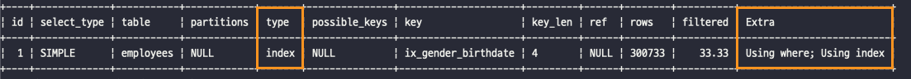
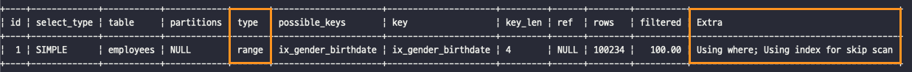
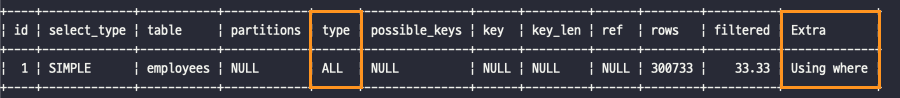
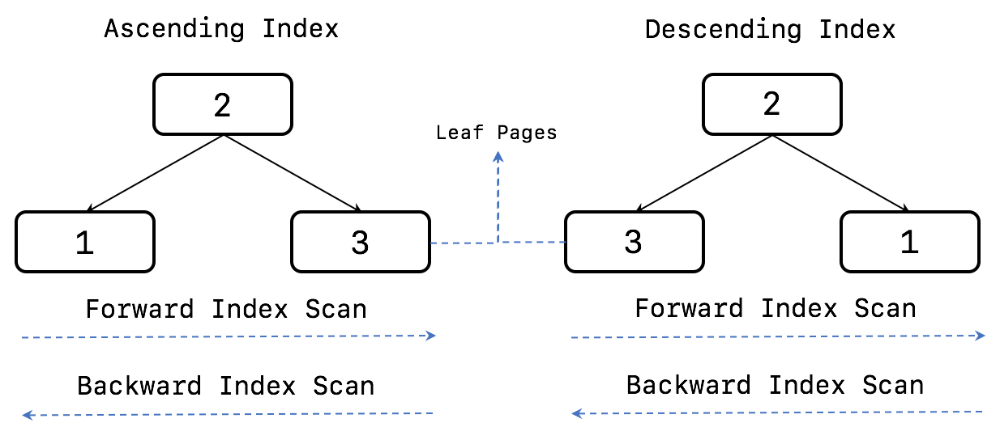

# 8장. 인덱스

[MySQL 8.0 Reference Manual](https://dev.mysql.com/doc/refman/8.0/en/)

[1. 디스크 읽기 방식](#1-디스크-읽기-방식)  
[2. 인덱스란?](#2-인덱스란)  
[3. B-Tree 인덱스](#3-btree-인덱스)  
[4. R-Tree 인덱스](#4-rtree-인덱스)  
[5. 전문 검색(Full Text search) 인덱스](#5-전문-검색full-tex-search-인덱스)  
[6. 함수 기반 인덱스](#6-함수-기반-인덱스)  
[7. 멀티 밸류(Multi-Value) 인덱스](#7-멀티-밸류-multi-value-인덱스)  
[8. 클러스터링 인덱스](#8-클러스터링-인덱스)  
[9. 유니크 인덱스](#9-유니크-인덱스)  
[10. 외래키](#10-외래키)

## 1. 디스크 읽기 방식

### 1.1 HHD와 SSD

- 데이터베이스 서버에서는 항상 디스크 장치가 병목이 된다.
- SSD는 기존 하드 디스크 드라이브에서 데이터 저장용 플래터(원판)를 제거하고 그 대신 **플래시 메모리를 장착**하고 있다.
    - 플래시 메모리는 전원이 공급되지 않아도 데이터가 삭제되지 않는다.
    - 컴퓨터의 메모리(D-Ram)보다는 느리지만 기계식 하드 디스크 드라이브보다는 훨씬 빠르다.

    → 요즘은 DBMS용으로 사용할 서버에 대부분 SSD를 채택하고 있다.
- **순차 I/O 에서는 SSD와 HDD가 거의 비슷한 성능을 보이지만, 랜덤 I/O에서는 SSD가 훨씬 빠르다.**

### 1.2 랜덤 I/O와 순차 I/O

- 디스크의 성능은 디스크 헤더의 위치 이동 없이 얼마나 많은 데이터를 한 번에 기록하느냐에 의해 결정된다고 볼 수 있다.
- 여러 번 쓰기 또는 읽기를 요청하는 랜덤 I/O작업이 부하가 훨씬 더 크다.
- 하지만 순차 I/O라도 파일 동기화 작업이 빈번히 발생하면 랜덤 I/O와 같이 비효율적으로 처리된다.
    - RAID 컨트롤러와 캐시 메모리는 빈번한 파일 동기화 작업이 효율적으로 처리될 수 있도록 한다.
- **일반적으로 쿼리를 튜닝하는 것은 랜덤 I/O 자체를 줄여주는 것이 목적이라고 할 수 있다.**
- 랜덤 I/O를 줄인다는 것은 쿼리를 처리하는 데 꼭 필요한 데이터만 읽도록 쿼리를 개선하는 것을 의미한다.

## 2. 인덱스란?

- **인덱스는 컬럼의 값을 주어진 순서로 미리 정렬해서 보관한다.**
- SortedList는 인덱스와 같은 자료 구조이고, ArrayList는 데이터 파일과 같은 자료 구조를 사용한다.
- **결론적으로 인덱스는 데이터 저장(INSERT, UPDATE, DELTE)성능을 희생하고 대신 읽기(SELECT) 속도를 높이는 기능이다.**  

    → 인덱스를 추가할지 말지는 데이터의 저장 속도를 어디까지 희생할 수 있느지, 읽기 속도를 얼마나 더 빠르게 만들어야 하는냐에 따라 결정해야 한다.


- 인덱스를 역할별 구분

  **프라이머리 인덱스**
    - 테이블에서 해당 레코드를 식별할 수 있는 기준값으로, NULL 값과 중복을 허용하지 않는다.

  **세컨더리 인덱스**
    - 프라이머리 키를 제외한 나머지 모든 인덱스를 세컨더리 인덱스로 분류한다.


- 대표적인 데이터 저장 방식(알고리즘)

  **B-Tree 알고리즘**

    - 컬럼의 값을 변형하지 않고 원래의 값을 이용해 인덱싱하는 알고리즘으로, 가장 일반적으로 사용된다.

  **Hash 알고리즘**

    - 컬럼의 값으로 해시값을 계산해서 인덱싱하는 알고리즘으로, 매우 빠른 검색을 지원한다.
    - 값을 변형해서 인덱싱하므로, 전방 일치와 같이 값의 일부만 검색하거나 범위를 검색할 때는 해시 인덱스를 사용할 수 없다.

## 3. B-Tree 인덱스

- B-Tree는 인덱싱 알고리즘 가운데 가장 먼저 도입되었고, 범용적인 목적으로 사용되는 알고리즘이다.
- B-Tree의 “B”는 Binary의 약자가 아닌 Balanced를 의미한다.
- 일반적으로 DBMS에서는 주로 B+-Tree, B*-Tree가 사용된다.
- **B-Tree는 컬럼의 원래 값을 변형시키지 않고 항상 정렬된 상태로 유지한다.**

### 3.1 구조 및 특성

- B-Tree는 트리 구조의 최상위에 하나의 **루트 노드**가 존재하고, 그 하위에 자식 노트가 있는 형태이다.
    - 트리 구조 상 가장 하위에 있는 노드를 **리프 노드**라고 한다.
    - 루트 노드도 아니고, 리프 노드도 아닌 중간의 노드를 **브랜치 노드**라고 한다.
- InnoDB 테이블에서 레코드는 클러스터되어 디스크에 저장되므로 기본적으로 프라이머리 키 순서로 정렬되어  저정된다.
- 인덱스는 테이블의 키 컬럼만 가지고 있으므로 나머지 컬럼을 읽으려면 데이터 파일에서 해당 레코드를 찾아야 하는데, **리프 노드는 데이터 파일에 저장된 레코드의 주소를 가진다.**
- InnoDB 스토리지 엔진에서는 모든 **세컨더리 인덱스 검색에서 데이터 레코드를 읽기 위해서는 반드시 프라이머리 키를 저장하고 있는 B-Tree를 다시 한번 검색해야 한다.**

### 3.2 B-Tree 인덱스 키 추가 및 삭제

- **테이블의 레코드를 저장하거나 변경하는 경우 인덱스 키 추가나 삭제 작업이 발생한다.**
- B-Tree에 저장될 때는 저장될 키 값을 이용해 B-Tree상의 적절한 위치를 검색해야 한다.
    - 저장될 위치가 결정되면 **키 값**과 **주소 정보**를 리프 노드에 저장된다.
    - 리프 노드가 꽉 차서 저장할 수 없게 되면 리프 노드가 분리(Split)되는데, 이때 상위 브랜치 노드까지 처리의 범위가 넓어진다.

    → 이런 작업 때문에 B-Tree는 상대적으로 쓰기 작업(새로운 키를 추가하는 작업)에 비용이 많이 들게 된다.

    - 인덱스 추가 작업 비용 계산
      ```text
      대략적으로 테이블에 레코드를 추가하는 작업 비용이 `1` 이라면,  인덱스에 키를 추가하는 작업 비용은 `1.5` 정도로 예측한다.
      
      - 테이블에 인덱스가 하나도 없는 경우의 작업 비용 : 1
      - B-Tree 인덱스가 3개 있는 경우의 작업 비용 : (1.5 * 3 + 1) = 5.5
      ```

- InnoDB 스토리지 엔진에서는 필요한 경우 **체인지 버퍼를 이용해서 인덱스 키 추가 작업을 지연시켜 나중에 처리할 수 있다.**
    - 하지만, 프라이머리 키나 유니크 인덱스의 경우, 중복 체크가 필요하기 때문에 즉시 B-Tree에 추가하거나 삭제해야 한다.
- B-Tree에서 키 값을 삭제할 때는 리프 노드에 삭제 마크만 하면 되고, 실제 I/O 작업은 버퍼링되어 지연 처리될 수 있다. (MySQL 5.5 버전부터 가능)
- B-Tree의 키 값이 변경되는 경우에는 인덱스상 키 값만 변경하는 것이 불가능하고, 키 값을 삭제한 후 다시 새로운 키 값을 추가하는 형태로 처리된다.
- **INSERT, UPDATE, DELETE 작업에 따르는 추가 비용을 감안하고 인덱스를 구축하는 이유는 빠른 검색을 위해서 이다.**
    - 인덱스 검색 작업은 루트 노드 → 브랜치 노드 → 리프 노드까지 이동하면서 비교 작업을 수행하는데, 이를 **트리 탐색**이라고 한다.
    - B-Tree 인덱스를 이용한 검색은 100% 일치 또는 값의 일부분만 일치하는 경우에 사용할 수 있다.
    - 부등호 비교 조건에서도 인덱스를 활용할 수 있지만, 인덱스를 구성하는 키 값의 뒷부분만 검색하는 용도로는 인덱스를 사용할 수 없다.
    - 인덱스의 키 값에 변형이 가해진 후 비교되는 경우 B-Tree의 검색 기능을 사용할 수 없다.

      e.g. 함수나 연산을 수행한 결과로 정렬하거나 검색하는 작업은 B-Tree의 장점을 이용할 수 없다.

- InnoDB 스토리지 엔진에서는 레코드 잠금이나 넥스트 키락(갭락)이 검색을 수행한 후, 인덱스를 잠그고 테이블을 잠그는 방식으로 구현되어 있다.
    - 따라서 UPDATE나 DELETE 문장이 실행될 때 테이블에 적절히 사용할 수 있는 인덱스가 없으면 불필요하게 많은 레코드를 잠그게 된다.


### 3.3 B-Tree 인덱스 사용에 영향을 미치는 요소

**인덱스 키 값의 크기**

- *페이지(=블록)*
    - 디스크에 데이터를 저장하는 기본 단위이다.
    - 디스크의 모든 읽기 및 쓰기 작업의 최소 작업 단위이다.
    - 버퍼 풀에서 데이터를 버퍼링하는 기본 단위이다.
- 인덱스는 페이지 단위로 관리되며, 루트, 브랜치, 리프 노드를 구분하는 기준도 페이지 단위이다.
    - 일반적으로 DBMS의 B-Tree는 자식 노드의 개수가 가변적인 구조인데, 페이지 크기와 키 값의 크기에 따라 결정된다. (innodb_page_size : 4KB ~ 64KB. 기본값 16KB)
    - 페이지(16KB)에 저장 가능한 자식 노드 개수 계산

        ```
        인덱스 페이지를 16KB, 자식 노드 주소 영역의 크기를 12Byte라고 가정한 경우
        16 * 1024 / (16 + 12) = 585
        ```

- **인덱스를 구성하는 키 값의 크기가 커지면 디스크로부터 읽어야 하는 횟수가 늘어나고, 그만큼 느려진다.**

**B-Tree 깊이**

- B-Tree 인덱스의 깊이는 상당히 중요하지만 직접 제어할 방법은 없다.
- B-Tree의 깊이는 MySQL에서 값을 검색할 때 몇 번이나 랜덤하게 디스크를 읽어야 하는지와 직결되는 문제이다.
- 결론적으로 인덱스 키 값의 크기가 커지면 커질수록 하나의 인덱스 페이지에 담을 수 있는 개수가 적어지고, 그 때문에 같은 레코드 건수라도 B-Tree의 깊이가 깊어져서 디스크 읽기가 더 많이 필요하게 된다.

  **→ 인덱스 키 값의 크기는 가능하면 작게 만드는 것이 좋다.**

- 실제로는 아무리 대용량 데이터베이스라도 B-Tree의 깊이가 5단계 이상까지 깊어지는 경우는 흔치 않다.

**선택도(기수성)**

- 선택도 또는 기수성은 모든 인덱스 값 가운데 유니크한 값의 수를 의미한다.
- **인덱스는 선택도가 높을수록 검색 대상이 줄어들기 때문에 그만큼 빠르게 처리된다.**

**읽어야 하는 레코드의 건수**

- 인덱스를 통해 테이블의 레코드를 읽는 것은 인덱스를 거치지 않고 바로 테이블의 레코드를 읽는 것보다 높은 비용이 드는 작업이다.

  **→ 인덱스를 이용한 읽기의 손익 분기점이 얼마인지 판단해서 인덱스 사용 여부를 결정해야 한다.**

- 일반적인 DBMS의 옵티마이저에서 인덱스를 사용하는 것이 4~5배 정도 비용이 더 드는 작업으로 예측한다.
    - 100만건의 레코드 중 50만건을 읽어야 하는 작업에서는 인덱스의 손익 분기점인 20~25% 보다 크기 때문에 인덱스를 사용하지 않는 것이 낫다.

### 3.4 B-Tree 인덱스를 통한 데이터 읽기

어떤 경우에 인덱스를 사용할지 판단하려면 인덱스를 이용하는 방법에 대해 알아야 한다.

① **인덱스 레인지 스캔**

- 가장 대표적인 인덱스 접근 방식으로, **검색해야 할 인덱스의 범위가 결정됐을 때 사용하는 방식이다.**
- 해당 인덱스를 구성하는 컬럼의 **정순 또는 역순으로 정렬된 상태로 레코드를 가져온다.**
- 검색 조건에 일치하는 데이터 파일을 읽어오는 과정에서 **레코드 한 건 단위로 랜덤 I/O가 발생한다.**
    - 단, 커버링 인덱스로 처리되는 경우에는 디스크의 레코드를 읽지 않아도 되기 때문에 랜덤 읽기가 줄어들고 성능이 빨라진다.
- 인덱스 레인지 스캔 3단계

    ```
    1. 인덱스에서 조건을 만족하는 값이 저장된 위치를 찾는다. (인덱스 탐색)
    2. 1번에서 탐색된 위치부터 필요한 만큼 인덱스를 차례대로 쭉 읽는다. (인덱스 스캔)
    3. 2번에서 읽어들인 인덱스 키와 레코드 주소를 이용해 레코드가 저장된 페이지를 가져오고, 최종 레코드를 읽어 온다.    
    ```

  → 커버링 인덱스로 처리되는 경우 3번 과정이 필요하지 않게 된다.

- 인덱스 탐색, 인덱스 스캔 실행 횟수 조회

    ```sql
    SHOW STATUS LIKE 'Hnadler_%';
    ```

    - `Handler_read_key` : 인덱스에서 조건을 만족하는 값이 저장된 위치를 탐색한 횟수
    - `Handler_read_next` :  인덱스의 정순으로 읽은 레코드 건 수
    - `Handler_read_prev` :  인덱스의 역순으로 읽은 레코드 건 수

② **인덱스 풀 스캔**

- 인덱스의 처음부터 끝까지 모두 읽는 방식을 인덱스 풀 스캔이라고 한다.
- 대표적으로 쿼리의 조건절에 사용된 컬럼이 인덱스의 첫 번재 컬럼이 아닌 경우 인덱스 풀 스캔 방식이 사용된다.
    - 인덱스가 (A, B, C) 컬럼의 순서대로 만들어져 있을 때, 조건절에서 B컬럼이나 C컬럼으로 검색하는 경우
- 이 방식은 레인지 스캔보다는 빠르지 않지만, 테이블 풀 스캔보다는 효율적이다.

③ **루스 인덱스 스캔**

- 루스 인덱스 스캔이란 말 그대로 느슨하게 또는 듬성듬성하게 인덱스를 읽는 것을 의미한다.
- 루스 인덱스 스캔은 레인지 스캔ㄴ과 비슷하게 작동하지만, **중간에 필요하지 않은 인덱스 키 값은 무시하고 넘어가는 형태로 처리한다.**

    ```sql
    SELECT dept_no, MIN(emp_no)
    FROM dept_emp
    WHERE dep_no BETWEEN 'd002' AND 'd004'
    GROUP BY dept_no;
    ```

    - 인덱스에서 WHERE 조건을 만족하는 범위 전체를 다 스캔할 필요가 없다는 것을 옵티마이저가 알고 있기 때문에 조건에 만족하지 않는 레코드는 무시하고 다음 레코드로 이동한다.

④ **인덱스 스킵 스캔**

- **인덱스의 핵심은 값이 정렬돼 있다는 것이다.**
- 그렇기 때문에 **인덱스를 구성하는 컬럼의 순서가 매우 중요하다.**

    ```sql
    ALTER INDEX employees
    ADD INDEX ix_gender_birthdate (gender, birth_date);
    
    -- (1) 인덱스를 사용하지 못하는 쿼리
    SELECT * FROM employees WHERE birth_date >= '1965-02-01';
    
    -- (2) 인덱스를 사용할 수 있는 쿼리
    SELECT * FROM employees WHERE gender = 'M' AND birth_date >= '1965-02-01';
    ```

    - MySQL 8.0 부터는 옵티마이저가 (1)에서 `birth_date` 컬럼만으로도 인덱스 검색이 가능하게 해준다.
- 인덱스 스킵 스캔은 WHERE 조건절에 포함되지 않은 선행 컬럼에 대해 **인덱스에 존재하는 모든 값을 먼저 추출하고 그 결과를 이용해 인덱스 스킵 스캔을 실행한다.**
    - 인덱스가 사용되지 못한 경우 (**인데스 풀 스캔**)

        ```sql
        SET optimizer_switch = 'skip_scan=off';
        
        EXPLAIN
        SELECT gender, birth_date
        FROM employees
        WHERE birth_date >= '1965-02-01';
        ```

      

    - 인덱스가 사용된 경우 (**인덱스 스킵 스캔**)

        ```sql
        SET optimizer_switch = 'skip_scan=on';
        
        EXPLAIN
        SELECT gender, birth_date
        FROM employees
        WHERE birth_date >= '1965-02-01';
        ```

      


- 인덱스 스킵 스캔의 단점
    - WHERE 조건절에 조건이 없는 인덱스의 선행 컬럼의 유니크한 값의 개수가 적어야 함
    - 쿼리가 인덱스에 존재하는 컬럼만으로 처리 가능해야 함(커버링 인덱스)
    - 모든 컬럼을 조회하는 경우 (**테이블 풀 스캔**)

        ```sql
        EXPLAIN
        SELECT *
        FROM employees
        WHERE birth_date >= '1965-02-01';
        ```

      


### 3.5 다중 컬럼(Multi-column) 인덱스

- 두 개 이상의 컬럼으로 구성된 인덱스를 다중 컬럼 인덱스(또는 복합 인덱스)라고 한다.
- 인덱스의 두 번째 컬럼은 첫 번째 컬럼에 의존해서 정렬된다.

### 3.6 B-Tree 인덱스의 정렬 및 스캔 방향

- 인덱스의 키 값은 항상 오름차순이나 내림차순으로 정렬되어 저장된다.
- 인덱스를 어느 방향으로 읽을지는 쿼리에 따라 옵티마이저가 만들어내는 실행 계획에 따라 결정된다.

**인덱스의 정렬**

- MySQL 8.0 부터는 정렬 순서를 혼합한 인덱스를 생성할 수 있게 되었다.

    ```sql
    CREATE INDEX ix_firstname_lastname ON employee_name (first_name ASC, last_name DESC);
    ```


- 옵티마이저는 인덱스의 읽기 방향을 전환해서 사용하도록 실행계획을 만들어 낸다.
    - 오름차순으로 생성된 인덱스를 정순으로 읽으면 출력되는 결과는 자동으로 오름차순이 되고, 역순으로 읽으면 내림차순으로 정렬된 상태가 된다.

    ```sql
    SELECT * FROM employees WHERE first_name >= 'Anneke'
    ORDER BY first_name ASC LIMIT 4;
    
    SELECT * FROM employees
    ORDER BY first_name DESC LIMIT 5;
    ```


- 인덱스 용어 정리
    - 오름차순 인덱스 : 작은 값의 인덱스가 B-Tree의 왼쪽에 정렬된 인덱스
    - 내림차순 인덱스 : 큰 값의 인덱스가 B-Tree의 왼쪽에 정렬된 인덱스
    - 인덱스 정순 스캔(Forward index scan) : 인덱스의 리프 노드의 왼쪽 페이지부터 오른쪽으로 스캔
    - 인덱스 역순 스캔(Backward index scan) : 인덱스의 리프 노드의 오른쪽 페이지부터 왼쪽으로 스캔

      

- InnoDB에서 내부적으로 인덱스 역순 스캔이 인덱스 정순 스캔에 비해 느린 이유
    - 페이지 잠금이 인덱스 정순 스캔에 적합한 구조이다.
    - 페이지 내에서 인덱스 레코드가 단방향으로만 연결된 구조이다.
- **쿼리에서 자주 사용되는 정렬 순서대로 인덱스를 생성하는 것이 인덱스의 페이지 잠금에 대한 병목을 완화하는데 도움이 된다.**

### 3.7 B-Tree 인덱스의 가용성과 효율성

- `WHERE`, `GROUP BY`, `ORDER BY` 절에서 어떤 경우에 인덱스를 사용할 수 있고, 어떤 방식으로 사용할 수 있는지 식별할 수 있어야 한다.

**비교 조건**

- 복합 인덱스에서 각 컬럼의 순서에 따라서 동등(=) 비교, 범위(부등호) 비교 조건인지에 따라 인덱스 컬럼의 활용 형태와 효율이 달라진다.

    ```sql
    SELECT * FROM dept_emp
    WHERE dept_no = 'd002' AND emp_no >= 10114
    ```

    - 케이스 A: INDEX(dept_no, emp_no)

      `dept_no = 'd002' AND emp_no >= 10114` 인 레코드를 찾으면 그 이후에는 dept_no가 'd002'이 아닐 때 까지 쭉 읽으면 된다.

    - 케이스 B: INDEX(emp_no, dept_no)

      `emp_no >= 10114 AND dept_no = 'd002'` 인 레코드를 찾고, 그 이후 모든 레코드에 대해  dept_no가 'd002'인지 확인해야 한다.

- 이처럼 인덱스를 통해 읽은 레코드가 나머지 조건에 맞는지 비교하면서 취사선택하는 작업을 ‘필터링'이라고도 한다.
    - 케이스 A 인덱스에서는 `dept_no = 'd002'`, `emp_no >= 10114` 모두 작업의 범위를 결정하는 **작업 범위 결정 조건** 이다.
    - 케이스 B 인덱스에서는 `emp_no >= 10114` 조건은 **작업 범위 조건**이지만, `dept_no = 'd002'` 조건은 작업의 범위를 줄이지 못하고 단순히 거름종이 역할만 하는 **필터링 조건(=체크 조건)** 이다.
- **작업 범위를 결정하는 조건은 많으면 많을수록 쿼리의 처리 성능을 높이지만 체크 조건은 많다고 해서 쿼리의 성능을 높이지는 못한다.**

**인덱스의 가용성**

- B-Tree 인덱스의 특징은 왼쪽 값에 기준해서 오른쪽 값이 정렬된다는 것이다.
- 정렬 우선순위가 낮은 뒷부분의 값으로 왼쪽 기준 정렬 인덱스인 B-Tree 인덱스의 효과를 얻을 수 없다.

    ```sql
    SELECT * FROM employees WHERE first_name LIKE '%mer';
    ```

- 인덱스의 왼쪽 값 기준 규칙은 `WHERE` 절뿐만 아니라 `GROUP BY`, `ORDER BY` 절에도 똑같이 적용된다.

**인덱스 사용 불가 조건**

다음의 조건에서 인덱스를 작업 범위 결정 조건으로 사용할 수 없다.

- NOT_EQUAL로 비교된 경우 (<>, NOT IN, NOT BETWEEN, IS NOT NULL)
    - `... WHERE column <> 'N'`
    - `... WHERE column NOT IN (10, 11, 12)`
    - `... WHERE column IS NOT NULL`
- LIKE ‘%??’ (뒷부분 일치) 형태로 문자열 패턴이 비교된 경우
    - `... WHERE column LIKE '%하늘'`,
    - `... HERE column LIKE '%하%'`
- 스토어드 함수나 다른 연산자로 인덱스 컬럼이 변형된 후 비교된 경우
    - `... WHERE SUBSTRING(column, 1, 1) = 'X'`
- NOT_DETERMINISTIC 속성의 스토어드 함수가 비교 조건에 사용된 경우
    - `... WHERE column = deterministic_function()`
- 데이터 타입이 서로 다른 경우 비교(인덱스 컬럼의 타입을 변환해야 비교가 가능한 경우)
    - `... WHERE char_column = 10`
- 문자열 데이터 타입의 콜레이션이 다른 경우
    - `... WHERE uft8_bin_char_column = euckr_bin_char_column`

**인덱스 NULL 포함**

- 다른 DBMS에서는 `NULL` 값이 인덱스에 저장되지 않지만, MySQL에서는 NULL 값도 인덱스에 저장된다.
    - 따라서 `... WHERE column IS NULL`은 작업 범위 결정 조건으로 인덱스를 사용할 수 있다.

**복합 인덱스 사용 조건**

```sql
INDEX ix_text (column_1, column_2, column_3, .. , column_n)
```

- 작업 범위 결정 조선으로 인덱스를 사용하지 못하는 경우
    - column_1 컬럼에 대한 조건이 없는 경우
    - column_1 컬럼의 비교 조건이 인덱스 사용 불가 조건 중 하나인 경우
- 작업 범위 결정 조건으로 인덱스를 사용하는 경우 (i는 2보다 크고 n보다 작은 임의의 값을 의미)
    - column_1 ~column_(i-1) 컬럼까지 동등 비교 형태(`=` 또는 `IN`)로 비교하는 경우
    - column_i 컬럼에 대해 다음 연산자 중 하나로 비교하는 경우
        - 동등 비교 (`=` 또는 `IN`)
        - 크다, 작다 (`>` 또는 `<`)
        - LIKE로 앞부분 일치 패턴 (`LIKE '강하%'`)

## 4. R-Tree 인덱스

- 공간 인덱스는 R-Tree 인덱스 알고리즘을 이용해 2차원의 데이터를 인덱싱하고 검색하는 목적의 인덱스이다.
- B-Tree는 인덱스를 구성하는 컬럼의 값이 1차원의 스칼라 값인 반면, R-Tree는 2차원의 공간 개념 값이다.
- MySQL의 공간 확장 기능
    - 공간 데이터를 저장할 수 있는 **데이터 타입**
    - 공간 데이터의 검색을 위한 공간 인덱스(**R-Tree 알고리즘**)
    - 공간 데이터의 **연산 함수**(거리 또는 포함 관계의 처리)

### 4.1 **구조 및 특성**

- MySQL은 공간 정보의 저장 및 검색을 위해 여러가지 기하학적 도형(Geometry) 정보를 관리할 수 있는 데이터 타입을 제공한다.
    - `POINT`, `LINE`, `POLYGON`, `GEOMETRY`
    - GEOMETRY 타입은 나머지 3개 타입의 슈퍼 타입이다.
- MBR이란 Minimun Bounding Rectangle의 약자로, 도형을 감싸는 최소 크기의 사각형이다.

### 4.2 R-Tree 인덱스의 용도

- WGS84(GPS) 기준의 위도, 경도 좌표 저장에 주로 사용된다.
- CAD/CAM 소프트웨어 또는 회로 디자인 등 좌표 시스템에 기반을 둔 정보에서 모두 적용할 수 있다.
- 대표적으로는 “현재 사용자의 위치로부터 반경 5km 이내의 음식점 검색” 등과 같은 검색에 사용할 수 있다.
- 공간 함수
    - `ST_Contains()`, `ST_Within()`, `ST_Distance()`, `ST_Distance_Sphere()` 등
    - `ST_Distance()`와 `ST_Distance_Sphere()` 함수는 공간 인덱스를 효율적으로 사용하지 못하기 때문에 공간 인덱스를 사용할 수 있는 `ST_Contains()` 또는  `ST_Within()` 을 이용해서 거리 기반의 검색을 해야 한다.

## 5. 전문 검색(Full Text search) 인덱스

- 특정 키워드가 포함된 문서를 검색하는 전문(Full Text) 검색에는 일반적인 용도의 B-Tree 인덱스를 사용할 수 없다.
- 문서 전체에 대한 분석과 검색을 위한 인덱싱 알고리즘을 전문 검색(Full Text search) 인덱스라고 한다.

### 5.1 인덱스 알고리즘

- 전문 검색은 문서의 본문 내용에서 사용자가 검색하는 키워드를 분석하여, 빠른 검색용으로 사용할 수 있게 **키워드로 인덱스를 구축한다.**
- 전문 검색 인덱스는 크게 단어의 어근 분석과 n-gram 분석 알고리즘으로 구분할 수 있다.

**어근 분석 알고리즘**

- 전문 검색 인덱스는 두 가지 중요한 과정을 거쳐서 색인 작업이 수행된다.

  **불용어 처리**

    - 검색에서 별 가치가 없는 단어를 필터링해서 제거하는 작업이다.
    - 불용어 처리는 상수로 정의해서 사용하거나 데이터베이스화해서 사용자가 추가하거나 삭제할 수 있게 구현할 수 있다.

        ```sql
        SELECT * FROM information_schema.innodb_ft_default_stopword;
        ```

    **어근 분석** 
    
    - 검색어로 선정된 단어의 뿌리인 원형을 찾는 작업이다.
    - 어근 분석은 각 국가의 언어별로 문법이 다르기 때문에 형태소 분석이나 어근 분석 또한 언어별로 방식이 모두 다르다.
    - 단어 사전 구축과, 문장의 구조 인식(문장을 해체해서 각 단어의 품사를 식별)이 필요한데, 이를 위해 언어를 학습하는 과정을 거쳐야 하므로 상당한 시간이 필요한 작업이다.

**n-gram 알고리즘**

- n-gram은 단순히 키워드를 검색해내기 위한 인덱싱 알고리즘이다.
- n-gram이란 본문을 무조건 몇 글자씩 잘라서 인덱싱하는 방법이다.
- n-gram에서 n은 인덱싱할 키워드의 최소 글자 수를 의미하고, 일반적으로 2-gram 방식이 많이 사용된다.

**불용어 변경 및 삭제**

1. MySQL 서버의 모든 전문 검색 인덱스에 대해 불용어를 완전히 제거

   my.cnf 파일 : `ft_stopword_file = ''`

2. 테이블의 전문 검색 인덱스에 대해서만 불용어 처리를 무시
   `SET GLOBAL innodb_ft_enable_stopword = OFF;`

**사용자 정의 불용어 사용**

1. 불용어 목록 설정
    - my.cnf 파일 : `ft_stopword_file = '/data/my_custom_stopword.txt'`
2. 불용어 목록을 테이블에 저장

    ```sql
    CREATE TABLE my_stopword(
    		value VARCHAR(30)
    ) ENGINE = INNODB;
    INSERT INTO my_stopword(value) VALUES ('MySQL');
    
    SET GLOBAL innodb_ft_server_stopword_table = 'mydb/my_stopword';
    
    ALTER TABLE tb_bi_gram 
    	ADD FULLTEXT INDEX fx_title_body(title, body) WITH PARSER ngram;
    ```

    - 이때 불용어 목록을 변경한 이후 전문 검색 인덱스가 생성되어야 변경된 불용어가 적용된다.


### 5.2 전문 검색 인덱스의 가용성

- 전문 검색 인덱스를 사용하려면 반드시 아래의 두 가지 조건을 갖추어야 한다.
    - 쿼리 문장이 **전문 검색을 위한 문법**을 사용 : `MATCH … AGAINST …`
    - 테이블이 전문 검색 대상 컬럼에 대해서 **전문 인덱스 보유**
    
    ```sql
    CREATE TABLE tb_test (
        doc_id INT,
        doc_body TEXT,
        PRIMARY KEY (doc_id),
        FULLTEXT KEY fx_docbody (doc_body) WITH PARSER ngram
    ) ENGINE = InnoDB;
    
    -- 풀 테이블 스캔
    SELECT * FROM tb_test WHERE doc_body LIKE '%애플%';
    
    -- 전문 검색 인덱스 사용
    SELECT * FROM tb_test WHERE MATCH(doc_body) AGAINST('애플' IN BOOLEAN MODE);
    ```

## 6. 함수 기반 인덱스

- 컬럼의 값을 변형해서 만들어진 값에 대해 인덱스를 구축하는 경우 함수 기반의 인덱스를 활용하면 된다.
- MySQL 8.0 부터 함수 기반 인덱스를 지원한다.
- 함수 기반 인덱스를 구축하는 방법
    - 가상 컬럼을 이용한 인덱스
    - 함수를 이용한 인덱스

### 6.1 가상 컬럼을 이용한 인덱스

- 컬럼을 새로 추가하지 않고, 가상 컬럼을 사용해서 인덱스를 생성하는 경우에 사용한다.
- 가상 컬럼은 테이블에 새로운 컬럼을 추가하는 것과 같은 효과를 내기 때문에 실제 테이블의 구조가 변경된다는 단점이 있다.

    ```sql
    CREATE TABLE user_a(
       user_id BIGINT,
       first_name VARCHAR(10),
       last_name VARCHAR(10),
       PRIMARY KEY (user_id)
    )
    
    INSERT INTO user_a VALUES (1, 'Matt', 'Lee');
    
    ALTER TABLE user_a
       ADD full_name VARCHAR(30) AS (CONCAT(first_name,' ',last_name)) VIRTUAL
       ADD INDEX ix_fullname (full_name);
    
    EXPLAIN 
    SELECT * FROM user_a WHERE full_name = 'Matt Lee';
    ```


### 6.2 함수를 이용한 인덱스

- 테이블의 구조를 변경하지 않고, 함수를 직접 사용하는 인덱스이다.
- 함수 기반 인덱스를 제대로 활용하려면 반드시 조건절에 함수 기반 인덱스에 명시된 표현식이 그대로 사용되어야 한다.

    ```sql
    CREATE TABLE user_b(
       user_id BIGINT,
       first_name VARCHAR(10),
       last_name VARCHAR(10),
       PRIMARY KEY (user_id),
       INDEX ix_fullname ((CONCAT(first_name,' ',last_name)))
    );
    
    INSERT INTO user_b VALUES (1, 'Matt', 'Lee');
    
    EXPLAIN 
    SELECT * FROM user_b WHERE CONCAT(first_name,' ',last_name) = 'Matt Lee';
    ```


## 7. 멀티 밸류(Multi-Value) 인덱스

- 전문 검색 인덱스를 제외한 모든 인덱스는 레코드 1건이 1개의 인덱스 키 값을 가진다. (1:1 관계)
- 멀티 밸류 인덱스의 경우 하나의 레코드가 여러 개의 키 값을 가질 수 있는 인덱스이다.
    - 최근 RDBMS들이 JSON 데이터 타입을 지원하기 시작하면서 JSON 배열 타입의 필드에 저장된 원소들에 대한 인덱스 요건이 발생했기 때문이다.
- 멀티 밸류 인덱스를 활용하기 위해서는 아래의 함수를 이용해야 옵티마이저가 인식한다.
    - `MEMBER OF()`
    - `JSON_CONTAINS()`
    - `JSON_OVERLAPS()`
    
    ```sql
    CREATE TABLE user_multi(
        user_id BIGINT AUTO_INCREMENT PRIMARY KEY ,
        first_name VARCHAR(10),
        last_name VARCHAR(10),
        credit_info JSON,
        INDEX mx_creditscores ((CAST(credit_info->'$.credit_scores' AS UNSIGNED ARRAY)))
    );
    
    INSERT INTO user_multi VALUES (1, 'Matt', 'Lee', '{"credit_scores":[360, 353, 351]}');
    
    SELECT * FROM user_multi WHERE 360 MEMBER OF (credit_info-> '$.credit_scores');
    ```
    
## 8. 클러스터링 인덱스

- 클러스터링은 테이블의 레코드를 비슷한 것(프라이머리 키를 기준으로)들끼리 묶어서 저장하는 형태로 구현된다.

### 8.1 클러스터링 인덱스

- 클러스터링 인덱스는 테이블의 프라이머리 키에 대해서만 적용된다.
    - 중요한 점은 **프라이머리 키 값에 의해 레코드의 저장 위치가 결정된다는 것이다.**
    - 또한, **프라이머리 키 값이 변경되면 그 레코드의 물리적인 저장 위치가 바뀌어야 함을 의미한다.**

  → 따라서 프라이머리 키는 신중하게 결정해야 한다.

- 클러스터링 인덱스로 저장되는 테이블은 프라이머리 키 기반 검색이 매우 빠지만, 레코드 저장과 프라이머리 키의 변경에는 상대적으로 느리다.

- 프라이머리 키를 선택하는 우선순위

    ① 프라이머리 키가 있으면 기본적으로 프라이머리 키를 클러스터링 키로 선택

    ② NOT NULL 옵션의 유니크 인덱스 중 첫 번째 인덱스를 클러스터링 키로 선택

    ③ 자동으로 유니크한 값을 가지도록 증가되는 컬럼을 내부적으로 추가한 후, 클러스터링 키로 선택

  → 자동으로 추가된 프라이머리 키는 사용자에게 노출되지 않으며, 쿼리 문장에 사용할 수 없으므로 가능하면 명시적으로 프라이머리 키를 생성하자.


### 8.2 세컨더리 인덱스에 미치는 영향

- 클러스터링되지 않은 테이블
    - MYISAM 이나 MEMORY 테이블 같은 클러스터링되지 않은 테이블은 INSERT 될 때 처음 저장된 공간에서 절대 이동하지 않는다.
    - 데이터 레코드가 저장된 주소는 내부적인 레코드 아이디 (ROWID) 역할을 한다.
    - 프라이머리 키나 세컨더리 인덱스의 각 키는 ROWID 주소를 이용해 실제 데이터 레코드를 찾아오기 때문에 프라이머리 키와 세컨더리 인덱스는 구조적으로 아무런 차이가 없다.
- 클러스터링 테이블
    - InnoDB 테이블의 모든 세컨더리 인덱스는 해당 레코드가 저장된 주소가 아니라 프라이머리 키 값을 저장한다.
    - 클러스터링 키 값이 변경될 때마다 데이터 레코드의 주소가 변경되면, 해당 테이블의 모든 인덱스에 저장된 주소 값도 변경해야 해서 오버헤드가 발생하기 때문이다.

### 8.3 클러스터링 인덱스의 장점과 단점

- 장점
    - 프라이머리 키로 검색할 때 성능이 매우 빠름
    - 모든 세컨더리 인덱스가 프라이머리 키를 가지고 있기 때문에 인덱스만으로 처리 가능한 경우가 많음 (커버링 인덱스)
- 단점
    - 클러스터링 키 값의 크기가 클 경우 전체적으로 인덱스의 크기가 커짐
    - 세컨더리 인덱스를 통해 검색할 때 프라이머리 키로 다시 한번 검색하므로 처리 성능이 느림
    - `INSERT` 할 때 프라이머리 키에 의해 레코드 저장 위치가 결정되기 때문에 처리 성능이 느림
    - 프라이머리 키를 변경할 때 `DELETE`와 `INSERT` 작업이 필요하기 때문에 처리 성능이 느림

### 8.4 클러스터링 테이블 사용 시 주의사항

**클러스터링 인덱스 키의 크기**

- 클러스터링 테이블의 경우 모든 세컨더리 인덱스가 프라이머리 키 값을 포함한다.
- 그래서 프라이머리 키의 크기가 커지면 세컨더리 인덱스도 자동으로 크기가 커진다.

    | 프라이머리 키 크기 | 레코드당 증가하는 인덱스 크기 | 100만 건 레코드 저장시 증가하는 인덱스 크기 |
    | --- | --- | --- |
    | 10바이트 | 10바이트 * 5 = 50바이트 | 50바이트 * 1,000,000 = 47MB |
    | 50바이트 | 50바이트 * 5 = 250바이트 | 250바이트 * 1,000,000 = 238MB |

**프라이머리 키는 AUTO-INCREMENT 보다는 업무적인 컬럼으로 생성**

- 컬럼의 크기가 크더라도 업무적으로 해당 레코드를 대표할 수 있다면 프라이머리 키로 설정하는 것이 좋다.

**프라이머리 키는 반드시 명시할 것**

- AUTO_INCREMENT 컬럼이라도 프라이머리 키를 생성하는 것을 권장한다.
- 프라이머리 키를 정의하지 않으면 내부적으로 일련번호 컬럼을 자동으로 추가하는데, 이렇게 추가된 컬럼은 사용자가 접근할 수 없다.
- 또한, ROW 기반의 복제나 InnoDB Cluster에서 프라이머리 키를 가져야만 정상적인 복제 성능을 보장한다.

**AUTO-INCREMENT 컬럼을 인조 식별자로 사용할 경우**

- 여러 개의 컬럼이 복합으로 프라이머리 키가 만들어지는 경우 프라이머리 키의 크기가 길어진다.
- 프라이머리 키의 크기가 길더라도 세컨더리 인덱스가 필요하지 않다면 프라이머리 키를 사용하는 것이 좋다.
- 하지만 세컨더리 인덱스도 필요하고, 프라이머리 키의 크기도 길다면 AUTO-INCREMENT 컬럼을 추가해서 프라이머리 키로 설정하는 것이 좋다.
    - 프라이머리 키를 대체하기 위해 인위적으로 추가된 프라이머리 키를 인조 식별자라고 한다.

## 9. 유니크 인덱스

- 유니크 인덱스는 인덱스라기보다는 제약조건에 가깝다.
- MySQL에서는 인덱스 없이 유니크 제약만 설정할 방법이 없다.
- 유니크 인덱스에 `NULL`도 저장될 수 있고, `NULL`은 특정 값이 아니므로 2개 이상 저장될 수 있다.

### 9.1 유니크 인덱스와 일반 세컨더리 인덱스의 비교

- 유니크 인덱스와 일반 세컨더리 인덱스는 사실 인덱스의 구조상 아무런 차이점이 없다.

**인덱스 읽기**

- 유니크 인덱스가 더 빠르다고 생각하지만, 성능상 영향이 거의 없다.
    - 세컨더리 인덱스는 중복을 허용하기 때문에 읽어야 할 레코드가 많아서 느린 것이지, 인덱스 자체의 특성 때문에 느린 것은 아니다.
    - 세컨더리 인덱스의 한번 더 해야하는 작업은 디스크 읽기가 아니라 CPU에서 럼을 비교하는 작업이기 때문에 성능상 영향이 거의 없다.
    - 따라서 읽어야할 레코드 수가 같다면 성능 차이는 미미하다.

**인덱스 쓰기**

- 유니크 인덱스의 키 값을 쓸 때는 중복된 값이 있는지 없는지 체크하는 과정이 한 단계 더 필요하다.
- 그래서 유니크하지 않은 세컨더리 인덱스의 쓰기보다 느리다.
- 유니크 인덱스에서 중복된 값을 체크할 때는 읽기 잠금을 사용하고, 쓰기를 할 때는 쓰기 잠금을 사용하는데, 이 과정에서 **데드락이 빈번히 발생한다.**
- 유니크 인덱스는 반드시 중복 체크를 해야 하므로 작업 체인지 버퍼를 사용하지 못한다.

### 9.2 유니크 인덱스 사용 시 주의사항

- 성능이 더 좋아질 것으로 생각하고 불필요하게 유니크 인덱스를 생성하는 것은 좋지 않다.
- 유니크 인덱스와 일반 인덱스는 같은 역할을 하므로 중복해서 설정할 필요는 없다.
- 같은 컬럼에 프라이머리 키와 유니크 인덱스를 설정하는 것은 불필요한 중복이다.
- 유일성이 꼭 보장되어야 하는 컬럼에 대해서는 유니크 인덱스를 생성하되, 꼭 필요하지 않다면 세컨더리 인덱스를 생성하는 방법을 고려해보자.

## 10. 외래키

- MySQL에서 외래키는 InnoDB 스토리지 엔진에서만 생성할 수 있다.
- 외래키 제약이 설정되면 자동으로 연관되는 테이블의 컬럼에 인덱스까지 생성된다.
- 외래키가 제거되지 않은 상태에서는 자동으로 생성된 인덱스를 삭제할 수 없다.
- 외래키 관리
    - 테이블의 변경(쓰기 잠금)이 발생하는 경우에만 잠금 경합(잠금 대기)이 발생한다.
    - 외래키와 연관되지 않은 컬럼의 변경은 최대한 잠금 경합(잠금 대기)을 발생시키지 않는다.

**자식 테이블의 변경이 대기하는 경우**

- 자식 테이블의 외래 키 칼럼의 변경(INSERT, UPDATE)은 부모 테이블의 확인이 필요하다.
- 부모 테이블의 해당 레코드가 쓰기 잠금이 걸려 있으면 쓰기 잠금이 해제될 때까지 기다린다.
- 자식 테이블의 외래키가 아닌 칼럼의 변경은 외래키로 인한 잠금 확장이 발생하지 않는다.

**부모 테이블의 변경이 대기하는 경우**

- 자식 테이블이 생성될 때 외래키 특성(`ON DELETE CASCADE`)을 정의할 수 있다.
- 이때, 자식 테이블의 레코드를 변경한 뒤 부모 테이블의 레코드를 삭제하려면 자식 테이블의 쓰기 잠금이 해제될 때까지 기다려야 한다.

## Reference

- [[자료구조] B-트리(B- Tree)란? B트리 그림으로 쉽게 이해하기, B트리 탐색, 삽입, 삭제 과정](https://code-lab1.tistory.com/217)
