# 9장 옵티마이저와 힌트

- salaries > ix_salary 인덱스 스캔 salary > 150000 보다 큰 사원 검색 employees 테이블과 조인조인결과를 임시 테이블에 저장임시 테이블 저장 결과에서 emp_no 기준으로 중복 제거중복 제거 후 남은 레코드 반환
- MySQL에서 쿼리를 최적으로 실행하기 위해 각 테이블의 데이터가 어떤 분포로 저장돼 있는지 통계 정보를 참조하여, 그러한 기본 데이터를 비교해 최적의 실행 계획을 수립하는 작업이 필요한데 옵티마이저가 이러한 기능을 담당한다.

## 9.1 개요

### 9.1.1 쿼리 실행 절차

- MySQL 서버에서 쿼리가 실행되는 과정
    1. 사용자로부터 요청된 SQL 문장을 쪼개서 MySQL 서버가 이해할 수 있는 수준으로 분리(파스트리) 한다.
    2. SQL의 파싱 정보(파스 트리)를 확인하면서 어떤 테이블로부터 읽고 어떤 인덱스를 이용해 테이블을 읽을지 선택한다.
    3. 두 번째 단계에서 결정된 테이블의 읽기 순서나 선택된 인덱스를 이용해 스토리지 엔진으로부터 데이터를 가져온다.

### 9.1.2 옵티마이저의 종류

- 옵티마이저는 데이터베이스 서버에서 두뇌와 같은 역할을 담당한다.
- 옵티마이저의 종류
    - 규칙 기반 최적화
        - 옵티마이저에 내장된 우선순위에 따라 실행 계획을 수립
        - 현재는 거의 사용 X
    - 비용 기반 최적화
        - 실행 계획별 비용을 산출하고, 비용이 최소로 소요되는 처리 방식을 선택해 쿼리를 실행
        - 현재 대부분의 DBMS가 선택하고 있는 방식

## 9.2 기본 데이터 처리

### 9.1.2 풀 테이블 스캔과 풀 인덱스 스캔

- 옵티마이저가 풀테이블 스캔을 선택하는 조건
    - 테이블의 레코드 건수가 너무 작아서 인덱스를 통해 읽는 것 보다 풀 테이블 스캔을 하는 편이 빠른 경우 (8.3.3.4 절 참고)
    - WHERE 절이나 ON 절에 인덱스를 이용할 수 있는 적절한 조건이 없는 경우
    - 인덱스 레인지 스캔을 사용할 수 있는 쿼리라고 하더라도 옵티마이저가 판단한 조건 일치 레코드 건수가 너무 많은 경우 (8.3.3.4 절 참고)
- 풀 테이블 스캔은 상당히 많은 디스크 읽기가 필요하기 때문에 DBMS는 풀 테이블 스캔을 실행할때 한꺼번에 여러 개의 블록이나 페이지를 읽어오는 기능을 내장
- InnoDB 스토리지 엔진에서는 특정 테이블의 연속된 데이터 페이지가 읽히면 백그라운드 스레드에 의해 리드 어헤드 작업이 자동으로 시작된다.
- 리드 어헤드란 어떤 영역의 데이터가 앞으로 필요해 지리라는 것을 예측해서 요청이 오기전에 미리 디스크에 읽어서 버퍼 풀에 가져다 두는 것을 의미한다.
- `innodb_read_ahead_threshold` 시스템 변수를 이용해 리드어헤드를 언제 시작할지 임계값을 설정할 수 있다.
- 리드 어헤드는 풀 테이블 스캔 뿐 아니라 풀인덱스 스캔에도 동일하게 사용됨.
    
    ```sql
    SELECT COUNT(*) FROM employees; -- 풀 인덱스 스캔
    SELECT * FROM employees; -- 풀 테이블 스캔
    ```
    

### 9.2.2 병렬 처리

- MySQL 8.0 부터 용도가 한정돼 있긴 하지만 쿼리의 병렬처리가 가능해짐. (하나의 쿼리를 여러개의 스레드에서 동시 처리)
- `innodb_parallel_read_threads` 시스템 변수를 이용해 하나의 쿼리를 최대 몇 개의 스레드를 이용해서 처리할지를 변경할 수 있다.
- 아무런 WHERE 조건 없이 단순히 테이블의 전체 건수를 가져오는 쿼리만 병렬로 처리할 수 있다.
    장
    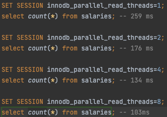
    
- 병렬 처리용 스레드 개수를 아무리 늘리더라도 서버에 장착된 CPU의 코어 개수를 넘어서는 경우에는 오히려 성능이 떨어질 수도 있으니 주의

### 9.2.3 ORDER BY 처리(Using filesort)

- 정렬을 처리하는 방법은 다음과같이 나뉜다.

|  | 장점 | 단점 |
| --- | --- | --- |
| 인덱스 이용 | - INSERT, UPDATE, DELETE 쿼리가 실행될 때 이미 인덱스가 정렬돼 있어서 순서대로 읽기만 하면 되므로 매우 빠르다.  | - INSERT, UPDATE, DELETE 작업 시 부가적인 인덱스 추가/삭제 작업이 필요하므로 느리다.
- 인덱스 떄문에 디스크 공간이 더 많이 필요하다.
- 인덱스의 개수가 늘어날수록 InnoDB 버퍼 풀을 위한 메모리가 많이 필요하다. |
| Filesort 이용 | - 인덱스를 생성하지 않아도 되므로 인덱스를 이용할 때 단점이 장점으로 바뀐다.
- 정렬해야 할 레코드가 많지 않으면 메모리에서 Filesort가 처리되므로 충분히 빠르다. | - 정렬 작업이 쿼리 실행 시 처리되므로 레코드 대상건수가 많아질수록 쿼리의 응답 속도가 느리다. |
- 레코드를 정렬하기 위해 항상 Filesort 라는 정렬 작업을 거쳐야하는 것은 아니지만 모든 정렬을 인덱스로 이용하도록 튜닝하기는 거의 불가능하다.
- MySQL 서버에서 인덱스를 이용하지 않고 별도의 정렬 처리를 수행했는지는 실행 계획의 Extra 칼럼에 Using filesort 메시지가 표시되는지 여부로 판단할 수 있다.

**9.2.3.1 소트 버퍼**

- MySQL은 정렬을 수행하기 위해 별도의 메모리 공간을 할당받아 사용하는데, 이 메모리 공간을 소트 버퍼라고 한다.
- 소트 버퍼는 정렬이 필요한 경우에만 할당되며, 버퍼의 크기는 정렬해야할 레코드의 크기에 따라 가변적으로 증가하지만 최대 사용 가능한 소트 버퍼의 공간은 `sort_buffer_size`라는 시스템 변수로 설정할 수 있다.
- 소트 버퍼를 위한 메모리 공간은 쿼리의 실행이 완료되면 즉시 시스템으로 반납된다.
- 정렬이 문제가 되는 이유
    - 정렬해야할 레코드의 건수가 소트 버퍼로 할당된 공간보다 클 경우 MySQL은 정렬해야할 레코드를 여러 조각으로 나눠서 처리하는데, 이 과정에서 결과에 대한 임시 저장을 위해 디스크를 사용한다.
    - 각 버퍼 크기만큼 정렬된 레코드를 다시 병합하면서 정렬을 수행, 이 작업을 멀티 머지라 표현한다.
    - 이러한 작업들이 모두 디스크 읽기 쓰기를 유발한다.
- `sort_buffer_size` 시스템 변수를 크게 설정하면 메모리에서 모두 처리 되니 빨라질 것으로 예상하지만 실제론 그렇지 않다. 리눅스 계열의 운영체제에서는 `sort_buffer_size` 를 너무 크게 사용하는 경우 큰 메모리 공간 할당 때문에 성능이 훨씬 떨어질 수도 있다.
- 저자 경험상 일반적인 트랜잭션 처리용 소트 버퍼 크기는 56KB 에서 1MB 미만이 적절해 보인다.
- 소트 버퍼는 세션 메모리 영역에 해당된다. 커넥션이 많으면 많을수록, 정렬 작업이 많으면 많을수록 소트 버퍼로 소비되는 메모리 공간이 커짐을 의미한다.

**9.2.3.2 정렬 알고리즘**

- 레코드를 정렬할 때 레코드 전체를 소트 버퍼에 담을지 또는 정렬 기준 칼럼만 소트 버퍼에 담을지에 따라 “싱글 패스” 와 “투 패스” 2가지 정렬 모드로 나눌수 있다. 쿼리가 어떤 정렬 모드를 사용하는지는 옵티마이저 트레이스 기능으로 확인할 수 있다.
    
    // TODO 실습
    
- MySQL 서버의 정렬 방식은 다음과 같이 3가지가 있다.
    - <sort_key, rowid>: 정렬 키와 레코드의 로우아이디만 가져와서 정렬하는 방식 (투패스)
    - <sort_key, additional_fields>: 정렬 키와 레코드 전체를 가져와서 정렬하는 방식으로, 레코드의 칼럼들은 고정 사이즈로 메모리 저장 (싱글패스)
    - <sort_key, packed_additional_fields>: 정렬 키와 레코드 전체를 가져와서 정렬하는 방식으로, 레코드의 칼럼들은 가변 사이즈로 메모리 저장 (싱글패스)

**9.2.3.2.1 싱글패스 정렬 방식**

- 소트 버퍼에 정렬 기준 칼럼을 포함해 SELECT 대상이 되는 칼럼 전부를 담아서 정렬을 수행하는 정렬방식
    
    ```sql
    SELECT emp_no, first_name, last_name
    FROM employees
    ORDER BY first_name; -- 인덱스 emp_no(pk), first_name
    ```
    

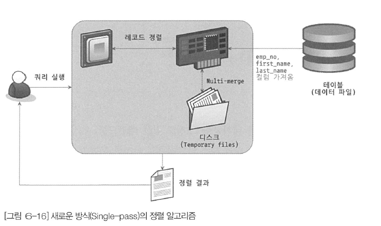

- 정렬에 필요하지 않은 last_name까지 전부 읽어서 소트 버퍼에 담고 정렬을 수행한다. 그리고 정렬이 완료되면 정렬 버퍼의 내용을 그대로 클라이언트에 넘겨준다.
- 투 패스 방식에 비해 더 많은 소트 버퍼 공간이 필요하다.
- 최신 버전에서는 일반적으로 싱글 패스 정렬 방식을 주로 사용한다.
- 싱글 패스 방식은 정렬 대상 레코드의 크기나 건수가 작은 경우 빠른 성능을 보인다.

**9.2.3.2.2 투 패스 정렬 방식**

- 정렬 대상 칼럼과 프라이머리 키 값만 소트 버퍼에 담아서 정렬을 수행하고, 정렬된 순서대로 다시 프라이머리 키로 테이블을 읽어서 SELECT할 칼럼을 가져오는 정렬 방식으로 싱글패스 정렬 방식이 도입되기 이전부터 사용하던 방식
- 테이블을 두 번 읽어야 하기 때문에 싱글패스에 비해 상당히 불합리하다.
- 투 패스 방식은 정렬 대상 레코드의 크기나 건수가 상당히 많은경우 효율적이다.
- 다음과 같은 상황에서는 MySQL 서버에서 싱글패스가 아닌 투 패스 정렬 방식을 사용한다.
    - 레코드의 크기가 `max_length_for_sort_data` 시스템 변수에 설정된 값보다 클 때
    - BLOB이나 TEXT 타입의 칼럼이 SELECT 대상에 포함할 때

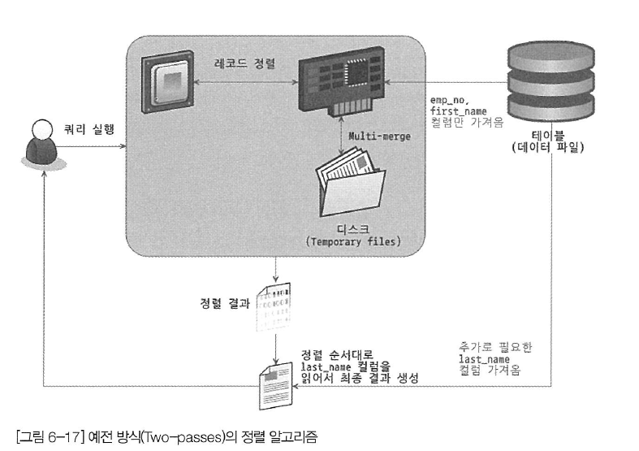

<aside>
💡 SELECT 쿼리에서 꼭 필요한 칼럼만 조회하지 않고 모든 칼럼(*)을 가져오면 정렬 버퍼를 비효율적으로 사용할 가능성이 크다. 특히 정렬이 필요한 SELECT는 불필요한 칼럼을 SELECT 하지 않게 작성하는 것이 효율적이다. 정렬 버퍼 뿐만아니라 임시 테이블이 필요한 쿼리에도 영향을 미친다.

</aside>

**9.2.3.3 정렬 처리 방법**

- 쿼리에 ORDER BY가 사용되면 반드시 다음 3가지 처리 방법중 하나로 정렬이 처리된다. 일반적으로 아래쪽으로 갈수록 처리 속도는 떨어진다.
    
    
    | 정렬 처리 방법 | 실행 계획의 Extra 칼럼 내용 |
    | --- | --- |
    | 인덱스를 사용한 정렬 | 별도 표기 없음 |
    | 조인에서 드라이빙 테이블만 정렬 | “Using filesort” 메시지가 표시됨 |
    | 조인에서 조인결과를 임시 테이블로 저장 후 정렬 | “Using temporary; Using filesort” 메시지가 표시됨 |
    
    <aside>
    💡 JOIN시 먼저 액세스 돼서 ACCESS PATH를 주도하는테이블을 드라이빙테이블이라고 한다. 즉, 조인시먼저 액세스되는 쪽을 드라이빙 테이블(DRIVING TABLE, OUTER TABLE)이라고 하며,나중에액세스 되는 테이블을 드리븐 테이블(DRIVEN TABLE, INNER TABLE)이라고 한다.
    
    출처: [https://devuna.tistory.com/36](https://devuna.tistory.com/36)
    
    </aside>
    

**9.2.3.3.1 인덱스를 이용한 정렬**

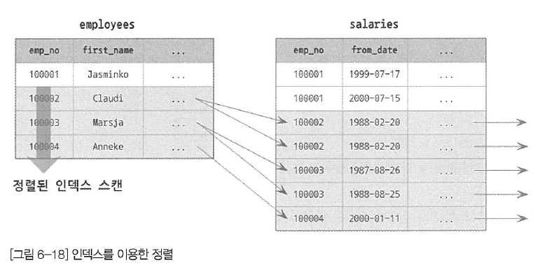

- 인덱스를 이한 정렬을 위해서는 반드시 ORDER BY 에 명시된 칼럼이 제일 먼저 읽는 테이블에(조인이 사용된 경우 드라이빙 테이블) 속하고, ORDER BY의 순서대로 생성된 인덱스가 있어야 한다.
- 또한 WHERE 절에 첫 번째로 읽는 테이블의 칼럼에 대한 조건이 있다면 그 조건과 ORDER BY 는 같은 인덱스를 사용할 수 있어야 한다.
- B-Tree 계열의 인덱스가 아닌 인덱스에서는 인덱스를 이용한 정렬을 할수 없다.
- 인덱스를 이용해 정렬이 처리되는 경우에는 실제 인덱스 값이 정렬돼 있기 때문에 인덱스의 순서대로 읽기만 하면 된다. (정렬을 위한 별도의 추가작업 X)
    
    ```sql
    select *
    from employees e, salaries s
    where s.emp_no = e.emp_no
    and e.emp_no between 100002 AND 100020
    ORDER BY e.emp_no;
    
    -- 인덱스(emp_no)에 의해 정렬이 되어있기 때문에 두 쿼리의 순서는 같게 나오지만
    -- 어떤 이유 실행계획에 변경이 있을경우 순서가 기대했던것과 다르게 나올수 있기 때문에
    -- ORDER BY는 명시해주는 것이 좋다. 
    
    select *
    from employees e, salaries s
    where s.emp_no=e.emp_no
    and e.emp_no between 100002 and 100020;
    
    ```
    
    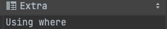
    

**9.2.3.3.2 조인의 드라이빙 테이블만 정렬**

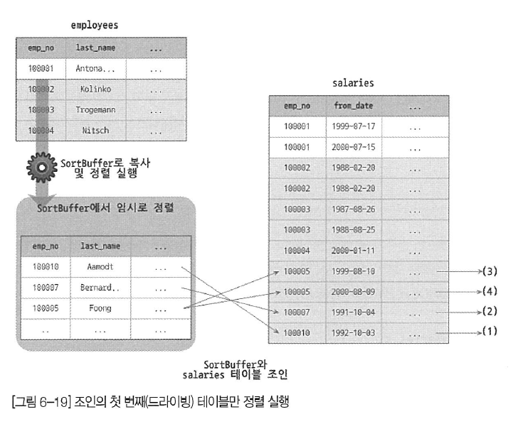

- 일반적으로 조인이 수행되면 결과 레코드의 건수와 크기가 증가한다.
- 그래서 조인을 실행하기 전에 첫 번째 테이블의 레코드를 먼저 정렬한 다음 조인을 실행하는 것이 정렬의 차선책이 될 것이다.
- 이 방법으로 정렬이 처리되려면 조인에서 첫 번째로 읽히는 테이블의 칼럼만으로 ORDER BY 절을 작성해야 한다.
    
    ```sql
    EXPLAIN
    select *
    from employees e, salaries s
    where s.emp_no=e.emp_no
    and e.emp_no between 100002 and 100010
    order by e.last_name;
    ```
    
    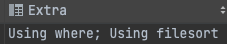
    

**9.2.3.3.3 임시 테이블을 이용한 정렬**

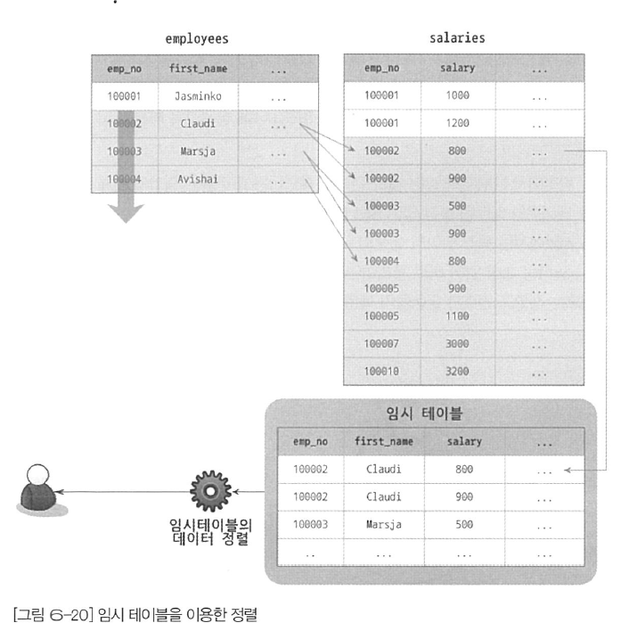

- 조인을  사용한 쿼리 중 “조인의 드라이빙 테이블만 정렬” 이외 패턴의 쿼리는 항상 조인의 결과를 임시 테이블에 저장하고, 그 결과를 다시 정렬하는 과정을 거친다.
- 정렬의 3가지 방법 가운데 정렬해야할 레코드가 가장 많기 때문에 가장 느린 방법이다.
    
    ```sql
    EXPLAIN
    select *
    from employees e, salaries s
    where s.emp_no=e.emp_no
    and e.emp_no between 100002 and 100010
    order by s.salary;
    ```
    
    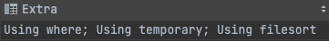
    

**9.2.3.3.4 정렬 처리 방법의 성능 비교**

- LIMIT은 테이블이나 처리 결과의 일부만 가져오기 때문에 작업량을 줄이는 역할을 한다.
- 하지만 ORDER BY 나 GROUP BY 같은 작업은 WHERE 조건을 만족하는 레코드를 LIMIT 건수 만큼만 가져와서는 처리할 수 없다.
- 만족하는 레코드를 모두 가져와서 정렬을 수행하거나 그루핑 작업을 실행해야 비로소 LIMIT을 걸 수 있다,
- WHERE 조건이 아무리 인덱스를 잘 활용하도록 튜닝해도 잘못된 ORDER BY 나 GROUP BY 때문에 쿼리가 느려지는 경우가 자주 발생한다.

**9.2.3.3.4.1 스트리밍 방식**

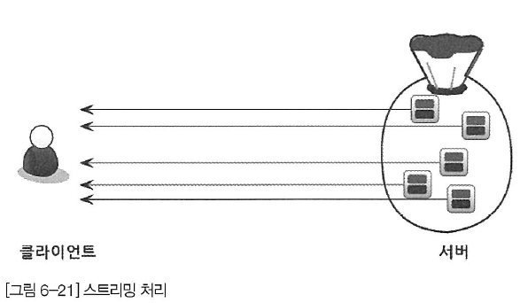

- 서버쪽에서 처리할 데이터가 얼마인지에 관계 없이 일치하는 레코드가 검색될 때마다 바로바로 클라이언트로 전송해 주는 방식
- 빠른 응답시간이 중요한 웹서비스와 같은 OLTP (On-Line Transaction Processing) 환경에서 용이하다.
- LIMIT 처럼 결과 건수를 제한하는 조건을 걸면 서버에서 쿼리가 실행중이더라도 스트리밍 방식에서는 첫번째 레코드를 빠르게 반환한다.

**9.2.3.3.4.2 버퍼링 방식**

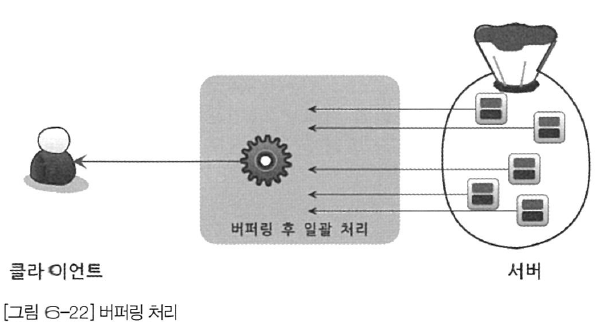

- ORDER BY 나 GROUP BY 같은 처리는 쿼리의 결과가 스트리밍되는 것을 불가능하게 한다. WHERE 조건에 일치하는 모든 레코드를 가져 온 후, 정렬하거나 그루핑해서 차례대로 보내야 하기 때문
- 그림과 같이 버퍼링 방식으로 처리되는 쿼리는 먼저 결과를 모아서 MySQL 서버에서 일괄 가공해야 하므로 모든 결과를 스토리지 엔진으로부터 가져올 때까지 기다려야 한다.

<aside>
💡 MySQL 서버와 관계 없이 클라이언트 도구나 API 에 따라 방식에 차이가 있을 수 있다. 대표적으로 JDBC 라이브러리는 스트리밍방식의 쿼리(SELECT * FROM TABLE)도 JDBC 내부 버퍼에 담아두고 마지막 레코드가 전달될 때까지 기다렸다가 모든 결과를 전달받으면 그때서야 클라이언트의 애플리케이션에 반환한다. 이것은 기본 JDBC 동작 방식이며 스트리밍 방식으로 변경할 수도 있다.

</aside>

- JOIN + ORDER BY + LIMIT 일 경우 정렬 처리 방법별 차이
    
    ```sql
    -- tb_test1 (100건) , tb_test2 (1000건)
    -- tb_test1 1건당 tb_test2 10건씩 존재
    
    SELECT *
    FROM tb_test1 t1, tb_test2 t2 
    WHERE t1.col1=t2.col1
    ORDER BY t1.col2
    LIMIT 10;
    ```
    
    - tb_test1가 드라이빙 되는 경우
        
        
        | 정렬 방법 | 읽어야할 건수 | 조인 횟수 | 정렬해야 할 대상 건수 |
        | --- | --- | --- | --- |
        | 인덱스 사용 | tb_test1: 1건
        tb_test2: 10건 | 1번 | 0건 |
        | 조인의 드라이빙 
        테이블만 정렬 | tb_test1: 100건
        tb_test2: 10건 | 1번 | 100건 |
        | 임시 테이블 사용 후 정렬 | tb_test1: 100건
        tb_test2: 1000건 | 100번 | 1000건 |
    - tb_test2가 드라이빙 되는 경우
        
        
        | 정렬 방법 | 읽어야할 건수 | 조인 횟수 | 정렬해야 할 대상 건수 |
        | --- | --- | --- | --- |
        | 인덱스 사용 | tb_test2: 10건
        tb_test1: 10건 | 10번 | 0건 |
        | 조인의 드라이빙 
        테이블만 정렬 | tb_test2: 1000건
        tb_test1: 10건 | 10번 | 1000건 |
        | 임시 테이블 사용 후 정렬 | tb_test2: 1000건
        tb_test1: 100건 | 1000번 | 1000건 |

**9.2.3.4 정렬 관련 상태 변수**

- MySQL 서버는 처리하는 주요 작업에 대해서는 해당 작업의 실행 횟수를 상태 변수로 저장한다.
    
    ```sql
    -- 다음 명령으로 확인 가능
    FLUSH STATUS;
    SHOW STATUS LIKE 'SORT%';
    
    +-------------------+-------+
    | Variable_name     | Value |
    +-------------------+-------+
    | Sort_merge_passes | 0     |
    | Sort_range        | 0     |
    | Sort_rows         | 86    |
    | Sort_scan         | 1     |
    +-------------------+-------+
    ```
    
    - `sort_merge_passes` : 멀티 머지 처리 횟수
    - `sort_range` : 인덱스 레인지 스캔을 통해 검색된 결과에 대한 정렬 작업 횟수.
    - `sort_scan` : 풀 테이블  스캔을 통해 검색된 결과에 대한 정렬 작업 횟수.
    - `sort_rows` : 지금까지 정렬한 전체 레코드 건수를 의미
    

### 9.2.4 GROUP BY 처리

- GROUP BY 절은 HAVING 절을 사용할 수 있는데, HAVING절은 GROUP BY 결과에 대해 필터링 역할을 수행한다. GROUP BY에 사용된 조건은 인덱스를 사용해서 처리될 수 없으므로 HAVING 절을 튜닝하려고 인덱스를 생성하거나 다른 방법을 고민할 필요는 없다.
- GROUP BY 에서 인덱스를 사용하는 경우와 그렇지 못한 경우가 있다.
    - 인덱스를 사용하는 경우 : 인덱스 스캔, 루스 인덱스 스캔
    - 인덱스를 사용하지 못하는 경우 : 임시 테이블 사용

**9.2.4.1 인덱스 스캔을 이용하는 GROUP BY(타이트 인덱스 스캔)**

- ORDER BY의 경우와 마찬가지로 조인의 드라이빙 테이블에 속한 칼럼만 이용해 그루핑할 때 GROUP BY 칼럼으로 이미 인덱스가 있다면 그 인덱스를 차례대로 읽으면서 그루핑 작업을 수행하고 그 결과로 조인을 처리한다.
- 이미 정렬된 인덱스를 읽는 것이므로 추가적인 정렬 작업이나 내부 임시 테이블은 필요하지 않다.
- GROUP BY가 인덱스를 사용해서 처리된다 하더라도 그룹 함수 등의 그룹값을 처리해야 해서 임시 테이블이 필요할 때도 있다.
- 실행계획 Extra 칼럼에 별도의 GROUP BY 관련 코멘트(Using index for group-by) 나 테이블 사용 또는 정렬 관련 코멘트 (Using temporary, Using filesort)가 표시되지 않는다.

**9.2.4.2 루스 인덱스 스캔을 이용하는 GROUP BY**

- 레코드를 건너뛰면서 필요한 부분만 읽어서 가져오는 것을 의미
- 실행계획 Extra 칼럼에 Using index for group-by 코멘트가 표시
- 루스 인덱스 스캔을 사용하는 예제
    
    ```sql
    EXPLAIN
        select emp_no
        from salaries
    		where from_date='1985-03-01'
    		group by emp_no;
    
    -- 참고) primary key (emp_no, from_date)
    ```
    
    - 결과
        
        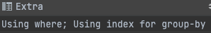
        
    - 실행 순서
        1. (emp_no, from_date) 인덱스를 차례대로 스캔하면서 emp_no의 첫 번째 유일한 값 “10001” 을 찾아낸다.
        2. (emp_no, from_date) 인덱스에서 emp_no가 ‘10001’ 인것 중에서 from_date 값이 
        ‘1985-03-01’ 인 레코드만 가져온다. 1번 단계에서 알아낸 ‘10001’ 값과 쿼리의 WHERE 절을 합쳐서 인덱스를 검색하는것과 흡사하다.
        3. (emp_no, from_date) 인덱스에서 emp_no의 그다음 유니크한 값을 가져온다.
        4. 3번 단계에서 결과가 더 없으면 종료하고, 결과가 있다면 2번과정으로 돌아가서 반복 수행 한다.
        

9.2.4.3 임시 테이블을 사용하는 GROUP BY

- GROUP BY 기준 칼럼이 드라이빙 테이블에 있든 드리븐 테이블에 있든 관계 없이 인덱스를 전혀 사용하지 못할 때는 이 방식으로 처리 된다.
    
    ```sql
    EXPLAIN
        SELECT e.last_name, AVG(s.salary)
        from employees e, salaries s
        where s.emp_no = e.emp_no
        group by e.last_name;
    -- order by e.last_name  8.0에서도 group by 와 함께 order by 절이 사용되면 명시적으로 정렬을 실행한다.
    ```
    
    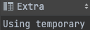
    
    
    
- 8.0 이전 버전까지는  GROUP BY 칼럼에 대해 묵시적 정렬까지 수행했지만 8.0부터는 수행하지 않는다.
- 8.0에서는 GROUP BY가 필요한 경우 내부적으로 GROUP BY 절의 칼럼들로 구성된 유니크 인덱스를 가진 임시 테이블을 만들어서 중복 제거와 집합 함수 연산을 수행한다.
- 위 쿼리를 위해 다음과 같은 테이블을 생성하여 조인결과를 한 건씩 가져와 임시 테이블에서 중복 체크를 하면서 INSERT 또는 UPDATE를 실행한다.
    
    ```sql
    CREATE TEMPORARY TABLE ... (
    	last_name VARCHAR(16),
    	salary INT,
    	UNIQUE INDEX ux_lastname (last_name)
    )
    ```
    

### 9.2.5 DISTINCT 처리

**9.2.5.1 SELECT DISTINCT …**

- GROUP BY와 동일한 방식으로 처리된다.
    
    ```sql
    -- 내부적으로 같은 작업을 수행한다.
    SELECT DISTINCT emp_no FROM salaries;
    SELECT emp_no FROM GROUP BY emp_no;
    ```
    

**9.2.5.2 집합 함수와 함께 사용된 DISTINCT**

- COUNT(), MIN(), MAX() 같은 집합 함수 내에서 DISTINCT 키워드가 사용될 수 있는데 이 경우에는 일반적으로 SELECT DISTINCT와 다른 형태로 해석된다.
- 집합 함수가 없는 SELECT 쿼리에서 DISTINCT는 조회하는 모든 칼럼의 조합이 유니크한 것들만 가져온다.
하지만 집합 함수 내에서 사용된 DISTINCT는 그 집합 함수의 인자로 전달된 칼럼 값이 유니크한 것들을 가져온다.
    
    ```sql
    EXPLAIN SELECT COUNT(DISTINCT s.salary)
    FROM employees e, salaries s
    WHERE e.emp_no=s.emp_no
    AND e.emp_no BETWEEN 100001 AND 100100;
    ```
    
    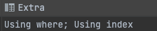
    
    - 위 쿼리는 임시 테이블을 사용하지만 “Using temporary” 를 표시하지 않는다. (버그인듯)
- 다음쿼리는 인덱스를 활용하여 임시 테이블 없이 최적화된 처리를 수행한다
    
    ```sql
    explain select count(distinct emp_no) from employees; -- Using index;
    explain select count(distinct emp_no) from dept_emp group by dept_no; -- Using index;
    ```
    

### 9.2.6 내부 임시 테이블 활용

- MySQL 엔진이 스토리지 엔진으로 부터 받아온 레코드를 정렬하거나 그루핑할 때는 내부적인 임시 테이블을 사용한다. “내부적” 인 임시 테이블은 “CREATE TEMPORARY TABLE” 명령으로 만든 임시 테이블과는 다르다.
- MySQL 엔진이 사용하는 임시 테이블은 처음 메모리에 생성됐다가 테이블의 크기가 커지면 디스크로 옮겨진다.
- 사용자가 생성한 임시 테이블과 달리 쿼리의 처리가 완료되면 자동으로 삭제된다.

**9.2.6.1 메모리 임시 테이블과 디스크 임시 테이블**

- 8.0 이전에는 원본 테이블의 스토리지 엔진과 상관없이 임시 테이블 메모리를 사용할 때는 MEMORY 스토리지 엔진을 사용했으며, MEMORY 스토리지 엔진은 가변 길이 타입의 경우 최대 길이만큼 메모리를 할당해서 사용했기 때문에 메모리의 낭비가 심한 문제가 있었다.
- 8.0 부터는 가변 길이 타입을 지원하는 TempTable 스토리지 엔진이 도입되었다. (8.0 부터 default)
- TempTable이 최대한 사용 가능한 메모리 공간의 크기는 `temptable_max_ram` 시스템 변수로 제어한다. (default=1GB)
- 임시테이블의 크기가 1GB 보다 커지면 메모리의 임시테이블을 다음 2가지 방식 중 하나로 디스크로 기록.
`temptable_use_mmap` 시스템 변수로 선택할 수 있다. (default=on)
    - MMAP 파일로 기록 → InnoDB 테이블로 기록보다 오버헤드가 적어 기본값으로 설정되어있다.
    - InnoDB 테이블로 기록

<aside>
💡 MySQL 서버는 디스크의 임시 테이블을 생성할때 오픈 즉시 파일을 삭제한다. 이렇게 함으로써 MySQL 서버가 종료되거나 해당 쿼리가 종료되면 임시 테이블을 즉시 사라지게 보장한다. 
따라서 임시 테이블 파일은 운영체제 “ls -al” 등의 명령어로 확인할 수 없고, 외부 사용자가 해당 파일을 변경하거나 볼 수 없다.

</aside>

**9.2.6.2 임시 테이블이 필요한 쿼리**

- MySQL 엔진에서 내부 임시 테이블을 생성하는 케이스
    - ORDER BY와 GROUP BY에 명시된 칼럼이 다른 쿼리
    - ORDER BY나 GROUP BY에 명시된 칼럼이 조인의 순서상 첫번쨰 테이블이 아닌 쿼리
    - DISTINCT와 ORDER BY 가 동시에 쿼리에 존재하는 경우 또는 DISTINCT가 인덱스로 처리되지 못하는 쿼리
    - UNION이나 UNION DISTINCT가 사용된 쿼리
    - 쿼리의 실행 계획에서 select_type이 DERIVED인 쿼리 (FROM 절에 서브쿼리)
        
        > select_type 참고
        [https://multifrontgarden.tistory.com/149](https://multifrontgarden.tistory.com/149)
        > 

**9.2.6.3 임시 테이블이 디스크에 생성되는 경우**

- UNION 이나 UNION ALL에서 SELECT되는 칼럼 중에서 길이가 512바이트 이상인 크기의 칼럼이 있는 경우
- GROUP BY나 DISTINCT 칼럼에서 512바이트 이상인 크기의 칼럼이 있는 경우
- 메모리 임시 테이블의 크기가 (MEMORY 스토리지 엔진에서) `tmp_table_size` 또는 `max_heap_table_size` 시스템 변수보다 크거나 (TempTable 스토리지 엔진에서) `temptable_max_ram` 시스템 변수 값보다 큰 경우

**9.2.6.4 임시 테이블 관련 상태 변수**

- 실행 계획상에서 “Using temporary” 가 표시되면 임시 테이블을 사용했다는 사실을 알수 있지만, 임시 테이블이 메모리에서 처리됐는지 디스크에서 처리됐는지 몇 개의 임시테이블이 사용됐는지는 알 수 없다.
- 디스크에서 생성됐는지 메모리에서 생성됐는지는 다음과 같이 확인할 수 있다.
    
    ```sql
    FLUSH STATUS;
    
    SELECT first_name, last_name
    FROM employees
    GROUP BY first_name, last_name;
    
    SHOW SESSION STATUS LIKE 'Created_tmp%';
    ```
    
    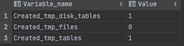
    
    - Created_tmp_tables : 메모리 임시테이블 , 디스크 임시테이블 구분없이 누적
    - Created_tmp_disk_tables : 디스크 임시 테이블 누적 개수
    

## 9.3 고급 최적화

- MySQL 서버의 옵티마이저가 실행 계획 수립 시, 통계정보와 옵티마이저 옵션(조인 관련 옵티마이저 옵션, 옵티마이저 스위치)을 결합해서 최적의 실행 계획을 수립함****

### 9.3.1 옵티마이저 스위치 옵션

- 옵티마이저 스위치 옵션 (`p318` 참조)

**9.3.1.1 MBR과 배치 키 액세스(mrr & batched_key_access)**

- MRR(Multi-Range Read), DS-MRR(Disk Sweep Multi-Range Read)
- BKA 조인 실행과정
    - MySQL 서버는 조인 대상 테이블 중 하나로부터 레코드를 읽어 조인버퍼에 버퍼링
    - 드라이빙 테이블의 레코드를 읽고 조인대상을 버퍼링 (드리븐 테이블과 즉시 조인 실행 X)
    - 조인 버퍼에 레코드가 가득 차면 MySQL 서버는 버퍼링 된 레코드를 스토리지 엔진으로 한 번에 요청

**9.3.1.2 블록 네스티드 루프 조인(block_nedsted_loop)**

- MySQL 서버에서 사용되는 대부분의 조인 방식으로 조인의 연결 조건이 되는 칼럼에 모두 인덱스가 있는 경우 사용되는 조인 방식
- 블록 네스티드 루프 조인은 조인 버퍼가 사용되는 것과 드라이빙 테이블, 드리븐 테이블의 처리 순서에 따라서 구분된다.
- MySQL 8.0.18 버전부터는 해시 조인 알고리즘이 도입되어 이 방식은 사용되지 않는다.

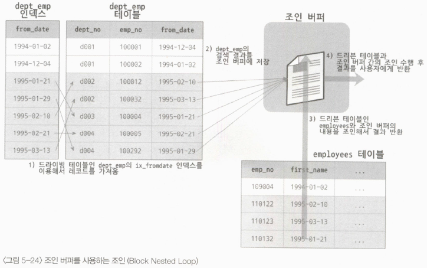

**9.3.1.3 인덱스 컨디션 푸시다운(index_condition_pushdown)**

- 참고 (`p324`) ****
- MySQL 5.6 부터 도입
- 예제
    
    ```sql
    select * from employees where last_name ='Acton' and first_name like '%sal';
    ```
    
    
    
    
    

**9.3.1.4 인덱스 확장(use_index_extensions)**

- 세컨더리 인덱스에 자동으로 추가된 프라이머리 키를 활용할 수 있게 할지를 결정하는 옵션

**9.3.1.5 인덱스 머지(index_merge)**

- 쿼리에 사용된 조건이 서로 다른 인덱스 사용 가능, 조건 만족하는 레코드 건수가 많다고 예상될 때 MySQL 서버는 인덱스 머지 실행 계획 선택
- 인덱스 머지 실행 계획을 사용하면 하나의 테이블에 대해 2개 이상의 인덱스를 이용해 쿼리를 처리한다.
- `index_merge_intersection`, `index_merge_sort_union`, `index_merge_union` 세 가지로 구분

**9.3.1.6 인덱스 머지 - 교집합(index_merge_intersection)**

- 2개의 where 조건을 가질 때, 2개의 조건 모두 사용 가능할때 교집합을 이용해 최적화
- 쿼리가 여러개의 인덱스를 각각 검색 후 해당 결과의 교집합만 반환

**9.3.1.7 인덱스 머지 - 합집합(index_merge_union)**

- 2개 이상의 조건이 각각 인덱스를 사용하되 OR 연산자로 연결된 경우 합집합을 이용한 최적화 실행
- MySQL 서버는 두 쿼리 결과의 집합에서 pk 기준으로 데이터 비교 후 중복 제거
- 우선순위 큐(Priority Queue) 방식

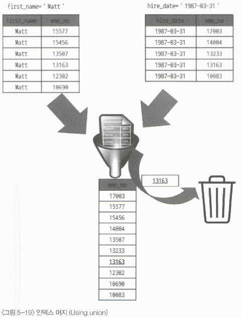

**9.3.1.8 인덱스 머지 - 정렬 후 합집합(index_merge_sort_union)**

- 인덱스 머지 작업 도중 결과의 정렬이 필요한 경우 인덱스 머지 최적화의 Sort union 알고리즘 사용

**9.3.1.9 세미 조인**

- 다른 테이블과 실제 조인을 수행하지 않고, 다른 테이블에서 조건에 일치하는 레코드 여부만 체크하는 형태의 쿼리를 세미 조인(Semi-Join)이라 한다.

**9.3.1.10 테이블 풀-아웃(Table Pull-out)**

- 세미 조인의 서브 쿼리에 사용된 테이블을 아우터 쿼리로 끄집어낸 후, 쿼리를 조인 쿼리로 재작성하는 형태의 최적화 방식
- IN(subquery) 형태의 세미 조인이 가장 빈번하게 사용되는 형태의 쿼리
- 실행계획의 Extra 칼럼에 특별한 문구가 출력되지 않는다. 확인방법은 다음과 같다.
    - 실행계획의 Extra 컬럼에 별다른 표시가 없고 id 컬럼 값이 같은 경우
    - Show warings 명령으로 MySQL 옵티마이저가 재작성한 쿼리
- 제한 사항
    - 세미 조인 서브쿼리에서만 사용 가능
    - 서브쿼리 결과가 1건인 경우만 사용 가능

**9.3.1.11 퍼스트 매치(firstmatch)**

- IN (subquery) 형태의 세미 조인을 EXISTS (subquery) 형태로 튜닝한 것과 비슷한 방식
- 실행 계획 Extra 칼럼에 `firstmatch()` 문구가 출력된다.
    
    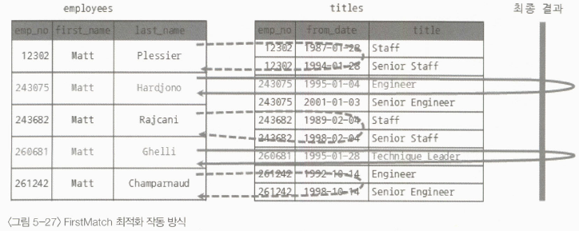
    

**9.3.1.12 루스 스캔(loosescan**

- 인덱스를 사용하는 GROUP BY 최적화 방법에서 살펴본 ‘Using index for group-by’의 루스 인덱스 스캔(Loose Index Scan) 과 비슷한 읽기 방식을 사용
- `loosescan` 옵티마이저 옵션으로 사용여부 결정
- 실행 계획 Extra 칼럼에 `LooseScan` 문구가 출력된다.
    
    
    

**9.3.1.13 구체화(Materialization)**

- Materialization 최적화는 세미 조인에 사용된 서브쿼리를 통째로 구체화해서 쿼리를 최적화 한다.
- 구체화는 내부 임시 테이블을 생성하는 것을 의미
- 시스템 변수 : `optimizer_switch=’semijoin=on,materialization=on’`
- Materialization 제한사항 및 특성
    - 서브쿼리는 상관 서브쿼리가 아니어야 함
    - GROUP BY 나 집합 함수들이 사용돼도 구체화 사용 가능
    - 구체화 사용된 경우 내부 임시 테이블 사용

**9.3.1.14 중복 제거(Duplicated Weed-out)**

- Duplicate Weed-out 은 세미 조인 서브쿼리를 일반적인 INNER JOIN 쿼리로 변경 후 실행하여 마지막에 중복된 레코드를 제거하는 방법으로 처리되는 최적화 알고리즘
- 실행 계획 Extra 칼럼에 `Start temporary`, `End temporary` 문구의 구간이 Duplicated Weedout 최적화 처리 과정
- 실행과정
    
    ```sql
    explain
    select * 
    from employees e
    where e.emp_no in (select s.emp_no from salaries s where s.salary > 150000);
    ```
    
    
    
    - salaries > ix_salary 인덱스 스캔 salary > 150000 보다 큰 사원 검색
    - employees 테이블과 조인조인결과를 임시 테이블에 저장
    - 임시 테이블 저장 결과에서 emp_no 기준으로
    - 중복 제거중복 제거 후 남은 레코드 반환

**9.3.1.15 컨디션 팬아웃(condition_fanout_filter) - 이해잘안됨**

- `condition_fanout_filter` 시스템 변수를 이용해 최적화 기능을 활성화하면 MySQL 옵티마이저는 더 정교한 계산을 거쳐 실행 계획을 수립.
    - WHERE 조건절에 사용된 칼럼에 인덱스가 있는 경우
    - WHERE 조건절에 사용된 칼럼에 히스토그램이 존재하는 경우
- 실행 계획의 filtered 컬럼에 비율이 표시된다.

**9.3.1.16 파생 테이블 머지(derived_merge)**

- MySQL 5.7부터 파생 테이블(Derived Table, FROM 절에 사용된 서브쿼리)로 만들어진 서브쿼리를 외부 쿼리와 병합해서 서브쿼리 부분을 제거하는 최적화 도입

**9.3.1.17 인비저블 인덱스(use_invisible_indexes)**

- MySQL 8.0부터 인덱스 가용 상태 제어 기능이 추가
- 인덱스를 삭제하지 않고, 해당 인덱스 사용 불가 상태를 제어 기능을 제공
    
    ```sql
    alter table ... alter index ... [visible|invisible 인덱스 가용 상태 설정
    ```
    
- `use_invisible_indexes` 옵티마이저 옵션 사용 시 invisible 설정 인덱스라도 옵티마이저가 사용하게 제어 가능

**9.3.1.18 스킵 스캔(skip_scan)**

- 인덱스 구성 칼럼 순서와 동일한 조건에 대한 칼럼만 인덱스 사용이 가능했던 제약사항을 제한적으로 해결하는 최적화 기법
- MySQL 8.0 ~ 인덱스 스킵 스캔 최적화 도입. 인덱스의 선행 칼럼이 조건절에 사용되지 않더라도 후행 칼럼의 조건만(ex: 인덱스 A,B,C 중 B,C 형태로 사용)으로도 인덱스를 이용한 쿼리 성능 개선이 가능
- 실행계획 Extra 컬럼에 `Using index for skip scan` 표시

**9.3.1.19 해시 조인(hash_join)**

- MySQL 8.0.18 부터 지원
- 해시 조인 vs 네스티드 루프 조인
    - 해시 조인 : 첫 번째 레코드 찾는 데 시간이 오래 걸림. 최종 레코드를 찾는 경우 빠른 처리 가능걸림 → 최고 스루풋(Best Throughput) 전략에 적합
    - 네스티드 루프 조인 : 첫 번째 레코드 찾는 경우 빠른 처리. 최종 레코드를 찾는데 시간이 많이 걸림 → 최고 응답 속도(Best Response-time) 전략에 적합
    
    
    
- 해시 조인의 최적화 방식
    - 빌드 단계(Build-phrase) : 해시 테이블로 만들기에 용이한 테이블을 골라 메모리에 해시테이블을 생성하는 작업을 수행
    - 프로브 단계(Probe-phase) : 나머지 테이블의 레코드를 읽어 해시 테이블의 일치 레코드를 찾는 과정
- 실행계획 Extra 컬럼에 `hash join` 표시
- 해시 조인 - 메모리에서 모두 처리 가능한 경우
    - 빌드 테이블인 dept_emp 테이블의 레코드 읽어서 메모리에 해시 테이블 생성
    - 프로브 테이블인 employees 테이블을 스캔하면서 메모리에 생성된 해시 테이블의 레코드를 찾아 결과를 사용자에게 반환
    
    
    
- 해시 조인 - 해시 테이블이 조인 버퍼 메모리보다 큰 경우
    - 해시 테이블의 레코드 건수가 많이 조인 버퍼(join_buffer_size, 기본 256KB) 의 공간 부족 시 사용
    - dept_emp > emp_no 값으로 해시 테이블 생성
    - 메모리, 사용량 초과 시 나머지 dept_emp 테이블 레코드를 디스크 청크로 기록
    - employees 테이블의 emp_no 값으로 해시 테이블 검색 및 조인 → 1차 조인 결과 생성 동시에 디스크 청크로 구분해서 저장
        
        
        
    - 빌드 테이블 청크 > 1번 청크를 읽어서 다시 메모리 해시 테이블 구축 프로브 테이블 청크 > 1번 청크 읽으면서 새로 구축된 메모리 해시 테이블과 조인 수행 → 2차 조인 결과 생성 → 디스크에 저장된 청크 개수만큼 해당 과정을 반복 처리 → 완성된 조인 결과 생성
        
        
        

**9.3.1.20 인덱스 정렬 선호(prefer_ordering_index)**

- MySQL 옵티마이저는 order by, group by 인덱스를 사용해 처리 가능한 경우 인덱스의 가중치를 높이 설정하여 실행 됨 → 체크해야 하는 레코드 건수가 많음에도 불구하고 정렬된 인덱스 활용하는 실행계획 수립 → 옵티마이저가 잘못된 실행계획을 수립한 것
- MySQL 8.0.21 부터 `prefer_ordering_index` 옵티마이저 옵션으로 order by 인덱스가 가중치 부여하지 않도록 설정 가능. (default: on)****

### 9.3.2 **조인 최적화 알고리즘**

**9.3.2.1 Exhaustive 검색 알고리즘**

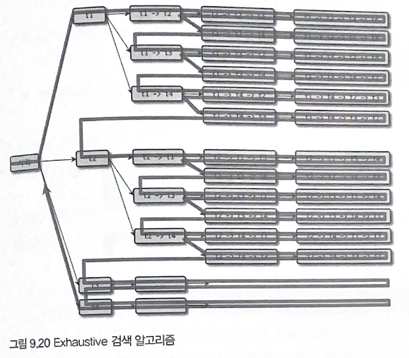

- FROM 절에 명시된 모든 테이블의 조합에 대해 실행 계획의 비용 계산 후 최적의 조합 1개를 찾는 방식
- 4개의 테이블 처리 가능 조인 조합은 4! 20개 테이블 처리 가능 조인 조합은 20!
- 테이블 개수가 늘어날수록 실행계획 수립 시간이 늘어난다.

**9.3.2.2 Greedy 검색 알고리즘**

- Exhaustive 검색 알고리즘의 문제점 해결을 위해 MySQL 5.0부터 도입된 조인 최적화 기법
    
    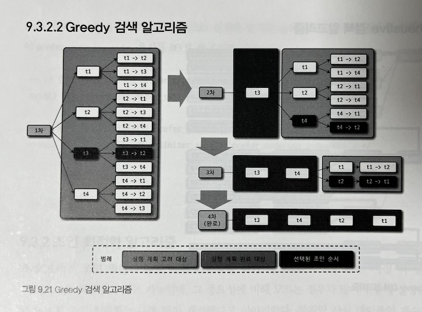
    
- 실행과정
    1. 전체 테이블 중 `optimizer_search_depth` 시스템 설정 변수에 정의된 개수로 조인 가능한 조합 생성
    2. 생성된 조인 조합 중 최소 비용의 실행 계획 1개 선정
    3. 선정된 실행 계획의 첫 번째 테이블을 부분 실행 계획의 1번째 테이블로 선정
    4. 부분 실행 계획의 1번째 테이블을 제외한 N-1개 테이블 중 `optimizer_search_depth` 시스템 설정 변수에 정의된 개수로 조인 가능한 조합 생성
    5. 생성된 조인 조합들을 부분 실행 계획에 대입해 실행 비용 계산
    6. 실행 비용 계산 후 최적의 실행 계획에서 2번째 테이블을 부분 실행 계획의 2번째 테이블로 선정
    7. 남은 테이블이 없어질 때까지 4~6번 과정 반복 실행하면서 부분 실행 계획에 테이블의 조인 순서를 기록
    8. 최종적으로 부분 실행 계획이 테이블의 조인 순서로 결정

## 9.4 쿼리 힌트

### 9.4.1 인덱스 힌트

- MySQL 인덱스 힌트들은 ANSI-SQL 표준 문법을 준수하지 못한다.
    - MySQL 5.6 버전부터 추가되기 시작한 옵티마이저 힌트들은 ANSI-SQL 표준을 준수하여 다른 RDBMS에서는 주석으로 해석된다.
    - 따라서 가능하면 인덱스 힌트보다는 옵티마이저 힌트를 사용할 것을 추천한다.
- 인덱스 힌트는 SELECT 명령과 UPDATE 명령에서만 사용 가능하다.

**9.4.1.1 STRAIGHT_JOIN**

- `STRAIGHT_JOIN`은 옵티마이저 힌트인 동시에 조인 키워드이기도 하다.
    - `JOIN_FIXED_ORDER` 힌트와 동일하다.
    - `JOIN_ORDER`, `JOIN_PREFIX`, `JOIN_SUFFIX`는 일부 테이블 조인 순서에 대해서만 제안한다.
- `STRAIGHT_JOIN` 힌트는 옵티마이저가 from 절에 명시된 테이블의 순서대로 조인을 수행하도록 유도한다.

**9.4.1.2 USE INDEX / FORCE INDEX / IGNORE INDEX**

- 인덱스 힌트는 조인 힌트 다음으로 자주 사용된다.
- 인덱스 힌트는 사용하려는 인덱스를 가지는 테이블 뒤에 힌트를 명시한다.
- 인덱스 힌트 종류
- `USE INDEX` : 특정 테이블의 인덱스를 사용하도록 권장하는 힌트.
- `FORCE INDEX` : USE INDEX 와 비슷하지만 더 강하게 사용하도록 요구하는 힌트 (거의 사용하지 않음)
- `IGNORE INDEX` : 특정 인덱스를 사용하지 못하도록 권장하는 힌트
- 인덱스 힌트 주의사항
    - 옵티마이저는 프라이머리 키나 전문 검색 인덱스에 대해서 가중치를 두고 실행계획을 수립한다. 그래서 일반 보조 인덱스를 사용할 수 있는 상황이더라도 전문 검색 인덱스를 선택할 수 있다.
    - 최적의 실행 계획은 데이터에 따라 변하므로, 지금 좋은 계획이었다고 하더라도 달라질 수 있다.
    - **가장 훌륭한 최적화는 데이터를 최소화하는 것이고, 다음은 데이터 모델의 단순화를 통해 쿼리를 간결하게 만드는 것이다. 힌트는 가장 마지막에 고려하자.**

**9.4.1.3 SQL_CALC_FOUND_ROWS**

- MySQL의 LIMIT을 사용하는 경우, 조건을 만족하는 레코드가 LIMIT에 명시된 수보다 더 많더라도 명시된 수만큼 만족하는 레코드를 찾으면 즉시 검색을 멈춘다. 하지만 `SQL_CALC_FOUND_ROWS` 힌트가 포함된 쿼리는 LIMIT을 만족하는 수만큼 레코드를 찾았더라도 끝까지 검색을 수행한다.
    - 추가적으로 FOUND_ROWS() 함수를 이용해 전체 몇 건이었는지 알 수 있다.

### 9.4.2 옵티마이저 힌트

**9.4.2.1 옵티마이저 힌트 종류(`p379 참조`)**

- 종류
    1. 인덱스 : 특정 인덱스의 이름을 사용할 수 있는 힌트
    2. 테이블 : 특정 테이블의 이름을 사용할 수 있는 힌트
    3. 쿼리 블록 : 특정 쿼리 블록에 대해서 영향을 미치는 힌트
    4. 글로벌(쿼리 전체) : 전체 쿼리에 대해서 영향을 미치는 힌트
- 인덱스 수준의 힌트는 테이블명이 선행되어야 한다.
    
    ```sql
    EXPLAIN
    SELECT /*+ NO_INDEX(employees ix_firstname)*/ *
    FROM employees 
    WHERE first_name = 'Matt';
    ```
    
- 특정 쿼리 블록을 외부 쿼리 블록에서 사용하려면 `QB_NAME()` 힌트로 쿼리 블록에 이름을 부여해야 한다.
    
    ```sql
    EXPLAIN
    SELECT /*+ JOIN ORDER(e, s@subq1) */
      COUNT(*)
    FROM employees e
    WHERE e.first_name = 'Matt'
      AND e.emp_no IN ( SELECT /*+ QB_NAME(subq1) */ s.emp_no
                        FROM salaries s
                        WHERE s.salary BETWEEN 50000 AND 50500 );
    ```
    

**9.4.2.2 MAX_EXECUTION_TIME**

- 쿼리의 최대 실행 시간을 밀리초 단위로 설정하고, 쿼리가 지정된 시간을 초과하면 실패하게 된다.
    
    ```sql
    SELECT /*+ MAX_EXECUTION_TIME(1) */ *
    FROM employees
    ORDER BY last_name LIMIT 1;
    ```
    

**9.4.2.3 SET_VAR**

- 옵티마이저 힌트와 시스템 변수들은 쿼리의 실행 계획에 상당한 영향을 미친다.
- `SET_VAL` 힌트를 사용하여 해당 쿼리에서만 일시적으로 시스템 변수를 조정할 수 있다.
- 실행 계획을 바꾸는 용도뿐만 아니라 조인 버퍼나 소트 버퍼의 크기를 일시적으로 증가시켜 대용량 처리 쿼리의 성능을 향상시키는 용도로도 사용할 수 있다.
- `SET_VAL` 힌트로 모든 시스템 변수를 조정할 수는 없지만, 다양한 형태의 시스템 변수를 조정할 수 있다.
    
    ```sql
    EXPLAIN
    SELECT /*+ SET_VAL(optimizer_switch = 'index_merge_intersection = off')*/ *
    FROM employees
    WHERE first_name = 'Georgi' AND emp_no BETWEEN 10000 AND 20000;
    ```
    

**9.4.2.4 SEMIJOIN & NO_SEMIJOIN (9.3.1.9절 세미 조인 참조)**

- `SEMIJOIN` 힌트는 어떤 세부 전략을 사용할지 제어할 수 있다.
    
    
    | 최적화 전략 | 힌트 |
    | --- | --- |
    | Duplicate Wedd-out | SEMIJOIN(DUPSWEEDOUT) |
    | First Match | SEMIJOIN(FIRSTMATCH) |
    | Loose Scan | SEMIJOIN(LOOSESCAN) |
    | Materialization | SEMIJOIN(MATERIALIZATION) |
    | Table Pull-out | 없음 |
- Table Pull-out 전략은 사용 가능한 경우 항상 더 나은 성능을 보장하기 때문에 힌트로 제공되지 않는다.
- 세미 조인 최적화 힌트는 외부 쿼리가 아니라 서브 쿼리에 명시해야 한다.

**9.4.2.5 SUBQUERY**

- 서브쿼리 최적화는 세미 조인 최적화가 사용되지 못할 때 사용하는 최적화 방법이다.

**9.4.2.6 BNL & NO_BNL & HASHJOIN & NO_HASHJOIN**

- MySQL 8.0.20 버전부터 BNL 힌트를 사용하면 해시 조인을 사용하도록 용도가 변경되었다. 
(좀 헷갈리게 해놓았는데, 기존 사용자에게도 최적의 호환성을 제공하기 위한것이 아닐까 하는 뇌피셜)
    
    ```sql
    EXPLAIN
    SELECT /*+ BNL(e, de) */ *
    FROM employees e
    INNER JOIN dept_emp de ON de.emp_no = e.emp_no;
    ```
    

**9.4.2.7 JOIN_FIXED_ORDER & JOIN_ORDER & JOIN_PREFIX & JOIN_SUFFIX**

- 조인의 순서를 결정하기 위한 `STRAIGHT_JOIN` 힌트는 `FROM` 절에 명시된 모든 테이블의 조인 순서를 결정한다.
- 일부 테이블의 조인 순서만 결정하고 나머지 테이블은 옵티마이저가 결정하도록 다른 힌트가 추가되었다.
    - `JOIN_FIXED_ORDER` : `STRAIGHT_JOIN` 힌트와 동일하게 FROM 절의 테이블 순서대로 조인을 실행하는 힌트
    - `JOIN_ORDER` : `FROM` 절에 사용된 테이블의 순서가 아니라 힌트에 명시된 테이블의 순서대로 조인을 실행하는 힌트
    - `JOIN_PREFIX` : 조인에서 드라이빙 테이블만 강제하는 힌트
    - `JOIN_SUFFIX` : 조인에서 드리븐 테이블(가장 마지막으로 조인되는 테이블)만 강제하는 힌트
    
    ```sql
    -- // FROM 절에 나열된 테이블의 순서대로 조인 (e → de → d)
    EXPLAIN
    SELECT /*+ JOIN_FIXED_ORDER() */ *
    FROM employees e
      INNER JOIN dept_emp de ON de.emp_no = e.emp_no
      INNER JOIN departments d ON d.dept_no = de.dept_no;
    
    -- // 일부 테이블에 대해서만 조인 순서를 나열 (d → de → e)
    EXPLAIN
    SELECT /*+ JOIN_ORDER(d, de) */ *
    FROM employees e
      INNER JOIN dept_emp de ON de.emp_no = e.emp_no
      INNER JOIN departments d ON d.dept_no = de.dept_no;
    
    -- // 조인의 드라이빙 테이블에 대해서만 조인 순서를 나열 (e → de → d)
    EXPLAIN
    SELECT /*+ JOIN_PREFIX(e, de) */ *
    FROM employees e
      INNER JOIN dept_emp de ON de.emp_no = e.emp_no
      INNER JOIN departments d ON d.dept_no = de.dept_no;
    
    -- // 조인의 드리븐 테이블에 대해서만 조인 순서를 나열 (d → de → e)
    EXPLAIN
    SELECT /*+ JOIN_SUFFIX(de, e) */ *
    FROM employees e
      INNER JOIN dept_emp de ON de.emp_no = e.emp_no
      INNER JOIN departments d ON d.dept_no = de.dept_no;
    ```
    

**9.4.2.8 MERGE & NO_MERGE**

- `FROM` 절의 서브쿼리를 외부 쿼리와 병합하는 옵티마이저 힌트이다.
- 서브 쿼리와 외부 쿼리를 병합
    
    ```sql
    EXPLAIN
    SELECT /*+ MERGE(sub) */ *
    FROM ( SELECT * FROM employees 
           WHERE first_name = 'Matt'
    ) sub LIMIT 10;
    ```
    
- 내부 임시 테이블 사용 (병합 X)
    
    ```sql
    EXPLAIN
    SELECT /*+ NO_MERGE(sub) */ *
    FROM ( SELECT * FROM employees 
           WHERE first_name = 'Matt'
    ) sub LIMIT 10;
    ```
    

**9.4.2.9 INDEX_MERGE & NO_INDEX_MERGE**

- MySQL 서버는 가능하다면 테이블당 하나의 인덱스만 이용해서 쿼리를 처리하려고 하는데, 하나의 인덱스만으로 검색 대상 범위를 충분히 좁힐 수 없다면 여러 인덱스를 사용하기도 한다.
- 하나의 테이블에 대해 여러 개의 인덱스를 동시에 사용하는 것을 인덱스 머지라고 한다.
- 여러 인덱스를 통해 검색된 레코드로부터 교집합 또는 합집합을 구해서 결과를 반환한다.
    
    ```sql
    -- 인덱스 머지 사용
    EXPLAIN
    SELECT /*+ INDEX_MERGE(employees PRIMARY) */ *
    FROM employees
    WHERE first_name = 'Georgi' AND emp_no BETWEEN 10000 AND 20000;
    
    -- 인덱스 머지 사용 X
    EXPLAIN
    SELECT /*+ NO_INDEX_MERGE(employees PRIMARY) */ *
    FROM employees
    WHERE first_name = 'Georgi' AND emp_no BETWEEN 10000 AND 20000;
    ```
    

**9.4.2.10 NO_ICP**

- 인덱스 컨디션 푸시다운 최적화는 사용 가능하다면 항상 성능 향상에 도움이 된다.
- 하지만 인덱스 컨디션 푸시다운으로 인해 여러 실행 계획의 비용 계산이 잘못된다면 결과적으로 잘못된 실행 계획을 수립하게 될 수 있으므로 ICP을 비활성화해서 유연하게 실행 계획을 선택할 수 있다.
    
    ```sql
    -- // ICP 테스트를 위한 임시 인덱스 생성
    ALTER TABLE employees ADD INDEX ix_lastname_firstname(last_name, first_name);
    
    -- ICP 미사용
    EXPLAIN
    SELECT /*+ NO_ICP(employees ix_lastname_firstname) */ *
    FROM employees
    WHERE last_name = 'Acton' AND first_name LIKE '%sal';
    ```
    

**9.4.2.11 SKIP_SCAN & NO_SKIP_SCAN**

- 인덱스 스킵 스캔은 인덱스의 선행 컬럼에 대한 조건이 없어도 옵티마이저가 해당 인덱스를 사용할 수 있게 해주는 최적화 기능이다.
- 하지만 선행 컬럼이 가지는 유니크한 값의 개수가 많아진다면, 인덱스 스킵 스캔의 성능은 오히려 떨어진다.
    
    ```sql
    -- 임시 인덱스 생성
    ALTER TABLE employees ADD INDEX ix_gender_birthdate(gender, birth_date);
    
    -- 스킵스캔 (힌트를 생략해도 실행계획은 같음)
    EXPLAIN
    SELECT /*+ SKIP_SCAN(employees ix_gender_birthdate) */ gender, birth_date
    FROM employees
    WHERE birth_date >= '1965-02-01';
    
    -- 스킵 스캔 X
    EXPLAIN
    SELECT /*+ NO_SKIP_SCAN(employees ix_gender_birthdate) */ gender, birth_date
    FROM employees
    WHERE birth_date >= '1965-02-01';
    ```
    

**9.4.2.12 INDEX & NO_INDEX**

- 예전 MySQL 서버에서 사용되던 인덱스 힌트를 대체하는 용도로 제공된다.
- 인덱스 힌트는 테이블 뒤에 위치하기 때문에 별도로 힌트 내에 테이블명이 없지만, 옵티마이저 힌트에는 테이블명과 인덱스명을 함께 명시해야 한다.****
    
    
    | 인덱스 힌트 | 옵티마이저 힌트 |
    | --- | --- |
    | USE INDEX | INDEX |
    | USE INDEX FOR GROUP BY | GROUP_INDEX |
    | USE INDEX FOR ORDER BY | ORDER_INDEX |
    | IGNORE INDEX | NO_INDEX |
    | IGNORE INDEX FOR GROUP BY | NO_GROUP_INDEX |
    | IGNORE INDEX FOR ORDER BY | NO_ORDER_INDEX |
    
    ```sql
    -- // 인덱스 힌트 사용
    EXPLAIN
    SELECT *
    FROM employees USE INDEX(ix_firstname)
    WHERE first_name = 'Matt';
    
    -- // 옵티마이저 힌트 사용
    EXPLAIN
    SELECT /*+ INDEX(employees ix_firstname) */ *
    FROM employees
    WHERE first_name = 'Matt';
    ```