# 9장 옵티마이저와 힌트

- `옵티마이저`는 쿼리를 기본 데이터를 비교해 최적의 실행 계획을 수립하는 작업을 담당한다
- `EXPLAIN` 명령으로 쿼리의 실행 계획을 확인할 수 있다

## 9.1 개요

### 9.1.1 쿼리 실행 절차

```
1. SQL 문장을 잘게 쪼개서 MySQL 서버가 이해할 수 있는 수준으로 분리(파스 트리)한다
2. 2. SQL 파싱 정보(파스 트리)를 확인하면서 어떤 테이블로부터 읽고 어떤 인덱스를 이용해 테이블을 읽을지 선택
3. 2번 단계에서 결정된 테이블의 읽기 순서나 선택된 인덱스를 이용해 스토리지 엔진으로부터 데이터를 가져온다
```

- 1번 단계는 `SQL 파싱 단계`로 `SQL 파서` 모듈이 담당한다
- 2번 단계는 `최적화 및 실행 계획 수립 단계` 이며 아래와 같은 내용을 처리한다
    - 불필요한 조건 제거 및 복잡한 연산을 단순화
    - 조인 테이블의 읽는 순서를 결정
    - 테이블 사용 조건, 인덱스 통계 정보를 이용해 사용할 인덱스를 결정
    - 가져온 레코드들을 임시 테이블에 넣고 가공해야 할 지 결정
- 3번 단계는 MySQL 엔진과 스토리지 엔진이 동시에 참여해서 처리한다

### 9.1.2 옵티마이저의 종류

- `비용 기반 최적화(Cost-based optimizer, CBO)` ⇒ 대부분의 RDBMS가 채택하고 있음
    - 쿼리를 처리하기 위해 여러 방법을 만들어, 각 단위 작업의 비용을 산출한다
- `규칙 기반 최적화(Rule-based optimizer, RBO)` ⇒ 거의 사용되지 않음
    - 옵티마이저 우선순위에 의해 결정된다

## 9.2 기본 데이터 처리

### 9.2.1 풀 테이블 스캔과 풀 인덱스 스캔

- 풀 테이블 스캔을 하는 경우
    - 테이블 레코드 건수가 너무 작아서 인덱스를 통해 읽는 것보다 빠를 경우
        - 일반적으로 테이블이 페이지 1개로 구성
    - where 절이나 ON 절에 인덱스를 이용할 수 있는 적절한 조건이 없는 경우
    - 인덱스 레인지 스캔을 사용할 수 있는 쿼리이더라도 일치 레코드 건수가 너무 많은 경우
    - InnoDB 스토리지 엔진은 특정 테이블의 연속된 데이터 페이지를 읽을 때 `리드 어헤드` 수행
        - 앞으로 필요할 데이터를 요청이 오기전에 미리 읽어서 버퍼 풀에 가져다 둔다
        - `리드 어헤드`는 `백그라운드 스레드`로 동작한다
        - `innodb_read_ahead_threshold` 시스템 변수로 리드 어헤드의 임계값을 설정할 수 있다
        - `풀 테이블 스캔` 뿐만 아니라 `풀 인덱스 스캔` 에서도 동일하게 사용된다
    
    ```sql
    SELECT * FROM employees;        //(1)풀 테이블 스캔        
    SELECT COUNT(*) FROM employees; //(2)풀 인덱스 스캔
    ```
    
    - 단순 레코드 건수만 필요로 하는 쿼리는 인덱스를 선택하여 디스크 읽기 횟수를 줄인다

### 9.2.2 병렬 처리

- MySQL 8.0 버전부터 쿼리에 대해 `병렬 처리`가 가능하다
- 단순히 테이블의 전체 건수를 가져오는 쿼리만 병렬 처리할 수 있다

```sql
-- 8 Core OS 

-- execution: 887 ms, fetching: 34 ms
SET SESSION innodb_parallel_read_threads=1;
SELECT COUNT(*) FROM salaries;

-- execution: 94 ms, fetching: 16 ms
SET SESSION innodb_parallel_read_threads=2;
SELECT COUNT(*) FROM salaries;

-- execution: 62 ms, fetching: 22 m
SET SESSION innodb_parallel_read_threads=4;
SELECT COUNT(*) FROM salaries;

-- execution: 88 ms, fetching: 20 ms
SET SESSION innodb_parallel_read_threads=8;
SELECT COUNT(*) FROM salaries;

```

- `CPU의 코어 개수`를 넘어서는 경우 성능이 떨어질 수 있다

## 9.2.3 ORDER BY 처리(Using filesort)

- 정렬 처리 방법은 `인덱스` 사용 방법과 `Fiesort` 처리 방법으로 나뉜다
- **인덱스 사용 장/단점**
    - 이미 정렬되어 있으므로 매우 빠르다
    - `INSERT, UPDATE, DELETE` 작업 시 부가적인 인덱스 추가/삭제 작업이 필요하므로 느리다
    - 인덱스를 위한 디스크 공간이 더 많이 필요하고, 버퍼 풀을 위한 메모리가 많이 필요하다
- **Filesort 사용 장/단점**
    - 정렬해야 할 레코드가 많지 않으면 메모리에서 `Filesort` 되므로 빠르다
    - 정렬 작업이 쿼리 실행 시 처리되므로 레코드 대상 건수가 많을 수록 느리다

### 9.2.3.1 소트 버퍼

- 정렬을 수행하기 위해 별도의 메모리 공간을 할당 받아서 사용한다
- 정렬이 필요한 경우에만 할당되며 레코드 크기에 따라 가변적이다
- 최대 사용 가능한 소트 버퍼 공간은 `sort_buffer_size` 시스템 변수로 설정한다
- 소트 버퍼를 위한 메모리 공간은 쿼리 실행이 완료되면 즉시 시스템으로 반납된다
- **정렬해야 할 레코드의 건수가 소트 버퍼로 할당된 공간보다 클 경우?**
    - 메모리의 소트 버퍼 정렬 수행 결과를 임시로 디스크에 기록하는 작업을 반복한다
    - 버퍼 크기만큼 정렬된 코드를 다시 병합하면서 정렬을 수행한다 ⇒ `멀티 머지(Multi Merge)`
        - `Sort_merge_passes` 로 멀티 머지 횟수를 조회할 수 있다
    - 디스크 읽기/쓰기 작업을 유발하여 레코드 건수가 많을수록 반복 작업의 횟수가 많아진다

```sql
show variables like 'sort_buffer_size';
SET GLOBAL sort_buffer_size = 262144; //2M
```

- 소트 버퍼는 `세션 메모리 영역` 에서 사용되므로 메모리 부족 현상이 발생할 수 있다

### 9.2.3.2 정렬 알고리즘

- 싱글 패스(Single-pass)
- 투 패스(Two-pass)

```sql
SET OPTIMIZER_TRACE='enabled=on', END_MARKERS_IN_JSON=on;
SET OPTIMIZER_TRACE_MAX_MEM_SIZE=1000000;

SELECT *
  FROM employees ORDER BY last_name LIMIT 100000, 1;

SELECT *
  FROM information_schema.OPTIMIZER_TRACE;
```

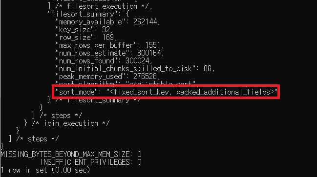

- MySQL 정렬 방식 3가지
    1. `<sort_key, rowid>` : 정렬 키와 레코드의 로우 아이디만 가져와서 정렬하는 방식 ⇒ 투 패스
    2. `<sort_key, additional_fields>` : 정렬 키와 레코드 전체를 가져와서 정렬. 레코드 컬럼을 고정 사이즈로 메모리에 저장 ⇒ 싱글 패스
    3. `<sort_key, packed_additional_fields>` : 정렬 키와 레코드 전체를 가져와서 정렬. 레코드 가변 고정 사이즈로 메모리에 저장 ⇒ 싱글 패스

### 9.2.3.2.1 싱글 패스 정렬 방식 ⇒ 대부분의 RDBMS에서 사용

- 소트 버퍼에 정렬 기준 칼럼을 포함해 SELECT 대상이 되는 칼럼 전부를 담아 정렬하는 방식

```sql
SELECT emp_no, first_name, last_name
  FROM employees
ORDER BY first_name; 
```

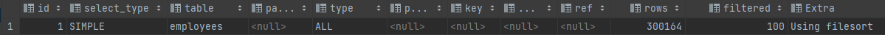

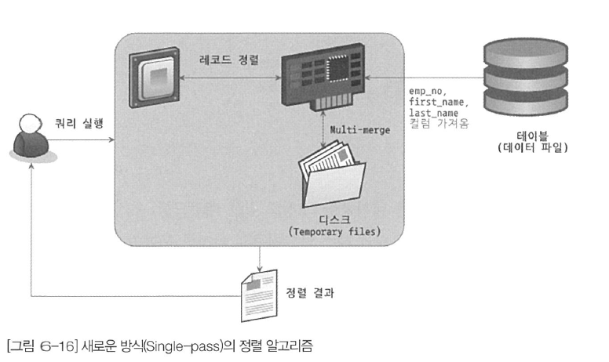

- 정렬에 필요하지 않은 컬럼까지 전부 읽어서 소트 버퍼에 담고 정렬을 수행한다
- 정렬이 완료되면 정렬 버퍼의 내용을 그대로 클라이언트에게 넘겨준다\
- 소트 버퍼 공간을 많이 필요하다

### 9.2.3.2.2 투 패스 정렬 방식 ⇒ 잘 사용되지 않는다

- 정렬 대상과 프라이머리 키 값만 소트 버퍼에 담아서 정렬을 수행한 후 정렬된 순서대로 다시 프라이머리 키로 테이블을 읽어서 SELECT할 컬럼을 가져오는 방식 ⇒ 테이블을 두 번 읽어야 함

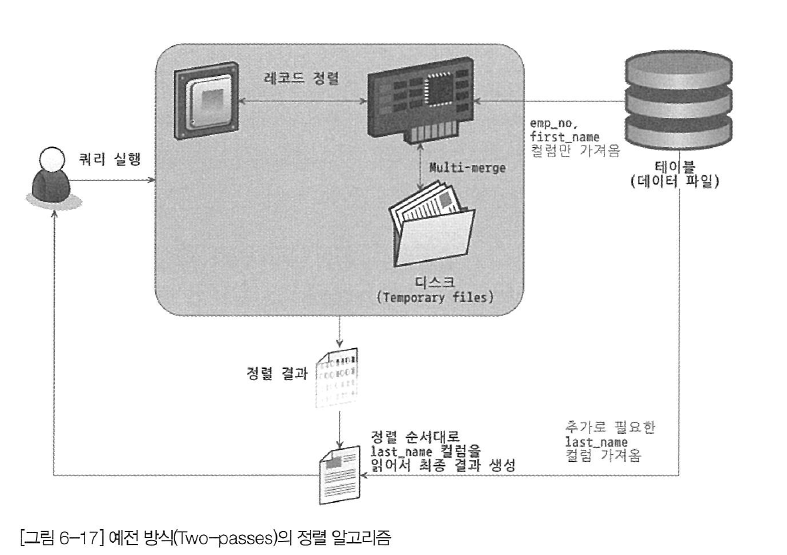

- **MySQL 서버가 투 패스 방식을 사용하는 경우**
    - 레코드 크기가 `max_length_for_sort_data` 시스템 변수 설정 값보다 클 때
    - BLOB이나 TEXT 타입의 칼럼이 SELECT 대상에 포함될 때

### 9.2.3.3 정렬 처리 방법

1. 인덱스를 사용한 정렬 : 표시하지 않음
2. 조인에서 드라이빙 테이블만 정렬: `Using filesort`
3. 조인에서 조인 결과를 임시테이블로 저장 후 정렬: `Using temporary, Using filesort`
- 1 ⇒ 3 순으로 처리 속도는 떨어진다

### 9.2.3.3.1 인덱스를 이용한 정렬

- 테이블 조인 시  `ORDER BY` 에 명시된 칼럼이 제일 먼저 읽는 테이블에 속하고, `ORDER BY` 순서대로 생성된 인덱스가 있어야 한다
- `B-Tree`  계열 인덱스가 아닌 경우 인덱스를 이용한 정렬을 사용할 수 없다

```sql
explain
SELECT *
  FROM employees e, salaries s
 WHERE s.emp_no = e.emp_no
   AND e.emp_no BETWEEN 10002 AND 100020
 ORDER BY e.emp_no;

explain
SELECT *
FROM employees e, salaries s
WHERE s.emp_no = e.emp_no
  AND e.emp_no BETWEEN 10002 AND 100020
```

- `employees` 테이블이 드라이빙 테이블로 사용되어 인덱스 스캔을 하게 된다
    
    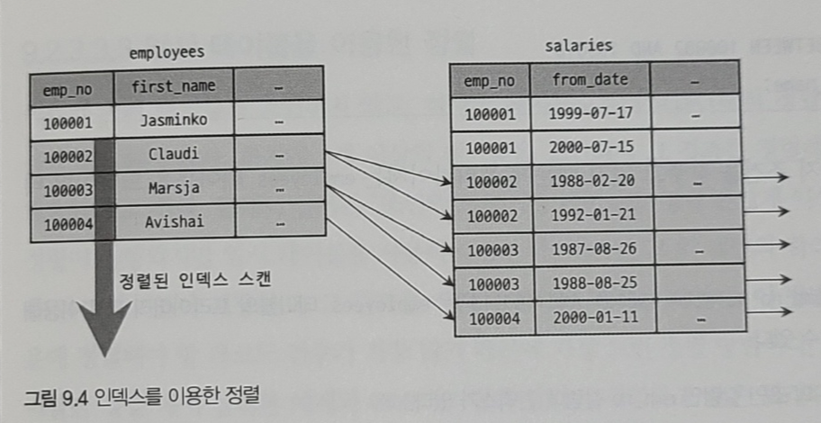
    

### 9.2.3.3.2 조인의 드라이빙 테이블만 정렬

- 조인을 실행하기 전 첫 번째 테이블(드라이빙 테이블)의 레코드를 먼저 조인하는 방법
- 조인에서 첫 번째로 읽히는 테이블의 칼럼만으로 `ORDER BY` 를 작성해야 한다

```sql
SELECT *
  FROM employees e, salaries s
 WHERE s.emp_no = e.emp_no
   AND e.emp_no BETWEEN 100002 AND 100020
 ORDER BY e.emp_no;
```

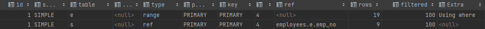

- **옵티마이저가 employees 테이블을 드라이빙 테이블로 선택 조건**
    - WHERE 절의 검색 조건 `emp_no BETWEEN 100002 AND 100010` 이 `employees` 테이블의 PK 이용해 검색해 작업량을 줄일 수 있음
    - 드리븐 테이블(`salaries`)의 조인 컬럼에 인덱스가 있다

### 9.2.3.3.3 임시 테이블을 이용한 정렬 ⇒ 가장 느린 정렬 방법

- 2개 이상의 테이블을 조인해서 결과를 정렬해야 한다면 임시 테이블이 필요할 수 있다

```sql
SELECT *
  FROM employees e, salaries s
 WHERE s.emp_no=e.emp_no
   AND e.emp_no BETWEEN 10002 AND 10010 
 ORDER BY s.salary;
```

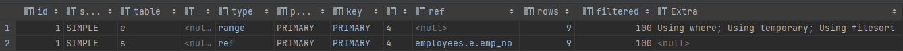

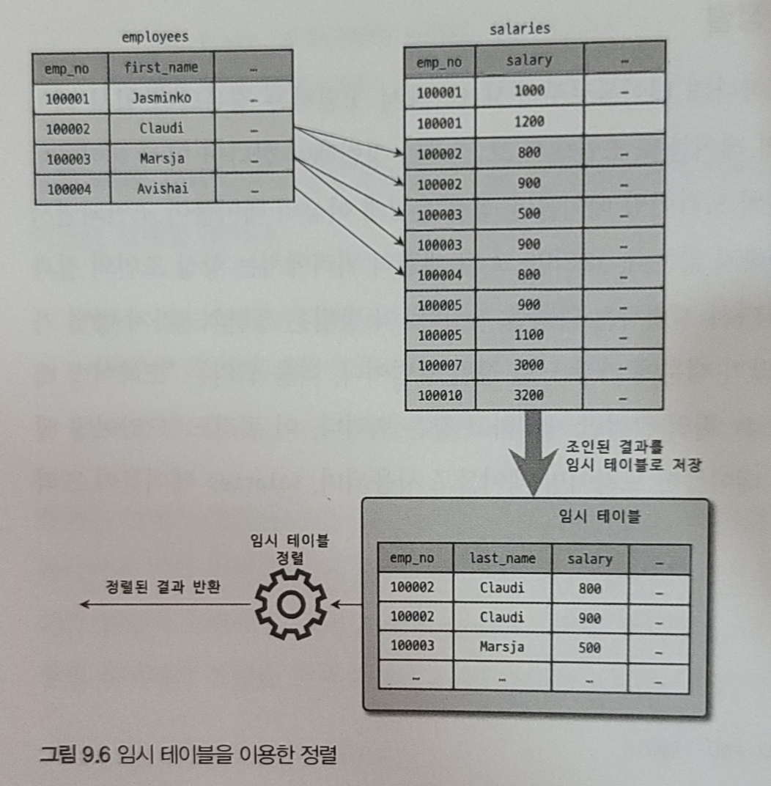

- `ORDER BY` 절의 정렬 기준 컬럼이 `드리븐 테이블`의 칼럼인 경우
- `Using temporary; Using filesort`

### 9.2.3.3.4 정렬 처리 방법의 성능 비교

- `LIMIT` 은 MySQL 서버의 작업량을 줄이는 역할을 한다
    - `ORDER BY` 나 `GROUP BY` 에서는 사용할 수 없기 때문에 쿼리가 느려질 수 있다
- 쿼리 처리 방법은 `스트리밍 처리` 와 `버퍼링 처리` 방법으로 구분한다

### 9.2.3.3.4.1 스트리밍 방식

- 빠른 응답 시간을 보장한다
- `OLTP` 환경에서 유용하다
- `LIMIT` 과 유사한 기능을 수행한다

### 9.2.3.3.4.2 버퍼링 방식

- `ORDER BY` 나 `GROUP BY` 같은 쿼리는 쿼리 결과가 스트리밍되는 것이 불가능하다
- 쿼리의 결과를 모아서 가공해야 하므로 결과를 기다려야 한다

### 9.2.3.4 정렬 관련 상태 변수

```sql
FLUSH STATUS;
SHOW STATUS LIKE 'Sort%';
```

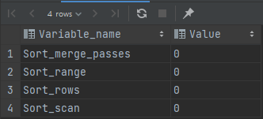

- `Sort_merge_passes` : 멀티 머지 처리 횟수
- `Sort_range` : `인덱스 레인지 스캔`을 통해 검색된 결과에 대한 정렬 작업 횟수
- `Sort_scan` : `풀 테이블 스캔`을 통해 검색된 결과에 대한 정렬 작업 횟수
- `Sort_rows` : 지금까지 정렬한 `전체 레코드 건 수`

## 9.2.4 GROUP BY 처리

- 스트리밍 처리 할 수 없다
- 인덱스를 사용하는 경우와 사용하지 못하는 경우로 구분한다
    - 인덱스 스캔 방법
    - 루스 인덱스 스캔 방법
    - 인덱스를 사용하지 못해 임시 테이블을 사용하는 방법

### 9.2.4.1 인덱스 스캔을 이용하는 GROUP BY(타이트 인덱스 스캔)

- 조인의 드라이빙 테이블에 속한 칼럼만 이용해서 그루핑할 때 `GROUP BY` 칼럼으로 이미 인덱스가 있는 경우 인덱스를 차례대로 읽으면서 그루핑을 수행하고 결과로 조인을 처리한다

### 9.2.4.2 루스 인덱스 스컌을 이용하는 GROUP BY ⇒ 단일 테이블

```sql
EXPLAIN
SELECT emp_no
  FROM salaries
 WHERE from_date='1985-03-01'
GROUP BY emp_no;
```


- **실행 순서**
    1. `(emp_no, from_date)` 인덱스를 차례로 스캔하여 emp_no의 첫 번째 유일값을 찾는다
    2. 1번의 결과들에서 `from_date` 가 일치하는 레코드를 찾는다 
    3. 그 다음 유니크한 키를 가져온다 
    4. 3번 결과가 더 없으면 종료, 있다면 2번으로 돌아가 과정을 반복한다
- 루스 인덱스 스캔을 사용할 수 있는 경우
    
    ```sql
    SELECT c1, c2 FROM t1 GROUP BY c1, c2;
    SELECT DISTINCT c1, c2 FROM t1;
    SELECT c1, MIN(c2) FROM t1 GROUP BY c1;
    SELECT c1, c2 FROM t1 WHERE c1 < const GROUP BY c1, c2;
    SELECT MAX(c3), MIN(c3), c1, c2 FROM t1 WHERE c2 > const GROUP BY c1, c2;
    SELECT c2 FROM t1 WHERE c1 < const GROUP BY c1, c2;
    SELECT c1, c2 FROM t1 WHERE c3 = const GROUP BY c1, c2;
    ```
    
    [MySQL :: MySQL 8.0 Reference Manual :: 8.2.1.17 GROUP BY Optimization](https://dev.mysql.com/doc/refman/8.0/en/group-by-optimization.html)
    

### 9.2.4.3 임시 테이블을 사용하는 GROUP BY

```sql
EXPLAIN
SELECT e.last_name, AVG(s.salary)
  FROM employees e, salaries s
 WHERE s.emp_no = e.emp_no
  GROUP BY e.last_name;
```

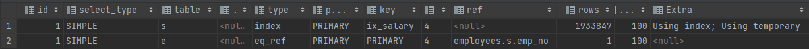

- 인덱스를 전혀 사용할 수 없는 `GROUP BY` 인 경우
- 8.0 버전부터 GROUP BY의 묵시적인 정렬을 실행하지 않는다 ⇒ `ORDER BY` 사용 시에는 수행함

## 9.2.5 DISTINCT 처리

- SELECT DISTINCT
- 집합함수의 DISTINCT

### 9.2.5.1 SELECT DISTINCT

- `GROUP BY` 와 동일한 방식으로 처리된다
    
    ```sql
    SELECT DISTINCT emp_no FROM salaries;
    SELECT emp_no FROM salaries GROUP BY emp_no;
    ```
    
- `DISTINCT` 는 조회되는 모든 칼럼에 영향을 미친다

### 9.2.5.2 집합 함수와 함께 사용된 DISTINCT

- 집합 함수의 인자로 전달된 칼럼값이 유니크한 것을 가져온다
- 내부적으로 임시 테이블을 사용하지만 실행 계획에 표시되지 않는다
- 인덱스된 칼럼에 대해 DISTINCT 처리를 수행할 때는 인덱스를 사용하며 임시 테이블 없이 최적화된 쿼리를 수행할 수 있다

## 9.2.6 내부 임시 테이블 활용

- 레코드 정렬하거나 그루핑 시 내부 임시 테이블을 사용한다

### 9.2.6.1 메모리 임시 테이블과 디스크 임시 테이블

- 8.0 버전부터 메모리는 `TempTable` 스토리지 엔진, 디스크는 `InnoDB` 스토리지 엔진을 사용한다
- `TempTable` 은 `MEMORY` 엔진에서 할 수 없는 가변 길이 타입을 지원한다
- 디스크 저장 방식 2가지
    - MMAP 파일로 디스크 저장 ⇒ 기본값
    - InnoDB 테이블로 기록
- 쿼리 수행 즉시 삭제된다

### 9.2.6.2 임시 테이블이 필요한 쿼리

- **인덱스를 사용하지 못할 때 사용**
    - `ORDER BY`와 `GROUP BY` 에 명시된 컬럼이 다른 경우
    - `ORDER BY`와 `GROUP BY` 에 명시된 칼럼이 조인 순서상 첫 번째 테이블이 아닌 쿼리
    - `DISTINCT`와 `ORDER BY` 가 동시에 쿼리에 존재하는 경우 또는 `DISTINCT`가 인덱스로 처리되지 못하는 경우
    - `UNION` 이나 `UNION DISTINCT` 가 사용된 쿼리

### 9.2.6.3 임시 테이블이 디스크에 생성되는 경우

- UNION이나 UNION ALL에서 SELECT되는 칼럼이 512바이트 이상인 칼럼이 있는 경우
- GROUP B Y나 DISTINCT 칼럼에서 512바이트 이상인 칼럼이 있는 경우
- 메모리 임시 테이블 크기가 시스템 변수 값보다 큰 경우

### 9.2.6.4 임시 테이블 관련 상태 변수

```sql
FLUSH STATUS;

SELECT first_name, last_name
  FROM employees
 GROUP BY first_name, last_name;

SHOW SESSION STATUS LIKE 'Created_tmp%'
```

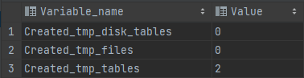

- `Created_tmp_tables` : 쿼리의 처리를 위해 만들어진 내부 임시 테이블의 개수를 누적한 값
- `Created_tmp_disk_tables` : 디스크 내부 임시 테이블이 만들어진 누적 개수

## 9.3 고급 최적화

- 옵티마이저가 실행 계획을 수립할 때 통계 정보와 `옵티마이저 옵션` 을 결합하여 최적의 실행계획을 수립한다
- 옵티마이저 옵션은 `조인 관련 옵티마이저 옵션` 과 `옵티마이저 스위치` 로 구분한다

### 9.3.1 옵티마이저 스위치 옵션

- `optimizer_switch` 시스템 변수로 제어한다

| 옵티마이저 스위치 이름 | 기본값 | 설명 |
| --- | --- | --- |
| batched_key_access | off | BKA 조인 알고리즘을 사용할지 여부 결정 |
| block_nested_loop | on | Block Nested Loop 조인 알고리즘을 사용할지 여부 결정 |
| engine_condition_pushdown | on | Engine Condition Pushdown 기능 사용 여부 결정 |
| index_condition_pushdown | on | Index Condition Pushdown 기능 사용 여부 결정 |
| use_index_extentions | on | Index Extension 최적화 사용 여부 결정 |
| index_merge | on | Index Merge 최적화 사용 여부 결정 |
| index_merge_intersection | on | Index Merge Intersection 최적화 사용 여부 결정 |
| index_merge_sort_union | on | Index Merge Sort Union 최적화 사용 여부 결정 |
| index_merge_union | on | Index Merge Union 최적화 사용 여부 결정 |
| mrr | on | MRR 최적화 사용 여부 결정 |
| mrr_cost_based | on | 비용 기반 MRR 최적화 사용 여부 결정 |
| semijoin | on | 세미 조인 최적화 사용 여부 결정 |
| firstmatch | on | FirstMatch 세미 조인 최적화 사용 여부 결정 |
| loosescan | on | LooseScan 세미 조인 최적화 사용 여부 결정 |
| materialization | on | Materialization 최적화 사용 여부 결정
(Materialization 세미 조인 최적화 포함) |
| subquery_materialization_cost_based | on | 비용 기반 Materialization 최적화 사용 여부 결정 |
| … | … | … |
- 옵티마이저 스위치 변경 방법

```sql
//전체적으로 옵티마이저 설정(',' 구분자 사용, 정의하지 않은 설정은 그대로 유지된다)
SET GLOBAL optimizer_switch='index_merge=off,index_merge_union=on';

//현재 커넥션의 옵티마이저 스위치 설정
SET SESSION optimizer_switch='index_merge=off,index_merge_union=on'; 

//쿼리에만 설정
SELECT /*+ SET_VAR(optimizer_switch='condition_fanout_filter=off') */ *
  FROM employees e INNER JOIN salaries s ON e.emp_no = s.emp_no
 WHERE e.first_name='Matt'
   AND e.hire_date BETWEEN '1985-11-21' AND '1986-11-21';
```

### 9.3.1.1 MRR과 배치 키 액세스(mrr & batched_key_access)

- MRR 이란 `Multi-Range Read` 로 DS-MRR(Disk Sweep Multi-Range Read)라고도 한다
- `Nested Loop Join` 방식의 단점
    - 드라이빙 테이블 레코드 한 건을 읽어서 드리븐 테이블의 일치하는 레코드를 찾아 조인하는 방식
    - `조인 처리는 MySQL 엔진이 처리`하지만, 실제 `레코드를 검색하고 읽는 부분은 스토리지 엔진` 이 담당한다
    - 드라이빙 테이블의 레코드 건별로 드리븐 테이블의 레코드를 찾으면 레코드를 찾고 있는 스토리지 엔진에서는 아무런 최적화를 할 수가 없다
- Nested Loop Join 방식의 단점을 보완하기 위해 `조인 버퍼`를 사용한다
    - 조인 대상 테이블 중 하나로부터 레코드를 읽어서 조인 버퍼에 버퍼링한다
    - 드라이빙 테이블의 레코드를 읽어 드리븐 테이블과 조인을 즉시 실행하지 않고 조인 대상을 버퍼링한다
    - 조인 버퍼에 레코드가 가득 차면 MySQL 엔진은 버퍼링 된 레코드를 스토리지 엔진에  한 번에 요청한다
    - 스토리지 엔진은 읽어야할 레코드들을 데이터 페이지에 정렬된 순서로 접근하여 I/O를 최소화할 수 있다
        - 데이터 페이지가 메모리에 있다고 하더라도 버퍼 풀의 접근을 최소화할 수 있다
- 위와 같이 조인 버퍼를 사용하여 읽는 방식을 MRR(Multi-Range Read) 라고 한다
- MRR을 응용해 실행되는 조인 방식을 `BKA(Batched Key Access)` 조인 이라고 한다
- 부가적인 정렬 작업이 필요해지며 성능에 안 좋은 영향을 미치는 경우도 있어 기본적으로 `비활성화` 되어있다

### 9.3.1.2 블록 네스티드 루프 조인(block_nested_loop)

- MySQL 서버에서 사용되는 대부분의 조인은 네스티드 루프 조인이며, `연결 조건이 되는 칼럼에 모두 인덱스가 있는 경우`에 사용된다
- 네스티드 루프 조인 방식
    
    ```sql
    // employees 테이블에서 조건에 일치하는 레코드 1건을 찾아 salaries 테이블에 일치하는 레코드와 조인한다
    SELECT *
      FROM employees e
          INNER JOIN salaries s ON e.emp_no = s.emp_no
            AND s.from_date <= now()
            AND s.to_date >= now()
     WHERE e.first_name='Amor';
    
    /*
    for(row1 IN employees) {
    	for(row2 IN salaries) {
    		if(condition_mached) return (row1, row2);
    	}
    }
    */
    ```
    
    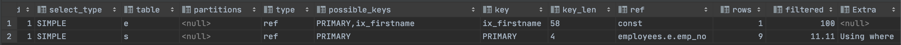
    
    - 레코드를 읽어 다른 버퍼 공간에 저장하지 안고 즉시 드리븐 테이블의 레코드를 찾아서 반환한다
- 네스티드 루프 방식과 가장 큰 차이는 `조인 버퍼 사용 여부`와 `드라이빙, 드리븐 테이블의 조인 순서` 이다
    - 조인 버퍼 사용 여부는 실행 계획에서 Extra에서 `Using Join Buffer` 문구로 확인할 수 있다
- 조인은 드라이빙 테이블에서 일치하는 레코드 건수만큼 드리븐 테이블을 검색한다
    - 드리븐 테이블에서 인덱스를 사용할 수 없는 경우 쿼리가 상당히 느려질 수 있다
    - 옵티마이저는 최대한 드리븐 테이블이 인덱스를 사용할 수 있도록 실행 계획을 수립한다
- 드리븐 테이블의 풀 테이블 스캔이나 인덱스 풀 스캔을 피할수 없는 경우 옵티마이저는 드라이빙 테이블에서 읽은 레코드를 메모리에 캐시(조인 버퍼)한 후 드리븐 테이블과 메모리 캐시를 조인하는 형태로 처리한다
- `조인 버퍼`는 `join_buffer_size` 시스템 변수로 크기를 제한할 수 있으며 조인이 완료되면 메모리에서 바로 해제된다
- 블록 네스티드 루프 조인 방식
    
    ```sql
    // MySQL 5.7 테스트, 카테시안 조인 두 테이블 간 연결 조인 조건이 없음
    SELECT *
      FROM dept_emp de,employees e
     WHERE de.from_date > '1995-01-01' AND e.emp_no < 109004;
    ```
    
    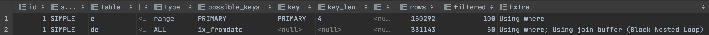
    
    - 블록 네스티드 루프 조인 순서
        1. dept_emp 테이블의 ix_fromdate 인덱스를 이용해 레코드 검색
        2. 조인에 필요한 나머지 컬럼을 모두 dept_emp 테이블로부터 읽어 조인 버퍼에 저장
        3. employees 테이블의 PK를 이용해 레코드를 검색
        4. 3번의 검색 결과에 2번의 캐시된 조인 버퍼의 레코드를 결합하여 반환
    - 조인 순서가 거꾸로인 것처럼 실행된다
    - `dept_emp` 테이블은 드라이빙 테이블이 되고, `employees` 테이블은 드리븐 테이블이 되지만 실제 드라이빙 테이블의 결과를 조인 버퍼에 담아두고, 드리븐 테이블을 먼저 읽고 조인 버퍼에서 일치하는 레코드를 찾는 방식으로 처리된다.
    - 조인 버퍼에서 사용되는 조인에서의 결과의 정렬 순서가 흐트러질 수 있음을 기억해두어야 한다
    - 8.0.18 버전부터 해시 조인 알고리즘이 도입되어, 8.0.20 버전부터 대체되어 사용된다

### 9.3.1.3 인덱스 컨디션 푸시다운(index_condition_pushdown)

- 인덱스 범위 제한 조건으로 사용하지 못하더라도 인덱스에 포함된 칼럼의 조건이 있는 경우 사용할 수 있다
- MySQL 5.6 버전부터 도입되었으나, 성능이 좋지 않았는데 8.0버전부터 성능 개선되었다
- 5.6 버전 이전(인덱스 컨디션 푸시다운 사용하지 않는 경우)
    
    ```sql
    explain
    SELECT /*+ SET_VAR(optimizer_switch='index_condition_pushdown=off') */ *
      FROM employees
     WHERE last_name = 'Action'
       AND first_name like '%sal';
    ```
    
    
    
    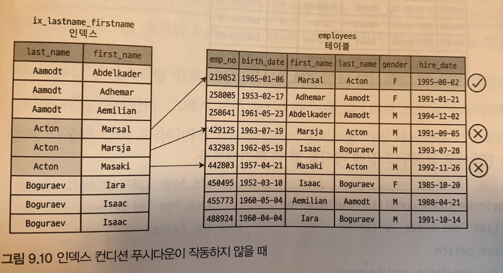
    
    - 인덱스를 비교하는 작업은 스토리지 엔진에서 수행하지만 테이블 레코드에서 first_name 조건을 비교하는 작업은 MySQL 엔진이 수행한다
    - 인덱스 범위 제한 조건으로 사용하지 못하는 first_name 조건은 MySQL 엔진이 스토리지 엔진으로 전달하지 못했다 ⇒ 8.0버전에서 핸들러 API가 개선되었다(인덱스 컨디션 푸시다운)
- 인덱스 컨디션 푸시다운 사용 예시
    
    ```sql
    explain
    SELECT *
      FROM employees
     WHERE last_name = 'Action'
       AND first_name like '%sal';
    ```
    
    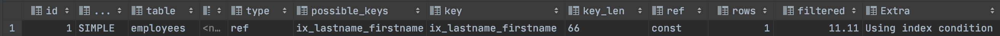
    
    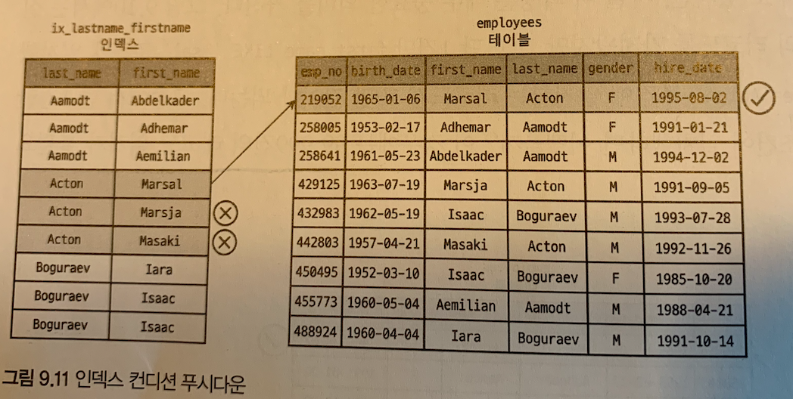
    

### 9.3.1.4 인덱스 확장(use_index_extensions)

- 테이블에서 세컨더리 인덱스에 자동으로 추가된 프라이머리 키를 활용할 수 있게 할지 결정하는 옵션이다
- 세컨더리 인덱스인 ix_fromdate는 `from_date, dept_no, emp_no` 조합으로 생성된 것처럼 동작한다
- 세컨더리 인덱스의 마지막에 자동 추가되는 프라이머리 키를 활용하도록 개선되었다
    
    ```sql
    CREATE TABLE dept_emp (
        emp_no INT NOT NULL,
        dept_no CHAR(4) NOT NULL,
        from_date DATE NOT NULL,
        to_date DATE NOT NULL,
        PRIMARY KEY (dept_no, emp_no),
        KEY ix_fromdate (from_date)
    ) ENGINE= InnoDB;
    
    EXPLAIN
    SELECT COUNT(*)
      FROM dept_emp
     WHERE from_date='1987-07-25'
       AND dept_no='d001';
    ```
    
    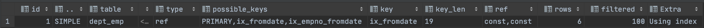
    
    - key_length 16byte ⇒ from_date(3byte) + dept_no(16byte) 확인
        - [https://stackoverflow.com/questions/52464596/mysql-char-varchar-and-decimal-byte-size](https://stackoverflow.com/questions/52464596/mysql-char-varchar-and-decimal-byte-size)
        - [http://www.incodom.kr/DB_-_데이터_타입/MYSQL](http://www.incodom.kr/DB_-_%EB%8D%B0%EC%9D%B4%ED%84%B0_%ED%83%80%EC%9E%85/MYSQL)
- 정렬 작업도 인덱스를 활용해서 처리가 가능하다
    
    ```sql
    EXPLAIN
    SELECT *
      FROM dept_emp
     WHERE from_date='1987-07-25'
     ORDER BY dept_no; // ix_fromdate 인덱스에 PK 인덱스가 추가되어 별도의 정렬이 필요가 없어짐
    ```
    
    
    

### 9.3.1.5 인덱스 머지(index_merge)

- 하나의 테이블에 대해 2개 이상의 인덱스를 이용해 쿼리를 처리하는 방식이다
- 쿼리에 사용된 각각의 조건이 서로 다른 인덱스를 사용하고, 대상 레코드가 많은 경우 사용된다
- 세부 실행 계획
    - `index_merge_intersection` (교집합)
    - `index_merge_sort_union` (정렬 후 합집합)
    - `index_merge_union` (합집합)

### 9.3.1.6 인덱스 머지 - 교집합(index_merge_intersection)

```sql
EXPLAIN
SELECT *
  FROM employees
 WHERE first_name='Georgi'
   AND emp_no BETWEEN 10000 AND 20000;
```

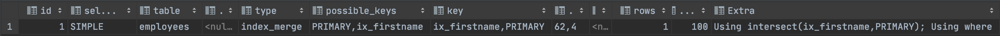

- `Using Intersection`
- 두 조건 모두 상대적으로 많은 레코드를 가져와야 한다라는 것을 예상할 수 있다
- 옵티마이저는 각 인덱스를 검색해 두 결과의 교집합만 찾아서 반환하였다
- 위의 쿼리는 `ix_first_name` 인덱스가 `PK` 인덱스를 포함하므로 인덱스 머지를 사용하지 않아도 된다

### 9.3.1.7 인덱스 머지 - 합집합(index_merge_union)

```sql
EXPLAIN
SELECT *
  FROM employees
 WHERE first_name='Matt'
    OR hire_date='1987-03-31'
```

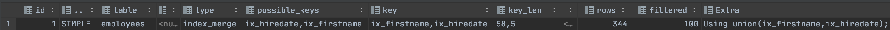

- `Using union`
- 인덱스 합집합의 중복 처리는 `우선순위 큐(Priority Queue)`를 활용한다

### 9.3.1.8 인덱스 머지 - 정렬 후 합집합(index_merge_sort_union)

```sql
EXPLAIN
SELECT *
  FROM employees
 WHERE first_name='Matt'
    OR hire_date BETWEEN '1987-03-01' AND '1987-03-31'
```

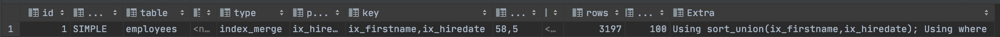

- `Using sort_union`
- 인덱스 머지 작업 중 중복 제거를 위해 정렬이 필요한 경우 사용된다 ⇒ `Sort Union` 알고리즘이 사용된다
- first_name 결과는 PK 인덱스 기준으로 정렬되어 있고, hire_date는 ix_hire_date 인덱스 기준으로 정렬되어 있으므로 중복을 제거하기 위해서는 각 집합의 정렬이 필요하다

### 9.3.1.9 세미 조인(semijoin)

- 다른 테이블과 실제 조인을 수행하지 않고, 단지 다른 테이블에서 조건에 일치하는 레코드가 있는지만 체크하는 형태의 쿼리를 말한다

```sql
//5.7 버전에서는 employees 테이블을 풀 스캔하면서 한 건 한 건 서브쿼리의 조건에 일치하는지 비교한다
EXPLAIN
SELECT *
  FROM employees e
 WHERE e.emp_no  IN
       (SELECT de.emp_no FROM dept_emp de WHERE de.from_date='1995-01-01');
```

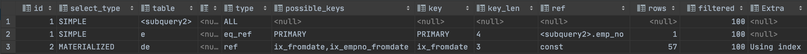

- 세미 조인 최적화 방법
    - `= (subquery)` , `IN (subquery)`
        - 세미 조인 최적화
        - IN-to-EXISTS 최적화
        - MATERIALIZATION 최적화
    - `<> (subquery)` ,  `NOT IN (subquery)`
        - IN-to-EXISTS 최적화
        - MATERIALIZATION 최적화
- 세미 조인 최적화 전략
    - `Table Pull-out`
    - `Duplicate Weed-out`
    - `First Match`
    - `Loose Scan`
    - `Materialization`

### 9.3.1.10 테이블 풀-아웃(Table Pull-out)

- 세미 조인의 서브쿼리에 사용된 테이블을 아우터 쿼리로 끄집어 낸 후 조인 쿼리로 재작성하는 형태의 최적화
- 항상 세미 조인보다 좋은 성능을 낸다

```sql
EXPLAIN
SELECT *
  FROM employees e
 WHERE e.emp_no IN (SELECT de.emp_no FROM dept_emp de WHERE de.dept_no='d009');
```

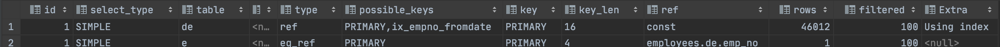

- 테이블 풀 아웃 최적화 제한 사항 및 특성
    - 세미 조인 서브쿼리에서만 사용 가능하다
    - `서브쿼리 부분이 UNIQUE 인덱스나 PK 룩업 결과가 1건`인 경우에만 사용 가능하다
    - 서브쿼리의 모든 테이블이 아우터 쿼리로 끄집어 낼 수 있다면 서브쿼리 자체는 없어진다
    - 이제부터는 서브쿼리를 조인으로 풀어서 사용할 필요가 없다

### 9.3.1.11 퍼스트 매치(firstmatch)

- `IN(subquery)` 형태의 세미 조인을 `EXISTS(subquery)` 형태로 튜닝한 것과 비슷한 방법으로 실행된다

```sql
EXPLAIN
SELECT *
  FROM employees e
 WHERE e.first_name='Matt'
   AND e.emp_no IN
       (SELECT t.emp_no
          FROM titles t
         WHERE t.from_date BETWEEN '1995-01-01' AND '1995-01-30'
       );
```

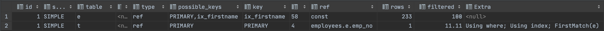

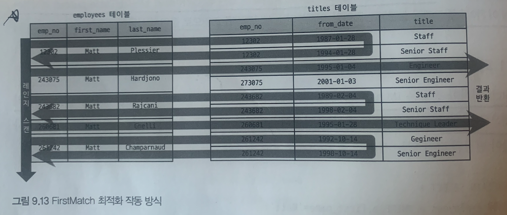

- subquery에서 결과가 일치하는 경우 `titles`의 `emp_no` 는  더이상 검색하지 않고 넘어간다
- `IN-to-EXISTS` 변환과 비슷한 처리 로직을 수행한다
- 퍼스트 매치 최적화 제한사항 및 특성
    - 퍼스트 매치 서브쿼리는 그 서브쿼리가 참조하는 모든 아우터 테이블이 먼저 조회된 이후 실행된다
    - Extra 칼럼에는 `FirstMatch(table-N)` 문구가 표시된다
    - 상관 서브쿼리에서도 사용될 수 있다
    - GROUP BY나 집합 함수가 사용된 서브쿼리의 최적화에는 사용될 수 없다
- `semijoin` , `firstmatch` 옵션이 모두 활성화된 경우에만 사용할 수 있다

### 9.3.1.12 루스 스캔(loosescan)

- `Using index for group-by` 의 루스 인덱스 스캔과 비슷한 읽기 방식을 사용한다

```sql
EXPLAIN
SELECT *
  FROM departments d
 WHERE d.dept_no IN (SELECT de.dept_no FROM dept_emp de);
```

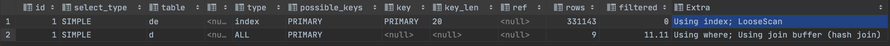

- 루스 인덱스 스캔으로 유니크한 `dept_no`만 읽기 때문에 효과적이다

### 9.3.1.13 구체화(Materialization)

- 세미 조인에 사용된 서브쿼리를 통째로 구체화해서 쿼리를 최적화
- 구체화는 `내부 임시 테이블을 생성`하는 것을 의미한다

```sql
EXPLAIN
SELECT *
  FROM employees e
 WHERE e.emp_no IN
       (SELECT de.emp_no FROM dept_emp de WHERE de.from_date='1995-01-01');
```

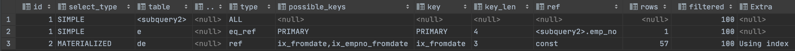

- 서브쿼리가 먼저 실행되어 임시테이블 `subquery2` 가 생성되었다
- 최종적으로 서브쿼리가 구체화된 임시테이블과  `employees` 테이블과 조인해서 결과를 반환한다
- 구체화 제한사항 및 특성
    - `IN(subquery)` 에서 서브쿼리는 상관 서브쿼리가 아니어야 한다
    - 서브쿼리는 GROUP BY나 집합 함수들이 사용돼도 구체화를 사용할 수 있다
    - 구체화가 사용된 경우에는 내부 임시 테이블이 사용된다
- `materialization` , `semijoin` 옵션이 모두 활성화된 경우에만 사용할 수 있다

### 9.3.1.14 중복 제거(Duplicated Weed-out)

- 세미 조인 서브쿼리를 일반적인 `INNER JOIN` 쿼리로 바꿔 실행하고 마지막에 중복을 제거하는 방법이다

```sql
EXPLAIN
SELECT *
  FROM employees e // driven
 WHERE e.emp_no IN
       (SELECT s.emp_no FROM salaries s WHERE s.salary > 150000); //driving 

//INNER JOIN + GROUP BY 절로 바꿔 처리하는 것과 동일하다
SELECT e.*
  FROM employees e, salaries s
 WHERE e.emp_no=s.emp_no AND s.salary > 150000
GROUP BY e.emp_no;
```

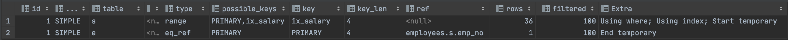

- 중복 제거 처리 과정
    1. `salaries` 의 `ix_salary` 인덱스를 스캔하여 `salary > 150000` 사원을 `employees` 와 조인
    2. 조인 결과를 임시 테이블에 저장한다
    3. 임시 테이블에 저장된 결과에서 `emp_no` 기준으로 중복을 제거한다
    4. 중복을 제거하고 남은 레코드를 최종적으로 반환한다
        
        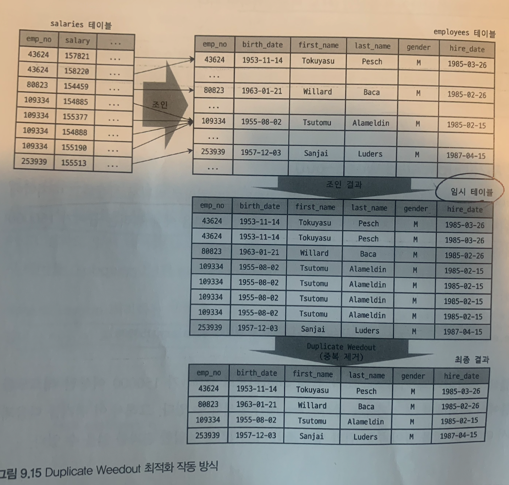
        
- 중복 제거 장점 및 제약사항
    - 서브쿼리가 상관 쿼리라도 사용할 수 있다
    - 서브쿼리가 GROUP BY나 집합 함수인 경우 사용할 수 없다
    - Duplicate Weedout은 서브쿼리의 테이블을 조인 처리하기 때문에 최적화 방법이 많다

### 9.3.1.15 컨디션 팬아웃(condition_fanout_filter)

- 여러 테이블이 조인되는 경우 일치하는 레코드 건수가 적은 순서대로 조인을 실행하는 방법이다
- 컨디션 팬아웃을 사용하지 않는 예제
    
    ```sql
    EXPLAIN
    SELECT /*+ SET_VAR(optimizer_switch='condition_fanout_filter=off') */ *
      FROM employees e INNER JOIN salaries s ON e.emp_no = s.emp_no
     WHERE e.first_name='Matt'
       AND e.hire_date BETWEEN '1985-11-21' AND '1986-11-21';
    ```
    
    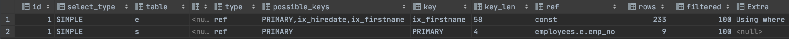
    
    - filtered ⇒ 100
- 컨디션 팬아웃을 사용하는 예제
    
    ```sql
    EXPLAIN
    SELECT  *
      FROM employees e INNER JOIN salaries s ON e.emp_no = s.emp_no
     WHERE e.first_name='Matt'
       AND e.hire_date BETWEEN '1985-11-21' AND '1986-11-21';
    ```
    
    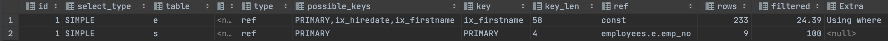
    
    - filtered ⇒ 24.39
    - 옵티마이저가 인덱스 사용할 수 있는 조건 이외의 조건(hire_date)에 대해서도 조건을 충족할지를 고려
- 컨디션  팬 아웃 사용 조건
    - WHERE 조건절에 사용된 칼럼에 대해 인덱스가 있는 경우
    - WHERE 조건절에 사용된 칼럼에 대해 히스토그램이 존재하는 경우
- `condition_fanout_filter` 이 활성화되면 옵티마이저는 더 정교한 계산을 거쳐 실행계획을 수립한다

### 9.3.1.16 파생 테이블 머지(derived_merge)

- MySQL 이전 버전에서는 FROM 절의 서브쿼리를 먼저 실행하여 임시테이블로 만들어서 처리하였다
    - `파생 테이블(Derived Table)` 이라 부른다
    - 임시 테이블로 INSERT하고 읽기 때문에 오버헤드가 추가된다
    - 임시 테이블은 처음에는 메모리에 생성되지만 건수가 많아지면 디스크로 기록되어 성능 이슈가 발생한다
- 파생 테이블 머지 예제

```sql
EXPLAIN
SELECT *
  FROM (SELECT * FROM employees WHERE first_name='Matt') derived_table
 WHERE derived_table.hire_date='1986-04-03';
```

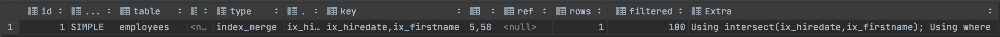

- `Using intersect`
- 외부 쿼리로 수동 병합 작성해야할 서브쿼리
    - `SUM()` , `MIN()`, `MAX()`와 같은 집계함수와 `윈도우 함수`가 사용된 서브쿼리
    - `DISTINCT` 사용된 서브쿼리
    - `GROUP BY`, `HAVING` 사용된 서브쿼리
    - `LIMIT` 사용된 서브쿼리
    - `UNION` 또는 `UNION ALL`을 포함한 서브쿼리
    - `SELECT` 절에 사용된 서브쿼리
    - `값이 변경되는 사용자 변수` 가 사용된 서브쿼리

### 9.3.1.17 인비저블 인덱스(use_invisible_indexes)

- 인덱스 가용 상태를 제어한다
- 인덱스를 삭제하지 않고 사용하지 못하게 제어한다

```sql
//가용 상태 변경
ALTER TABLE employees ALTER INDEX ix_hiredate INVISIBLE;
ALTER TABLE employees ALTER INDEX ix_hiredate VISIBLE;
```

- `use_invisible_indexes` 옵션으로 옵티마이저가 INVISIBLE 상태의 인덱스를 볼 수 있게 설정할 수 있다

### 9.3.1.18 스킵 스캔(skip_scan)

- 8.0 버전부터 인덱스 스킵 스캔 최적화가 도입되어 인덱스 후행 칼럼의 조건만으로 인덱스를 이용할 수 있다
- 인덱스 선행 칼럼이 소수의 유니크한 값을 가질때만 인덱스 스킵 스캔 최적화를 사용한다

### 9.3.1.19 해시 조인(hash_join)

- 두 테이블 중 하나를 기준으로 비트맵 해시 테이블을 메모리에 올린 후 나머지 테이블을 스캔 하면서 해싱 테이블을 적용하여 메모리에 로딩된 테이블과 비교하여 매칭되는 데이터를 추출하는 방식을 말한다
    - `빌드 테이블` 과 `프로브 테이블` 로 구성된다
    - 레코드 건 수가 적은 경우 `빌드 테이블` 로 지정하는 게 해시 테이블로 만들기 용이하다
- MySQL 8.0.18 버전부터 해시조인이 추가로 지원되었다
- 해시조인과 중첩 루프 조인 비교
    - 해시 조인은 첫 번째 레코드를 찾는 시간이 많이 걸리지만 최종 레코드를 찾는 시간은 빠르다
    - 중첩 루프 조인는 첫 번쨰 레코드를 찾는 시간이 빠르고 최종 레코드를 찾는 시간이 오래 걸린다
- 해시 조인 최적화는 네스티드 루프 조인 사용이 적합하지 않는 경우를 위한 차선책이다
- 8.0.17 버전까지는 블록 네스티드 루프 조인을 사용하였으나 해시조인으로 대체되었다

```sql
EXPLAIN
SELECT *
  FROM employees e IGNORE INDEX(`PRIMARY`, ix_hiredate)
 INNER JOIN dept_emp de IGNORE INDEX(ix_empno_fromdate, ix_fromdate) ON e.emp_no = de.emp_no AND de.from_date = e.hire_date;
```

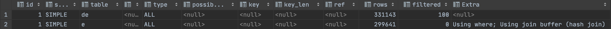

- 해시 테이블을 메모리에 저장할 때 `join_buffer_size` 변수로 크기를 제어할 수 있는 `조인 버퍼`를 사용
- 조인 버퍼보다 큰 경우 `빌드 테이블` 과 `프로브 테이블` 을 `청크` 로 분리한 뒤 조인 처리한다
    - 빌드 테이블과 프로브 테이블의 청크의 개수는 일치하여야 한다
- 해시 조인을 메모리에서 처리 가능한 경우 `클래식 해시 조인` 알고리즘을 사용한다
- 메모리에서 처리할 수 없는 경우 `그레이스 해시 조인` 알고리즘을 사용한다

### 9.3.1.20 인덱스 정렬 선호(prefer_ordering_index)

- ORDER BY, GROUP BY 에 인덱스 사용 가능한 경우 옵티마이저는 이 인덱스의 가중치를 높게 설정한다

```sql
EXPLAIN
SELECT *
  FROM employees
 WHERE hire_date BETWEEN '1985-01-01' AND '1985-02-01'
 ORDER BY emp_no;
```

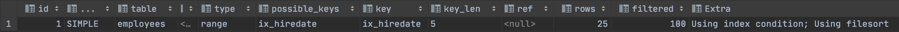

- 옵티마이저는 아래의 2가지 실행계획을 선택한다
    1. `ix_hiredate` 
    2. `PK` 
- 옵티마이저가 잘못된 실행 계획을 선택할 경우 `IGNORE INDEX` 힌트를 사용할 수 있다
- 8.0.21 버전부터 옵티마이저가 ORDER  BY를 위한 인덱스에 너무 높은 가중치를 부여하지 못하도록 `prefer_ordering_index` 옵션이 추가되었다
    
    ```sql
    EXPLAIN
    SELECT /*+ SET_VAR(optimizer_switch='prefer_ordering_index=OFF') */ *
      FROM employees
     WHERE hire_date BETWEEN '1985-01-01' AND '1985-02-01'
     ORDER BY emp_no;
    ```
    

## 9.3.2 조인 최적화 알고리즘

### 9.3.2.1 Exhaustive 검색 알고리즘 ⇒ Legacy

- 완전 탐색 알고리즘으로 5.0버전까지 사용되던 조인 최적화 기법이다
- FROM 절에 명시된 모든 테이블의 조합에 대해 실행 계획의 비용을 계산하여 최적의 조합 1개를 찾는다

### 9.3.2.2 Greedy 검색 알고리즘

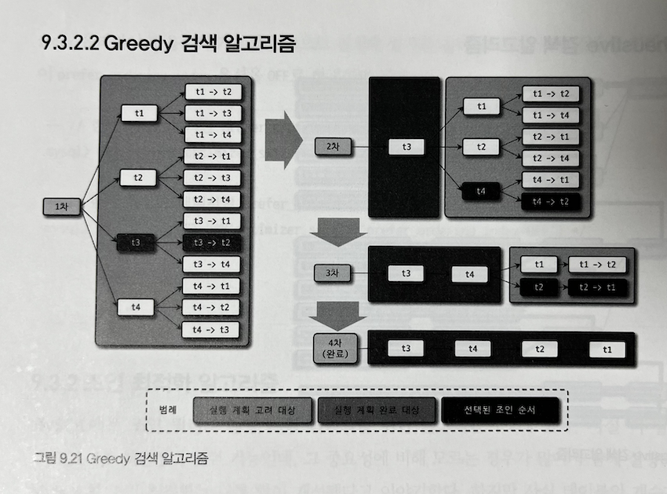

- 현재 사용되는 검색 알고리즘 방식
- `optimizer_search_depth` 로 성능을 조정한다

## 9.4 쿼리 힌트

- 옵티마이저에게 쿼리 실행 계획 수립을 알려주기 위한 방법
    - 인덱스 힌트
        - USE INDEX, STRAIGHT_JOIN …
    - 옵티마이저 힌트
        - SET_VAR, SUBQUERY, HASH_JOIN …

### 9.4.1 인덱스 힌트

- `SELECT`, `UPDATE` 명령에서만 사용 가능하다
- ANSI-SQL 표준을 지키지 못한다

### 9.4.1.1 STRAIGHT_JOIN

- `SELECT`, `UPDATE`, `DELETE` 쿼리에서 여러 테이블 조인 시 순서를 지정할 수 있다

```sql
// 인덱스 여부로 옵티마이저가 실행 계획을 작성한다
EXPLAIN
SELECT *
  FROM employees e, dept_emp de, departments d
 WHERE e.emp_no = de.emp_no
   AND d.dept_no = de.dept_no;
```

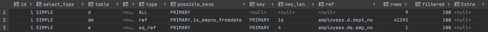

```sql
//STRAIGHT_JOIN 으로 조인의 순서를 임의로 변경한다
SELECT STRAIGHT_JOIN *
  FROM employees e, dept_emp de, departments d
 WHERE e.emp_no = de.emp_no
   AND d.dept_no = de.dept_no;
```

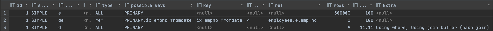

- STRAIGHT_JOIN 힌트로 조인 순서를 조정하는 경우
    - 임시테이블과 일반 테이블의 조인 : 임시 테이블을 드라이빙 테이블로 선정
    - 임시 테이블 간 조인: `레코드 건 수`가 적은 테이블을 드라이빙 테이블로 선정
    - 일반 테이블 간 조인: 인덱스 여부에 따라 `레코드 건 수`가 적은 테이블을 드라이빙 테이블로 한다
- STRAIGHT_JOIN과 비슷한 역할을 하는 옵티마이저 힌트
    - JOIN_FIXED_ORDER
    - JOIN_ORDER
    - JOIN_PREFIX
    - JOIN_SUFFIX

### 9.4.1.2 USE INDEX/ FORCE INDEX/ IGNORE INDEX

- 여러 컬럼을 포함하는 인덱스가 여러개 존재하는 경우 옵티마이저가 실행 계획을 잘못 작성할 수 있다
- `USE INDEX`, `FORCE INDEX`는 인덱스를 강제로 사용하도록 지정하는 옵션이다
    - `FORCE INDEX` 는 영향이 더 큰 힌트이나 굳이 사용할 필요성은 높지 않다
- `IGNORE INDEX`는 해당 인덱스를 사용하지 않도록 한다
- 인덱스 힌트 용도 정의 옵션 ⇒ 대부분 옵티마이저가 최적으로 지정하므로 크게 고려할 필요 없다
    - USE INDEX FOR JOIN
    - USE INDEX FOR ORDER BY
    - USE INDEX FOR GROUP BY

```sql
// PK INDEX
SELECT *
  FROM employees 
 WHERE emp_no=10001;

// USE INDEX => PK INDEX
SELECT *
  FROM employees FORCE INDEX(primary)
 WHERE emp_no=10001;

// FORCE INDEX => PK INDEX
SELECT *
  FROM employees FORCE INDEX(primary)
 WHERE emp_no=10001;
```

- PK 인덱스와 전문 검색(Full Text Search) 인덱스의 경우 해당 인덱스 선택에 가중치가 높게 설정되어 있다
- 인덱스 사용을 강제하는 것은 옵티마이저 실행 계획에 영향을 미치기 때문에 옵티마이저가  당시 통계 정보를 가지고 선택하는 것이 효율적이다

### 9.4.1.3 SQL_CALC_FOUND_ROWS ⇒ Deprecated

- `LIMIT` 제한 수의 결과를 가져왔다하더라도 전체 조회를 한 후 결과를 반환하여 총 레코드 건수를 알 수 있다
- `SQL_CALC_FOUND_ROWS` 조회 결과를 `FOUND_ROWS()` 로 결과를 가져올 수 있다

```sql
SELECT SQL_CALC_FOUND_ROWS *
  FROM employees
 LIMIT 5;

SELECT FOUND_ROWS();

//FOUND_ROWS() is deprecated and will be removed in a future release
```

### 9.4.2 옵티마이저 힌트

### 9.4.2.1 옵티마이저 힌트 종류

- 인덱스: 특정 인덱스 이름 사용할 수 있는 힌트
- 테이블: 특정 테이블 이름을 사용할 수 있는 힌트
- 쿼리 블록: 특정 쿼리 블록에서 사용할 수 있는 옵티마이저 힌트, 힌트가 명시된 쿼리 블록에 대해서만 사용됨
- 글로벌(쿼리 전체): 전체

| 힌트 | 설명 | 영향 범위 |
| --- | --- | --- |
| MAX_EXECUTION_TIME | 쿼리의 실행 시간 제한 | 글로벌 |
| RESOURCE_GROUP | 쿼리의 실행 리소스 그룹 설정 | 글로벌 |
| SET_VAL | 쿼리 실행을 위한 시스템 변수 제어 | 글로벌 |
| SUBQUERY | 서브쿼리의 세미 조인 최적화 전략 제어 | 쿼리 블록 |
| BKA, NO_BKA | BKA(Batched Key Access) 조인 사용 여부 제어 | 쿼리 블록, 테이블 |
| BNL, NO_BNL | - 블록 네스티드 루프 조인 사용 여부 제어 (MySQL 8.0.18)- 해시 조인 사용 여부 제어 (MySQL 8.0.20) | 쿼리 블록, 테이블 |
| DERIVED_CONDITION_PUSHDOWN, NO_DERIVED_CONDITION_PUSHDOWN | 외부 쿼리의 조건을 서브쿼리로 옮기는 최적화 사용 여부 제어 | 쿼리 블록, 테이블 |
| HASH_JOIN, NO_HASH_JOIN | 해시 조인 사용 여부 제어 (MySQL 8.0.18 버전에서만 사용 가능) | 쿼리 블록, 테이블 |
| JOIN_FIXED_ORDER | FROM 절에 명시된 테이블 순서대로 조인 실행 | 쿼리 블록 |
| JOIN_ORDER | 힌트에 명시된 테이블 순서대로 조인 실행 | 쿼리 블록 |
| JOIN_PREFIX | 힌트에 명시된 테이블을 조인의 드라이빙 테이블로 조인 실행 | 쿼리 블록 |
| JOIN_SUFFIX | 힌트에 명시된 테이블을 조인의 드리븐 테이블로 조인 실행 | 쿼리 블록 |
| QB_NAME | 쿼리 블록의 이름 설정을 위한 힌트 | 쿼리 블록 |
| SEMIJOIN, NO_SEMIJOIN | 서브쿼리의 세미 조인 최적화 전략 제어 | 쿼리 블록 |
| MERGE, NO_MERGE | FROM 절의 서브쿼리나 뷰를 외부 쿼리 블록으로 병합하는 최적화를 수행할지 여부 제어 | 테이블 |
| INDEX_MERGE, NO_INDEX_MERGE | 인덱스 병합 실행 계획 사용 여부 제어 | 테이블, 인덱스 |
| MRR, NO_MRR | MRR(Multi-Range Read) 사용 여부 제어 | 테이블, 인덱스 |
| NO_ICP | ICP(인덱스 컨디션 푸시다운) 최적화 전략 사용 여부 제어 | 테이블, 인덱스 |
| NO_RANGE_OPTIMIZATION | 인덱스 레인지 액세스를 비활성화 |  |
| (특정 인덱스를 사용하지 못하도록 하거나, 쿼리를 풀 테이블 스캔 방식으로 처리) | 테이블, 인덱스 |  |
| SKIP_SCAN, NO_SKIP_SCAN | 인덱스 스킵 스캔 사용 여부 제어 | 테이블, 인덱스 |
| INDEX, NO_INDEX | GROUP BY, ORDER BY, WHERE 절의 처리를 위한 인덱스 사용 여부 제어 | 인덱스 |
| GROUP_INDEX, NO_GROUP_INDEX | GROUP BY 절의 처리를 위한 인덱스 사용 여부 제어 | 인덱스 |
| JOIN_INDEX, NO_JOIN_INDEX | WHERE 절의 처리를 위한 인덱스 사용 여부 제어 | 인덱스 |
| ORDER_INDEX, NO_ORDER_INDEX | ORDER BY 절의 처리를 위한 인덱스 사용 여부 제어 | 인덱스 |

```sql
EXPLAIN
SELECT /*+ JOIN_ORDER(e, s@subq1) */ COUNT(*)
  FROM employees e
 WHERE e.first_name = 'Matt'
   AND e.emp_no IN (SELECT /*+ QB_NAME(subq1) */ s.emp_no
                      FROM salaries s
                     WHERE s.salary BETWEEN 50000 AND 50500);
```

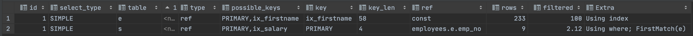

- `QB_NAME()` : 쿼리 블록 이름 부여
- `JOIN_ORDER()` : 조인 순서를 지정

### 9.4.2.2 MAX_EXECUTION_TIME

- 쿼리 실행 계획에 영향을 미치지 않는 힌트
- 쿼리 최대 실행 시간을 설정한다

```sql
SELECT /*+ MAX_EXECUTION_TIME(100) */ *
  FROM employees 
 ORDER BY lasdt_name LIMIT 1; 
```

### 9.4.2.3 SET_VAR

- 쿼리에서 시스템 변수를 제어

```sql
EXPLAIN
SELECT /*+ SET_VAR(optimizer_switch='index_merge_intersection=off')*/*
  FROM employees
 WHERE first_name='Georgi'
   AND emp_no BETWEEN 10000 AND 20000;
```

### 9.4.2.4 SEMIJOIN & NO_SEMIJOIN

- SEMIJOIN 세부 전략
    - Duplicate Weed-out ⇒ SEMIJOIN(DUPSWEEDOUT)
    - First Match ⇒ SEMIJOIN(FIRSTMATCH)
    - Loose Scan ⇒ SEMIJOIN(LOOSESCAN)
    - Materialization ⇒ SEMIJOIN(MATERIALIZATION)
    - Table Pull-out ⇒ 없음

### 9.4.2.5 SUBQUERY

- Subquery 최적화
    - IN-to-EXISTS ⇒ SUBQUERY(INTOEXISTS)
    - Materialization ⇒ SUBQUERY(MATERIALIZATION)

### 9.4.2.6 BNL & NO_BNL & HASHJOIN & NO_HASHJOIN

- 8.0.18 버전 이후 도입된 해시 조인 알고리즘이 8.0.20 버전부터 블록 네스티드 루프 조인을 대체
    - 블록 네스티드 루프 조인은 더 이상 사용되지 않음
    - `BNL`, `NO_BNL` 힌트는 사용 가능하나 해시조인을 사용하는 형태로 변경됨
- `HASHJOIN`과 `NO_HASHJOIN`은 8.0.18 버전에서만 유효하다

### 9.4.2.7 JOIN_FIXED_ORDER & JOIN_ORDER & JOIN_PREFIX & JOIN_SUFFIX

- 조인의 순서를 변형할 수 있다
- JOIN_FIXED_ORDER: STRAIGHT_JOIN
- JOIN_ORDER: 힌트 명시된 순서
- JOIN_PREFIX: 드라이빙 테이블 강제
- JOIN_SUFFIX: 드리븐 테이블 강제

### 9.4.2.8 MERGE & NO_MERGE

- 8.0버전부터 기존 FROM 절 서브쿼리를 임시 테이블로 생성되던 것을 외부 쿼리와 병합하도록 최적화되었다
- 옵티마이저가 최적화하지 못하는 경우 위의 힌트를 사용한다

```sql
EXPLAIN
SELECT /*+ MERGE(sub) */ *
  FROM (SELECT * FROM employees WHERE first_name='Matt') sub LIMIT 10;

EXPLAIN
SELECT /*+ NO_MERGE(sub) */ *
  FROM (SELECT * FROM employees WHERE first_name='Matt') sub LIMIT 10;  
```


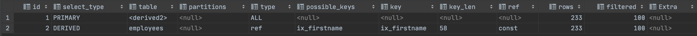

### 9.4.2.9 INDEX_MERGE & NO_INDEX_MERGE

- 하나의 테이블에 대해 여러 인덱스를 동시에 사용하는 힌트

### 9.4.2.10 NO_ICP

- 인덱스 컨디션 푸시 다운을 비활성화하도록 힌트로 지정한다

### 9.4.2.11 SKIP_SCAN & NO_SKIP_SCAN

- 인덱스 스킵 스캔 사용 여부를 힌트로 지정한다

### 9.4.2.12 INDEX & NO_INDEX

- 인덱스 힌트를 대처하는 옵티마이저 힌트
    - USE INDEX ⇒ INDEX
    - USE INDEX FOR GROUP BY ⇒ GROUP_INDEX
    - USE INDEX FOR ORDER BY ⇒ ORDER_INDEX
    - IGNORE INDEX ⇒ NO_INDEX
    - IGNORE INDEX FOR GROUP BY ⇒ NO_GROUP_INDEX
    - IGNORE INDEX FOR ORDER BY ⇒ NO_ORDER_INDEX
