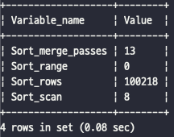

# 9. 옵티마이저와 힌트


[MySQL 8.0 Reference Manual](https://dev.mysql.com/doc/refman/8.0/en/)

[1. 개요](#1-개요)  
[2. 기본 데이터 처리](#2-기본-데이터-처리)  
[3. 고급 최적화](#3-고급-최적화)  
[4. 쿼리 힌트](#4-쿼리-힌트)  


## 1. 개요

### 1.1 쿼리 실행절차

- **MySQL 서버에서 쿼리가 실행되는 과정**
  ```text
  1) SQL 문장을 잘게 쪼개서 MySQL 서버가 이해할 수 있는 수준으로 분리(파스 트리)한다.
  2) SQL 파싱 정보(파스 트리)를 확인하면서 어떤 테이블로부터 읽고 어떤 인덱스를 이용해 테이블을 읽을지 선택한다.
  3) 두 번째 단계에서 결정된 테이블의 읽기 순서나 선택된 인덱스를 이용해 스토리지 엔진으로부터 데이터를 가져온다.
  ```
    - 첫번째 단계 : **SQL 파싱**
        - MySQL 서버의 `SQL 파서` 모듈로 처리  
          **→ SQL 문장이 문법적으로 잘못 됐다면 이 단계에서 걸러진다.**
        - SQL `파스 트리` 생성  
          **→ MySQL 서버는 SQL 문장 자체가 아니라 SQL 파스 트리를 이용해 쿼리를 실행한다.**

    - 두번째 단계 : **최적화 및 실행 계획 수립**
        - 불필요한 조건 제거 및 복잡한 연산의 단순화
        - 여러 테이블의 조인이 있는 경우 어떤 순서로 테이블을 읽을지 결정
        - 각 테이블에 사용된 조건과 인덱스 통계 정보를 이용해 사용할 인덱스 결정
        - 가져온 레코드들을 임시 테이블에 넣고 다시 한번 가공해야 하는지 결정  
      **→ 쿼리의 실행 계획이 만들어진다.**

    - 세번째 단계 : 스토리지 엔진 I/O
        - 스토리지 엔진에 레코드를 읽어오도록 요청
        - 레코드를 조인하거나 정렬하는 작업을 수행

### 1.2. 옵티마이저의 종류

- 규칙 기반 최적화
  대상 테이블의 레코드 건수나 선택도 등을 고려하지 않고 옵티마이저에 내장된 우선순위에 따라 실행 계획을 수립하는 방식
- 비용 기반 최적화
  각 단위 작업의 비용(부하) 정보와 대상 테이블의 예측된 통계 정보를 이용해 실행 계획별 비용을 산출

**→ 대부분의 DBMS가 비용 기반의 옵티마이저를 채택 (MySQL도 비용 기반 최적화)**

## 2. 기본 데이터 처리

- 모든 RDBMS는 데이터를 정렬하거나 그룹핑하는 등의 기본 데이터 가공 기능을 가지고 있다.
  SQL 실행 결과는 동일하더라도, DBMS 마다 결과를 만들어 내는 과정은 천차만별인데,  기본적인 가공을 위해 MySQL에서 어떤 알고리즘을 사용하는지 알아보자.

### 2.1 풀 테이블 스캔과 풀 인덱스 스캔

- 옵티마이저가 **풀 테이블 스캔**을 선택하는 조건
    - 테이블의 레코드 건수가 너무 작은 경우
    - `WHERE` 절이나 `ON` 절에 인덱스를 이용할 수 있는 적절한 조건이 없는 경우
    - 조건 일치 레코드 건수가 너무 많은 경우
- MySQL에는 풀 테이블 스캔을 실행할 때 한꺼번에 여러 페이지를 읽어오는 기능이 없다.
    - 하지만 InnoDB 스토리지 엔진은 특정 테이블의 연속된 데이터 페이지가 읽히면 백그라운드 스레드에 의해 **리드 어헤드 작업**이 자동으로 시작된다.
    - **리드 어헤드란** 어떤 영역의 데이터가 앞으로 필요해지리라는 것을 예측해서 요청이 오기 전에 미리 디스크에서 읽어 버퍼 풀에 캐시하는 것이다.  
  **→ 즉, 풀 테이블 스캔이 실행되면 처음 몇 개의 데이터 페이지는 포그라운드 스레드가 페이지 읽기를 실행하지만 특정 시점부터는 읽기 작업을 백그라운드 스레드로 넘긴다.**

- **리드 어헤드는 풀 테이블 스캔, 풀 인덱스 스캔에서 사용된다.**
    - `innodb_read_ahead_threshold` : 리드 어헤드의 임계값을 설정

    ```sql
    -- // 풀 인덱스 스캔 - 단순히 레코드의 건수만 필요로 하기 때문에 풀 인덱스 스캔을 하게 될 가능성이 높다.
    SELECT COUNT(*) FROM employees;
    -- // 풀 테이블 스캔
    SELECT * FROM employees;
    ```

  


### 2.2 병렬 처리

- MySQL 8.0 버전부터 쿼리의 병렬 처리가 가능해졌다.
    - `innodb_parallel_read_threshold` : 최대 몇 개의 스레드를 이용해서 병렬을 처리할지 설정

    ```sql
    -- // 0.32 sec
    SET SESSION innodb_parallel_read_threads=1;
    SELECT COUNT(*) FROM salaries;
    
    -- // 0.20 sec
    SET SESSION innodb_parallel_read_threads=2;
    SELECT COUNT(*) FROM salaries;
    
    -- // 0.18 sec
    SET SESSION innodb_parallel_read_threads=4;
    SELECT COUNT(*) FROM salaries;
    
    -- // 0.13 sec
    SET SESSION innodb_parallel_read_threads=8;
    SELECT COUNT(*) FROM salaries;
    ```

    - 병렬 처리용 스레드 개수가 늘어날수록 쿼리 시간이 줄어든다.
    - 하지만, 병렬 처리용 스레드 개수를 늘리더라도 서버 CPU 코어 개수를 넘어서는 경우에는 오히려 성능이 떨어질 수 있다.

### 2.3 ORDER BY 처리 (Using filesort)

- 대부분의 `SELECT` 쿼리에서 정렬은 필수적으로 사용된다.
- 정렬을 처리하는 방법에 따른 장단점 비교

    |  | 장점 | 단점 | Extra |
    | --- | --- | --- | --- |
    | 인덱스 이용 | - SELECT 작업 시 이미 인덱스가 정렬되어 있어 빠르다. | - INSERT, UPDATE, DELETE 작업 시 인덱스 추가/삭제 작업이 필요해서 느리다.<br>- 인덱스용 디스크 공간이 더 필요하다.<br>- 인덱스 개수가 늘어날수록 버퍼 풀을 위한 메모리가 필요하다. | 인덱스를 사용한 정렬은 별도 표시 없음 |
    | Filesort 이용 | - 정렬해야 할 레코드가 많지 않으면 메모리에서 Filesort가 처리되므로 충분히 빠르다. | - 정렬 작업이 쿼리 실행 시 처리되므로 레코드 대상 건수가 많아질수록 쿼리의 응답 속도가 느리다. | Using filesort |

**2.3.1 소트 버퍼**

- 소트 버퍼 : 정렬을 수행하기 위해 할당 받은 별도의 메모리 공간
    - 소트 버퍼는 정렬이 필요한 경우에만 할당된다.
    - 버퍼 크기는 가변적으로 증가하지만, 최대 사용 가능한 버퍼 사이즈를 설정할 수 있다.
        - `soft_buffer_size` : 최대 사용 가능한 소프트 버퍼 공간 설정
- **정렬해야할 레코드 건수가 소트 버퍼 공간을 넘어가면, 레코드를 여러 조각으로 나눠서 처리하기 때문에 임시 저장을 위해 디스크를 사용한다.**
  
  ```text
  1) 메모리의 소트 버퍼에서 정렬을 수행하고, 그 결과를 임시 디스크에 기록해 둔다.
  2) 다음 레코드를 가져와서 다시 정렬해서 반복적으로 디스크에 임시 저장한다.
  3) 각 버퍼 크기만큼 정렬된 레코드를 병합하면서 정렬을 수행한다.
     → 이 작업을 멀티 머지라고 한다.
  ```
    - 수행된 멀티 머지 횟수는 `Sort_message_passes` 상태 변수에 누적해서 집계된다.
    - 위의 작업은 디스크 쓰기와 읽기를 수행하므로, 소트 버퍼를 크게 설정하면 더 빨리질 것으로 생각하지만 실제는 그렇지 않다.
    - 일반적인 트랜잭션 처리용 MySQL 서버의 소트 버퍼 크기는 `56KB ~ 1MB` 미만이 적절하다.
    - 소트 버퍼는 여러 클라이언트가 공유해서 사용할 수 없기 때문에, 커넥션이 많을수록 정렬 작업에서 소트 버퍼로 소비되는 메모리가 늘어난다.

**2.3.2 정렬 알고리즘**

- 정렬 모드 확인

    ```sql
    -- // 옵티마이저 트레이스 활성화
    SET OPTIMIZER_TRACE = 'enabled=on', END_MARKERS_IN_JSON = on;
    SET OPTIMIZER_TRACE_MAX_MEM_SIZE=1000000;
    
    -- // 쿼리 실행
    SELECT * FROM employees ORDER BY last_name LIMIT 100000, 1;
    
    -- // 트레이스 내용 확인
    SELECT * FROM INFORMATION_SCHEMA.OPTIMIZER_TRACE \G
    ```

    - sort_algorithm 필드에 정렬 알고리즘이 표시

      

- MySQL 서버의 정렬 방식(알고리즘)
    - `<sort_key, rowid>` : 정렬 키와 레코드의 로우 아이디만 가져와서 정렬하는 방식
    - `<sort_key, additional_fields>` : 정렬 키와 레코드 전체를 가져와서 정렬하는 방식, 레코드의 컬럼들은 고정 사이즈로 메모리에 저장
    - `<sort_key, packed_additional_fields>`  : 정렬 키와 레코드 전체를 가져와서 정렬하는 방식, 레코드의 컬럼들은 가변 사이즈로 메모리에 저장

**2.3.2.1 싱글 패스 정렬 방식**

- 정렬에 필요하지 않은 컬럼까지 전부 읽어서 소트 버퍼에 담고 정렬을 수행한다.
- 테이블을 한 번만 읽지만, 대신 소트 버퍼 공간이 많이 필요하다.
- 최신 버전에서는 일반적으로 싱글 패스 정렬 방식을 주로 사용한다.

→ 싱글 패스 방식은 정렬 대상 레코드의 건수가 작은 경우 빠른 성능을 보인다.

**2.3.2.2 투 패스 정렬 방식**

- 정렬 대상 컬럼과 프라이머리 키 값만 소트 버퍼에 담아서 정렬을 수행하고, 다시 프라이머리 키로 테이블을 읽어서 조회할 컬림을 가져온다.
- 테이블을 두 번 읽는다는 단점이 있지만, 소트 버퍼에서 정렬할 수 있는 레코드가 싱글 패스 방식에 비해 더 많다.
- 다음의 경우에서는 투 패스 정렬 방식을 사용한다.
    - 레코드의 크기가 `max_length_for_sort_data` 변수에 설정된 값보다 클 때
    - `BLOB`, `TEXT` 타입의 컬럼이 `SELECT` 대상에 포함될 때

→ 투 패스 방식은 정렬 대상 레코드의 크기나 건수가 많은 경우 효율적이라고 볼 수 있다.

**2.3.3 정렬 처리 방법**
```text
1) 인덱스를 사용할 수 있다면 FileSort 과정 없이 인덱스를 순서대로 읽어서 결과를 반환한다.
2) 인덱스를 사용할 수 없다면 `WHERE` 조건에 일치하는 레코드를 검색해 정렬 버퍼에 저장하면서 정렬을 처리(Filesort)한다.
3) Filesort를 하게 되면, 조인의 드라이빙 테이블만 정렬한 다음 조인을 수행하거나, 먼저 조인을 하고 일치하는 레코드를 모두 가져온 후 정렬을 수행한다.
```

| 정렬 처리 방법 | 실행 계획의 Extra 컬럼 | 정렬 처리 방법 |
| --- | --- | --- |
| 인덱스를 이용한 정렬 | 별도 표기 없음 | 스트리밍  |
| 조인의 드라이빙 테이블만 정렬 | “Using filesort” | 버퍼링  |
| 조인에서 조인 결과를 임시 테이블로 저장 후 정렬 | “Using temporary; Using filesort” | 버퍼링 |

**2.3.3.1 인덱스를 이용한 정렬**

- 인덱스를 이용해 정렬이 처리되는 경우에는 인덱스의 순서대로 읽기만 하면 된다.
- 인덱스를 이용해서 정렬되는 조건
    - `ORDER BY`에 명시된 컬럼이 제일 먼저 읽는 테이블(조인이 사용된 경우 드라이빙 테이블)에 속하고, `ORDER BY`의 순서대로 생성된 인덱스가 있어야 한다.
    - `WHERE` 절에 첫 번째로 읽는 테이블의 컬럼에 대한 조건이 있다면, 그 조건과 `ORDER BY`는 같은 인덱스를 사용할 수 있어야 한다.
    - 여러 테이블이 조인되는 경우에는 네스트드-루프 방식의 조인(NL조인)에서만 사용할 수 있다.
    - `ODER BY` 절이 없어도 드라이빙 테이블의 프라이머리 키로 조인되는 경우 사용할 수 있다.

        ```sql
        SELECT *
        FROM employees e, salaries s
        WHERE s.emp_no = e.emp_no
            AND e.emp_no BETWEEN 10002 AND 100020
        ORDER BY e.emp_no;
        
        -- // emp_no로 자동 정렬되겠지만, 일부러 ORDER BY emp_no를 생략하는 것은 좋지 않다.
        SELECT *
        FROM employees e, salaries s
        WHERE s.emp_no = e.emp_no
            AND e.emp_no BETWEEN 10002 AND 100020;
        ```

      **✓ MySQL 서버는 정렬을 인덱스로 처리할 수 있는 경우 부가적으로 불필요한 정렬 작업을 수행하지 않으므로 ORDER BY를 넣더라도 성능상 손해가 없다. ORDER BY 절을 생략함으로써 버그 가능성을 만들지 말자.**

- 실행 계획에서 Extra 컬럼에 별도로 표시되지 않는다.

  

- 스트리밍 방식으로 정렬을 처리하므로, 제한된 건수(`LIMIT`)만큼만 읽으면서 바로바로 클라이언트로 결과를 전송해 줄 수 있다.

**2.3.3.2 조인의 드라이빙 테이블만 정렬**

- 조인이 수행되면 결과 레코드가 몇 배로 늘어나고, 레코드의 크기도 늘어나기 때문에 조인을 실행하기 전에 정렬을 하는 것이 차선책이 된다.
- 조인의 드라이빙 테이블만 정렬되는 조건
    - 조인에서 첫 번째로 읽히는 테이블(드라이빙 테이블)의 컬럼만으로 `ORDER BY` 절을 작성해야 한다.

        ```sql
        SELECT *
        FROM employees e, salaries s
        WHERE s.emp_no = e.emp_no
            AND e.emp_no BETWEEN 100002 AND 100010
        ORDER BY e.last_name;
        ```

        - `ORDER BY` 절에 명시된 `last_name` 컬럼은 테이블의 프라이머리 키와 전혀 관련이 없으므로 인덱스를 이용한 정렬이 불가능하다.

- 쿼리 실행 계획에서 Extra 컬럼에 `Using filesort` 로 표시된다.

  


**2.3.3.3 임시 테이블을 이용한 정렬**

- 테이블을 조인하는 경우, 드라이빙 테이블만으로 정렬되는 경우를 제외한 모든 조인에서 임시 테이블을 이용해 정렬한다.
- 이 방법은 정렬해야 할 레코드 건수가 가장 많기 때문에 가장 느린 정렬 방법이다.

    ```sql
    SELECT *
    FROM employees e, salaries s
    WHERE s.emp_no = e.emp_no
        AND e.emp_no BETWEEN 100002 AND 100010
    ORDER BY s.salary;
    ```

    - `ORDER BY` 절의 정렬 기준 컬럼이 드라이빙 테이블이 아닌 드리븐 테이블에 있는 `salary` 컬럼이므로, 조인된 데이터를 가지고 정렬할 수밖에 없다.

- 쿼리 실행 계획에서 Extra 컬럼에 `Using temporary; Using filesort` 로 표시된다.

  


**2.3.3.4 정렬 처리 방법의 성능 비교**

- 웹 서비스용 쿼리에서는 처리 결과의 일부만 가져오는 `LIMIT`가 거의 필수로 사용된다.
- 하지만 `ORDER BY`나 `GROUP BY` 에서 `WHERE` 조건과 `LIMIT`를 사용하는 경우, 우선 조건을 만족하는 레코드를 모두 가져와서 정렬 또는 그루핑을 수행해야하기 때문에 `LIMIT` 건수 만큼만 가져와서 처리할 수 없다.
- `WHERE` 조건에서 인덱스를 잘 활용하도록 튜닝해도 잘못된 `ORDER BY`나 `GROUP BY`를 사용하면 쿼리가 가 느려진다.
- 쿼리가 처리되는 방법
    - 스트리밍 방식
        - 조건에 일치하는 레코드가 검색될 때마다 바로바로 클라이언트로 전송해주는 방식이다.
        - 쿼리가 얼마나 많은 레코드를 조회하느냐에 상관없이 빠른 응답시간을 보장해준다.
        - MySQL 서버는 스트리밍 방식으로 처리해서 반환한다.
    - 버퍼링 방식
        - `ORDR BY`, `GROUO BY` 같은 처리는 쿼리의 결과가 스트리밍되는 것을 불가능하게 한다.
        - 버퍼링 방식으로 처리되는 쿼리는 `LIMIT` 처럼 결과 건수를 제한하는 조건이 있어도 성능 향상에 도움이 되지 않는다.
        - JDBC 라이브러리는 전체 처리 시간(Throughput)과 서버 통신 횟수를 줄이기 위해 자체적으로 레코드를 버퍼링한다.
- 정렬 처리 방법에 따른 차이 비교

    ```java
    SELECT * 
    FROM t1.col1 = t2.col1
    ORDER BY t1.col2
    LIMIT 10
    ```

    - `tb_test1`이 드라이빙 되는 경우

        | 정렬 방법 | 읽어야 할 건수 | 조인 횟수 | 정렬해야 할 대상 건수 |
        | --- | --- | --- | --- |
        | 인덱스 사용 | tb_test1 : 1건<br>tb_test2 : 10건 | 1번 | 0건 |
        | 조인의 드라이빙 테이블만 정렬 | tb_test1 : 100건<br>tb_test2 : 10건 | 1번 (LIMIT 10) | 100건<br>(tb_test1 테이블의 레코드 건수 만큼 정렬) |
        | 임시 테이블 사용 수 정렬 | tb_test1 : 100건<br>tb_test2 : 1000건 | 100번<br>(tb_test1 테이블의 레코드 건수만큼 조인 발생) | 1000건<br>(조인된 결과 레코드 건수를 전부 정렬) |
    - `tb_test2`가 드라이빙 되는 경우
    
        | 정렬 방법 | 읽어야 할 건수 | 조인 횟수 | 정렬해야 할 대상 건수 |
        | --- | --- | --- | --- |
        | 인덱스 사용 | tb_test1 : 10건<br>tb_test2 : 10건 | 10번 | 0건 |
        | 조인의 드라이빙 테이블만 정렬 | tb_test1 : 1000건<br>tb_test2 : 10건 | 10번 | 1000건<br>(tb_test2 테이블의 레코드 건수 만큼 정렬) |
        | 임시 테이블 사용 수 정렬 | tb_test1 : 1000건<br>tb_test2 : 100건 | 1000번<br>(tb_test2 테이블의 레코드 건수 만큼 조인 발생) | 1000건<br>(조인된 결과 레코드 건수를 전부 정렬) |

**2.3.4 정렬 관련 상태 변수**

- MySQL 서버는 처리하는 주요 작업에 대해서 해당 작업의 실행 횟수를 상태 변수로 저장한다.

    ```java
    FLUSH SATATUS;
    SHOW STATUS LIKE 'Sort%';
    ```

  


### 2.4 GROUP BY 처리

- `GROUP BY`에 사용된 조건은 인덱스를 사용해서 처리될 수 없으므로 `HAVING` 절을 튜닝하려고 인덱스를 생성하거나 다른 방법을 고민할 필요는 없다.
- **GROUP BY 처리 방법**

| GROUP BY 처리 방법 | 인덱스 사용 여부 | 실행 계획의 Extra 컬럼 |
| --- | --- | --- |
| 인덱스 스캔을 사용하는 GROUP BY | 사용 | 별도 표기 없음 |
| ② 루스 인덱스 스캔을 사용하는 GROUP BY | 사용 | “Using index for group-by” |
| ③ 임시 테이블을 사용하는 GROUP BY | 사용하지 못함 | “Using temporary; Using filesort” |

**2.4.1 인덱스 스캔(타이트 인덱스 스캔)을 사용하는 GROUP BY**

- 조인의 드라이빙 테이블에 속한 컬럼만 이용해 그루핑할 때, `GROUP BY` 컬럼으로 이미 인덱스가 있다면 그 인덱스르 차례대로 읽으면서 그루핑 작업을 수행하고 그 결과로 조인을 처리한다.
- 실행 계획에서 Extra 컬럼에 별도로 표시되지 않는다.

**2.4.2 루스 인덱스 스캔을 사용하는 GROUP BY**

- 루스 인덱스 스캔 방식은 인덱스의 레코드를 건더뛰면서 필요한 부분만 읽어서 가져오는 것을 의미한다.
- 쿼리 실행 계획에서 Extra 컬럼에 `Using index for group-by` 로 표시된다.

    ```sql
    EXPLAIN
    SELECT emp_no
    FROM salaries
    WHERE from_date = '1985-03-01'
    GROUP BY emp_no;
    ```

  

- 루스 인덱스 스캔 GROUP BY 조건
    - 단일 테이블에 대해 수행되는 `GROUP BY` 처리에만 사용할 수 있다.
    - 프리픽스 인덱스(컬럼의 앞쪽 일부만으로 생성된 인덱스)는 루스 인덱스 스캔을 사용할 수 없다.
- 루스 인덱스 스캔은 분포도가 좋지 않은 인덱스일수록 더 빠른 결과를 만들어낸다.

**2.4.3 임시 테이블을 사용하는 GROUP BY**

- `GROUP BY`의 기준 컬럼에 관계없이 인덱스를 전혀 사용하지 못하면 임시 테이블을 사용하여 `GROUP BY`를 처리한다.
- 내부적으로 `GROUP BY` 절의 컬럼들로 구성된 유니크 인덱스를 가진 임시 테이블을 만들어서 중복 제거와 집합 함수 연산을 수행한다.
- 쿼리 실행 계획에서 Extra 컬럼에 `Using temporary` 로 표시된다.

    ```sql
    EXPLAIN
    SELECT e.last_name, AVG(s.salary)
    FROM employees e, salaries s
    WHERE s.emp_no = e.emp_no
    GROUP BY e.last_name;
    ```

  

    - `Using filesort` 는 표시되지 않았는데, 이는 GROUP BY에서 묵시적인 정렬이 실행되지 않기 때문이다. (MySQL 8.0 이전 버전까지는 묵시적 정렬 수행)
    - `ORDER BY` 절을 추가하면 `Using temporary`와 함께 `Using filesort`가 표시된다.

### 2.5 DISTINCT 처리

- DISTINCT 키워드가 영향을 미치는 범위
    - 집합 함수와 함께 사용되는 경우
    - 집합 함수가 없는 경우
- 집합 함수와 같이 `DISTICT`가 사용되는 쿼리의 실행 계획에서 DISTICT 처리가 인덱스를 사용하지 못할 때는 항상 임시테이블이 필요하다.

**2.5.1 집합 함수 없이 사용된 DISTINCT**

- **DISTICT는 레코드를 유니크하게 조회하는 것이지, 특정 컬럼만 유니크하게 조회하는 것이 아니다.**

    ```sql
    SELECT DISTICT first_name, last_name FROM employees;
    -- // DISTICT 뒤의 괄호를 제거하여, DISTICT first_name, last_name 으로 실행된다.
    SELECT DISTICT(first_name), last_name FROM employees;
    ```


**2.5.2 집합 함수와 함께 사용된 DISTINCT**

- `COUNT()`, `MIN()`, `MAX()` 같은 집합 함수 내에서 DISTINCT 키워드가 사용되면 그 집합 함수의 인자로 전달된 컬럼값이 유니크한 것들을 가져온다.

    ```sql
    EXPLAIN
    SELECT COUNT(DISTINCT s.salary)
    FROM employees e, salaries s
    WHERE e.emp_no = s.emp_no
        AND e.emp_no BETWEEN 100001 AND 100100;
    ```

    - 위 쿼리는 `employees` 테이블과 `salaries` 테이블을 조인한 결과에서 salary 컬럼만 저장하기 위해 임시 테이블을 사용하는데, 이때 유니크 인덱스가 생성되기 때문에 레코드 건수가 많아지면 상당히 느려질 수 있다.
    - 실행 계획에는 “Using temporary” 메시지가 표시되지 않는다.

      

    ```sql
    EXPLAIN
    SELECT COUNT(DISTINCT s.salary), COUNT(DISTINCT e.last_name)
    FROM employees e, salaries s
    WHERE e.emp_no = s.emp_no
        AND e.emp_no BETWEEN 100001 AND 100100;
    ```
    
    
    
    - 위 쿼리는 집합 함수를 처리하기 위해 임시 테이블을 사용하는데, 이때 `DISTINCT` 처리를 수행할 때는 인덱스를 풀 스캔하거나 레인지 스캔하면서 임시 테이블 없이 최적화된 쿼리를 수행할 수 있다.

### 2.6 내부 임시 테이블 활용

- MySQL 엔진이 스토리지 엔진으로부터 받아온 레코드를 정렬하거나 그루핑할 때는 **내부적인** 임시 테이블을 사용한다.
- 내부적인 임시 테이블은 `CREATE TEMPORARY TABLE` 명령으로 만든 임시테이블과는 다르다.
- 임시 테이블은 다른 세션이나 쿼리에서는 보거나 사용할 수 없고, 쿼리 처리가 완료되면 자동으로 삭제된다.
    - MySQL 서버는 디스크의 임시 테이블을 생성할 때, 파일 오픈 후 즉시 파일 삭제를 실행한다. 파일이 오픈된 상태에서 삭제되면 파일이 즉시 삭제되지 않기 때문이다. 파일을 참조하는 프로세스가 모두 없어지면 그때 자동으로 파일을 삭제한다.

**2.6.1 메모리 임시 테이블과 디스크 임시 테이블**

- MySQL 디스크 저장 방식
    - MMAP 파일로 디스크에 기록
      (메모리의 내용을 파일이나 디바이스에 대응(mapping)하기 위해서 사용하는 시스템 호출)
    - InnoDB 테이블로 기록
- MySQL 8.0 버전부터는 MEMORY 스토리지 엔진 대신 가변 길이 타입을 지원하는 TempTable 스토리지 엔진이 도입되었다.
- 또한, MyISAM 스토리지 엔진을 대신해서 트랜잭션 지원 가능한 InnoDB 스토리지 엔진(또는 TempTable 스토리지 엔진의 MMAP 파일 버전)이 사용되도록 개선되었다.
- MySQL 서버가 MMAP 파일로 기록할지 InnoDB 테이블로 전환할지는 `temptable_use_mmap` 변수로 설정할 수 있다. (기본값 `ON`)

**2.6.2 임시 테이블이 필요한 쿼리**

- 내부 임시 테이블은 기본적으로 메모리상에 만들어진다.
- 대표적으로 내부 임시 테이블을 생성해야 하는 경우
    - `ORDER BY`와 `GROUP BY`에 명시된 컬럼이 다른 쿼리
    - `ORDER BY`와 `GROUP BY`에 명시된 컬럼이 조인 순서상 첫 번째 테이블이 아닌 쿼리
    - `DISTINCT`와 `ORDER BY`가 동시에 쿼리에 존재하는 경우 또는 `DISTINCT`가 인덱스로 처리되지 못하는 쿼리
    - `UNION`이나 `UNION DISTINCT`가 사용된 쿼리 (select_type 컬럼이 UNION RESULT인 경우)
    - 쿼리의 실행 계획에서 select_type이 DERIVED인 쿼리

**2.6.3 임시 테이블이 디스크에 생성되는 경우**

- 디스크 기반 임시 테이블 사용을 사용하는 경우
    - `UNION`이나 `UNION ALL`에서 `SELECT`되는 칼럼이 512바이트 이상인 컬럼이 있는 경우
    - `GROUP BY`나 `DISTINCT` 칼럼에서 512바이트 이상인 칼럼이 있는 경우
    - 메모리 임시 테이블 크기가 시스템 변수에 설정된 값보다 큰 경우

**2.6.4 임시 테이블 관련 상태 변수**

- 실행 계획상에서 “Using temporary”가 표시되면 임시 테이블을 사용했다는 사실을 알 수 있다.
- 하지만 임시 테이블이 메모리에서 처리됐는지 디스크에서 처리됐는지는 알 수 없으며, 몇 개의 임시 테이블이 사용됐는지도 알 수 없다.

    ```sql
    FLUSH STATUS;
    
    SELECT first_name, last_name
    FROM employees
    GROUP BY first_name, last_name;
    
    SHOW SESSION STATUS LIKE 'Created_tmp%';
    ```

  

    - `Created_tmp_tables` : 쿼리의 처리를 위해 만들어진 내부 임시 테이블의 개수를 누적하는 상태값 (임시 테이블이 메모리에서 만들어졌는지 디스크에서 만들어졌는지 구분하지 않고 모두 누적)
    - `Created_tmp_disk_tables` : 디스크 내부 임시 테이블이 만들어진 누적 개수만 누적한 상

## 3. 고급 최적화

## 4. 쿼리 힌트

## Reference

- [[DB] 데이터베이스 NESTED LOOPS JOIN (중첩 루프 조인)에 대하여](https://coding-factory.tistory.com/756)
- [[데이터베이스] SQL 튜닝 - 드라이빙 테이블](https://programming-workspace.tistory.com/67)
- [[MySQL] 조인 - 조인 버퍼를 이용한 조인](https://namoeye.tistory.com/entry/MySQL-조인-2)
- [MySQL Explain 실행계획 사용법 및 분석](https://nomadlee.com/mysql-explain-sql/#select-type)
- [8.2.1.16 ORDER BY Optimization](https://dev.mysql.com/doc/refman/8.0/en/order-by-optimization.html)
- [8.2.1.17 GROUP BY Optimization](https://dev.mysql.com/doc/refman/8.0/en/group-by-optimization.html)

