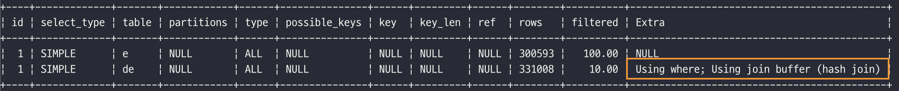

# 9. 옵티마이저와 힌트


[MySQL 8.0 Reference Manual](https://dev.mysql.com/doc/refman/8.0/en/)

[1. 개요](#1-개요)  
[2. 기본 데이터 처리](#2-기본-데이터-처리)  
[3. 고급 최적화](#3-고급-최적화)  
[4. 쿼리 힌트](#4-쿼리-힌트)  


## 1. 개요

### 1.1 쿼리 실행절차

- **MySQL 서버에서 쿼리가 실행되는 과정**
  ```text
  1) SQL 문장을 잘게 쪼개서 MySQL 서버가 이해할 수 있는 수준으로 분리(파스 트리)한다.
  2) SQL 파싱 정보(파스 트리)를 확인하면서 어떤 테이블로부터 읽고 어떤 인덱스를 이용해 테이블을 읽을지 선택한다.
  3) 두 번째 단계에서 결정된 테이블의 읽기 순서나 선택된 인덱스를 이용해 스토리지 엔진으로부터 데이터를 가져온다.
  ```
    - 첫번째 단계 : **SQL 파싱**
        - MySQL 서버의 `SQL 파서` 모듈로 처리  
          **→ SQL 문장이 문법적으로 잘못 됐다면 이 단계에서 걸러진다.**
        - SQL `파스 트리` 생성  
          **→ MySQL 서버는 SQL 문장 자체가 아니라 SQL 파스 트리를 이용해 쿼리를 실행한다.**

    - 두번째 단계 : **최적화 및 실행 계획 수립**
        - 불필요한 조건 제거 및 복잡한 연산의 단순화
        - 여러 테이블의 조인이 있는 경우 어떤 순서로 테이블을 읽을지 결정
        - 각 테이블에 사용된 조건과 인덱스 통계 정보를 이용해 사용할 인덱스 결정
        - 가져온 레코드들을 임시 테이블에 넣고 다시 한번 가공해야 하는지 결정  
      **→ 쿼리의 실행 계획이 만들어진다.**

    - 세번째 단계 : 스토리지 엔진 I/O
        - 스토리지 엔진에 레코드를 읽어오도록 요청
        - 레코드를 조인하거나 정렬하는 작업을 수행

### 1.2. 옵티마이저의 종류

- 규칙 기반 최적화
  대상 테이블의 레코드 건수나 선택도 등을 고려하지 않고 옵티마이저에 내장된 우선순위에 따라 실행 계획을 수립하는 방식
- 비용 기반 최적화
  각 단위 작업의 비용(부하) 정보와 대상 테이블의 예측된 통계 정보를 이용해 실행 계획별 비용을 산출

**→ 대부분의 DBMS가 비용 기반의 옵티마이저를 채택 (MySQL도 비용 기반 최적화)**

## 2. 기본 데이터 처리

- 모든 RDBMS는 데이터를 정렬하거나 그룹핑하는 등의 기본 데이터 가공 기능을 가지고 있다.
  SQL 실행 결과는 동일하더라도, DBMS 마다 결과를 만들어 내는 과정은 천차만별인데,  기본적인 가공을 위해 MySQL에서 어떤 알고리즘을 사용하는지 알아보자.

### 2.1 풀 테이블 스캔과 풀 인덱스 스캔

- 옵티마이저가 **풀 테이블 스캔**을 선택하는 조건
    - 테이블의 레코드 건수가 너무 작은 경우
    - `WHERE` 절이나 `ON` 절에 인덱스를 이용할 수 있는 적절한 조건이 없는 경우
    - 조건 일치 레코드 건수가 너무 많은 경우
- MySQL에는 풀 테이블 스캔을 실행할 때 한꺼번에 여러 페이지를 읽어오는 기능이 없다.
    - 하지만 InnoDB 스토리지 엔진은 특정 테이블의 연속된 데이터 페이지가 읽히면 백그라운드 스레드에 의해 **리드 어헤드 작업**이 자동으로 시작된다.
    - **리드 어헤드란** 어떤 영역의 데이터가 앞으로 필요해지리라는 것을 예측해서 요청이 오기 전에 미리 디스크에서 읽어 버퍼 풀에 캐시하는 것이다.  
  **→ 즉, 풀 테이블 스캔이 실행되면 처음 몇 개의 데이터 페이지는 포그라운드 스레드가 페이지 읽기를 실행하지만 특정 시점부터는 읽기 작업을 백그라운드 스레드로 넘긴다.**

- **리드 어헤드는 풀 테이블 스캔, 풀 인덱스 스캔에서 사용된다.**
    - `innodb_read_ahead_threshold` : 리드 어헤드의 임계값을 설정

    ```sql
    -- // 풀 인덱스 스캔 - 단순히 레코드의 건수만 필요로 하기 때문에 풀 인덱스 스캔을 하게 될 가능성이 높다.
    SELECT COUNT(*) FROM employees;
    -- // 풀 테이블 스캔
    SELECT * FROM employees;
    ```

  


### 2.2 병렬 처리

- MySQL 8.0 버전부터 쿼리의 병렬 처리가 가능해졌다.
    - `innodb_parallel_read_threshold` : 최대 몇 개의 스레드를 이용해서 병렬을 처리할지 설정

    ```sql
    -- // 0.32 sec
    SET SESSION innodb_parallel_read_threads=1;
    SELECT COUNT(*) FROM salaries;
    
    -- // 0.20 sec
    SET SESSION innodb_parallel_read_threads=2;
    SELECT COUNT(*) FROM salaries;
    
    -- // 0.18 sec
    SET SESSION innodb_parallel_read_threads=4;
    SELECT COUNT(*) FROM salaries;
    
    -- // 0.13 sec
    SET SESSION innodb_parallel_read_threads=8;
    SELECT COUNT(*) FROM salaries;
    ```

    - 병렬 처리용 스레드 개수가 늘어날수록 쿼리 시간이 줄어든다.
    - 하지만, 병렬 처리용 스레드 개수를 늘리더라도 서버 CPU 코어 개수를 넘어서는 경우에는 오히려 성능이 떨어질 수 있다.

### 2.3 ORDER BY 처리 (Using filesort)

- 대부분의 `SELECT` 쿼리에서 정렬은 필수적으로 사용된다.
- 정렬을 처리하는 방법에 따른 장단점 비교

    |  | 장점 | 단점 | Extra |
    | --- | --- | --- | --- |
    | 인덱스 이용 | - SELECT 작업 시 이미 인덱스가 정렬되어 있어 빠르다. | - INSERT, UPDATE, DELETE 작업 시 인덱스 추가/삭제 작업이 필요해서 느리다.<br>- 인덱스용 디스크 공간이 더 필요하다.<br>- 인덱스 개수가 늘어날수록 버퍼 풀을 위한 메모리가 필요하다. | 인덱스를 사용한 정렬은 별도 표시 없음 |
    | Filesort 이용 | - 정렬해야 할 레코드가 많지 않으면 메모리에서 Filesort가 처리되므로 충분히 빠르다. | - 정렬 작업이 쿼리 실행 시 처리되므로 레코드 대상 건수가 많아질수록 쿼리의 응답 속도가 느리다. | Using filesort |

**2.3.1 소트 버퍼**

- 소트 버퍼 : 정렬을 수행하기 위해 할당 받은 별도의 메모리 공간
    - 소트 버퍼는 정렬이 필요한 경우에만 할당된다.
    - 버퍼 크기는 가변적으로 증가하지만, 최대 사용 가능한 버퍼 사이즈를 설정할 수 있다.
        - `soft_buffer_size` : 최대 사용 가능한 소프트 버퍼 공간 설정
- **정렬해야할 레코드 건수가 소트 버퍼 공간을 넘어가면, 레코드를 여러 조각으로 나눠서 처리하기 때문에 임시 저장을 위해 디스크를 사용한다.**
  
  ```text
  1) 메모리의 소트 버퍼에서 정렬을 수행하고, 그 결과를 임시 디스크에 기록해 둔다.
  2) 다음 레코드를 가져와서 다시 정렬해서 반복적으로 디스크에 임시 저장한다.
  3) 각 버퍼 크기만큼 정렬된 레코드를 병합하면서 정렬을 수행한다.
     → 이 작업을 멀티 머지라고 한다.
  ```
    - 수행된 멀티 머지 횟수는 `Sort_message_passes` 상태 변수에 누적해서 집계된다.
    - 위의 작업은 디스크 쓰기와 읽기를 수행하므로, 소트 버퍼를 크게 설정하면 더 빨리질 것으로 생각하지만 실제는 그렇지 않다.
    - 일반적인 트랜잭션 처리용 MySQL 서버의 소트 버퍼 크기는 `56KB ~ 1MB` 미만이 적절하다.
    - 소트 버퍼는 여러 클라이언트가 공유해서 사용할 수 없기 때문에, 커넥션이 많을수록 정렬 작업에서 소트 버퍼로 소비되는 메모리가 늘어난다.

**2.3.2 정렬 알고리즘**

- 정렬 모드 확인

    ```sql
    -- // 옵티마이저 트레이스 활성화
    SET OPTIMIZER_TRACE = 'enabled=on', END_MARKERS_IN_JSON = on;
    SET OPTIMIZER_TRACE_MAX_MEM_SIZE=1000000;
    
    -- // 쿼리 실행
    SELECT * FROM employees ORDER BY last_name LIMIT 100000, 1;
    
    -- // 트레이스 내용 확인
    SELECT * FROM INFORMATION_SCHEMA.OPTIMIZER_TRACE \G
    ```

    - sort_algorithm 필드에 정렬 알고리즘이 표시

      

- MySQL 서버의 정렬 방식(알고리즘)
    - `<sort_key, rowid>` : 정렬 키와 레코드의 로우 아이디만 가져와서 정렬하는 방식
    - `<sort_key, additional_fields>` : 정렬 키와 레코드 전체를 가져와서 정렬하는 방식, 레코드의 칼럼들은 고정 사이즈로 메모리에 저장
    - `<sort_key, packed_additional_fields>`  : 정렬 키와 레코드 전체를 가져와서 정렬하는 방식, 레코드의 칼럼들은 가변 사이즈로 메모리에 저장

**2.3.2.1 싱글 패스 정렬 방식**

- 정렬에 필요하지 않은 칼럼까지 전부 읽어서 소트 버퍼에 담고 정렬을 수행한다.
- 테이블을 한 번만 읽지만, 대신 소트 버퍼 공간이 많이 필요하다.
- 최신 버전에서는 일반적으로 싱글 패스 정렬 방식을 주로 사용한다.

→ 싱글 패스 방식은 정렬 대상 레코드의 건수가 작은 경우 빠른 성능을 보인다.

**2.3.2.2 투 패스 정렬 방식**

- 정렬 대상 칼럼과 프라이머리 키 값만 소트 버퍼에 담아서 정렬을 수행하고, 다시 프라이머리 키로 테이블을 읽어서 조회할 컬림을 가져온다.
- 테이블을 두 번 읽는다는 단점이 있지만, 소트 버퍼에서 정렬할 수 있는 레코드가 싱글 패스 방식에 비해 더 많다.
- 다음의 경우에서는 투 패스 정렬 방식을 사용한다.
    - 레코드의 크기가 `max_length_for_sort_data` 변수에 설정된 값보다 클 때
    - `BLOB`, `TEXT` 타입의 칼럼이 `SELECT` 대상에 포함될 때

→ 투 패스 방식은 정렬 대상 레코드의 크기나 건수가 많은 경우 효율적이라고 볼 수 있다.

**2.3.3 정렬 처리 방법**
```text
1) 인덱스를 사용할 수 있다면 FileSort 과정 없이 인덱스를 순서대로 읽어서 결과를 반환한다.
2) 인덱스를 사용할 수 없다면 `WHERE` 조건에 일치하는 레코드를 검색해 정렬 버퍼에 저장하면서 정렬을 처리(Filesort)한다.
3) Filesort를 하게 되면, 조인의 드라이빙 테이블만 정렬한 다음 조인을 수행하거나, 먼저 조인을 하고 일치하는 레코드를 모두 가져온 후 정렬을 수행한다.
```

| 정렬 처리 방법 | 실행 계획의 Extra 칼럼 | 정렬 처리 방법 |
| --- | --- | --- |
| 인덱스를 이용한 정렬 | 별도 표기 없음 | 스트리밍  |
| 조인의 드라이빙 테이블만 정렬 | “Using filesort” | 버퍼링  |
| 조인에서 조인 결과를 임시 테이블로 저장 후 정렬 | “Using temporary; Using filesort” | 버퍼링 |

**2.3.3.1 인덱스를 이용한 정렬**

- 인덱스를 이용해 정렬이 처리되는 경우에는 인덱스의 순서대로 읽기만 하면 된다.
- 인덱스를 이용해서 정렬되는 조건
    - `ORDER BY`에 명시된 칼럼이 제일 먼저 읽는 테이블(조인이 사용된 경우 드라이빙 테이블)에 속하고, `ORDER BY`의 순서대로 생성된 인덱스가 있어야 한다.
    - `WHERE` 절에 첫 번째로 읽는 테이블의 칼럼에 대한 조건이 있다면, 그 조건과 `ORDER BY`는 같은 인덱스를 사용할 수 있어야 한다.
    - 여러 테이블이 조인되는 경우에는 네스트드-루프 방식의 조인(NL조인)에서만 사용할 수 있다.
    - `ODER BY` 절이 없어도 드라이빙 테이블의 프라이머리 키로 조인되는 경우 사용할 수 있다.

        ```sql
        SELECT *
        FROM employees e, salaries s
        WHERE s.emp_no = e.emp_no
            AND e.emp_no BETWEEN 10002 AND 100020
        ORDER BY e.emp_no;
        
        -- // emp_no로 자동 정렬되겠지만, 일부러 ORDER BY emp_no를 생략하는 것은 좋지 않다.
        SELECT *
        FROM employees e, salaries s
        WHERE s.emp_no = e.emp_no
            AND e.emp_no BETWEEN 10002 AND 100020;
        ```

      **✓ MySQL 서버는 정렬을 인덱스로 처리할 수 있는 경우 부가적으로 불필요한 정렬 작업을 수행하지 않으므로 ORDER BY를 넣더라도 성능상 손해가 없다. ORDER BY 절을 생략함으로써 버그 가능성을 만들지 말자.**

- 실행 계획에서 Extra 칼럼에 별도로 표시되지 않는다.

  

- 스트리밍 방식으로 정렬을 처리하므로, 제한된 건수(`LIMIT`)만큼만 읽으면서 바로바로 클라이언트로 결과를 전송해 줄 수 있다.

**2.3.3.2 조인의 드라이빙 테이블만 정렬**

- 조인이 수행되면 결과 레코드가 몇 배로 늘어나고, 레코드의 크기도 늘어나기 때문에 조인을 실행하기 전에 정렬을 하는 것이 차선책이 된다.
- 조인의 드라이빙 테이블만 정렬되는 조건
    - 조인에서 첫 번째로 읽히는 테이블(드라이빙 테이블)의 칼럼만으로 `ORDER BY` 절을 작성해야 한다.

        ```sql
        SELECT *
        FROM employees e, salaries s
        WHERE s.emp_no = e.emp_no
            AND e.emp_no BETWEEN 100002 AND 100010
        ORDER BY e.last_name;
        ```

        - `ORDER BY` 절에 명시된 `last_name` 칼럼은 테이블의 프라이머리 키와 전혀 관련이 없으므로 인덱스를 이용한 정렬이 불가능하다.

- 쿼리 실행 계획에서 Extra 칼럼에 `Using filesort` 로 표시된다.

  


**2.3.3.3 임시 테이블을 이용한 정렬**

- 테이블을 조인하는 경우, 드라이빙 테이블만으로 정렬되는 경우를 제외한 모든 조인에서 임시 테이블을 이용해 정렬한다.
- 이 방법은 정렬해야 할 레코드 건수가 가장 많기 때문에 가장 느린 정렬 방법이다.

    ```sql
    SELECT *
    FROM employees e, salaries s
    WHERE s.emp_no = e.emp_no
        AND e.emp_no BETWEEN 100002 AND 100010
    ORDER BY s.salary;
    ```

    - `ORDER BY` 절의 정렬 기준 칼럼이 드라이빙 테이블이 아닌 드리븐 테이블에 있는 `salary` 칼럼이므로, 조인된 데이터를 가지고 정렬할 수밖에 없다.

- 쿼리 실행 계획에서 Extra 칼럼에 `Using temporary; Using filesort` 로 표시된다.

  


**2.3.3.4 정렬 처리 방법의 성능 비교**

- 웹 서비스용 쿼리에서는 처리 결과의 일부만 가져오는 `LIMIT`가 거의 필수로 사용된다.
- 하지만 `ORDER BY`나 `GROUP BY` 에서 `WHERE` 조건과 `LIMIT`를 사용하는 경우, 우선 조건을 만족하는 레코드를 모두 가져와서 정렬 또는 그루핑을 수행해야하기 때문에 `LIMIT` 건수 만큼만 가져와서 처리할 수 없다.
- `WHERE` 조건에서 인덱스를 잘 활용하도록 튜닝해도 잘못된 `ORDER BY`나 `GROUP BY`를 사용하면 쿼리가 가 느려진다.
- 쿼리가 처리되는 방법
    - 스트리밍 방식
        - 조건에 일치하는 레코드가 검색될 때마다 바로바로 클라이언트로 전송해주는 방식이다.
        - 쿼리가 얼마나 많은 레코드를 조회하느냐에 상관없이 빠른 응답시간을 보장해준다.
        - MySQL 서버는 스트리밍 방식으로 처리해서 반환한다.
    - 버퍼링 방식
        - `ORDR BY`, `GROUO BY` 같은 처리는 쿼리의 결과가 스트리밍되는 것을 불가능하게 한다.
        - 버퍼링 방식으로 처리되는 쿼리는 `LIMIT` 처럼 결과 건수를 제한하는 조건이 있어도 성능 향상에 도움이 되지 않는다.
        - JDBC 라이브러리는 전체 처리 시간(Throughput)과 서버 통신 횟수를 줄이기 위해 자체적으로 레코드를 버퍼링한다.
- 정렬 처리 방법에 따른 차이 비교

    ```java
    SELECT * 
    FROM t1.col1 = t2.col1
    ORDER BY t1.col2
    LIMIT 10
    ```

    - `tb_test1`이 드라이빙 되는 경우

        | 정렬 방법 | 읽어야 할 건수 | 조인 횟수 | 정렬해야 할 대상 건수 |
        | --- | --- | --- | --- |
        | 인덱스 사용 | tb_test1 : 1건<br>tb_test2 : 10건 | 1번 | 0건 |
        | 조인의 드라이빙 테이블만 정렬 | tb_test1 : 100건<br>tb_test2 : 10건 | 1번 (LIMIT 10) | 100건<br>(tb_test1 테이블의 레코드 건수 만큼 정렬) |
        | 임시 테이블 사용 수 정렬 | tb_test1 : 100건<br>tb_test2 : 1000건 | 100번<br>(tb_test1 테이블의 레코드 건수만큼 조인 발생) | 1000건<br>(조인된 결과 레코드 건수를 전부 정렬) |
    - `tb_test2`가 드라이빙 되는 경우
    
        | 정렬 방법 | 읽어야 할 건수 | 조인 횟수 | 정렬해야 할 대상 건수 |
        | --- | --- | --- | --- |
        | 인덱스 사용 | tb_test1 : 10건<br>tb_test2 : 10건 | 10번 | 0건 |
        | 조인의 드라이빙 테이블만 정렬 | tb_test1 : 1000건<br>tb_test2 : 10건 | 10번 | 1000건<br>(tb_test2 테이블의 레코드 건수 만큼 정렬) |
        | 임시 테이블 사용 수 정렬 | tb_test1 : 1000건<br>tb_test2 : 100건 | 1000번<br>(tb_test2 테이블의 레코드 건수 만큼 조인 발생) | 1000건<br>(조인된 결과 레코드 건수를 전부 정렬) |

**2.3.4 정렬 관련 상태 변수**

- MySQL 서버는 처리하는 주요 작업에 대해서 해당 작업의 실행 횟수를 상태 변수로 저장한다.

    ```java
    FLUSH SATATUS;
    SHOW STATUS LIKE 'Sort%';
    ```

  


### 2.4 GROUP BY 처리

- `GROUP BY`에 사용된 조건은 인덱스를 사용해서 처리될 수 없으므로 `HAVING` 절을 튜닝하려고 인덱스를 생성하거나 다른 방법을 고민할 필요는 없다.
- **GROUP BY 처리 방법**

| GROUP BY 처리 방법 | 인덱스 사용 여부 | 실행 계획의 Extra 칼럼 |
| --- | --- | --- |
| 인덱스 스캔을 사용하는 GROUP BY | 사용 | 별도 표기 없음 |
| 루스 인덱스 스캔을 사용하는 GROUP BY | 사용 | “Using index for group-by” |
| 임시 테이블을 사용하는 GROUP BY | 사용하지 못함 | “Using temporary; Using filesort” |

**2.4.1 인덱스 스캔(타이트 인덱스 스캔)을 사용하는 GROUP BY**

- 조인의 드라이빙 테이블에 속한 칼럼만 이용해 그루핑할 때, `GROUP BY` 칼럼으로 이미 인덱스가 있다면 그 인덱스르 차례대로 읽으면서 그루핑 작업을 수행하고 그 결과로 조인을 처리한다.
- 실행 계획에서 Extra 칼럼에 별도로 표시되지 않는다.

**2.4.2 루스 인덱스 스캔을 사용하는 GROUP BY**

- 루스 인덱스 스캔 방식은 인덱스의 레코드를 건더뛰면서 필요한 부분만 읽어서 가져오는 것을 의미한다.
- 쿼리 실행 계획에서 Extra 칼럼에 `Using index for group-by` 로 표시된다.

    ```sql
    EXPLAIN
    SELECT emp_no
    FROM salaries
    WHERE from_date = '1985-03-01'
    GROUP BY emp_no;
    ```

  

- 루스 인덱스 스캔 GROUP BY 조건
    - 단일 테이블에 대해 수행되는 `GROUP BY` 처리에만 사용할 수 있다.
    - 프리픽스 인덱스(칼럼의 앞쪽 일부만으로 생성된 인덱스)는 루스 인덱스 스캔을 사용할 수 없다.
- 루스 인덱스 스캔은 분포도가 좋지 않은 인덱스일수록 더 빠른 결과를 만들어낸다.

**2.4.3 임시 테이블을 사용하는 GROUP BY**

- `GROUP BY`의 기준 칼럼에 관계없이 인덱스를 전혀 사용하지 못하면 임시 테이블을 사용하여 `GROUP BY`를 처리한다.
- 내부적으로 `GROUP BY` 절의 칼럼들로 구성된 유니크 인덱스를 가진 임시 테이블을 만들어서 중복 제거와 집합 함수 연산을 수행한다.
- 쿼리 실행 계획에서 Extra 칼럼에 `Using temporary` 로 표시된다.

    ```sql
    EXPLAIN
    SELECT e.last_name, AVG(s.salary)
    FROM employees e, salaries s
    WHERE s.emp_no = e.emp_no
    GROUP BY e.last_name;
    ```

  

    - `Using filesort` 는 표시되지 않았는데, 이는 GROUP BY에서 묵시적인 정렬이 실행되지 않기 때문이다. (MySQL 8.0 이전 버전까지는 묵시적 정렬 수행)
    - `ORDER BY` 절을 추가하면 `Using temporary`와 함께 `Using filesort`가 표시된다.

### 2.5 DISTINCT 처리

- DISTINCT 키워드가 영향을 미치는 범위
    - 집합 함수와 함께 사용되는 경우
    - 집합 함수가 없는 경우
- 집합 함수와 같이 `DISTICT`가 사용되는 쿼리의 실행 계획에서 DISTICT 처리가 인덱스를 사용하지 못할 때는 항상 임시테이블이 필요하다.

**2.5.1 집합 함수 없이 사용된 DISTINCT**

- **DISTICT는 레코드를 유니크하게 조회하는 것이지, 특정 칼럼만 유니크하게 조회하는 것이 아니다.**

    ```sql
    SELECT DISTICT first_name, last_name FROM employees;
    -- // DISTICT 뒤의 괄호를 제거하여, DISTICT first_name, last_name 으로 실행된다.
    SELECT DISTICT(first_name), last_name FROM employees;
    ```


**2.5.2 집합 함수와 함께 사용된 DISTINCT**

- `COUNT()`, `MIN()`, `MAX()` 같은 집합 함수 내에서 DISTINCT 키워드가 사용되면 그 집합 함수의 인자로 전달된 칼럼값이 유니크한 것들을 가져온다.

    ```sql
    EXPLAIN
    SELECT COUNT(DISTINCT s.salary)
    FROM employees e, salaries s
    WHERE e.emp_no = s.emp_no
        AND e.emp_no BETWEEN 100001 AND 100100;
    ```

    - 위 쿼리는 `employees` 테이블과 `salaries` 테이블을 조인한 결과에서 salary 칼럼만 저장하기 위해 임시 테이블을 사용하는데, 이때 유니크 인덱스가 생성되기 때문에 레코드 건수가 많아지면 상당히 느려질 수 있다.
    - 실행 계획에는 “Using temporary” 메시지가 표시되지 않는다.

      

    ```sql
    EXPLAIN
    SELECT COUNT(DISTINCT s.salary), COUNT(DISTINCT e.last_name)
    FROM employees e, salaries s
    WHERE e.emp_no = s.emp_no
        AND e.emp_no BETWEEN 100001 AND 100100;
    ```
    
    
    
    - 위 쿼리는 집합 함수를 처리하기 위해 임시 테이블을 사용하는데, 이때 `DISTINCT` 처리를 수행할 때는 인덱스를 풀 스캔하거나 레인지 스캔하면서 임시 테이블 없이 최적화된 쿼리를 수행할 수 있다.

### 2.6 내부 임시 테이블 활용

- MySQL 엔진이 스토리지 엔진으로부터 받아온 레코드를 정렬하거나 그루핑할 때는 **내부적인** 임시 테이블을 사용한다.
- 내부적인 임시 테이블은 `CREATE TEMPORARY TABLE` 명령으로 만든 임시테이블과는 다르다.
- 임시 테이블은 다른 세션이나 쿼리에서는 보거나 사용할 수 없고, 쿼리 처리가 완료되면 자동으로 삭제된다.
    - MySQL 서버는 디스크의 임시 테이블을 생성할 때, 파일 오픈 후 즉시 파일 삭제를 실행한다. 파일이 오픈된 상태에서 삭제되면 파일이 즉시 삭제되지 않기 때문이다. 파일을 참조하는 프로세스가 모두 없어지면 그때 자동으로 파일을 삭제한다.

**2.6.1 메모리 임시 테이블과 디스크 임시 테이블**

- MySQL 디스크 저장 방식
    - MMAP 파일로 디스크에 기록
      (메모리의 내용을 파일이나 디바이스에 대응(mapping)하기 위해서 사용하는 시스템 호출)
    - InnoDB 테이블로 기록
- MySQL 8.0 버전부터는 MEMORY 스토리지 엔진 대신 가변 길이 타입을 지원하는 TempTable 스토리지 엔진이 도입되었다.
- 또한, MyISAM 스토리지 엔진을 대신해서 트랜잭션 지원 가능한 InnoDB 스토리지 엔진(또는 TempTable 스토리지 엔진의 MMAP 파일 버전)이 사용되도록 개선되었다.
- MySQL 서버가 MMAP 파일로 기록할지 InnoDB 테이블로 전환할지는 `temptable_use_mmap` 변수로 설정할 수 있다. (기본값 `ON`)

**2.6.2 임시 테이블이 필요한 쿼리**

- 내부 임시 테이블은 기본적으로 메모리상에 만들어진다.
- 대표적으로 내부 임시 테이블을 생성해야 하는 경우
    - `ORDER BY`와 `GROUP BY`에 명시된 칼럼이 다른 쿼리
    - `ORDER BY`와 `GROUP BY`에 명시된 칼럼이 조인 순서상 첫 번째 테이블이 아닌 쿼리
    - `DISTINCT`와 `ORDER BY`가 동시에 쿼리에 존재하는 경우 또는 `DISTINCT`가 인덱스로 처리되지 못하는 쿼리
    - `UNION`이나 `UNION DISTINCT`가 사용된 쿼리 (select_type 칼럼이 UNION RESULT인 경우)
    - 쿼리의 실행 계획에서 select_type이 DERIVED인 쿼리

**2.6.3 임시 테이블이 디스크에 생성되는 경우**

- 디스크 기반 임시 테이블 사용을 사용하는 경우
    - `UNION`이나 `UNION ALL`에서 `SELECT`되는 칼럼이 512바이트 이상인 칼럼이 있는 경우
    - `GROUP BY`나 `DISTINCT` 칼럼에서 512바이트 이상인 칼럼이 있는 경우
    - 메모리 임시 테이블 크기가 시스템 변수에 설정된 값보다 큰 경우

**2.6.4 임시 테이블 관련 상태 변수**

- 실행 계획상에서 “Using temporary”가 표시되면 임시 테이블을 사용했다는 사실을 알 수 있다.
- 하지만 임시 테이블이 메모리에서 처리됐는지 디스크에서 처리됐는지는 알 수 없으며, 몇 개의 임시 테이블이 사용됐는지도 알 수 없다.

    ```sql
    FLUSH STATUS;
    
    SELECT first_name, last_name
    FROM employees
    GROUP BY first_name, last_name;
    
    SHOW SESSION STATUS LIKE 'Created_tmp%';
    ```

  

    - `Created_tmp_tables` : 쿼리의 처리를 위해 만들어진 내부 임시 테이블의 개수를 누적하는 상태값 (임시 테이블이 메모리에서 만들어졌는지 디스크에서 만들어졌는지 구분하지 않고 모두 누적)
    - `Created_tmp_disk_tables` : 디스크 내부 임시 테이블이 만들어진 누적 개수만 누적한 상


## 3. 고급 최적화

MySQL 서버의 옵티마이저가 실행 계획을 수립할 때 통계 정보와 옵티마이저 옵션을 결합해서 최적의 실행 계획을 수립하게 된다.

### 3.1 옵티마이저 스위치 옵션

- 옵티마이저 스위치 옵션은 `optimazer_switch` 변수를 이용해서 제어한다.
- 옵티마이저 스위치 옵션은 글로벌 또는 세션별로 설정할 수 있으며, `SET_VAR` 쿼리 힌트로 현재 쿼리에만 설정할 수도 있다.

    ```sql
    -- // 글로벌 변수
    SET GLOBAL optimizer_switch = 'index_merge=on, index_merge_union=on';
    
    -- // 세션 변수
    SET SESSION optimizer_switch = 'index_merge=on, index_merge_union=on';
    
    -- // 현재 쿼리에만 적용
    SET /*+ SET_VAR(optimizer_switch = 'condition_fanout_filter=off') */
    ... 
    FROM ...
    ```

**3.1.1 MRR과 배치 키 액세스 (mrr & batched_key_access)**

- 조인 처리는 MySQL 엔진이 담당하지만, 실제 레코드를 검색하고 읽는 부분은 스토리지 엔진이 담당한다.
- MySQL 서버가 기존에 지원하던 조인 방식은 네스티드 루프 조인이다.
    - 네스티드 루프 조인이란, 드라이빙 테이블의 레코드를 한 건 읽어서 드리븐 테이블의 일치하는 레코드를 찾아서 조인을 수행하는 방식이다.
- MRR(Multi-Range Read)은 드라이빙 테이블의 레코드를 읽어서 드리븐 테이블과 조인을 즉시 실행하지 않고, 조인 대상을 버퍼링한다.
- 조인 버퍼에 레코드가 가득 차면 MySQL 엔진은 버퍼링된 레코드를 스토리지 엔진으로 한번에 요청한다.
- **MRR을 응용해서 실행되는 조인 방식을 BKA(Batched Key Access) 조인이라고 한다.**
    - BKA 조인은 쿼리 특성에 따라 큰 도움이 되는 경우도 있지만, 부가적인 정렬 작업이 필요해서 성능에 안좋은 영향을 미치는 경우도 있다.

**3.1.2 블록 네스티드 루프 조인 (block_nested_loop)**

- MySQL 서버에서 사용되는 대부분의 조인은 네스티드 루프 조인이다.
- 네스티드 루프 조인은 조인의 연결 조건이 되는 칼럼에 모두 인덱스가 있는 경우에 사용되는 조인 방식이다.

    ```sql
    EXPLAIN
    SELECT *
    FROM employees e
        INNER JOIN salaries s ON s.emp_no = e.emp_no
            AND s.from_date <= NOW()
            AND s.to_date >= NOW()
    WHERE e.first_name = 'Amor';
    ```

    - 이러한 형태의 조인은 프로그래밍 언어에서 마치 중첩된 반복 명령을 사용하는 것처럼 작동한다고 해서 네스티드 루프 조인이라고 한다.

      ```java
      for (e IN employees) {
          for (s IN salaries) {
              if (condition_matched) return (e, s);
          }
      }
      ```

- 조인 버퍼가 사용되는지 여부와 조인에서 드라이빙 테이블과 드리븐 테이블이 어떤 순서로 조인되는지에 따라 네스티드 루프 조인과 블록 네스티드 루프 조인이 구분된다.
    - MySQL 8.0.20 버전부터는 블록 네스티드 루프 조인은 더이상 사용되지 않고, 해시 조인 알고리즘이 대체되어 사용된다.
- 쿼리 실행 계획에서 Extra 칼럼에 “Using Join Buffer”라는 문구가 표시되면 조인 버퍼를 사용한다는 것을 의미한다.
- 조인은 드라이빙 테이블에서 일치하는 레코드의 건수만큼 드리븐 테이블을 검색하면서 처리된다.
    - **드리븐 테이블을 검색할 때 인덱스를 사용할 수 없는 쿼리는 상당히 느려지며, 옵티마이저는 최대한 드리븐 테이블의 검색이 인덱스를 사용할 수 있게 실행 계획을 수립한다.**
    - 어떤 방식으로도 드리븐 테이블의 풀 테이블 스캔이나 인덱스 풀 스캔을 피할 수 없다면, 옵티마이저는 드라이빙 테이블에서 읽은 레코드를 메모리에 캐시한 후 드리븐 테이블과 메모리 캐시를 조인하는 형태로 처리한다. (**조인 버퍼**)
- 일반적으로 조인이 수행된 후 가져오는 결과는 드라이빙 테이블의 순서에 의해 결정되지만, **조인 버퍼가 사용되는 조인에서는 결과의 정렬 순서가 흐트러질 수 있음을 기억해야 한다.**

    ```sql
    EXPLAIN
    SELECT *
    FROM dept_emp de, employees e
    WHERE de.from_date >= '1995-01-01' AND e.emp_no < 109004;
    ```

  


**3.1.3 인덱스 컨디션 푸시다운 (index_condition_pushdown)**

- MySQL 5.6 버전부터는 인덱스를 범위 제한 조건으로 사용하지 못하더라도, 인덱스에 포함된 칼럼의 조건이 있다면 한꺼번에 모아서 스토리지 엔진으로 전달할 수 있다.

    ```sql
    ALTER TABLE employees ADD INDEX ix_lastname_firstname (last_name, first_name);
    
    SET optimizer_switch = 'index_condition_pushdown = off';
    SHOW VARIABLES LIKE 'optimizer_switch' \G
    ```

    ```sql
    SELECT * 
    FROM employees
    WHERE last_name = 'Acton'
      AND first_name LIKE '%sal';
    ```

    - 인덱스의 특정 범위만 조회할 수 있는 조건
      `last_name = ‘Acton’`
    - 결과를 하나씩 비교해보는 조건(체크 조건 또는 필터링 조건)
      `first_name LIKE ‘%sal’`


- **인덱스 컨디션 푸시다운 기능은 쿼리의 성능이 몇 배로 향상될 수 있는 중요한 기능이다.**

**3.1.4 인덱스 확장 (use_index_extentions)**

- 세컨더리 인덱스에 자동으로 추가된 프라이머리 키를 활용할 수 있게 할지 결정하는 옵션이다.
- InnoDB 스토리지 엔진은 프라이머리 키를 클러스터링 키로 생성한다. **그래서 모든 세컨더리 인덱스는 리프 노드에 프라이머리 키 값을 가진다.**

    ```sql
    CREATE TABLE dept_emp (
      emp_no INT NOT NULL,
      dept_no CHAR(4) NOT NULL,
      from_date DATE NOT NULL,
      to_date DATE NOT NULL,
      PRIMARY KEY (dept_no, emp_no),
      KEY ix_fromdate (from_date)
    ) ENGINE=InnoDB;
    ```

    - 프라이머리 키  : `(dept_no, emp_no)`, 세컨더리 인덱스 : `from_date`  
      → `ix_fromdate` 인덱스는 `(from_date, dept_no, emp_no)` 조합으로 인덱스를 생성한 것과 흡사하게 작동할 수 있다.
    - key_len 칼럼은 인덱스를 구성하는 칼럼 중에 어느 칼럼까지 사용했는지를 바이트 수로 보여준다.

        ```sql
        -- // key_len : 19. from_date(3바이트) + dept_emp(16바이트)
        EXPLAIN 
        SELECT COUNT(*) 
        FROM dept_emp 
        WHERE from_date = '1987-07-25' 
          AND dept_no = 'd001';
        
        -- // key_len : 3. from_date(3바이트)
        EXPLAIN 
        SELECT COUNT(*) 
        FROM dept_emp 
        WHERE from_date = '1987-07-25';
        
        -- // Extra : NULL (별도의 정렬 작업 없이 인덱스 순서대로 레코드를 읽었다는 의미)
        EXPLAIN 
        SELECT *
        FROM dept_emp 
        WHERE from_date = '1987-07-25' 
        ORDER BY dept_no;
        ```
    
**3.1.5 인덱스 머지 (index_merge)**

- 대부분 옵티마이저는 테이블별로 하나의 인덱스만 사용하도록 실행 계획을 수립하는데, 인덱스 머지 실행 계획을 사용하면 하나의 테이블에 대해 2개 이상의 인덱스를 이용해 쿼리를 처리한다.
- 쿼리에 사용된 각각의 조건이 서로 다른 인덱스를 사용할 수 있고, 그 조건을 만족하는 레코드 건수가 많을 것으로 예상될 때 MySQL 서버는 인덱스 머지 실행 계획을 선택한다.
- 병합 방식에 따른 인덱스 머지의 세부 실행 계획
    - 교집합 (`index_merge_intersection`)
    - 정렬 후 합집합 (`index_merge_sort_union`)
    - 합집합 (`index_merge_uinon`)

**3.1.6 인덱스 머지 - 교집합 (index_merge_intersection)**

- 쿼리 실행 계획에서 Extra 칼럼에 `Using intersect` 으로 표시된다.

    ```sql
    EXPLAIN
    SELECT * 
    FROM employees
    WHERE first_name = 'Georgi'
      AND emp_no BETWEEN 10000 AND 20000;
    
    -- // 245건 
    SELECT COUNT(*) FROM employees WHERE first_name = 'Georgi';
    
    -- // 10000건
    SELECT COUNT(*) FROM employees WHERE emp_no BETWEEN 10000 AND 20000;
    
    -- // 14건
    SELECT COUNT(*) FROM employees WHERE first_name = 'Georgi' AND emp_no BETWEEN 10000 AND 20000;
    ```

    - 두 조건 모두 상대적으로 많은 레코드를 가져와야 해서 옵티마이저는 `ix_firstname`과 `PRIMARY` 키를 모두 사용해서 쿼리를 처리하기로 결정한다.
        - `PRIMARY` 키만 사용하는 경우에는 10,000건을 읽어서 9,984건을 사용하지 못함
        - `ix_firstname` 인덱스만 사용하는 경우에는 253건을 읽어서 239건을 사용하지 못함
    - `ix_firstname` 인덱스는 프라이머리 키인 emp_no 칼럼을 포함하고 있기 때문에 `ix_firstname` 인덱스만 사용하는 것이 더 성능이 좋을 것으로 생각할 수도 있다.
      → 서버 전체, 현재 세션, 현재 쿼리별로 인덱스 머지 최적화를 비활성화 할 수 있다.

**3.1.7 인덱스 머지 - 합집합 (index_merge_union)**

- 쿼리 실행 계획에서 Extra 칼럼에 `Using union` 으로 표시된다.
- `WHERE` 절에 사용된 2개 이상의 조건이 각각의 인덱스를 사용하되, `OR` 연산자로 연결된 경우에 사용되는 최적화이다.

    ```sql
    EXPLAIN
    SELECT * 
    FROM employees
    WHERE first_name = 'Matt'
      OR hire_date = '1987-03-31';
    ```

- Union 알고리즘에서 값이 중복되어 조회되거나, 중복되지 않는 경우에는 정렬 후 중복을 제거 했을 것이라고 예상한다.
  **→ 실제로는 프라이머리 키 칼럼의 값이 중복된 레코드를 정렬 없이 걸러낼 수 있게 해준다. 프라이머리 키로 정렬된 두 집합의 결과를 가져와 우선순위 큐 알고리즘을 사용하여 중복을 제거한다.**

💡 SQL 문장에서 `AND` 연산자와 `OR` 연산자는 상당히 큰 차이를 보인다.
`AND`로 연결된 경우, 두 조건 중 하나라도 인덱스를 사용할 수 있으면 인덱스 레인지 스캔으로 실행된다.
`OR`로 연결된 경우, 둘 중 하나라도 인덱스를 사용하지 못하면 항상 풀 테이블 스캔으로 처리한다.

**3.1.8 인덱스 머지 - 정렬 후 합집합 (index_merge_sort_union)**

- 인덱스 머지 작업을 하는 도중에 결과의 정렬이 필요한 경우 MySQL 서버는 인덱스 머지 최적화의 ‘Sort union’ 알고리즘을 사용한다.

    ```sql
    EXPLAIN
    SELECT * 
    FROM employees
    WHERE first_name = 'Matt'
      OR hire_date BETWEEN '1987-03-01' AND '1987-03-31';
    ```

    - 첫번째 쿼리 결과는 `emp_no`로 정렬되어 출력되지만, 두 번째 쿼리 결과는 `emp_no` 칼럼으로 정렬되어 있지 않기 때문에 우선순위 큐를 사용하여 중복을 제거하는 것이 불가능하다.
    - 이런 경우에는 두 집합의 결과에서 중복을 제거하기 위해 각 집합을 `emp_no` 칼럼으로 정렬한 다음 중복 제거를 수행한다.
    - 중복을 제거하기 위해 강제로 정렬을 수행해야 하는 경우에는 실행 계획의 Extra 칼럼에 `Using sort_union` 으로 표시된다.

**3.1.9 세미 조인 (semijoin)**

- 다른 테이블과 실제 조인을 수행하지는 않고, 단지 다른 테이블에서 조건에 일치하는 레코드가 있는지 없는지만 체크하는 형태의 쿼리를 세미 조인이라고 한다.
- 세미 조인 최적화
    - 테이블 풀-아웃 (Table Pull-out)
    - 중복 제거 (Duplicate Weed-out)
    - 퍼스트 매치 (First Match)
    - 루스 스캔 (Loose Scan)
    - 구체화 (Materialization)

**3.1.10 테이블 풀-아웃 (Table Pull-out)**

- 테이블 풀-아웃 최적화는 세미 조인의 서브쿼리에 사용된 테이블을 아우터 쿼리로 끄집어낸 후에 쿼리를 조인 쿼리로 재작성하는 형태의 최적화이다.

    ```sql
    EXPLAIN
    SELECT * 
    FROM employees e
    WHERE e.emp_no IN ( 
      SELECT de.emp_no FROM dept_emp de WHERE de.dept_no = 'd009' 
    );
    ```

    - id 칼럼의 값이 모두 `1`인 것은 두 테이블이 서브쿼리 형태가 아니라 조인으로 처리되었음을 의미한다.
- 테이블 풀-아웃 최적화는 실행 계획의 Extra 칼럼에 별도로 표시되지 않기 때문에, 테이블 풀-아웃 최적화가 사용되었는지 확인하려면 id 칼럼 값이 같은지 확인하거나, `SHOW WARNINGS` 명령으로 옵티마이저가 재작성한 쿼리를 살펴봐야 한다.

**3.1.11 퍼스트 매치 (firstmatch)**

- `IN(subquery)` 형태의 세미 조인을 `EXISIT(subquery)` 형태로 튜닝한 것과 비슷한 방법으로 실행된다.
- FirstMatch는 서브쿼리가 아니라 조인으로 풀어서 실행하면서 일치하는 첫 번째 레코드만 검색하는 최적화를 실행한 것이다.

    ```sql
    EXPLAIN
    SELECT * 
    FROM employees e
    WHERE e.first_name = 'Matt'
      AND e.emp_no = (
        SELECT t.emp_no FROM titles t
        WHERE t.from_date BETWEEN '1995-01-01' AND '1995-01-30'
      );
    ```

    - id 칼럼의 값이 모두 `1`이고, Extra 칼럼에는 `FirstMatch(e)`로 표시된다.
    - 퍼스트 매치는 `employees` 테이블의 레코드에 대해 `titles` 테이블에 일치하는 레코드 1건만 찾으면 더이상의 `titles` 테이블 검색을 하지 않는다는 것을 의미한다.
- `optimizer_switch` 변수에서 `semijoin` 옵션과 `firstmatch` 옵션이 모두 ON으로 활성화된 경우에만 사용할 수 있다.

**3.1.12 루스 스캔 (loosescan)**

- 인덱스를 사용하는 `GROUP BY` 최적화 방법에서 살펴본 “Using index for group-by”의 루스 인덱스 스캔과 비슷한 읽기 방식을 사용한다.

    ```sql
    EXPLAIN
    SELECT * 
    FROM departments d
    WHERE d.dept_no IN (
      SELECT de.dept_no FROM dept_emp de
    )
    ```

    - `departments` 테이블의 레코드 건수는 9건 밖에 되지 않지만, `dept_emp` 테이블의 레코드 건수는 33만건 정도이고, `(dept_no + emp_no)` 조합으로 프라이머리 키 인덱스가 만들어져 있다.  
      → 루스 인덱스 스캔으로 유니크한 `dept_no`만 읽어주면 효율적으로 서브쿼리 부분을 실행할 수 있다.
    - id 칼럼의 값이 모두 `1`이고, Extra 칼럼에는 `LooseScan`으로 표시된다.
- `optimizer_switch` 변수에서 `loosescan` 옵션으로 활성화 또는 비활성화 할 수 있다.

**3.1.13 구체화 (Materialization)**

- 세미 조인에 사용된 서브쿼리를 내부 임시 테이블을 생성하여 구체화해서 쿼리를 최적화한다는 의미이다.

    ```sql
    EXPLAIN
    SELECT *
    FROM employees e
    WHERE e.emp_no IN (
      SELECT de.emp_no FROM dept_emp de
      WHERE de.from_date = '1995-01-01'
    );
    ```

    - 이 쿼리는 FirstMatch 최적화를 사용하면, `employees` 테이블에 대한 조건이 서브쿼리 이외에는 아무것도 없기 때문에 `employees` 테이블을 풀 스캔해야 할 것이다.
    - 실행 계획의 selected_type 칼럼에 `MATERIALIZED`로 표시된다.
    - `dept_emp` 테이블을 읽는 서브쿼리가 먼저 실행되어 그 결과로 임시 테이블이 만들어지고, 최종적으로 서브쿼리가 구체화된 임시 테이블과 `employees` 테이블을 조인해서 결과를 반환한다.
- `optimizer_switch` 변수에서 `semijoin` 옵션과 `materialization` 옵션이 모두 ON으로 활성화된 경우에만 사용할 수 있다.
- 세미 조인이 아닌 서브쿼리의 최적화에서도 구체화를 이용한 최적화가 사용될 수 있다. `materialization` 옵션이 비활성화되면 세미 조인 뿐만 아니라 서브쿼리 최적화에서도 구체화를 이용한 최적화가 사용되지 못한다.

**3.1.14 중복 제거 (Duplicated Weed-out)**

- 세미 조인 서브쿼리를 일반적인 `INNER JOIN` 쿼리로 바꿔서 실행하고 마지막에 중복된 레코드를 제거하는 방법으로 처리되는 최적화 알고리즘이다.

    ```sql
    EXPLAIN
    SELECT * 
    FROM employees e
    WHERE e.emp_no IN (
      SELECT s.emp_no FROM salaries s
      WHERE s.salary > 150000
    );
    ```

    - `salaries` 테이블의 프라이머리 키가 `(emp_no + from_date)` 이므로, `salary`가 150000 이상인 레코드를 `salaries` 테이블에서 조회하면 그 결과에는 중복된 `emp_no`가 발생할 수 있다.
    - 쿼리를 `GROUP BY` 절을 넣어 재작성해주면, 세미 조인 서브쿼리와 동일한 결과를 얻을 수 있다.

        ```sql
        SELECT *
        FROM employees e, salaries s
        WHERE e.emp_no = s.emp_no
          AND salary > 150000
        GROUP BY e.emp_no;
        ```

- 실제로 중복 제거 최적화 알고리즘은 원본 쿼리를 `INNER JOIN + GROUP BY` 절로 바꿔서 실행하는 것과 동일한 작업으로 쿼리를 처리한다.
- 실행 계획의 Extra 칼럼에 별도로 표시되지 않지만, `Start temporary`와 `End temporary`가 표시된다.
    - 중복 제거 최적화에서는 조인과 임시테이블을 저장하는 작업이 반복적으로 실행되기 때문에 Start / End temporary 구간이 중복 제거 최적화의 처리 과정이라고 볼 수 있다.

**3.1.15 컨디션 팬아웃 (condition_fanout_filter)**

- **조인을 실행할 때 테이블의 순서는 쿼리의 성능에 매우 큰 영향을 미친다.**
- MySQL 옵티마이저는 여러 테이블이 조인되는 경우 가능하면 일치하는 레코드 건수가 적은 순서대로 조인을 실행한다.

    ```sql
    -- // filtered : 100%
    SET optimizer_switch = 'condition_fanout_filter = off';
    -- // filtered : 23.2%
    SET optimizer_switch = 'condition_fanout_filter = on';
    
    EXPLAIN
    SELECT * 
    FROM employees e
      INNER JOIN salaries s ON s.emp_no = e.emp_no
    WHERE e.first_name = 'Matt'
      AND e.hire_date BETWEEN '1985-11-21' AND '1986-11-21';
    ```

    - 컨디션 팬아웃 최적화가 비활성화된 경우에는 실행 계획의 filtered 칼럼의 값이 100%인데, 이는 `employees` 테이블에서 `first_name = 'Matt'` 조건에 일치하는 233건의 레코드가 모두 `hire_date` 칼럼의 조건을 만족할 것이라고 예측했다.
    - 컨디션 팬아웃 최적화가 활성화된 경우에는 filtered 칼럼의 값이 23.20%인데, 이는 `employees` 테이블에서 54건(233 * 0.2320)의 레코드가 hire_date 칼럼의 조건을 충족할 것으로 예측한 것이다.
- 컨디션 팬아웃 최적화 비율 예측
    - WHERE 조건절에 사용된 칼럼에 대해 인덱스가 있는 경우
    - WHERE 조건절에 사용된 칼럼에 대해 히스토그램이 존재하는 경우

**3.1.16 파생 테이블 머지 (derived_merge)**

- `FROM` 절에 사용된 서브쿼리를 파생 테이블이라고 부른다.

    ```sql
    -- // selected_type : DERIVED
    SET optimizer_switch = 'derived_merge = off';
    -- // selected_type : x
    SET optimizer_switch = 'derived_merge = on';
    
    EXPLAIN
    SELECT * 
    FROM (
      SELECT * FROM employees WHERE first_name = 'Matt'
    ) derived_table
    WHERE derived_table.hire_date = '1986-04-03';
    ```

    - 이 쿼리의 경우 내부적으로 임시 테이블 생성하고 `first_name='Matt'`인 레코드들만 읽어서 임시 테이블로 INSERT 하고 다시 임시 테이블을 읽으므로, 레코드를 복사하고 읽는 오버헤드가 추가된다.
- MySQL 5.7 버전부터 파생 테이블로 만들어지는 서브쿼리를 외부 쿼리와 병합해서 서브쿼리 부분을 제거하는 최적화가 도입되었다.
    - `SHOW WARNINGS` 명령으로 옵티마이저가 재작성한 쿼리를 살펴보면 서브쿼리 부분이 외부 쿼리로 병합되었는지 확인할 수 있다.
- 다음 조건에서는 옵티마이저가 자동으로 서브쿼리를 외부 쿼리로 병합할 수 없다.
    - `SUM()`, `MIN()`, `MAX()` 같은 집계 함수와 윈도우 함수가 사용된 서브쿼리
    - `DISTINCT`가 사용된 서브쿼리
    - `GROUP BY`나 `HAVING`이 사용된 서브쿼리
    - `LIMIT`가 사용된 서브쿼리
    - `UNION` 또는 `UINION ALL`을 포함하는 서브쿼리
    - `SELECT` 절에 사용된 서브쿼리
    - 값이 변경되는 사용자 변수가 사용된 서브쿼리

**3.1.17 인비저블 인덱스 (use_invisible_indexes)**

- MySQL 8.0 버전부터 인덱스를 삭제하지 않고, 해당 인덱스를 사용하지 못하게 제어하는 기능을 제공한다.
    - `ALTER TABLE {테이블명} ALTER INDEX {인덱스명} [VISIBLE | INVISIBLE]`

        ```sql
        -- // 옵티마이저가 ix_hiredate 인덱스를 사용하지 못하게 변경
        ALTER TABLE employees ALTER INDEX ix_hiredate INVISIBLE;
        
        -- // 옵티마이저가 ix_hiredate 인덱스를 사용할 수 있게 변경
        ALTER TABLE employees ALTER INDEX ix_hiredate VISIBLE;
        ```

- `use_invisible_indexes` 옵션을 이용하면  `INVISIBLE`로 설정된 인덱스라 하더라도 옵티마이저가 사용하게 제어할 수 있다.

**3.1.18 스킵 스캔 (skip_scan)**

- 인덱스의 핵심은 값이 정렬되어 있다는 것이며, 이로 인해 인덱스를 구성하는 칼럼의 순서가 매우 중요하다.
- 인덱스 스킵 스캔은 인덱스의 선행 칼럼이 조건절에 사용되지 않더라도 후행 칼럼의 조건만으로도 인덱스를 이용한 쿼리 성능 개선이 가능하도록 한다.

    ```sql
    ALTER TABLE employees ADD INDEX ix_gender_birthdate (gender, birth_date);
    
    -- // gender 칼럼이 없더라도 인덱스 스킵 스캔으로 인덱스를 사용하여 조회
    SELECT * FROM employees WHERE birtth_date >= '1965-02-01';
    
    -- // 인덱스를 사용하여 조회
    SELECT * FROM employees WHERE gender = 'M' AND birtth_date >= '1965-02-01';
    ```

    - 옵티마이저는 인덱스의 선행 칼럼이 소수의 유니크한 값을 가질 때만 인덱스 스킵 스캔 최적화를 사용한다.

**3.1.19 해시 조인 (hash_join)**

- 해시 조인 쿼리는 최고의 스루풋 전략에 적합하며, 네스티드 루프 조인은 최고 응답 속도 전략에 적합하다.
    - 해시 조인은 첫 번째 레코드를 찾는 데는 시간이 많이 걸리지만, 최종 레코드를 찾는 데까지는 시간이 많이 걸리지 않는다.
    - 네스티드 루프 조인은 마지막 레코드를 찾는 데까지는 시간이 많이 걸리지만, 첫 번째 레코드를 찾는 것은 상대적으로 훨씬 빠르다.
- 해시 조인 최적화는 네스티드 루프 조인이 사용되기 적합하지 않은 경우를 위한 차선책 같은 기능으로 생각하는 것이 좋다.
- MySQL 8.0.20 버전부터는 블록 네스티드 루프 조인은 더이상 사용되지 않고, 네스티드 루프 조인을 사용할 수 없는 경우에는 항상 해시 조인이 사용되도록 바뀌었다.
- 실행 계획의 Extra 칼럼에 `hash join`으로 표시된다.
- 일반적으로 해시 조인은 빌드 단계와 프로프 단계로 나뉘어 처리된다.
    - 빌드 테이블과 프로프 테이블을 `EXPLAIN FORMAT=TREE` 또는 `EXPLAIN ANALYZE` 명령을 사용하면 좀 더 쉽게 구분 할 수 있다.
- 해시 조인에서 해시 키를 만들 때 xxHsah64

**3.1.20 인덱스 정렬 선호 (prefer_ordering_index)**

- 옵티마이저는 `ORDER BY` 또는 `GROUP BY`를 인덱스를 사용해 처리 가능한 경우 쿼리의 실행 계획에서 이 인덱스의 가중치를 높게 설정해서 실행한다.
- 하지만, 체크해야 할 레코드 건수가 상당히 많음에도 불구하고 정렬에 사용된 인덱스를 옵티마이저가 잘못 선택하는 경우가 있다.

    ```sql
    EXPLAIN
    SELECT *
    FROM employees
    WHERE hire_date BETWEEN '1985-01-01' AND '1985-02-01'
    ORDER BY emp_no;
    ```

    - `hire_date BETWEEN '1985-01-01' AND '1985-02-01'` 조건에 일치하는 레코드 건수가 많지 않다면 ix_hiredate 인덱스를 사용하는 것이 효율적이다.
- MySQL 8.0.20 버전까지는 옵티마이저의 실수가 자주 발생하면 다른 실행 계획을 사용하게 하기 위해 특정 인덱스를 사용하지 못하도록 `IGNORE INDEX` 힌트를 사용했다.
- MySQL 8.0.21 버전부터는 옵티마이저가 `ORDER BY`를 위한 인덱스에 너무 가중치를 부여하지 않도록 `prefer_ordering_index` 옵티마이저 옵션이 추가되었다.


### 3.2 조인 최적화 알고리즘

- MySQL에는 조인 쿼리의 실행 계획 최적화를 위한 알고리즘이 2개 있다.
- 하나의 쿼리에서 조인되는 테이블의 개수가 많아지면 최적화된 실행 계획을 찾는 것이 상당히 어려워지고, 실행 계획을 수립하는 데만 몇 분이 걸릴 수도 있다.

**3.2.1 Exhaustive 검색 알고리즘**

- MySQL 5.0과 그 이전 버전에서 사용되던 조인 최적화 기법이다.
- `FROM` 절에 명시된 모든 테이블의 조합에 대해 실행 계획의 비용을 계산해서 최적의 조합 1개를 찾는 방법이다.
    - 테이블이 20개라면 이 방법으로 처리했을 때 가능한 조인 조합은 `20!`이 된다.
- Exhaustive 검색 알고리즘은 테이블이 10개만 넘어도 실행 계획을 수립하는 데 몇 분이 걸린다.

**3.2.2 Greedy 검색 알고리즘**

- Exhaustive 검색 알고리즘의 시간 소모적인 문제점을 해결하기 위해 MySQL 5.0부터 도입된 조인 최적화 기법이다.
- Greedy 알고리즘이 최적의 조인 순서를 검색하는 방법

    ```
    ① 전체 N개의 테이블 중에서 optimizer_search_depth에 정의된 개수의 테이블로 가능한 조인 조합을 생성
    ② 생성된 조인 조합 중 최소 비용의 실행 계획 하나를 선정
    ③ 선정된 실행 계획의 첫 번째 테이블을 “부분 실행 계획”의 첫 번째 테이블로 선정
    ④ 전체 N-1개 테이블 중 ③에서 선정된 테이블을 제외하고 optimizer_search_depth에 정의된 개수의 테이블로 가능한 조인 조합을 생성
    ⑤ ④에서 생성된 조인 조합들을 하나씩 ③에서 생성된 “부분 실행 계획”에 대입해 실행 비용을 계산
    ⑥ ⑤의 비용 계산 결과, 최적의 실행 계획에서 두 번째 테이블을 ③에서 생성된 “부분 실행 계획”의 두 번재 테이블로 선정
    ⑦ 남은 테이블이 모두 없어질 때까지 ④~⑥의 과정을 반복 실행하면서 “부분 실행 계획”에 테이블의 조인 순서를 기록
    ⑧ 최종적으로 “부분 실행 계획”이 테이블의 조인 순서로 결정됨
    ```

- Greedy 검색 알고리즘은 optimizer_search_depth 시스템 변수에 설정된 값에 따라 조인 최적화의 비용이 상당히 줄어들 수 있다.
- 조인 최적화를 위한 시스템 변수

    | 시스템 변수 | 설명 |
    | --- | --- |
    | optimizer_search_depth | - 어떤 조인 검색 알고리즘을 사용할지 결정하는 시스템 변수이다.<br>- 조인에 사용된 테이블의 개수가 optimizer_search_depth 값보다 크다면 optimizer_search_depth 개수 만큼 Exhaustive 검색이 사용되고, 나머지는 Greedy 검색이 사용된다.<br>- 0~62까지 설정할 수 있으며, 보통 4~5 정도로 설정하는 것이 좋다. |
    | optimizer_prune_level | - MySQL 5.0부터 추가된 Heuristic 검색이 작동하는 방식을 제어한다.<br>- Heuristic 검색의 핵심은 다양한 조인 순서의 비용을 계산하는 도중 이미 계산했던 조인 순서의 비용보다 큰 경우에는 중간에 포기할 수 있다는 것이다.<br>- Heuristic 조인 최적화는 조인 대상 테이블이 몇 개 되지 않더라도 상당한 성능 차이를 낸다.<br>- optimizer_prune_level이 1로 설정되면 옵티마이저는 조인 순서 최적화에 경험 기반의 Heuristic 알고리즘을 사용한다.<br>- 특별한 요건이 없다면 optimizer_prune_level을 0으로 설정하지 말자. |<br>- MySQL 8.0 버전의 조인 최적화는 많이 개선되어 `optimizer_search_depth` 변수의 값에 크게 영향을 받지 않는 것으로 보인다.<br>- 하지만, `optimizer_prune_level`을 0으로 설정하면 `optimizer_search_depth` 값 변화에 따라 실행 계획 수립에 소요되는 시간이 급증하기 때문에 기본값인 1을 조정하지 않을 것을 권장한다.


## 4. 쿼리 힌트

MySQL 버전이 업그레이드되면서 실행 계획 최적화가 성숙하고 있지만, 비즈니스를 100% 이해하지는 못한다.  
그래서 옵티마이저에게 쿼리의 실행 계획을 어떻게 수립해야 하는지 알려줄 수 있는 방법이 필요하다.

- MySQL 서버에서 사용가능한 쿼리 힌트
    - 옵티마이저 힌트 : MySQL 5.6 버전부터 추가됨
    - 인덱스 힌트 : 옵티마이저 힌트가 아닌 모든 힌트를 지칭함

### 4.1 인덱스 힌트

- 인덱스 힌트는 ANSI-SQL 표준 문법을 준수하지 못하였다.
- 옵티마이저 힌트들은 MySQL 서버를 제외한 RDBMS에서는 주석으로 해석하기 때문에 ANSI-SQL 표준을 준수한다고 볼 수 있다.  
  **→ 가능하다면 인덱스 힌트보다는 옵티마이저 힌트를 사용할 것을 추천한다.**
- 인덱스 힌트는 `SELECT`와 `UPDATE` 명령에서만 사용할 수 있다.

**4.1.1 STRAIGHT_JOIN**

- `STRAIGHT_JOIN`은 옵티마이저 힌트인 동시에 조인 키워드이기도 하다.
    - `JOIN_FIXED_ORDER` 힌트와 동일하다.
    - `JOIN_ORDER`, `JOIN_PREFIX`, `JOIN_SUFFIX`는 일부 테이블 조인 순서에 대해서만 제안한다.
- `STRAIGHT_JOIN`은 `SELECT`, `UPDATE`, `DELETE` 쿼리에서 여러 개의 테이블이 조인되는 경우, 조인 순서를 고정하는 역할을 한다.
    - 일반적으로 테이블 조인 시, 어느 테이블이 드라이빙 테이블이 될지 알 수 없다.
    - 옵티마이저가 각 테이블의 통계 정보와 쿼리의 조건을 기반으로 가장 최적이라고 판단되는 순서로 조인하기 때문이다.  
      **→ 일반적으로 인덱스 여부로 조인의 순서가 결정되며, 인덱스가 없는 경우에는 조건절을 만족하는 레코드가 적은 테이블을 드라이빙으로 선택한다.**

      ```sql
      EXPLAIN
      SELECT * 
      FROM employees e, dept_emp de, departments d
      WHERE e.emp_no = de.emp_no
        AND d.dept_no = de.dept_no;
      ```
        - 위 쿼리의 경우 departments 테이블이 레코드 건수가 가장 적기 때문에 드라이빙 테이블로 선택

      

    - `STRAIGHT_JOIN` 힌트는 SELECT 키워드 바로 뒤에 사용하며, `FROM` 절에 명시된 테이블의 순서대로 조인을 수행하도록 유도한다.

        ```sql
        -- // STRAIGHT JOIN 키워드 사용
        EXPLAIN
        SELECT STRAIGHT_JOIN 
          e.first_name, e.last_name, d.dept_name
        FROM employees e, dept_emp de, departments d
        WHERE e.emp_no = de.emp_no
          AND d.dept_no = de.dept_no;
        
        -- // 옵티마이저 힌트 사용
        EXPLAIN
        SELECT /*! STRAIGHT_JOIN */
          e.first_name, e.last_name, d.dept_name
        FROM employees e, dept_emp de, departments d
        WHERE e.emp_no = de.emp_no
          AND d.dept_no = de.dept_no;
        ```

      
    
- STRAIGHT_JOIN 힌트 사용 예시
    - **임시 테이블과 일반 테이블을 조인하는 경우**
      일반적으로 임시 테이블을 드라이빙 테이블로 선정하는 것이 좋다.
    - **임시 테이블끼리 조인하는 경우**
      임시 테이블은 항상 인덱스가 없기 때문에 크기가 작은 테이블을 드라이빙으로 선택해주는 것이 좋다.
    - **일반 테이블끼리 조인하는 경우**
    - 두 테이블의 조인 칼럼에 모두 인덱스가 있거나 없는 경우에는 스캔되는 레코드 수에 따라 옵티마이저가 적절히 드라이빙 테이블을 선택한다.
    - 한 테이블의 조인 칼럼에만 인덱스가 있는 경우에는 **반복된 풀 스캔을 막기 위해 인덱스가 없는 테이블을 드라이빙으로 선택하는 것이 좋다.**

**4.1.2 USE INDEX / FORCE INDEX / IGNORE INDEX**

- 인덱스 힌트는 조인 힌트 다음으로 자주 사용된다.
- 인덱스 힌트는 사용하려는 인덱스를 가지는 테이블 뒤에 힌트를 명시한다.
- 인덱스 힌트 종류
    - `USE INDEX` : 특정 테이블의 인덱스를 사용하도록 권장하는 힌트이다.
    - `FORCE INDEX` : USE INDEX 보다 옵티마이저에게 영향을 더 주는 힌트이지만, 잘 사용하지 않는다.
    - `IGNORE INDEX` : 특정 인덱스를 사용하지 못하도록 권장하는 힌트이다.

    ```sql
    -- // primary key를 인덱스로 사용 (Extra: NULL)
    EXPLAIN SELECT * FROM employees WHERE emp_no = 10001;
    EXPLAIN SELECT * FROM employees FORCE INDEX(primary) WHERE emp_no = 10001;
    EXPLAIN SELECT * FROM employees USE INDEX(primary) WHERE emp_no = 10001;
    
    -- // primary key를 인덱스로 사용하지 못하고 테이블 풀스캔 (Extra: Using where)
    EXPLAIN SELECT * FROM employees IGNORE INDEX(primary) WHERE emp_no = 10001;
    EXPLAIN SELECT * FROM employees FORCE INDEX(ix_firstname) WHERE emp_no = 10001;
    ```

- 인덱스 힌트에는 용도를 명시해 줄 수 있다.
    - `USE INDEX FOR JOIN` : 명시된 인덱스를 조인 및 검색 용도로만 사용
    - `USE INDEX FOR ORDER BY` : 명시된 인덱스를 ORDER BY 용도로만 사용
    - `USE INDEX FOR GROUP BY` : 명시된 인덱스를 GROUP BY 용도로만 사용

  → 대부분 ORDER BY나 GROUP BY 작업에서 인덱스를 사용할 수 있다면, 대부분 옵티마이저가 최적으로 선택하기 때문에 용도까지 고려하지 않아도 된다.

- 인덱스 힌트 주의사항
    - 옵티마이저는 프라이머리 키나 전문 검색 인덱스에 대해서 가중치를 두고 실행계획을 수립한다.
      그래서 일반 보조 인덱스를 사용할 수 있는 상황이더라도 전문 검색 인덱스를 선택할 수 있다.
    - 최적의 실행 계획은 데이터에 따라 변하므로, 지금 좋은 계획이었다고 하더라도 달라질 수 있다.
    - **가장 훌륭한 최적화는 데이터를 최소화하는 것이고, 다음은 데이터 모델의 단순화를 통해 쿼리를 간결하게 만드는 것이다.  힌트는 가장 마지막에 고려하자.**

**4.1.3 SQL_CALC_FOUND_ROWS**

- `SQL_CALC_FOUND_ROWS` 힌트가 포함된 쿼리는 `LIMIT`의 수만큼 레코드를 찾더라도 끝까지 검색을 수행한다.

    ```sql
    SELECT SQL_CALC_FOUND_ROWS * FROM employees LIMIT 5;
    
    -- // 300024
    SELECT FOUND_ROWS() AS total_record_count;
    ```

- `SQL_CALC_FOUND_ROWS`는 개발자의 편의를 위해 만들어진 힌트로 성능에는 도움이 되지 못하므로, 사용하지 않는 것을 추천한다.

    ```sql
    -- // 랜덤 I/O가 253번 실행
    SELECT SQL_CALC_FOUND_ROWS * FROM employees WHERE first_name = 'Georgi' LIMIT 0, 20;
    SELECT FOUND_ROWS() AS total_record_count;
    
    -- // 랜덤 I/O가 20번 실행
    EXPLAIN SELECT COUNT(*) FROM employees WHERE first_name = 'Georgi';
    EXPLAIN SELECT * FROM employees WHERE first_name = 'Georgi' LIMIT 0, 20;
    ```


### 4.2 옵티마이저 힌트

MySQL 8.0 버전에서 사용 가능한 힌트는 종류가 매우 다양하며, 옵티마이저 힌트가 미치는 영향 범위도 매우 다양하다.

**4.2.1 옵티마이저 힌트 종류**

1. 인덱스 : 특정 인덱스의 이름을 사용할 수 있는 힌트
2. 테이블 : 특정 테이블의 이름을 사용할 수 있는 힌트
3. 쿼리 블록 : 특정 쿼리 블록에 대해서 영향을 미치는 힌트
4. 글로벌(쿼리 전체) : 전체 쿼리에 대해서 영향을 미치는 힌트

| 힌트 | 설명 | 영향 범위 |
| --- | --- | --- |
| MAX_EXECUTION_TIME | 쿼리의 실행 시간 제한 | 글로벌 |
| RESOURCE_GROUP | 쿼리의 실행 리소스 그룹 설정 | 글로벌 |
| SET_VAL | 쿼리 실행을 위한 시스템 변수 제어 | 글로벌 |
| SUBQUERY | 서브쿼리의 세미 조인 최적화 전략 제어 | 쿼리 블록 |
| BKA, NO_BKA | BKA(Batched Key Access) 조인 사용 여부 제어 | 쿼리 블록, 테이블 |
| BNL, NO_BNL | - 블록 네스티드 루프 조인 사용 여부 제어 (~MySQL 8.0.18)<br>- 해시 조인 사용 여부 제어 (MySQL 8.0.20~) | 쿼리 블록, 테이블 |
| DERIVED_CONDITION_PUSHDOWN, NO_DERIVED_CONDITION_PUSHDOWN | 외부 쿼리의 조건을 서브쿼리로 옮기는 최적화 사용 여부 제어 | 쿼리 블록, 테이블 |
| HASH_JOIN, NO_HASH_JOIN | 해시 조인 사용 여부 제어 (MySQL 8.0.18 버전에서만 사용 가능) | 쿼리 블록, 테이블 |
| JOIN_FIXED_ORDER | FROM 절에 명시된 테이블 순서대로 조인 실행 | 쿼리 블록 |
| JOIN_ORDER | 힌트에 명시된 테이블 순서대로 조인 실행 | 쿼리 블록 |
| JOIN_PREFIX | 힌트에 명시된 테이블을 조인의 드라이빙 테이블로 조인 실행 | 쿼리 블록 |
| JOIN_SUFFIX | 힌트에 명시된 테이블을 조인의 드리븐 테이블로 조인 실행 | 쿼리 블록 |
| QB_NAME | 쿼리 블록의 이름 설정을 위한 힌트 | 쿼리 블록 |
| SEMIJOIN, NO_SEMIJOIN | 서브쿼리의 세미 조인 최적화 전략 제어 | 쿼리 블록 |
| MERGE, NO_MERGE | FROM 절의 서브쿼리나 뷰를 외부 쿼리 블록으로 병합하는 최적화를 수행할지 여부 제어 | 테이블 |
| INDEX_MERGE, NO_INDEX_MERGE | 인덱스 병합 실행 계획 사용 여부 제어 | 테이블, 인덱스 |
| MRR, NO_MRR | MRR(Multi-Range Read) 사용 여부 제어 | 테이블, 인덱스 |
| NO_ICP | ICP(인덱스 컨디션 푸시다운) 최적화 전략 사용 여부 제어 | 테이블, 인덱스 |
| NO_RANGE_OPTIMIZATION | 인덱스 레인지 액세스를 비활성화
(특정 인덱스를 사용하지 못하도록 하거나, 쿼리를 풀 테이블 스캔 방식으로 처리) | 테이블, 인덱스 |
| SKIP_SCAN, NO_SKIP_SCAN | 인덱스 스킵 스캔 사용 여부 제어 | 테이블, 인덱스 |
| INDEX, NO_INDEX | GROUP BY, ORDER BY, WHERE 절의 처리를 위한 인덱스 사용 여부 제어 | 인덱스 |
| GROUP_INDEX, NO_GROUP_INDEX | GROUP BY 절의 처리를 위한 인덱스 사용 여부 제어 | 인덱스 |
| JOIN_INDEX, NO_JOIN_INDEX | WHERE 절의 처리를 위한 인덱스 사용 여부 제어 | 인덱스 |
| ORDER_INDEX, NO_ORDER_INDEX | ORDER BY 절의 처리를 위한 인덱스 사용 여부 제어 | 인덱스 |
- 인덱스 수준의 힌트는 테이블명이 선행되어야 한다.

    ```sql
    EXPLAIN
    SELECT /*+ NO_INDEX(employees ix_firstname)*/ *
    FROM employees 
    WHERE first_name = 'Matt';
    
    -- // 테이블이 선행되지 않은 경우, 경고 메시지가 2개 표시 (1 row in set, 2 warnings)
    EXPLAIN
    SELECT /*+ NO_INDEX(ix_firstname)*/ *
    FROM employees 
    WHERE first_name = 'Matt';
    
    -- // Unresolved name `ix_firstname`@`select#1` for NO_INDEX hint
    SHOW WARNINGS;
    ```

- 특정 쿼리 블록을 외부 쿼리 블록에서 사용하려면 `QB_NAME()` 힌트로 쿼리 블록에 이름을 부여해야 한다.

    ```sql
    -- // e.first_name = 'Matt' : 233건
    -- // subq1 : 33083건
    EXPLAIN
    SELECT /*+ JOIN ORDER(e, s@subq1) */
      COUNT(*)
    FROM employees e
    WHERE e.first_name = 'Matt'
      AND e.emp_no IN ( SELECT /*+ QB_NAME(subq1) */ s.emp_no
                        FROM salaries s
                        WHERE s.salary BETWEEN 50000 AND 50500 );
    ```


**4.2.2 MAX_EXECUTION_TIME**

- 옵티마이저 힌트 중에서 유일하게 실행 계획에 영향을 미치지 않는 힌트이다.
- 쿼리의 최대 실행 시간을 밀리초 단위로 설정하고, 쿼리가 지정된 시간을 초과하면 실패하게 된다.

    ```sql
    -- // Query execution was interrupted, maximum statement execution time exceeded
    SELECT /*+ MAX_EXECUTION_TIME(1000) */ *
    FROM employees
    ORDER BY last_name LIMIT 1;
    ```


**4.2.3 SET_VAR**

- 옵티마이저 힌트와 시스템 변수들은 쿼리의 실행 계획에 상당한 영향을 미친다.
- `SET_VAL` 힌트는 실행 계획을 바꾸는 용도뿐만 아니라 조인 버퍼나 소트 버퍼의 크기를 일시적으로 증가시켜 대용량 처리 쿼리의 성능을 향상시키는 용도로도 사용할 수 있다.
- `SET_VAL` 힌트로 모든 시스템 변수를 조정할 수는 없지만, 다양한 형태의 시스템 변수를 조정할 수 있다.

    ```sql
    EXPLAIN
    SELECT /*+ SET_VAL(optimizer_switch = 'index_merge_intersection = off')*/ *
    FROM employees
    WHERE first_name = 'Georgi' AND emp_no BETWEEN 10000 AND 20000;
    ```


**4.2.4 SEMIJOIN & NO_SEMIJOIN**

- `SEMIJOIN` 힌트는 어떤 세부 전략을 사용할지 제어할 수 있다.

    | 최적화 전략 | 힌트 |
    | --- | --- |
    | Duplicate Wedd-out | SEMIJOIN(DUPSWEEDOUT) |
    | First Match | SEMIJOIN(FIRSTMATCH) |
    | Loose Scan | SEMIJOIN(LOOSESCAN) |
    | Materialization | SEMIJOIN(METERIALIZATION) |
    | Table Pull-out | 없음 |
    - Table Pull-out 전략은 사용 가능한 경우 항상 더 나은 성능을 보장하기 때문에 힌트로 제공되지 않는다.
    - 세미 조인 최적화 힌트는 외부 쿼리가 아니라 서브 쿼리에 명시해야 한다.
    
    ```sql
    -- // LooseScan 전략 사용
    EXPLAIN
    SELECT * 
    FROM departments d
    WHERE d.dept_no IN ( SELECT de.dept_no FROM dept_emp de );
    ```

    ```sql
    -- // MATERIALIZATION 전략 사용
    EXPLAIN
    SELECT * 
    FROM departments d
    WHERE d.dept_no IN ( SELECT /*+ SEMIJOIN(MATERIALIZATION)*/ de.dept_no 
                         FROM dept_emp de );
    
    -- // 쿼리 블록 이름을 명시하고 외부 쿼리 블록에 명시
    EXPLAIN
    SELECT /*+ SEMIJOIN(@subq1 MATERIALIZATION)*/ * 
    FROM departments d
    WHERE d.dept_no IN ( SELECT /*+ QB_NAME(subq1) */ de.dept_no 
                         FROM dept_emp de );
    ```


**4.2.5 SEBQUERY**

- 서브쿼리 최적화는 세미 조인 최적화가 사용되지 못할 때 사용하는 최적화 방법이다.

    | 최적화 전략 | 힌트 |
    | --- | --- |
    | IN-to-EXISTS | SUBQUERY(INTOEXISTS) |
    | Materialization | SUBQUERY(MATERIALIZATION) |
    - 주로 안티 세미 조인 최적화에서 사용된다.
- 서브쿼리 최적화 전략은 사용할 기회가 그다지 많지는 않다.

**4.2.6 BNL & NO_BNL & HASHJOIN & NO_HASHJOIN**

- MySQL 8.0.20 버전부터 BNL 힌트를 사용하면 해시 조인을 사용하도록 용도가 변경되었다.
- `HASHJOIN`, `NO_HASHJOIN` 힌트는 MySQL 8.0.18 버전에서만 유효하다.

    ```sql
    EXPLAIN
    SELECT /*+ BNL(e, de) */ *
    FROM employees e
    INNER JOIN dept_emp de ON de.emp_no = e.emp_no;
    
    -- // 인덱스 제거
    ALTER TABLE employees DROP PRIMARY KEY;
    ALTER TABLE dept_emp DROP PRIMARY KEY;
    ALTER TABLE dept_emp DROP INDEX ix_empno_fromdate;
    
    -- // 인덱스 원래대로 수정
    ALTER TABLE employees ADD PRIMARY KEY(emp_no);
    ALTER TABLE dept_emp ADD PRIMARY KEY(emp_no, dept_no);
    CREATE INDEX ix_empno_fromdate ON dept_emp (emp_no);
    ```

    - 인덱스가 있으면, NL 조인을 실행하게 된다.

      

    - 인덱스를 지우고 실행하면 해시 조인 알고리즘을 사용하게 된다.

      

- 조인 조건이 되는 칼럼의 인덱스가 적절히 준비되어 있으면 해시 조인은 거의 사용되지 않는다.

**4.2.7 JOIN_FIXED_ORDER & JOIN_ORDER & JOIN_PREFIX & JOIN_SUFFIX**

- 조인의 순서를 결정하기 위한 `STRAIGHT_JOIN` 힌트는 `FROM` 절에 명시된 모든 테이블의 조인 순서를 결정한다.
- 일부 테이블의 조인 순서만 결정하고 나머지 테이블은 옵티마이저가 결정하도록 다른 힌트가 추가되었다.
    - `JOIN_FIXED_ORDER` : `STRAIGHT_JOIN` 힌트와 동일하게 FROM 절의 테이블 순서대로 조인을 실행하는 힌트
    - `JOIN_ORDER` : `FROM` 절에 사용된 테이블의 순서가 아니라 힌트에 명시된 테이블의 순서대로 조인을 실행하는 힌트
    - `JOIN_PREFIX` : 조인에서 드라이빙 테이블만 강제하는 힌트
    - `JOIN_SUFFIX` : 조인에서 드리븐 테이블(가장 마지막으로 조인되는 테이블)만 강제하는 힌트

    ```sql
    -- // FROM 절에 나열된 테이블의 순서대로 조인 (e → de → d)
    EXPLAIN
    SELECT /*+ JOIN_FIXED_ORDER() */ *
    FROM employees e
      INNER JOIN dept_emp de ON de.emp_no = e.emp_no
      INNER JOIN departments d ON d.dept_no = de.dept_no;
    
    -- // 일부 테이블에 대해서만 조인 순서를 나열 (d → de → e)
    EXPLAIN
    SELECT /*+ JOIN_ORDER(d, de) */ *
    FROM employees e
      INNER JOIN dept_emp de ON de.emp_no = e.emp_no
      INNER JOIN departments d ON d.dept_no = de.dept_no;
    
    -- // 조인의 드라이빙 테이블에 대해서만 조인 순서를 나열 (e → de → d)
    EXPLAIN
    SELECT /*+ JOIN_PREFIX(e, de) */ *
    FROM employees e
      INNER JOIN dept_emp de ON de.emp_no = e.emp_no
      INNER JOIN departments d ON d.dept_no = de.dept_no;
    
    -- // 조인의 드리븐 테이블에 대해서만 조인 순서를 나열 (d → de → e)
    EXPLAIN
    SELECT /*+ JOIN_SUFFIX(de, e) */ *
    FROM employees e
      INNER JOIN dept_emp de ON de.emp_no = e.emp_no
      INNER JOIN departments d ON d.dept_no = de.dept_no;
    ```


**4.2.8 MERGE & NO_MERGE**

- `FROM` 절의 서브쿼리를 외부 쿼리와 병합하는 옵티마이저 힌트이다.
- 예전 버전의 MySQL에서 `FROM` 절에 사용된 서브쿼리는 내부 임시 테이블(또는 파생 테이블)로 생성했다.
- 내부 임시 테이블(파생 테이블)은 불필요한 자원 소모를 유발하기 때문에 가능하면 임시 테이블을 사용하지 않도록 한다.
    - 서브 쿼리와 외부 쿼리를 병합

    ```sql
    EXPLAIN
    SELECT /*+ MERGE(sub) */ *
    FROM ( SELECT * FROM employees 
           WHERE first_name = 'Matt'
    ) sub LIMIT 10;
    ```

  

    - 내부 임시 테이블(파생 테이블) 사용

    ```sql
    EXPLAIN
    SELECT /*+ NO_MERGE(sub) */ *
    FROM ( SELECT * FROM employees 
           WHERE first_name = 'Matt'
    ) sub LIMIT 10;
    ```

  


**4.2.9 INDEX_MERGE & NO_INDEX_MERGE**

- MySQL 서버는 가능하다면 테이블당 하나의 인덱스만 이용해서 쿼리를 처리하려고 하는데, 하나의 인덱스만으로 검색 대상 범위를 충분히 좁힐 수 없다면 여러 인덱스를 사용하기도 한다.
- 하나의 테이블에 대해 여러 개의 인덱스를 동시에 사용하는 것을 인덱스 머지라고 한다.
- 여러 인덱스를 통해 검색된 레코드로부터 교집합 또는 합집합을 구해서 결과를 반환한다.
    - 인덱스 머지 사용

    ```sql
    EXPLAIN
    SELECT *
    FROM employees
    WHERE first_name = 'Georgi' AND emp_no BETWEEN 10000 AND 20000;
    ```

  

    - 인덱스 머지를 사용하지 않은 경우

    ```sql
    EXPLAIN
    SELECT /*+ NO_INDEX_MERGE(employees PRIMARY) */ *
    FROM employees
    WHERE first_name = 'Georgi' AND emp_no BETWEEN 10000 AND 20000;
    ```

  


**4.2.10 NO_ICP**

- 인덱스 컨디션 푸시다운 최적화는 사용 가능하다면 항상 성능 향상에 도움이 된다.
- 옵티마이저는 최대한 ICP 기능을 사용하는 방향으로 실행 계획을 수립하기 때문에 ICP 힌트는 제공되지 않는다.
- 하지만 인덱스 컨디션 푸시다운으로 인해 여러 실행 계획의 비용 계산이 잘못된다면 결과적으로 잘못된 실행 계획을 수립하게 될 수 있으므로 ICP을 비활성화해서 유연하게 실행 계획을 선택할 수 있다.
    - 인덱스 컨디션 푸시다운 사용

    ```sql
    -- // ICP 테스트를 위한 임시 인덱스 생성
    ALTER TABLE employees ADD INDEX ix_lastname_firstname(last_name, first_name);
    
    -- // Extra 칼럼의 "Using inddex condition"은 기본적으로 ICP 최적화를 선택한 것
    EXPLAIN
    SELECT *
    FROM employees
    WHERE last_name = 'Acton' AND first_name LIKE '%sal';
    ```

  

    - 인덱스 컨디션 푸시다운을 사용하지 않은 경우

    ```sql
    EXPLAIN
    SELECT /*+ NO_ICP(employees ix_lastname_firstname) */ *
    FROM employees
    WHERE last_name = 'Acton' AND first_name LIKE '%sal';
    ```

  


**4.2.11 SKIP_SCAN & NO_SKIP_SCAN**

- 인덱스 스킵 스캔은 인덱스의 선행 칼럼에 대한 조건이 없어도 옵티마이저가 해당 인덱스를 사용할 수 있게 해주는 최적화 기능이다.
- 하지만 선행 칼럼이 가지는 유니크한 값의 개수가 많아진다면, 인덱스 스킵 스캔의 성능은 오히려 떨어진다.
    - 인덱스 스킵 스캔 사용

        ```sql
        -- // 인덱스 스킵 스캔 테스트를 위한 임시 인덱스 생성
        ALTER TABLE employees ADD INDEX ix_gender_birthdate(gender, birth_date);
        
        EXPLAIN
        SELECT gender, birth_date
        FROM employees
        WHERE birth_date >= '1965-02-01';
        ```

      

    - 인덱스 스킵 스캔을 사용하지 않은 경우

        ```sql
        EXPLAIN
        SELECT /*+ NO_SKIP_SCAN(employees ix_gender_birthdate) */ gender, birth_date
        FROM employees
        WHERE birth_date >= '1965-02-01';
        ```

      


**4.2.12 INDEX & NO_INDEX**

- 예전 MySQL 서버에서 사용되던 인덱스 힌트를 대체하는 용도로 제공된다.

    | 인덱스 힌트 | 옵티마이저 힌트 |
    | --- | --- |
    | USE INDEX | INDEX |
    | USE INDEX FOR GROUP BY | GROUP_INDEX |
    | USE INDEX FOR ORDER BY | ORDER_INDEX |
    | IGNORE INDEX | NO_INDEX |
    | IGNORE INDEX FOR GROUP BY | NO_GROUP_INDEX |
    | IGNORE INDEX FOR ORDER BY | NO_ORDER_INDEX |
    
    ```sql
    -- // 인덱스 힌트 사용
    EXPLAIN
    SELECT *
    FROM employees USE INDEX(ix_firstname)
    WHERE first_name = 'Matt';
    
    -- // 옵티마이저 힌트 사용
    EXPLAIN
    SELECT /*+ INDEX(employees ix_firstname) */ *
    FROM employees
    WHERE first_name = 'Matt';
    ```
    
    - 인덱스 힌트는 테이블 뒤에 위치하기 때문에 별도로 힌트 내에 테이블명이 없지만, 옵티마이저 힌트에는 테이블명과 인덱스명을 함께 명시해야 한다.

## Reference

- [[DB] 데이터베이스 NESTED LOOPS JOIN (중첩 루프 조인)에 대하여](https://coding-factory.tistory.com/756)
- [[데이터베이스] SQL 튜닝 - 드라이빙 테이블](https://programming-workspace.tistory.com/67)
- [[MySQL] 조인 - 조인 버퍼를 이용한 조인](https://namoeye.tistory.com/entry/MySQL-조인-2)
- [MySQL Explain 실행계획 사용법 및 분석](https://nomadlee.com/mysql-explain-sql/#select-type)
- [8.2.1.16 ORDER BY Optimization](https://dev.mysql.com/doc/refman/8.0/en/order-by-optimization.html)
- [8.2.1.17 GROUP BY Optimization](https://dev.mysql.com/doc/refman/8.0/en/group-by-optimization.html)
- [[SQL 튜닝] 드라이빙 테이블(DRIVING TABLE)의 개념/결정 규칙](https://devuna.tistory.com/36)
