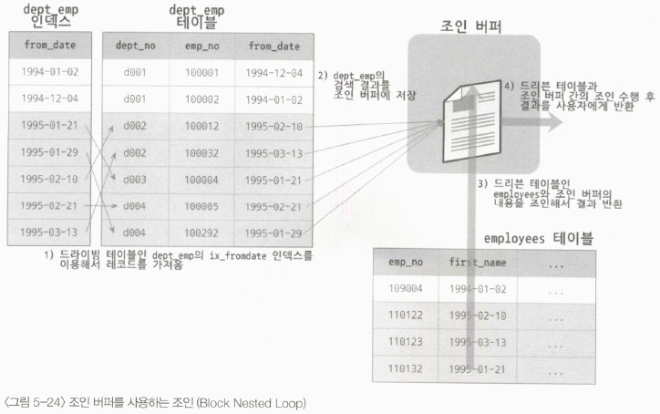

# 09. 옵티마이저

## 9.3 고급 최적화

MySQL 서버의 옵티마이저가 실행 계획 수립 시, 통계정보와 옵티마이저 옵션(조인 관련 옵티마이저 옵션, 옵티마이저 스위치)을 결합해서 최적의 실행 계획을 수립함

### 옵티마이저 스위치 옵션

- `optimizer_switch` 시스템 변수로 제어
    
    
    | 옵티마이저 스위치 이름 | 기본값 | 설명 |
    | --- | --- | --- |
    | batched_key_access | off | BKA 조인 알고리즘 사용 여부 설정 |
    | block_nested_loop | on | Block Nested Loop 조인 알고리즘 사용 여부 설정 |
    | engine_condition_pushdown | on | Engine Condition Pushdown 기능 사용 여부 설정 |
    | index_condition_pushdown | on | Index Condition Pushdown 기능 사용 여부 설정 |
    | use_index_extensions | on | Index Extension 최적화 사용 여부 설정 |
    | index_merge | on | Index Merge 최적화 사용 여부 설정 |
    | index_merge_intersection | on | Index Merge Intersection 최적화 사용 여부 설정 |
    | index_merge_sort_union | on | Index Merge Sort Union 최적화 사용 여부 설정 |
    | index_merge_union | on | Index Merge Union 최적화 사용 여부 설정 |
    | mrr | on | MRR 최적화 사용 여부 설정 |
    | mrr_cost_based | on | 비용 기반의 MRR 최적화 사용 여부 설정 |
    | semijoin | on | 세미 조인 최적화 사용 여부 설정 |
    | firstmatch | on | FirstMatch 세미 조인 최적화 사용 여부 설정 |
    | loosescan | on | LooseScan 세미 조인 최적화 사용 여부 설정 |
    | materialization | on | Materialization 최적화 사용 여부 설정 |
    | subquery_materialization_cost_based | on | 비용 기반 Materialization 최적화 사용 여부 설정 |
- 여러개의 옵션을 셋트로 묶어서 설정 가능
    
    ```sql
    -- mysql 서버 전체 or session 별, 특정 쿼리에만 설정 가능
    -- off, on, default(기본 설정값) 설정 가능
    mysql> set global optimizer_switch='index_merge=on,index_merge_union=on,...';
    mysql> set session optimizer_switch='index_merge=on,index_merge_union=on,...';
    mysql> select /*+ set_var(optimizer_switch='index_merge=on,...')*/ ... from ...
    ```
    

**MRR 과 배치 키 액세스(mrr & batched_key_access**

- MRR = Multi-Range Read = DS-MRR(Disk Sweep Multi-Range Read)
- MySQL 서버는 조인 대상 테이블 중 하나로부터 레코드를 읽어 조인 버퍼에 버퍼링 함
→ 드라이빙 테이블의 레코드 읽음, 드리븐 테이블과의 조인을 즉시 실행 X ⇒ 조인 대상을 버퍼링 함
→ 조인 버퍼에 레코드가 가득 차면 MySQL 엔진은 버퍼링 된 레코드를 스토리지 엔진으로 한 번에 요청
- MRR 을 응용해서 실행되는 조인 방식을 BKA(Batched Key Access) 조인이라고 함
→ 기본적으로 비활성화

**블록 네스티드 루프 조인(block_nested_loop)**

- MySQL 서버에서 사용되는 대부분의 조인 방식
→ 조인의 연결 조건이 되는 칼럼에 모두 인덱스가 있는 경우 사용되는 조인 방식
    
    ```sql
    -- 네스티드 루프 조인
    mysql> explain 
        -> select *
        -> from employees e
        ->  inner join salaries s on s.emp_no = e.emp_no
        ->     and s.from_date <= now()
        ->     and s.to_date >= now()
        -> where e.first_name = 'Amor';
    +----+-------------+-------+------------+------+----------------------+--------------+---------+--------------------+------+----------+-------------+
    | id | select_type | table | partitions | type | possible_keys        | key          | key_len | ref                | rows | filtered | Extra       |
    +----+-------------+-------+------------+------+----------------------+--------------+---------+--------------------+------+----------+-------------+
    |  1 | SIMPLE      | e     | NULL       | ref  | PRIMARY,ix_firstname | ix_firstname | 58      | const              |    1 |   100.00 | NULL        |
    |  1 | SIMPLE      | s     | NULL       | ref  | PRIMARY              | PRIMARY      | 4       | employees.e.emp_no |    9 |    11.11 | Using where |
    +----+-------------+-------+------------+------+----------------------+--------------+---------+--------------------+------+----------+-------------+
    2 rows in set, 1 warning (0.01 sec)
    ```
    
- 네스티드 루프 조인 vs 블록 네스티드 루프 조인
→ 조인버퍼가 사용되는지 여부 = join_buffer_size 시스템 설정으로 조정되는 조인을 위한 버퍼
→ 조인에서 드라이빙 테이블과 드리븐 테이블의 조인 순서
- 조인은 드라이빙 테이블에서 일치하는 레코드의 건수만큼 드리븐 테이블을 검색하며 처리
→ 옵티마이저는 최대한 드리븐 테이블의 검색이 인덱스 사용가능하도록 실행 계획을 수립
- 테이블의 풀 테이블 스캔, 인덱스 풀 스캔을 피할 수 없는 경우
→ 옵티마이저는 드라이빙 테이블에서 읽은 레코드를 메모리에 캐시 
→ 드리븐 테이블과 메모리 캐시를 조인하는 형태로 처리
→ 메모리 캐시 = 조인 버퍼(Join Buffer)
- 조인 버퍼를 이용한 해시 조인 알고리즘 사용 예제
    
    ```sql
    -- [Using join buffer] = 조인 버퍼 사용
    -- MySQL 8.0.20 부터 블록 네스티드 루프 조인 사용불가, 해시 조인 알고리즘 사용
    mysql> explain
        -> select *
        -> from dept_emp de, employees e
        -> where de.from_date > '1995-01-01' and e.emp_no < 109004;
    +----+-------------+-------+------------+-------+---------------+---------+---------+------+--------+----------+--------------------------------------------+
    | id | select_type | table | partitions | type  | possible_keys | key     | key_len | ref  | rows   | filtered | Extra                                      |
    +----+-------------+-------+------------+-------+---------------+---------+---------+------+--------+----------+--------------------------------------------+
    |  1 | SIMPLE      | e     | NULL       | range | PRIMARY       | PRIMARY | 4       | NULL | 150458 |   100.00 | Using where                                |
    |  1 | SIMPLE      | de    | NULL       | ALL   | ix_fromdate   | NULL    | NULL    | NULL | 331143 |    50.00 | Using where; Using join buffer (hash join) |
    +----+-------------+-------+------------+-------+---------------+---------+---------+------+--------+----------+--------------------------------------------+
    2 rows in set, 1 warning (0.02 sec)
    ```
    
    - dept_emp 테이블의 ix_fromdate 인덱스로 조건에 만족하는 레코드 찾기
    - 조인에 필요한 나머지 칼럼 모두 dept_emp 테이블에서 읽어 조인 버퍼에 저장
    - employees 테이블의 프라이머리 키를 이용해 emp_no < 109004 조건을 만족하는 레코드 찾기
    - employees 검색 결과에 캐시된 조인 버퍼의 레코드를 결합해서 반환
    → 조인 버퍼가 사용되는 쿼리에서 조인의 순서가 거꾸로인 것처럼 실행
    → employees 테이블 기준 dept_emp 결과를 병합함
    
    
    

**인덱스 컨디션 푸시다운(index_condition_pushdown)**

- MySQL 5.6 ~ 인덱스 컨디션 푸시다운 기능 도입
- index_condition_pushdown off, on 에 따른 실행계획 차이

```sql
-- index 생성
mysql> alter table employees 
			 add index ix_lastname_firstname (last_name, first_name);
Query OK, 0 rows affected (1.05 sec)
Records: 0  Duplicates: 0  Warnings: 0

-- pushdown option off
mysql> set optimizer_switch='index_condition_pushdown=off';
Query OK, 0 rows affected (0.00 sec)

mysql> show variables like 'optimizer_switch' \G
*************************** 1. row ***************************
Variable_name: optimizer_switch
        Value: ... index_condition_pushdown=off,...
1 row in set (0.06 sec)

-- [Extra] Using where : 반환 레코드가 인덱스 사용 불가인 Where 조건에 일치하는지 검사 과장
mysql> explain
    -> select *
    -> from employees
    -> where last_name ='Acton' and first_name like '%sal';
+----+-------------+-----------+------------+------+-----------------------+-----------------------+---------+-------+------+----------+-------------+
| id | select_type | table     | partitions | type | possible_keys         | key                   | key_len | ref   | rows | filtered | Extra       |
+----+-------------+-----------+------------+------+-----------------------+-----------------------+---------+-------+------+----------+-------------+
|  1 | SIMPLE      | employees | NULL       | ref  | ix_lastname_firstname | ix_lastname_firstname | 66      | const |  189 |    11.11 | Using where |
+----+-------------+-----------+------------+------+-----------------------+-----------------------+---------+-------+------+----------+-------------+

-- pushdown option on
mysql> set optimizer_switch='index_condition_pushdown=on';
Query OK, 0 rows affected (0.00 sec)

mysql> show variables like 'optimizer_switch' \G
*************************** 1. row ***************************
Variable_name: optimizer_switch
        Value: ...index_condition_pushdown=on,...
1 row in set (0.00 sec)

-- [Extra] : Using index condition
mysql> explain select * from employees where last_name ='Acton' and first_name like '%sal';
+----+-------------+-----------+------------+------+-----------------------+-----------------------+---------+-------+------+----------+-----------------------+
| id | select_type | table     | partitions | type | possible_keys         | key                   | key_len | ref   | rows | filtered | Extra                 |
+----+-------------+-----------+------------+------+-----------------------+-----------------------+---------+-------+------+----------+-----------------------+
|  1 | SIMPLE      | employees | NULL       | ref  | ix_lastname_firstname | ix_lastname_firstname | 66      | const |  189 |    11.11 | Using index condition |
+----+-------------+-----------+------------+------+-----------------------+-----------------------+---------+-------+------+----------+-----------------------+
1 row in set, 1 warning (0.00 sec)
```


**인덱스 확장(use_index_extensions)**

- use_index_extensions = InnoDB 스토리지 엔진을 사용하는 테이블에서 세컨더리 인덱스에 자동으로 추가된 프라이머리 키를 활용할 수 있게 할지를 결정하는 옵션
- dept_emp 테이블
    - pk = dept_no, emp_no
    - 세컨더리 인덱스 = ix_fromdate = from_date, **dept_no, emp_no**
    
    ```sql
    mysql> create table dept_emp (
            emp_no int not null,
    		    dept_no char(4) not null,
            from_date date not null,
            to_date date not null,
            primary key (dept_no, emp_no),
            key ix_fromdate (from_date)
          ) engine=InnoDB;
    
    -- [key_len] 19 = dept_emp pk 인덱스(16) + from_date(3)
    mysql> explain
        -> select count(*) 
        -> from dept_emp
        -> where from_date = '1987-07-25'
        -> and dept_no='d001';
    +----+-------------+----------+------------+------+---------------------------------------+-------------+---------+-------------+------+----------+-------------+
    | id | select_type | table    | partitions | type | possible_keys                         | key         | key_len | ref         | rows | filtered | Extra       |
    +----+-------------+----------+------------+------+---------------------------------------+-------------+---------+-------------+------+----------+-------------+
    |  1 | SIMPLE      | dept_emp | NULL       | ref  | PRIMARY,ix_fromdate,ix_empno_fromdate | ix_fromdate | 19      | const,const |    6 |   100.00 | Using index |
    +----+-------------+----------+------------+------+---------------------------------------+-------------+---------+-------------+------+----------+-------------+
    1 row in set, 1 warning (0.01 sec)
    
    -- pk 인덱스 칼럼 사용x, [key_len] 19 = from_date(3)
    mysql> explain 
        -> select count(*) 
        -> from dept_emp
        -> where from_date = '1987-07-25';
    +----+-------------+----------+------------+------+-------------------------------+-------------+---------+-------+------+----------+-------------+
    | id | select_type | table    | partitions | type | possible_keys                 | key         | key_len | ref   | rows | filtered | Extra       |
    +----+-------------+----------+------------+------+-------------------------------+-------------+---------+-------+------+----------+-------------+
    |  1 | SIMPLE      | dept_emp | NULL       | ref  | ix_fromdate,ix_empno_fromdate | ix_fromdate | 3       | const |   64 |   100.00 | Using index |
    +----+-------------+----------+------------+------+-------------------------------+-------------+---------+-------+------+----------+-------------+
    1 row in set, 1 warning (0.00 sec)
    ```
    

**인덱스 머지(index_merge)**

- 쿼리에 사용된 조건이 서로 다른 인덱스 사용 가능, 조건 만족하는 레코드 건수가 많다고 예상될 때 MySQL 서버는 인덱스 머지 실행 계획 선택
- 인덱스 머지 실행 계획 사용 시 하나의 테이블에 대해 2개 이상의 인덱스를 이용해 쿼리 처리
- 인덱스 머지 실행 계획은 `index_merge_intersection`, `index_merge_sort_union`, `index_merge_union` 세 가지로 구분

**인덱스 머지 - 교집합(index_merge_intersection)**

- 2개의 where 조건을 가질 때, 2개의 조건 모두 사용 가능할때 교집합을 이용해 최적화
- employees 테이블의 first_name(ix_firstname), emp_no(pk) 칼럼 모두 인덱스 사용 가능
→ 옵티마이저는 두 칼럼 모두 사용해서 쿼리 처리
→ `Using intersect = 쿼리가 여러개의 인덱스를 각각 검색 후 해당 결과의 교집합만 반환`
    
    ```sql
    -- [Extra] - Using intersect
    mysql> explain select * from employees 
        -> where first_name = 'Georgi' and emp_no between 10000 and 20000;
    +----+-------------+-----------+------------+-------------+----------------------+----------------------+---------+------+------+----------+----------------------------------------------------+
    | id | select_type | table     | partitions | type        | possible_keys        | key                  | key_len | ref  | rows | filtered | Extra                                              |
    +----+-------------+-----------+------------+-------------+----------------------+----------------------+---------+------+------+----------+----------------------------------------------------+
    |  1 | SIMPLE      | employees | NULL       | index_merge | PRIMARY,ix_firstname | ix_firstname,PRIMARY | 62,4    | NULL |    1 |   100.00 | Using intersect(ix_firstname,PRIMARY); Using where |
    +----+-------------+-----------+------------+-------------+----------------------+----------------------+---------+------+------+----------+----------------------------------------------------+
    1 row in set, 1 warning (0.01 sec)
    
    -- index_merge_intersection off
    mysql> set session optimizer_switch='index_merge_intersection=off';
    mysql> set global optimizer_switch='index_merge_intersection=off';
    mysql> explain
        ->  select /*+ set_var(optimizer_switch='index_merge_intersection=off') */ *
        ->    from employees
        ->   where first_name = 'Georgi' and emp_no between 10000 and 20000;
    +----+-------------+-----------+------------+-------+----------------------+--------------+---------+------+------+----------+-----------------------+
    | id | select_type | table     | partitions | type  | possible_keys        | key          | key_len | ref  | rows | filtered | Extra                 |
    +----+-------------+-----------+------------+-------+----------------------+--------------+---------+------+------+----------+-----------------------+
    |  1 | SIMPLE      | employees | NULL       | range | PRIMARY,ix_firstname | ix_firstname | 62      | NULL |   14 |   100.00 | Using index condition |
    +----+-------------+-----------+------------+-------+----------------------+--------------+---------+------+------+----------+-----------------------+
    1 row in set, 1 warning (0.00 sec)
    ```
    
- first_name, emp_no 두 칼럼 중 하나만 이용해도 쿼리 처리가 가능하지 않나?
→ 각 칼럼만 이용한 쿼리 실행 시 비효율
→ 두 칼럼 모두 적용한 결과의 교집합만 찾아서 반환
    
    ```sql
    -- first_name 만 이용한 쿼리 => 253 건 레코드 조회
    mysql> select count(*) from employees where first_name='Georgi';
    +----------+
    | count(*) |
    +----------+
    |      253 |
    +----------+
    1 row in set (0.00 sec)
    
    -- emp_no 만 이용한 쿼리 => 10,000 건 레코드 조회
    mysql> select count(*) from employees where emp_no between 10000 and 20000;
    +----------+
    | count(*) |
    +----------+
    |    10000 |
    +----------+
    1 row in set (0.00 sec)
    
    -- first_name, emp_no 두 칼럼 모두 이용한 쿼리 => 14건 레코드만 조회
    mysql> select count(*) from employees
        -> where first_name = 'Georgi' and emp_no between 10000 and 20000;
    +----------+
    | count(*) |
    +----------+
    |       14 |
    +----------+
    1 row in set (0.00 sec)
    ```
    

인덱스 머지 - 합집합(**index_merge_union)**

- 2개 이상의 조건이 각각 인덱스를 사용하되 `OR 연산자로 연결된 경우 합집합을 이용한 최적화 실행`
→ Using union = ix_firstname, ix_hiredate 인덱스 검색 결과를 Union 알고리즘으로 병합(합집합)
    
    ```sql
    -- [Extra] : Using union
    mysql> explain select * from employees where first_name = 'Matt' or hire_date = '1987-03-31';
    +----+-------------+-----------+------------+-------------+--------------------------+--------------------------+---------+------+------+----------+----------------------------------------------------+
    | id | select_type | table     | partitions | type        | possible_keys            | key                      | key_len | ref  | rows | filtered | Extra                                              |
    +----+-------------+-----------+------------+-------------+--------------------------+--------------------------+---------+------+------+----------+----------------------------------------------------+
    |  1 | SIMPLE      | employees | NULL       | index_merge | ix_hiredate,ix_firstname | ix_firstname,ix_hiredate | 58,3    | NULL |  344 |   100.00 | Using union(ix_firstname,ix_hiredate); Using where |
    +----+-------------+-----------+------------+-------------+--------------------------+--------------------------+---------+------+------+----------+----------------------------------------------------+
    1 row in set, 1 warning (0.00 sec)
    ```
    
- MySQL 서버는 두 쿼리 결과의 집합에서 pk 기준으로 데이터 비교 후 중복 제거 
= 우선순위 큐(Priority Queue)
    
    
    
    ```sql
    -- 검색 결과 pk(emp_no) 기준으로 정렬
    mysql> select * from employees where first_name = 'Matt' limit 5;
    +--------+------------+------------+-----------+--------+------------+
    | emp_no | birth_date | first_name | last_name | gender | hire_date  |
    +--------+------------+------------+-----------+--------+------------+
    |  10690 | 1962-09-06 | Matt       | Jumpertz  | F      | 1989-08-22 |
    |  12302 | 1962-02-14 | Matt       | Plessier  | M      | 1987-01-28 |
    |  13163 | 1963-12-11 | Matt       | Heping    | F      | 1987-03-31 |
    |  13507 | 1959-09-05 | Matt       | Wallrath  | M      | 1985-06-28 |
    |  15456 | 1957-09-27 | Matt       | Granlund  | M      | 1987-08-17 |
    +--------+------------+------------+-----------+--------+------------+
    5 rows in set (0.01 sec)
    
    mysql> select * from employees where hire_date = '1987-03-31' limit 5;
    +--------+------------+------------+-----------+--------+------------+
    | emp_no | birth_date | first_name | last_name | gender | hire_date  |
    +--------+------------+------------+-----------+--------+------------+
    |  10083 | 1959-07-23 | Vishv      | Zockler   | M      | 1987-03-31 |
    |  13163 | 1963-12-11 | Matt       | Heping    | F      | 1987-03-31 |
    |  13233 | 1954-08-11 | Alselm     | Chvatal   | M      | 1987-03-31 |
    |  14004 | 1959-04-10 | Arto       | Wendorf   | M      | 1987-03-31 |
    |  17003 | 1963-07-26 | JiYoung    | Vadhan    | F      | 1987-03-31 |
    +--------+------------+------------+-----------+--------+------------+
    5 rows in set (0.00 sec)
    ```
    

**인덱스 머지 - 정렬 후 합집합(index_merge_sort_union)**

- 인덱스 머지 작업 도중 결과의 정렬이 필요한 경우 인덱스 머지 최적화의 Sort union 알고리즘 사용
    
    ```sql
    -- [Extra] : Using sort_union
    mysql> explain 
        ->  select * from employees
        ->  where first_name = 'Matt'
        ->     or hire_date between '1987-03-01' and '1987-03-31';
    +----+-------------+-----------+------------+-------------+--------------------------+--------------------------+---------+------+------+----------+---------------------------------------------------------+
    | id | select_type | table     | partitions | type        | possible_keys            | key                      | key_len | ref  | rows | filtered | Extra                                                   |
    +----+-------------+-----------+------------+-------------+--------------------------+--------------------------+---------+------+------+----------+---------------------------------------------------------+
    |  1 | SIMPLE      | employees | NULL       | index_merge | ix_hiredate,ix_firstname | ix_firstname,ix_hiredate | 58,3    | NULL | 3197 |   100.00 | Using sort_union(ix_firstname,ix_hiredate); Using where |
    +----+-------------+-----------+------------+-------------+--------------------------+--------------------------+---------+------+------+----------+---------------------------------------------------------+
    1 row in set, 1 warning (0.00 sec)
    
    -- 검색 결과가 pk(emp_no) 기준으로 정렬 X -> 우선순위 사용 불가
    mysql> select * from employees where hire_date between '1987-03-01' and '1987-03-31' limit 5;
    +--------+------------+------------+--------------+--------+------------+
    | emp_no | birth_date | first_name | last_name    | gender | hire_date  |
    +--------+------------+------------+--------------+--------+------------+
    |  12469 | 1960-01-24 | Basant     | Khalil       | F      | 1987-03-01 |
    |  20074 | 1957-09-16 | Mads       | Staylopatis  | M      | 1987-03-01 |
    |  20284 | 1955-04-26 | Monique    | Parascandalo | F      | 1987-03-01 |
    |  21937 | 1962-07-31 | Niteen     | Zeidenstein  | F      | 1987-03-01 |
    |  34039 | 1963-12-10 | Rosita     | Weedon       | M      | 1987-03-01 |
    +--------+------------+------------+--------------+--------+------------+
    5 rows in set (0.00 sec)
    ```
    

**세미 조인(semijoin)**

- 다른 테이블과 실제 조인을 수행하지 않고, 다른 테이블에서 조건에 일치하는 레코드 여부만 체크하는 형태의 쿼리를 세미 조인(Semi-Join)
    
    ```sql
    -- ~ MySQL 5.7, semijoin=off
    -- employees 테이블 풀 스캔 후 한 건씩 서브쿼리의 조건에 일치하는지 비교
    mysql> explain
        ->  select * from employees e
        ->   where e.emp_no in
        ->         (select de.emp_no from dept_emp de where de.from_date = '1995-01-01');
    +----+-------------+-------+------------+------+-------------------------------+-------------+---------+-------+--------+----------+-------------+
    | id | select_type | table | partitions | type | possible_keys                 | key         | key_len | ref   | rows   | filtered | Extra       |
    +----+-------------+-------+------------+------+-------------------------------+-------------+---------+-------+--------+----------+-------------+
    |  1 | PRIMARY     | e     | NULL       | ALL  | NULL                          | NULL        | NULL    | NULL  | 300916 |   100.00 | Using where |
    |  2 | SUBQUERY    | de    | NULL       | ref  | ix_fromdate,ix_empno_fromdate | ix_fromdate | 3       | const |     57 |   100.00 | Using index |
    +----+-------------+-------+------------+------+-------------------------------+-------------+---------+-------+--------+----------+-------------+
    2 rows in set, 1 warning (0.01 sec)
    
    -- MySQL 8.0 ~, semijoin=on;
    mysql> explain 
        ->  select * from employees e
        ->   where e.emp_no in 
        ->           (select de.emp_no from dept_emp de where de.from_date = '1995-01-01');
    +----+--------------+-------------+------------+--------+-------------------------------+-------------+---------+--------------------+------+----------+-------------+
    | id | select_type  | table       | partitions | type   | possible_keys                 | key         | key_len | ref                | rows | filtered | Extra       |
    +----+--------------+-------------+------------+--------+-------------------------------+-------------+---------+--------------------+------+----------+-------------+
    |  1 | SIMPLE       | <subquery2> | NULL       | ALL    | NULL                          | NULL        | NULL    | NULL               | NULL |   100.00 | NULL        |
    |  1 | SIMPLE       | e           | NULL       | eq_ref | PRIMARY                       | PRIMARY     | 4       | <subquery2>.emp_no |    1 |   100.00 | NULL        |
    |  2 | MATERIALIZED | de          | NULL       | ref    | ix_fromdate,ix_empno_fromdate | ix_fromdate | 3       | const              |   57 |   100.00 | Using index |
    +----+--------------+-------------+------------+--------+-------------------------------+-------------+---------+--------------------+------+----------+-------------+
    3 rows in set, 1 warning (0.01 sec)
    ```
    
- 세미 조인 형태에 따른 서브쿼리 최적화 방식 차이
    
    
    | 구분 | 형태 | 최적화 방식 |
    | --- | --- | --- |
    | 세미 조인
    (Semi-Join) | = (subquery)
    IN (subquery) | - 세미 조인
       Table Pull-out, Duplicate Weed-out, 
        First Match, Loose scan, Materialization
    - IN-to-EXISTS
    - MATERIALIZATION |
    | 안티 세미 조인
    (Anti Semi-Join) | <> (subquery)
    NOT IN (subquery) | - IN-to-EXISTS
    - MATERIALIZATION |

**테이블 풀-아웃(Table Pull-out)**

- 세미 조인의 서브 쿼리에 사용된 테이블을 아우터 쿼리로 끄집어낸 후, 쿼리를 조인 쿼리로 재작성하는 형태의 최적화 방식
    
    
    | 제한 사항 | 특징 |
    | --- | --- |
    | 세미 조인 서브쿼리에서만 사용 가능 | 가능하다면 MySQL 에서는 Table Pull-out 최적화를 최대한 적용 |
    | 서브쿼리 결과가 1건인 경우만 사용 가능 | 서브쿼리의 모든 테이블이 아우터 쿼리로 끄집어 낼 수 있다면 서브쿼리 자체는 없어짐 |
    |  | '최대한 서브쿼리를 조인으로 풀어서 사용해라’ 는 튜닝 가이드 = Table Pull-out 최적화 실행 방식
    → 서브쿼리를 조인으로 풀어서 사용할 필요 x |
- 별도의 제어 옵티마이저 옵션 x
- 서브 쿼리 최적화 도입 이전 수동으로 쿼리를 튜닝하던 대표적인 방식
- Table Pull-out 최적화 사용 여부 판단
→ [Extra] 칼럼에 별도의 표시가 없고, [id] 칼럼의 값이 같은 경우
→ show warnings 명령어 이용해 subquery가 join 쿼리로 재 작성됨을 확인
    
    ```sql
    -- [Extra] 칼럼에 별도의 표시 없고, [id] 칼럼 값이 같은 경우 
    --      => Table Pull-out 최적화 사용했다고 판단
    mysql> explain
        ->  select * from employees e
        ->  where e.emp_no in (select de.emp_no from dept_emp de where de.dept_no = 'd009');
    +----+-------------+-------+------------+--------+---------------------------+---------+---------+---------------------+-------+----------+-------------+
    | id | select_type | table | partitions | type   | possible_keys             | key     | key_len | ref                 | rows  | filtered | Extra       |
    +----+-------------+-------+------------+--------+---------------------------+---------+---------+---------------------+-------+----------+-------------+
    |  1 | SIMPLE      | de    | NULL       | ref    | PRIMARY,ix_empno_fromdate | PRIMARY | 16      | const               | 46012 |   100.00 | Using index |
    |  1 | SIMPLE      | e     | NULL       | eq_ref | PRIMARY                   | PRIMARY | 4       | employees.de.emp_no |     1 |   100.00 | NULL        |
    +----+-------------+-------+------------+--------+---------------------------+---------+---------+---------------------+-------+----------+-------------+
    2 rows in set, 1 warning (0.00 sec)
    
    -- show warnings 명령어 이용해 
    -- Re-write 한 쿼리 확인하는 것이 Table Pull-out 최적화 사용 여부를 정확하게 할 수 있음
    -- subquery 형태가 join 쿼리로 재 작성됨
    mysql> show warnings \G
    *************************** 1. row ***************************
      Level: Note
       Code: 1003
    Message: /* select#1 */ select `employees`.`e`.`emp_no` AS `emp_no`,
    						`employees`.`e`.`birth_date` AS `birth_date`,
    						`employees`.`e`.`first_name` AS `first_name`,
    						`employees`.`e`.`last_name` AS `last_name`,
    						`employees`.`e`.`gender` AS `gender`,
    						`employees`.`e`.`hire_date` AS `hire_date` 
    				from `employees`.`dept_emp` `de` 
    						join `employees`.`employees` `e` 
    			 where ((`employees`.`e`.`emp_no` = `employees`.`de`.`emp_no`) 
    						and (`employees`.`de`.`dept_no` = 'd009'))
    1 row in set (0.00 sec)
    ```
    

**퍼스트 매치(firstmatch)**

- IN (subquery) 형태의 세미 조인을 EXISTS (subquery) 형태로 튜닝한 것과 비슷한 방식
    - 서브쿼리는 그 서브쿼리가 참조하는 모든 아우터 테이블이 먼저 조회된 후 실행
    - 실행 계획의 Extra 칼럼에 ‘FirstMatch(table-N)’ 문구 표시
    - 상관 서브쿼리(Correlated Subquery) 에서도 사용 가능
    - Group by나 집합 함수가 사용된 쿼리에서 최적화 사용 불가
    - optimizer_switch 시스템 변수에서 `semijoin`, `firstmatch` 두 옵션 모두 활성화 된 경우만 사용 가능
- FirstMatch 는 서브쿼리가 아닌 조인으로 풀어서 실행하면서 일치하는 첫번째 레코드만 검색하는 최적화
서브 쿼리에서 하나의 레코드만 검색되면 더 이상의 검색을 멈추는 단축 실행 경로
    
    ```sql
    -- [Extra] : FirstMatch(e)
    -- [id] : 값이 1로 동일 = join 으로 처리 (subquery x)
    mysql> explain select *
        ->  from employees e where e.first_name = 'Matt'
        ->   and e.emp_no in (
        ->     select t.emp_no from titles t
        ->      where t.from_date between '1995-01-01' and '1995-01-30');
    +----+-------------+-------+------------+------+----------------------+--------------+---------+--------------------+------+----------+-----------------------------------------+
    | id | select_type | table | partitions | type | possible_keys        | key          | key_len | ref                | rows | filtered | Extra                                   |
    +----+-------------+-------+------------+------+----------------------+--------------+---------+--------------------+------+----------+-----------------------------------------+
    |  1 | SIMPLE      | e     | NULL       | ref  | PRIMARY,ix_firstname | ix_firstname | 58      | const              |  233 |   100.00 | NULL                                    |
    |  1 | SIMPLE      | t     | NULL       | ref  | PRIMARY              | PRIMARY      | 4       | employees.e.emp_no |    1 |    11.11 | Using where; Using index; FirstMatch(e) |
    +----+-------------+-------+------------+------+----------------------+--------------+---------+--------------------+------+----------+-----------------------------------------+
    2 rows in set, 1 warning (0.00 sec)
    ```
    
- FirstMatch 최적화 작동 방식
    - employees > first_name = ‘Matt’ 정보를 ix_firstname 인덱스 이용하여 레인지 스캔으로 조회
    - 상단 조회 결과 (first_name = ‘Matt’ and emp_no = 12302) 레코드를 titles 테이블과 조인해서 t.from_date between '1995-01-01' and '1995-01-30' 조건 만족하는 레코드 확인
    - 상단 조회 결과에서 일치하는 레코드 없음
    - emp_no = 243075 레코드는 titles > from_date 조건 만족 → 해당 레코드 즉시 최종 결과로 반환
    
    
    

**루스 스캔(Loose Scan)**

- 인덱스를 사용하는 GROUP BY 최적화 방법에서 살펴본 ‘Using index for group-by’의 루스 인덱스 스캔(Loose Index Scan) 과 비슷한 읽기 방식을 사용
- `loosescan` 옵티마이저 옵션으로 사용여부 결정
    
    ```sql
    mysql> set optimizer_switch='loosescan=off';
    ```
    
- dept_emp : pk dept_no + emp_no, 전체 레코드 33만건
departments : pk dept_no, group by 레코드 9건
→ 조인 쿼리 실행 시, dept_emp 테이블의 pk를 
    루스 인덱스 스캔으로 유니크한 dept_no 만 읽어 효율적으로 서브 쿼리 실행

```sql
-- [id] : 1로 동일 = 내부적으로 조인처럼 사용 됨
-- [Extra] : Using index; Loose 
mysql> explain
    ->  select * from departments d 
    ->   where d.dept_no in (select de.dept_no from dept_emp de);
+----+-------------+-------+------------+-------+---------------+---------+---------+------+--------+----------+--------------------------------------------+
| id | select_type | table | partitions | type  | possible_keys | key     | key_len | ref  | rows   | filtered | Extra                                      |
+----+-------------+-------+------------+-------+---------------+---------+---------+------+--------+----------+--------------------------------------------+
|  1 | SIMPLE      | de    | NULL       | index | PRIMARY       | PRIMARY | 20      | NULL | 331143 |     0.00 | Using index; LooseScan                     |
|  1 | SIMPLE      | d     | NULL       | ALL   | PRIMARY       | NULL    | NULL    | NULL |      9 |    11.11 | Using where; Using join buffer (hash join) |
+----+-------------+-------+------------+-------+---------------+---------+---------+------+--------+----------+--------------------------------------------+
2 rows in set, 1 warning (0.00 sec)
```


**구체화(Materialization)**

- Materialization 최적화는 세미 조인에 사용된 서브쿼리를 통째로 구체화해서 쿼리를 최적화 함
→ 구체화는 내부 임시 테이블을 생성하는 것을 의미
- Materialization 제한사항 및 특성
    - 서브쿼리는 상관 서브쿼리가 아니어야 함
    - GROUP BY 나 집합 함수들이 사용돼도 구체화 사용 가능
    - 구체화 사용된 경우 내부 임새 테이블 사용
- Materialization 시스템 변수는 `optimizer_switch=’semijoin=on,materialization=on’`
- Materialization 최적화 실행 계획

```sql
-- 사용한 테이블은 2개, 실행계획은 3개 -> 임시 테이블 생성
mysql> explain
    ->  select * from employees e
    ->   where e.emp_no in 
    ->       ( select de.emp_no from dept_emp de
    ->          where de.from_date='1995-01-01');
+----+--------------+-------------+------------+--------+-------------------------------+-------------+---------+--------------------+------+----------+-------------+
| id | select_type  | table       | partitions | type   | possible_keys                 | key         | key_len | ref                | rows | filtered | Extra       |
+----+--------------+-------------+------------+--------+-------------------------------+-------------+---------+--------------------+------+----------+-------------+
|  1 | SIMPLE       | <subquery2> | NULL       | ALL    | NULL                          | NULL        | NULL    | NULL               | NULL |   100.00 | NULL        |
|  1 | SIMPLE       | e           | NULL       | eq_ref | PRIMARY                       | PRIMARY     | 4       | <subquery2>.emp_no |    1 |   100.00 | NULL        |
|  2 | MATERIALIZED | de          | NULL       | ref    | ix_fromdate,ix_empno_fromdate | ix_fromdate | 3       | const              |   57 |   100.00 | Using index |
+----+--------------+-------------+------------+--------+-------------------------------+-------------+---------+--------------------+------+----------+-------------+
3 rows in set, 1 warning (0.00 sec)
```

**중복 제거(Duplicated Weed-out)**

- Duplicate Weedout 은 세미 조인 서브쿼리르 일반적인 INNER JOIN 쿼리로 변경 후 실행하여 마지막에 중복된 레코드를 제거하는 방법으로 처리되는 최적화 알고리즘
- Duplicated Weed-out 최적화 장점 및 제약사항
    - 서브쿼리가 상관 서브쿼리라도 최적화 가능
    - 서브쿼리가 GROUP BY 나 집합 함수가 사용된 경우 최적화 불가
    - 서브쿼리의 테이블을 조인으로 처리하기 때문에 최적화 방법이 많음
- 중복 제거 최적화 알고리즘 처리 과정
    
    
    
    - salaries > ix_salary 인덱스 스캔
    salary > 150000 보다 큰 사원 검색
    employees 테이블과 조인
    - 조인결과를 임시 테이블에 저장
    - 임시 테이블 저장 결과에서 emp_no 기준으로 중복 제거
    - 중복 제거 후 남은 레코드 반환

```sql
-- salaries : pk (emp_no, from_date)
-- [Extra] : Start temporary, End temporary 문구의 구간이 Duplicated Weedout 최적화 처리 과정
mysql> explain
    ->  select * from employees e
    ->   where e.emp_no in (select s.emp_no from salaries s where s.salary > 150000);
+----+-------------+-------+------------+--------+-------------------+-----------+---------+--------------------+------+----------+-------------------------------------------+
| id | select_type | table | partitions | type   | possible_keys     | key       | key_len | ref                | rows | filtered | Extra                                     |
+----+-------------+-------+------------+--------+-------------------+-----------+---------+--------------------+------+----------+-------------------------------------------+
|  1 | SIMPLE      | s     | NULL       | range  | PRIMARY,ix_salary | ix_salary | 4       | NULL               |   36 |   100.00 | Using where; Using index; Start temporary |
|  1 | SIMPLE      | e     | NULL       | eq_ref | PRIMARY           | PRIMARY   | 4       | employees.s.emp_no |    1 |   100.00 | End temporary                             |
+----+-------------+-------+------------+--------+-------------------+-----------+---------+--------------------+------+----------+-------------------------------------------+
2 rows in set, 1 warning (0.00 sec)

-- inner join + group by 절로 변경해 Duplicate Weedout 최적화 알고리즘
mysql> select e.* from employees e, salaries s
    ->  where e.emp_no = s.emp_no and s.salary > 150000
    ->  group by e.emp_no;
```

**컨디션 팬아웃(condition_fanout_filter)**

- `condition_fanout_filter` 시스템 변수를 이용해 최적화 기능을 활성화하면 MySQL 옵티마이저는 더 정교한 계산을 거쳐 실행 계획을 수립. 
→ `where 조건절에 사용된 칼럼에 대해 인덱스 또는 히스토그램이 존재하는 경우` 해당 칼럼의 조건들에 대해 조건을 만족하는 레코드 비율 계산 가능
- 컨디션 팬아웃 최적화 활성 vs 비활성

```sql

-- 컨디션 팬아웃 최적화 [비활성]
--  1. employees > ix_firstname 사용. first_name = 'Matt' 233건
--  2. 검색된 233건 레코드 중 hire_date 조건에 만족하는 레코드 걸러냄
--       **[filtered] : 100.0** = 옵티마이저가 233건 모두 hire_date 조건에 만족한다고 예상
--  3. employees 결과 233건에 대해 salaries > pk 이용해 데이터 읽음

mysql> set optimizer_switch='condition_fanout_filter=off';
mysql> explain
    ->  select * from employees e
    ->   inner join salaries s on s.emp_no = e.emp_no
    ->   where e.first_name = 'Matt'
    ->     and e.hire_date between '1985-11-21' and '1986-11-21';
+----+-------------+-------+------------+------+----------------------------------+--------------+---------+--------------------+------+----------+-------------+
| id | select_type | table | partitions | type | possible_keys                    | key          | key_len | ref                | rows | filtered | Extra       |
+----+-------------+-------+------------+------+----------------------------------+--------------+---------+--------------------+------+----------+-------------+
|  1 | SIMPLE      | e     | NULL       | ref  | PRIMARY,ix_hiredate,ix_firstname | ix_firstname | 58      | const              |  233 |   100.00 | Using where |
|  1 | SIMPLE      | s     | NULL       | ref  | PRIMARY                          | PRIMARY      | 4       | employees.e.emp_no |    9 |   100.00 | NULL        |
+----+-------------+-------+------------+------+----------------------------------+--------------+---------+--------------------+------+----------+-------------+

**-- 컨디션 팬아웃 최적화 [활성]**
-- [filtered] : 23.60
-- MySQL 옵티마이저는 인덱스 사용 가능한 first_name 칼럼 이외의 나머지 조건(hire_date) 충족 여부 고려

mysql> set optimizer_switch='condition_fanout_filter=on';
mysql> explain
    ->  select * from employees e
    ->   inner join salaries s on s.emp_no = e.emp_no
    ->   where e.first_name = 'Matt'
    ->     and e.hire_date between '1985-11-21' and '1986-11-21';
+----+-------------+-------+------------+------+----------------------------------+--------------+---------+--------------------+------+----------+-------------+
| id | select_type | table | partitions | type | possible_keys                    | key          | key_len | ref                | rows | filtered | Extra       |
+----+-------------+-------+------------+------+----------------------------------+--------------+---------+--------------------+------+----------+-------------+
|  1 | SIMPLE      | e     | NULL       | ref  | PRIMARY,ix_hiredate,ix_firstname | ix_firstname | 58      | const              |  233 |    26.02 | Using where |
|  1 | SIMPLE      | s     | NULL       | ref  | PRIMARY                          | PRIMARY      | 4       | employees.e.emp_no |    9 |   100.00 | NULL        |
+----+-------------+-------+------------+------+----------------------------------+--------------+---------+--------------------+------+----------+-------------+
```

**파생 테이블 머지(derived_merge)**

- MySQL 5.7 ~ 파생 테이블(Derived Table, FROM 절에 사용된 서브쿼리)로 만들어진 서브쿼리를 외부 쿼리와 병합해서 서브쿼리 부분을 제거하는 최적화 도입
    - `derived_merge` 최적화 옵션은 임시 테이블 최적화 활성화 여부 결정
    
    ```sql
    -- [selected_type] : simple
    mysql> explain
        ->  select * from (
        ->    select * from employees where first_name = 'Matt'
        ->  ) derived_table
        ->  where derived_table.hire_date = '1986-04-03';
    +----+-------------+-----------+------------+-------------+--------------------------+--------------------------+---------+------+------+----------+--------------------------------------------------------+
    | id | select_type | table     | partitions | type        | possible_keys            | key                      | key_len | ref  | rows | filtered | Extra                                                  |
    +----+-------------+-----------+------------+-------------+--------------------------+--------------------------+---------+------+------+----------+--------------------------------------------------------+
    |  1 | SIMPLE      | employees | NULL       | index_merge | ix_hiredate,ix_firstname | ix_hiredate,ix_firstname | 3,58    | NULL |    1 |   100.00 | Using intersect(ix_hiredate,ix_firstname); Using where |
    +----+-------------+-----------+------------+-------------+--------------------------+--------------------------+---------+------+------+----------+--------------------------------------------------------+
    
    -- 옵티마이저가 서브쿼리가 외부 쿼리로 병합하여 처리함을 확인
    mysql> show warnings \G
    *************************** 1. row ***************************
      Level: Note
       Code: 1003
    Message: /* select#1 */ 
    		select `employees`.`employees`.`emp_no` AS `emp_no`,
    					`employees`.`employees`.`birth_date` AS `birth_date`,
    					`employees`.`employees`.`first_name` AS `first_name`,
    					`employees`.`employees`.`last_name` AS `last_name`,
    					`employees`.`employees`.`gender` AS `gender`,`employees`.
    					`employees`.`hire_date` AS `hire_date` 
    			from `employees`.`employees` 
    		 where ((`employees`.`employees`.`hire_date` = DATE'1986-04-03') 
    		   and (`employees`.`employees`.`first_name` = 'Matt'))
    ```
    
- 옵티마이저가 자동으로 서브쿼리→외부쿼리 병합 불가한 경우
이 경우에는 수동으로 병합하는 것이 쿼리 성능 향상에 도움이 됨
    - SUM(), MIN(), MAX() 같은 집계함수, 윈도우 함수가 사용된 서브쿼리
    - DISTINCT, GROUP BY 나 HAVING, LIMIT 사용된 서브쿼리
    - UNION, UNION ALL 포함하는 서브쿼리
    - SELECT 절에 사용된 서브쿼리
    - 값이 변경되는 사용자 변수가 사용된 서브쿼리

**인비저블 인덱스(use_invisible_indexes)**

- MySQL 8.0 ~ 인덱스 가용 상태 제어 기능이 추가 됨
인덱스를 삭제하지 않고, 해당 인덱스 사용 불가 상태를 제어 기능을 제공
    - `alter table ... alter index ... [visible|invisible]` 인덱스 가용 상태 설정
    - `use_invisible_indexes` 옵티마이저 옵션 사용 시 
    invisible 설정 인덱스라도 옵티마이저가 사용하게 제어 가능
    - 기본 `use_invisible_indexes=off`
    
    ```sql
    -- ix_hire_date 인덱스 사용
    mysql> explain select hire_date from employees group by hire_date;
    +----+-------------+-----------+------------+-------+---------------+-------------+---------+------+------+----------+--------------------------+
    | id | select_type | table     | partitions | type  | possible_keys | key         | key_len | ref  | rows | filtered | Extra                    |
    +----+-------------+-----------+------------+-------+---------------+-------------+---------+------+------+----------+--------------------------+
    |  1 | SIMPLE      | employees | NULL       | range | ix_hiredate   | ix_hiredate | 3       | NULL | 7073 |   100.00 | Using index for group-by |
    +----+-------------+-----------+------------+-------+---------------+-------------+---------+------+------+----------+--------------------------+
    
    -- 옵티마이저가 ix_hiredate 사용하지 못하도록 변경
    mysql> alter table employees alter index ix_hiredate invisible;
    Query OK, 0 rows affected (0.03 sec)
    Records: 0  Duplicates: 0  Warnings: 0
    
    -- ix_hiredate 인덱스 사용 불가
    mysql> explain select hire_date from employees group by hire_date;
    +----+-------------+-----------+------------+------+---------------+------+---------+------+--------+----------+-----------------+
    | id | select_type | table     | partitions | type | possible_keys | key  | key_len | ref  | rows   | filtered | Extra           |
    +----+-------------+-----------+------------+------+---------------+------+---------+------+--------+----------+-----------------+
    |  1 | SIMPLE      | employees | NULL       | ALL  | NULL          | NULL | NULL    | NULL | 300916 |   100.00 | Using temporary |
    +----+-------------+-----------+------------+------+---------------+------+---------+------+--------+----------+-----------------+
    
    -- use_invisible_indexes=on 설정으로 옵티마이저가 invisible 상태 볼수 없음
    --  즉, 옵티마이저가 ix_hiredate 인덱스 사용 가능
    mysql> set optimizer_switch='use_invisible_indexes=on';
    mysql> explain select hire_date from employees group by hire_date;
    +----+-------------+-----------+------------+-------+---------------+-------------+---------+------+------+----------+--------------------------+
    | id | select_type | table     | partitions | type  | possible_keys | key         | key_len | ref  | rows | filtered | Extra                    |
    +----+-------------+-----------+------------+-------+---------------+-------------+---------+------+------+----------+--------------------------+
    |  1 | SIMPLE      | employees | NULL       | range | ix_hiredate   | ix_hiredate | 3       | NULL | 7073 |   100.00 | Using index for group-by |
    +----+-------------+-----------+------------+-------+---------------+-------------+---------+------+------+----------+--------------------------+
    ```
    

**스킵 스캔(skip_scan)**

- 인덱스 구성 칼럼 순서와 동일한 조건에 대한 칼럼만 인덱스 사용이 가능했던 제약사항을 제한적으로 해결하는 최적화 기법
    - 제약사항 예시) (A, B, C) 순서의 칼럼 인덱스 생성
        ⇒ where A, B ⇒ A, B 칼럼 인덱스 사용 가능
        ⇒ where A ⇒ A 칼럼 인덱스 사용 가능
        ⇒ where B, C ⇒ 인덱스 사용 불가
- MySQL 8.0 ~ 인덱스 스킵 스캔 최적화 도입. 인덱스의 선행 칼럼이 조건절에 사용되지 않더라도 후행 칼럼의 조건만으로도 인덱스를 이용한 쿼리 성능 개선이 가능
- MySQL 8.0 옵티마이저는 인덱스의 선행 칼럼이 소수의 유니크한 값을 가질 때만 인덱스 스킵 스캔 최적화 사용

```sql
mysql> alter table employees add index ix_gender_birthdate (gender, birth_date);
mysql> explain select count(*) from employees where birth_date >= '1965-02-01';
+----+-------------+-----------+------------+-------+---------------------+---------------------+---------+------+--------+----------+----------------------------------------+
| id | select_type | table     | partitions | type  | possible_keys       | key                 | key_len | ref  | rows   | filtered | Extra                                  |
+----+-------------+-----------+------------+-------+---------------------+---------------------+---------+------+--------+----------+----------------------------------------+
|  1 | SIMPLE      | employees | NULL       | range | ix_gender_birthdate | ix_gender_birthdate | 4       | NULL | 100295 |   100.00 | Using where; Using index for skip scan |
+----+-------------+-----------+------------+-------+---------------------+---------------------+---------+------+--------+----------+----------------------------------------+
1 row in set, 1 warning (0.00 sec)
```

**해시 조인(hash_join)**

- MySQL 8.0.18 ~  해시 조인이 추가로 지원
- 해시 조인 vs 네스티드 루프 조인
    - 해시 조인 : 첫 번째 레코드 찾는 데 시간이 오래 걸림. 최종 레코드를 찾는 경우 빠른 처리 가능걸림
    → 최고 스루풋(Best Throughput) 전략에 적합
    - 네스티드 루프 조인 : 첫 번째 레코드 찾는 경우 빠른 처리. 최종 레코드를 찾는데 시간이 많이 걸림
    → 최고 응답 속도(Best Response-time) 전략에 적합


- ~ MySQL 8.0.17 까지 해시 조인 기능 X 
→ 블록 네스티드 루프 조인(Block Nested Loop Join) 알고리즘 사용
→ 쿼리 조인 조건이 인덱스를 사용할 수 없는 경우만 사용되는 최적화 방법 수준
→ MySQL 8.0.20 ~ 블록 네스티드 루프 조인 사용 불가 → 이 경우에는 `해시 조인이 사용`됨
- 해시 조인의 최적화 방식
    - 빌드 단계(Build-phrase) : 해시 테이블로 만들기에 용이한 테이블을 골라 메모리에 해시테이블을 생성하는 작업을 수행
    - 프로브 단계(Probe-phase) : 나머지 테이블의 레코드를 읽어 해시 테이블의 일치 레코드를 찾는 과정

```sql
-- 조인에 인덱스 사용할 수 없는 경우
-- [Extra] : hash join 사용
mysql> explain
    ->  select *
    ->    from employees e ignore index(primary, ix_hiredate)
    ->     inner join dept_emp de ignore index(ix_empno_fromdate, ix_fromdate)
    ->       on de.emp_no = e.emp_no and de.from_date = e.hire_date;
+----+-------------+-------+------------+------+---------------+------+---------+------+--------+----------+--------------------------------------------+
| id | select_type | table | partitions | type | possible_keys | key  | key_len | ref  | rows   | filtered | Extra                                      |
+----+-------------+-------+------------+------+---------------+------+---------+------+--------+----------+--------------------------------------------+
|  1 | SIMPLE      | de    | NULL       | ALL  | NULL          | NULL | NULL    | NULL | 331143 |   100.00 | NULL                                       |
|  1 | SIMPLE      | e     | NULL       | ALL  | NULL          | NULL | NULL    | NULL | 300916 |     0.00 | Using where; Using join buffer (hash join) |
+----+-------------+-------+------------+------+---------------+------+---------+------+--------+----------+--------------------------------------------+

-- explain=tree 사용
-- [Table scan on de] : dept_emp 테이블이 빌드 테이블로 사용
mysql> explain format=tree
    ->  select *
    ->    from employees e ignore index(primary, ix_hiredate)
    ->     inner join dept_emp de ignore index(ix_empno_fromdate, ix_fromdate)
    ->       on de.emp_no = e.emp_no and de.from_date = e.hire_date;
+---------------------------------------------------------------------------------------------------------------------------------------------------------------------------------------------------------------------------------+
| EXPLAIN                                                                                                                                                                                                                         |
+---------------------------------------------------------------------------------------------------------------------------------------------------------------------------------------------------------------------------------+
 -> Inner hash join (e.hire_date = de.from_date), (e.emp_no = de.emp_no)  (cost=9964664382.27 rows=331143)
    -> Table scan on e  (cost=0.02 rows=300916)
    -> Hash
        -> Table scan on de  (cost=33823.32 rows=331143)
+---------------------------------------------------------------------------------------------------------------------------------------------------------------------------------------------------------------------------------+
```

- 해시 조인 - 메모리에서 모두 처리 가능한 경우
    - 빌드 테이블인 dept_emp 테이블의 레코드 읽어서 메모리에 해시 테이블 생성
    - 프로브 테이블인 employees 테이블을 스캔하면서 메모리에 생성된 해시 테이블의 레코드를 찾아 결과를 사용자에게 반환
    
    
    
- 해시 조인 - 해시 테이블이 조인 버퍼 메모리보다 큰 경우
    - 해시 테이블의 레코드 건수가 많이 조인 버퍼(join_buffer_size, 기본 256KB) 의 공간 부족 시 사용
    - dept_emp > emp_no 값으로 해시 테이블 생성
    - 메모리, 사용량 초과 시 나머지 dept_emp 테이블 레코드를 디스크 청크로 기록
    - employees 테이블의 emp_no 값으로 해시 테이블 검색 및 조인 → 1차 조인 결과 생성
    동시에 디스크 청크로 구분해서 저장
        
        
        
    - 빌드 테이블 청크 > 1번 청크를 읽어서 다시 메모리 해시 테이블 구축
    프로브 테이블 청크 > 1번 청크 읽으면서 새로 구축된 메모리 해시 테이블과 조인 수행
    → 2차 조인 결과 생성
    → 디스크에 저장된 청크 개수만큼 해당 과정을 반복 처리 
    → 완성된 조인 결과 생성
        
        
        
- MySQL 옵티마이저는 빌드 테이블의 크기에 따라 알고리즘 구분 됨
    - 메모리에서 모두 처리 가능 한 경우, 클래식 해시 조인(Classic Hash Join) 알고리즘 사용
    - 해시 테이블이 조인 버퍼 메모리보다 큰 경우, 해시 조인(Grace Hash Join) 알고리즘 사용
    - MySQL 서버의 해시키 생성 시 xxHash64 해시 함수 사용

**인덱스 정렬 선호(prefer_ordering_index)**

- MySQL 옵티마어지는 order by, group by 인덱스를 사용해 처리 가능한 경우 인덱스의 가중치를 높이 설정하여 실행 됨
→ 체크해야 하는 레코드 건수가 많음에도 불구하고 정렬된 인덱스 활용하는 실행계획 수립
→ 옵티마이저가 잘못된 실행계획을 수립한 것
- ~ MySQL 8.0.20 `ignore index` 힌트를 사용해 특정 인덱스 사용하지 못하도록 설정
- MySQL 8.0.21 ~ `prefer_ordering_index` 옵티마이저 옵션으로 order by 인덱스가 가중치 부여하지 않도록 설정 가능. 기본 ON

### 9.3.2 조인 최적화 알고리즘

MySQL 에서 조인 쿼리의 실행 계획 최적화를 위한 2개의 알고리즘이 존재
4개의 테이블을 조인하는 쿼리 문장이 조인 옵티마이저 알고리즘에 따라 처리되는 방식을 비교

```sql
mysql> select * from t1, t2, t3, t4 where ...;
```

**Exhaustive 검색 알고리즘**


- Exhaustive 검색 알고리즘은 MySQl 5.0 ~ 에서 사용되던 조인 최적화 기법
- FROM 절에 명시된 모든 테이브르이 조합에 대해 실행 계획의 비용 계산 후 최적의 조합 1개를 찾는 방식
- 4개의 테이블 처리 가능 조인 조합은 4!
20개 테이블 처리 가능 조인 조합은 20!
→ 테이블 개수가 늘어날수록 실행계획 수립 시간이 늘어남

**Greedy 검색 알고리즘**

- Exhaustive 검색 알고리즘의 문제점 해결을 위해 MySQL 5.0 ~ 도입된 조인 최적화 기법
- t1 ~ t4 테이블이 Greedy 검색 알고리즘으로 처리되는 과정
optimizer_search_depth = 2(기본값 62) 로 가정
    
     1) 전체 테이블 중 `optimizer_search_depth 시스템 설정 변수에 정의된 개수로 조인 가능한 조합 생성`
    
     2) 생성된 조인 조합 중 `최소 비용의 실행 계획 1개 선정`
    
     3) 선정된 실행 계획의 첫 번째 테이블을 `부분 실행 계획의 1번째 테이블로 선정`
    
     4) 부분 실행 계획의 1번째 테이블을 제외한 N-1개 테이블 중 
          optimizer_search_depth 시스템 설정 변수에 정의된 개수로 조인 가능한 조합 생성
    
     5) `생성된 조인 조합들을 부분 실행 계획에 대입해 실행 비용 계산`
    
     6) 실행 비용 계산 후 `최적의 실행 계획에서 2번째 테이블을 부분 실행 계획의 2번째 테이블로 선정`
    
     7) 남은 테이블이 없어질 때까지 4~6번 과정 반복 실행하면서 `부분 실행 계획에 테이블의 조인 순서를 기록`
    
     8) 최종적으로 `부분 실행 계획이 테이브르이 조인 순서로 결정`
    
    
    
- MySQL 은 조인 최적화를 위한 `optimizer_prune_level`, `optimizer_search_depth` 시스템 변수 제공
    - optimizer_search_depth
        - Greedy vs Exhaustive 검색 알고리즘 중 어떤 알고리즘 사용할지 결정하는 시스템 변수
        - 0 ~ 62 정숫값 입력 가능
            - 1 ~ 62 : Greedy 검색 대상을 지정된 개수로 한정해서 최적의 실행 계획 산출
            - 0 : Greedy 검색을 위한 최적의 조인 검색 테이블읠 개수를 MySQL 옵티마이저가 자동 결정
        - 조인에 사용된 테이블의 개수 > optimizer_search_depth 설정 값
        → optimizer_search_depth 만큼 테이블은 Exhaustive 검색 사용
        → 나머지 테이블은 Greedy 검색 사용
        - 조인에 사용된 테이블 개수 < optimizer_search_depth → Exhaustive 검색만 사용
        - optimizer_prune_level = 0 설정된 경우, optimizer_search_depth = 4~5 설정 추천
        - MySQL8.0 버전의 조인 최적화는 개선되어 시스템 변수값에 크게 영향받지 않음
    - optimizer_prune_level
        - MySQL 5.0 부터 추가된 Heuristic 검색이 작동하는 방식을 제어.
        Heuristic 검색의 중점 내용은 다양한 조인 순서의 비용 계산 도중 이미 계산했던 조인 순서의 비용보다 큰 경우엔 언제든지 중간에 포기 가능하다는 것임
        - optimizer_prune_level
            - 1 : 옵티마이저는 조인 순서 최적화에 경험 기반의 Heuristic 알고리즘 사용. 기본 값
            - 0 : 경험 기반의 Heuristic 알고리즘 사용 X → 사용 추천 X
        - MySQL8.0 버전의 조인 최적화와 관련된 Heuristic은 이전 버전의 문제점이 개선되었기 때문에 비활성화 필요성이 거의 없어짐 → 기본값인 1 사용을 추천