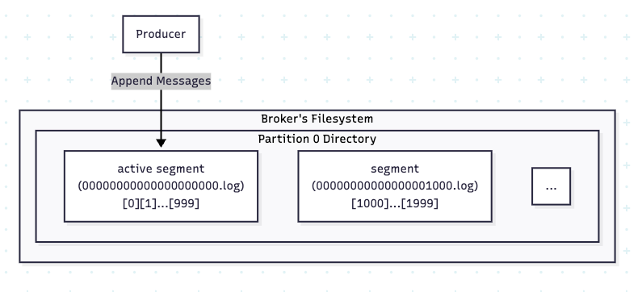
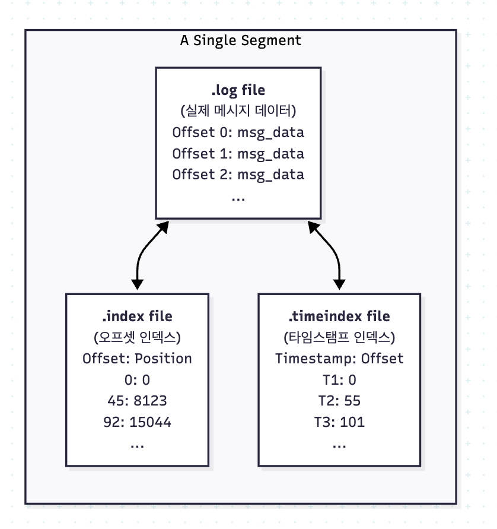
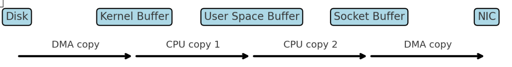
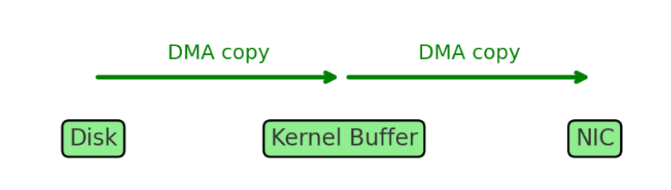

# Kafka 저장 구조와 성능 최적화 메커니즘

## 세그먼트 (Segment)

### 기본 개념
카프카의 파티션은 **삭제 불가능·추가만 가능한(Append-only)** 로그 파일 구조를 가진다.

- DB 테이블처럼 기존 데이터를 수정하거나 삭제하는 구조가 아니다.
- 오직 데이터가 순서대로 **파일 끝에만 추가(Append)** 된다.

> 이 단순한 구조가 카프카 성능의 첫 번째 비결이다.



디스크에 데이터를 순차적으로 쓰는 작업은,   
디스크 헤드를 여기저기 옮겨가며 쓰는 **랜덤 I/O**보다 **수십 ~ 수백 배 빠른 성능**을 보장한다.

따라서 Kafka는 메시지를 **순차적으로 기록**하는 구조를 택했다.

---

### 파티션과 세그먼트의 관계
그렇다면 이 단순한 로그 파일은 실제 저장소에서 어떻게 관리될까?  
Kafka는 파티션을 물리적으로 **세그먼트(Segment) 파일들의 집합**으로 관리한다.

브로커의 디스크에는 파티션 이름의 디렉토리가 있고, 그 안에는 다음과 같은 세그먼트 파일들이 존재한다.

*[ 구조 예시 ]*
```
/var/lib/kafka/data/my-topic-0/
 ├── 00000000000000000000.log
 ├── 00000000000000000000.index
 ├── 00000000000000000000.timeindex
 ├── 00000000000000001000.log
 ├── 00000000000000001000.index
 ├── 00000000000000001000.timeindex
 ...
```

같은 오프셋 번호를 가진 `.log`, `.index`, `.timeindex` 세 파일이 하나의 세그먼트를 구성한다.    
위 예시에는 오프셋 0부터 시작하는 세그먼트와 오프셋 1000부터 시작하는 세그먼트,    
이렇게 두 벌의 세그먼트가 존재한다.    

### 왜 하나의 파일에 계속 쓰지 않고 여러 세그먼트로 나눠서 관리할까?

```text
위 예시에서는 아래 한벌. 

├── 00000000000000000000.log
├── 00000000000000000000.index
├── 00000000000000000000.timeindex

아래 한벌 
├── 00000000000000001000.log
├── 00000000000000001000.index
├── 00000000000000001000.timeindex
```

> 그런데 왜 세그먼트는  ( ~.log ~.index, ~.timeindex ) 이렇게 1벌 , 또 중복으로 보이는 1벌...  
> 왜 이렇게 두쌍이 존재할까 ...?
> 
> 각각 Active Segment 와 Closed Segment 로 불리운다.
---

## Active Segment 와 Closed Segment

세그먼트는 두 가지 상태로 구분된다.

- **Active Segment**: 현재 쓰고 있는 세그먼트 파일
- **Closed Segment**: 이미 닫힌 과거 데이터

왜 이렇게 상태를 구분할까?

Kafka는 순차 쓰기 성능을 극대화하기 위해 항상 하나의 파일에만 쓰기를 집중한다.  

만약 여러 세그먼트에 동시에 쓴다면,   
디스크 헤드가 여러 위치를 왔다갔다 해야 하므로 **순차 쓰기의 이점** 이 사라진다.  
때문에, 쓰기는 항상 하나의 Active Segment에만 발생한다.  

반면, Closed Segment는 더 이상 쓰기가 발생하지 않는 불변(immutable) 데이터다. 

이 특성 덕분에 Closed Segment는 안전하게 읽기 전용으로 처리되고,  
인덱스도 완성되어 더 이상 변경되지 않으며,
retention 정책에 따라 삭제되거나 다른 브로커로 복제될 수 있다.

Active Segment는 계속 변하고 있으므로 이런 작업이 불가능하다.  

> **그래도 아직까진 그럴싸한 가려움이 사라지지 않는데, 명확한 3가지 이유는 다음과 같다.**

### 첫번째 이유
파일 시스템은 무한정 큰 파일을 효율적으로 다루기 어렵고,  
파일이 수 GB, 수 TB로 커지면 읽기/쓰기 성능이 떨어지고, 파일 손상 시 복구도 어렵기 때문이다.

### 두번째 이유
오래된 데이터를 삭제하기 위해서다.  
Kafka는 retention 정책에 따라 오래된 데이터를 지우는데, 세그먼트 단위로 삭제한다.  
만약 하나의 거대한 파일이라면 중간 데이터만 골라 지울 수 없다.

### 세번째 이유
인덱스 관리가 효율적이기 때문이다.  
세그먼트마다 독립적인 인덱스 파일을 가지므로,  
특정 오프셋을 찾을 때 해당 세그먼트의 작은 인덱스만 참조하면 된다.

Active Segment는 특정 조건에서 닫히고 새로운 파일로 교체된다.

닫히는 조건은 다음과 같다.
1. `segment.bytes` 크기에 도달했을 때 (기본 1GB)
2. `segment.ms` 시간이 지나면 강제로 롤링 (기본 7일)
3. 관리자가 수동으로 롤링했을 때

```text
위 조건중에 "관리자가 수동으로 롤링했을 때" <- 이게 무슨소리냐.
   
운영자가 브로커 설정을 바꾸거나 관리 명령을 실행해서 지금 쓰던 세그먼트를 강제로 닫게 하는 것이다.

예를 들어 테스트 환경에서 의도적으로 작은 세그먼트를 만들어 인덱스 동작을 확인하거나,   
로그 용량 문제로 당장 새 세그먼트부터 쓰게 하고 싶을 때 사용한다.  
```

세그먼트가 닫히면 새로운 세그먼트 파일이 만들어지고, 이 파일명은 시작 오프셋으로 구분된다.  
때문에, 파티션은 항상 하나의 Active Segment와 여러 개의 Closed Segment로 구성된다.

> 그런데...  
> .log 앞에 숫자는 뭘까 ? 

---

### 세그먼트 파일 이름 규칙
세그먼트 파일 이름은 **세그먼트의 시작 오프셋**으로 정해진다.

- `00000000000000001000.log` --> offset 1000부터 시작하는 로그 파일
- `00000000000000002000.log` --> offset 2000부터 시작

이 규칙 덕분에 Kafka는 원하는 Offset이 어느 세그먼트에 속하는지 빠르게 계산할 수 있다.

---
## 세그먼트의 내부구조



세그먼트 내부에는 항상 **3가지 파일**이 있다.

1. `.log` : 실제 메시지가 순서대로 저장되는 파일 (핵심 데이터)
2. `.index` : Offset → 물리적 위치를 매핑하는 인덱스 파일
3. `.timeindex` : Timestamp → Offset을 매핑하는 인덱스 파일

---

### 1. .log 파일
Producer가 보낸 메시지의 **본문, 헤더, 키, 타임스탬프** 등이 순차적으로 저장된다.  
즉, Kafka의 핵심 데이터 파일이다.

---

### 2. .index 파일
Consumer가 특정 Offset을 요청할 때, 매번 `.log` 파일 전체를 스캔하면 비효율적이다.  
그래서 `.index` 파일이 필요하다.

- `.index` 파일은 **Offset과 물리적 위치(Position)를 일정 간격마다 기록**한다.
- 이걸 **희소 인덱스(Sparse Index)** 라고 한다.
- 예:
  ```
  Offset | Position
  1000   | 0
  1100   | 4096
  1200   | 8192
  1300   | 12288
  ```
- Consumer가 `offset=1250`을 요청하면:
    1. `.index`에서 1200 → position 8192 찾음
    2. `.log` 파일에서 8192부터 순차 스캔 → 1250 메시지 찾음

즉, 인덱스는 "어디부터 스캔하면 되는지"를 알려주는 **네비게이션 역할**을 한다.

> 인덱스 덕분에 Kafka는 DB의 풀스캔처럼 느리지 않고, 원하는 메시지를 빠르게 찾을 수 있다.

---

### 3. .timeindex 파일
Offset 대신 **시간(Timestamp)을 기준으로 조회**할 때 사용된다.

- 특정 시간 이후의 메시지를 읽고 싶을 때 활용된다.
- 구조:
  ```
  Timestamp        | Offset
  1704067200000    | 1000
  1704070800000    | 1100
  1704074400000    | 1200
  ```

> 자주 쓰이진 않지만, “1시간 전부터 데이터를 읽고 싶다” 같은 요구에 대응할 수 있다.

---

## OS 페이지 캐시
Kafka가 세그먼트와 인덱스를 통해 데이터를 저장하고 찾는 매커니즘을 살펴보았다.

세그먼트는 순차 쓰기로 빠르게 저장되고, 인덱스는 원하는 메시지를 빠르게 찾게 해준다.  
하지만 여기에는 ⭐️ **여전히 병목이 있다.** ⭐️


바로 **디스크 I/O** 다.  

아무리 순차 읽기라도 디스크는 RAM보다 수백 배 느리다. 

디스크는 기계적인 움직임(HDD) 또는 플래시 메모리 접근(SSD)이 필요하지만,  
RAM은 전기 신호로 즉시 접근 가능하다.  

특히 여러 Consumer가 같은 메시지를 반복해서 읽거나,  
**Consumer**가 *약간 뒤처진 오프셋을 읽는 경우* , **매번 디스크에 접근** 하면 성능이 크게 떨어진다.  

Kafka는 이 문제를 OS 페이지 캐시로 해결한다.  
Kafka는 JVM 애플리케이션이지만, 데이터를 힙 메모리에 두지 않고 OS 페이지 캐시를 활용한다.  
페이지 캐시는 RAM의 일부를 디스크 데이터 캐시로 쓰는 공간이다.  
디스크에서 한 번 읽은 데이터는 페이지 캐시에 남고,  
다음 요청이 오면 디스크 대신 RAM 속도로 응답할 수 있다.  

이 방식의 장점은 다음과 같다.
- JVM 힙에 큰 메모리를 할당하지 않아도 된다
- GC 부담이 줄어든다
- Kafka 재시작 후에도 OS 캐시는 유지되어 Warm-up 시간이 짧다

Kafka는 자체 캐시를 만들지 않고, OS 페이지 캐시를 적극 활용함으로써 성능과 단순성을 동시에 얻는다.

OS 페이지 캐시 덕분에 Kafka는 디스크에서 데이터를 빠르게 읽을 수 있게 되었다.  
그런데 읽은 데이터를 Consumer에게 **네트워크로 전송하는 과정**에서도 병목이 발생한다.

일반적인 방식으로 데이터를 네트워크로 보내려면 여러 번의 메모리 복사가 필요하기 때문이다.

> Kafka는 이 문제를 제로 카피(Zero Copy) 전략으로 해결한다.  
> User Space로의 복사가 "Zero"라는 뜻에서 제로 카피라고 불리운다.  
> 
> 완전히 복사가 0번 일어나는 게 아니고, "불필요한 복사", 특히 커널-유저 공간 간의 복사 횟수가 0번이라는 의미이다.
---

## 제로 카피 (Zero Copy) 전략
앞서, OS 페이지 캐시 덕분에 Kafka는 디스크에서 데이터를 빠르게 읽을 수 있게 되었다.  
그런데 읽은 데이터를 Consumer에게 네트워크로 전송하는 과정에서도 병목이 발생한다.

일반적으로 파일 데이터를 네트워크로 전송하려면 다음과 같은 과정을 거친다.

### 일반적인 데이터 전송 흐름



1. **Disk -> Kernel Buffer (DMA 복사)**
2. **Kernel Buffer -> Application(JVM) Buffer (CPU 복사)**
3. **Application Buffer -> Socket Buffer (CPU 복사)**
4. **Socket Buffer -> NIC (DMA 복사)** 

> 총 4번 복사 하고, 4번 컨텍스트 전환 발생한다.

일반적인 방식에서는 디스크에서 읽은 메시지 데이터가 Kernel Buffer에 올라온 후,  
JVM 메모리로 복사되고, 다시 Socket Buffer로 복사된 뒤,  
최종적으로 NIC를 통해 네트워크로 전송된다.

이 과정에서 문제는 2번과 3번 단계다.

Kafka 애플리케이션이 데이터를 가공하지 않고 그대로 전달만 하는데도,  
굳이 JVM 메모리 공간으로 데이터를 복사했다가 다시 커널 공간으로 내려보낸다.  
이 불필요한 복사는 CPU를 사용하고, 메모리 대역폭을 낭비한다.

### Kafka의 제로 카피(Zero Copy) 전략

- 애플리케이션(JVM)을 거치지 않고,
- **Kernel Buffer에서 바로 NIC로 전송**한다.



sendfile() 시스템 콜로, **Disk -> Kernel Buffer -> NIC** 순으로    
단 2번 복사만 수행하기 때문에 다음과 같은 이점을 얻는다.

- CPU 사용량 감소 ( 불필요한 복사 제거 )
- 메모리 절약 ( 애플리케이션 버퍼 생략 )
- 처리량 향상 ( 2 ~ 3배 )

> sendfile() 시스템 콜은  
> Kernel Buffer에 있는 메시지 데이터를 JVM을 거치지 않고 커널 내부에서 Socket Buffer로 직접 전달한 뒤,  
> DMA가 이를 NIC로 복사한다.
>
> 정리하자면, 애플리케이션 메모리를 완전히 우회하여  
> 커널 공간 내에서만 데이터를 이동시키는 미친기술이다.

---

## 카프카에서 불필요한 데이터는 어떻게 삭제하나
쌓이는 데이터를 **언제, 어떻게 정리할까?**

Kafka는 파티션 데이터를 무한정 보관하지 않는다.  
**삭제 정책(Retention Policy)** 에 따라 자동으로 데이터를 지운다.

---

### 1. 시간 기반 삭제 (Time-based Retention)
- `retention.ms` 설정 (기본 7일)
- 세그먼트의 생성 시간이 오래되면 삭제

예를 들면 다음과 같다.
- 0.log (10일 전) -> 삭제
- 1000.log (8일 전) -> 삭제
- 2000.log (6일 전) -> 유지
- Active Segment는 절대 삭제 되지 않는다.

---

### 2. 크기 기반 삭제 (Size-based Retention)
- `retention.bytes` 설정
- 파티션 디렉토리 크기가 초과되면 가장 오래된 세그먼트부터 삭제

---

### 3. 로그 압축 (Log Compaction)
- `cleanup.policy=compact`
- Key별로 최신 값만 유지하는 방식
- CDC(Change Data Capture)나 캐시 업데이트 용도

예:
```
Offset | Key   | Value
0      | user1 | Alice
1      | user2 | Bob
2      | user1 | Alice2  <- 최신값
3      | user2 | null    <- 삭제 마커
```

압축 후:
```
Offset | Key   | Value
2      | user1 | Alice2
3      | user2 | null
```

---

### 4. 혼합 정책
- `cleanup.policy=compact,delete`
- 일정 시간 지나면 삭제하면서, 동시에 Key 기준 최신값만 유지 가능

---

### 삭제 프로세스
- `log.retention.check.interval.ms` (기본 5분) 주기로 실행
- 만료된 세그먼트 파일(.log, .index, .timeindex)을 삭제
- 즉시 삭제가 아니라 주기적으로 정리됨
---
# 정리
1. Kafka는 **세그먼트 단위 Append-only 로그 구조**를 가진다.
2. **Index/Timeindex** 파일로 빠른 검색을 보장한다.
3. **OS 페이지 캐시**로 디스크 성능을 메모리처럼 끌어올린다.
4. **Zero Copy**로 CPU 낭비를 줄이고 고속 전송한다.
5. **Retention 정책**으로 데이터를 자동 관리한다.
6. 이거쓰는데만 3시간 걸렸다 디아블로 하고싶다.
