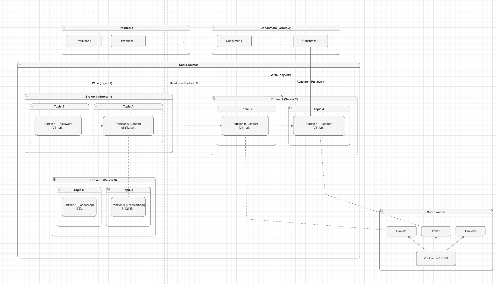

# 카프카 내부 동작 흐름



## 들어가며..

위 다이어그램은 실제 카프카 클러스터의 구조이다.    
3개의 브로커가 있고, 각 브로커는 여러 파티션의 리더 또는 팔로워 역할을 하고 있다.     

> 메시지 하나가 프로듀서로부터 컨슈머까지 도착하는 흐름을 정리하였다.    

---

## 프로듀서 - 메시지 송신 (출발지)

프로듀서가 메시지를 보낼 때 가장 먼저 해야 할 일은 **"이 메시지를 어느 파티션에 보낼 것인가"를 결정하는 것**이다.   

예를 들어, 주문 시스템에서 다음과 같은 메시지를 보낸다고 가정해 보자.

```json
{
  "userId": "user123",
  "orderId": "order456"
}
```

**프로듀서가** 파티션을 선택해서 메시지를 보낸다.  
정확히는 **프로듀서 클라이언트 내부의 Partitioner가** 선택한다.  
 
> 이 메시지는 Topic A의 Partition 0 또는 Partition 1 중 어디로 가야 할까?  
> 그 전에 어떤 파티션으로 가게 되는지에 대한 선택 기법을 알아야 한다.

### 파티션 선택 기법

**첫 번째 방법은 Key 기반 해싱이다.**   
userId를 키로 지정하면 같은 사용자의 메시지는 항상 같은 파티션으로 간다.   
다이어그램에서 Producer 1이 `Write (Key=K1)`을 하는 것처럼 말이다.   

> 이렇게 하면 같은 키의 메시지들은 순서가 보장되지만, 특정 키가 너무 많으면 그 파티션만 부하가 집중될 수 있다.  

**두 번째 방법은 라운드 로빈 방식이다.**  
메시지를 순서대로 파티션에 분산시킨다.   
단, Kafka 2.4 이후부터는 성능 향상을 위해 Sticky Partitioner를 기본으로 사용한다.  
한 배치 내의 메시지들을 같은 파티션으로 보낸 뒤 다음 배치는 다른 파티션으로 보낸다.

> 균등하게 분산되지만 순서는 보장되지 않는다.  

**세 번째는 파티션을 직접 지정하는 방법이다.**   
특별한 경우에만 사용한다.  

> **중간 정리**
> 
> **누가**: 프로듀서 (클라이언트)가 선택한다.  
> **어디서**: 프로듀서 내부의 Partitioner가 실행된다.  
> **언제**: 메시지를 보내기 전에 선택한다.  
> **브로커는**: 프로듀서가 이미 정한 파티션으로 보내면 그냥 받기만 한다.
> 
> 브로커는 파티션 선택에 관여하지 않는다.  
> 프로듀서가 "파티션 2에 저장해주세요"라고 요청하면 브로커는 그대로 파티션 2에 저장할 뿐이다.

### 프로듀서가 리더를 찾는다

파티션이 결정되면 이제 그 파티션의 리더가 어느 브로커에 있는지 알아야 한다.     

Producer 1이 Topic A의 Partition 0에 메시지를 보내려면 먼저 "Partition 0의 리더는 누구지?"를 물어봐야 한다.  

다이어그램을 보면 Topic A의 Partition 0의 리더는 Broker 1에 있다.

이런 정보는 메타데이터로 관리되는데, 예전에는 Zookeeper가 했고 최근에는 KRaft가 한다.   
다이어그램 하단의 Coordination 부분이 바로 이 역할이다.  

프로듀서는 메타데이터를 확인하고 나서 Broker 1에 직접 연결해서 메시지를 보낸다.   
메타데이터를 매번 물어보면 비효율적이니까 캐싱해두고, 변경이 있을 때만 업데이트한다.  

다이어그램에서 Producer 2는 좀 더 복잡한 패턴을 보여준다.   
Partition 0에서 읽고, 처리한 다음 Key=K2로 쓰고, 다시 Partition 1에서 읽는다.   
이런 패턴은 스트림 처리에서 자주 볼 수 있다.   
예를 들어 여러 파티션의 주문 데이터를 읽어서 집계한 다음, 결과를 다른 파티션에 쓰는 경우다.  

---

## 브로커 - 메시지를 저장하고 복제

### 리더가 메시지를 받는다

이제 메시지가 Broker 1에 도착했다.    
Broker 1은 Topic A의 Partition 0의 **리더**다.   

리더는 메시지를 받으면 파티션의 맨 끝에 추가한다.   
중간에 끼워넣는 것은 불가능하다.   

항상 끝에 추가되기 때문에 (Append-only) 디스크 쓰기가 빠르다.  

```
[Broker 1 - Topic A Partition 0 (Leader)]
오프셋 0: message1
오프셋 1: message2
오프셋 2: message3 (방금 추가된 메시지)
```

오프셋은 메시지의 위치를 나타내는 번호다.   
0번부터 시작해서 메시지가 추가될 때마다 1씩 증가한다.  

### 팔로워가 리더로부터 복제받는다

만약 Broker 1만 메시지를 가지고 있으면 Broker 1이 죽었을 때 데이터가 다 날아간다.  
그래서 다른 브로커에도 복제해야 한다.  

다이어그램을 보면 Broker 3이 Topic A Partition 0의 **팔로워**다.   
팔로워는 리더와 지속적으로 동기화를 유지한다.

복제 과정은 **팔로워가 주도**한다:

1. **Broker 3(팔로워)가** Broker 1(리더)에게 "새로운 메시지 있으면 주세요"라고 요청한다 (Fetch Request)
2. **Broker 1(리더)가** 새 메시지를 Broker 3에게 보낸다
3. **Broker 3(팔로워)가** 받아서 똑같은 오프셋 위치에 저장한다
4. **Broker 3(팔로워)가** "저장 완료했어요"라고 Broker 1에게 알린다

> 1 ~ 4번 과정이 끝나면 Broker 1과 Broker 3 모두 오프셋 2번까지 메시지를 가지고 있게 된다.  
> 이제 이 메시지는 드디어 "커밋됐다"고 말할 수 있다.  
> 
> **커밋된 메시지만 컨슈머가 읽을 수 있다.**    

### ISR (동기화된 복제본들)

리더를 잘 따라오고 있는 팔로워들의 목록을 ISR(In-Sync Replicas)이라고 한다. 

다이어그램의 경우 다음과 같다.

```
Topic A Partition 0
- Leader: Broker 1
- ISR: [Broker 1, Broker 3]
```

만약 Broker 3이 어떤 이유로 느려져서 리더를 따라잡지 못하면 **컨트롤러가** ISR에서 제외한다.   
다시 따라잡으면 ISR에 재포함된다.   
ISR에 있는 팔로워만 리더가 죽었을 때 새 리더가 될 수 있다.  

### acks 설정 - 얼마나 안전하게 보낼 것인가

**프로듀서는** acks 설정으로 "언제 메시지 전송이 성공했다고 볼 것인가"를 정할 수 있다.

`acks=0`이면 프로듀서는 메시지를 보내기만 하고 응답을 기다리지 않는다.   
가장 빠르지만 메시지가 유실될 수 있다.  

`acks=1`이면 리더만 저장하면 성공이다.  
어느 정도 안전하지만, 리더가 죽고 팔로워가 아직 복제를 받지 못했다면 메시지가 유실될 수 있다.  

`acks=all`이면 모든 ISR이 저장해야 성공이다.   
가장 안전하지만 가장 느리다.   
프로덕션 환경에서는 보통 이 설정을 쓴다.   
보통 `min.insync.replicas=2`와 함께 사용해서 "최소 2개의 복제본에 저장되어야 한다"고 보장한다.  

---

## 컨슈머 - 메시지를 가져간다

### 컨슈머가 Pull 방식으로 가져온다

이제 메시지가 브로커에 안전하게 저장됐다.   
**컨슈머가** 이 메시지를 가져갈 차례다.  

카프카의 특징은 브로커가 컨슈머에게 메시지를 푸시하지 않는다는 점이다.   
**컨슈머가** 브로커에게 "메시지 주세요"라고 요청해서 가져온다(Pull).   
다이어그램에서 Consumer 1이 "Read from Partition 0"을 하는 것처럼 말이다.  

```java
ConsumerRecords<String, String> records = consumer.poll(Duration.ofMillis(100));
```

컨슈머는 이렇게 poll()을 호출해서 메시지를 가져온다.   
"Partition 0의 오프셋 50번부터 메시지 주세요"라고 요청하면 브로커가 50, 51, 52... 이런 식으로 메시지를 준다.  

Pull 방식의 장점은 **컨슈머가** 자기 속도에 맞춰서 가져갈 수 있다는 것이다.   
컨슈머가 느리면 천천히 가져가면 되고, 빠르면 많이 가져가면 된다.   
브로커가 푸시하는 방식이면 컨슈머가 처리하지 못할 만큼 밀어넣을 수 있다.  

단점은 완벽한 실시간은 아니라는 것이다.    
poll() 주기만큼 지연이 생긴다.   
100밀리초마다 poll()하면 최대 100밀리초 지연이 있을 수 있다.  

### 컨슈머 그룹 - 파티션을 나눠 갖는다

다이어그램을 보면 Consumer Group A에 Consumer 1과 Consumer 2가 있다.   
중요한 규칙이 있는데, 한 파티션은 그룹 내에서 한 컨슈머만 읽을 수 있다.  

```
Consumer 1 → Topic A Partition 0 담당
Consumer 2 → Topic A Partition 1 담당
```

이렇게 파티션을 나눠서 각자 처리한다.  
그래서 파티션이 2개면 컨슈머 2개까지 병렬 처리가 가능하다.   
컨슈머를 3개로 늘려도 파티션이 2개면 1개는 놀게 된다.  

반대로 컨슈머가 1개인데 파티션이 2개면 그 컨슈머가 두 파티션을 모두 담당한다.   
가능은 하지만 병렬 처리의 이점을 못 살린다.  

### 컨슈머 코디네이터가 리밸런싱한다

컨슈머가 추가되거나 죽으면 **컨슈머 코디네이터(Consumer Coordinator)가** 파티션을 다시 나눈다.   
이걸 리밸런싱이라고 한다.  

예를 들어 Consumer 2가 죽으면 코디네이터가 Consumer 1에게 Partition 0과 Partition 1을 모두 할당한다.  
새로운 Consumer 3이 추가되면 코디네이터가 파티션을 다시 분배한다.  
리밸런싱 중에는 잠깐 동안 메시지 처리가 멈춘다.  

**컨슈머는** 항상 리더 파티션에서 읽는다.   
Broker 3에 팔로워 파티션이 있어도 Consumer 1은 Broker 1의 리더 파티션에서 읽는다.   
모든 읽기와 쓰기는 리더를 통해서만 이루어진다.  

---

## 오프셋 커밋 - 어디까지 읽었는지 기억한다

### 커밋하지 않으면 다시 읽는다

**컨슈머가** 메시지를 가져와서 처리했다.   
주문을 데이터베이스에 저장했고, 결제도 처리했다.   
이제 "여기까지 처리했어요"라고 표시해야 한다.   

> 이게 오프셋 커밋이다.

```java
for (ConsumerRecord<String, String> record : records) {
    processOrder(record);  // 비즈니스 로직 처리
}
consumer.commitSync();  // 여기까지 처리 완료
```

오프셋은 `__consumer_offsets`라는 특별한 내부 토픽에 저장된다.     
컨슈머 그룹마다, 토픽마다, 파티션마다 어디까지 읽었는지 기록된다.    

만약 Consumer 1이 오프셋 52까지 처리하고 커밋했는데 그 직후에 죽었다고 하자.   
다시 시작하거나 다른 컨슈머가 이 파티션을 맡으면 오프셋 53부터 읽기 시작한다.   
오프셋 52까지는 이미 처리됐다고 기록되어 있으니까.  

### 자동 커밋 vs 수동 커밋

자동 커밋을 쓰면 일정 시간마다 자동으로 커밋된다. 
간단하지만 문제가 있다. 
메시지를 가져왔는데 처리하기 전에 자동으로 커밋되면, 처리 중에 죽었을 때 그 메시지를 다시 읽지 못한다. 
메시지가 유실된다.

수동 커밋은 처리가 완전히 끝난 다음에 명시적으로 커밋한다. 
안전하지만 코드가 조금 복잡해진다. 
> 실무에서는 보통 수동 커밋을 쓴다고 한다. - feat 차헌 형님

### At Least Once vs Exactly Once

수동 커밋을 써도 완벽하지는 않다.   
메시지를 처리하고 커밋하려는 순간에 죽으면 어떻게 될까?   

메시지는 처리됐는데 커밋은 안 됐다.  
다시 시작하면 그 메시지를 또 처리한다.   
중복 처리가 발생한다.   
이걸 At Least Once(최소 한 번) 방식이라고 한다.  

중복 처리를 막으려면 Exactly Once(정확히 한 번)를 써야 한다.     
프로듀서의 Idempotence와 Transaction을 사용하면 가능하다.     
하지만 복잡하고 느려서 꼭 필요한 경우(금융, 결제)에만 쓴다.   
대부분은 At Least Once로 충분하다고 한다.  

---

## Coordination - 클러스터를 조율한다

다이어그램 하단의 Coordination 부분은 클러스터 전체를 관리한다. 

> Zookeeper나 KRaft가 이 역할을 한다.

### Coordination이 메타데이터를 관리한다

"Topic A의 Partition 0 리더는 Broker 1이다", "ISR은 Broker 1과 Broker 3이다" 같은 정보를 저장하고 관리한다.   
프로듀서와 컨슈머는 이 정보를 보고 어느 브로커에 연결해야 하는지 안다.  

### Coordination이 리더를 선출한다

Broker 1이 죽으면 어떻게 될까? **Coordination이** 감지하고 새로운 리더를 선출한다.

```
1. Coordination이 Broker 1의 응답이 없음을 감지한다 (Heartbeat 끊김)
2. Topic A Partition 0의 ISR을 확인한다: [Broker 1, Broker 3]
3. ISR에서 Broker 3을 새 리더로 선출한다
4. 메타데이터를 업데이트한다: "이제 리더는 Broker 3이다"
5. 프로듀서와 컨슈머에게 알린다
```

이 과정은 보통 30초 이내에 자동으로 진행된다. 
프로듀서와 컨슈머는 메타데이터가 바뀐 걸 알고 Broker 3으로 재연결한다. 
Broker 3은 Broker 1과 똑같은 데이터를 가지고 있으니까 오프셋 2번 다음부터 이어서 처리하면 된다. 

> 데이터 유실 없이 자동으로 복구된다.

### Zookeeper에서 KRaft로

예전에는 Zookeeper라는 별도의 시스템이 이 역할을 했다고 한다.   
Zookeeper 클러스터를 따로 운영해야 해서 복잡도가 제법 있던 모양이다.   

Kafka 3.0부터는 KRaft라는 방식을 쓰기 때문에, 카프카 자체에서 Raft 프로토콜로 조율한다. 

> 외부 의존성이 없어지고 운영이 간단하다는 장점이 있지만, 아직 많은 회사들이 Zookeeper를 사용하는 모양이다. (사실 피셜임) 

---

## 마무리

메시지 하나가 처리되기까지의 흐름을 정리하면 다음과 같다.

1. **프로듀서가** 메시지를 보낸다 → **파티셔너가** 파티션을 선택한다 → **프로듀서가** 메타데이터를 보고 리더 브로커를 찾는다.

2. **리더 브로커가** 메시지를 받아서 파티션의 끝에 추가한다 → 오프셋이 하나 증가한다.

3. **팔로워 브로커들이** 리더에게서 메시지를 복제받는다 → 모든 ISR이 저장하면 메시지가 커밋된다.

4. **컨슈머가** poll()로 메시지를 가져간다 → 리더 파티션에서만 읽는다 → 파티션은 컨슈머 그룹 내에서 하나의 컨슈머만 담당한다.

5. **컨슈머가** 메시지를 처리한다 → 비즈니스 로직을 실행한다 → 처리가 끝나면 오프셋을 커밋한다.

6. 장애가 나면 **Coordination이** 자동으로 리더를 선출하고 메타데이터를 업데이트한다 → **컨슈머는** 마지막 커밋된 오프셋부터 다시 읽는다.

## 용어 정리

**파티션 (Partition)**: 병렬 처리의 기본 단위. 
파티션 수만큼 컨슈머를 늘려서 병렬로 처리할 수 있다.

**리더와 팔로워 (leader, follower)**: 모든 읽기와 쓰기는 리더를 통한다.   
팔로워는 복제만 한다.  
리더가 죽으면 팔로워가 승격한다.  

**오프셋 (offset)**: 메시지의 위치를 나타낸다.   
커밋으로 "여기까지 처리했다"를 기록한다.   
장애 시 여기서부터 재시작한다.  

**ISR (In-Sync Replica)**: 리더와 동기화된 복제본들이다.   
ISR에 있어야 리더가 될 수 있다.   
ISR이 줄어들면 문제가 있다는 신호다.  

**Pull 방식**: 컨슈머가 자기 속도에 맞춰서 가져간다.   
백프레셔가 자연스럽게 처리된다.  

**Coordination**: 클러스터 전체를 조율한다.   
메타데이터 관리, 리더 선출, 장애 감지를 담당한다.  

## 설계 시 고려할 점

**파티션 수는 어떻게 정할까?** 예상 처리량을 컨슈머 처리 속도로 나눈다.   
초당 10,000개 메시지를 처리해야 하는데 컨슈머 하나가 초당 1,000개를 처리한다면 최소 10개 파티션이 필요하다.   
여유를 두고 15개 정도로 시작한다.   
파티션은 나중에 늘릴 수 있지만 줄이는 건 어렵다.  

**Replication Factor는?** 테스트나 개발 환경이면 2, 프로덕션이면 3이 표준이다.   
3이면 브로커 2대가 동시에 죽어도 견딘다.   
금융이나 결제처럼 아주 중요한 시스템은 4 이상도 쓴다. 

> 대부분의 경우 카프카 기본 설정은 안 건드려도 될 만큼 기본 튜닝이 괜찮게 설정된 모양이다.

**acks와 min.insync.replicas는?** `acks=all`과 `min.insync.replicas=2`를 함께 쓴다. 

"최소 2개 복제본에 저장되어야 성공"이라는 의미다.   
Replication Factor가 3이면 브로커 하나가 죽어도 최소 2개는 남으니까 계속 쓸 수 있다.  

**커밋은 언제?** 처리가 완전히 끝난 다음에 수동으로 커밋한다.     
자동 커밋은 간단하지만 메시지 유실이나 중복 처리 위험이 있다.   
실무에서는 대부분 수동 커밋을 쓴다고 한다.

---
## 끝
