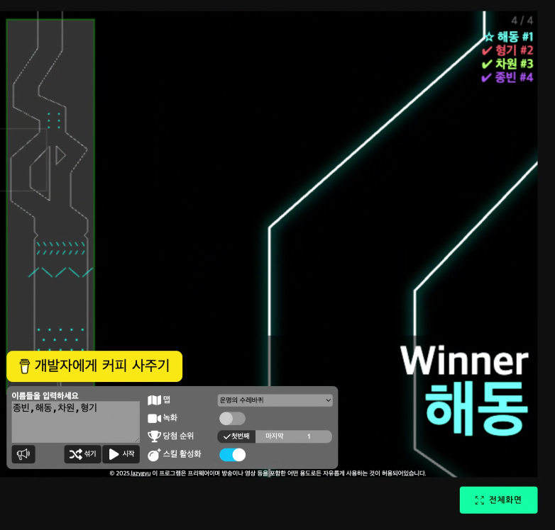

## 토이 프로젝트

### 

## 네 명 업무 분배 (MSA 구조 기반 풀필먼트 Kafka 프로젝트)

| 팀원 | 담당 도메인 서비스          | 주요 역할 및 책임                                                                                  | 주요 Kafka 역할                   |
|------|-----------------------------|--------------------------------------------------------------------------------------------------|---------------------------------|
| 1번  | 주문 서비스                 | 주문 생성, 주문 상태 관리 API 개발 및 DB 연동, 주문 이벤트 프로듀서 및 주문 이벤트 컨슈머          | 주문 관련 이벤트 프로듀서 및 컨슈머 |
| 2번  | 재고 관리 서비스           | 재고 상태 관리, 재고 예약 로직 개발, 재고 이벤트 프로듀서 및 재고 부족 알림 이벤트 컨슈머          | 재고 이벤트 프로듀서 및 컨슈머       |
| 3번  | 배송 서비스                 | 배송 요청 API 개발, 배송 상태 추적 및 업데이트, 배송 이벤트 프로듀서 및 배송 상태 이벤트 컨슈머    | 배송 이벤트 프로듀서 및 컨슈머       |
| 4번  | 반품 및 알림 서비스        | 반품/교환 처리 로직 개발 및 알림 서비스 구현, 알림 이벤트 컨슈머 및 다양한 이벤트 구독 및 전송 관리 | 반품 이벤트 프로듀서 및 이벤트 기반 알림 컨슈머 |

---

### 협업 및 실습 방식 제안

- 각자 맡은 도메인 서비스는 독립 마이크로서비스 형태로 구현 (각자 분리된 코드베이스/DB)
- Kafka 이벤트 토픽 기반 비동기 통신으로 서비스 간 데이터 연동 및 이벤트 전파
- 정기적인 통합 테스트로 메시지 흐름 최종 확인 및 장애 대응 시나리오 수행
- 역할 교차 학습을 위해 구현 중간에 프로듀서-컨슈머 역할과 API 호출 역할을 순환하며 수행 가능

### 서비스 담당
1번: 김해동
2번: 김차원
3번: 신형기
4번: 박종빈 

