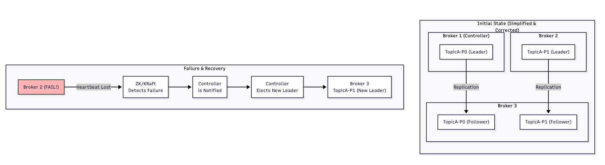

# 카프카의 장애 극복 시스템

## 브로커

브로커는 단순히 메세지를 저장하는 서버의 역할도 수행하지만.  
클러스터의 수많은 브로커중 **단 하나의 브로커** 는 특별한 기능을 담당하게 된다.  

> 이런 브로커를 컨트롤러 브로커 라고 부른다.

## 컨트롤러 브로커
컨트롤러 브로커는 총 사령관 과 같은 역할을 수행한다.  

주키퍼가 엄마 라면, 브로커는 아빠 같은 느낌이랜다. 

왜냐면, 클러스터 라는 환경은 모든 상태에 대해서 변경을 관리하고 결정하는 책임을 가지고 있기 때문이다.

클러스터 내에서는 컨트롤러 브로커가 결정하는 책임을 갖게 된다.   
- 주키퍼가 권력 1순위
- 컨트롤러 브로커가 권력 2순위

하지만 이 컨트롤러 브로커도 결국 주키퍼에 의존적인 성향을 갖는다.

대표적으로 리더 선출이라는 과정을 통해서 특정 파티션에 리더 브로커에 장애가 발생하게 된다면, 
살아있는 브로커 중에서 새로운 리더를 선출하고 전파하는 과정을 수행하고 

클러스터에 있는 멤버들을 관리해주면서, 새로운 브로커가 참여하거나 기존 브로커가 다운되었을때, 
이를 감지하고 클러스터의 메타데이터를 갱신하는 역할을 수행하게 된다.

또한 토픽 관리를 하면서, 새로운 토픽이 추가되거나, 삭제되거나 변경될때 필요한 작업을 조율해주기도 한다.

( 컨트롤러 브로커의 장애가 발생해도 리더 선출을 통해 극복할 수 있다 - 장애 없는 브로커를 선출해서 공백을 매꾼다. ) 

그런데, 클러스터 구조에서 장애가 발생한다면 어떤식으로 매커니즘이 돌아가게 될까 ?

클러스터가 존재하는 이유는 확장성과 고가용성이다.

그중에도 클러스터는 문제없이 동작하는 장애극복 능력에 특출되어 있는 형태이다.

이 과정에서 ISR 이라는 중요한 개념이 도입이 되는데 이 개념을 사용해야 클러스터 라고 할 수 있다.

## ISR
카프카 클러스터의 ISR은 동기화된 복제본 그룹으로.  
특정 파티션의 리더와 완벽하게 동기화된 상태를 유지하고 있는 팔로워 ( 리더가 아닌 브로커 ) 들의 집합을 말한다.  

팔로워들은 리더브로커의 데이터를 꾸준하게 복제하면서 ISR 그룹에 포함되어 있고, 너무 뒤처지게 된다면 
자동으로 ISR 그룹에 제외되면서 동작을 한다.

> ISR 은 정상적으로 잘 동작하면서 복사를 제대로 진행하고 있는 팔로워들의 집합이다.

이제 브로커 하나가 다운 되었을때 어떤일이 벌어지는지 확인해보자. 

## 브로커 하나가 다운되었을때

1 ) 장애 상황 ( 네트워크 문제 / 하드웨어 고장 등)
2 ) 장애 탐지 ( 주기적으로 난 살아있다 라고 헬스체크를 주키퍼에 보낸다  )
3 ) 헬스체크가 오지 않는다면 주키퍼가 맛이간 브로커를 감지하고 클러스터에서 내보내라는 판단을 하게 된다.
4 ) 주키퍼가 컨트롤러에게 알려준다 ( 맛이간 브로커를 )
5 ) 컨트롤러 브로커는 재선출 과정을 진행하게 된다.
6 ) 컨트롤러는 장애가 발생했던 브로커의 모든 파티션 목록을 확인하게 되고 
해당 파티션의 ISR 목록에서 가장 적합한 팔로워를 새로운 리더로 선출하면서 동작하게 된다.
7 ) 메타 데이터 업데이트 과정이 필요하다. 다른 브로커들에게 어 너희 새로운 리더 뽑혔어 ! 얘로 업데이트 해 ! 라고 브로드캐스팅 하면서 진행하게 된다.

클라이언트 레벨에서 프로듀서 와 컨슈머 에 대해서도 이 정보가 전파가 될 것고, 다음 요청부터는 새로운 리더에게 라우팅 되면서 트래픽을 보내게 된다.

> 개발자가 관여하지 않고 자동으로 일어나게 된다.  
> 그래서 무중단으로 동작할 수 있다.  

