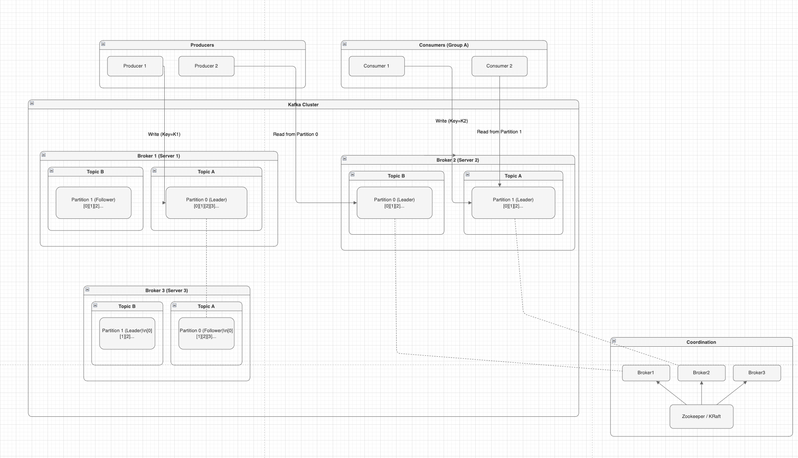

## 카프카 내부 흐름 정리

## 프로듀서에서 파티션 리더로

프로듀서는 특정 토픽에 메시지를 전송한다.
토픽은 여러 파티션으로 나뉘어 있고, 각 파티션은 리더(Leader)와 팔로워(Follower) 구조를 가진다.

프로듀서는 메시지를 어느 파티션에 기록할지 결정해야 한다.  
파티셔너(Partitioner) 정책에 따라 해시 키 기반, 라운드 로빈, 혹은 지정된 파티션으로 결정된다.  

결정된 파티션의 리더가 어느 브로커에 있는지는 메타데이터를 통해 확인한다.  
이 메타데이터는 과거에는 Zookeeper, 최근에는 KRaft를 통해 관리된다.  

프로듀서는 먼저 리더 파티션이 위치한 브로커 정보를 받아온 후, 그 브로커에 직접 연결해 메시지를 보낸다.

---

## 브로커 저장과 복제

브로커가 메시지를 수신하면, 해당 파티션 리더의 마지막 오프셋 위치에 메시지를 추가한다.  
리더 파티션에 기록된 메시지는 팔로워 파티션에도 복제되어야 한다.  

리더는 복제가 필요한 팔로워들에게 데이터를 전송하고, 팔로워는 이를 받아 동일한 오프셋 위치에 저장한다.

리더와 팔로워가 모두 정상적으로 동기화된 경우에만 "커밋 가능(Committed)"한 데이터로 간주된다.  

이 복제 메커니즘 덕분에 내결함성(Fault Tolerance)이 확보된다.  

브로커 하나가 죽더라도 다른 브로커의 팔로워가 리더 역할을 이어받을 수 있다.

---

## 컨슈머의 폴링

컨슈머는 주기적으로 브로커에 요청을 보내 새로운 메시지를 가져온다.  
이 방식은 푸시(Push)가 아니라 풀(Pull)이라는 점이 중요하다.  

컨슈머는 특정 파티션으로부터 메시지를 읽고, 읽은 위치는 오프셋으로 관리된다.  
컨슈머 그룹 내부에서는 파티션이 분산되어, 서로 다른 컨슈머가 병렬로 메시지를 처리한다.  

단, 폴링 방식은 구조적으로 완전한 실시간성을 보장하지 않는다.  
주기마다 요청을 보내기 때문에 수 밀리초에서 수 초 단위의 지연이 존재할 수 있다.  

---

## 비즈니스 처리와 커밋

컨슈머는 가져온 메시지를 기반으로 비즈니스 로직을 실행하거나 데이터베이스에 저장하는 등의 처리를 수행한다.  
메시지를 정상적으로 처리했다면 컨슈머는 해당 오프셋을 커밋(Commit)한다.  

커밋이 완료되면 이후 재시작 시 해당 오프셋 이후의 메시지부터 읽게 된다.  
커밋이 되지 않았다면 장애 발생 시 같은 메시지를 다시 읽게 된다.  
즉, 커밋은 메시지 처리의 경계이자 정확한 한 번 처리(Exactly Once) 또는 적어도 한 번 처리(At Least Once)를 보장하는 초석이 된다.  

---

## 정리

1. 프로듀서가 토픽에 메시지를 전송하면 파티션 리더가 있는 브로커에 저장된다
2. 브로커는 메시지를 오프셋 순서대로 기록하고 팔로워에게 복제한다
3. 컨슈머는 주기적으로 메시지를 폴링하여 오프셋 기준으로 읽기를 진행한다
4. 메시지 처리 후 커밋하여 다음 읽기 위치를 보장한다